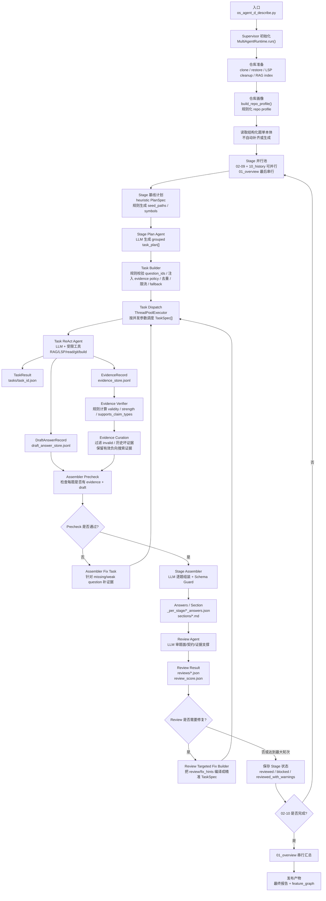
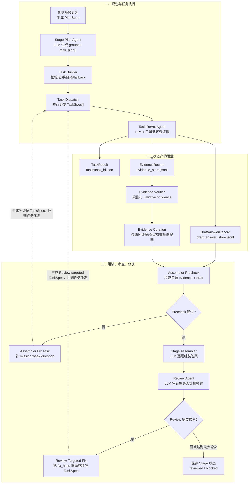
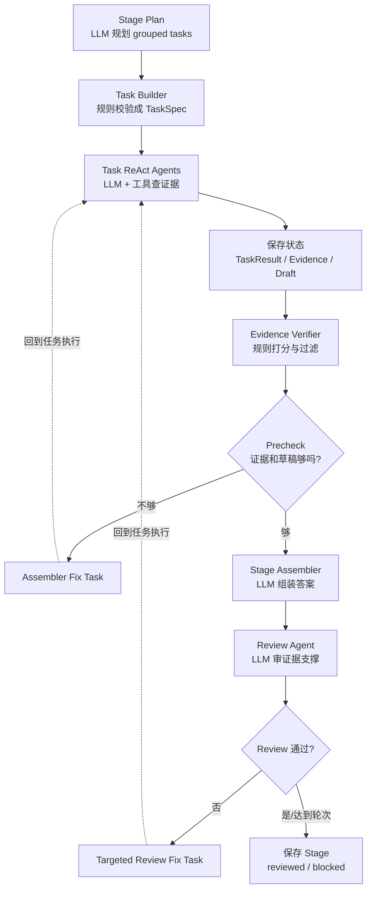
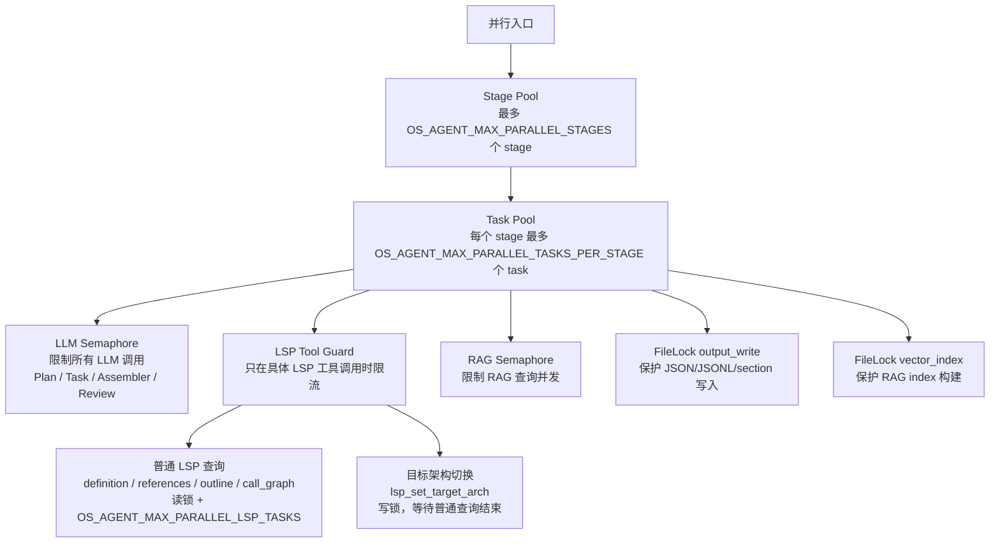
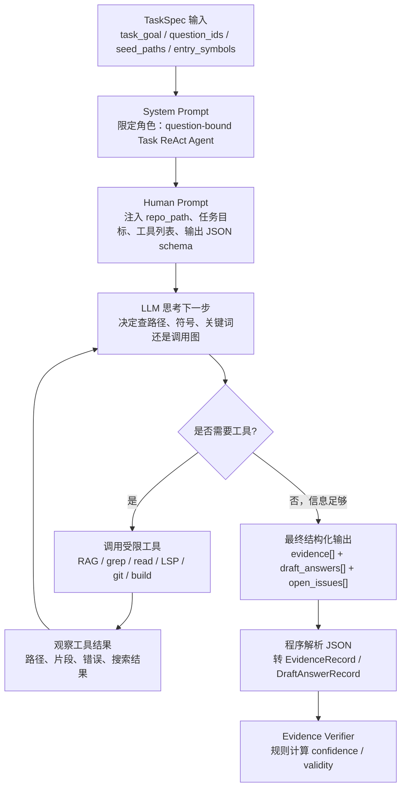
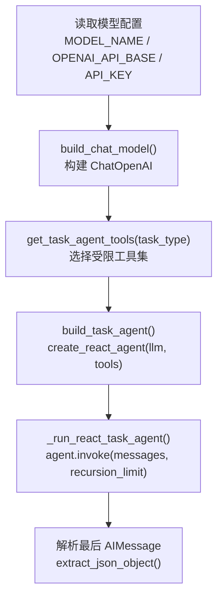
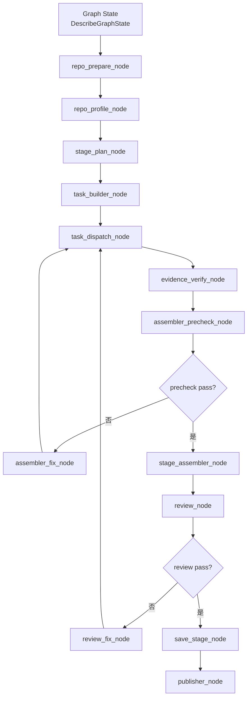

# OS-Agent D Multi-Agent 代码审查与架构说明

OS-Agent D 的 Multi-Agent 改造。重点说明：整体流程、节点设计、状态保存、断点续传、锁与并发、规则和 LLM 的分工，以及当前实现中仍需改进的地方。


## 1. 总览

OS-Agent D 现在默认进入 `core.describe_graph.MultiAgentRuntime`。

旧串行 `Plan -> Execute -> Review` Describe 链路已经从 `os_agent_d_describe.py` 删除；`--multi-agent` 仍可传入，但只作为兼容旧脚本的 no-op。

当前 Multi-Agent 的核心思想是：

```text
Supervisor 用程序实现，负责调度、并行、锁、断点续传和文件状态。
Stage Plan Agent、Task ReAct Agent、Stage Assembler、Review Agent 使用 LLM。
结构化题单本体、Task Builder 校验、Evidence Verifier、Precheck、Schema Guard、Evidence Curation、Feature Graph Publisher 使用规则程序。
```

也就是说，系统不是把所有事情都交给 LLM，而是把 LLM 放在需要语义判断的位置，把确定性工程逻辑留给程序。

主要代码位置：

| 模块 | 作用 |
|---|---|
| `core/describe_graph.py` | Multi-Agent 主流程、调度、断点、锁、Assembler、Review fix loop |
| `core/agent_graph_state.py` | `TaskSpec`、`TaskResult`、`EvidenceRecord`、`DraftAnswerRecord` 等状态结构 |
| `core/task_builder.py` | LLM task_plan 的程序化校验、分组、fallback |
| `core/task_agents.py` | Task ReAct Agent，负责执行小任务、调用工具、产出证据和草稿 |
| `core/agent_builder.py` | LLM、ReAct Agent、工具集合构建 |
| `core/describe_stage_qa/02-09*.json` | 已 materialize 的结构化题单本体，包含 feature、三态规则、证据策略、结构化事实和图谱标签 |
| `core/feature_schema_bank/` | 离线生成/维护结构化字段的规则库；运行时不自动调用它补齐题单 |
| `core/evidence_store.py` | 证据黑板，append-only JSONL |
| `core/draft_answer_store.py` | Task Agent 草稿答案 JSONL |
| `core/evidence_verifier.py` | 规则化证据有效性、强度、claim 支撑能力计算 |
| `core/feature_graph.py` | Feature/Question/Evidence/File/Symbol/Claim 图谱导出 |
| `core/describe_stage_review.py` | Review Agent 输入构造、Review JSON 解析与规整 |

## 2. 总体流程图

下面这张图是完整主流程。


## 3. Stage 内部详细流程

下面是单个技术章节的细化流程。



这张图要按三层理解：

1. **规划与任务执行**：先由规则生成基线计划，再由 LLM 规划 grouped task，最后并行执行 Task ReAct Agent。
2. **状态产物落盘**：Task 一完成就保存 `TaskResult`、`EvidenceRecord`、`DraftAnswerRecord`，然后由规则程序校验证据。
3. **组装、审查、修复**：Precheck 先判断证据和草稿够不够；够了才进入 Assembler；Review 如果发现证据不支撑答案，就生成 targeted fix task 回到 Task Dispatch。

如果前面的详细图仍然显得信息量较大，可以先看下面这个极简版：



## 4. 节点逐项解释

### N0 入口

位置：`os_agent_d_describe.py`

作用：

- 读取 `REPO_URL`。
- 直接调用 `run_describe_graph()`。
- `--multi-agent` 仅保留为兼容旧脚本的 no-op。

旧串行 Describe 链路和旧整章 JSON-QA repair 已删除；当前入口不再提供回退分支。

### N1 Supervisor 初始化

位置：`core/describe_graph.py` 的 `MultiAgentRuntime`

Supervisor 是程序，不是 LLM。

它负责：

- 初始化 `run_id`
- 创建 `_agent_state/` 目录
- 初始化 `EventLogger`
- 初始化 `EvidenceStore`
- 初始化 `DraftAnswerStore`
- 读取并发参数
- 创建 LLM/LSP/RAG semaphore
- 记录 run_state 和 graph_state

Supervisor 不用 LLM 的原因：

```text
并发、锁、断点、状态文件写入必须确定可控。
这些是工程控制面，不适合交给 LLM 决策。
```

### N2 仓库准备

位置：`_repo_prepare()`

规则程序完成：

- 如果本地仓库存在，执行 tracked worktree restore 检查。
- 如果不存在，clone repo。
- 清理 LSP 临时文件。
- 构建或复用 RAG index。
- RAG index 写入时使用 `vector_index` 文件锁。

这里没有 LLM。

### N3 仓库画像

位置：`build_repo_profile()`

规则程序完成：

- 根据目录、构建文件、源码语言、常见 OS 框架路径生成 repo profile。
- 输出如 `framework_guess`、`arch_guess`、`core_paths` 等信息。

这些信息会给 Stage Plan Agent 作为上下文，但生成画像本身不是 LLM。

### N4 Stage 并行池

位置：`MultiAgentRuntime.run()`

规则：

```text
02_boot_trap 到 09_debug_error，以及 10_history 可以并行。
01_overview 必须最后串行执行。
```

并行参数：

```env
OS_AGENT_MAX_PARALLEL_STAGES=2
```

注意：Stage 并行不等于 LLM 并发。所有 LLM 调用仍受全局 LLM semaphore 控制。

### S1 Stage 基线计划

位置：`plan_stage()` 和 `ensure_execution_steps()`

这是规则/启发式计划，不是 LLM。

作用：

- 生成 `PlanSpec`
- 给出 stage 的 seed paths、entry symbols、repo hotspots
- 作为 Stage Plan Agent 的基线

可以理解为：

```text
规则先给一份粗计划，LLM 再在这份计划上做 grouped task 规划。
```

### A1 Stage Plan Agent

位置：`_run_stage_plan_agent()`

这是 LLM 节点。

输入：

```text
stage_id
stage_title
题单 questions
heuristic PlanSpec
repo_profile summary
max_questions_per_task
max_tasks_total
```

输出：

```json
{
  "task_plan": [
    {
      "task_id": "task_08_protocol_support",
      "question_ids": ["Q08_006"],
      "task_type": "react_code",
      "agent_type": "react_code",
      "task_goal": "查证协议支持情况：Ethernet/ARP/IPv4/IPv6/ICMP/UDP/TCP/DHCP/DNS",
      "group_reason": "多选协议支持题，需逐项搜索协议关键词",
      "query": "搜索 Ethernet、ARP、IPv4、UDP、TCP 等协议相关定义和实现",
      "seed_paths": ["net", "tcp", "udp", "lwip", "smoltcp", "src"],
      "entry_symbols": ["eth", "arp", "ipv4", "udp", "tcp"],
      "expected_evidence_types": ["definition", "implementation_body", "search"]
    }
  ]
}
```

这里的核心是“LLM 提议任务”，但它没有最终决定权。

### R1 Task Builder

位置：`build_tasks_from_llm_plan()`

这是规则节点。

它做：

- 校验 `question_ids` 是否属于当前 stage 题单。
- 无效 question id 丢弃。
- task 过大则按 `OS_AGENT_MAX_QUESTIONS_PER_TASK` 切分。
- task 总数超过 `OS_AGENT_MAX_TASKS_PER_STAGE_TOTAL` 则截断。
- 补默认 seed paths 和 entry symbols。
- 如果 LLM 没产出有效 task，则 fallback 到 `build_tasks_for_stage()`。

关键环境变量：

```env
OS_AGENT_MAX_QUESTIONS_PER_TASK=4
OS_AGENT_MAX_TASKS_PER_STAGE_TOTAL=80
```

fallback 规则：

```text
每题至少 discovery。
题面涉及构建/平台 -> build_platform。
题面涉及调用链/路径/flow -> flow。
题面涉及结构体/接口/definition -> definition。
题面涉及 stub/todo/ENOSYS -> implementation_state。
```

### T0 Task Dispatch

位置：`_run_tasks()`

这是程序调度节点。

作用：

- 检查 task 是否已完成。
- 如果 `status=done` 且不是 force stage，则跳过。
- 使用 `ThreadPoolExecutor` 并行执行 task。
- 每个 task 完成后立即保存 `TaskResult`。
- 同步追加 evidence 和 draft。

参数：

```env
OS_AGENT_MAX_PARALLEL_TASKS_PER_STAGE=3
```

### T1 Task ReAct Agent

位置：`run_task_agent()` 和 `_run_react_task_agent()`

这是 LLM 节点。

Task Agent 是一个小型 ReAct Agent，不是普通工具函数。它拿到一个 `TaskSpec` 后，会在受限工具集里自己决定怎么查证据。

例如：

```json
{
  "task_id": "task_08_send_path_trace",
  "stage_id": "08_network",
  "question_ids": ["Q08_004"],
  "task_type": "react_lsp",
  "task_goal": "追踪 sys_sendto 发送路径",
  "seed_paths": ["syscall", "net", "tcp", "udp", "src"],
  "entry_symbols": ["sys_sendto", "sendto", "udp_send", "net_tx"],
  "expected_evidence_types": ["definition", "call_site", "usage_flow"]
}
```

最终输出必须是结构化 JSON：

```json
{
  "status": "done",
  "summary": "未发现 sys_sendto 或网络发送路径。",
  "evidence": [
    {
      "evidence_type": "search",
      "question_ids": ["Q08_004"],
      "path": "syscall/syscall.c",
      "claim": "系统调用分发表中未出现 sys_sendto。",
      "snippet": "..."
    }
  ],
  "draft_answers": [
    {
      "question_id": "Q08_004",
      "value": "not_found",
      "used_evidence_ids": [],
      "confidence": "medium",
      "notes": "未发现发送路径。"
    }
  ],
  "open_issues": []
}
```

如果 ReAct 失败，会 fallback 到工具型 runner，保证 stage 不因为单个 task 失败而中断。

### R2 Evidence Verifier

位置：`verify_evidence()`

这是规则节点，不是 LLM。

评分规则：

```text
+ path 存在
+ line_start / line_end 可读
+ excerpt 非空
+ excerpt 真实出现在对应源码行或文件窗口
+ source_type 是 source_code
+ LSP 工具证据
+ read_code_segment 或 read_confirmed
- evidence_type 满足 feature/question 要求
- Generic Fallback / confidence=low
- Error / 无法生成调用图
- RAG/grep 只能作为 hint，不能单独支撑 implemented
- README/文档被用来支撑 implementation claim
- declaration-only 却支撑 implementation claim
- path 不存在或 excerpt 为空
```

特殊规则：

```text
结构化负向搜索可以作为 not_found 的有效证据，但必须覆盖 feature schema 中的关键词和目录。
例如：“未找到匹配 Ethernet|ARP|IPv4 的内容，已搜索 144 个文件”还需要记录 searched_directories / keywords / coverage_scope。
```

### R3 Evidence Curation

位置：`_store_evidence_by_question()` 和 `_curate_grouped_evidence()`

这是规则节点。

原因：`evidence_store.jsonl` 是 append-only，历史运行中可能积累旧坏证据。如果直接全部给 Assembler，会污染答案。

当前 curation 规则：

- 过滤 `invalid` 证据。
- 过滤历史坏搜索，如 `notes|not_found`。
- 保留可支撑 `not_found` 的全仓负向搜索证据。
- 按 `confidence`、`verifier_score`、是否有 path 排序。
- 对重复证据去重。

### C1 Assembler Precheck

位置：`_assembler_precheck()`

这是规则节点。

检查每个 question：

```text
是否有 evidence？
是否有 draft answer？
evidence 是否有效？
是否只有弱证据？
负向搜索是否足以支撑 not_found？
```

结果：

```json
{
  "stage_id": "08_network",
  "status": "pass",
  "missing_question_ids": [],
  "weak_question_ids": [],
  "covered_question_ids": ["Q08_001", "Q08_002"]
}
```

如果不通过，会进入 F1。

### F1 Assembler Fix Task

位置：`_build_precheck_fix_tasks()`

这是规则生成的补证据任务。

用途：

- 当某题没有 evidence 或没有 draft 时，生成补证据 task。
- 只补 blocked question，不整章重跑。

这类 fix 来源于程序化 precheck，不是 Review。

### A2 Stage Assembler

位置：`_assemble_stage()`

这是 LLM 节点。

它不是源码分析 Agent，不调源码工具。它只看：

```text
题目 question
Task Agent 草稿 draft_answers
curated evidence
evidence validity/confidence
```

职责：

- 逐题生成最终 JSON answer。
- 修正单选、多选、三态格式。
- 去重和压缩。
- 不得发明 evidence 没支持的事实。
- 如果证据不足，写 `not_found` 或 `待核实`。

### A3 Review Agent

位置：`_review_stage()` 和 `run_describe_stage_review()`

这是 LLM 节点，但没有源码工具。

它只审查三件事：

```text
1. 题面相符
2. JSON/选项/三态契约
3. evidence 是否支撑 value
```

它不评价 OS 本身设计优劣，只评价“答案 JSON 作为报告片段的质量”。

Review 输出示例：

```json
{
  "question_id": "Q08_006",
  "score_evidence": 0.75,
  "score_consistency": 1.0,
  "review": "证据搜索了协议关键词，支撑 not_found 结论。",
  "fix_hints": {
    "finding_type": "weak_evidence",
    "missing_evidence_types": ["search"],
    "recommended_keywords": ["ETHERNET", "ARP", "IPv4", "UDP", "TCP"],
    "recommended_seed_paths": ["src/", "include/", "net/"],
    "fix_goal": "补充其余协议关键词搜索证据。"
  }
}
```

### F2 Review Targeted Fix Builder

位置：`_build_fix_tasks()` 和 `_build_targeted_review_fix_task()`

这是规则节点。

它把 Review 的自然语言审查和 `fix_hints` 编译成精准 `TaskSpec`。

旧逻辑：

```text
低分题 -> 重新用 build_tasks_for_stage() 生成普通任务
```

现在：

```text
低分题 + review 文本 + findings + fix_hints
  -> 抽取 recommended_keywords
  -> 抽取 seed_paths
  -> 判断 task_type 是 react_code 还是 react_lsp
  -> 生成 question-bound targeted fix task
```

例子：

```json
{
  "question_ids": ["Q08_006"],
  "task_type": "react_code",
  "task_goal": "搜索 Ethernet/ARP/IPv4/IPv6/ICMP/UDP/TCP/DHCP/DNS；若没有找到，给出全仓负向搜索证据。",
  "entry_symbols": ["Ethernet", "ARP", "IPv4", "UDP", "TCP"],
  "expected_evidence_types": ["search", "definition", "implementation_body"]
}
```

### N5 Stage 状态保存

位置：`_stage_state_path()` 和 `_atomic_save_json()`

保存内容包括：

```json
{
  "stage_id": "08_network",
  "status": "reviewed",
  "assembler_precheck_status": "pass",
  "blocked_question_ids": [],
  "task_ids": [],
  "evidence_ids": [],
  "draft_answer_ids": [],
  "answer_path": "...",
  "section_path": "...",
  "review_path": "..."
}
```

当前还建议进一步增加：

```text
review_confidence
review_pass
reviewed_with_warnings
```

## 5. 状态与产物设计

### 5.1 状态目录

```text
output/<repo>/_agent_state/
├── run_state.json
├── graph_state.json
├── evidence_store.jsonl
├── draft_answer_store.jsonl
├── events.jsonl
├── stages/
├── tasks/
├── assembler/
├── reviews/
└── locks/
```

### 5.2 TaskSpec

`TaskSpec` 是任务输入。

```json
{
  "task_id": "task_08_protocol_support",
  "stage_id": "08_network",
  "question_id": "Q08_006",
  "question_ids": ["Q08_006"],
  "task_type": "react_code",
  "agent_type": "react_code",
  "task_goal": "查证协议支持情况",
  "query": "Ethernet ARP IPv4 UDP TCP protocol support",
  "seed_paths": ["net", "src", "include"],
  "entry_symbols": ["Ethernet", "ARP", "IPv4", "UDP", "TCP"],
  "expected_evidence_types": ["search", "definition", "implementation_body"],
  "metadata": {
    "source": "llm_task_plan"
  }
}
```

### 5.3 TaskResult

`TaskResult` 是任务执行状态。

```json
{
  "task_id": "task_08_protocol_support",
  "stage_id": "08_network",
  "question_ids": ["Q08_006"],
  "status": "done",
  "evidence_ids": ["ev_xxx"],
  "draft_answer_ids": ["draft_xxx"],
  "confidence": "medium",
  "errors": []
}
```

### 5.4 EvidenceRecord

`EvidenceRecord` 是证据黑板的核心。

```json
{
  "evidence_id": "ev_xxx",
  "stage_id": "08_network",
  "question_ids": ["Q08_006"],
  "task_id": "task_08_protocol_support",
  "path": "",
  "evidence_type": "search",
  "tool_name": "grep_in_repo",
  "confidence": "medium",
  "strength": "strong",
  "supports_claim_types": ["not_found"],
  "validity": "valid",
  "feature_ids": ["feat_08_network_q08_006"],
  "excerpt": "未找到匹配 Ethernet|ARP|IPv4|UDP|TCP 的内容（已搜索 144 个文件）"
}
```

### 5.5 DraftAnswerRecord

`DraftAnswerRecord` 保存 Task Agent 的逐题草稿。

```json
{
  "draft_answer_id": "draft_xxx",
  "task_id": "task_08_protocol_support",
  "stage_id": "08_network",
  "question_id": "Q08_006",
  "answer": {
    "question_id": "Q08_006",
    "value": [],
    "notes": "not_found"
  },
  "used_evidence_ids": ["ev_xxx"],
  "confidence": "medium"
}
```

## 6. 断点续传机制

### 6.1 Stage 级恢复

规则：

```text
status=reviewed:
  默认跳过。

status=blocked:
  不重跑整章。
  读取 assembler/<stage>_precheck.json。
  只补 blocked_question_ids。

OS_AGENT_FORCE_STAGES 命中:
  强制重跑该 stage。
  优先使用本轮 records，避免旧 evidence_store 污染本轮结果。
```

### 6.2 Task 级恢复

规则：

```text
tasks/<task_id>.json status=done:
  默认跳过。

force stage:
  重新执行 task。

fix task:
  永远生成新 task_id，不覆盖旧 task。
```

这样可以保留每一轮补证据的过程。

### 6.3 为什么 Task 完成就落盘

Task Agent 一完成就保存：

```text
tasks/<task_id>.json
evidence_store.jsonl
draft_answer_store.jsonl
events.jsonl
```

好处：

```text
中断后不丢已经完成的 task。
Review 或 Assembler 失败时，不需要重跑所有工具调用。
可以追踪每条 evidence 来自哪个 task。
```

## 7. 锁与并行设计

### 7.1 并发参数

```env
OS_AGENT_MAX_PARALLEL_STAGES=2
OS_AGENT_MAX_PARALLEL_TASKS_PER_STAGE=3
OS_AGENT_MAX_PARALLEL_LLM_CALLS=2
OS_AGENT_MAX_PARALLEL_LSP_TASKS=1
OS_AGENT_MAX_PARALLEL_RAG_TASKS=3
```

### 7.2 并行与锁图



### 7.3 锁释放原则

所有 semaphore / guard 都遵循：

```python
guard.acquire()
try:
    do_work()
finally:
    guard.release()
```

这样即使 LLM、LSP 或工具调用异常，也不会造成锁泄漏。

当前 LSP 锁粒度已经下沉到 tool call 层：`react_lsp` task 不再从开始到结束占用 LSP 资源。一个 ReAct task 在思考、grep、RAG、read 代码时只占 LLM 槽位；只有真正调用 `lsp_get_definition`、`lsp_get_references`、`lsp_get_document_outline`、`lsp_get_call_graph`、`lsp_set_target_arch` 时才进入 `lsp_tool_guard()`。

这带来的效果是：多个 LSP 型 task 可以同时进行非 LSP 工作，减少“拿着 LSP 锁等待 LLM 思考”的空转。`lsp_set_target_arch` 仍然是写锁，因为它会重启语言服务器，必须等待正在进行的普通 LSP 查询完成。

## 8. 规则与 LLM 的分工

### 8.1 LLM 参与

| 节点 | 是否 LLM | 原因 |
|---|---|---|
| A1 Stage Plan Agent | 是 | 需要根据题单和仓库画像做语义分组 |
| T1 Task ReAct Agent | 是 | 需要决定下一步查哪个符号、路径、工具 |
| A2 Stage Assembler | 是 | 需要把草稿和证据组织成自然语言答案 |
| A3 Review Agent | 是 | 需要判断答案是否真正被证据支撑 |

### 8.2 规则程序参与

| 节点 | 是否规则 | 原因 |
|---|---|---|
| N1 Supervisor | 是 | 调度、锁、断点必须确定 |
| R1 Task Builder | 是 | 校验 LLM 输出，防止 task 越界 |
| R2 Evidence Verifier | 是 | 需要可解释、稳定的置信度 |
| R3 Evidence Curation | 是 | 过滤历史坏证据，保证输入干净 |
| C1 Precheck | 是 | 检查 evidence/draft 覆盖率 |
| F2 Review Fix Builder | 是 | 把 Review 结构化编译成 TaskSpec |
| Schema Coercion | 是 | 修正单选/多选/三态字段 |

## 9. LangChain、LangGraph 与 ReAct 设计

这一节专门说明 OS-Agent D 里 LangChain、LangGraph、ReAct 分别处在什么位置。给导师讲时建议强调一点：当前系统是“程序化图调度 + LangChain/LangGraph ReAct 节点”，不是已经完全迁移成一个显式 `StateGraph` 文件。

### 9.1 当前实现的准确表述

当前实现可以这样定义：

```text
外层：MultiAgentRuntime 用 Python 程序化组织图流程。
内层：Stage Plan Agent / Task Agent 等节点使用 LangChain/LangGraph 的 ReAct Agent。
```

也就是说：

```text
不是纯 LangGraph StateGraph；
但每个需要工具调用的 Agent 节点，是通过 LangChain/LangGraph 的 create_react_agent 构建的。
```

代码位置：

| 功能 | 代码位置 | 说明 |
|---|---|---|
| Chat 模型构建 | `core/agent_builder.py::build_chat_model()` | 使用 `ChatOpenAI`，兼容 OpenAI 风格 API |
| ReAct Agent 构建 | `core/agent_builder.py::build_task_agent()` | 给 Task Agent 绑定受限工具 |
| 工具集合选择 | `core/agent_builder.py::get_task_agent_tools()` | 根据 `task_type` 分配 RAG/LSP/read/git/build 工具 |
| Task ReAct 执行 | `core/task_agents.py::_run_react_task_agent()` | 调用 agent，并要求最终输出结构化 JSON |
| 外层图调度 | `core/describe_graph.py::MultiAgentRuntime` | 负责 stage/task/review/fix loop 的确定性调度 |

### 9.2 ReAct Agent 内部循环

Task ReAct Agent 的内部逻辑可以理解为下面的循环：



对应代码：

| ReAct 图节点 | 当前代码 |
|---|---|
| R0 TaskSpec 输入 | `core/agent_graph_state.py::TaskSpec` |
| R1 System Prompt | `core/task_agents.py::_TASK_AGENT_SYSTEM` |
| R2 Human Prompt | `core/task_agents.py::_react_task_prompt()` |
| R3-R6 ReAct 循环 | `create_react_agent(...).invoke(...)` |
| R7 最终 JSON | Task Agent 最后一条 AIMessage |
| R8 解析 JSON | `_records_from_react_output()`、`_drafts_from_react_output()` |
| R9 规则校验 | `verify_evidence()` |

### 9.3 ReAct 输出为什么必须结构化

如果 Task Agent 直接输出自然语言，后续很难做断点续传、证据绑定和 Review fix。因此当前要求 Task ReAct Agent 的最终消息必须是 JSON：

```json
{
  "status": "done|blocked|failed",
  "summary": "简短说明查到了什么",
  "evidence": [
    {
      "evidence_type": "definition|implementation_body|call_site|search|build_config|git_history|other",
      "question_ids": ["Q08_006"],
      "path": "repo-relative/path",
      "line_start": 1,
      "line_end": 20,
      "symbol": "optional_symbol",
      "claim": "这条证据能支撑的最小事实",
      "snippet": "关键摘录"
    }
  ],
  "draft_answers": [
    {
      "question_id": "Q08_006",
      "value": [],
      "used_evidence_ids": [],
      "confidence": "medium",
      "notes": "not_found"
    }
  ],
  "open_issues": []
}
```

这一步把 LLM 的非结构化推理，转成后续程序能稳定处理的状态对象。

### 9.4 LangChain 工具绑定方式

工具不是所有 Agent 都全量拿到，而是按 `task_type` 受限分配。

| task_type | 工具集合 | 目的 |
|---|---|---|
| `react_code` / `react_rag` / `react_lsp` | `rag_search_code`、`grep_in_repo`、`find_os_core_modules`、`read_code_segment`、`lsp_get_definition`、`lsp_get_references`、`lsp_get_document_outline` | 通用源码取证 |
| `react_build` | `list_repo_structure`、`read_code_segment`、`grep_in_repo`、`parse_build_config` | 构建、平台、配置证据 |
| `react_history` | `get_git_history_summary`、`analyze_git_history`、`find_symbol_first_commit`、`trace_file_evolution` 等 | Git 历史证据 |
| `definition` / `flow` / `lsp` | `lsp_get_definition`、`lsp_get_references`、`lsp_get_document_outline`、`lsp_get_call_graph`、`lsp_set_target_arch` | 精确符号和调用链 |

这样做的原因：

```text
工具越多，Agent 越容易跑偏；
工具受限后，每个 Task Agent 更像一个“小专家”；
同时也能降低无关工具调用造成的 token 和时间成本。
```

### 9.5 LangChain ReAct Agent 构建过程

当前构建链路如下：



对应代码：

```text
core/agent_builder.py
  build_chat_model()
  get_task_agent_tools()
  build_task_agent()

core/task_agents.py
  _run_react_task_agent()
  _react_task_prompt()
  _last_ai_text()
```

### 9.6 当前“图节点”和代码函数的对应关系

| 图节点编号 | 节点含义 | 当前实现 |
|---|---|---|
| N1 | 初始化和全局调度 | `MultiAgentRuntime.run()` |
| N2 | 仓库准备 | `_repo_prepare()` |
| N3 | 仓库画像 | `build_repo_profile()` |
| N4 | Stage 并行池 | `ThreadPoolExecutor` |
| S1 | Stage 基线计划 | `plan_stage()` |
| A1 | Stage Plan Agent | `_run_stage_plan_agent()` |
| R1 | Task Builder | `build_tasks_from_llm_plan()` |
| T0 | Task Dispatch | `_run_tasks()` |
| T1 | Task ReAct Agent | `run_task_agent()` / `_run_react_task_agent()` |
| R2 | Evidence Verifier | `verify_evidence()` |
| R3 | Evidence Curation | `_store_evidence_by_question()` |
| C1 | Assembler Precheck | `_assembler_precheck()` |
| F1 | Assembler Fix Task | `_build_precheck_fix_tasks()` |
| A2 | Stage Assembler | `_assemble_stage()` |
| A3 | Review Agent | `_review_stage()` |
| F2 | Review Targeted Fix Builder | `_build_fix_tasks()` |
| N7 | 发布 | `_publish_final_report()` |

### 9.7 当前为什么没有完全用 LangGraph StateGraph

当前外层仍用程序化 runtime，主要是工程原因：

```text
1. 项目需要兼容 Windows + Conda + 本地文件锁。
2. 旧链路的 sections/、_per_stage/、review_score.json 等产物格式要复用。
3. Evidence Store 和 Draft Store 是本地 append-only JSONL，需要细粒度文件锁。
4. 断点续传、force stage、blocked stage resume 逻辑和本地文件状态强绑定。
5. 现阶段程序化 runtime 更容易调试和快速迭代。
```

因此当前设计选择是：

```text
先用程序化图调度把 Multi-Agent 跑通；
再逐步迁移为显式 LangGraph StateGraph。
```

### 9.8 后续显式 LangGraph StateGraph 设计

如果要把外层也迁移为 LangGraph，可以设计成下面这样：



对应伪代码：

```python
from langgraph.graph import StateGraph

graph = StateGraph(DescribeGraphState)

graph.add_node("repo_prepare", repo_prepare_node)
graph.add_node("repo_profile", repo_profile_node)
graph.add_node("stage_plan", stage_plan_node)
graph.add_node("task_builder", task_builder_node)
graph.add_node("task_dispatch", task_dispatch_node)
graph.add_node("evidence_verify", evidence_verify_node)
graph.add_node("assembler_precheck", assembler_precheck_node)
graph.add_node("assembler_fix", assembler_fix_node)
graph.add_node("stage_assembler", stage_assembler_node)
graph.add_node("review", review_node)
graph.add_node("review_fix", review_fix_node)
graph.add_node("save_stage", save_stage_node)
graph.add_node("publisher", publisher_node)

graph.add_edge("repo_prepare", "repo_profile")
graph.add_edge("repo_profile", "stage_plan")
graph.add_edge("stage_plan", "task_builder")
graph.add_edge("task_builder", "task_dispatch")
graph.add_edge("task_dispatch", "evidence_verify")
graph.add_edge("evidence_verify", "assembler_precheck")

graph.add_conditional_edges(
    "assembler_precheck",
    route_precheck,
    {
        "fix": "assembler_fix",
        "assemble": "stage_assembler",
    },
)

graph.add_edge("assembler_fix", "task_dispatch")
graph.add_edge("stage_assembler", "review")

graph.add_conditional_edges(
    "review",
    route_review,
    {
        "fix": "review_fix",
        "save": "save_stage",
    },
)

graph.add_edge("review_fix", "task_dispatch")
graph.add_edge("save_stage", "publisher")
```

### 9.9 给导师讲 LangChain/LangGraph/ReAct 的一句话版本

可以这样说：

```text
OS-Agent D 当前外层是程序化的 LangGraph-style 调度器，负责状态、锁、断点和并行；内层每个需要工具调用的小任务是 LangChain/LangGraph ReAct Agent。ReAct Agent 在受限工具集内循环执行“思考 -> 调工具 -> 观察 -> 再决策”，最终必须输出结构化 evidence 和 draft answer。后续如果要论文表达更规整，可以把外层 MultiAgentRuntime 迁移成显式 LangGraph StateGraph，但当前工程实现已经具备图节点、条件边和循环修复的语义。
```

## 10. 例子：08_network

### 10.1 Stage Plan Agent 生成 grouped task

例子：

```json
[
  {
    "task_id": "task_08_net_subsystem_existence",
    "question_ids": ["Q08_001", "Q08_002"],
    "task_goal": "确认网络子系统是否存在，并判断协议栈来源"
  },
  {
    "task_id": "task_08_send_path_trace",
    "question_ids": ["Q08_004"],
    "task_type": "react_lsp",
    "task_goal": "追踪 sys_sendto 发送路径"
  },
  {
    "task_id": "task_08_protocol_support",
    "question_ids": ["Q08_006"],
    "task_goal": "查证 Ethernet/ARP/IP/UDP/TCP/DNS 等协议支持情况"
  }
]
```

### 10.2 Review 发现问题

Review 发现：

```text
Q08_006 的答案说未发现协议支持，但 evidence 没有搜索 Ethernet/ARP/TCP/UDP 等关键词。
```

### 10.3 Review Targeted Fix

系统把 Review 编译成：

```json
{
  "question_ids": ["Q08_006"],
  "task_type": "react_code",
  "task_goal": "搜索 Ethernet/ARP/IPv4/IPv6/ICMP/UDP/TCP/DHCP/DNS；若没有找到，给出全仓负向搜索证据。",
  "entry_symbols": ["Ethernet", "ARP", "IPv4", "UDP", "TCP"],
  "expected_evidence_types": ["search", "definition", "implementation_body"]
}
```

### 10.4 Evidence Verifier 接受负向搜索

补证据结果：

```text
未找到匹配 'Ethernet|ARP|IPv4|UDP|TCP' 的内容（已搜索 144 个文件）
```

这类证据现在会被认为可以支撑 `not_found`，因为它证明系统确实做过目标关键词搜索。

## 11. 当前代码审查发现

### 11.1 当前外层不是纯 LangGraph StateGraph

当前可以称为 Multi-Agent 图模式，但实现上是程序化 runtime 组织节点，节点内部使用 LangChain/LangGraph ReAct Agent。

建议汇报时说：

```text
当前是“类 LangGraph 的程序化图调度”，后续可以迁移为显式 LangGraph StateGraph。
```

### 11.2 Evidence Store 是 append-only，历史坏证据会污染后续结果

已经增加 Evidence Curation：

```text
过滤 invalid；
过滤 notes|not_found 这类旧坏搜索；
保留可支撑 not_found 的全仓负向搜索；
按 confidence/verifier_score 排序。
```

后续建议：

```text
给 evidence 增加 generation_id 或 run_round。
Assembler 默认只读当前 generation + accepted evidence。
```

### 11.3 Review confidence 和 stage status 需要区分

当前 stage 最终可能是 `reviewed`，但 Review confidence 未必高。

建议增加：

```text
reviewed_with_warnings
review_confidence
review_pass
```

这样导师或后续质量汇总模块能知道：

```text
这一章流程完成了，但质量还有 warning。
```

### 11.4 contract-only 问题应走局部重写

例如单选题 value 不在 choices 中，本质是格式/契约问题，不一定需要查源码。

当前已有基础：

```text
Review prompt 会输出 contract_only。
_build_fix_tasks 遇到 contract_only 且证据足够时可以跳过源码 task。
```

后续建议增加：

```text
Contract Rewrite Node：
只让 Assembler 局部重写该 question，不跑 Task Agent。
```

### 11.5 LSP stderr 仍可能绕过事件流

测试时仍看到 clangd stderr 直接输出到终端。

影响：

```text
不影响结果，但终端 compact 输出不够干净。
```

建议：

```text
将 tools/lsp_ops.py 的 LSP stderr 接入 AgentEvent。
或者 compact 模式下将 clangd stderr 降到 debug。
```

## 12. 下一步建议

优先级建议：

1. 增加 `reviewed_with_warnings` 状态。
2. 增加 Contract Rewrite Node，处理单选/多选/三态格式问题。
3. 给 evidence 增加 `generation_id`，彻底隔离历史坏证据。
4. 将外层 runtime 迁移成显式 LangGraph StateGraph。
5. 接管 LSP stderr 到统一事件流。

## 13. 给导师的一页式讲法

可以这样讲：

```text
OS-Agent D 的 Multi-Agent 不是简单把一个 Agent 拆成多个函数，而是把原来的长 ReAct 循环拆成 question-bound 或 grouped Task ReAct Agents。

Stage Plan Agent 先根据题单和仓库画像规划 grouped tasks；Task Builder 用规则校验这些任务，防止 LLM 越界；每个 Task Agent 使用 LLM 和受限工具独立查证据，并输出 evidence 和 draft answer；Evidence Verifier 用规则计算证据可信度；Stage Assembler 只基于绑定证据组装答案；Review Agent 再检查答案是否真的被证据支撑。如果 Review 发现证据不足，系统会把 finding 编译成 targeted fix task，而不是粗暴重跑整章。

工程上，Supervisor 负责并行、锁、断点续传和状态落盘；LLM 只参与需要语义判断的规划、取证、组装和审查。这样既保留 Agent 的智能，又保证流程可恢复、可审计、可控。
```
