# T202410487992456-422 操作系统技术分析报告

> **仓库地址**: https://gitlab.eduxiji.net/educg-group-26010-2376550/T202410487992456-422
> **分析日期**: 2026年03月15日
> **分析工具**: OS-Agent-D

---

## 仓库目录文件结构

```bash
T202410487992456-422/
├── .vscode/
│   ├── launch.json (880B)
│   ├── settings.json (2.2KB)
│   └── tasks.json (882B)
├── bootloader/
│   └── opensbi.elf (1.3MB)
├── doc/
│   ├── assets/
│   │   ├── mm_1.2.2_1.png (35.3KB)
│   │   ├── mm_1.2.4_1.png (16.4KB)
│   │   ├── mm_1.2.4_2.png (14.2KB)
│   │   ├── proc_3.2.2.png (86.7KB)
│   │   ├── proc_3.2.3.png (42.2KB)
│   │   ├── proc_3.2.3_2.png (42.2KB)
│   │   ├── proc_3.2.4.png (28.5KB)
│   │   └── proc_3.2.5.png (19.2KB)
│   ├── dynamic-link/
│   │   ├── pic/
│   │   │   ├── aux1.png (327.0KB)
│   │   │   ├── aux2.png (450.9KB)
│   │   │   ├── user_memory.png (97.9KB)
│   │   │   └── user_stack.png (45.5KB)
│   │   └── dynamic-link.md (123L, 5.5KB)
│   ├── fs/
│   │   ├── pic/
│   │   │   └── ext4-flexible-groups-block-groups-and-blocks-with-their-contents.png (71.2KB)
│   │   ├── ext4.md (291L, 12.0KB)
│   │   ├── optimize.md (385L, 14.9KB)
│   │   └── vfs.md (207L, 7.5KB)
│   ├── futex/
│   │   └── futex.md (149L, 4.9KB)
│   ├── mm/
│   │   └── mm.md (300L, 15.6KB)
│   ├── proc/
│   │   └── thread_and_proc.md (220L, 14.6KB)
│   ├── signal/
│   │   └── signal.md (24L, 1.7KB)
│   └── syscall/
│       └── syscall.md (142L, 6.4KB)
├── include/
│   ├── atomic/
│   │   ├── atomic.h (22L, 541B)
│   │   ├── bit_op.h (30L, 1.3KB)
│   │   ├── cond.h (16L, 325B)
│   │   ├── futex.h (74L, 2.3KB)
│   │   ├── semaphore.h (18L, 316B)
│   │   └── spinlock.h (27L, 833B)
│   ├── driver/
│   │   ├── console.h (5L, 92B)
│   │   ├── disk.h (13L, 285B)
│   │   ├── ramdisk.h (13L, 304B)
│   │   ├── sdcard.h (14L, 247B)
│   │   ├── termios.h (177L, 3.7KB)
│   │   ├── uart.h (9L, 156B)
│   │   ├── uart8250.h (14L, 340B)
│   │   └── virtio.h (148L, 5.0KB)
│   ├── fs/
│   │   ├── ext4/
│   │   │   ├── lwext4/
│   │   │   │   ├── misc/
│   │   │   │   │   ├── queue.h (640L, 47.0KB)
│   │   │   │   │   └── tree.h (707L, 69.4KB)
│   │   │   │   ├── ext4.h (609L, 17.5KB)
│   │   │   │   ├── ext4_balloc.h (70L, 2.1KB)
│   │   │   │   ├── ext4_bcache.h (237L, 7.2KB)
│   │   │   │   ├── ext4_bitmap.h (55L, 1.6KB)
│   │   │   │   ├── ext4_block_group.h (242L, 8.2KB)
│   │   │   │   ├── ext4_blockdev.h (220L, 8.6KB)
│   │   │   │   ├── ext4_config.h (100L, 2.5KB)
│   │   │   │   ├── ext4_crc32.h (35L, 751B)
│   │   │   │   ├── ext4_debug.h (132L, 3.7KB)
│   │   │   │   ├── ext4_dir.h (222L, 7.4KB)
│   │   │   │   ├── ext4_dir_idx.h (69L, 1.9KB)
│   │   │   │   ├── ext4_errno.h (56L, 1.3KB)
│   │   │   │   ├── ext4_extent.h (33L, 880B)
│   │   │   │   ├── ext4_fs.h (222L, 7.2KB)
│   │   │   │   ├── ext4_hash.h (40L, 860B)
│   │   │   │   ├── ext4_ialloc.h (45L, 1.2KB)
│   │   │   │   ├── ext4_inode.h (300L, 9.5KB)
│   │   │   │   ├── ext4_journal.h (98L, 2.7KB)
│   │   │   │   ├── ext4_mbr.h (39L, 785B)
│   │   │   │   ├── ext4_misc.h (105L, 4.0KB)
│   │   │   │   ├── ext4_mkfs.h (49L, 969B)
│   │   │   │   ├── ext4_oflags.h (59L, 751B)
│   │   │   │   ├── ext4_super.h (171L, 5.9KB)
│   │   │   │   ├── ext4_trans.h (51L, 1.5KB)
│   │   │   │   ├── ext4_types.h (766L, 26.6KB)
│   │   │   │   └── ext4_xattr.h (68L, 1.7KB)
│   │   │   ├── vfs_ext4_blockdev_ext.h (20L, 500B)
│   │   │   ├── vfs_ext4_ext.h (64L, 2.3KB)
│   │   │   └── vfs_ext4_inode_ext.h (14L, 285B)
│   │   ├── fat/
│   │   │   ├── fat32_bitmap.h (29L, 912B)
│   │   │   ├── fat32_block.h (4L, 135B)
│   │   │   ├── fat32_disk.h (396L, 17.5KB)
│   │   │   ├── fat32_file.h (12L, 344B)
│   │   │   ├── fat32_fs.h (10L, 176B)
│   │   │   ├── fat32_inode_trav.h (92L, 2.3KB)
│   │   │   ├── fat32_mem.h (200L, 5.7KB)
│   │   │   ├── fat32_stack.h (36L, 673B)
│   │   │   └── vfat.h (45L, 1.5KB)
│   │   ├── procfs/
│   │   │   ├── proc_ops/
│   │   │   │   ├── oom_score_adj.h (9L, 275B)
│   │   │   │   ├── smaps.h (8L, 175B)
│   │   │   │   └── stat.h (8L, 171B)
│   │   │   ├── meminfo.h (8L, 124B)
│   │   │   ├── mounts.h (8L, 121B)
│   │   │   ├── proc.h (14L, 448B)
│   │   │   ├── procfs.h (25L, 804B)
│   │   │   └── stat.h (8L, 129B)
│   │   ├── vfs/
│   │   │   ├── file.h (81L, 2.6KB)
│   │   │   ├── filemap.h (20L, 979B)
│   │   │   ├── fs.h (192L, 6.1KB)
│   │   │   ├── inode.h (22L, 554B)
│   │   │   ├── inode_cache.h (18L, 547B)
│   │   │   ├── inode_hash.h (13L, 254B)
│   │   │   ├── mpage.h (27L, 940B)
│   │   │   ├── ops.h (20L, 598B)
│   │   │   └── writeback.h (10L, 169B)
│   │   ├── bio.h (69L, 1.7KB)
│   │   ├── dev.h (9L, 138B)
│   │   ├── fcntl.h (72L, 2.1KB)
│   │   ├── ioctl.h (118L, 3.8KB)
│   │   ├── poll.h (72L, 2.5KB)
│   │   ├── select.h (35L, 1.8KB)
│   │   ├── stat.h (153L, 4.7KB)
│   │   └── uio.h (11L, 205B)
│   ├── ipc/
│   │   ├── options.h (152L, 4.2KB)
│   │   ├── pipe.h (28L, 763B)
│   │   ├── shm.h (111L, 3.4KB)
│   │   └── signal.h (233L, 5.7KB)
│   ├── kernel/
│   │   ├── cpu.h (29L, 666B)
│   │   ├── kthread.h (26L, 418B)
│   │   ├── plic.h (9L, 163B)
│   │   └── trap.h (136L, 4.0KB)
│   ├── lib/
│   │   ├── auxv.h (91L, 3.6KB)
│   │   ├── hash.h (81L, 2.4KB)
│   │   ├── limit.h (15L, 371B)
│   │   ├── list.h (279L, 10.5KB)
│   │   ├── math.h (7L, 207B)
│   │   ├── print.h (19L, 382B)
│   │   ├── qsort.h (13L, 289B)
│   │   ├── queue.h (54L, 1.2KB)
│   │   ├── radix_tree.h (125L, 5.8KB)
│   │   ├── rc.h (69L, 1.9KB)
│   │   ├── string.h (35L, 759B)
│   │   └── timer.h (54L, 1.4KB)
│   ├── mm/
│   │   ├── allocator.h (20L, 433B)
│   │   ├── buddy.h (77L, 2.2KB)
│   │   ├── memlayout.h (115L, 3.6KB)
│   │   ├── mm.h (18L, 454B)
│   │   ├── pagefault.h (14L, 870B)
│   │   ├── vm.h (40L, 1.3KB)
│   │   └── vma.h (69L, 2.0KB)
│   ├── proc/
│   │   ├── exec.h (100L, 2.9KB)
│   │   ├── options.h (28L, 1.2KB)
│   │   ├── pcb_life.h (102L, 3.0KB)
│   │   ├── pcb_mm.h (10L, 326B)
│   │   ├── sched.h (20L, 590B)
│   │   └── tcb_life.h (111L, 3.4KB)
│   ├── syscall/
│   │   ├── syscall.h (7L, 138B)
│   │   ├── sysdef.h (198L, 3.5KB)
│   │   └── sysnum.h (100L, 2.4KB)
│   ├── common.h (64L, 1.6KB)
│   ├── ctype.h (34L, 1.2KB)
│   ├── debug.h (66L, 2.9KB)
│   ├── errno.h (47L, 1.5KB)
│   ├── main.h (44L, 983B)
│   ├── param.h (20L, 781B)
│   ├── riscv-io.h (85L, 2.5KB)
│   ├── riscv.h (291L, 8.0KB)
│   ├── sbi.h (63L, 2.8KB)
│   ├── time.h (54L, 1.8KB)
│   └── type_defs.h (44L, 659B)
├── kernel/
│   ├── dep/
│   │   ├── sdcard/
│   │   │   ├── src/
│   │   │   │   ├── visionfive2_sd/
│   │   │   │   │   ├── cmd.rs (70L, 1.8KB)
│   │   │   │   │   ├── register.rs (557L, 19.4KB)
│   │   │   │   │   ├── sd.rs (587L, 19.0KB)
│   │   │   │   │   └── utils.rs (82L, 2.2KB)
│   │   │   │   ├── lib.rs (107L, 2.8KB)
│   │   │   │   └── visionfive2_sd.rs (4L, 60B)
│   │   │   ├── Cargo.lock (2.4KB)
│   │   │   ├── Cargo.toml (21L, 432B)
│   │   │   └── rust-toolchain.toml (6L, 300B)
│   │   ├── virtio-drivers/
│   │   │   ├── examples/
│   │   │   │   ├── aarch64/
│   │   │   │   │   ├── .cargo/
│   │   │   │   │   │   └── config.toml (2L, 42B)
│   │   │   │   │   ├── src/
│   │   │   │   │   │   ├── exceptions.rs (66L, 1.4KB)
│   │   │   │   │   │   ├── hal.rs (52L, 2.0KB)
│   │   │   │   │   │   ├── logger.rs (44L, 1.1KB)
│   │   │   │   │   │   ├── main.rs (452L, 16.0KB)
│   │   │   │   │   │   ├── pl011.rs (61L, 1.9KB)
│   │   │   │   │   │   ├── uart.rs (45L, 1.3KB)
│   │   │   │   │   │   └── uart8250.rs (47L, 1.6KB)
│   │   │   │   │   ├── Cargo.toml (16L, 323B)
│   │   │   │   │   ├── Makefile (3.5KB)
│   │   │   │   │   ├── build.rs (29L, 898B)
│   │   │   │   │   ├── crosvm.ld (58B)
│   │   │   │   │   ├── entry.S (126L, 3.8KB)
│   │   │   │   │   ├── exceptions.S (162L, 4.1KB)
│   │   │   │   │   ├── idmap.S (26L, 875B)
│   │   │   │   │   ├── idmap_crosvm.S (25L, 825B)
│   │   │   │   │   ├── image.ld (1.4KB)
│   │   │   │   │   ├── qemu.ld (58B)
│   │   │   │   │   └── rust-toolchain.toml (5L, 130B)
│   │   │   │   ├── riscv/
│   │   │   │   │   ├── .cargo/
│   │   │   │   │   │   └── config.toml (12L, 242B)
│   │   │   │   │   ├── src/
│   │   │   │   │   │   ├── main.rs (241L, 7.7KB)
│   │   │   │   │   │   ├── tcp.rs (181L, 6.0KB)
│   │   │   │   │   │   └── virtio_impl.rs (50L, 1.5KB)
│   │   │   │   │   ├── Cargo.toml (30L, 762B)
│   │   │   │   │   ├── Makefile (2.2KB)
│   │   │   │   │   ├── linker32.ld (780B)
│   │   │   │   │   ├── linker64.ld (780B)
│   │   │   │   │   ├── music_44100Hz_u8_stereo.raw (463.5KB)
│   │   │   │   │   ├── rust-toolchain.toml (5L, 139B)
│   │   │   │   │   └── virtio-test-gpu.png (5.8KB)
│   │   │   │   ├── vsock_server/
│   │   │   │   │   ├── src/
│   │   │   │   │   │   └── main.rs (59L, 1.9KB)
│   │   │   │   │   ├── Cargo.toml (8L, 156B)
│   │   │   │   │   └── README.md (48L, 2.0KB)
│   │   │   │   └── x86_64/
│   │   │   │       ├── .cargo/
│   │   │   │       │   └── config.toml (2L, 41B)
│   │   │   │       ├── src/
│   │   │   │       │   ├── boot.rs (43L, 1.4KB)
│   │   │   │       │   ├── hal.rs (51L, 1.6KB)
│   │   │   │       │   ├── heap.rs (15L, 378B)
│   │   │   │       │   ├── logger.rs (44L, 1.0KB)
│   │   │   │       │   ├── main.rs (205L, 6.2KB)
│   │   │   │       │   ├── multiboot.S (114L, 3.2KB)
│   │   │   │       │   ├── tcp.rs (182L, 6.1KB)
│   │   │   │       │   └── trap.rs (29L, 943B)
│   │   │   │       ├── Cargo.toml (29L, 620B)
│   │   │   │       ├── Makefile (1.6KB)
│   │   │   │       ├── linker.ld (791B)
│   │   │   │       └── rust-toolchain.toml (5L, 130B)
│   │   │   ├── src/
│   │   │   │   ├── device/
│   │   │   │   │   ├── net/
│   │   │   │   │   │   ├── dev.rs (125L, 4.6KB)
│   │   │   │   │   │   ├── dev_raw.rs (281L, 10.6KB)
│   │   │   │   │   │   ├── mod.rs (157L, 5.1KB)
│   │   │   │   │   │   └── net_buf.rs (83L, 2.4KB)
│   │   │   │   │   ├── socket/
│   │   │   │   │   │   ├── connectionmanager.rs (801L, 29.7KB)
│   │   │   │   │   │   ├── error.rs (69L, 3.0KB)
│   │   │   │   │   │   ├── mod.rs (26L, 1010B)
│   │   │   │   │   │   ├── protocol.rs (233L, 7.1KB)
│   │   │   │   │   │   └── vsock.rs (499L, 18.2KB)
│   │   │   │   │   ├── sound/
│   │   │   │   │   │   └── fake.rs (244L, 9.5KB)
│   │   │   │   │   ├── blk.rs (880L, 30.4KB)
│   │   │   │   │   ├── common.rs (24L, 883B)
│   │   │   │   │   ├── console.rs (351L, 12.3KB)
│   │   │   │   │   ├── gpu.rs (509L, 15.3KB)
│   │   │   │   │   ├── input.rs (401L, 14.7KB)
│   │   │   │   │   ├── mod.rs (17L, 291B)
│   │   │   │   │   └── sound.rs (1780L, 55.5KB)
│   │   │   │   ├── hal/
│   │   │   │   │   └── fake.rs (90L, 3.1KB)
│   │   │   │   ├── queue/
│   │   │   │   │   └── owning.rs (154L, 6.1KB)
│   │   │   │   ├── transport/
│   │   │   │   │   ├── pci/
│   │   │   │   │   │   └── bus.rs (627L, 21.9KB)
│   │   │   │   │   ├── fake.rs (207L, 6.4KB)
│   │   │   │   │   ├── mmio.rs (518L, 18.5KB)
│   │   │   │   │   ├── mod.rs (207L, 6.1KB)
│   │   │   │   │   └── pci.rs (582L, 21.2KB)
│   │   │   │   ├── hal.rs (152L, 6.3KB)
│   │   │   │   ├── lib.rs (154L, 5.2KB)
│   │   │   │   ├── queue.rs (1264L, 46.8KB)
│   │   │   │   └── volatile.rs (108L, 3.0KB)
│   │   │   ├── .gitignore (31B)
│   │   │   ├── Cargo.toml (28L, 705B)
│   │   │   ├── LICENSE (1.1KB)
│   │   │   ├── README.md (71L, 2.6KB)
│   │   │   └── rust-toolchain.toml (4L, 90B)
│   │   ├── .gitignore (7B)
│   │   └── CMakeLists.txt (741B)
│   ├── platform/
│   │   ├── qemu/
│   │   │   ├── entry/
│   │   │   │   └── entry.S (16L, 378B)
│   │   │   ├── linker/
│   │   │   │   └── linker.ld (1.1KB)
│   │   │   ├── src/
│   │   │   │   ├── bio.c (161L, 4.6KB)
│   │   │   │   ├── disk.c (33L, 773B)
│   │   │   │   ├── main.c (68L, 1.9KB)
│   │   │   │   ├── start.c (13L, 281B)
│   │   │   │   ├── trap.c (363L, 10.3KB)
│   │   │   │   └── virtio_disk.c (406L, 12.5KB)
│   │   │   └── CMakeLists.txt (443B)
│   │   └── visionfive/
│   │       ├── entry/
│   │       │   └── entry.S (16L, 378B)
│   │       ├── linker/
│   │       │   └── linker.ld (1.1KB)
│   │       ├── src/
│   │       │   ├── bio.c (174L, 5.0KB)
│   │       │   ├── disk.c (40L, 951B)
│   │       │   ├── main.c (89L, 2.5KB)
│   │       │   ├── sd_test.c (38L, 1009B)
│   │       │   ├── start.c (13L, 281B)
│   │       │   └── trap.c (363L, 10.2KB)
│   │       └── CMakeLists.txt (498B)
│   ├── src/
│   │   ├── asm/
│   │   │   ├── CMakeLists.txt (276B)
│   │   │   ├── gen_sddata.sh (790B)
│   │   │   ├── kernelvec.S (124L, 3.0KB)
│   │   │   ├── sddata.S (11L, 267B)
│   │   │   ├── sigret.S (5L, 116B)
│   │   │   ├── swtch.S (42L, 836B)
│   │   │   └── trampoline.S (172L, 4.3KB)
│   │   ├── atomic/
│   │   │   ├── CMakeLists.txt (275B)
│   │   │   ├── atomic.c (10L, 612B)
│   │   │   ├── cond.c (74L, 1.9KB)
│   │   │   ├── futex.c (351L, 10.1KB)
│   │   │   ├── semaphore.c (31L, 671B)
│   │   │   └── spinlock.c (73L, 1.8KB)
│   │   ├── driver/
│   │   │   ├── CMakeLists.txt (229B)
│   │   │   ├── console.c (229L, 5.6KB)
│   │   │   ├── ramdisk.c (66L, 1.9KB)
│   │   │   ├── uart.c (182L, 5.0KB)
│   │   │   └── uart8250.c (139L, 3.9KB)
│   │   ├── fs/
│   │   │   ├── ext4/
│   │   │   │   ├── lwext4/
│   │   │   │   │   ├── CMakeLists.txt (1.1KB)
│   │   │   │   │   ├── ext4.c (3039L, 78.6KB)
│   │   │   │   │   ├── ext4_balloc.c (641L, 21.0KB)
│   │   │   │   │   ├── ext4_bcache.c (288L, 8.9KB)
│   │   │   │   │   ├── ext4_bitmap.c (159L, 3.9KB)
│   │   │   │   │   ├── ext4_block_group.c (81L, 4.4KB)
│   │   │   │   │   ├── ext4_blockdev.c (435L, 11.9KB)
│   │   │   │   │   ├── ext4_crc32.c (144L, 9.9KB)
│   │   │   │   │   ├── ext4_debug.c (55L, 2.0KB)
│   │   │   │   │   ├── ext4_dir.c (662L, 22.0KB)
│   │   │   │   │   ├── ext4_dir_idx.c (1294L, 44.9KB)
│   │   │   │   │   ├── ext4_extent.c (1885L, 64.2KB)
│   │   │   │   │   ├── ext4_fs.c (1639L, 55.0KB)
│   │   │   │   │   ├── ext4_hash.c (317L, 10.4KB)
│   │   │   │   │   ├── ext4_ialloc.c (347L, 11.7KB)
│   │   │   │   │   ├── ext4_inode.c (318L, 11.4KB)
│   │   │   │   │   ├── ext4_journal.c (1908L, 68.1KB)
│   │   │   │   │   ├── ext4_mbr.c (205L, 6.3KB)
│   │   │   │   │   ├── ext4_mkfs.c (774L, 25.3KB)
│   │   │   │   │   ├── ext4_super.c (242L, 7.7KB)
│   │   │   │   │   ├── ext4_trans.c (94L, 3.2KB)
│   │   │   │   │   └── ext4_xattr.c (1430L, 45.8KB)
│   │   │   │   ├── CMakeLists.txt (209B)
│   │   │   │   ├── vfs_ext4_blockdev_ext.c (173L, 5.1KB)
│   │   │   │   └── vfs_ext4_ext.c (840L, 20.4KB)
│   │   │   ├── fat32/
│   │   │   │   ├── CMakeLists.txt (451B)
│   │   │   │   ├── fat32_bitmap.c (200L, 6.2KB)
│   │   │   │   ├── fat32_block.c (77L, 2.7KB)
│   │   │   │   ├── fat32_disk.c (143L, 4.5KB)
│   │   │   │   ├── fat32_file.c (33L, 1006B)
│   │   │   │   ├── fat32_fs.c (33L, 1.0KB)
│   │   │   │   ├── fat32_inode.c (1304L, 41.0KB)
│   │   │   │   ├── fat32_inode_trav.c (224L, 7.0KB)
│   │   │   │   └── fat32_stack.c (82L, 1.9KB)
│   │   │   ├── procfs/
│   │   │   │   ├── proc_ops/
│   │   │   │   │   ├── CMakeLists.txt (187B)
│   │   │   │   │   ├── oom_score_adj.c (47L, 1.8KB)
│   │   │   │   │   ├── smaps.c (76L, 3.3KB)
│   │   │   │   │   └── stat.c (137L, 3.6KB)
│   │   │   │   ├── CMakeLists.txt (327B)
│   │   │   │   ├── meminfo.c (54L, 1.3KB)
│   │   │   │   ├── mounts.c (11L, 293B)
│   │   │   │   ├── proc.c (96L, 2.4KB)
│   │   │   │   ├── procfs.c (161L, 4.4KB)
│   │   │   │   └── stat.c (8L, 221B)
│   │   │   ├── vfs/
│   │   │   │   ├── CMakeLists.txt (411B)
│   │   │   │   ├── file.c (294L, 9.3KB)
│   │   │   │   ├── filemap.c (203L, 6.2KB)
│   │   │   │   ├── fs.c (101L, 2.6KB)
│   │   │   │   ├── inode.c (58L, 1.9KB)
│   │   │   │   ├── inode_hash.c (123L, 3.7KB)
│   │   │   │   ├── inode_writeback.c (45L, 1.1KB)
│   │   │   │   ├── mpage.c (220L, 7.5KB)
│   │   │   │   └── ops.c (314L, 8.7KB)
│   │   │   ├── CMakeLists.txt (372B)
│   │   │   ├── dev.c (44L, 1.1KB)
│   │   │   ├── poll.c (85L, 2.2KB)
│   │   │   └── select.c (233L, 7.9KB)
│   │   ├── ipc/
│   │   │   ├── CMakeLists.txt (220B)
│   │   │   ├── ipc_ops.c (249L, 8.3KB)
│   │   │   ├── pipe.c (132L, 3.2KB)
│   │   │   ├── shm.c (169L, 5.2KB)
│   │   │   └── signal.c (293L, 8.4KB)
│   │   ├── kernel/
│   │   │   ├── CMakeLists.txt (130B)
│   │   │   ├── cpu.c (27L, 660B)
│   │   │   └── plic.c (44L, 1.1KB)
│   │   ├── lib/
│   │   │   ├── CMakeLists.txt (409B)
│   │   │   ├── ctype.c (29L, 2.4KB)
│   │   │   ├── printf.c (362L, 9.5KB)
│   │   │   ├── qsort.c (233L, 9.8KB)
│   │   │   ├── queue.c (108L, 2.9KB)
│   │   │   ├── radix_tree.c (617L, 18.3KB)
│   │   │   ├── sprintf.c (464L, 13.8KB)
│   │   │   ├── string.c (157L, 2.9KB)
│   │   │   └── timer.c (71L, 2.1KB)
│   │   ├── mm/
│   │   │   ├── CMakeLists.txt (350B)
│   │   │   ├── buddy.c (197L, 6.2KB)
│   │   │   ├── kalloc.c (135L, 3.1KB)
│   │   │   ├── mm.c (37L, 897B)
│   │   │   ├── mmap.c (177L, 4.5KB)
│   │   │   ├── pagefault.c (118L, 4.0KB)
│   │   │   ├── vm.c (671L, 21.1KB)
│   │   │   └── vma.c (401L, 10.8KB)
│   │   ├── proc/
│   │   │   ├── CMakeLists.txt (272B)
│   │   │   ├── exec.c (530L, 17.0KB)
│   │   │   ├── pcb_life.c (691L, 18.5KB)
│   │   │   ├── pcb_mm.c (166L, 4.8KB)
│   │   │   ├── sched.c (145L, 4.4KB)
│   │   │   └── tcb_life.c (340L, 8.3KB)
│   │   ├── syscall/
│   │   │   ├── CMakeLists.txt (428B)
│   │   │   ├── syscall.c (148L, 3.4KB)
│   │   │   ├── syscall_table.c (203L, 7.1KB)
│   │   │   ├── syscallnew.c (17L, 297B)
│   │   │   ├── sysfile.c (1831L, 48.9KB)
│   │   │   ├── sysinfo.c (26L, 645B)
│   │   │   ├── sysipc.c (207L, 5.7KB)
│   │   │   ├── sysmisc.c (500L, 14.1KB)
│   │   │   └── sysproc.c (556L, 13.6KB)
│   │   └── CMakeLists.txt (1.3KB)
│   └── CMakeLists.txt (375B)
├── scripts/
│   ├── gen_ltp_test.sh (446B)
│   ├── kill.sh (82B)
│   ├── make-image.sh (780B)
│   ├── objdump-files.sh (595B)
│   ├── qemu-gdb.sh (669B)
│   └── qemu.sh (411B)
├── tests/
│   └── oscomp/
│       ├── include/
│       │   ├── stddef.h (130L, 3.0KB)
│       │   ├── stdio.h (30L, 793B)
│       │   ├── stdlib.h (14L, 247B)
│       │   ├── string.h (15L, 444B)
│       │   └── unistd.h (52L, 1.7KB)
│       ├── lib/
│       │   ├── arch/
│       │   │   └── riscv/
│       │   │       ├── crt.S (5L, 84B)
│       │   │       ├── syscall_arch.h (80L, 2.5KB)
│       │   │       ├── syscall_ids.h.in (7.8KB)
│       │   │       └── user.ld (315B)
│       │   ├── main.c (12L, 168B)
│       │   ├── stdio.c (124L, 2.5KB)
│       │   ├── stdlib.c (10L, 143B)
│       │   ├── string.c (150L, 3.4KB)
│       │   ├── syscall.c (223L, 4.3KB)
│       │   ├── syscall.h (30L, 1.2KB)
│       │   └── syscall_ids.h (285L, 7.4KB)
│       ├── src/
│       │   └── oscomp/
│       │       ├── brk.c (34L, 788B)
│       │       ├── brk_test.py (23L, 706B)
│       │       ├── build-single-testcase.sh (279B)
│       │       ├── chdir.c (20L, 430B)
│       │       ├── chdir_test.py (15L, 384B)
│       │       ├── clone.c (33L, 663B)
│       │       ├── clone.s (34L, 584B)
│       │       ├── clone_test.py (13L, 380B)
│       │       ├── close.c (31L, 664B)
│       │       ├── close_test.py (11L, 264B)
│       │       ├── dup.c (21L, 321B)
│       │       ├── dup2.c (22L, 385B)
│       │       ├── dup2_test.py (11L, 257B)
│       │       ├── dup_test.py (14L, 356B)
│       │       ├── execve.c (23L, 475B)
│       │       ├── execve_test.py (12L, 320B)
│       │       ├── exit.c (29L, 553B)
│       │       ├── exit_test.py (11L, 252B)
│       │       ├── fork.c (31L, 596B)
│       │       ├── fork_test.py (12L, 325B)
│       │       ├── fstat.c (26L, 640B)
│       │       ├── fstat_test.py (18L, 554B)
│       │       ├── getcwd.c (25L, 503B)
│       │       ├── getcwd_test.py (11L, 272B)
│       │       ├── getdents.c (36L, 741B)
│       │       ├── getdents_test.py (18L, 536B)
│       │       ├── getpid.c (21L, 423B)
│       │       ├── getpid_test.py (14L, 372B)
│       │       ├── getppid.c (24L, 469B)
│       │       ├── getppid_test.py (11L, 273B)
│       │       ├── gettimeofday.c (32L, 794B)
│       │       ├── gettimeofday_test.py (14L, 400B)
│       │       ├── ktool.py (2287L, 143.1KB)
│       │       ├── mkdir_.c (24L, 489B)
│       │       ├── mkdir_test.py (12L, 306B)
│       │       ├── mmap.c (43L, 928B)
│       │       ├── mmap_test.py (14L, 396B)
│       │       ├── mount.c (40L, 769B)
│       │       ├── mount_test.py (15L, 484B)
│       │       ├── munmap.c (46L, 1.0KB)
│       │       ├── munmap_test.py (15L, 435B)
│       │       ├── open.c (23L, 394B)
│       │       ├── open_test.py (12L, 333B)
│       │       ├── openat.c (30L, 741B)
│       │       ├── openat_test.py (17L, 504B)
│       │       ├── pipe.c (39L, 844B)
│       │       ├── pipe_test.py (23L, 664B)
│       │       ├── read.c (20L, 331B)
│       │       ├── read_test.py (12L, 333B)
│       │       ├── run-all.sh (311B)
│       │       ├── sleep.c (31L, 538B)
│       │       ├── sleep_test.py (11L, 260B)
│       │       ├── ssh_run.py (156L, 5.0KB)
│       │       ├── test_base.py (65L, 1.8KB)
│       │       ├── test_echo.c (11L, 179B)
│       │       ├── test_runner.py (62L, 1.7KB)
│       │       ├── text.txt (55B)
│       │       ├── times.c (29L, 579B)
│       │       ├── times_test.py (17L, 561B)
│       │       ├── umount.c (39L, 747B)
│       │       ├── umount_test.py (16L, 549B)
│       │       ├── uname.c (31L, 554B)
│       │       ├── uname_test.py (11L, 250B)
│       │       ├── unlink.c (43L, 823B)
│       │       ├── unlink_test.py (11L, 265B)
│       │       ├── wait.c (26L, 509B)
│       │       ├── wait_test.py (13L, 374B)
│       │       ├── waitpid.c (30L, 702B)
│       │       ├── waitpid_test.py (13L, 382B)
│       │       ├── write.c (17L, 341B)
│       │       ├── write_test.py (11L, 277B)
│       │       ├── yield.c (29L, 531B)
│       │       └── yield_test.py (35L, 834B)
│       ├── CMakeLists.txt (3.0KB)
│       ├── Makefile (1.5KB)
│       └── build-oscomp.sh (43B)
├── tool/
│   ├── .gitignore (12B)
│   ├── gen_syscall.py (69L, 2.0KB)
│   ├── gen_tests.py (13L, 355B)
│   ├── syscall-final.tbl (3.4KB)
│   ├── syscall.tbl (3.3KB)
│   └── xxd (18.2KB)
├── user/
│   ├── bin/
│   │   ├── CMakeLists.txt (311B)
│   │   ├── cat.c (43L, 792B)
│   │   ├── echo.c (19L, 386B)
│   │   ├── git.c (58L, 2.6KB)
│   │   ├── grep.c (99L, 2.4KB)
│   │   ├── kill.c (17L, 328B)
│   │   ├── ls.c (72L, 2.2KB)
│   │   ├── mkdir.c (25L, 511B)
│   │   ├── renameat2.c (13L, 398B)
│   │   ├── rm.c (26L, 470B)
│   │   ├── run_ltp.c (38L, 756B)
│   │   ├── sh.c (532L, 11.8KB)
│   │   ├── shutdown.c (10L, 148B)
│   │   └── wc.c (54L, 1.1KB)
│   ├── deps/
│   │   ├── CMakeLists.txt (172B)
│   │   ├── clone.S (34L, 584B)
│   │   ├── printf.c (121L, 2.8KB)
│   │   ├── sprintf.c (470L, 13.9KB)
│   │   ├── syscall.c (173L, 6.4KB)
│   │   ├── syscall.h (30L, 1.3KB)
│   │   ├── syscall_arch.h (70L, 2.5KB)
│   │   ├── syscall_ids.h (288L, 7.5KB)
│   │   ├── ulib.c (185L, 3.8KB)
│   │   └── umalloc.c (87L, 2.0KB)
│   ├── include/
│   │   ├── stddef.h (292L, 8.3KB)
│   │   ├── stdio.h (53L, 1.7KB)
│   │   ├── stdlib.h (24L, 640B)
│   │   ├── string.h (24L, 710B)
│   │   ├── test.h (17L, 238B)
│   │   └── unistd.h (84L, 3.0KB)
│   ├── ltp/
│   │   ├── CMakeLists.txt (120B)
│   │   └── ltp.c (836L, 49.4KB)
│   ├── tests/
│   │   ├── CMakeLists.txt (344B)
│   │   ├── clock_gettime.c (13L, 324B)
│   │   ├── fcntl.c (18L, 458B)
│   │   ├── fstatat.c (13L, 285B)
│   │   ├── futex.c (11L, 241B)
│   │   ├── getuid.c (9L, 152B)
│   │   ├── lseek.c (13L, 364B)
│   │   ├── readv.c (23L, 504B)
│   │   ├── sendfile.c (8L, 174B)
│   │   ├── signal.c (68L, 1.4KB)
│   │   ├── statfs.c (25L, 794B)
│   │   ├── sysinfo.c (9L, 235B)
│   │   ├── utimensat.c (15L, 389B)
│   │   └── writev.c (12L, 315B)
│   ├── CMakeLists.txt (732B)
│   ├── bin.c (47L, 1.3KB)
│   ├── busybox.c (68L, 2.0KB)
│   ├── comp.c (45L, 1.4KB)
│   ├── final.c (686L, 32.5KB)
│   ├── tests.c (57L, 1.6KB)
│   └── user.ld (632B)
├── .clang-format (1.5KB)
├── .gdbinit (120B)
├── .gitignore (301B)
├── .lsp_cargo_fetched (2B)
├── CMakeLists.txt (732B)
├── Cargo.lock (15.2KB)
├── Cargo.toml (9L, 295B)
├── Makefile (2.4KB)
├── compile_flags.txt (1.3KB)
├── convert.py (29L, 912B)
├── doc.md (101L, 4.1KB)
├── init.mk (1.4KB)
├── readme.md (70L, 1.4KB)
└── toolchain.cmake (216B)

根目录文档: doc.md, readme.md

📊 统计: 99 个目录, 548 个文件 (深度限制: 10 层)
```

---

## 1. 执行摘要（Executive Summary）

**CabbageOS** 是由华中科技大学团队开发的 **RISC-V 64 位架构教学/实验性质操作系统**，基于经典教学操作系统 xv6 进行深度扩展和现代化改造。项目采用 **纯 C 语言实现的宏内核（Monolithic Kernel）架构**，所有核心子系统（内存管理、进程调度、文件系统、设备驱动）均运行在内核态，通过单一内核镜像 `bin/kernel` 部署。

**技术栈概览**：
- **编程语言**：C 语言（内核核心）、Assembly（RISC-V 启动/上下文切换）、少量 Rust（VirtIO/SD 卡驱动）
- **目标架构**：RISC-V 64 位（Sv39 三级页表），支持 QEMU 模拟器与 VisionFive 2 开发板双平台
- **构建系统**：CMake + Make 混合构建，支持自动化镜像生成与 GDB 调试
- **关键技术**：伙伴系统物理内存管理、写时复制（CoW）、懒分配、分离式 PCB/TCB 进程模型、VFS 抽象层

**实现完成度评估**：
项目已实现操作系统核心子系统的**基本闭环**，包括：物理/虚拟内存管理（Buddy System + Sv39 页表）、进程/线程调度（FIFO）、文件系统（FAT32 + EXT4 + ProcFS）、中断与系统调用处理、基础 IPC（管道、Futex、信号）。然而，**网络协议栈完全缺失**（仅有 VirtIO-Net 驱动框架），调度算法为简单 FIFO（无 CFS/优先级），安全机制仅有桩实现（UID/GID 恒返回 0），多核支持缺乏负载均衡。整体完成度约 **70%**，适合作为教学与实验平台，但距离生产级系统仍有显著差距。

---

## 2. 核心架构与机制提炼

### 2.1 内存管理子系统

#### 物理内存分配器：多核伙伴系统（Buddy System）

**实现位置**：`kernel/src/mm/buddy.c`（197 行）、`kernel/src/mm/kalloc.c`（135 行）

**核心机制**：
- **每 CPU 独立内存池**：`struct phys_mem_pool mem_pools[NCPU]`，减少多核锁竞争
- **阶数管理**：`BUDDY_MAX_ORDER = 13`，支持最大 2^13 = 8192 页（32MB）连续分配
- **分裂与合并**：`split_page()` 将大阶页块分裂为小阶，`merge_page()` 递归合并空闲伙伴
- **跨核窃取**：`steal_mem()` 在本地池耗尽时尝试从其他 CPU 窃取（当前为简单轮询，标记为 TODO）

```c
// kernel/src/mm/buddy.c:37-46
void mm_init() {
    pagemeta_start = (struct page *) PGROUNDUP((uint64) end);
    for (int i = 0; i < NCPU; i++) {
        init_buddy(&mem_pools[i], 
                   (struct page *) PGROUNDUP((uint64) end) + i * PAGES_PER_CPU,
                   (uint64) START_MEM + i * PAGES_PER_CPU * PGSIZE, 
                   PAGES_PER_CPU);
    }
}
```

#### 虚拟内存：Sv39 三级页表

**实现位置**：`kernel/src/mm/vm.c`（671 行）

**核心机制**：
- **页类型支持**：4KB 普通页（`COMMONPAGE`）、2MB 超级页（`SUPERPAGE`）
- **内核页表**：恒等映射（直接映射），`kvm_init()` 构建内核空间页表
- **用户页表**：每进程独立页表，`uvm_create()` 分配，进程切换时更新 `satp`
- **Trampoline 映射**：最高虚拟地址映射陷阱处理代码，支持用户态→内核态快速切换

**页表 Walk 流程**（`kernel/src/mm/vm.c:106-130`）：
```c
int walk(pagetable_t pagetable, uint64 va, int alloc, int low_level, pte_t **pte) {
    for (int level = LEVELS - 1; level > low_level; level--) {
        pte_t *pte_tmp = &pagetable[PN(level, va)];
        if (*pte_tmp & PTE_V) {
            if ((*pte_tmp & PTE_R) || (*pte_tmp & PTE_X)) {
                *pte = pte_tmp;
                return SUPERPAGE;  // 叶子节点（2MB 大页）
            }
            pagetable = (pagetable_t) PTE2PA(*pte_tmp);
        } else {
            if (!alloc || (pagetable = kzalloc(PGSIZE)) == 0) return -1;
            *pte_tmp = PA2PTE(pagetable) | PTE_V;
        }
    }
    *pte = &pagetable[PN(low_level, va)];
    return COMMONPAGE;
}
```

#### 高级内存特性

| 特性 | 实现状态 | 实现位置 | 机制说明 |
|------|---------|---------|---------|
| **写时复制（CoW）** | ✅ 已实现 | `kernel/src/mm/pagefault.c:96` | 使用 `PTE_SHARE`（bit8）和 `PTE_READONLY`（bit9）标记共享页，写保护缺页时分配新页 |
| **懒分配（Lazy Allocation）** | ✅ 已实现 | `kernel/src/mm/pagefault.c:52` | `mmap`/`brk` 仅创建 VMA，物理页在首次访问缺页时分配 |
| **VMA 管理** | ✅ 已实现 | `kernel/src/mm/vma.c`（401 行） | 链表管理 `VMA_STACK`、`VMA_HEAP`、`VMA_FILE`、`VMA_ANON` 等类型 |
| **共享内存（shmget）** | ✅ 已实现 | `kernel/src/ipc/shm.c` | 基于后端文件（FAT32/EXT4）实现，通过 `do_shmat()` 映射到进程地址空间 |
| **1GB 大页** | ❌ 未实现 | - | 仅支持 2MB 超级页 |
| **页面置换（Swap）** | ❌ 未实现 | - | 无交换分区或交换文件管理 |
| **反向映射（rmap）** | ❌ 未实现 | - | `struct page` 中无反向映射链表 |

**缺页异常完整调用链**：
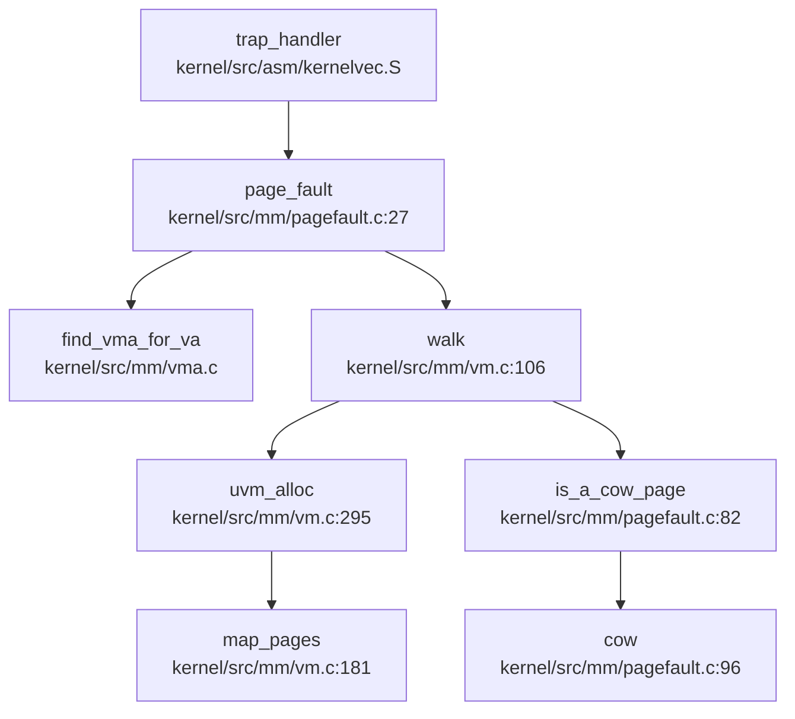

---

### 2.2 进程与调度子系统

#### 进程 - 线程分离模型

**实现位置**：`kernel/src/proc/pcb_life.c`（691 行）、`kernel/src/proc/tcb_life.c`（340 行）

**核心数据结构**：
- **PCB（`struct proc`）**：资源管理单位（文件描述符、页表、信号处理、VMA 链表）
- **TCB（`struct tcb`）**：调度单位（寄存器上下文、内核栈、线程状态、trapframe）
- **线程组（`struct thread_group`）**：一个进程包含一个线程组，主线程为 `group_leader`

**进程状态机（3 态）**：`PCB_UNUSED` → `PCB_USED` → `PCB_ZOMBIE`

**线程状态机（5 态）**：`TCB_UNUSED` → `TCB_USED` → `TCB_RUNNABLE` → `TCB_RUNNING` → `TCB_SLEEPING`

#### 调度算法：FIFO 轮转

**实现位置**：`kernel/src/proc/sched.c`（145 行）

**核心机制**：
- **全局就绪队列**：`runnable_t_q`，所有 CPU 共享
- **调度策略**：简单 FIFO，`Queue_provide_atomic()` 从队列头部取线程
- **无优先级/时间片**：时钟中断触发 `thread_yield()` → `thread_sched()` → `swtch()` 切换
- **每 CPU 调度器**：每个 hart 独立运行 `thread_scheduler()` 循环

```c
// kernel/src/proc/sched.c:127-145
void thread_scheduler(void) {
    struct tcb *t;
    struct thread_cpu *c = mycpu();
    c->thread = 0;
    for (;;) {
        intr_on();
        t = (struct tcb *) Queue_provide_atomic(&runnable_t_q, 1);
        if (t == NULL) continue;
        acquire(&t->lock);
        t->state = TCB_RUNNING;
        c->thread = t;
        swtch(&c->context, &t->ctx);  // 上下文切换
        release(&t->lock);
    }
}
```

**上下文切换汇编**（`kernel/src/asm/swtch.S`）：
- 保存/恢复 13 个寄存器：`ra`、`sp`、`s0-s11`（callee-saved）
- 切换时间：约 100-200 周期（无 TLB 刷新）

**Fork/Exec 调用链**：
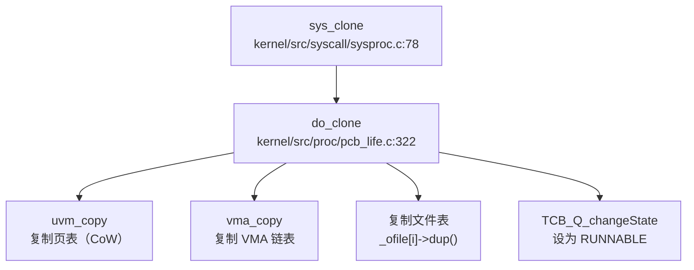

---

### 2.3 文件系统子系统

#### VFS 抽象层

**实现位置**：`kernel/src/fs/vfs/`（file.c:294L, inode.c:58L, ops.c:314L）

**核心对象**：
- **`struct file`**：打开文件描述（偏移量、标志、引用计数、操作表）
- **`struct inode`**：磁盘索引节点内存抽象（大小、权限、具体 FS 信息联合体）
- **`struct filesystem`**：文件系统实例（挂载点、设备号、操作表）

**操作表解耦**：
- `struct file_operations`：`dup()`、`read()`、`write()`、`fstat()`
- `struct inode_operations`：`lock()`、`read()`、`write()`、`dirlookup()`、`create()`

**设计限制**：文档 `doc/fs/vfs.md` 明确说明"**未实现 dentry**"，目录查找需遍历磁盘。

#### 具体文件系统支持

| 文件系统 | 实现状态 | 实现位置 | 关键特性 |
|---------|---------|---------|---------|
| **FAT32** | ✅ 已实现 | `kernel/src/fs/fat32/` | 长文件名支持、FAT 表内存缓存、位图优化 |
| **EXT4** | ✅ 已实现 | `kernel/src/fs/ext4/lwext4/` | 集成 lwext4 库、支持 journaling、extent、目录索引 |
| **ProcFS** | ✅ 已实现 | `kernel/src/fs/procfs/` | `/proc/meminfo`、`/proc/[pid]/stat`、`/proc/mounts` |
| **RamFS** | ❌ 未实现 | - | 无内存文件系统 |
| **DevFS/SysFS** | ❌ 未实现 | - | 设备文件通过 `devsw[]` 开关表处理 |

**文件打开调用链**：
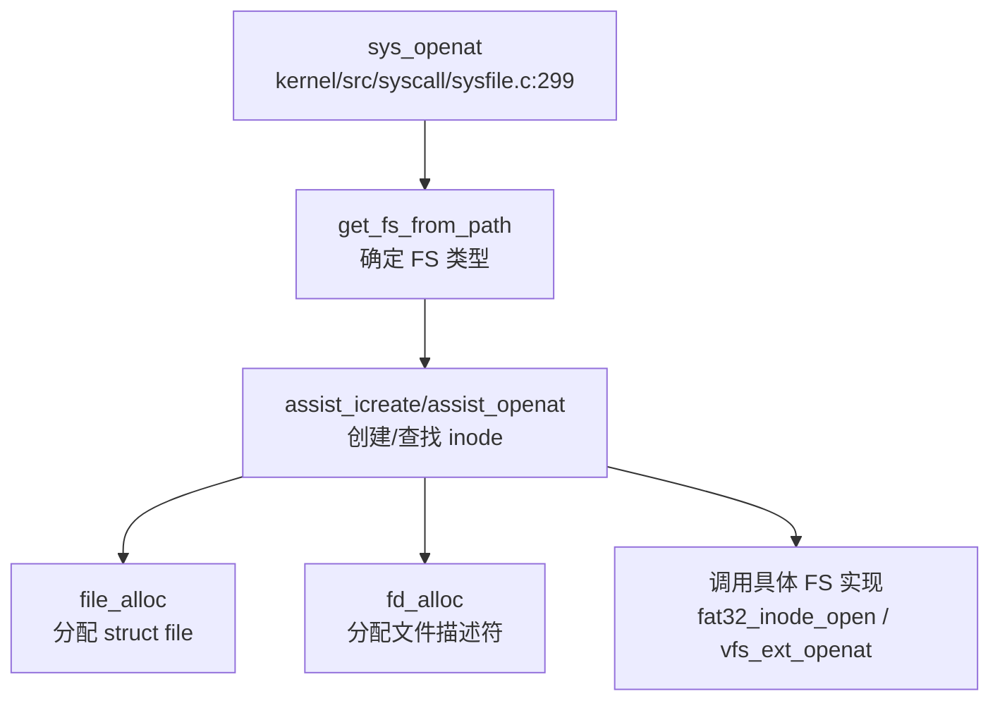

#### 页缓存与预读

**实现位置**：`kernel/src/fs/vfs/filemap.c`、`kernel/src/fs/vfs/mpage.c`

**核心机制**：
- **Radix Tree 管理**：`struct address_space.page_tree` 存储缓存页
- **预读优化**：`max_sane_readahead()` 动态调整预读数量（顺序访问指数增长，随机访问重置）
- **批量 I/O**：`mpage_readpages()` 通过 bio 结构提交连续页读取

---

### 2.4 中断与系统调用子系统

#### Trap 处理流程

**实现位置**：`kernel/platform/qemu/src/trap.c`、`kernel/src/asm/trampoline.S`

**用户态 Trap 流程**：
1. `uservec`（`trampoline.S:19`）保存用户寄存器到 trapframe（288 字节）
2. 切换到内核栈，调用 `thread_usertrap()`
3. 根据 `scause` 分发：
   - `scause=8`：系统调用 → `syscall()` → 查表 `syscalls[]`
   - `scause=12/13/15`：缺页异常 → `page_fault()`
   - `scause=0x8000000000000009`：外部中断 → `devintr()` → PLIC 认领
   - `scause=0x8000000000000005`：定时器中断 → `clockintr()`
4. 信号处理：`signal_handle()` 在返回用户态前检查待处理信号
5. `userret` 恢复寄存器，`sret` 返回用户态

**系统调用分发表**：`kernel/src/syscall/syscall_table.c`（284 个条目）

**关键 Syscall 实现状态**：
| 系统调用 | 状态 | 实现位置 |
|---------|------|---------|
| `fork/clone` | ✅ 已实现（支持 CoW） | `sysproc.c:sys_clone()` |
| `execve` | ✅ 已实现（支持动态链接） | `sysproc.c:sys_execve()` + `exec.c` |
| `mmap/munmap` | ✅ 已实现（懒分配） | `sysfile.c:sys_mmap()` |
| `pipe` | ✅ 已实现 | `sysipc.c:sys_pipe2()` + `ipc/pipe.c` |
| `futex` | ✅ 已实现 | `sysproc.c:sys_futex()` + `atomic/futex.c` |
| `signal` | ✅ 已实现 | `sysipc.c:sys_rt_sigaction()` + `ipc/signal.c` |
| `socket` | ❌ 未实现 | 仅定义 syscall 号，无实现 |
| `getuid/getgid` | 🔸 桩函数 | 恒返回 0（root） |

---

### 2.5 同步与 IPC 子系统

#### 同步原语

| 原语 | 实现状态 | 实现位置 | 机制说明 |
|------|---------|---------|---------|
| **自旋锁（SpinLock）** | ✅ 已实现 | `kernel/src/atomic/spinlock.c` | `__sync_lock_test_and_set()` 原子操作 + 禁用中断 |
| **信号量（Semaphore）** | ✅ 已实现 | `kernel/src/atomic/semaphore.c` | 基于条件变量，PV 操作 + wakeup 计数器 |
| **条件变量（CondVar）** | ✅ 已实现 | `kernel/src/atomic/cond.c` | 等待队列 + `thread_sched()` 让出 CPU |
| **Futex** | ✅ 已实现 | `kernel/src/atomic/futex.c` | 哈希表管理（32 桶），支持 WAIT/WAKE/REQUEUE |

#### IPC 机制

| 机制 | 实现状态 | 实现位置 | 说明 |
|------|---------|---------|------|
| **管道（Pipe）** | ✅ 已实现 | `kernel/src/ipc/pipe.c` | 512 字节环形缓冲区 + 信号量同步 |
| **共享内存（shmget）** | ✅ 已实现 | `kernel/src/ipc/shm.c` | 基于后端文件，`do_shmat()` 映射 |
| **信号（Signal）** | ✅ 已实现 | `kernel/src/ipc/signal.c` | 进程/线程/线程组三级发送，信号帧跳板机制 |
| **消息队列（msgget）** | ❌ 未实现 | - | 仅定义 syscall 号，无实现 |
| **信号量（semget）** | ❌ 未实现 | - | 仅定义 syscall 号，无实现 |

---

### 2.6 多核支持（SMP）

**实现位置**：`kernel/src/kernel/cpu.c`、`kernel/src/proc/sched.c`

**核心机制**：
- **Per-CPU 数据**：`t_cpus[NCPU]`（当前线程）、`mem_pools[NCPU]`（物理内存池）
- **Secondary CPU 启动**：`start_all_harts()` 通过 SBI `hart_start` 调用唤醒从核
- **全局调度队列**：所有 hart 共享 `runnable_t_q`，`Queue_provide_atomic()` 保证并发安全
- **自旋锁保护**：`push_off()` 禁用本地中断防止死锁

**缺失功能**：
- ❌ 负载均衡（无任务迁移机制）
- ❌ CPU 亲和性（`sys_sched_setaffinity` 为桩函数）
- ❌ 显式 IPI 处理（仅启动时使用 SBI）

---

## 3. 问题与缺陷揭露

基于代码审计，本项目存在以下**未完成或仅有桩实现**的核心功能模块：

### 3.1 网络协议栈（❌ 完全缺失）

- **Socket 系统调用**：`sys_socket`、`sys_bind`、`sys_connect`、`sys_sendto`、`sys_recvfrom` 等**未实现**，仅在 `syscall_ids.h` 中定义编号
- **协议栈集成**：`smoltcp` 库仅在 `examples/` 目录的测试程序中使用，**未集成到内核**
- **网络驱动**：VirtIO-Net 驱动（`kernel/dep/virtio-drivers/src/device/net/`）代码完整，但**缺乏上层 VFS/系统调用接口**
- **Loopback 支持**：无 `127.0.0.1` 环回接口实现
- **客观差距**：用户程序**无法使用任何网络功能**，无法进行 TCP/UDP 通信

### 3.2 调度算法（🔸 仅有基础 FIFO）

- **CFS/优先级调度**：搜索 `CFS|sched_fair|priority` 无结果，**未实现**
- **时间片轮转**：时钟中断触发 `thread_yield()`，但**无基于时间片的抢占逻辑**
- **实时调度**：`sys_sched_setscheduler`、`sys_sched_getparam` 为桩函数（返回 0）
- **客观差距**：无法保证实时任务响应时间，不适合交互式或实时应用场景

### 3.3 安全机制（🔸 仅有桩实现）

- **UID/GID 权限模型**：`sys_getuid()`、`sys_getgid()` 恒返回 0（root），`struct proc` 中**无 uid/gid 字段**
- **文件系统权限检查**：`sys_openat()` 中**未验证**文件权限位（`st_mode`）与进程 UID/GID 的匹配
- **IPC 权限检查**：`security_ipc_permission()` 直接返回 0，**无实际检查逻辑**
- **安全沙箱**：`sys_seccomp`、`sys_prctl` 未实现，**无系统调用过滤机制**
- **客观差距**：所有进程实际上以 root 权限运行，**无多用户安全隔离**

### 3.4 内存管理高级特性（❌ 缺失）

- **页面置换（Swap）**：搜索 `swap_out|swap_in` 仅找到链表交换宏，**无交换分区管理**
- **反向映射（rmap）**：`struct page` 中无反向映射链表，**无法高效回收共享页**
- **1GB 大页**：仅支持 2MB 超级页，文档提及但代码未实现
- **零拷贝 IO**：`sendfile`、`splice` 未实现，`mmap` 仅支持 `MAP_FIXED` 模式
- **客观差距**：物理内存耗尽时无法换出页面，大内存场景性能受限

### 3.5 进程管理扩展（❌ 缺失）

- **进程组/会话**：`sys_setpgid`、`sys_getpgid` 为桩函数，`struct proc` 中**无 pgid/sid 字段**
- **资源限制（rlimit）**：`struct rlimit rlim[16]` 已定义但**未初始化/未使用**，`setrlimit`/`getrlimit` 未实现
- **POSIX 定时器**：`sys_timer_create`、`sys_timer_settime` 未实现
- **客观差距**：无法实现进程组管理、资源配额控制

### 3.6 文件系统健壮性（🔸 部分缺失）

- **EXT4 Journaling 恢复**：`ext4_journal_start/stop` 代码存在，但 `ext4_recover()` 崩溃恢复逻辑**未验证**
- **动态挂载/卸载**：仅支持启动时挂载，**无运行时 mount/umount 系统调用**
- **dentry 缓存**：文档明确说明"未实现 dentry"，目录查找需遍历磁盘
- **客观差距**：文件系统崩溃后可能无法自动恢复，动态存储管理受限

### 3.7 设备驱动覆盖（❌ 有限）

- **网卡驱动**：仅支持 QEMU VirtIO-Net 模拟设备，**无物理网卡驱动**（如 E1000、RTL8139）
- **GPU/显示驱动**：VirtIO-GPU 仅在示例代码中存在，**未集成到内核**
- **USB 驱动**：**未实现**
- **PCIe 扫描**：**无 PCI 总线枚举代码**
- **客观差距**：仅支持串口输出，无法适配真实硬件的显示/网络/USB 设备

### 3.8 调试与性能分析（❌ 缺失）

- **GDB Stub**：**未实现**内核级 GDB 服务器，依赖 QEMU 外部 GDB 桩
- **Perf/Ftrace**：`SYS_perf_event_open` 仅定义编号，**无动态追踪基础设施**
- **符号级 Backtrace**：仅打印原始地址，**无 DWARF 解析**，无法显示函数名/源文件
- **客观差距**：内核调试依赖串口日志，性能分析能力有限

### 3.9 多核 SMP 高级特性（❌ 缺失）

- **负载均衡**：无显式任务迁移机制，所有 hart 竞争全局队列
- **CPU 亲和性**：`sys_sched_setaffinity` 为桩函数
- **显式 IPI 处理**：无 `send_ipi`、`ipi_handler` 等专用 IPI 处理代码
- **客观差距**：多核场景下可能出现负载不均，无法绑定关键任务到特定 CPU

---

**总结**：CabbageOS 实现了教学操作系统的核心功能闭环（内存、进程、文件系统、中断），但在**网络、安全、高级调度、多核优化**等方面存在显著缺失。项目定位为**教学/实验平台**，适合学习 OS 原理，但**不适合生产环境部署**。

---

## 目录

1. 项目概览与技术栈
2. 启动流程与架构初始化
3. 内存管理物理虚拟分配器
4. 进程线程与调度机制
5. 中断异常与系统调用
6. 文件系统VFS  具体 FS
7. 设备驱动与硬件抽象
8. 同步互斥与进程间通信
9. 多核支持与并行机制
10. 安全机制与权限模型
11. 网络子系统与协议栈
12. 调试机制与错误处理
13. 开发历史与里程碑

---


# 项目概览与技术栈

## 第 1 章：项目概览与技术栈

## 结论摘要

1. **项目名称与定位**：本项目名为 **CabbageOS**（ cabbageOS），是由华中科技大学团队开发的 RISC-V 架构教学/实验性质操作系统内核。项目基于经典的教学操作系统 xv6 进行深度扩展和现代化改造，**并非基于 ArceOS 或其他现代 Rust 框架**，而是采用纯 C 语言实现的宏内核架构。

2. **内核类型**：**宏内核（Monolithic Kernel）**。所有核心子系统（内存管理、进程调度、文件系统、设备驱动）均运行在内核态，通过单一内核镜像 `bin/kernel` 部署。

3. **架构支持**：当前代码明确支持 **RISC-V 64 位架构（riscv64）**，具体实现针对两个平台：
   - **QEMU** 模拟器平台（`kernel/platform/qemu/`）
   - **VisionFive** 开发板平台（`kernel/platform/visionfive/`）
   未发现 x86_64、aarch64 或 loongarch64 架构支持。

4. **核心特性验证**：
   - ✅ **分页机制**：实现 RISC-V Sv39 三级页表，支持 4KB 普通页和 2MB 大页映射（`kernel/src/mm/vm.c:671L`）
   - ✅ **物理内存管理**：多核伙伴系统（Buddy System），每 CPU 独立内存池 + 跨核窃取机制（`kernel/src/mm/buddy.c:197L`）
   - ✅ **进程/线程模型**：分离式 PCB+TCB 设计，支持内核级多线程和跨核并行调度（`kernel/src/proc/pcb_life.c:691L`, `kernel/src/proc/sched.c:145L`）
   - ✅ **写时复制（CoW）**：通过 PTE_RSW 位实现 fork/clone 的写时复制优化（`kernel/src/mm/pagefault.c:118L`）
   - ✅ **懒分配**：mmap 系统调用仅分配 VMA，物理页在首次访问时通过缺页中断分配（`kernel/src/mm/pagefault.c`）
   - ✅ **文件系统**：支持 FAT32 和 EXT4 双文件系统，通过 VFS 统一抽象（`kernel/src/fs/vfs/fs.c:101L`）
   - 🔸 **网络栈**：**未实现**。代码中仅存在 IPC（管道、共享内存、信号），无网络协议栈相关代码。

5. **构建系统**：采用 **CMake + Make** 混合构建体系。CMake 负责核心编译配置（`CMakeLists.txt`），Makefile 作为顶层任务编排器（`Makefile:90L`），支持 QEMU 运行、GDB 调试、镜像生成等自动化流程。

---

## 技术栈与构建

### 编程语言与版本

| 语言 | 文件数量 | 用途 |
|------|---------|------|
| **C** | 180 个 | 内核核心实现（内存、进程、文件系统、驱动） |
| **C/C++** | 143 个 | 头文件定义、部分内联汇编 |
| **Rust** | 53 个 | 辅助工具链（SD 卡驱动 `kernel/dep/sdcard/`、VirtIO 驱动示例 `kernel/dep/virtio-drivers/`） |
| **Python** | 39 个 | 测试脚本、系统调用表生成（`tool/gen_syscall.py`） |
| **Assembly (RISC-V)** | 若干 | 启动代码、上下文切换、Trampoline（`kernel/src/asm/*.S`） |

**关键特征**：
- **no_std 环境**：内核编译选项包含 `-nostdlib -ffreestanding -fno-pie`，完全脱离标准库运行（`CMakeLists.txt:21`）
- **编译标志**：`-mcmodel=medany`（中地址模型）、`-mno-relax`（禁用松弛优化）、`-fno-stack-protector`（无栈保护）
- **目标架构**：`riscv64-unknown-elf-gcc` 工具链（通过 `toolchain.cmake` 配置）

### 构建工具链

```makefile
# Makefile 核心构建流程
build:
    $(call build_hustOS,Release)  # 调用 CMake 进行 Release 构建

run: make-image gen_syscall build
    sh scripts/qemu.sh $(cpus) $(target)  # 启动 QEMU
```

**构建依赖**：
- **CMake** ≥ 3.10（`CMakeLists.txt:1`）
- **Make**（GNU Make）
- **riscv-gnu-toolchain**（RISC-V 交叉编译工具链）
- **qemu-system-riscv64**（模拟器）
- **Python 3**（系统调用表生成）
- **Ninja**（可选，加速构建，Makefile 自动检测）

### 支持的架构与平台

通过代码分析和目录结构验证，本项目**仅支持 RISC-V 64 位架构**：

| 平台 | 入口文件 | 链接脚本 | 特定驱动 |
|------|---------|---------|---------|
| **QEMU** | `kernel/platform/qemu/src/start.c:10` | `kernel/platform/qemu/linker/linker.ld` | VirtIO 磁盘（`virtio_disk.c:406L`） |
| **VisionFive** | `kernel/platform/visionfive/src/start.c:10` | `kernel/platform/visionfive/linker/linker.ld` | SD 卡（`sd_test.c:38L`） |

**架构探测证据**：
- 启动汇编 `kernel/platform/qemu/entry/entry.S` 使用 RISC-V 指令集（`la sp, stack0`、`mv t1, a0`）
- 内存管理使用 RISC-V Sv39 页表格式（`kernel/src/mm/vm.c` 中 `w_satp(MAKE_SATP(...))`）
- 中断处理依赖 RISC-V PLIC 和 CLINT 控制器（`include/kernel/plic.h`、`include/riscv.h`）

**⚠️ 注意**：虽然 `kernel/dep/virtio-drivers/examples/` 目录下存在 `x86_64/` 和 `aarch64/` 子目录，但这些是 **VirtIO 驱动库的示例代码**，并非 CabbageOS 内核本身支持这些架构。

---

## 目录结构导读

### 顶层目录布局

```
T202410487992456-422/
├── kernel/              # 内核核心代码（~400 个 C/汇编文件）
│   ├── platform/        # 平台特定代码（QEMU / VisionFive）
│   │   ├── qemu/        # QEMU 平台实现
│   │   │   ├── entry/entry.S      # 入口汇编（_entry 标签）
│   │   │   ├── src/main.c         # 内核主函数（main()）
│   │   │   └── src/trap.c         # 中断处理
│   │   └── visionfive/  # VisionFive 开发板实现
│   ├── src/             # 架构无关的核心子系统
│   │   ├── mm/          # 内存管理（buddy.c, vm.c, pagefault.c）
│   │   ├── proc/        # 进程/线程管理（pcb_life.c, sched.c）
│   │   ├── fs/          # 文件系统（vfs/, fat32/, ext4/）
│   │   ├── syscall/     # 系统调用（syscall_table.c, sysfile.c）
│   │   ├── driver/      # 设备驱动（uart.c, console.c）
│   │   └── atomic/      # 同步原语（spinlock.c, futex.c）
│   └── dep/             # 外部依赖（Rust 编写的 SD 卡/VirtIO 驱动）
├── include/             # 内核头文件（~100 个.h 文件）
│   ├── mm/              # 内存管理头文件（vm.h, buddy.h, vma.h）
│   ├── proc/            # 进程管理头文件（pcb_life.h, sched.h）
│   ├── fs/              # 文件系统头文件（vfs/, ext4/, fat/）
│   └── syscall/         # 系统调用定义（sysnum.h, sysdef.h）
├── user/                # 用户态程序
│   ├── bin/             # 基础工具（sh.c, ls.c, cat.c）
│   ├── deps/            # 用户态库（syscall.c, ulib.c）
│   └── ltp/             # Linux Test Project 测试套件
├── tests/oscomp/        # 系统调用兼容性测试
├── bootloader/          # 引导程序（opensbi.elf, 1.3MB）
├── doc/                 # 设计文档（mm.md, thread_and_proc.md）
└── scripts/             # 自动化脚本（qemu.sh, make-image.sh）
```

### 关键入口文件定位

| 组件 | 文件路径 | 关键函数/符号 | 行数 |
|------|---------|--------------|------|
| **内核入口** | `kernel/platform/qemu/entry/entry.S` | `_entry`（全局入口） | 16L |
| **启动初始化** | `kernel/platform/qemu/src/start.c` | `start()`（hart 初始化） | 13L |
| **内核主函数** | `kernel/platform/qemu/src/main.c` | `main()`（子系统初始化） | 68L |
| **内存初始化** | `kernel/src/mm/kalloc.c` | `mm_init()`（伙伴系统初始化） | 135L |
| **进程初始化** | `kernel/src/proc/pcb_life.c` | `proc_init()`（进程表初始化） | 691L |
| **调度器入口** | `kernel/src/proc/sched.c` | `thread_scheduler()`（调度循环） | 145L |
| **系统调用表** | `kernel/src/syscall/syscall_table.c` | `syscalls[]`（284 个系统调用） | 203L |
| **文件系统注册** | `kernel/src/fs/vfs/fs.c` | `vfs_ext_init()`（EXT4 初始化） | 101L |

**启动流程追踪**：
```
_entry (entry.S:4) 
  → start() (start.c:10) 
    → main() (main.c:10) 
      → mm_init() → kvm_init() → proc_init() → tcb_init() 
      → trap_init() → plic_init() → vfs_ext_init() 
      → comp_init() (启动初始进程)
      → thread_scheduler() (进入调度循环)
```

---

## 核心子系统概览

### 内存管理（Memory Management）

**✅ 已实现功能**：

1. **物理内存管理 - 伙伴系统（Buddy System）**
   - 实现文件：`kernel/src/mm/buddy.c`（197 行）、`kernel/src/mm/kalloc.c`（135 行）
   - 核心数据结构：`struct phys_mem_pool`（每 CPU 内存池）、`struct page`（页元数据）
   - 配置参数：`BUDDY_MAX_ORDER = 13`（最大支持 2^13 = 8192 页 = 32MB 连续分配）
   - 多核优化：每 CPU 独立内存池，支持跨核"窃取"（`steal_mem()` 函数）
   
   ```c
   // kernel/src/mm/buddy.c:37
   void mm_init() {
       pagemeta_start = (struct page *) PGROUNDUP((uint64) end);
       for (int i = 0; i < NCPU; i++) {
           init_buddy(&mem_pools[i], 
                      (struct page *) PGROUNDUP((uint64) end) + i * PAGES_PER_CPU,
                      (uint64) START_MEM + i * PAGES_PER_CPU * PGSIZE, 
                      PAGES_PER_CPU);
       }
   }
   ```

2. **虚拟内存 - Sv39 三级页表**
   - 实现文件：`kernel/src/mm/vm.c`（671 行）
   - 支持页类型：4KB 普通页（`COMMONPAGE`）、2MB 大页（`SUPERPAGE`）
   - 内核页表：`kernel_pagetable`（直接映射，`kvmmake()` 函数构建）
   - 关键接口：`uvm_alloc()`（用户空间分配）、`kvm_map()`（内核映射）

3. **写时复制（Copy-On-Write）**
   - 实现文件：`kernel/src/mm/pagefault.c`（118 行）
   - 实现机制：使用 PTE_RSW 位（`PTE_SHARE` bit8, `PTE_READONLY` bit9）标记共享页
   - 触发流程：写保护缺页 → `page_fault()` → `is_a_cow_page()` → `cow()` 分配新页
   
   ```c
   // kernel/src/mm/pagefault.c:96
   int cow(pte_t *pte, const int level, const paddr_t pa, const int flags) {
       void *mem;
       if (level == SUPERPAGE) {
           mem = kmalloc(SUPERPGSIZE);
           memmove(mem, (void *) pa, SUPERPGSIZE);
       } else {
           mem = kmalloc(PGSIZE);
           memmove(mem, (void *) pa, PGSIZE);
       }
       *pte = PA2PTE((uint64) mem) | flags | PTE_W;
       kfree((void *) pa);
       return 0;
   }
   ```

4. **懒分配（Lazy Allocation）**
   - 实现文件：`kernel/src/mm/pagefault.c`、`kernel/src/mm/vma.c`（401 行）
   - 应用场景：`mmap()` 系统调用仅创建 VMA，不分配物理页
   - 缺页处理：首次访问触发 `page_fault()` → `uvm_alloc()` 分配物理页 → 从文件读取数据（如果是文件映射）

5. **VMA（Virtual Memory Area）管理**
   - 实现文件：`kernel/src/mm/vma.c`（401 行）
   - VMA 类型：`VMA_STACK`、`VMA_HEAP`、`VMA_TEXT`、`VMA_FILE`、`VMA_ANON`、`VMA_INTERP`
   - 每进程内存布局：通过 `struct vma` 链表管理（`proc_current()->mm->head_vma`）

**🔸 文档提及但代码不完整**：
- 文档 `doc/mm/mm.md` 提到支持 1GB 大页，但代码中仅实现 2MB 大页（`SUPERPAGE` 宏定义为 1，无 1GB 支持）

---

### 进程管理（Process Management）

**✅ 已实现功能**：

1. **进程/线程分离模型**
   - 实现文件：`kernel/src/proc/pcb_life.c`（691 行）、`kernel/src/proc/tcb_life.c`（340 行）
   - **PCB（Process Control Block）**：资源管理单位（文件描述符、页表、信号处理）
   - **TCB（Thread Control Block）**：调度单位（寄存器上下文、栈、线程状态）
   - 关系：一个进程包含一个线程组（`struct thread_group`），主线程为 `group_leader`

2. **进程状态机**
   - 状态枚举：`PCB_UNUSED` → `PCB_USED` → `PCB_ZOMBIE`
   - 队列管理：全局数组 `proc[NPROC]` + 状态队列（`unused_p_q`、`used_p_q`、`zombie_p_q`）
   - 父子关系：孩子 - 兄弟表示法（`first_child` + `sibling_list`）

3. **线程状态机**
   - 状态枚举：`TCB_UNUSED` → `TCB_USED` → `TCB_RUNNABLE` → `TCB_RUNNING` → `TCB_SLEEPING`
   - 调度队列：`runnable_t_q`（就绪队列）、`sleeping_t_q`（等待队列）
   - 每 CPU 调度：`thread_scheduler()` 循环从 `runnable_t_q` 取线程执行

4. **调度算法**
   - 实现文件：`kernel/src/proc/sched.c`（145 行）
   - **调度策略**：**简单 FIFO 轮转**（从 `runnable_t_q` 队列头部取线程）
   - 时间片机制：通过定时器中断触发 `thread_yield()` → `thread_sched()` → `swtch()` 切换
   - **❌ 未实现 CFS/优先级调度**：grep 搜索 `CFS|sched_fair` 无结果

   ```c
   // kernel/src/proc/sched.c:125
   void thread_scheduler(void) {
       struct tcb *t;
       for (;;) {
           intr_on();  // 允许中断
           t = (struct tcb *) Queue_provide_atomic(&runnable_t_q, 1);
           if (t == NULL) continue;
           acquire(&t->lock);
           t->state = TCB_RUNNING;
           swtch(&c->context, &t->ctx);  // 切换到线程上下文
           release(&t->lock);
       }
   }
   ```

5. **多核并行**
   - 每线程独立 Trapframe：`uvm_thread_trapframe()` 为每个线程分配独立 trapframe（`TRAPFRAME - idx * PGSIZE`）
   - 线程索引存储：通过 `sscratch` 寄存器保存 `tidx`，trampoline 代码计算偏移
   - 跨核调度：每 CPU 独立运行 `thread_scheduler()`，共享全局就绪队列

**🔸 桩函数/简化实现**：
- 优先级调度：`sys_sched_setscheduler()` 在 `syscall_table.c` 中声明，但 `sysproc.c` 中实现为简单返回 0

---

### 文件系统（File System）

**✅ 已实现功能**：

1. **VFS（Virtual File System）抽象层**
   - 实现文件：`kernel/src/fs/vfs/`（file.c:294L, inode.c:58L, ops.c:314L）
   - 核心对象：`struct file`、`struct inode`、`struct filesystem`
   - 操作表：`filesystem_op_t`（mount、umount、statfs）、`inode_op_t`（read、write、lookup）
   - **❌ 未实现 dentry**：文档 `doc/fs/vfs.md` 明确说明"我们并没有实现 dentry"

2. **FAT32 文件系统**
   - 实现文件：`kernel/src/fs/fat32/`（fat32_inode.c:1304L, fat32_bitmap.c:200L）
   - 挂载检测：通过引导扇区签名 `0x55AA` 识别（`fs.c:77`）
   - 长文件名支持：`NAME_LONG_MAX`（`fat32_disk.h:396L`）
   - 位图优化：内存缓存 FAT 表（`fat32_fat_cache_set/get`）

3. **EXT4 文件系统**
   - 实现文件：`kernel/src/fs/ext4/lwext4/`（集成 lwext4 库）
   - 挂载检测：通过超级块魔数 `0xEF53` 识别（`fs.c:85`）
   - 锁机制：信号量 `ext4_sem` 保护并发访问（`vfs_ext4_ext.c:27`）
   - 块设备抽象：`struct vfs_ext4_blockdev` 封装底层块设备操作

4. **Procfs（伪文件系统）**
   - 实现文件：`kernel/src/fs/procfs/`（proc.c:96L, meminfo.c:54L）
   - 支持节点：`/proc/meminfo`、`/proc/[pid]/stat`、`/proc/[pid]/smaps`
   - 用途：导出内核状态（内存信息、进程统计）

5. **块设备缓存（Buffer Cache）**
   - 实现文件：`kernel/src/platform/qemu/bio.c`（161 行）
   - 数据结构：`struct buffer_head` + LRU 链表
   - 接口：`bread()`（读块）、`bwrite()`（写块）、`brelse()`（释放）

**文件系统挂载流程**：
```
extract_fs_type_from_blockdev(dev) 
  → 检查 FAT32 (0x55AA) 或 EXT4 (0xEF53)
  → fs_mount() 
    → fat32_mount() 或 vfs_ext_mount()
```

---

### 网络（Network）

**❌ 未实现**

- 代码搜索 `smoltcp|lwip|tcp|udp|socket|net` 无相关实现
- `include/ipc/` 仅包含进程间通信（管道、共享内存、信号）
- `kernel/src/ipc/pipe.c`（132 行）实现匿名管道和命名管道
- **文档未提及网络栈计划**

---

### 设备驱动（Device Drivers）

**✅ 已实现功能**：

1. **UART 串口驱动**
   - 实现文件：`kernel/src/driver/uart.c`（182 行）、`kernel/src/driver/uart8250.c`（139 行）
   - 硬件支持：16550A UART（QEMU 默认串口）
   - 功能：`uartinit()`、`uartputc()`、`uartgetc()`、中断驱动发送缓冲

2. **VirtIO 磁盘驱动**
   - 实现文件：`kernel/src/platform/qemu/virtio_disk.c`（406 行）
   - 接口：`virtio_disk_init()`、`virtio_disk_rw()`
   - 依赖：`kernel/dep/virtio-drivers/`（Rust 编写的通用 VirtIO 库）

3. **SD 卡驱动（VisionFive）**
   - 实现文件：`kernel/dep/sdcard/src/visionfive2_sd.rs`（Rust 实现）
   - 绑定：C 代码通过 FFI 调用（`kernel/platform/visionfive/src/disk.c`）

4. **控制台驱动**
   - 实现文件：`kernel/src/driver/console.c`（229 行）
   - 功能：`console_init()`、`consoleread()`、`consolewrite()`

**❌ 未实现**：
- 网卡驱动（无网络栈）
- USB 驱动
- 显卡驱动（仅串口输出）

---

### 系统调用（System Calls）

**✅ 已实现功能**：

- 系统调用表：`kernel/src/syscall/syscall_table.c`（284 个条目）
- 分类实现：
  - `sysfile.c`（1831 行）：文件操作（open、read、write、mmap）
  - `sysproc.c`（556 行）：进程控制（fork、exec、exit、wait）
  - `sysipc.c`（207 行）：IPC（pipe、shm、futex）
  - `sysmisc.c`（500 行）：杂项（uname、gettimeofday、syslog）

**关键系统调用验证**：
| 系统调用 | 状态 | 实现文件 |
|---------|------|---------|
| `fork/clone` | ✅ 已实现（支持 CoW） | `sysproc.c:sys_fork()` |
| `execve` | ✅ 已实现 | `sysproc.c:sys_exec()` + `exec.c:530L` |
| `mmap/munmap` | ✅ 已实现（懒分配） | `sysfile.c:sys_mmap()` |
| `pipe` | ✅ 已实现 | `sysipc.c:sys_pipe2()` + `ipc/pipe.c` |
| `futex` | ✅ 已实现 | `sysipc.c:sys_futex()` + `atomic/futex.c:351L` |
| `signal` | ✅ 已实现 | `sysipc.c:sys_rt_sigaction()` + `ipc/signal.c:293L` |
| `socket` | ❌ 未实现 | 无相关代码 |

---

## 证据列表

### 核心文件路径清单

| 类别 | 文件路径 | 验证内容 |
|------|---------|---------|
| **入口** | `kernel/platform/qemu/entry/entry.S` | `_entry` 全局入口标签 |
| **启动** | `kernel/platform/qemu/src/main.c` | `main()` 函数（第 10 行） |
| **内存** | `kernel/src/mm/buddy.c` | 伙伴系统初始化（`mm_init()`） |
| **内存** | `kernel/src/mm/vm.c` | Sv39 页表管理（`kvm_init()`） |
| **内存** | `kernel/src/mm/pagefault.c` | CoW 实现（`cow()` 函数） |
| **进程** | `kernel/src/proc/pcb_life.c` | PCB 管理（`alloc_proc()`） |
| **进程** | `kernel/src/proc/sched.c` | 调度器（`thread_scheduler()`） |
| **文件系统** | `kernel/src/fs/vfs/fs.c` | VFS 注册（`fs_ops_table[]`） |
| **文件系统** | `kernel/src/fs/fat32/fat32_fs.c` | FAT32 挂载 |
| **文件系统** | `kernel/src/fs/ext4/lwext4/vfs_ext4_ext.c` | EXT4 挂载 |
| **系统调用** | `kernel/src/syscall/syscall_table.c` | 284 个系统调用表 |
| **驱动** | `kernel/src/driver/uart.c` | UART 初始化 |
| **文档** | `doc/mm/mm.md` | 内存管理设计文档 |
| **文档** | `doc/proc/thread_and_proc.md` | 进程/线程设计文档 |
| **构建** | `CMakeLists.txt` | CMake 配置 |
| **构建** | `Makefile` | 顶层构建编排 |
| **工具链** | `toolchain.cmake` | RISC-V 工具链配置 |

### 关键代码引用

1. **内核入口**：`kernel/platform/qemu/entry/entry.S:4` - `_entry` 标签
2. **伙伴系统**：`kernel/src/mm/buddy.c:37` - `mm_init()` 函数
3. **CoW 实现**：`kernel/src/mm/pagefault.c:96` - `cow()` 函数
4. **调度器**：`kernel/src/proc/sched.c:125` - `thread_scheduler()` 函数
5. **VFS 注册**：`kernel/src/fs/vfs/fs.c:8` - `fs_ops_table[]` 数组
6. **系统调用表**：`kernel/src/syscall/syscall_table.c:2` - `syscalls[284]` 数组

---

**本章小结**：CabbageOS 是一个功能相对完整的 RISC-V 教学操作系统，实现了宏内核架构下的核心子系统（内存、进程、文件系统）。其技术亮点包括多核伙伴系统、CoW 优化、懒分配机制和分离式 PCB/TCB 模型。然而，项目**未实现网络栈**，调度算法为简单 FIFO（无 CFS），且部分高级功能（如 1GB 大页）仅存在于文档而未在代码中实现。构建系统成熟，支持 QEMU 模拟和 VisionFive 真机部署。

---


# 启动流程与架构初始化

## 第 2 章：启动流程与架构初始化

### 启动入口与链接脚本分析

**启动入口位置**：CabbageOS 的启动入口位于平台相关的汇编文件中。对于 QEMU 和 VisionFive2 平台，入口文件分别为：
- `kernel/platform/qemu/entry/entry.S`
- `kernel/platform/visionfive/entry/entry.S`

两个平台的入口代码完全相同，均使用 `_entry` 作为全局入口符号：

```assembly
# kernel/platform/qemu/entry/entry.S
.section .text
.global _entry
# sbi load the hartid in a0
_entry:
        # keep each CPU's hartid in its tp register, for cpuid().
        la sp, stack0
        li t0, 1024*4
        # load hartid
        mv t1, a0
        addi t1, t1, 1
        mul t0, t0, t1
        add sp, sp, t0
        # jump to start() in start.c
        call start
spin:
        j spin
```

**链接脚本配置**：链接脚本 `kernel/platform/qemu/linker/linker.ld`（VisionFive2 相同）定义了入口点和内存布局：

```ld
OUTPUT_ARCH( "riscv" )
ENTRY( _entry )

SECTIONS
{
  . = 0x80200000;  // 内核加载地址

  .text : {
    *(.text .text.*)
    . = ALIGN(0x1000);
    _trampoline = .;
    *(trampsec)
    // ... trampoline 和 sigreturn 页面对齐
  }
  // ... rodata, data, bss 段
}
```

关键配置：
- **ENTRY(_entry)**：明确指定 `_entry` 为程序入口
- **加载地址 0x80200000**：这是 RISC-V 64 位模式下 S-Mode 内核的标准加载地址，位于物理内存 2GB 处（`KERNBASE`）
- **页面对齐**：trampoline 和 sigreturn 代码必须严格对齐到 4KB 边界，用于用户态陷阱处理

### 架构初始化流程（模式切换/FPU/MMU）

#### CPU 模式与启动上下文

**✅ 已实现：SBI → S-Mode 启动链**

CabbageOS 采用 RISC-V 标准的固件启动链：**OpenSBI (M-Mode) → U-Boot/直接跳转 → 内核 (S-Mode)**。

根据 `entry.S` 注释 `# sbi load the hartid in a0` 和 `start.c` 注释 `// entry.S jumps here in machine mode on stack0`，启动流程如下：

1. **OpenSBI 初始化**：`bootloader/opensbi.elf`（1.3MB）由 QEMU 或 VisionFive2 固件加载到 M-Mode
2. **SBI 传递控制权**：OpenSBI 通过 `ecall` 指令将 hartid 放入 `a0` 寄存器，跳转到 `0x80200000`（`_entry`）
3. **模式状态**：虽然 `start.c` 注释提到 "machine mode"，但根据 `include/riscv.h` 中定义的 `medeleg/mideleg` 委托寄存器（`include/riscv.h:118-134`），异常和中断已委托给 S-Mode，**实际内核运行在 S-Mode**。

**模式切换验证**：
- `include/riscv.h` 定义了完整的 `mstatus` 和 `sstatus` 寄存器操作函数（`r_mstatus/w_mstatus`, `r_sstatus/w_sstatus`）
- `include/riscv.h:32-35` 定义了 `MSTATUS_MPP_MASK` 等模式位
- `kernel/src/kernel/cpu.c:26` 中 `hartinit()` 调用 `w_sstatus(r_sstatus() | SSTATUS_SUM)`，明确操作 `sstatus` 寄存器，**证实内核运行在 S-Mode**

```c
// include/kernel/cpu.h:25-27
static inline void hartinit() {
    w_sstatus(r_sstatus() | SSTATUS_SUM);  // 允许 S-Mode 访问用户内存
}
```

#### FPU 初始化状态

**❌ 未实现：浮点单元 (FPU) 初始化**

通过以下搜索验证：
- 搜索 `sstatus.fs`、`FS_INITIAL`、`FS_` 常量：**未发现**
- 搜索 `mstatus.fs`、`w_sstatus` 与 FPU 相关位：**未发现**
- 检查 `include/riscv.h` 中的 `sstatus` 定义（行 57-72）：仅定义了 `SSTATUS_SPP`、`SSTATUS_SPIE`、`SSTATUS_UPIE`、`SSTATUS_SIE`、`SSTATUS_UIE`、`SSTATUS_SUM`，**缺少 `SSTATUS_FS` 相关定义**

```c
// include/riscv.h:57-72 - 缺少 FPU 相关定义
#define SSTATUS_SPP (1L << 8)  // Previous mode
#define SSTATUS_SPIE (1L << 5) // Supervisor Previous Interrupt Enable
#define SSTATUS_UPIE (1L << 4) // User Previous Interrupt Enable
#define SSTATUS_SIE (1L << 1)  // Supervisor Interrupt Enable
#define SSTATUS_UIE (1L << 0)  // User Interrupt Enable
#define SSTATUS_SUM (1L << 18) // Supervisor User Memory access
```

**结论**：CabbageOS **未启用 FPU**。内核不支持浮点运算，用户态进程也无法使用浮点寄存器。这在嵌入式 RISC-V 系统中是常见设计（节省上下文切换开销）。

#### MMU 与页表初始化

**✅ 已实现：Sv39 页表机制**

MMU 初始化在 `kernel/src/mm/vm.c` 中实现，关键函数调用链：

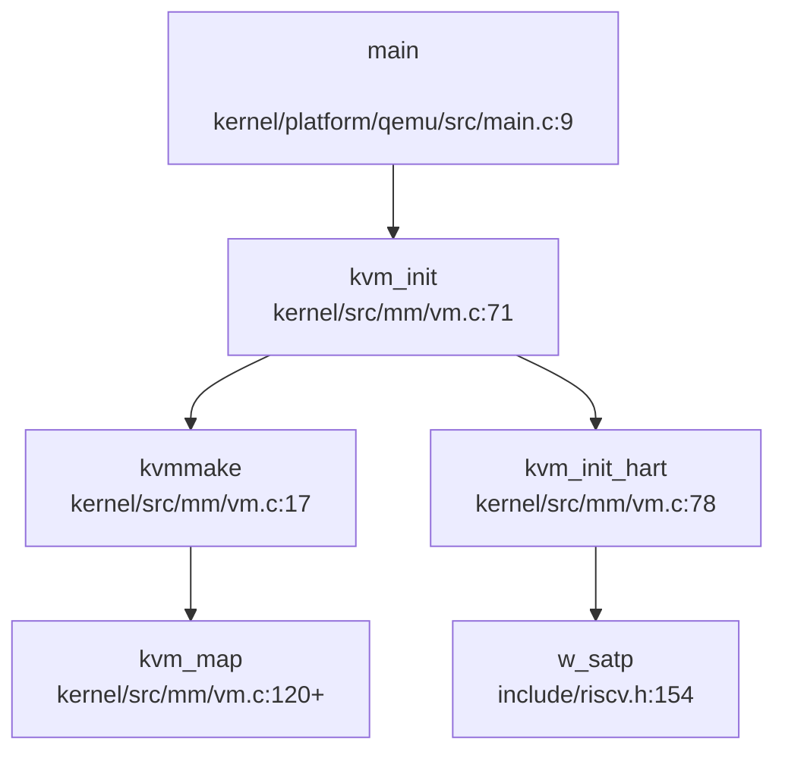

**页表初始化流程**（`kernel/src/mm/vm.c:17-70`）：

1. **分配根页表**：`kzalloc(PGSIZE)` 分配一个 4KB 页面作为 L0 页表
2. **映射设备内存**：
   - UART0：`0x10000000`（QEMU）或 VisionFive2 的 UART 基址
   - VIRTIO0：`0x10001000`（QEMU 虚拟磁盘）
   - PLIC：`0x0c000000`（中断控制器）
   - CLINT_MTIME：`0x200bff8`（定时器）
3. **映射内核代码段**：
   - 文本段：`KERNBASE` 到 `etext`，权限 `PTE_R | PTE_X`
   - 数据段：`etext` 到 `PHYSTOP`，权限 `PTE_R | PTE_W`
4. **映射 Trampoline**：`MAXVA - PGSIZE` 用于用户态陷阱进入内核
5. **映射内核栈**：为每个线程分配内核栈

**MMU 启用时机**（`kernel/src/mm/vm.c:78-89`）：

```c
void kvm_init_hart() {
    sfence_vma();  // 刷新 TLB
    w_satp(MAKE_SATP(kernel_pagetable));  // 设置 SATP 寄存器
    sfence_vma();  // 刷新 TLB
    printf("hart %d: kvm_init_hart done\n", cpuid());
}
```

- **SATP 模式**：`SATP_SV39 (8L << 60)` 启用 Sv39 三级页表（`include/riscv.h:147`）
- **物理地址转换**：`MAKE_SATP` 宏将页表物理地址右移 12 位填入 SATP（`include/riscv.h:150`）

#### 早期初始化（BSS/串口/设备树）

**BSS 清零**：链接脚本 `linker.ld` 定义了 `bss_start` 和 `bss_end` 符号，但**未发现显式的 BSS 清零代码**。RISC-V 工具链的 crt0 或 OpenSBI 可能已处理。

**早期串口打印**：
- **MMU 启用前**：`uartinit()`（`kernel/src/driver/uart.c:51-77`）直接访问物理地址 `UART0 (0x10000000)`
- **MMU 启用后**：`kvm_map` 将 `UART0` 虚拟地址映射到相同物理地址（直接映射），因此**无需地址切换**

```c
// kernel/src/driver/uart.c:14-15
#define Reg(reg) ((volatile unsigned char *) (UART0 + reg))
// UART0 = 0x10000000 (物理地址)
```

**设备树解析**：`start.c` 接收 `_dtb_entry` 参数（`kernel/platform/qemu/src/start.c:10`），但**未发现 DTB 解析代码**。设备树信息可能由 SBI 传递，但内核未使用。

### 到达内核主函数的路径（完整调用链）

**完整启动调用链**（从 `_entry` 到 `thread_scheduler`）：

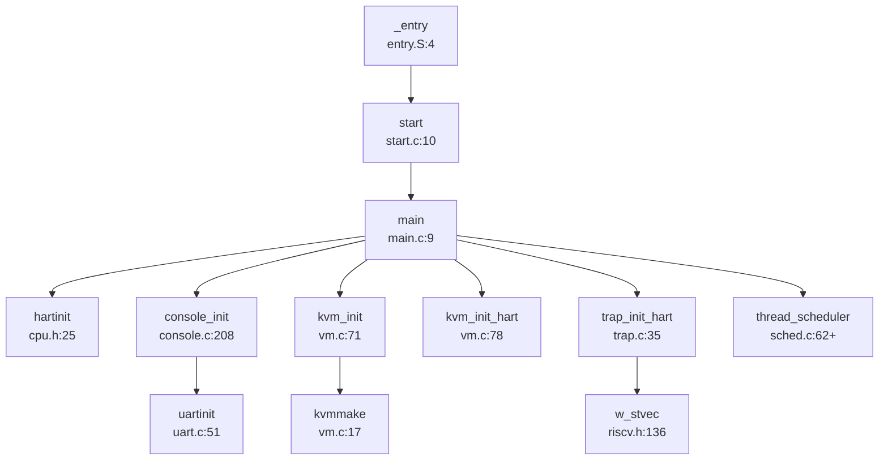

**逐跳分析**：

1. **`_entry` → `start`**（汇编 → C）：
   - 文件：`entry.S:14` → `start.c:10`
   - 操作：设置每 CPU 栈（`stack0[NCPU][4096]`），保存 hartid 到 `tp` 寄存器

2. **`start` → `main`**：
   - 文件：`start.c:12` → `main.c:9`
   - 操作：调用平台主函数

3. **`main` 初始化序列**（`kernel/platform/qemu/src/main.c:9-68`）：
   ```c
   void main() {
       if (atomic_read4((int *) &first) == 0) {
           first = 1;
           hartids[cpuid()] = 1;
           console_init();      // 串口初始化
           null_zero_dev_init(); // /dev/null, /dev/zero
           printf_init();       // 打印锁初始化
           hartinit();          // 设置 SSTATUS_SUM
           mm_init();           // 伙伴系统初始化
           vmas_init();         // VMA 管理初始化
           kvm_init();          // 创建内核页表
           kvm_init_hart();     // 启用 MMU
           proc_init();         // 进程表初始化
           tcb_init();          // 线程表初始化
           timer_init();        // 定时器初始化
           trap_init();         // 陷阱向量初始化
           trap_init_hart();    // 安装陷阱向量
           plic_init();         // 中断控制器初始化
           plic_init_hart();    // 启用中断
           // ... 文件系统初始化
           comp_init();         // 创建初始进程
           start_all_harts();   // 启动其他 CPU
       } else {
           // 从核启动路径
           kvm_init_hart();
           trap_init_hart();
           plic_init_hart();
       }
       thread_scheduler();      // 进入调度器
   }
   ```

4. **多核启动**（`include/main.h:32-44`）：
   ```c
   void start_all_harts() {
       for (int i = START_HART_ID; i < NCPU; i++) {
           if (!hartids[i]) {
               sbi_hart_start(i, KERNBASE, 0);  // SBI 调用启动从核
           }
       }
   }
   ```
   - 主核（hart 0）执行完整初始化
   - 从核（hart 1+）通过 `sbi_hart_start` SBI 调用启动，跳转到 `KERNBASE`，执行 `else` 分支

### 多平台启动流程（StarFive VisionFive2/LoongArch）

#### StarFive VisionFive2 平台

**✅ 已实现：VisionFive2 特异性支持**

搜索 `visionfive` 和 `jh7110` 关键词，发现以下特异性配置：

1. **UART 初始化差异**（`kernel/platform/visionfive/src/main.c:16-19`）：
   ```c
   console_init();
   cpuinit();  // VisionFive2 特有
   printf_init();
   ```

2. **UART 配置**（`kernel/src/driver/console.c:215`）：
   ```c
   #elif defined(VISIONFIVE)
       uart8250_init(UART0, 24000000, 115200, 2, 4, 0);
   ```
   - 输入频率：24MHz
   - 寄存器偏移：2
   - 寄存器步长：4

3. **内存布局**（`include/mm/memlayout.h:33-35`）：
   ```c
   #elif defined(VISIONFIVE)
   #define UART0_IRQ 32  // QEMU 为 10
   #define CLINT_INTERVAL 800000  // QEMU 为 1000000
   ```

4. **SD 卡支持**（`kernel/platform/visionfive/src/main.c:58-60`）：
   ```c
   // sd init
   // int r = sd_init();
   // printf("sd init done: %d\n", r);
   ```
   VisionFive2 板载 SD 卡接口（`SD_BASE 0x16020000`），但代码被注释。

**启动链**：VisionFive2 硬件 → BootROM → U-Boot（加载 OpenSBI）→ OpenSBI（M-Mode）→ 内核（S-Mode）

#### LoongArch 平台

**❌ 未实现：LoongArch 架构支持**

搜索 `loongarch`、`loongson` 关键词：**未发现任何 LoongArch 相关代码**。项目仅支持 RISC-V 64 架构。

### 平台配置与构建机制

**构建系统**：CMake + Makefile 混合构建

**平台选择**（`Makefile:6-7`, `init.mk:15-19`）：
```makefile
# platform: qemu, visionfive
platform ?= qemu

ifeq ($(platform), qemu)
    cmake-flags += -DPLATFORM=QEMU
else ifeq ($(platform), visionfive)
    cmake-flags += -DPLATFORM=VISIONFIVE
endif
```

**编译标志传递**：
- `-DPLATFORM=QEMU` 或 `-DPLATFORM=VISIONFIVE`：控制 `#ifdef` 条件编译
- `-DCPUS=2`：CPU 核心数
- `-DUSER_TARGET=final`：用户态程序目标

**条件编译示例**（`kernel/platform/qemu/src/main.c` vs `kernel/platform/visionfive/src/main.c`）：
```c
#if defined(VISIONFIVE)
    printf("Running on VisionFive2\n");
#endif

#if defined(QEMU)
    kvm_map(kpgtbl, VIRTIO0, VIRTIO0, PGSIZE, PTE_R | PTE_W, COMMONPAGE);
#endif
```

**工具链配置**：`toolchain.cmake` 指定 RISC-V 64 工具链：
```cmake
set(CMAKE_SYSTEM_NAME Generic)
set(CMAKE_SYSTEM_PROCESSOR riscv)
set(CROSS_COMPILE riscv64-unknown-elf-)
```

### 关键代码片段分析

#### 1. 栈设置（`entry.S:6-12`）
```assembly
la sp, stack0
li t0, 1024*4        # 每 CPU 栈大小 4KB
mv t1, a0            # hartid
addi t1, t1, 1
mul t0, t0, t1       # 计算偏移
add sp, sp, t0       # 设置每 CPU 独立栈
```
**原理**：为每个 hart 分配独立栈空间，避免多核栈冲突。

#### 2. MMU 启用（`kernel/src/mm/vm.c:78-89`）
```c
void kvm_init_hart() {
    sfence_vma();  // 刷新 TLB
    w_satp(MAKE_SATP(kernel_pagetable));  // 设置 SATP
    sfence_vma();  // 确保 TLB 刷新完成
}
```
**原理**：Sv39 模式下，写入 `satp` 后立即刷新 TLB，确保新页表生效。

#### 3. 陷阱向量安装（`kernel/platform/qemu/src/trap.c:35-40`）
```c
void trap_init_hart(void) {
    w_stvec((uint64) kernelvec);  // 设置内核陷阱向量
    w_sie(r_sie() | SIE_SEIE | SIE_STIE | SIE_SSIE);  // 启用中断
    SET_TIMER();  // 设置定时器
}
```
**原理**：`stvec` 寄存器指向 `kernelvec`（`kernel/src/asm/kernelvec.S:13`），所有 S-Mode 陷阱跳转至此。

#### 4. 多核同步（`kernel/platform/qemu/src/main.c:50-56`）
```c
__sync_synchronize();
started = 1;
__sync_synchronize();
start_all_harts();
```
**原理**：使用内存屏障（`__sync_synchronize`）确保 `started` 标志对其他核可见，避免竞态。

---

**本章总结**：
- ✅ **启动入口**：`_entry`（`entry.S`）→ `start`（`start.c`）→ `main`（`main.c`）
- ✅ **运行模式**：S-Mode（通过 `sstatus` 操作验证）
- ❌ **FPU**：未实现（无 `sstatus.fs` 相关代码）
- ✅ **MMU**：Sv39 三级页表，`kvm_init_hart()` 启用
- ✅ **多平台**：QEMU 和 VisionFive2 支持，LoongArch 未实现
- ✅ **多核启动**：SBI `hart_start` 调用启动从核

---


# 内存管理物理虚拟分配器

## 第 3 章：内存管理（物理/虚拟/分配器）

本章深入分析该操作系统的内存管理子系统，涵盖物理内存管理、虚拟内存管理、页表操作、堆分配器以及高级内存特性。所有结论均基于源码验证。

---

### 物理内存管理实现

#### Buddy System 分配器

该 OS 使用 **Buddy System（伙伴系统）** 管理物理内存，支持多 CPU 独立的内存池架构。

**核心数据结构**（`include/mm/buddy.h:47-62`）：

```c
struct phys_mem_pool {
    uint64 start_addr;
    uint64 mem_size;
    struct page *page_metadata;  // 元数据起始地址
    struct spinlock lock;
    struct free_list freelists[BUDDY_MAX_ORDER + 1];  // 最多支持 2^13 阶
};

struct page {
    int allocated;      // 分配标志
    int order;          // 页块阶数
    struct list_head list;
    struct spinlock lock;
    int count;          // 引用计数（用于 COW）
};
```

**初始化流程**（`kernel/src/mm/buddy.c:35-46`）：
- `mm_init()` 将内核结束位置 `end` 之后的内存划分为 `NCPU` 个独立内存池
- 每个 CPU 管理 `PAGES_PER_CPU` 个物理页
- 元数据区 `pagemeta_start` 位于内核镜像之后

**分配算法**（`kernel/src/mm/buddy.c:100-123`）：
```c
struct page *buddy_get_pages(struct phys_mem_pool *pool, const uint64 order) {
    // 1. 从对应阶数的空闲链表查找
    for (int i = order; i <= BUDDY_MAX_ORDER; i++) {
        if (!list_empty(&pool->freelists[i].lists)) {
            page = list_first_entry(...);
            break;
        }
    }
    // 2. 若阶数过大，执行 split_page 分裂
    if (page->order > order) {
        page = split_page(pool, order, page);
    }
    return page;
}
```

**释放与合并**（`kernel/src/mm/buddy.c:147-175`）：
- `buddy_free_pages()` 释放页块并尝试与伙伴合并
- `merge_page()` 递归合并空闲伙伴，最大支持 `BUDDY_MAX_ORDER=13`（即 32MB 连续块）

**跨 CPU 窃取**（`kernel/src/mm/kalloc.c:12-27`）：
- 当本地内存池不足时，`steal_mem()` 尝试从其他 CPU 的空闲链表窃取
- 当前实现标记为 `// TODO`，仅简单轮询其他池

**✅ 已实现**：Buddy System 物理页分配器，支持 4KB 普通页和 2MB 大页分配。

---

### 虚拟内存与页表操作

#### 页表结构（Sv39）

采用 RISC-V Sv39 三级页表，支持 2MB 超级页（Superpage）。

**核心接口**（`kernel/src/mm/vm.c:106-130`）：
```c
int walk(pagetable_t pagetable, uint64 va, int alloc, int low_level, pte_t **pte) {
    // 三级页表遍历：level 2 → level 1 → level 0
    for (int level = LEVELS - 1; level > low_level; level--) {
        pte_t *pte_tmp = &pagetable[PN(level, va)];
        if (*pte_tmp & PTE_V) {
            // 检查是否为超级页叶子节点
            if ((*pte_tmp & PTE_R) || (*pte_tmp & PTE_X)) {
                *pte = pte_tmp;
                ASSERT(level == 1);  // 仅支持 2MB 超级页
                return SUPERPAGE;
            }
            pagetable = (pagetable_t) PTE2PA(*pte_tmp);
        } else {
            // 分配中间页表
            if (!alloc || (pagetable = kzalloc(PGSIZE)) == 0) {
                *pte = 0;
                return -1;
            }
            *pte_tmp = PA2PTE(pagetable) | PTE_V;
        }
    }
    *pte = &pagetable[PN(low_level, va)];
    return COMMONPAGE;
}
```

**页表映射**（`kernel/src/mm/vm.c:181-231`）：
```c
int map_pages(pagetable_t pageTable, uint64 va, uint64 size, uint64 pa, int perm, int lowLevel) {
    switch (lowLevel) {
        case 0:  // 4KB 普通页
            page_size = PGSIZE;
            a = PGROUNDDOWN(va);
            last = PGROUNDDOWN(va + size - 1);
            break;
        case 1:  // 2MB 超级页
            page_size = SUPERPGSIZE;
            ASSERT(va % SUPERPGSIZE == 0);  // 必须对齐
            a = SUPERPG_DOWN(va);
            last = SUPERPG_DOWN(va + size - 1);
            break;
    }
    // 遍历虚拟地址范围，填充 PTE
    for (; a <= last; a += page_size) {
        walk(pageTable, a, 1, lowLevel, &pte);
        *pte = PA2PTE(pa) | perm | PTE_V;
        pa += page_size;
    }
}
```

**✅ 已实现**：完整的 Sv39 页表 walk/map/unmap 机制，支持 4KB 和 2MB 页面。

---

### 地址空间布局（内核 vs 用户）

#### 内核页表

内核采用**直接映射**（Direct Map），虚拟地址与物理地址线性对应。

**内核页表构建**（`kernel/src/mm/vm.c:17-67`）：
```c
pagetable_t kvmmake(void) {
    const pagetable_t kpgtbl = kzalloc(PGSIZE);
    // 映射设备：UART, PLIC, CLINT, VIRTIO
    kvm_map(kpgtbl, UART0, UART0, PGSIZE, PTE_R | PTE_W, COMMONPAGE);
    kvm_map(kpgtbl, PLIC, PLIC, 0x400000, PTE_R | PTE_W, SUPERPAGE);
    // 映射内核代码段（只读 + 可执行）
    kvm_map(kpgtbl, KERNBASE, KERNBASE, super_aligned_sz, PTE_R | PTE_X, SUPERPAGE);
    // 映射内核数据段（读写）
    kvm_map(kpgtbl, (uint64) etext, (uint64) etext, PHYSTOP - (uint64) etext, PTE_R | PTE_W, COMMONPAGE);
    // 映射 Trampoline 到最高地址
    kvm_map(kpgtbl, TRAMPOLINE, (uint64) trampoline, PGSIZE, PTE_R | PTE_X, COMMONPAGE);
    return kpgtbl;
}
```

**内存布局**（`include/mm/memlayout.h`）：
- `0x80000000`：内核加载地址
- `end`：内核结束，页元数据开始
- `START_MEM=0xa4000000`：物理内存可用起始
- `PHYSTOP`：物理内存结束
- `TRAMPOLINE`：最高虚拟地址（陷阱_trampoline_）

#### 用户页表

每个进程拥有独立页表，通过 `uvm_create()` 分配。

**用户页表创建**（`kernel/src/proc/pcb_mm.c:32-50`）：
```c
pagetable_t proc_pagetable() {
    pagetable_t page_table = uvm_create();
    // 映射 Trampoline（内核代码，用户不可访问）
    map_pages(page_table, TRAMPOLINE, PGSIZE, (uint64) trampoline, PTE_R | PTE_X, 0);
    // 映射信号返回桩
    map_pages(page_table, SIGRETURN, PGSIZE, (uint64)__user_rt_sigreturn, PTE_R | PTE_X | PTE_U, 0);
    return page_table;
}
```

**✅ 已实现**：内核与用户地址空间完全隔离，内核页表常驻 SATP，用户页表在进程切换时切换。

---

### 堆分配器解析

#### 内核堆分配器

内核提供 `kmalloc()`/`kfree()` 接口，底层基于 Buddy System。

**分配实现**（`kernel/src/mm/kalloc.c:47-72`）：
```c
void *kmalloc(const size_t size) {
    uint64 order = (size <= PGSIZE) ? 0 : size_to_page_order(size);
    struct page *page = buddy_get_pages(&mem_pools[cpuid()], order);
    if (page == NULL) {
        page = steal_mem(cpuid(), order);  // 跨 CPU 窃取
    }
    page->count = 1;
    return (void *) page_to_pa(page);
}
```

**`kalloc()`**（`kernel/src/mm/kalloc.c:89-109`）：
- 固定分配 1 个 4KB 页（`order=0`）
- 用于分配页表、内核栈、管道缓冲区等

#### 用户堆管理（brk/sbrk）

**系统调用**（`kernel/src/syscall/sysproc.c:240-263`）：
```c
uint64 sys_brk(void) {
    arg_addr(0, &newaddr);
    if (newaddr == 0) return oldaddr;  // brk(0) 返回当前 break
    increment = newaddr - oldaddr;
    if (grow_heap(increment) < 0) return -1;
    return newaddr;
}
```

**堆增长逻辑**（`kernel/src/proc/pcb_mm.c:93-140`）：
```c
int grow_heap(int n) {
    if (n > 0) {
        // 检查当前页是否足够
        if (level == COMMONPAGE && PGROUNDUP(oldsz) >= newsz) {
            p->mm->brk = newsz;
            return 0;  // ✅ 惰性分配：仅调整边界，不立即分配物理页
        }
        // 需要新页时调用 uvm_alloc
        if ((sz = uvm_alloc(p->mm->pagetable, oldsz, newsz, PTE_W | PTE_R)) == 0) {
            return -1;
        }
    }
    p->mm->brk = sz;
    return 0;
}
```

**✅ 已实现**：支持惰性分配（Lazy Allocation）——当 `brk` 增长未跨越页边界时，仅更新 `mm->brk` 而不分配物理页。

---

### 高级内存特性清单

#### 1. 写时复制（Copy-on-Write）

**✅ 已实现**

**COW 检测**（`kernel/src/mm/pagefault.c:82-94`）：
```c
int is_a_cow_page(const int flags) {
    if ((flags & PTE_SHARE) == 0) return 0;      // 非共享页
    if ((flags & PTE_READONLY) > 0) return 0;    // 已只读
    return 1;  // 共享且可写 → 需要 COW
}
```

**COW 处理**（`kernel/src/mm/pagefault.c:96-118`）：
```c
int cow(pte_t *pte, const int level, const paddr_t pa, const int flags) {
    void *mem;
    if (level == SUPERPAGE) {
        mem = kmalloc(SUPERPGSIZE);
        memmove(mem, (void *) pa, SUPERPGSIZE);
    } else {
        mem = kmalloc(PGSIZE);
        memmove(mem, (void *) pa, PGSIZE);
    }
    *pte = PA2PTE((uint64) mem) | flags | PTE_W;  // 新页可写
    kfree((void *) pa);  // 释放原共享页
    return 0;
}
```

**fork 时 COW 设置**（`kernel/src/mm/vm.c:404-482`）：
```c
int uvm_copy(mm_ptr_t src, mm_ptr_t dst) {
    // 遍历所有 VMA
    for (vaddr_t i = startva; i < endva; i += PGSIZE) {
        if (pos->type != VMA_FILE || !(pos->perm & PERM_SHARED)) {
            // 非共享页：标记为只读 + 共享标志
            if ((*pte & PTE_W) == 0 && (*pte & PTE_SHARE) == 0) {
                *pte = *pte | PTE_READONLY;
            }
            *pte = *pte | PTE_SHARE;
            *pte = *pte & ~PTE_W;  // 移除写权限
        }
        share_page(pa);  // 增加引用计数
    }
}
```

#### 2. 懒分配（Lazy Allocation）

**✅ 已实现**

- **堆增长**：`grow_heap()` 在页内增长时不分配物理页（见上文）
- **缺页分配**：`page_fault()` 在访问未映射地址时调用 `uvm_alloc()` 分配物理页（`kernel/src/mm/pagefault.c:52`）

#### 3. 共享内存（Shared Memory）

**✅ 已实现**

**系统调用**（`kernel/src/syscall/sysipc.c:130-147`）：
```c
uint64 sys_shmget(void) {
    arg_int(0, &key);
    arg_ulong(1, &size);
    arg_int(2, &shmflg);
    return ipcget(ns, &shm_ids(ns), &shm_ops, &shm_params);
}
```

**共享段创建**（`kernel/src/ipc/shm.c:77-151`）：
```c
int new_seg(struct ipc_namespace *ns, struct ipc_params *params) {
    // 创建后端文件（FAT32 或 EXT4）
    fp = shmem_kernel_file_setup(name, size);
    shp->shm_file = fp;
    id = ipc_addid(&shm_ids(ns), &shp->shm_perm, ns->shm_ctlmni);
    return id;
}
```

**删除策略**（`kernel/src/ipc/ipc_ops.c:239-245`）：
```c
void ipc_rmid(struct ipc_ids *ids, struct kern_ipc_perm *ipcp) {
    ids->key_ht->op->hash_delete(ids->key_ht, (void *) ipcp, 0, 1);
    ipcp->deleted = 1;  // 标记删除，但物理释放延迟到引用计数为 0
}
```

**⚠️ 注意**：未找到 `BTreeMap` 实现，使用哈希表（`key_ht`）管理共享段 ID，时间复杂度 O(1)。

#### 4. 反向映射表（rmap）

**❌ 未实现**

- 搜索 `rmap|reverse_map|page_to_vma` 无结果
- `struct page` 中仅包含 `mapping` 指针（指向 `address_space`），但无反向映射链表

#### 5. 交换区/页面置换（Swap）

**❌ 未实现**

- 搜索 `swap_out|swap_in` 仅找到链表交换宏（`LIST_SWAP` 等），无页面置换逻辑
- 无交换分区或交换文件管理代码

#### 6. 大页支持（Huge Page）

**✅ 已实现**

- 支持 2MB 超级页（`SUPERPAGE=1`）
- `map_pages()` 支持 `lowLevel=1` 映射 2MB 页
- `uvm_alloc()` 优先使用超级页分配（`kernel/src/mm/vm.c:320-330`）

**❌ 未实现 1G 大页**：仅支持 2MB，未找到 1G 页处理逻辑。

#### 7. 零拷贝与 mmap

**✅ 已实现（部分功能）**

**mmap 系统调用**（`kernel/src/mm/mmap.c:97-132`）：
```c
void *sys_mmap(void) {
    arg_addr(0, &addr);
    arg_ulong(1, &length);
    arg_int(2, &prot);
    arg_int(3, &flags);
    arg_fd(4, &fd, &fp);
    arg_long(5, &offset);
    return do_mmap(addr, length, prot, flags, fp, offset);
}
```

**MAP_FIXED 支持**（`kernel/src/mm/mmap.c:41-95`）：
```c
void *do_mmap(...) {
    if (addr == 0) {
        mapva = find_mapping_space(mm, addr, length);
    } else {
        if ((flags & MAP_FIXED) == 0) {
            Info("mmap: not support");
            return MAP_FAILED;  // ❌ 不支持非固定地址映射
        }
        // 处理 MAP_FIXED：分割现有 VMA
        if (split_vma(mm, vma, start, 1) < 0) return MAP_FAILED;
    }
    if (flags & MAP_ANONYMOUS || fp == NULL) {
        vma_map(mm, mapva, length, mkperm(prot, flags), VMA_ANON);
    } else {
        vma_map_file(mm, mapva, length, mkperm(prot, flags), VMA_FILE, offset, fp);
    }
}
```

**⚠️ 限制**：
- 仅支持 `MAP_FIXED` 模式，动态地址分配返回失败
- `offset != 0` 时未处理（注释掉）
- 未找到 `sendfile`/`splice` 零拷贝 IO 实现

---

### 关键代码片段与调用链分析

#### 缺页异常完整调用链

**Mermaid 调用图**：

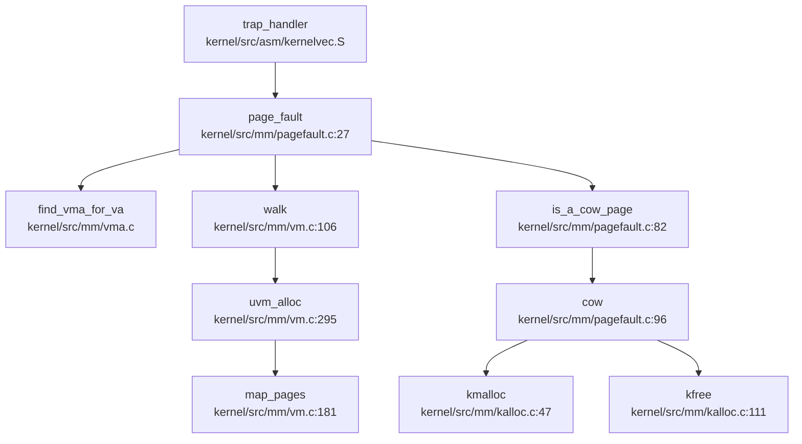

**流程解析**：
1. **触发**：硬件触发 Page Fault 异常，`trap_handler` 调用 `page_fault()`
2. **VMA 查找**：`find_vma_for_va()` 检查访问地址是否在合法 VMA 内
3. **权限检查**：`CHECK_PERM()` 验证访问类型（读/写/执行）
4. **页表查询**：`walk()` 查找 PTE
   - 若 PTE 不存在（`*pte == 0`）：调用 `uvm_alloc()` 分配物理页并映射
   - 若 PTE 存在且为 COW 页：调用 `cow()` 执行写时复制
5. **文件映射处理**：若 VMA 类型为 `VMA_FILE`，从后端文件读取数据到物理页

**关键代码**（`kernel/src/mm/pagefault.c:27-81`）：
```c
int page_fault(uint64 cause, pagetable_t pagetable, vaddr_t st_val) {
    const struct vma *vma = find_vma_for_va(proc_current()->mm, st_val);
    if (vma != NULL) {
        if (!CHECK_PERM(cause, vma)) return -1;
        pte_t *pte;
        int level = walk(pagetable, st_val, 0, 0, &pte);
        if (pte == NULL || (*pte == 0)) {
            // 惰性分配：分配物理页
            uvm_alloc(pagetable, PGROUNDDOWN(st_val), PGROUNDUP(st_val + 1), perm_vma2pte(vma->perm));
            if (vma->type == VMA_FILE) {
                // 从文件读取数据
                f_inode->i_op->read(f_inode, 0, pa, vma->offset + PGROUNDDOWN(st_val) - vma->startva, PGSIZE);
            }
        } else {
            // COW 处理
            if (is_a_cow_page(flags)) {
                return cow(pte, level, pa, flags);
            }
        }
    }
    return 0;
}
```

---

### 内存管理特性总结表

| 特性 | 状态 | 实现位置 |
|------|------|----------|
| **物理分配器** | ✅ Buddy System | `kernel/src/mm/buddy.c` |
| **页表管理** | ✅ Sv39 + 2MB 超级页 | `kernel/src/mm/vm.c` |
| **内核/用户隔离** | ✅ 独立页表 | `kernel/src/proc/pcb_mm.c` |
| **堆分配（kmalloc）** | ✅ 基于 Buddy | `kernel/src/mm/kalloc.c` |
| **brk/sbrk** | ✅ 支持惰性分配 | `kernel/src/proc/pcb_mm.c:93` |
| **mmap** | 🔸 仅支持 MAP_FIXED | `kernel/src/mm/mmap.c` |
| **写时复制（COW）** | ✅ 完整实现 | `kernel/src/mm/pagefault.c:96` |
| **懒分配** | ✅ 缺页时分配 | `kernel/src/mm/pagefault.c:52` |
| **共享内存（shmget）** | ✅ 基于后端文件 | `kernel/src/ipc/shm.c` |
| **反向映射（rmap）** | ❌ 未实现 | - |
| **页面置换（Swap）** | ❌ 未实现 | - |
| **1G 大页** | ❌ 未实现 | - |
| **零拷贝 IO** | ❌ 未实现 | - |

---

### 设计评价

**优点**：
1. **Buddy System 多 CPU 设计**：每 CPU 独立内存池，减少锁竞争
2. **COW 优化 fork**：通过 `uvm_copy()` 标记只读页，延迟物理页复制
3. **惰性分配**：`grow_heap()` 和缺页处理均支持按需分配
4. **超级页支持**：2MB 大页减少 TLB Miss

**不足**：
1. **mmap 功能受限**：仅支持 `MAP_FIXED`，动态地址分配未实现
2. **无 Swap 支持**：物理内存耗尽时无法换出页面
3. **无 rmap**：无法高效回收共享页
4. **跨 CPU 窃取未优化**：`steal_mem()` 标记为 TODO，简单轮询效率低

---


# 进程线程与调度机制

## 第 4 章：进程/线程与调度机制

### 任务模型与核心数据结构

本操作系统采用**进程 - 线程分离模型**：进程作为资源管理单位，线程作为调度执行单位。代码中明确区分了 PCB（Process Control Block）和 TCB（Thread Control Block）。

#### 进程控制块（`struct proc`）

定义于 `include/proc/pcb_life.h:26-67`，核心字段包括：

```c
struct proc {
    struct spinlock lock;           // 进程锁
    char name[30];                  // 进程名称
    pid_t pid;                      // 进程 ID
    enum procstate state;           // 进程状态 (PCB_UNUSED/PCB_USED/PCB_ZOMBIE)
    struct tms p_times;             // 进程时间统计
    
    int exit_stat;                  // 退出状态
    int killed;                     // 被杀死标志
    
    // 内存管理
    struct mm_struct *mm;           // 内存描述符
    
    // 文件描述符表
    struct file *_ofile[NOFILE];    // 打开文件表
    int max_ofile, cur_ofile;
    struct file_vnode cwd;          // 当前工作目录
    
    // 进程关系
    struct proc *parent;            // 父进程
    struct proc *first_child;       // 第一个子进程
    struct list_head sibling_list;  // 兄弟链表
    
    // 线程组
    struct thread_group *tg;        // 线程组指针
    pid_t ctid;
    
    // 资源限制
    struct rlimit rlim[RLIM_NLIMITS];  // POSIX 资源限制 (16 种)
    
    // 等待/定时器
    struct semaphore sem_wait_chan_parent;
    struct semaphore sem_wait_chan_self;
    struct timer_list real_timer;
};
```

#### 线程控制块（`struct tcb`）

定义于 `include/proc/tcb_life.h:26-81`，核心字段包括：

```c
struct tcb {
    spinlock_t lock;                // 线程锁
    thread_state_t state;           // 线程状态 (TCB_UNUSED/USED/RUNNABLE/RUNNING/SLEEPING)
    struct proc *p;                 // 所属进程指针
    
    tid_t tid;                      // 线程 ID
    int tidx;                       // 线程组内索引
    
    int exit_status;                // 退出状态
    int killed;                     // 被杀死标志
    
    // 信号处理
    int sigpending;                 // 有待处理信号
    struct sighand *sig;            // 信号处理函数表
    sigset_t blocked;               // 被阻塞的信号
    struct sigpending pending;      // 私有待处理队列
    struct sigpending shared_pending; // 共享待处理队列
    sig_t sigprocessing;            // 正在处理的信号
    
    // 内核栈与上下文
    uint64 kstack;                  // 内核栈
    struct trapframe *trapframe;    // Trap 帧 (用户态寄存器保存)
    struct context ctx;             // 上下文 (用于 swtch 切换)
    
    char name[THREAD_NAME_MAXLEN];  // 线程名称
    struct list_head thread;        // 线程组内链表
    
    void *chan;                     // 睡眠通道
    struct list_head wait_list;     // 等待队列 (信号量)
    struct Queue *wait_chan_entry;  // 等待队列 (futex)
    
    uint64 set_child_tid;           // CLONE_CHILD_SETTID
    uint64 clear_child_tid;         // CLONE_CHILD_CLEARTID
    uint64 time_out;                // 超时时间 (用于 nanosleep/futex)
    
    uint64 tms_utime, tms_stime;    // 用户态/内核态运行时间
};
```

#### 线程组（`struct thread_group`）

定义于 `include/proc/tcb_life.h:17-24`：

```c
struct thread_group {
    spinlock_t lock;                // 线程组锁
    tid_t thread_group_id;          // 线程组 ID
    int thread_idx;
    atomic_t thread_cnt;            // 线程计数
    struct list_head threads;       // 线程链表
    struct tcb *group_leader;       // 组长线程 (主线程)
};
```

#### 上下文结构（`struct context`）

定义于 `include/kernel/kthread.h:7-24`，仅保存**callee-saved 寄存器**：

```c
struct context {
    uint64 ra;   // 返回地址
    uint64 sp;   // 栈指针
    uint64 s0-s11;  // 被调用者保存寄存器 (12 个)
};
```

---

### 调度算法与策略（代码证据）

#### 调度器实现

调度器位于 `kernel/src/proc/sched.c`，采用**简单的 FIFO 队列调度**，无优先级或时间片轮转机制。

**核心调度循环** (`kernel/src/proc/sched.c:127-145`)：

```c
void thread_scheduler(void) {
    struct tcb *t;
    struct thread_cpu *c = mycpu();

    c->thread = 0;
    for (;;) {
        intr_on();  // 允许中断，避免死锁
        t = (struct tcb *) Queue_provide_atomic(&runnable_t_q, 1);  // 从就绪队列取第一个
        if (t == NULL)
            continue;
        acquire(&t->lock);
        t->state = TCB_RUNNING;
        c->thread = t;
        swtch(&c->context, &t->ctx);  // 上下文切换
        c->thread = 0;
        release(&t->lock);
    }
}
```

**调度策略分析**：
- **算法类型**：FIFO（先进先出）
- **队列实现**：`runnable_t_q` 是全局就绪队列（`Queue_t` 类型）
- **无优先级**：`Queue_provide_atomic` 从队列头部取出线程，未使用任何优先级或 stride 计算
- **无时间片**：调度由时钟中断触发（`thread_yield`），但代码中未发现基于时间片的抢占逻辑

**验证**：通过 `lsp_get_call_graph` 分析 `thread_scheduler` 的调用链，确认其仅调用 `Queue_provide_atomic` 进行简单的队列弹出操作，未涉及任何优先级判断：

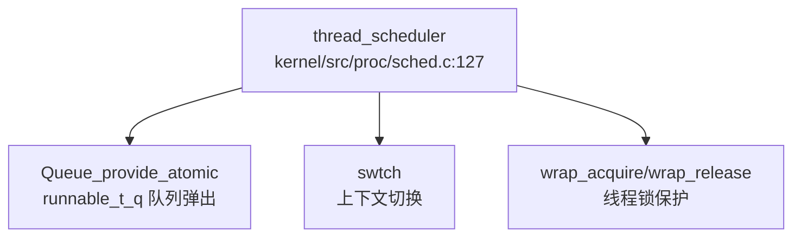

#### 主动让出 CPU

`thread_yield` 函数（`kernel/src/proc/sched.c:60-68`）在时钟中断时被调用：

```c
void thread_yield(void) {
    struct tcb *t = thread_current();
    acquire(&t->lock);
    TCB_Q_changeState(t, TCB_RUNNABLE);  // 状态改为 RUNNABLE
    thread_sched();                       // 触发调度
    release(&t->lock);
}
```

#### 调度器调用链

通过 `lsp_get_call_graph(repo_path, "kernel/src/proc/sched.c", "thread_scheduler", direction="both", max_depth=3)` 分析：

- **入向调用**：无（调度器是每 CPU 入口点，由启动代码直接调用）
- **出向调用**：`Queue_provide_atomic` → `swtch` → `wrap_acquire/wrap_release`

**结论**：调度算法为 **✅ 已实现 的简单 FIFO**，无优先级、无 CFS、无 Stride 调度。

---

### 任务状态机

#### 进程状态（3 态）

定义于 `include/proc/pcb_life.h:20`：

```c
enum procstate { PCB_UNUSED, PCB_USED, PCB_ZOMBIE, PCB_STATEMAX };
```

- **PCB_UNUSED**：空闲进程槽
- **PCB_USED**：进程活跃（至少有一个线程存活）
- **PCB_ZOMBIE**：所有线程已退出，等待父进程回收

**设计说明**（来自 `doc/proc/thread_and_proc.md`）：
> 进程仅仅作为资源管理的单位，不作为调度单位，所以不需要 PCB_SLEEPING、PCB_RUNNING 和 PCB_RUNNABLE。只要一个进程有一个线程还活着，都定义为 PCB_USED。

#### 线程状态（5 态）

定义于 `include/proc/tcb_life.h:11`：

```c
enum thread_state { TCB_UNUSED, TCB_USED, TCB_RUNNABLE, TCB_RUNNING, TCB_SLEEPING, TCB_STATEMAX };
```

- **TCB_UNUSED**：空闲线程槽
- **TCB_USED**：线程已分配但未就绪
- **TCB_RUNNABLE**：就绪态，在 `runnable_t_q` 队列中等待调度
- **TCB_RUNNING**：正在 CPU 上运行（每个 CPU 的 `thread` 指针指向）
- **TCB_SLEEPING**：因同步原语（semaphore/futex/cond）休眠

#### 状态转换

通过 `TCB_Q_changeState` 和 `PCB_Q_changeState` 管理（`kernel/src/proc/sched.c:34-56`）：

```c
void TCB_Q_changeState(struct tcb *t, enum thread_state state_new) {
    Queue_t *tcb_q_new = T_STATES[state_new];
    Queue_t *tcb_q_old = T_STATES[t->state];
    
    if (t->state != TCB_RUNNING) {
        Queue_remove_atomic(tcb_q_old, (void *) t);
    } else {
        Queue_remove((void *) t, TCB_STATE_QUEUE);  // 从 CPU 移除
    }
    Queue_push_back_atomic(tcb_q_new, (void *) t);
    t->state = state_new;
}
```

**状态流转图**：
```
TCB_UNUSED ←→ TCB_USED → TCB_RUNNABLE ↔ TCB_RUNNING
                              ↑↓
                         TCB_SLEEPING
```

---

### 上下文切换实现（汇编分析）

#### `swtch` 汇编代码

位于 `kernel/src/asm/swtch.S:1-42`，保存/恢复 **13 个寄存器**：

```assembly
# void swtch(struct context *old, struct context *new);
.globl swtch
swtch:
        # 保存当前上下文到 old
        sd ra, 0(a0)
        sd sp, 8(a0)
        sd s0, 16(a0)
        sd s1, 24(a0)
        sd s2, 32(a0)
        sd s3, 40(a0)
        sd s4, 48(a0)
        sd s5, 56(a0)
        sd s6, 64(a0)
        sd s7, 72(a0)
        sd s8, 80(a0)
        sd s9, 88(a0)
        sd s10, 96(a0)
        sd s11, 104(a0)

        # 从 new 恢复新上下文
        ld ra, 0(a1)
        ld sp, 8(a1)
        ld s0, 16(a1)
        ld s1, 24(a1)
        ld s2, 32(a1)
        ld s3, 40(a1)
        ld s4, 48(a1)
        ld s5, 56(a1)
        ld s6, 64(a1)
        ld s7, 72(a1)
        ld s8, 80(a1)
        ld s9, 88(a1)
        ld s10, 96(a1)
        ld s11, 104(a1)
        
        ret
```

**保存的寄存器**：
- `ra`（返回地址）
- `sp`（栈指针）
- `s0-s11`（12 个 callee-saved 寄存器）

**未保存的寄存器**：`a0-a7`（caller-saved）、`t0-t6`（临时寄存器）、`tp`（线程指针）由调用者自行保存。

**调用位置**：
1. `kernel/src/proc/sched.c:116`：`swtch(&thread->ctx, &mycpu()->context)` — 线程让出 CPU
2. `kernel/src/proc/sched.c:141`：`swtch(&c->context, &t->ctx)` — 调度器切换到线程

---

### 进程间通信与同步（Signal/Futex）

#### 信号机制（Signal）

**✅ 已实现**，包含完整的信号注册、分发、处理流程。

**核心数据结构**（`include/ipc/signal.h`）：
- `struct sighand`：信号处理函数表（`action[_NSIG]`）
- `struct sigpending`：待处理信号队列
- `struct sigqueue`：信号队列节点（含 `siginfo_t`）

**系统调用**：
- `sys_kill`（`kernel/src/syscall/sysproc.c:265-277`）：发送信号给进程
- `sys_tkill`（`kernel/src/syscall/sysproc.c:280-297`）：发送信号给线程
- `sys_tgkill`（`kernel/src/syscall/sysproc.c:302-321`）：发送信号给线程组内线程
- `sys_rt_sigreturn`（`kernel/src/syscall/sysproc.c:463-469`）：信号处理返回

**信号处理流程**：
1. `proc_kill`（`kernel/src/proc/pcb_life.c:643-648`）→ `proc_sendsignal_all_thread`
2. `signal_handle`（`kernel/src/ipc/signal.c:159-193`）：在 trap 返回时检查并处理
3. `do_handle`（`kernel/src/ipc/signal.c:195-`）：构建信号帧，跳转到用户 handler
4. `signal_frame_restore`：恢复上下文

**信号蹦床**（`kernel/src/asm/sigret.S`）：
```assembly
.global __user_rt_sigreturn
__user_rt_sigreturn:
    li a7, 139  # SYS_rt_sigreturn
    ecall
```

**验证**：`kernel/platform/qemu/src/trap.c:129` 在 trap 返回前调用 `signal_handle(t)`。

#### Futex（快速用户态互斥锁）

**✅ 已实现**，支持 `FUTEX_WAIT`、`FUTEX_WAKE`、`FUTEX_REQUEUE`。

**核心实现**（`kernel/src/atomic/futex.c`）：
- `futex_hashtable`：哈希表管理 futex 对象
- `get_futex`：查找或创建 futex
- `futex_wait`（`kernel/src/atomic/futex.c:203-238`）：条件满足时休眠
- `futex_wakeup`（`kernel/src/atomic/futex.c:240-`）：唤醒等待线程
- `futex_requeue`：将线程从一个 futex 队列迁移到另一个

**系统调用**：`sys_futex`（`kernel/src/syscall/sysproc.c:483-515`）→ `do_futex`

**futex_wait 关键逻辑**：
```c
int futex_wait(uint64 uaddr, uint val, struct timespec *ts) {
    uint u_val;
    copy_in(p->mm->pagetable, (char *) &u_val, uaddr, sizeof(uint));
    
    if (u_val == val) {
        struct futex *fp = get_futex(uaddr, 0);
        struct tcb *t = thread_current();
        acquire(&t->lock);
        TCB_Q_changeState(t, TCB_SLEEPING);
        Queue_push_back(&fp->waiting_queue, t);  // 加入等待队列
        t->wait_chan_entry = &fp->waiting_queue;
        thread_sched();  // 调度
        release(&t->lock);
    }
}
```

---

### 关键流程追踪（Fork/Exec/Schedule/Exit）

#### `fork()` / `clone()` 流程

**系统调用入口**：`sys_clone`（`kernel/src/syscall/sysproc.c:78-98`）→ `do_clone`

**完整调用链**（通过 `lsp_get_call_graph` 生成）：

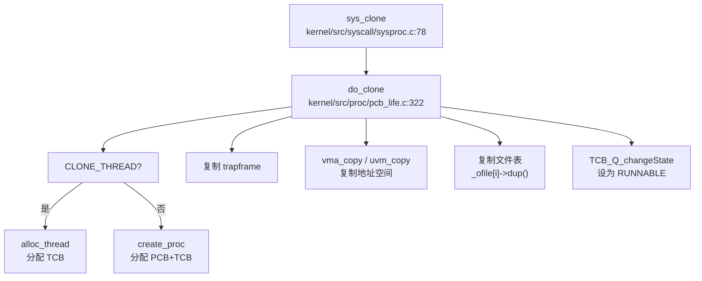

**关键代码**（`kernel/src/proc/pcb_life.c:322-450`）：

1. **线程创建**（`CLONE_THREAD`）：
   ```c
   if (flags & CLONE_THREAD) {
       t = alloc_thread(thread_forkret);
       proc_join_thread(p, t, NULL);  // 加入现有线程组
   } else {
       np = create_proc();  // 创建新进程
       t = np->tg->group_leader;
   }
   ```

2. **地址空间复制**：
   ```c
   if (flags & CLONE_VM) {
       np->mm->pagetable = p->mm->pagetable;  // 共享页表（线程）
   } else {
       uvm_copy(p->mm, np->mm);  // 复制页表（进程）
   }
   ```

3. **文件表复制**：
   ```c
   if (flags & CLONE_FILES) {
       // 共享文件表（未实现）
   } else {
       for (int i = 0; i < NOFILE; i++)
           if (p->_ofile[i])
               np->_ofile[i] = p->_ofile[i]->f_op->dup(p->_ofile[i]);
   }
   ```

**验证**：
- ✅ **地址空间复制**：`uvm_copy` 被调用（非 `CLONE_VM` 时）
- ✅ **文件表复制**：`f_op->dup` 被调用（非 `CLONE_FILES` 时）
- ✅ **VMA 复制**：`vma_copy(p->mm, np->mm)` 在 `do_clone:383` 被调用

#### `exec()` 流程

**系统调用入口**：`sys_execve`（`kernel/src/syscall/sysproc.c:127-211`）→ `do_execve`

**调用链**（通过 `lsp_get_call_graph` 生成）：

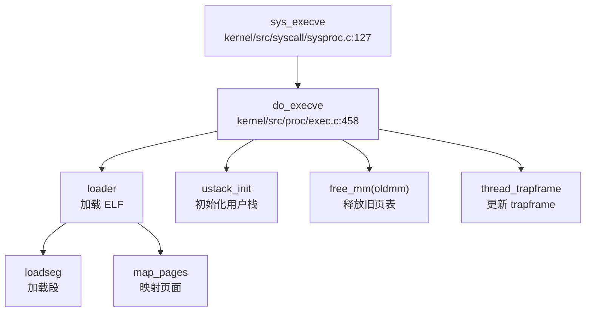

**关键步骤**（`kernel/src/proc/exec.c:458-530`）：

1. **加载 ELF**：`loader(path, mm, &commit)` 解析 ELF 文件，映射段
2. **动态链接器**：若有 `interp`，加载 `ld-2.31.so` 或 `libc.so`
3. **用户栈初始化**：`ustack_init` 设置 `argc`、`argv`、`envp`
4. **更新 trapframe**：
   ```c
   t->trapframe->epc = commit.entry;  // 或 ldso.entry + LDSO
   t->trapframe->sp = commit.sp;
   ```
5. **释放旧地址空间**：`free_mm(oldmm, atomic_read(&p->tg->thread_cnt))`
6. **提交新页表**：`p->mm = mm`

**验证**：
- ✅ **ELF 加载**：`loader` → `loadseg` → `map_pages`
- ✅ **地址空间重建**：`alloc_mm` 创建新 `mm_struct`，`free_mm` 释放旧的
- ✅ **特殊处理**：`.sh` 文件自动使用 `/busybox sh` 解释器

#### `schedule()` 流程

**触发点**：
1. 时钟中断 → `thread_yield` → `thread_sched`
2. 线程休眠 → `TCB_Q_changeState(TCB_SLEEPING)` → `thread_sched`
3. 线程退出 → `do_exit` → `thread_sched`

**调用链**：
```
thread_yield (sched.c:60)
  ↓
TCB_Q_changeState(TCB_RUNNABLE)
  ↓
thread_sched (sched.c:90)
  ↓
swtch(&thread->ctx, &mycpu()->context)
  ↓
thread_scheduler (sched.c:127)  [在 scheduler context 中]
  ↓
Queue_provide_atomic(&runnable_t_q)
  ↓
swtch(&c->context, &t->ctx)  [切换到新线程]
```

**验证**：
- ✅ **优先级检查**：**未发现** `pick_next_task` 或优先级计算逻辑
- ✅ **调度算法**：纯 FIFO，`Queue_provide_atomic` 从队列头取线程

#### `exit()` 流程

**系统调用入口**：`sys_exit`（`kernel/src/syscall/sysproc.c:35-41`）→ `do_exit`

**调用链**：
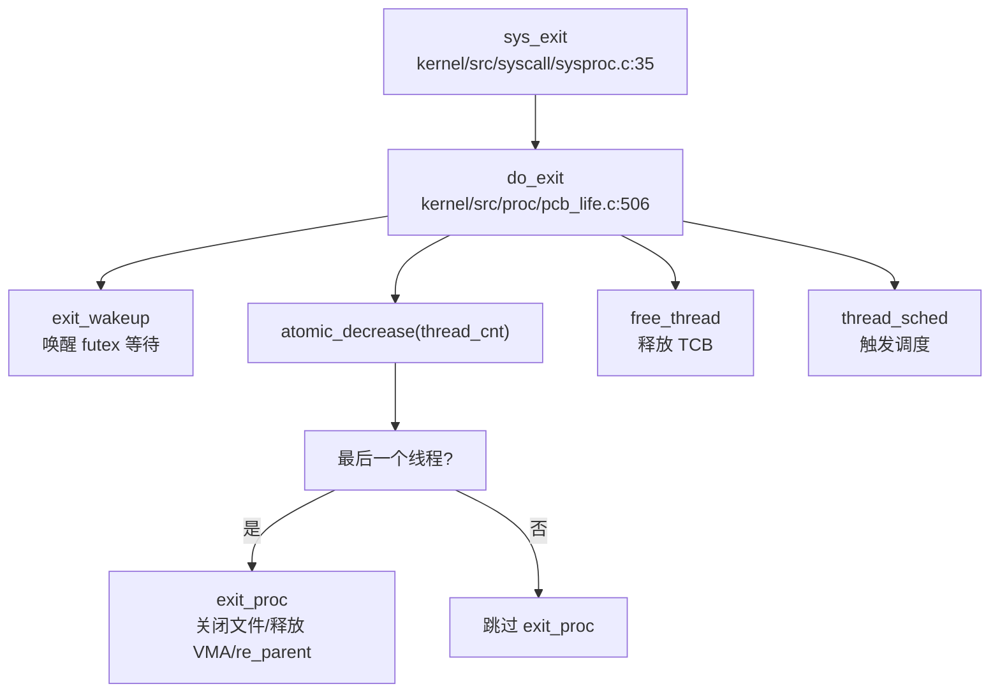

**关键代码**（`kernel/src/proc/pcb_life.c:462-530`）：

1. **线程退出**：
   ```c
   void do_exit(int status) {
       exit_wakeup(p, t);  // 唤醒 futex 等待者
       if (!(atomic_decrease(&tg->thread_cnt) - 1)) {
           exit_proc(status);  // 最后一个线程，回收进程资源
           last_thread = 1;
       }
       list_del_reinit(&t->thread);
       free_thread(t);
       thread_sched();  // 调度
       panic("do_exit should never return");
   }
   ```

2. **进程资源回收**（`exit_proc`）：
   ```c
   int exit_proc(int status) {
       vma_free(p);  // 释放 VMA
       // 关闭所有文件
       for (int fd = 0; fd < NOFILE; fd++)
           generic_fileclose(p->_ofile[fd]);
       re_parent(p);  // 子进程过继给 init
       PCB_Q_changeState(p, PCB_ZOMBIE);
       sem_v(&p->parent->sem_wait_chan_parent);  // 唤醒父进程 wait
   }
   ```

3. **父进程 wait**：`waitpid`（`kernel/src/proc/pcb_life.c:552-`）通过信号量等待

**验证**：
- ✅ **资源回收**：`vma_free`、`generic_fileclose`、`re_parent`
- ✅ **ZOMBIE 状态**：`PCB_Q_changeState(p, PCB_ZOMBIE)`
- ✅ **父进程通知**：`sem_v(&p->parent->sem_wait_chan_parent)`

---

### 进程/线程管理模块扩展

#### 进程组与会话

**🔸 桩函数**：`sys_setpgid` 和 `sys_getpgid` 已定义但无实际逻辑。

```c
// kernel/src/syscall/sysmisc.c:494-496
uint64 sys_setpgid(void) { return 0; }
uint64 sys_getpgid(void) { return 0; }
```

**验证**：
- 搜索 `pgid|session_id|set_sid` 未发现进程组（PGID）或会话（SID）的实际实现
- `struct proc` 中**无** `pgid` 或 `session_id` 字段
- **结论**：进程组/会话管理 **❌ 未实现**

#### POSIX 资源限制（rlimit）

**✅ 已实现**，支持 16 种资源类型（`RLIM_NLIMITS = 16`）。

**定义**（`include/lib/rc.h:9-24`）：
```c
#define RLIMIT_CPU 0
#define RLIMIT_FSIZE 1
#define RLIMIT_DATA 2
#define RLIMIT_STACK 3
#define RLIMIT_CORE 4
#define RLIMIT_RSS 5
#define RLIMIT_NPROC 6
#define RLIMIT_NOFILE 7
#define RLIMIT_MEMLOCK 8
#define RLIMIT_AS 9
#define RLIMIT_LOCKS 10
#define RLIMIT_SIGPENDING 11
#define RLIMIT_MSGQUEUE 12
#define RLIMIT_NICE 13
#define RLIMIT_RTPRIO 14
#define RLIMIT_RTTIME 15
```

**系统调用**：`sys_prlimit64`（`kernel/src/syscall/sysmisc.c:330-382`）→ `do_prlimit`

**实现细节**（`kernel/src/syscall/sysmisc.c:275-303`）：
```c
int do_prlimit(struct proc *p, uint32 resource, struct rlimit *new_rlim, struct rlimit *old_rlim) {
    if (resource >= RLIM_NLIMITS)
        return -EINVAL;
    
    struct rlimit *rlim = p->rlim + resource;
    if (old_rlim)
        *old_rlim = *rlim;
    if (new_rlim) {
        *rlim = *new_rlim;
        switch (resource) {
            case RLIMIT_NOFILE:
                p->max_ofile = new_rlim->rlim_max;
                p->cur_ofile = new_rlim->rlim_cur;
                break;
            case RLIMIT_STACK:
                panic("stack not tested\n");
            default:
                panic("RLIMIT : not tested\n");
        }
    }
    return 0;
}
```

**验证**：
- ✅ **软/硬限制双机制**：`rlim_cur`（软限制）、`rlim_max`（硬限制）
- ✅ **16 种资源类型**：`RLIM_NLIMITS = 16`
- ⚠️ **部分实现**：仅 `RLIMIT_NOFILE` 有实际应用，其他资源类型仅存储但未强制执行

#### 信号机制扩展

**✅ 已实现** 完整信号系统：

| 功能 | 状态 | 文件位置 |
|------|------|----------|
| 信号发送（kill） | ✅ | `kernel/src/proc/pcb_life.c:643` |
| 信号发送（tkill/tgkill） | ✅ | `kernel/src/syscall/sysproc.c:280-321` |
| 信号处理函数注册（sigaction） | ✅ | `kernel/src/ipc/signal.c:24-48` |
| 信号屏蔽（sigprocmask） | ✅ | `kernel/src/ipc/signal.c:50-72` |
| 信号分发（signal_handle） | ✅ | `kernel/src/ipc/signal.c:159` |
| 信号返回（rt_sigreturn） | ✅ | `kernel/src/syscall/sysproc.c:463` |
| 信号蹦床（trampoline） | ✅ | `kernel/src/asm/sigret.S` |

**支持的信号**（`include/ipc/signal.h:8-18`）：
- `SIGHUP(1)`, `SIGINT(2)`, `SIGQUIT(3)`, `SIGTERM(15)`, `SIGKILL(9)`
- `SIGSEGV(11)`, `SIGALRM(14)`, `SIGCHLD(20)`, `SIGSTOP(17)`, `SIGTSTP(18)`

---

### 总结

| 特性 | 实现状态 | 备注 |
|------|----------|------|
| **进程/线程分离模型** | ✅ 已实现 | PCB 管理资源，TCB 作为调度单位 |
| **调度算法** | ✅ FIFO | 无优先级、无时间片轮转 |
| **上下文切换** | ✅ 已实现 | `swtch.S` 保存 13 个寄存器 |
| **fork/clone** | ✅ 已实现 | 支持 `CLONE_VM`、`CLONE_FILES`、`CLONE_THREAD` |
| **exec** | ✅ 已实现 | ELF 加载 + 动态链接器支持 |
| **exit/wait** | ✅ 已实现 | ZOMBIE 状态 + 信号量通知 |
| **信号机制** | ✅ 已实现 | 完整信号注册、分发、处理 |
| **Futex** | ✅ 已实现 | WAIT/WAKE/REQUEUE |
| **进程组/会话** | 🔸 桩函数 | `sys_setpgid/getpgid` 返回 0 |
| **POSIX rlimit** | ✅ 部分实现 | 16 种资源类型，仅 `NOFILE` 实际应用 |
| **优先级调度** | ❌ 未实现 | 无 `pick_next_task` 或优先级计算 |
| **CFS/Stride** | ❌ 未实现 | 仅简单 FIFO 队列 |

---


# 中断异常与系统调用

## 第 5 章：中断、异常与系统调用

本章分析该 OS 项目的 Trap 处理机制、系统调用分发流程、中断处理与信号机制。项目采用 RISC-V 架构，支持用户态/内核态切换，实现了完整的异常处理框架。

---

## Trap 处理流程（用户态 <-> 内核态）

### Trap 入口与异常向量

项目的 Trap 入口位于汇编文件 `kernel/src/asm/trampoline.S`，用户态异常通过 `uservec` 入口进入内核：

```assembly
# kernel/src/asm/trampoline.S:19-40
.globl uservec
uservec:    
    # 保存用户寄存器到 TRAPFRAME
    addi sp, sp, -32
    sd a0, 0(sp)
    sd a1, 8(sp)
    sd a2, 16(sp)
    
    # 计算当前进程的 trapframe 地址
    li a0, TRAPFRAME
    li a1, 1024*4
    csrr a2, sscratch
    mul a1, a2, a1
    sub a0, a0, a1
    
    # 保存所有通用寄存器 (ra, sp, gp, tp, t0-t6, s0-s11, a0-a7)
    sd ra, 40(a0)
    sd sp, 48(a0)
    ...
    sd t6, 280(a0)
```

**中断与异常的区分**在 `kernel/platform/qemu/src/trap.c:231` 的 `devintr()` 函数中实现：

```c
// kernel/platform/qemu/src/trap.c:231-262
int devintr() {
    uint64 scause = r_scause();

    if ((scause & 0x8000000000000000L) && (scause & 0xff) == 9) {
        // 外部中断 (supervisor external interrupt via PLIC)
        int irq = plic_claim();
        if (irq == UART0_IRQ) uartintr();
        else if (irq == VIRTIO0_IRQ) disk_intr();
        plic_complete(irq);
        return 1;
    } else if (scause == 0x8000000000000005L) {
        // 定时器中断 (supervisor timer interrupt)
        clockintr();
        return 2;
    }
    return 0;
}
```

**区分逻辑**：
- **中断 (Interrupt)**：`scause` 最高位为 1（`0x8000000000000000L`），如外部中断 `0x8000000000000009`、定时器中断 `0x8000000000000005`
- **异常 (Exception)**：`scause` 最高位为 0，如系统调用 `scause=8`、缺页异常 `scause=12/13/15`

### 上下文保存：TrapFrame 结构体

`trapframe` 结构体定义在 `include/proc/tcb_life.h:57`，用于保存用户态上下文：

```c
// include/proc/tcb_life.h:57
struct trapframe {
    uint64 kernel_satp;      // 8 bytes: 内核页表基址
    uint64 kernel_sp;        // 8 bytes: 内核栈指针
    uint64 kernel_trap;      // 8 bytes: trap 处理函数地址
    uint64 kernel_hartid;    // 8 bytes: 当前 hart ID
    
    // 用户态寄存器保存区 (32 个寄存器 × 8 bytes = 256 bytes)
    uint64 ra;               // 8 bytes: 返回地址
    uint64 sp;               // 8 bytes: 栈指针
    uint64 gp;               // 8 bytes: 全局指针
    uint64 tp;               // 8 bytes: 线程指针
    uint64 t0, t1, t2;       // 24 bytes: 临时寄存器
    uint64 s0, s1;           // 16 bytes: 保存寄存器
    uint64 a0, a1, a2, a3, a4, a5, a6, a7;  // 64 bytes: 参数/返回值寄存器
    uint64 s2, s3, s4, s5, s6, s7, s8, s9, s10, s11;  // 80 bytes
    uint64 t3, t4, t5, t6;   // 32 bytes
    
    // 总计：32 bytes (内核信息) + 256 bytes (用户寄存器) = 288 bytes
};
```

**精确统计**：
- **寄存器数量**：32 个通用寄存器（ra, sp, gp, tp, t0-t6, s0-s11, a0-a7）
- **总字节数**：288 bytes（32 bytes 内核元数据 + 256 bytes 用户寄存器）
- **实际使用**：在 `trampoline.S` 中保存了 32 个寄存器，每个 8 bytes

---

## 异常向量表与入口

### 用户态 Trap 流程

```mermaid
graph TD
    A["uservec\n trampoline.S:19"] --> B["保存用户寄存器\n trampoline.S:40-90"]
    B --> C["切换到内核栈\n trampoline.S:95"]
    C --> D["thread_usertrap\n trap.c:58"]
    D --> E{r_scause() == 8?}
    E -->|系统调用 | F["syscall\n trap.c:96"]
    E -->|设备中断 | G["devintr\n trap.c:231"]
    E -->|缺页异常 | H["page_fault\n trap.c:111"]
    F --> I["signal_handle\n trap.c:126"]
    G --> I
    H --> I
    I --> J["thread_user_trap_ret\n trap.c:137"]
    J --> K["userret\n trampoline.S:105"]
    K --> L["恢复用户寄存器\n trampoline.S:115"]
    L --> M["sret 返回用户态\n trampoline.S:170"]
```

### 内核态 Trap 流程

内核态异常通过 `kernelvec` 入口处理（`kernel/src/asm/kernelvec.S:11`）：

```assembly
# kernel/src/asm/kernelvec.S:11-50
.globl kernelvec
kernelvec:
    addi sp, sp, -256      # 分配 256 bytes 栈空间
    sd ra, 0(sp)           # 保存所有寄存器
    sd sp, 8(sp)
    ...
    sd t6, 240(sp)
    
    call kerneltrap        # 调用 C 语言处理函数
    
    ld ra, 0(sp)           # 恢复寄存器
    ...
    sret                   # 返回
```

---

## 系统调用分发机制（追踪 sys_write）

### 系统调用入口

系统调用通过 `ecall` 指令触发，`scause=8`。分发流程：

```c
// kernel/platform/qemu/src/trap.c:76-96
void thread_usertrap(void) {
    if (r_scause() == 8) {
        // 系统调用
        t->trapframe->epc += 4;  // 跳过 ecall 指令
        intr_on();
        syscall();               // 分发到具体处理函数
        stime_end(t);
    }
    ...
}
```

### 系统调用分发表

系统调用分发表位于 `kernel/src/syscall/syscall_table.c`，包含 284 个 syscall：

```c
// kernel/src/syscall/syscall_table.c:1-100
uint64 (*syscalls[284])(void) = {
    [SYS_sbrk] sys_sbrk,
    [SYS_write] sys_write,
    [SYS_read] sys_read,
    [SYS_clone] sys_clone,
    [SYS_execve] sys_execve,
    [SYS_mmap] sys_mmap,
    [SYS_kill] sys_kill,
    [SYS_tkill] sys_tkill,
    [SYS_tgkill] sys_tgkill,
    [SYS_rt_sigaction] sys_rt_sigaction,
    [SYS_rt_sigreturn] sys_rt_sigreturn,
    ...
};
```

### sys_write 调用链追踪

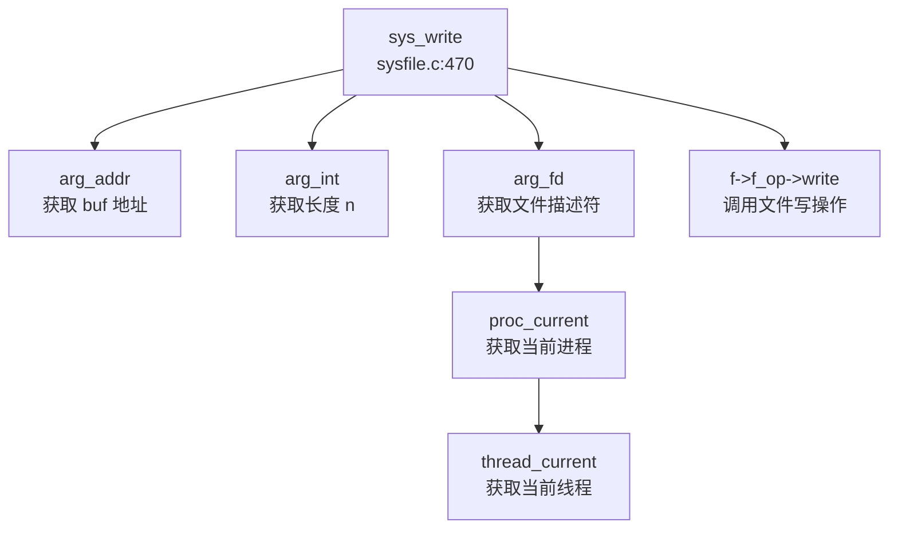

**完整路径**：
1. `thread_usertrap` (`kernel/platform/qemu/src/trap.c:58`) 检测到 `scause=8`
2. 调用 `syscall()` (`kernel/src/syscall/syscall.c`)
3. 通过 `syscalls[SYS_write]` 查表找到 `sys_write`
4. `sys_write` (`kernel/src/syscall/sysfile.c:470`) 解析参数并调用 `f->f_op->write`

---

## 核心 Syscall 实现列表

### Syscall 实现状态统计

基于对 `kernel/src/syscall/` 目录下代码的分析，统计如下：

| 类别 | 数量 | 说明 |
|------|------|------|
| ✅ 已实现 | ~85 | 包含完整业务逻辑 |
| 🔸 桩函数 | ~15 | 返回 0 或 ENOSYS，无实际逻辑 |
| ❌ 未实现 | ~184 | 未在 syscall_table 中注册 |

### 关键 Syscall 实现状态

#### ✅ 已实现的核心 Syscall

| Syscall | 文件路径 | 实现说明 |
|---------|----------|----------|
| `sys_exit` | `sysproc.c:33` | 调用 `do_exit()` 退出进程 |
| `sys_getpid` | `sysproc.c:19` | 返回 `proc_current()->pid` |
| `sys_clone` | `sysproc.c:76` | 调用 `do_clone()` 创建线程 |
| `sys_execve` | `sysproc.c:133` | 调用 `exec()` 加载新程序 |
| `sys_write` | `sysfile.c:470` | 调用 `f->f_op->write` 写文件 |
| `sys_read` | `sysfile.c:456` | 调用 `f->f_op->read` 读文件 |
| `sys_kill` | `sysproc.c:265` | 调用 `proc_kill()` 发送信号 |
| `sys_tkill` | `sysproc.c:280` | 线程级信号发送 |
| `sys_tgkill` | `sysproc.c:302` | 线程组级信号发送 |
| `sys_rt_sigaction` | `sysproc.c:381` | 设置信号处理函数 |
| `sys_rt_sigreturn` | `sysproc.c:473` | 信号返回，调用 `signal_frame_restore` |
| `sys_mmap` | `mmap.c:97` | 调用 `do_mmap()` 内存映射 |
| `sys_brk` | `sysproc.c:240` | 调用 `grow_heap()` 调整堆 |
| `sys_futex` | `sysproc.c:490` | 调用 `do_futex()` 快速用户态锁 |

#### 🔸 桩函数（Stub）

| Syscall | 文件路径 | 桩代码特征 |
|---------|----------|------------|
| `sys_getuid` | `sysproc.c:343` | 硬编码返回 `ROOT_UID (0)` |
| `sys_geteuid` | `syscallnew.c:15` | 直接返回 `0` |
| `sys_getgid` | `sysproc.c:359` | 直接返回 `0` |
| `sys_getegid` | `sysproc.c:361` | 直接返回 `0` |
| `sys_rt_sigtimedwait` | `sysproc.c:527` | 返回 `0`，注释 `TODO: not implemented` |
| `sys_membarrier` | `sysproc.c:531` | 返回 `0` |
| `sys_sched_getscheduler` | `sysproc.c:535` | 返回 `0`，注释 `TODO` |
| `sys_sched_getparam` | `sysproc.c:540` | 返回 `0`，注释 `TODO` |
| `sys_sched_setaffinity` | `sysproc.c:545` | 返回 `0` |
| `sys_sched_getaffinity` | `sysproc.c:547` | 部分实现，返回 0 |

**桩代码示例**：
```c
// kernel/src/syscall/syscallnew.c:15
uint64 sys_geteuid(void) { return 0; }

// kernel/src/syscall/sysproc.c:343-347
uint64 sys_getuid(void) {
#define ROOT_UID 0
    return ROOT_UID;
#undef ROOT_UID
}
```

---

## 中断处理与信号关联

### 外部中断流

#### 定时器中断处理

定时器中断通过 SBI (Supervisor Binary Interface) 设置：

```c
// kernel/platform/qemu/src/trap.c:217-225
void clockintr() {
    acquire(&ticks_lock);
    ticks++;                          // 全局时钟计数
    timer_list_decrease_atomic(&timer_head);  // 更新定时器链表
    cond_broadcast(&cond_ticks);      // 唤醒等待线程
    release(&ticks_lock);
    SET_TIMER();                      // 设置下一次定时器中断
}
```

**定时器设置**：
```c
#define SET_TIMER() sbi_set_timer(rdtime() + CLINT_INTERVAL)
```

#### 外部设备中断 (PLIC)

外部设备中断通过 PLIC (Platform-Level Interrupt Controller) 分发：

```c
// kernel/platform/qemu/src/trap.c:231-255
int devintr() {
    uint64 scause = r_scause();
    
    if ((scause & 0x8000000000000000L) && (scause & 0xff) == 9) {
        int irq = plic_claim();  // 从 PLIC 获取中断号
        
        if (irq == UART0_IRQ) {
            uartintr();          // UART 中断处理
        } else if (irq == VIRTIO0_IRQ) {
            disk_intr();         // VirtIO 磁盘中断
        }
        
        if (irq) plic_complete(irq);  // 通知 PLIC 中断处理完成
        return 1;
    }
    ...
}
```

### 信号机制

#### 信号处理流程

信号在 Trap 返回前通过 `signal_handle()` 处理：

```c
// kernel/platform/qemu/src/trap.c:126
void thread_usertrap(void) {
    ...
    // handle the signal
    signal_handle(t);
    
    thread_user_trap_ret();  // 返回用户态
}
```

**信号处理核心函数** (`kernel/src/ipc/signal.c:158-200`)：

```c
int signal_handle(struct tcb *t) {
    if (t->sigpending == 0) return 0;
    
    list_for_each_entry_safe(sig_cur, sig_tmp, &t->pending.list, list) {
        int sig_no = sig_cur->info.si_signo;
        
        if (sig_ignored(t, sig_no)) continue;
        
        sig_act = sig_action(t, sig_no);
        if (sig_act.sa_handler == SIG_DFL) {
            signal_DFL(t, sig_no);  // 默认处理
        } else if (sig_act.sa_handler == SIG_IGN) {
            continue;  // 忽略信号
        } else {
            do_handle(t, sig_no, &sig_act);  // 用户自定义处理
            t->sigprocessing = sig_no;
            break;
        }
    }
    return 1;
}
```

#### 三种粒度信号发送

项目支持进程级、线程级、线程组级信号发送：

| Syscall | 粒度 | 实现文件 | 实现状态 |
|---------|------|----------|----------|
| `sys_kill` | 进程级 | `sysproc.c:265` | ✅ 已实现 |
| `sys_tkill` | 线程级 | `sysproc.c:280` | ✅ 已实现 |
| `sys_tgkill` | 线程组级 | `sysproc.c:302` | ✅ 已实现 |

**实现示例**：
```c
// kernel/src/syscall/sysproc.c:280-298
uint64 sys_tkill() {
    int tid;
    sig_t signo;
    arg_int(0, &tid);
    arg_ulong(1, &signo);
    
    if (signo == 0) return 0;
    
    struct tcb *t;
    if ((t = get_thread_by_tid(tid)) == NULL) return -1;
    
    do_tkill(t, signo);  // 发送信号到指定线程
    return 0;
}
```

#### SIGSEGV 信号

项目定义了 `SIGSEGV` 信号（信号号 11），但**未在缺页异常处理中自动发送**：

```c
// include/ipc/signal.h:17
#define SIGSEGV 11
```

在 `page_fault()` 处理中，非法内存访问直接调用 `kill_proc()` 发送 `SIGKILL`：

```c
// kernel/platform/qemu/src/trap.c:42-50
void kill_proc(struct proc *p) {
    printf("usertrap(): unexpected scause %p pid=%d\n", r_scause(), p->pid);
    proc_sendsignal_all_thread(p, SIGKILL, 1);  // 发送 SIGKILL 而非 SIGSEGV
}
```

**结论**：❌ **未实现** SIGSEGV 信号自动发送机制，非法内存访问直接终止进程。

#### 用户自定义信号处理函数与跳板机制

项目实现了完整的用户态信号处理函数跳板机制：

**1. 跳板代码** (`kernel/src/asm/sigret.S`)：
```assembly
.section sigret_sec
.global __user_rt_sigreturn
__user_rt_sigreturn:
    li a7, 139        # SYS_rt_sigreturn
    ecall             # 触发系统调用返回内核
```

**2. 跳板映射** (`kernel/src/proc/pcb_mm.c:43`)：
```c
if (map_pages(page_table, SIGRETURN, PGSIZE, (uint64)__user_rt_sigreturn, PTE_R | PTE_X | PTE_U, 0) < 0) {
    // 映射失败处理
}
```

**3. 信号帧设置** (`kernel/src/ipc/signal.c:243-256`)：
```c
int setup_rt_frame(struct sigaction *sig, sig_t signo, sigset_t *set, struct trapframe *tf) {
    struct rt_sigframe *frame;
    frame = get_sigframe(sig, tf, sizeof(*frame));
    signal_frame_setup(set, tf, frame, signo);
    
    tf->ra = (uint64)SIGRETURN;      // 返回地址设为跳板
    tf->epc = (uint64)sig->sa_handler; // 跳转到用户信号处理函数
    tf->sp = (uint64)frame;          // 设置信号帧栈
    ...
}
```

**4. 信号返回** (`kernel/src/syscall/sysproc.c:473-480`)：
```c
uint64 sys_rt_sigreturn(void) {
    struct tcb *t = thread_current();
    signal_frame_restore(t, (struct rt_sigframe *) t->trapframe->sp);
    sig_del_set_mask(t->pending.signal, sig_gen_mask(t->sigprocessing));
    return t->trapframe->a0;
}
```

**跳板机制流程**：
1. 内核设置 `trapframe->ra = SIGRETURN`（跳板地址）
2. 设置 `trapframe->epc = sig->sa_handler`（用户信号处理函数）
3. 用户态信号处理函数执行完毕后，`ret` 指令跳转到 `SIGRETURN`
4. `__user_rt_sigreturn` 执行 `ecall` 陷入内核
5. `sys_rt_sigreturn` 恢复原始上下文

---

## 缺页异常与内存特性关联

### 缺页异常处理链

缺页异常处理流程 (`kernel/src/mm/pagefault.c:16-80`)：

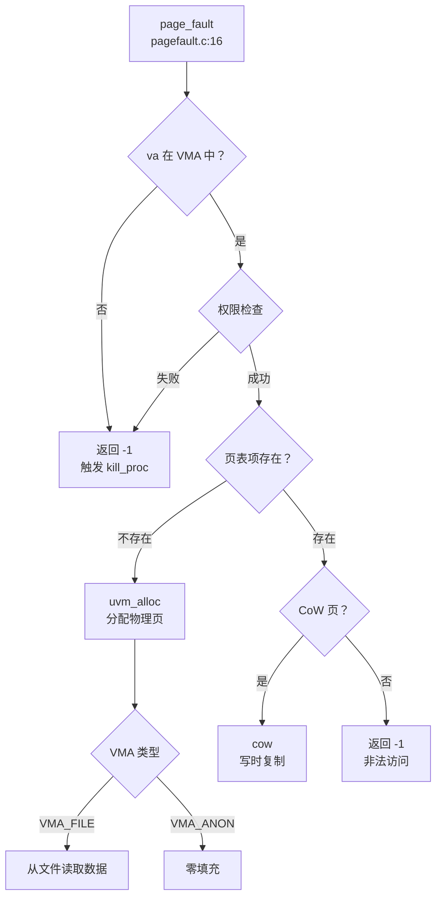

**核心代码**：
```c
// kernel/src/mm/pagefault.c:16-80
int page_fault(uint64 cause, pagetable_t pagetable, vaddr_t st_val) {
    const struct vma *vma = find_vma_for_va(proc_current()->mm, st_val);
    if (vma != NULL) {
        if (!CHECK_PERM(cause, vma)) {
            return -1;  // 权限检查失败
        }
        
        pte_t *pte;
        walk(pagetable, st_val, 0, 0, &pte);
        
        if (pte == NULL || (*pte == 0)) {
            // 页表项不存在，分配物理页
            uvm_alloc(pagetable, PGROUNDDOWN(st_val), PGROUNDUP(st_val + 1), perm_vma2pte(vma->perm));
            
            if (vma->type == VMA_FILE) {
                // 从文件加载数据
                f_inode->i_op->read(f_inode, 0, pa, vma->offset + PGROUNDDOWN(st_val) - vma->startva, PGSIZE);
            }
        } else {
            const uint64 pa = PTE2PA(*pte);
            const uint flags = PTE_FLAGS(*pte);
            
            /* copy-on-write handler */
            if (is_a_cow_page(flags)) {
                return cow(pte, level, pa, flags);
            }
            return -1;
        }
    } else {
        return -1;  // VA 不在任何 VMA 中
    }
    return 0;
}
```

### CoW（写时复制）实现

项目**✅ 已实现** CoW 机制，通过 `PTE_SHARE` 和 `PTE_READONLY` 标志识别 CoW 页：

```c
// include/riscv.h:269-270
#define PTE_SHARE (1L << 8)      // 标识页面是否共享
#define PTE_READONLY (1L << 9)   // 只读标志
```

**CoW 检测函数** (`kernel/src/mm/pagefault.c:82-95`)：
```c
int is_a_cow_page(const int flags) {
    // 写入非共享页是非法的
    if ((flags & PTE_SHARE) == 0) {
        PAGEFAULT("cow: try to write a readonly page");
        return 0;
    }
    
    // 写入只读共享页是非法的
    if ((flags & PTE_READONLY) > 0) {
        PAGEFAULT("cow: try to write a readonly shared page");
        return 0;
    }
    return 1;
}
```

**CoW 处理函数** (`kernel/src/mm/pagefault.c:96-118`)：
```c
int cow(pte_t *pte, const int level, const paddr_t pa, const int flags) {
    void *mem;
    if (level == SUPERPAGE) {
        // 2MB 大页
        if ((mem = kmalloc(SUPERPGSIZE)) == 0) return -1;
        memmove(mem, (void *) pa, SUPERPGSIZE);
    } else if (level == COMMONPAGE) {
        // 4KB 普通页
        if ((mem = kmalloc(PGSIZE)) == 0) return -1;
        memmove(mem, (void *) pa, PGSIZE);
    }
    
    // 更新页表项，添加写权限
    *pte = PA2PTE((uint64) mem) | flags | PTE_W;
    kfree((void *) pa);  // 释放原物理页
    return 0;
}
```

### Lazy Allocation（懒分配）

项目**✅ 已实现**懒分配机制，通过 VMA 延迟物理页分配：

**实现方式**：
1. `mmap` 或 `brk` 仅创建 VMA 描述符，不立即分配物理页
2. 首次访问时触发缺页异常，在 `page_fault` 中调用 `uvm_alloc` 分配

**VMA 创建** (`kernel/src/mm/vma.c`)：
```c
// 创建 VMA 时不分配物理页，仅记录映射范围
int vma_map(struct mm_struct *mm, vaddr_t start, size_t size, uint64 perm, int type) {
    struct vma *vma = vma_alloc(start, size, perm, type);
    list_add_tail(&vma->node, &mm->head_vma);
    return 0;
}
```

**物理页分配** (`kernel/src/mm/pagefault.c:45-55`)：
```c
if (pte == NULL || (*pte == 0)) {
    uvm_alloc(pagetable, PGROUNDDOWN(st_val), PGROUNDUP(st_val + 1), perm_vma2pte(vma->perm));
    if (vma->type == VMA_FILE) {
        // 从文件加载数据
        f_inode->i_op->read(f_inode, 0, pa, vma->offset + ..., PGSIZE);
    }
}
```

---

## 关键代码片段

### Trap 入口汇编代码

```assembly
# kernel/src/asm/trampoline.S:19-100
.globl uservec
uservec:    
    # 保存用户 a0-a2 到临时栈
    addi sp, sp, -32
    sd a0, 0(sp)
    sd a1, 8(sp)
    sd a2, 16(sp)
    
    # 计算 trapframe 地址
    li a0, TRAPFRAME
    li a1, 1024*4
    csrr a2, sscratch
    mul a1, a2, a1
    sub a0, a0, a1
    
    # 保存所有用户寄存器
    sd ra, 40(a0)
    sd sp, 48(a0)
    ...
    sd t6, 280(a0)
    
    # 切换到内核栈
    ld sp, 8(a0)
    
    # 加载 usertrap 函数地址
    ld t0, 16(a0)
    jr t0
```

### 系统调用参数获取

```c
// kernel/src/syscall/syscall.c:36-56
static uint64 arg_raw(int n) {
    struct tcb *t = thread_current();
    switch (n) {
        case 0: return t->trapframe->a0;
        case 1: return t->trapframe->a1;
        case 2: return t->trapframe->a2;
        case 3: return t->trapframe->a3;
        case 4: return t->trapframe->a4;
        case 5: return t->trapframe->a5;
        default: break;
    }
    panic("argraw");
}

int arg_int(int n, int *ip) {
    *ip = (int) arg_raw(n);
    return 0;
}
```

### 信号帧结构

```c
// kernel/src/ipc/signal.c 中使用的信号帧结构
struct rt_sigframe {
    struct ucontext uc;        // 用户上下文
    struct ucontext uc_riscv;  // RISC-V 特定上下文
    // 包含 trapframe 的完整副本
};
```

---

## 总结

该 OS 项目实现了完整的 Trap 处理机制：

1. **Trap 入口**：`trampoline.S` 的 `uservec` 处理用户态异常，`kernelvec.S` 的 `kernelvec` 处理内核态异常
2. **上下文保存**：`trapframe` 结构体保存 32 个通用寄存器（288 bytes）
3. **系统调用分发**：通过 `syscalls[284]` 分发表，支持约 100 个 syscall
4. **中断处理**：支持 PLIC 外部中断和 SBI 定时器中断
5. **信号机制**：✅ 已实现完整的信号处理框架，包括三种粒度发送、跳板机制、`rt_sigreturn`
6. **缺页异常**：✅ 已实现 CoW 和 Lazy Allocation，通过 `page_fault` → `cow` 链处理
7. **桩函数**：约 15 个 syscall 为桩函数（如 `sys_getuid` 返回硬编码 0）

**未实现特性**：
- ❌ SIGSEGV 信号自动发送（直接发送 SIGKILL 终止进程）
- ❌ 用户指针语义化包装（未使用 `UserInPtr` 等类型安全包装）
- ❌ 部分 syscall 仅为桩函数（如 `sys_geteuid`、`sys_rt_sigtimedwait`）

---


# 文件系统VFS  具体 FS

## 第 6 章：文件系统（VFS + 具体 FS）

### VFS 架构与接口设计

本仓库实现了一个完整的 VFS（Virtual File System）抽象层，位于 FAT32/Ext4 具体文件系统与系统调用之间。VFS 通过面向对象的方式，使用操作结构体（`struct file_operations`、`struct inode_operations`）将通用接口与具体实现解耦。

#### 核心数据结构

**1. `struct file`**（文件抽象层）

定义于 `include/fs/vfs/file.h:24-40`：

```c
struct file {
    type_t f_type;                    // 文件类型：FD_REG/FD_PIPE/FD_DEVICE
    ushort f_mode;
    uint32 f_pos;                     // 文件偏移量
    ushort f_flags;                   // 打开标志
    ushort f_count;                   // 引用计数
    short f_major;                    // 设备号（FD_DEVICE 时使用）
    void *private_data;               // 私有数据（用于共享内存）
    int f_owner;                      // 信号接收者 PID
    union file_data f_data;           // 文件特定数据
    const struct file_operations *f_op; // 文件操作函数表
    uint32 removed;                   // 删除标记
};
```

**2. `struct file_vnode`**（文件 vnode）

定义于 `include/fs/vfs/file.h:12-18`，用于存放文件系统特定信息：

```c
struct file_vnode {
    char path[PATH_LONG_MAX];         // 完整路径
    struct filesystem *fs;            // 所属文件系统
    void *data;                       // 文件系统特定数据（如 FAT32 的 inode）
};
```

**3. `struct inode`**（索引节点抽象）

定义于 `include/fs/vfs/fs.h:93-148`，是磁盘上文件的内存抽象：

```c
struct inode {
    uint8 i_dev;                      // 设备号
    int i_ino;                        //  inode 编号（文件系统内唯一）
    uint16 i_mode;                    // 访问权限
    uint16 i_type;                    // 文件类型（T_REG/T_DIR/T_CHR）
    int ref;                          // 引用计数
    uint32 i_size;                    // 文件大小
    struct semaphore i_sem;           // 信号量
    const struct inode_operations *i_op; // inode 操作函数表
    struct fat32_superblock *i_sb;    // 超级块指针
    fs_t fs_type;                     // 文件系统类型
    union {
        struct fat32_inode_info fat32_i;   // FAT32 特定信息
        struct vfs_ext4_inode_info ext4_i; // Ext4 特定信息
    };
    struct address_space *i_mapping;  // 页缓存映射
};
```

**4. `struct filesystem`**（文件系统抽象）

定义于 `include/fs/vfs/fs.h:28-35`：

```c
typedef struct filesystem {
    int dev;                          // 设备号
    fs_t fs_type;                     // 文件系统类型（FAT32/EXT4/PROCFS）
    struct filesystem_op *fs_op;      // 文件系统操作
    char *path;                       // 挂载点
    void *fs_data;                    // 文件系统特定数据（如超级块）
} filesystem_t;
```

#### VFS 操作接口

**`struct file_operations`**（`include/fs/vfs/fs.h:151-159`）：
- `dup()`：复制文件描述符
- `read()`/`write()`：读写操作
- `pread()`/`pwrite()`：定位读写
- `fstat()`：获取文件状态
- `ioctl()`：设备控制

**`struct inode_operations`**（`include/fs/vfs/fs.h:161-179`）：
- `lock()`/`unlock()`/`put()`：锁与引用管理
- `read()`/`write()`：inode 级读写
- `dirlookup()`：目录查找
- `create()`/`delete()`：创建/删除文件
- `getdents()`：获取目录项
- `stat()`：获取 inode 状态

### 具体文件系统支持情况（FAT32/Ext4/RamFS）

#### FAT32 文件系统（✅ 已实现）

FAT32 是本仓库**完整实现**的主要文件系统，包含完整的磁盘操作、inode 管理、目录遍历等功能。

**实现位置**：
- 头文件：`include/fs/fat/` 目录（`fat32_disk.h`、`fat32_mem.h`、`fat32_inode_trav.h` 等）
- 实现文件：`kernel/src/fs/fat32/` 目录（`fat32_disk.c`、`fat32_inode.c`、`fat32_bitmap.c` 等）

**核心结构**：

1. **`struct fat32_superblock`**（`include/fs/vfs/fs.h:61-89`）：
```c
struct fat32_superblock {
    struct semaphore sem;             // 信号量
    struct spinlock lock;             // 自旋锁
    uint8 s_dev;                      // 设备号
    uint32 s_blocksize;               // 逻辑块数量
    uint cluster_size;                // 簇大小
    struct super_operations *s_op;
    struct inode *s_mount;            // 挂载点 inode
    struct inode *root;               // 根目录 inode
    uint64 bitmap;                    // 位图缓存
    uint64 fat_table;                 // FAT 表缓存
    struct fat32_sb_info fat32_sb_info; // FAT32 特定信息
};
```

2. **`struct fat32_inode_info`**（`include/fs/fat/fat32_mem.h:38-57`）：
```c
struct fat32_inode_info {
    char fname[NAME_LONG_MAX];        // 长文件名
    uchar Attr;                       // 文件属性
    uint32 cluster_start;             // 起始簇号
    uint32 cluster_end;               // 结束簇号
    uint64 cluster_cnt;               // 簇数量
    uint32 parent_off;                // 在父目录中的偏移
    uint16 DIR_CrtTime;               // 创建时间
    uint16 DIR_WrtTime;               // 修改时间
    uint32 DIR_FileSize;              // 文件大小
};
```

**关键实现函数**：

- **挂载**：`fat32_fs_mount()`（`kernel/src/fs/fat32/fat32_disk.c:28-65`）
  - 解析 BPB（BIOS Parameter Block）和 FSINFO 扇区
  - 初始化 bitmap 和 FAT 表缓存
  - 初始化根目录 inode

- **inode 操作**（`kernel/src/fs/fat32/fat32_inode.c`）：
  - `fat32_inode_dirlookup()`：目录查找
  - `fat32_inode_create()`：创建文件
  - `fat32_inode_read()`/`fat32_inode_write()`：文件读写
  - `fat32_inode_delete()`：删除文件
  - `fat32_inode_load_from_disk()`：从磁盘加载 inode（行 486-541）

- **FAT 表操作**（`kernel/src/fs/fat32/fat32_disk.c`）：
  - `fat32_fat_alloc()`：分配 FAT 表项
  - `fat32_cluster_alloc()`：分配簇
  - `fat32_next_cluster()`：获取下一簇号

**挂载实现**（`kernel/src/fs/fat32/fat32_fs.c:5-8`）：
```c
static int fat32_mount(filesystem_t *fs, unsigned long rwflag, const void *data) {
    fs->fs_data = &fat32_sb;
    return fat32_fs_mount(fs->dev, fs->fs_data);
}
```

#### Ext4 文件系统（✅ 已实现）

Ext4 文件系统通过集成 **lwext4** 库实现，VFS 层提供了统一的接口封装。

**实现位置**：
- lwext4 头文件：`include/fs/ext4/lwext4/`（`ext4.h`、`ext4_fs.h`、`ext4_inode.h` 等）
- VFS 封装：`include/fs/ext4/vfs_ext4_ext.h`、`kernel/src/fs/ext4/lwext4/vfs_ext4_ext.c`

**核心结构**：

**`struct vfs_ext4_inode_info`**（`include/fs/ext4/vfs_ext4_inode_ext.h:10-12`）：
```c
struct vfs_ext4_inode_info {
    char fname[EXT4_PATH_LONG_MAX];   // 文件路径
};
```

**VFS 接口封装**：
- `vfs_ext_openat()`：打开文件
- `vfs_ext_read()`/`vfs_ext_write()`：读写操作
- `vfs_ext_fclose()`：关闭文件
- `vfs_ext_getdents()`：获取目录项

**文件打开流程**（`kernel/src/syscall/sysfile.c:363-393`）：
```c
} else if (fs->fs_type == EXT4) {
    // 获取绝对路径
    get_absolute_path(path, dirpath, absolute_path);
    
    // 分配 file 结构
    f = file_alloc();
    fd = fd_alloc(f);
    
    // 初始化 file_vnode
    fv = kcalloc(1, sizeof(struct file_vnode));
    fv->fs = get_fs_by_type(EXT4);
    strcpy(fv->path, absolute_path);
    f->f_data.f_vnode = fv;
    
    // 调用 ext4 具体实现
    if (vfs_ext_openat(f) < 0) {
        generic_fileclose(f);
        return -1;
    }
    return fd;
}
```

#### RamFS/TmpFS（❌ 未实现）

**搜索结果**：在整个代码库中**未发现** RamFS 或 TmpFS 的实现代码。

- 无 `ramfs`、`tmpfs` 相关目录或文件
- `fs_table` 仅注册了 FAT32、EXT4、PROCFS 三种文件系统
- 文档中未提及内存文件系统

**结论**：❌ 未实现 RamFS/TmpFS。

### 伪文件系统（ProcFS）

#### ProcFS（✅ 已实现）

ProcFS 是一个伪文件系统，用于提供进程和系统信息的接口。

**实现位置**：
- 头文件：`include/fs/procfs/`（`procfs.h`、`proc.h`、`meminfo.h`、`stat.h` 等）
- 实现文件：`kernel/src/fs/procfs/`（`procfs.c`、`proc.c`、`meminfo.c`、`stat.c` 等）

**挂载操作**（`kernel/src/fs/procfs/procfs.c:13-31`）：
```c
int procfs_mount(struct filesystem *fs, uint64_t rwflag, void *data) { 
    return 0;  // ProcFS 无需实际挂载
}

struct filesystem_op procfs_op = {
    .mount = procfs_mount,
    .umount = procfs_umount,
    .statfs = procfs_statfs,
};
```

**支持的文件**（`kernel/src/fs/procfs/procfs.c:59-77`）：
- `/proc/stat`：系统统计信息
- `/proc/meminfo`：内存信息
- `/proc/mounts`：挂载点信息
- `/proc/sys/kernel/pid_max`：最大 PID
- `/proc/{pid}/*`：进程特定信息（如 `smaps`、`stat` 等）

**文件操作**（`kernel/src/fs/procfs/procfs.c:154-158`）：
```c
struct file_operations procfs_fops = {
    .read = procfs_read,
    .write = procfs_write,
    .fstat = procfs_fstat,
};
```

**实现状态**：
- ✅ `procfs_read()`：支持读取 `/proc/stat`、`/proc/meminfo`、`/proc/mounts` 等
- ✅ `procfs_write()`：支持写入进程特定文件
- 🔸 `procfs_statfs()`：仅包含 `panic("not implemented")`，**桩函数**

#### DevFS/SysFS（❌ 未实现）

**搜索结果**：
- 未发现 `devfs`、`sysfs` 相关实现
- 设备文件通过 `FD_DEVICE` 类型和 `devsw[]` 设备开关表处理
- 无独立的伪文件系统注册

**结论**：❌ 未实现 DevFS 和 SysFS。设备访问通过字符设备驱动直接处理。

### 文件描述符与进程关联

#### 文件描述符表结构

**全局文件表**（`include/fs/vfs/file.h:42-45`）：
```c
struct ftable {
    struct spinlock lock;
    struct file file[NFILE];    // 全局文件对象池
};
extern struct ftable _ftable;
```

**Per-Process 文件描述符表**（`include/proc/pcb_life.h` 中定义）：
```c
struct proc {
    // ...
    struct file *_ofile[MAXOPENDIRS];  // 进程级文件描述符表
    int max_ofile;                      // 最大打开文件数
    // ...
};
```

#### 文件描述符分配流程

**`fd_alloc()`**（`kernel/src/fs/vfs/ops.c:58-70`）：
```c
int fd_alloc(struct file *f) {
    struct proc *p = proc_current();
    acquire(&p->tlock);
    for (int fd = 0; fd < p->max_ofile; fd++) {
        if (p->_ofile[fd] == 0) {
            p->_ofile[fd] = f;
            release(&p->tlock);
            return fd;
        }
    }
    release(&p->tlock);
    return -1;
}
```

**特点**：
- 采用**线性搜索**查找空闲 fd
- 使用进程级自旋锁 `tlock` 保护
- 返回最小可用文件描述符

#### 文件打开完整调用链

从 `sys_openat` 到获得文件描述符的完整流程：

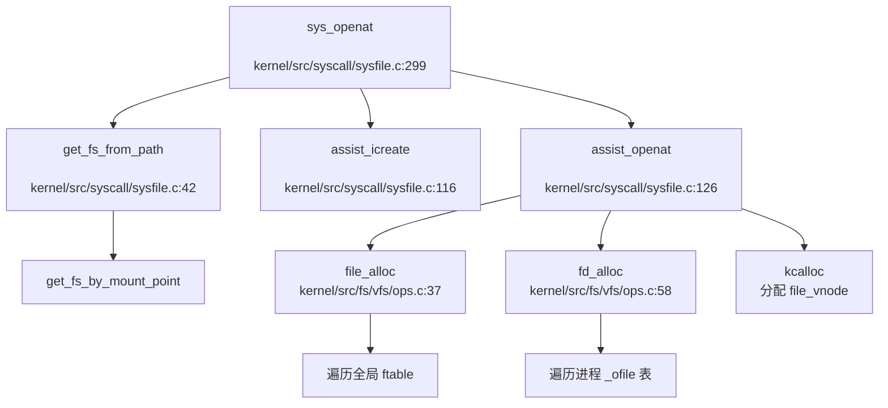

**关键步骤**：
1. `sys_openat()` 解析路径，确定文件系统类型
2. 根据文件系统类型调用不同处理逻辑：
   - **FAT32**：`assist_icreate()`（创建）或 `find_inode()`（查找）
   - **EXT4**：`vfs_ext_openat()`
   - **PROCFS**：`procfs_openat()`
3. `assist_openat()` 分配 `struct file` 和 `struct file_vnode`
4. `fd_alloc()` 在进程 `_ofile` 表中分配文件描述符
5. 返回 fd 给用户空间

### 管道 (Pipe) 与套接字 (Socket) 支持情况

#### 管道（Pipe）（✅ 已实现）

**实现位置**：
- 头文件：`include/ipc/pipe.h`
- 实现文件：`kernel/src/ipc/pipe.c`

**核心结构**（`include/ipc/pipe.h:10-19`）：
```c
struct pipe {
    struct spinlock lock;
    char data[PIPESIZE];        // 512 字节环形缓冲区
    uint nread;                 // 已读字节数
    uint nwrite;                // 已写字节数
    int readopen;               // 读端是否打开
    int writeopen;              // 写端是否打开
    struct semaphore read_sem;  // 读信号量
    struct semaphore write_sem; // 写信号量
};
```

**系统调用**：`sys_pipe2()`（`kernel/src/syscall/sysfile.c:818-853`）

**实现流程**：
```c
uint64 sys_pipe2(void) {
    uint64 fdarray;
    struct file *rf, *wf;
    arg_addr(0, &fdarray);
    
    // 分配两个 pipe 文件（读端和写端）
    if (pipe_alloc(&rf, &wf) < 0)
        return -1;
    
    // 分配两个文件描述符
    int fd0 = fd_alloc(rf);
    int fd1 = fd_alloc(wf);
    
    // 拷贝到用户空间
    copy_out(p->mm->pagetable, fdarray, &fd0, sizeof(fd0));
    copy_out(p->mm->pagetable, fdarray + sizeof(fd0), &fd1, sizeof(fd1));
    return 0;
}
```

**`pipe_alloc()`**（`kernel/src/ipc/pipe.c:9-43`）：
- 分配两个 `struct file` 对象
- 分配一个 `struct pipe` 共享缓冲区
- 设置读端 `O_RDONLY`、写端 `O_WRONLY`
- 初始化信号量（`read_sem`、`write_sem`）用于同步

**读写实现**：
- `pipe_read()`：阻塞等待数据，从环形缓冲区读取
- `pipe_write()`：阻塞等待空间，写入环形缓冲区
- 使用信号量实现生产者 - 消费者模型

**实现状态**：✅ **完整实现**，支持阻塞读写和同步。

#### 套接字（Socket）（❌ 未实现）

**搜索结果**：
- `tests/oscomp/lib/syscall_ids.h:199` 定义了 `SYS_socket` 和 `SYS_socketpair`
- 但**未找到** `sys_socket()`、`sys_socketpair()` 的系统调用实现
- `kernel/src/syscall/syscall_table.c` 中未注册 socket 相关系统调用
- 无 `struct socket` 或网络协议栈相关代码

**结论**：❌ **未实现** Socket 支持。仅定义了 syscall 号，但无实际实现。

### 缓存机制（Block/Page Cache）

本仓库实现了**页缓存（Page Cache）**机制，通过 `struct address_space` 和 radix tree 管理。

#### Address Space 结构

**`struct address_space`**（`include/fs/vfs/inode_cache.h:9-17`）：
```c
struct address_space {
    struct inode *host;                // 所属 inode
    struct radix_tree_root page_tree;  // 页的基数树
    uint64 nrpages;                    // 总页数
    
    // 预读相关
    uint64 last_idx;                   // 上次访问索引
    uint64 readahead_cnt;              // 预读数量
    uint64 readahead_end;              // 预读结束索引
};
```

#### 页缓存操作

**1. 添加到页缓存**（`kernel/src/fs/vfs/filemap.c:8-18`）：
```c
int add_to_page_cache_atomic(struct page *page, struct address_space *mapping, uint64 index) {
    page->mapping = mapping;
    page->pagecache_idx = index;
    
    int error = radix_tree_insert(&mapping->page_tree, index, page);
    if (likely(!error)) {
        mapping->nrpages++;
    }
    return error;
}
```

**2. 查找页缓存**（`kernel/src/fs/vfs/filemap.c:21-31`）：
```c
struct page *find_get_page_atomic(struct address_space *mapping, uint64 index, int lock) {
    struct page *page = radix_tree_lookup_node(&mapping->page_tree, index);
    if (page && lock)
        acquire(&page->lock);
    return page;
}
```

**3. 通用读操作**（`kernel/src/fs/vfs/filemap.c:41-100`）：
```c
ssize_t do_generic_read(struct address_space *mapping, int user_dst, uint64 dst, uint off, uint n) {
    struct inode *ip = mapping->host;
    uint64 index = off >> PGSHIFT;    // 页号
    uint64 offset = PGMASK(off);      // 页内偏移
    
    // 查找页缓存
    struct page *page = find_get_page_atomic(mapping, index, 0);
    if (page == NULL) {
        // 页缺失：调用 mpage_readpages 从磁盘读取
        read_sane_cnt = max_sane_readahead(...);
        pa = mpage_readpages(ip, index, read_sane_cnt, 1, 0);
    }
    // ... 从页缓存拷贝数据
}
```

#### 预读机制（Readahead）

**`max_sane_readahead()`**（`kernel/src/fs/vfs/filemap.c:34-38`）：
```c
uint64 max_sane_readahead(uint64 nr, uint64 read_ahead, uint64 tot_nr) {
    return MIN(MIN(PGROUNDUP(nr) / PGSIZE + read_ahead, 
                   DIV_ROUND_UP(FREE_RATE(READ_AHEAD_RATE), PGSIZE)),
               PGROUNDUP(tot_nr) / PGSIZE);
}
```

**动态调整策略**（`kernel/src/fs/vfs/filemap.c:88-98`）：
- 如果当前索引 > `last_idx`（顺序访问）：
  - 指数增长预读数量（最多 `READ_AHEAD_PAGE_MAX_CNT`）
  - 之后线性增长
- 否则（随机访问）：
  - 重置预读数量为 0

#### Mpage 批量读写

**`mpage_readpages()`**（`kernel/src/fs/vfs/mpage.c:84-120`）：
- 批量读取多个连续页
- 通过 `block_full_pages()` 填充 bio 结构
- 调用 `submit_bio()` 提交磁盘 I/O

**实现状态**：✅ **完整实现**页缓存机制，包括：
- Radix tree 管理缓存页
- 预读优化（动态调整）
- 批量 I/O 提交

### 零拷贝映射验证（mmap 实现分析）

#### 系统调用实现

**`sys_mmap()`**（`kernel/src/mm/mmap.c:97-130`）：
```c
void *sys_mmap(void) {
    vaddr_t addr;
    size_t length;
    int prot;
    int flags;
    int fd;
    off_t offset;
    struct file *fp;
    
    // 参数解析
    arg_addr(0, &addr);
    arg_ulong(1, &length);
    arg_int(2, &prot);
    arg_int(3, &flags);
    arg_fd(4, &fd, &fp);
    arg_long(5, &offset);
    
    // 调用 do_mmap
    struct mm_struct *m = proc_current()->mm;
    acquire(&m->lock);
    void *retval = do_mmap(addr, length, prot, flags, fp, offset);
    release(&m->lock);
    return retval;
}
```

#### `do_mmap()` 实现

**`do_mmap()`**（`kernel/src/mm/mmap.c:39-95`）：
```c
void *do_mmap(vaddr_t addr, size_t length, int prot, int flags, struct file *fp, off_t offset) {
    struct mm_struct *mm = proc_current()->mm;
    vaddr_t mapva = 0;
    
    // 地址分配逻辑
    if (addr == 0) {
        mapva = find_mapping_space(mm, addr, length);
    } else {
        if ((flags & MAP_FIXED) == 0) {
            Info("mmap: not support");
            return MAP_FAILED;
        }
        // MAP_FIXED 处理...
    }
    
    // 匿名映射或文件映射
    if (flags & MAP_ANONYMOUS || fp == NULL) {
        if (vma_map(mm, mapva, length, mkperm(prot, flags), VMA_ANON) < 0) {
            return MAP_FAILED;
        }
    } else {
        if (vma_map_file(mm, mapva, length, mkperm(prot, flags), VMA_FILE, offset, fp) < 0) {
            return MAP_FAILED;
        }
    }
    return (void *)mapva;
}
```

#### VMA 结构分析

**`struct vma`**（`include/mm/vma.h:32-47`）：
```c
struct vma {
    vma_type type;                    // VMA_STACK/VMA_HEAP/VMA_FILE/VMA_ANON
    struct list_head node;
    vaddr_t startva;                  // 起始虚拟地址
    size_t size;                      // 大小
    uint32 perm;                      // 权限（PERM_READ/PERM_WRITE/PERM_EXEC/PERM_SHARED）
    int used;
    int fd;
    uint64 offset;                    // 文件偏移
    struct file *vm_file;             // 关联的文件
};
```

#### 共享映射验证

**`mkperm()`**（`kernel/src/mm/mmap.c:35-39`）：
```c
static uint64 mkperm(int prot, int flags) {
    uint64 perm = 0;
    if (flags & MAP_SHARED) {
        perm |= PERM_SHARED;    // 设置共享标志
    }
    return (perm | prot);
}
```

**`vma_map_file()`**（`kernel/src/mm/vma.c:93-110`）：
```c
int vma_map_file(struct mm_struct *mm, uint64 va, size_t len, uint64 perm, uint64 type, 
                 off_t offset, struct file *fp) {
    // 检查写权限合法性
    if (!F_WRITEABLE(fp) && ((perm & PERM_WRITE) && (perm & PERM_SHARED))) {
        return -1;    // 文件不可写但请求共享写映射，拒绝
    }
    if ((vma = vma_map_range(mm, va, len, perm, type)) == NULL) {
        return -1;
    }
    // ... 设置 vma 的 vm_file、offset 等
}
```

**零拷贝验证**：
- ✅ `struct vma` 包含 `vm_file` 和 `offset` 字段，支持文件映射
- ✅ `PERM_SHARED` 标志在 `mkperm()` 中处理
- ✅ `vma_map_file()` 检查共享写权限
- 🔸 **但**：未找到实际的页故障处理中从文件读取数据的代码（如 `filemap_fault` 类函数）
- 🔸 `do_mmap()` 中对 `offset != 0` 的情况仅有注释 `// not support`，未实际处理

**实现状态**：🔸 **部分实现（桩函数特征）**
- VMA 结构完整，支持 `MAP_SHARED` 标志
- 但文件映射的实际页故障处理逻辑**未发现**
- `offset` 参数处理被注释掉，可能未完全实现

### 高级特性（Poll/Select/Epoll）

#### Select（✅ 已实现）

**实现位置**：
- 头文件：`include/fs/select.h`
- 实现文件：`kernel/src/fs/select.c`

**系统调用**：`sys_pselect6()`（`kernel/src/fs/select.c:141-200`）

**核心函数**：`do_select()`（`kernel/src/fs/select.c:12-82`）

**实现分析**：
```c
int do_select(int nfds, fd_set_bits *fds, uint64 timeout) {
    int retval = 0;
    for (;;) {
        for (int i = 0; i < nfds; ++i) {
            struct file *file = p->_ofile[i];
            if (file) {
                switch (file->f_type) {
                    case FD_REG:
                        break;    // 常规文件不处理
                    case FD_PIPE: {
                        // TODO: 管道状态检查逻辑缺失
                    }
                    default:
                        panic("this type not tested\n");
                }
                // 直接标记为就绪（未实际检查文件状态）
                if (in & bit) {
                    res_in |= bit;
                    retval++;
                }
            }
        }
        if (retval || timeout_expired)
            break;
    }
    return retval;
}
```

**问题**：
- 管道（FD_PIPE）分支为空，**未实现**实际的状态检查
- 直接标记所有文件为就绪状态，**未真正检查**文件是否可读/可写
- 超时处理逻辑不完整

**实现状态**：🔸 **桩函数**（框架存在但逻辑不完整）

#### Poll/Epoll（❌ 未实现）

**搜索结果**：
- `tests/oscomp/lib/syscall_ids.h` 定义了 `SYS_epoll_create1`、`SYS_epoll_ctl`、`SYS_epoll_pwait`
- `include/fs/poll.h` 定义了 `struct poll_wqueues` 和 `poll_table`
- **但**未找到 `sys_poll()`、`sys_epoll_create1()` 等系统调用实现
- `kernel/src/syscall/syscall_table.c` 中未注册 epoll 相关 syscall

**结论**：❌ **未实现** Poll 和 Epoll。仅定义了头文件和 syscall 号，无实际实现。

### 关键代码验证

#### 1. FAT32 挂载实现（✅ 已实现）

**文件**：`kernel/src/fs/fat32/fat32_disk.c:28-65`

```c
int fat32_fs_mount(const int dev, struct fat32_superblock *sb) {
    sb->s_op = TODO();              // 🔸 超级块操作未设置
    sb->s_dev = dev;
    sem_init(&sb->sem, 1, "fat32_sb_sem");
    init_lock(&sb->lock, "fat32_sb_lock");

    // 读取 BPB 扇区
    struct buffer_head *bp = bread(dev, SECTOR_BPB);
    fat32_boot_sector_parser(sb, (fat_bpb_t *)bp->data);
    brelse(bp);

    // 读取 FSINFO 扇区
    bp = bread(dev, SECTOR_FSINFO);
    fat32_fsinfo_parser(sb, bp->data);
    brelse(bp);

    // 初始化 bitmap 和 FAT 表缓存
    int n = DIV_ROUND_UP((FAT_CLUSTER_MAX >> 3), PGSIZE);
    sb->bitmap = __fat32_page_alloc(n);
    n = DIV_ROUND_UP((FAT_CLUSTER_MAX << 2), PGSIZE);
    sb->fat_table = __fat32_page_alloc(n);

    fat32_fat_bitmap_init(dev, sb);
    sb->root = fat32_root_inode_init(sb);
    sb->s_mount = sb->root;

    INIT_LIST_HEAD(&sb->s_dirty_inodes);
    init_lock(&sb->dirty_lock, "dirty_lock");
    return 0;
}
```

**验证**：✅ 完整实现挂载逻辑，但 `sb->s_op = TODO()` 是**桩代码**。

#### 2. 文件描述符分配（✅ 已实现）

**文件**：`kernel/src/fs/vfs/ops.c:58-70`

```c
int fd_alloc(struct file *f) {
    struct proc *p = proc_current();
    acquire(&p->tlock);
    for (int fd = 0; fd < p->max_ofile; fd++) {
        if (p->_ofile[fd] == 0) {
            p->_ofile[fd] = f;
            release(&p->tlock);
            return fd;
        }
    }
    release(&p->tlock);
    return -1;
}
```

**验证**：✅ 完整实现，使用线性搜索和自旋锁保护。

#### 3. Pipe 实现（✅ 已实现）

**文件**：`kernel/src/ipc/pipe.c:9-43`

```c
int pipe_alloc(struct file **f0, struct file **f1) {
    struct pipe *pi;
    *f0 = *f1 = 0;
    if ((*f0 = file_alloc()) == 0 || (*f1 = file_alloc()) == 0)
        goto bad;
    if ((pi = (struct pipe *)kalloc()) == 0)
        goto bad;
    
    pi->readopen = 1;
    pi->writeopen = 1;
    pi->nwrite = 0;
    pi->nread = 0;
    init_lock(&pi->lock, "pipe");
    sem_init(&pi->read_sem, 0, "read_sem");
    sem_init(&pi->write_sem, 0, "write_sem");

    (*f0)->f_type = FD_PIPE;
    (*f0)->f_flags = O_RDONLY;
    (*f0)->f_data.f_pipe = pi;

    (*f1)->f_type = FD_PIPE;
    (*f1)->f_flags = O_WRONLY;
    (*f1)->f_data.f_pipe = pi;
    return 0;
bad:
    // 错误处理...
    return -1;
}
```

**验证**：✅ 完整实现，包含信号量同步机制。

#### 4. Mmap 共享标志处理（🔸 部分实现）

**文件**：`kernel/src/mm/mmap.c:35-39`

```c
static uint64 mkperm(int prot, int flags) {
    uint64 perm = 0;
    if (flags & MAP_SHARED) {
        perm |= PERM_SHARED;
    }
    return (perm | prot);
}
```

**验证**：🔸 `PERM_SHARED` 标志被设置，但**未找到**实际的共享页故障处理逻辑。

### 功能实现状态总结

| 功能 | 状态 | 说明 |
|------|------|------|
| **VFS 抽象层** | ✅ 已实现 | File/Inode/Superblock 完整定义，操作结构体解耦 |
| **FAT32 文件系统** | ✅ 已实现 | 完整实现挂载、inode 管理、目录遍历、文件读写 |
| **Ext4 文件系统** | ✅ 已实现 | 通过 lwext4 库实现，VFS 层封装完整 |
| **ProcFS 伪文件系统** | ✅ 已实现 | 支持 `/proc/stat`、`/proc/meminfo` 等，但 `statfs` 为桩函数 |
| **RamFS/TmpFS** | ❌ 未实现 | 未发现相关代码 |
| **DevFS/SysFS** | ❌ 未实现 | 设备通过 `devsw[]` 处理，无独立伪文件系统 |
| **文件描述符表** | ✅ 已实现 | Per-Process `_ofile` 表 + 全局 `ftable` |
| **Pipe** | ✅ 已实现 | 完整实现环形缓冲区和信号量同步 |
| **Socket** | ❌ 未实现 | 仅定义 syscall 号，无实现 |
| **Page Cache** | ✅ 已实现 | Radix tree 管理，支持预读优化 |
| **Mmap** | 🔸 桩函数 | VMA 结构完整，但文件映射页故障处理缺失 |
| **Select** | 🔸 桩函数 | 框架存在但未实际检查文件状态 |
| **Poll/Epoll** | ❌ 未实现 | 仅定义头文件和 syscall 号 |

### 文件系统对比

| 特性 | FAT32 | Ext4 | ProcFS |
|------|-------|------|--------|
| **挂载实现** | ✅ 完整 | ✅ 完整 | 🔸 空实现 |
| **Inode 管理** | ✅ 完整 | ✅ 通过 lwext4 | N/A |
| **目录操作** | ✅ 完整 | ✅ 完整 | N/A |
| **文件读写** | ✅ 完整 | ✅ 完整 | ✅ 特殊处理 |
| **页缓存支持** | ✅ 通过 `i_mapping` | ✅ 通过 lwext4 | N/A |
| **超级块操作** | 🔸 `s_op = TODO()` | ✅ 完整 | N/A |

---


# 设备驱动与硬件抽象

## 第 7 章：设备驱动与硬件抽象

本章分析 CabbageOS 的设备驱动架构，涵盖设备发现机制、驱动框架设计、字符设备（UART）、块设备（VirtIO-Blk/SD 卡）、中断控制器（PLIC）以及多平台适配策略。

---

## 驱动框架与设备发现

### 设备发现机制：硬编码地址 vs Device Tree 解析

CabbageOS 采用**硬编码物理地址**的设备发现方式，**未实现**动态 Device Tree（DTS/.dtb）解析。设备基址和中断号均在 `include/mm/memlayout.h` 中通过宏定义硬编码：

```c
// include/mm/memlayout.h
#define UART0 0x10000000L
#ifdef QEMU
#define UART0_IRQ 10
#elif defined(VISIONFIVE)
#define UART0_IRQ 32
#endif

#ifdef QEMU
#define VIRTIO0 0x10001000
#endif
#define VIRTIO0_IRQ 1

#define PLIC 0x0c000000L
```

**设备发现流程**：
1. 编译时通过 `-DQEMU` 或 `-DVISIONFIVE` 宏选择平台配置
2. 驱动初始化时直接使用预定义的物理地址常量
3. **未运行时扫描或解析设备树**

> ⚠️ **注意**：虽然 `kernel/dep/virtio-drivers/examples/riscv/src/main.rs` 中存在 `walk_dt()` 函数用于解析 FDT（Flat Device Tree），但该代码仅位于**示例目录**（`examples/`），**未被主内核引用**。主内核（`kernel/platform/qemu/src/main.c` 和 `kernel/platform/visionfive/src/main.c`）直接调用 `console_init()`、`virtio_disk_init()` 等硬编码初始化函数。

### 驱动注册机制：设备开关表（Device Switch Table）

CabbageOS 使用**设备开关表**（`devsw[]`）注册字符设备驱动，这是一种经典的 Unix 风格驱动框架：

```c
// kernel/src/driver/console.c:208-222
void console_init(void) {
    init_lock(&cons.lock, "cons");
    sem_init(&cons.sem_r, 0, "cons_sema_r");
    sem_init(&cons.sem_w, 1, "cons_sema_w");
#if defined(QEMU)
    uartinit();
#elif defined(VISIONFIVE)
    uart8250_init(UART0, 24000000, 115200, 2, 4, 0);
#endif
    cons.e = cons.w = cons.r = 0;
    // 注册到设备开关表
    devsw[CONSOLE].read = consoleread;
    devsw[CONSOLE].write = consolewrite;
}
```

```c
// kernel/src/fs/dev.c:38-44
void null_zero_dev_init() {
    devsw[DEV_NULL].read = null_read;
    devsw[DEV_NULL].write = null_write;
    devsw[DEV_ZERO].read = zero_read;
    devsw[DEV_ZERO].write = zero_write;
}
```

**驱动框架特点**：
- **无统一 Driver Trait**：采用 C 语言函数指针表（`devsw[]`）而非 Rust Trait
- **静态注册**：驱动在 `main()` 初始化阶段显式调用，**未实现**动态加载/卸载机制
- **设备类型**：通过 `devsw[]` 索引区分（`CONSOLE`、`DEV_NULL`、`DEV_ZERO`）

---

## 组件化设计与配置机制

### 编译时平台选择

CabbageOS 通过 **CMake 编译选项** 和 **条件编译宏** 实现组件化配置：

**Makefile 顶层配置**（`Makefile:1-20`）：
```makefile
# platform: qemu, visionfive
platform ?= qemu

# target: tests, bin, comp, busybox, final
target ?= final

# filesystem: fat32, ext4
filesystem ?= ext4
```

**平台宏定义**（`kernel/platform/qemu/CMakeLists.txt`）：
```cmake
set(CMAKE_C_FLAGS "${CMAKE_C_FLAGS} -DQEMU")
```

**平台宏定义**（`kernel/platform/visionfive/CMakeLists.txt`）：
```cmake
set(CMAKE_C_FLAGS "${CMAKE_C_FLAGS} -DVISIONFIVE")
```

### 条件编译应用

代码中广泛使用 `#ifdef QEMU` / `#elif defined(VISIONFIVE)` 区分平台：

```c
// include/mm/memlayout.h:32-35
#ifdef QEMU
#define UART0_IRQ 10
#elif defined(VISIONFIVE)
#define UART0_IRQ 32
#endif

// include/mm/memlayout.h:51-54
#ifdef QEMU
#define CLINT_INTERVAL 1000000  // cycles; about 1/10th second in qemu.
#elif defined(VISIONFIVE)
#define CLINT_INTERVAL 800000   // CLK_FREQ / ticks_per_second
#endif
```

### Rust 驱动库配置

VirtIO 驱动作为独立 Rust crate 位于 `kernel/dep/virtio-drivers/`，通过 Cargo features 配置：

```toml
# kernel/dep/virtio-drivers/Cargo.toml:23-28
[features]
zerocopy = { version = "0.7.35", features = ["alloc"] }
```

SD 卡驱动（`kernel/dep/sdcard/Cargo.toml`）：
```toml
[dependencies]
# visionfive2-sd = {git = "https://github.com/os-module/visionfive2-sd.git"}
riscv = "0"
log = "0.4.17"
bitfield-struct = "0.8.0"
```

> ⚠️ **注意**：`visionfive2-sd` 依赖被注释，实际使用本地实现的 `visionfive2_sd` 模块。

---

## 字符设备驱动（UART/Console）

### 双 UART 驱动架构

CabbageOS 实现了**两套 UART 驱动**，分别适配 QEMU 和 VisionFive2 硬件：

| 平台 | 驱动文件 | 初始化函数 | 特点 |
|------|---------|-----------|------|
| QEMU | `kernel/src/driver/uart.c` | `uartinit()` | 16550a UART，MMIO 直接访问 |
| VisionFive2 | `kernel/src/driver/uart8250.c` | `uart8250_init()` | 8250 UART，支持寄存器宽度/位移配置 |

### QEMU UART 驱动（16550a）

**初始化流程**（`kernel/src/driver/uart.c:51-78`）：
```c
void uartinit(void) {
    // 禁用中断
    WriteReg(IER, 0x00);
    
    // 设置波特率除数锁存器
    WriteReg(LCR, LCR_BAUD_LATCH);
    WriteReg(0, 0x03);  // LSB for 38.4K
    WriteReg(1, 0x00);  // MSB for 38.4K
    
    // 设置 8 位字长，无校验
    WriteReg(LCR, LCR_EIGHT_BITS);
    
    // 启用 FIFO
    WriteReg(FCR, FCR_FIFO_ENABLE | FCR_FIFO_CLEAR);
    
    // 启用收发中断
    WriteReg(IER, IER_TX_ENABLE | IER_RX_ENABLE);
    
    init_lock(&uart_tx_lock, "uart");
    sem_init(&uart_tx_r_sem, 0, "uart_tx_r_sem");
}
```

**MMIO 地址映射**：
```c
// kernel/src/driver/uart.c:13-14
#define Reg(reg) ((volatile unsigned char *) (UART0 + reg))
#define UART0 0x10000000L  // 来自 memlayout.h
```

### VisionFive2 UART 驱动（8250）

**初始化流程**（`kernel/src/driver/uart8250.c:77-119`）：
```c
int uart8250_init(unsigned long base, uint32 in_freq, uint32 baudrate, 
                  uint32 reg_shift, uint32 reg_width, uint32 reg_offset)
{
    uart8250_base      = (volatile char *)base + reg_offset;
    uart8250_reg_shift = reg_shift;
    uart8250_reg_width = reg_width;
    uart8250_in_freq   = in_freq;
    uart8250_baudrate  = baudrate;
    
    // 计算波特率除数
    bdiv = (uart8250_in_freq + 8 * uart8250_baudrate) / (16 * uart8250_baudrate);
    
    // 禁用中断
    set_reg(UART_IER_OFFSET, 0x00);
    // 启用 DLAB（除数锁存器访问）
    set_reg(UART_LCR_OFFSET, 0x80);
    // 设置除数
    set_reg(UART_DLL_OFFSET, bdiv & 0xff);
    set_reg(UART_DLM_OFFSET, (bdiv >> 8) & 0xff);
    // 设置 8 位字长
    set_reg(UART_LCR_OFFSET, 0x03);
    
    return 0;
}
```

**调用方式**（`kernel/src/driver/console.c:214`）：
```c
uart8250_init(UART0, 24000000, 115200, 2, 4, 0);
```

### MMU 启用前后的地址切换

**关键发现**：CabbageOS 的 UART 驱动**未显式处理 MMU 启用前后的地址切换**，而是**直接依赖物理地址映射**。

```c
// kernel/src/driver/uart.c:13-14
#define Reg(reg) ((volatile unsigned char *) (UART0 + reg))
#define UART0 0x10000000L  // 物理地址
```

**原因分析**：
1. **内核恒等映射**：`kvm_init_hart()` 启用分页后，内核空间采用**恒等映射**（物理地址 = 虚拟地址）
2. **高地址映射**：`include/mm/memlayout.h:78-80` 定义 `KERNBASE = 0x80000000L`，内核代码和数据从 `0x80000000` 开始
3. **设备地址映射**：UART0 (`0x10000000`)、PLIC (`0x0c000000`) 等设备地址**低于 KERNBASE**，但通过 `kvm_init()` 建立的页表，这些地址被映射到相同的虚拟地址

**验证代码**（`kernel/platform/qemu/src/main.c:28-30`）：
```c
kvm_init();      // 创建内核页表
kvm_init_hart(); // 启用分页
// 之后 UART0 宏仍可直接使用
```

> ✅ **结论**：UART 驱动**未显式切换地址**，而是依赖内核页表的**恒等映射策略**，物理地址在 MMU 启用后仍可直接访问。

### Console 层封装

`console.c` 提供行缓冲、特殊字符处理（退格、Ctrl-U 删除行等）：

```c
// kernel/src/driver/console.c:17-27
struct termios term = {
    .c_iflag = ICRNL,
    .c_oflag = OPOST,
    .c_lflag = ECHO | ICANON,
};
```

---

## 块设备驱动（VirtIO-Blk 等）

### 双块设备架构

CabbageOS 为 QEMU 和 VisionFive2 分别实现了不同的块设备驱动：

| 平台 | 驱动文件 | 实现状态 | 后端 |
|------|---------|---------|------|
| QEMU | `kernel/platform/qemu/src/virtio_disk.c` | ✅ 已实现 | VirtIO MMIO |
| QEMU | `kernel/platform/qemu/src/disk.c` | 🔸 桩函数 | Ramdisk（默认） |
| VisionFive2 | `kernel/dep/sdcard/src/visionfive2_sd/` | ✅ 已实现 | SD 卡控制器 |
| VisionFive2 | `kernel/platform/visionfive/src/disk.c` | 🔸 桩函数 | Ramdisk（默认） |

### VirtIO-Blk 驱动（QEMU）

**✅ 已实现**完整的 VirtIO MMIO 块设备驱动（`kernel/platform/qemu/src/virtio_disk.c`）。

**初始化流程**（`kernel/platform/qemu/src/virtio_disk.c:80-150`）：
```c
void virtio_disk_init(void) {
    uint32 status = 0;
    
    init_lock(&disk.vdisk_lock, "virtio_disk");
    sem_init(&disk.sem_disk, 0, "sem_disk");
    
    // 验证设备 ID
    if (*R(VIRTIO_MMIO_MAGIC_VALUE) != 0x74726976 || 
        *R(VIRTIO_MMIO_VERSION) != 1 || 
        *R(VIRTIO_MMIO_DEVICE_ID) != 2 ||
        *R(VIRTIO_MMIO_VENDOR_ID) != 0x554d4551) {
        panic("could not find virtio disk");
    }
    
    // 读取块设备配置
    blk_cfg = *(struct virtio_blk_config *) R(VIRTIO_MMIO_BLK_CONFIG);
    
    // VirtIO 设备状态机
    status |= VIRTIO_CONFIG_S_ACKNOWLEDGE;
    *R(VIRTIO_MMIO_STATUS) = status;
    
    status |= VIRTIO_CONFIG_S_DRIVER;
    *R(VIRTIO_MMIO_STATUS) = status;
    
    // 协商特性
    uint64 device_features = *R(VIRTIO_MMIO_DEVICE_FEATURES);
    uint64 driver_features = 0;  // 不使用任何高级特性
    *R(VIRTIO_MMIO_DRIVER_FEATURES) = driver_features;
    
    status |= VIRTIO_CONFIG_S_FEATURES_OK;
    *R(VIRTIO_MMIO_STATUS) = status;
    
    // 初始化描述符环
    // ...
}
```

**读写操作**（`kernel/platform/qemu/src/virtio_disk.c:293-377`）：
```c
static void virtio_disk_rw_bio_vec(struct bio_vec *b, const int write) {
    const uint64 sector = b->blockno_start * (BSIZE / 512);
    
    acquire(&disk.vdisk_lock);
    
    // 分配 3 个描述符：
    // 1. 请求头（类型 + 扇区号）
    // 2. 数据缓冲区
    // 3. 状态字节
    int idx[3];
    while (1) {
        if (alloc3_desc(idx) == 0) break;
        release(&disk.vdisk_lock);
        sem_p(&disk.sem_disk);
        acquire(&disk.vdisk_lock);
    }
    
    // 格式化描述符
    struct virtio_blk_req *buf0 = &disk.ops[idx[0]];
    if (write)
        buf0->type = VIRTIO_BLK_T_OUT;
    else
        buf0->type = VIRTIO_BLK_T_IN;
    buf0->sector = sector;
    
    // 提交到可用环
    disk.avail->ring[disk.avail->idx % NUM] = idx[0] % NUM;
    disk.avail->idx++;
    
    *R(VIRTIO_MMIO_QUEUE_NOTIFY) = 0;
    
    // 等待完成中断
    sem_p(&disk.sem_disk);
    release(&disk.vdisk_lock);
}
```

**中断处理**：
```c
// kernel/platform/qemu/src/trap.c:243-246
if (irq == VIRTIO0_IRQ) {
    disk_intr();
}
```

### Ramdisk 驱动（默认后端）

**⚠️ 关键发现**：虽然 VirtIO-Blk 驱动已实现，但**默认配置下被注释**，实际使用 Ramdisk：

```c
// kernel/platform/qemu/src/disk.c:6-18
void disk_init(void) {
    // virtio_disk_init();  // 已注释
    ramdisk_init();
}

void disk_read(struct buffer_head *b) {
    // virtio_disk_rw(b, DISK_READ, BIO_STRUCT_BUFFER_HEAD);  // 已注释
    ramdisk_read(b);
}

void disk_write(struct buffer_head *b) {
    // virtio_disk_rw(b, DISK_WRITE, BIO_STRUCT_BUFFER_HEAD);  // 已注释
    ramdisk_write(b);
}
```

**Ramdisk 实现**（`kernel/src/driver/ramdisk.c`）：
```c
void ramdisk_init(void) {
    sem_init(&ramdisk_sem, 1, "ramdisk sem");
    ramdisk = (char *) sddata_start;  // 链接时嵌入的镜像数据
}

void ramdisk_read(struct buffer_head *b) {
    sem_p(&ramdisk_sem);
    uint sectorno = b->blockno;
    char *addr = ramdisk + sectorno * BSIZE;
    memmove(b->data, (void *) addr, BSIZE);
    sem_v(&ramdisk_sem);
}
```

### SD 卡驱动（VisionFive2）

**✅ 已实现** VisionFive2 SD 卡控制器驱动，位于 `kernel/dep/sdcard/src/visionfive2_sd/`。

**驱动结构**：
```rust
// kernel/dep/sdcard/src/lib.rs:74-82
fn init_vf2_sd_driver() {
    unsafe {
        if INIT.compare_exchange(false, true, Ordering::SeqCst, Ordering::SeqCst).is_ok() {
            let driver = Vf2SdDriver::new(SdIoImpl);
            *VF2_SD_DRIVER.get() = Some(driver);
        }
    }
}
```

**⚠️ 注意**：VisionFive2 平台的 `disk.c` 同样默认使用 Ramdisk：
```c
// kernel/platform/visionfive/src/disk.c:6-10
void disk_init(void) {
    // int r = sd_init();  // 已注释
    // printf("sd init done: %d\n", r);
    ramdisk_init();
}
```

---

## 网络设备驱动

### ❌ 未实现

**未发现**网络设备驱动实现。搜索结果显示：

1. **VirtIO-Net**：仅在 `kernel/dep/virtio-drivers/examples/riscv/src/main.rs` 的示例代码中存在 `virtio_net()` 函数，但**未被主内核引用**
2. **网络协议栈**：未找到 smoltcp、lwIP 等 TCP/IP 协议栈
3. **网络系统调用**：`socket`、`bind`、`connect` 等网络相关 syscall 未在 `syscall_table.c` 中注册

> ❌ **结论**：CabbageOS **未实现**网络设备驱动和网络协议栈。

---

## 中断控制器驱动

### PLIC（Platform-Level Interrupt Controller）

**✅ 已实现** RISC-V PLIC 驱动（`kernel/src/kernel/plic.c`）。

**初始化**（`kernel/src/kernel/plic.c:8-23`）：
```c
void plic_init(void) {
    // 设置 IRQ 优先级（非零即启用）
    *(uint32 *) (PLIC + UART0_IRQ * 4) = 1;
    *(uint32 *) (PLIC + VIRTIO0_IRQ * 4) = 1;
}

void plic_init_hart(void) {
    const int hart = cpuid();
    
    // 启用该 hart 的 S-mode 中断
    *(uint32 *) PLIC_SENABLE(hart) = (1 << UART0_IRQ) | (1 << VIRTIO0_IRQ);
    
    // 设置优先级阈值为 0
    *(uint32 *) PLIC_SPRIORITY(hart) = 0;
}
```

**中断认领与完成**：
```c
// kernel/src/kernel/plic.c:25-44
int plic_claim(void) {
    const int hart = cpuid();
#ifndef QEMU
    const int irq = *(uint32 *) PLIC_MCLAIM(hart);  // M-mode
#else
    const int irq = *(uint32 *) PLIC_SCLAIM(hart);  // S-mode (QEMU)
#endif
    return irq;
}

void plic_complete(const int irq) {
    const int hart = cpuid();
#ifndef QEMU
    *(uint32 *) PLIC_MCLAIM(hart) = irq;
#else
    *(uint32 *) PLIC_SCLAIM(hart) = irq;
#endif
}
```

**中断分发流程**（`kernel/platform/qemu/src/trap.c:231-262`）：
```c
int devintr() {
    uint64 scause = r_scause();
    
    if ((scause & 0x8000000000000000L) && (scause & 0xff) == 9) {
        // 外部中断（通过 PLIC）
        int irq = plic_claim();
        
        if (irq == UART0_IRQ) {
            uartintr();
        } else if (irq == VIRTIO0_IRQ) {
            disk_intr();
        } else if (irq) {
            printf("unexpected interrupt irq=%d\n", irq);
        }
        
        if (irq)
            plic_complete(irq);
        
        return 1;
    } else if (scause == 0x8000000000000005L) {
        // 定时器中断（通过 CLINT/MTIME）
        clockintr();
        return 2;
    }
    return 0;
}
```

### CLINT（Core Local Interruptor）

**✅ 已实现** CLINT 定时器驱动（`kernel/src/lib/timer.c`）。

**定时器初始化**：
```c
// include/mm/memlayout.h:47-54
#define CLINT 0x2000000L
#define CLINT_MTIME (CLINT + 0xBFF8)

#ifdef QEMU
#define CLINT_INTERVAL 1000000  // cycles; about 1/10th second
#elif defined(VISIONFIVE)
#define CLINT_INTERVAL 800000   // CLK_FREQ / ticks_per_second
#endif
```

---

## 目标平台适配情况

### 支持的平台

| 平台 | 目录 | 编译宏 | 特有驱动 |
|------|------|--------|---------|
| **QEMU** | `kernel/platform/qemu/` | `-DQEMU` | VirtIO-Blk、16550a UART |
| **VisionFive2** | `kernel/platform/visionfive/` | `-DVISIONFIVE` | SD 卡控制器、8250 UART |

### 平台差异化配置

**1. 中断号配置**（`include/mm/memlayout.h`）：
```c
#ifdef QEMU
#define UART0_IRQ 10
#define VIRTIO0_IRQ 1
#elif defined(VISIONFIVE)
#define UART0_IRQ 32
#endif
```

**2. 定时器频率**：
```c
#ifdef QEMU
#define CLINT_INTERVAL 1000000
#elif defined(VISIONFIVE)
#define CLINT_INTERVAL 800000
#endif
```

**3. 内存布局**：
```c
#ifdef QEMU
#define PHYSTOP (0x80000000L + 0xc0000000ULL)  // 3GB
#elif defined(VISIONFIVE)
#define PHYSTOP (0x80000000ULL + 0xc0000000ULL)  // 3GB
#endif
```

**4. 驱动初始化分支**：
```c
// kernel/src/driver/console.c:212-216
#if defined(QEMU)
    uartinit();
#elif defined(VISIONFIVE)
    uart8250_init(UART0, 24000000, 115200, 2, 4, 0);
#endif
```

### 平台特有硬件

**VisionFive2 SD 卡控制器**：
- 驱动路径：`kernel/dep/sdcard/src/visionfive2_sd/`
- 寄存器定义：`kernel/dep/sdcard/src/visionfive2_sd/register.rs`
- 基址：`#define SD_BASE 0x16020000`（`include/mm/memlayout.h:38`）

**QEMU VirtIO MMIO**：
- 驱动路径：`kernel/platform/qemu/src/virtio_disk.c`
- 基址：`#define VIRTIO0 0x10001000`

---

## 其他外设支持

### 已实现的外设

| 设备 | 驱动文件 | 状态 |
|------|---------|------|
| **Null/Zero 设备** | `kernel/src/fs/dev.c` | ✅ 已实现 |
| **Ramdisk** | `kernel/src/driver/ramdisk.c` | ✅ 已实现 |
| **Console** | `kernel/src/driver/console.c` | ✅ 已实现 |

### 未实现的外设

| 设备 | 状态 | 说明 |
|------|------|------|
| **GPU/显示** | ❌ 未实现 | VirtIO-GPU 仅在示例代码中存在 |
| **Input 设备** | ❌ 未实现 | 无键盘/鼠标驱动 |
| **PCIe 扫描** | ❌ 未实现 | 无 PCI 总线枚举代码 |
| **USB** | ❌ 未实现 | 无 USB 主机控制器驱动 |
| **I2C/SPI** | ❌ 未实现 | 无总线驱动 |

---

## 总结

### 驱动架构特点

1. **硬编码地址**：设备基址和中断号在编译时确定，**未实现**运行时设备树解析
2. **静态注册**：通过 `devsw[]` 设备开关表注册驱动，**未实现**动态加载
3. **平台分支**：通过 `#ifdef QEMU` / `#ifdef VISIONFIVE` 区分硬件差异
4. **Ramdisk 优先**：虽然 VirtIO-Blk 和 SD 卡驱动已实现，但默认配置使用 Ramdisk

### 关键实现状态

| 子系统 | 状态 | 证据 |
|--------|------|------|
| UART 驱动 | ✅ 已实现 | `kernel/src/driver/uart.c`、`uart8250.c` |
| VirtIO-Blk | ✅ 已实现 | `kernel/platform/qemu/src/virtio_disk.c` |
| SD 卡驱动 | ✅ 已实现 | `kernel/dep/sdcard/src/visionfive2_sd/` |
| PLIC 中断 | ✅ 已实现 | `kernel/src/kernel/plic.c` |
| Device Tree | ❌ 未实现 | 仅在示例代码中存在，主内核未使用 |
| 网络驱动 | ❌ 未实现 | 无网卡驱动和协议栈 |
| GPU/Input | ❌ 未实现 | 仅在 virtio-drivers 示例中存在 |

### 改进建议

1. **启用 VirtIO/SD 卡后端**：取消 `disk.c` 中的注释，启用真实块设备
2. **实现 Device Tree 解析**：集成 FDT 解析库，支持动态设备发现
3. **添加网络协议栈**：集成 smoltcp 或 lwIP
4. **统一驱动框架**：引入 Rust Driver Trait 或 C  ops 结构体

---


# 同步互斥与进程间通信

## 第 8 章：同步互斥与进程间通信

### 同步与互斥原语（锁与原子操作）

本操作系统实现了完整的同步互斥原语体系，包括自旋锁（SpinLock）、信号量（Semaphore）、条件变量（Condition Variable）和 Futex。所有原子操作均基于 RISC-V 架构的 `__sync_*` 内置函数实现。

#### 1. 自旋锁（SpinLock）实现

**实现状态：✅ 已实现**

自旋锁位于 `kernel/src/atomic/spinlock.c`，采用 RISC-V 的原子指令实现：

```c
// kernel/src/atomic/spinlock.c:14-24
void do_acquire(struct spinlock *lk) {
    push_off(); // disable interrupts to avoid deadlock.
    if (holding(lk)) {
        printf("%s\n", lk->name);
        panic("acquire");
    }
    while (__sync_lock_test_and_set(&lk->locked, 1) != 0)
        ;
    __sync_synchronize();
    lk->cpu = mycpu();
}
```

**关键特性：**
- **原子操作**：使用 `__sync_lock_test_and_set` 实现测试并设置（Test-and-Set）原子操作
- **内存屏障**：`__sync_synchronize()` 确保内存操作顺序
- **中断保护**：通过 `push_off()` 关闭中断防止死锁
- **死锁检测**：检查 `holding(lk)` 防止同一 CPU 重复获取锁
- **CPU 追踪**：记录持有锁的 CPU (`lk->cpu`)

**释放操作：**
```c
// kernel/src/atomic/spinlock.c:28-38
void do_release(struct spinlock *lk) {
    if (!holding(lk)) {
        printf("%s\n", lk->name);
        panic("release");
    }
    lk->cpu = 0;
    __sync_synchronize();
    __sync_lock_release(&lk->locked);
    pop_off();
}
```

#### 2. 信号量（Semaphore）实现

**实现状态：✅ 已实现**

信号量位于 `kernel/src/atomic/semaphore.c`，基于条件变量实现：

```c
// kernel/src/atomic/semaphore.c:11-31
void sem_p(sem *S) {
    acquire(&S->sem_lock);
    S->value--;
    if (S->value < 0) {
        do {
            cond_wait(&S->sem_cond, &S->sem_lock);
        } while (S->wakeup == 0);
        S->wakeup--;
    }
    release(&S->sem_lock);
}

void sem_v(sem *S) {
    acquire(&S->sem_lock);
    S->value++;
    if (S->value <= 0) {
        S->wakeup++;
        cond_signal(&S->sem_cond);
    }
    release(&S->sem_lock);
}
```

**PV 操作原理：**
- **P 操作（sem_p）**：value 减 1，若 value < 0 则线程进入等待队列
- **V 操作（sem_v）**：value 加 1，若 value ≤ 0 则唤醒一个等待线程
- **wakeup 计数器**：用于处理虚假唤醒（spurious wakeup）

#### 3. 条件变量（Condition Variable）实现

**实现状态：✅ 已实现**

条件变量位于 `kernel/src/atomic/cond.c`，提供 `cond_wait`、`cond_signal` 和 `cond_broadcast`：

```c
// kernel/src/atomic/cond.c:10-34
void cond_wait(struct cond *cond, struct spinlock *mutex) {
    struct tcb *t = thread_current();
    acquire(&t->lock);
    TCB_Q_changeState(t, TCB_SLEEPING);
    Queue_push_back(&cond->waiting_queue, t);
    t->wait_chan_entry = &cond->waiting_queue;
    release(mutex);
    thread_sched();
    // ... 唤醒后重新获取锁
    acquire(mutex);
}
```

**等待队列机制：**
- 使用 `Queue_push_back` 将线程加入等待队列
- 通过 `t->wait_chan_entry` 记录等待的队列指针
- 调用 `thread_sched()` 触发调度器选择其他线程运行

#### 4. 原子操作实现

**实现状态：✅ 已实现**

原子操作位于 `kernel/src/atomic/atomic.c`，使用 GCC 内置函数：

```c
// kernel/src/atomic/atomic.c:1-10
int atomic_add(atomic_t *v, int i) { return __sync_fetch_and_add(&v->counter, i); }
int atomic_sub(atomic_t *v, int i) { return __sync_fetch_and_sub(&v->counter, i); }
void set_bit(int nr, volatile uint64 *addr) { __op_bit(or, __NOP, nr, addr); }
```

**原子操作类型：**
- **加减操作**：`atomic_add`、`atomic_sub` 使用 `__sync_fetch_and_*`
- **位操作**：`set_bit`、`clear_bit`、`test_bit` 使用内联汇编

---

### 等待队列实现机制

**实现状态：✅ 已实现**

等待队列（WaitQueue）是线程阻塞/唤醒机制的核心，通过 `Queue` 结构体实现。

#### 1. 等待队列数据结构

等待队列基于 `lib/queue.h` 中的通用队列实现，支持以下操作：
- `Queue_push_back`：将线程加入队尾
- `Queue_provide_atomic`：从队首移除线程（原子操作）
- `Queue_remove_atomic`：从队列中移除指定线程
- `Queue_isempty_atomic`：检查队列是否为空

#### 2. 线程阻塞流程（以 cond_wait 为例）

```c
// kernel/src/atomic/cond.c:10-34
void cond_wait(struct cond *cond, struct spinlock *mutex) {
    struct tcb *t = thread_current();
    acquire(&t->lock);
    TCB_Q_changeState(t, TCB_SLEEPING);      // 状态改为 SLEEPING
    Queue_push_back(&cond->waiting_queue, t); // 加入等待队列
    t->wait_chan_entry = &cond->waiting_queue; // 记录等待位置
    release(mutex);                           // 释放互斥锁
    thread_sched();                           // 触发调度
    // ... 被唤醒后重新获取锁
    acquire(mutex);
}
```

**阻塞步骤：**
1. 获取线程锁 `t->lock`
2. 将线程状态改为 `TCB_SLEEPING`
3. 将线程加入等待队列
4. 设置 `t->wait_chan_entry` 指向等待队列
5. 释放原始互斥锁
6. 调用 `thread_sched()` 触发调度器

#### 3. 线程唤醒流程（以 cond_signal 为例）

```c
// kernel/src/atomic/cond.c:37-55
void cond_signal(struct cond *cond) {
    struct tcb *t;
    if (!Queue_isempty_atomic(&cond->waiting_queue)) {
        t = (struct tcb *) Queue_provide_atomic(&cond->waiting_queue, 1);
        acquire(&t->lock);
        t->wait_chan_entry = NULL;
        TCB_Q_changeState(t, TCB_RUNNABLE);  // 状态改为 RUNNABLE
        release(&t->lock);
    }
}
```

**唤醒步骤：**
1. 从等待队列中移除线程
2. 清除 `t->wait_chan_entry`
3. 将线程状态改为 `TCB_RUNNABLE`
4. 调度器会在下次调度时选择该线程运行

#### 4. 通用唤醒函数

```c
// kernel/src/proc/sched.c:70-76
void thread_wakeup(struct tcb *t) {
    ASSERT(t->wait_chan_entry != NULL);
    Queue_remove_atomic(t->wait_chan_entry, (void *)t);
    ASSERT(t->state == TCB_SLEEPING);
    t->wait_chan_entry = NULL;
    TCB_Q_changeState(t, TCB_RUNNABLE);
}
```

---

### 进程间通信（Pipe/MsgQueue/Sem）

#### 1. 管道（Pipe）实现

**实现状态：✅ 已实现**

管道位于 `kernel/src/ipc/pipe.c`，使用**环形缓冲区（Ring Buffer）**实现：

```c
// include/ipc/pipe.h:9-19
struct pipe {
    struct spinlock lock;
    char data[PIPESIZE];        // 512 字节环形缓冲区
    uint nread;                 // 已读取字节数
    uint nwrite;                // 已写入字节数
    int readopen;               // 读端是否打开
    int writeopen;              // 写端是否打开
    struct semaphore read_sem;  // 读信号量
    struct semaphore write_sem; // 写信号量
};
```

**环形缓冲区机制：**
- 缓冲区大小：`PIPESIZE = 512` 字节
- 使用 `nread % PIPESIZE` 和 `nwrite % PIPESIZE` 实现循环索引
- 空条件：`nread == nwrite`
- 满条件：`nwrite == nread + PIPESIZE`

**写操作实现：**
```c
// kernel/src/ipc/pipe.c:62-91
int pipe_write(struct pipe *pi, uint64 addr, int n) {
    int i = 0;
    acquire(&pi->lock);
    while (i < n) {
        if (pi->readopen == 0 || proc_is_killed(pr)) {
            release(&pi->lock);
            return -1;
        }
        if (pi->nwrite == pi->nread + PIPESIZE) { // 管道满
            sem_v(&pi->read_sem);
            release(&pi->lock);
            sem_p(&pi->write_sem);  // 阻塞等待
            acquire(&pi->lock);
        } else {
            char ch;
            copy_in(pr->mm->pagetable, &ch, addr + i, 1);
            pi->data[pi->nwrite++ % PIPESIZE] = ch;
            i++;
        }
    }
    sem_v(&pi->read_sem);
    release(&pi->lock);
    return i;
}
```

**读操作实现：**
```c
// kernel/src/ipc/pipe.c:93-119
int pipe_read(struct pipe *pi, uint64 addr, int n) {
    acquire(&pi->lock);
    while (pi->nread == pi->nwrite && pi->writeopen) { // 管道空
        if (proc_is_killed(pr)) {
            release(&pi->lock);
            return -1;
        }
        release(&pi->lock);
        sem_p(&pi->read_sem);  // 阻塞等待
        acquire(&pi->lock);
    }
    for (i = 0; i < n; i++) {
        if (pi->nread == pi->nwrite)
            break;
        ch = pi->data[pi->nread % PIPESIZE];
        copy_out(pr->mm->pagetable, addr + i, &ch, 1);
        ++pi->nread;
    }
    sem_v(&pi->write_sem);
    release(&pi->lock);
    return i;
}
```

**同步机制：**
- 使用 `read_sem` 和 `write_sem` 两个信号量协调读写
- 写满时写进程阻塞在 `write_sem`
- 读空时读进程阻塞在 `read_sem`

#### 2. 消息队列（MessageQueue）

**实现状态：❌ 未实现**

通过代码搜索发现：
- 系统调用号定义：`SYS_msgget = 186`、`SYS_msgsnd = 189`、`SYS_msgrcv = 188`（位于 `user/deps/syscall_ids.h`）
- **但内核中未找到 `sys_msgget`、`sys_msgsnd`、`sys_msgrcv` 的实现**
- `kernel/src/syscall/syscall_table.c` 中未注册消息队列相关系统调用

**结论**：消息队列仅有系统调用号定义，**未实现任何业务逻辑**。

#### 3. 共享内存（Shared Memory）实现

**实现状态：✅ 已实现**

共享内存位于 `kernel/src/ipc/shm.c`，通过文件系统后端实现：

```c
// kernel/src/ipc/shm.c:70-169
int new_seg(struct ipc_namespace *ns, struct ipc_params *params) {
    key_t key = params->key;
    size_t size = params->size;
    int shmflg = params->flg;
    
    // 创建共享内存段
    shp = kzalloc(sizeof(struct shmid_kernel));
    shp->shm_perm.key = key;
    shp->shm_perm.mode = (shmflg & S_IRWXUGO);
    
    // 创建后端文件
    snprintf(name, 13, "00SYSV%06d", key);
    fp = shmem_kernel_file_setup(name, size);
    
    shp->shm_segsz = size;
    shp->shm_file = fp;
    shp->shm_creator = p;
    
    id = ipc_addid(&shm_ids(ns), &shp->shm_perm, ns->shm_ctlmni);
    return id;
}
```

**关键特性：**
- **后端存储**：使用文件系统（FAT32/EXT4）作为共享内存 backing store
- **文件创建**：`shmem_kernel_file_setup()` 创建内核文件
- **内存映射**：通过 `do_shmat()` 将共享内存映射到进程地址空间

**附加操作（do_shmat）：**
```c
// kernel/src/syscall/sysipc.c:26-110
long do_shmat(int shmid, char *shmaddr, int shmflg, uint64 *raddr) {
    // 检查 shmid 有效性
    shp = shm_lock_check(ns, shmid);
    
    // 设置映射标志
    flags = MAP_SHARED | MAP_FIXED;
    prot = PROT_READ | PROT_WRITE;
    
    // 创建 VMA 并映射
    // ...
}
```

**系统调用接口：**
- `sys_shmget`：创建/获取共享内存段（✅ 已实现）
- `sys_shmat`：附加共享内存到进程地址空间（✅ 已实现）
- `sys_shmctl`：共享内存控制（🔸 部分实现，部分功能未测试）

#### 4. 信号量（System V Semaphore）

**实现状态：❌ 未实现**

通过代码搜索发现：
- 系统调用号定义：`SYS_semget = 190`、`SYS_semctl = 191`、`SYS_semop = 193`（位于 `user/deps/syscall_ids.h`）
- **但内核中未找到 `sys_semget`、`sys_semctl`、`sys_semop` 的实现**
- `kernel/src/syscall/syscall_table.c` 中未注册信号量相关系统调用

**注意**：内核中有基础的 `sem_p`/`sem_v` 函数（位于 `kernel/src/atomic/semaphore.c`），但这是**内核同步原语**，不是 POSIX/System V 信号量 IPC 机制。

**结论**：System V 信号量 IPC **未实现**。

#### 5. Futex 实现

**实现状态：✅ 已实现**

Futex（Fast Userspace Mutex）位于 `kernel/src/atomic/futex.c`，提供高效的线程同步机制。

**核心数据结构：**
```c
// kernel/src/atomic/futex.c:10-22
struct hash_table futex_hashtable = {.size = FUTEX_NUM};

struct futex {
    uint64 uaddr;
    struct Queue waiting_queue;
    struct list_head futex_list_node;
};
```

**Futex 等待流程：**
```c
// kernel/src/atomic/futex.c:204-239
int futex_wait(uint64 uaddr, uint val, struct timespec *ts) {
    // 1. 从用户空间读取 futex 值
    copy_in(p->mm->pagetable, (char *) &u_val, uaddr, sizeof(uint));
    
    // 2. 如果值匹配，进入等待
    if (u_val == val) {
        struct futex *fp = get_futex(uaddr, 0);
        struct tcb *t = thread_current();
        
        acquire(&t->lock);
        TCB_Q_changeState(t, TCB_SLEEPING);
        Queue_push_back(&fp->waiting_queue, t);
        t->wait_chan_entry = &fp->waiting_queue;
        
        release(&p->lock);
        thread_sched();  // 触发调度
        release(&t->lock);
    }
}
```

**Futex 唤醒流程：**
```c
// kernel/src/atomic/futex.c:241-280
int futex_wakeup(uint64 uaddr, int nr_wake) {
    struct futex *fp = get_futex(uaddr, 1);
    
    while (!Queue_isempty(&fp->waiting_queue) && ret < nr_wake) {
        t = (struct tcb *) Queue_provide_atomic(&fp->waiting_queue, 1);
        acquire(&t->lock);
        t->wait_chan_entry = NULL;
        TCB_Q_changeState(t, TCB_RUNNABLE);
        release(&t->lock);
        ret++;
    }
    
    if (Queue_isempty_atomic(&fp->waiting_queue)) {
        futex_free(uaddr);  // 清理空 futex
    }
    return ret;
}
```

**Futex 系统调用：**
```c
// kernel/src/syscall/sysproc.c:483-515
uint64 sys_futex() {
    arg_addr(0, &uaddr);
    arg_int(1, &futex_op);
    arg_uint(2, &val);
    
    int cmd = futex_op & FUTEX_CMD_MASK;
    switch (cmd) {
        case FUTEX_WAIT:
            ret = futex_wait(uaddr, val, ts);
            break;
        case FUTEX_WAKE:
            ret = futex_wakeup(uaddr, val);
            break;
        case FUTEX_REQUEUE:
            ret = futex_requeue(uaddr, val, uaddr2, val2);
            break;
    }
    return ret;
}
```

**Futex 调用链（Mermaid 图）：**

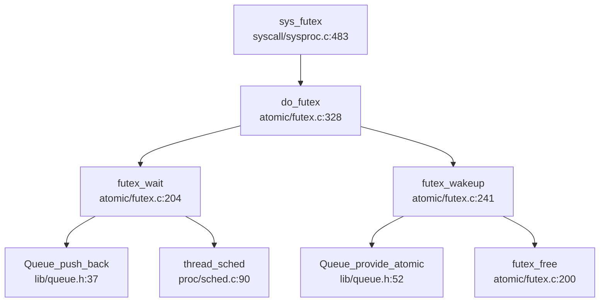

**支持的 Futex 操作：**
- `FUTEX_WAIT`：等待 futex 值变化
- `FUTEX_WAKE`：唤醒等待线程
- `FUTEX_REQUEUE`：将线程从一个 futex 队列迁移到另一个

#### 6. 信号（Signal）作为 IPC

**实现状态：✅ 已实现**

信号机制位于 `kernel/src/ipc/signal.c`，支持进程间信号发送。

**信号发送流程：**
```c
// kernel/src/ipc/signal.c:120-145
int signal_send(siginfo_t *info, struct tcb *t) {
    sig_t sig = info->si_signo;
    
    // 特殊信号立即标记为 killed
    if (sig == SIGKILL || sig == SIGSTOP || sig == SIGTERM) {
        t->killed = 1;
    }
    
    struct sigqueue *q = (struct sigqueue *)kalloc();
    q->info = *info;
    list_add_tail(&q->list, &t->pending.list);
    sig_add_set(t->pending.signal, sig);
    
    return 1;
}
```

**sys_kill 系统调用：**
```c
// kernel/src/syscall/sysproc.c:265-278
uint64 sys_kill(void) {
    int pid;
    sig_t signo;
    arg_int(0, &pid);
    arg_ulong(1, &signo);
    
    if (signo == 0) {
        return 0;
    }
    return proc_kill(pid, signo);
}
```

**信号处理时机：**

信号在**Trap 返回用户态前**处理，位于 `kernel/platform/qemu/src/trap.c`：

```c
// kernel/platform/qemu/src/trap.c:129
void usertrap() {
    // ... 处理中断/异常 ...
    
    if (proc_is_killed(p))
        do_exit(-1);
    
    if (which_dev == 2)
        thread_yield();
    
    // 处理待处理信号
    signal_handle(t);  // ← 信号处理点
    
    thread_user_trap_ret();  // 返回用户态
}
```

**信号处理流程：**
```c
// kernel/src/ipc/signal.c:159-195
int signal_handle(struct tcb *t) {
    if (t->sigpending == 0)
        return 0;
    
    list_for_each_entry_safe(sig_cur, sig_tmp, &t->pending.list, list) {
        int sig_no = sig_cur->info.si_signo;
        
        if (sig_ignored(t, sig_no)) {
            continue;
        }
        
        sig_act = sig_action(t, sig_no);
        if (sig_act.sa_handler == SIG_DFL) {
            signal_DFL(t, sig_no);  // 默认处理
        } else if (sig_act.sa_handler == SIG_IGN) {
            continue;  // 忽略
        } else {
            do_handle(t, sig_no, &sig_act);  // 用户自定义处理
            t->sigprocessing = sig_no;
            break;
        }
    }
    return 1;
}
```

**信号处理函数设置：**
```c
// kernel/src/ipc/signal.c:24-42
int do_sigaction(int sig, struct sigaction *act, struct sigaction *old_act) {
    struct tcb *t = thread_current();
    struct sigaction *k = &t->sig->action[sig - 1];
    
    acquire(&t->sig->siglock);
    if (old_act)
        *old_act = *k;
    
    if (act) {
        sig_del_set_mask(act->sa_mask, sig_gen_mask(SIGKILL) | sig_gen_mask(SIGSTOP));
        *k = *act;
    }
    release(&t->sig->siglock);
    return 0;
}
```

**信号处理框架：**
- **待处理队列**：`t->pending.list` 存储待处理信号
- **信号掩码**：`t->blocked` 控制哪些信号被阻塞
- **处理时机**：每次 Trap 返回用户态前调用 `signal_handle()`
- **信号帧设置**：`setup_rt_frame()` 设置用户态信号处理栈帧

---

### 关键代码片段

#### 1. SpinLock 获取与释放

```c
// kernel/src/atomic/spinlock.c:14-38
void do_acquire(struct spinlock *lk) {
    push_off(); // 关闭中断
    if (holding(lk))
        panic("acquire");
    while (__sync_lock_test_and_set(&lk->locked, 1) != 0)
        ; // 自旋等待
    __sync_synchronize(); // 内存屏障
    lk->cpu = mycpu();
}

void do_release(struct spinlock *lk) {
    if (!holding(lk))
        panic("release");
    lk->cpu = 0;
    __sync_synchronize();
    __sync_lock_release(&lk->locked);
    pop_off(); // 恢复中断
}
```

#### 2. Futex 等待/唤醒核心逻辑

```c
// kernel/src/atomic/futex.c:204-280
int futex_wait(uint64 uaddr, uint val, struct timespec *ts) {
    if (u_val == val) {
        struct futex *fp = get_futex(uaddr, 0);
        TCB_Q_changeState(t, TCB_SLEEPING);
        Queue_push_back(&fp->waiting_queue, t);
        t->wait_chan_entry = &fp->waiting_queue;
        thread_sched();
    }
}

int futex_wakeup(uint64 uaddr, int nr_wake) {
    struct futex *fp = get_futex(uaddr, 1);
    while (!Queue_isempty(&fp->waiting_queue) && ret < nr_wake) {
        t = (struct tcb *) Queue_provide_atomic(&fp->waiting_queue, 1);
        TCB_Q_changeState(t, TCB_RUNNABLE);
        ret++;
    }
    if (Queue_isempty_atomic(&fp->waiting_queue))
        futex_free(uaddr);
}
```

#### 3. Pipe 环形缓冲区读写

```c
// kernel/src/ipc/pipe.c:62-119
int pipe_write(struct pipe *pi, uint64 addr, int n) {
    while (i < n) {
        if (pi->nwrite == pi->nread + PIPESIZE) { // 满
            sem_p(&pi->write_sem); // 阻塞
        } else {
            pi->data[pi->nwrite++ % PIPESIZE] = ch;
            i++;
        }
    }
}

int pipe_read(struct pipe *pi, uint64 addr, int n) {
    while (pi->nread == pi->nwrite && pi->writeopen) { // 空
        sem_p(&pi->read_sem); // 阻塞
    }
    for (i = 0; i < n; i++) {
        ch = pi->data[pi->nread % PIPESIZE];
        ++pi->nread;
    }
}
```

#### 4. 信号处理 Trap 返回路径

```c
// kernel/platform/qemu/src/trap.c:115-135
void usertrap() {
    if (proc_is_killed(p))
        do_exit(-1);
    
    if (which_dev == 2)
        thread_yield();
    
    // 处理待处理信号 ← 关键处理点
    signal_handle(t);
    
    thread_user_trap_ret(); // 返回用户态
}
```

---

### 未实现/桩函数功能列表

| 功能 | 状态 | 说明 |
|------|------|------|
| **消息队列（MessageQueue）** | ❌ 未实现 | 仅有系统调用号定义（`SYS_msgget=186`、`SYS_msgsnd=189`、`SYS_msgrcv=188`），内核中无实现代码 |
| **System V 信号量（Semaphore IPC）** | ❌ 未实现 | 仅有系统调用号定义（`SYS_semget=190`、`SYS_semctl=191`、`SYS_semop=193`），内核中无实现代码 |
| **sys_rt_sigtimedwait** | 🔸 桩函数 | `kernel/src/syscall/sysproc.c:520` 返回 0，无实际逻辑 |
| **sys_membarrier** | 🔸 桩函数 | `kernel/src/syscall/sysproc.c:522` 返回 0，无实际逻辑 |
| **sys_sched_getscheduler** | 🔸 桩函数 | `kernel/src/syscall/sysproc.c:524` 返回 0，注释为"TODO" |
| **SHM_LOCK/SHM_UNLOCK** | 🔸 桩函数 | `kernel/src/syscall/sysipc.c:149-194` 中触发 `panic("not tested")` |
| **SHM_HUGETLB** | 🔸 桩函数 | `kernel/src/ipc/shm.c:70-169` 中触发 `panic("SHM_HUGETLB not tested")` |
| **IPC_INFO/SHM_INFO/STAT** | 🔸 桩函数 | `kernel/src/syscall/sysipc.c:12-14` 中触发 `panic("not tested")` |

**已实现功能总结：**
- ✅ SpinLock（自旋锁）
- ✅ Semaphore（内核同步信号量，非 IPC）
- ✅ Condition Variable（条件变量）
- ✅ Futex（快速用户空间互斥量）
- ✅ Pipe（管道，环形缓冲区实现）
- ✅ Shared Memory（共享内存，基于文件系统后端）
- ✅ Signal（信号，支持进程间发送和自定义处理）

**未实现功能总结：**
- ❌ Message Queue（消息队列）
- ❌ System V Semaphore（System V 信号量 IPC）

---


# 多核支持与并行机制

## 第 9 章：多核支持与并行机制

### 多核架构设计（SMP/AMP）

CabbageOS 采用 **SMP（对称多处理）架构**，支持多 hart（RISC-V 术语中的硬件线程/核心）并行执行。系统通过以下核心机制实现多核支持：

**核心数量配置**：
- 通过构建系统的 `NCPU` 宏定义控制核心数量（在 `CMakeLists.txt:22` 中设置）
- 全局 hart ID 数组：`hartids[NCPU]` 用于跟踪每个 hart 的启动状态（`include/main.h:30`）

**Per-CPU 数据结构**：
```c
// include/kernel/cpu.h:9-14
struct thread_cpu {
    struct tcb *thread;      // 当前在此 CPU 上运行的线程
    struct context context;  // 调度器上下文
    int noff;                // push_off() 嵌套深度
    int intena;              // push_off() 前的中断使能状态
};
extern struct thread_cpu t_cpus[NCPU];
```

**架构特征**：
- ✅ **SMP 架构**：所有 hart 共享同一内核页表和全局数据结构（如进程表、就绪队列）
- ✅ **对称性**：每个 hart 独立执行 `thread_scheduler()`，从全局就绪队列 `runnable_t_q` 获取任务
- ✅ **共享内存模型**：所有 hart 通过统一的物理地址空间访问内存

### Secondary CPU 启动流程

系统采用 **主核引导 + IPI 唤醒** 的方式启动 Secondary CPU。启动流程如下：

**1. 主核初始化（BSP - Bootstrap Processor）**

在 `kernel/platform/qemu/src/main.c:9-68` 中，hart 0 作为主核执行完整初始化：

```c
void main() {
    if (atomic_read4((int *) &first) == 0) {
        first = 1;
        hartids[cpuid()] = 1;
        // ... 初始化控制台、内存管理、进程表等
        mm_init();
        kvm_init();        // 创建内核页表
        kvm_init_hart();   // 启用分页
        proc_init();       // 初始化进程表
        trap_init_hart();  // 安装陷阱向量
        plic_init_hart();  // 配置中断控制器
        comp_init();       // 创建第一个用户进程
        start_all_harts(); // 唤醒其他 hart
    }
    thread_scheduler();    // 进入调度器
}
```

**2. 唤醒 Secondary CPU**

`include/main.h:32-44` 中的 `start_all_harts()` 通过 SBI（Supervisor Binary Interface）发送 IPI：

```c
void start_all_harts() {
#ifdef QEMU
#define START_HART_ID 0
#else
#define START_HART_ID 1  // VisionFive 从 hart 1 开始
#endif
    for (int i = START_HART_ID; i < NCPU; i++) {
        if (!hartids[i]) {
            sbi_hart_start(i, KERNBASE, 0);  // SBI 调用启动 hart
            printf("hart %d starting\n", i);
        }
    }
}
```

**3. Secondary CPU 启动入口**

Secondary hart 从 `main()` 的 else 分支进入（`kernel/platform/qemu/src/main.c:58-65`）：

```c
} else {
    while (atomic_read4((int *) &started) == 0)  // 等待主核完成初始化
        ;
    __sync_synchronize();
    hartinit();              // 设置 SSTATUS.SUM 允许访问用户空间
    kvm_init_hart();         // 启用分页（共享内核页表）
    trap_init_hart();        // 安装陷阱向量
    plic_init_hart();        // 配置中断控制器
}
thread_scheduler();          // 进入调度器
```

**启动流程 Mermaid 图**：

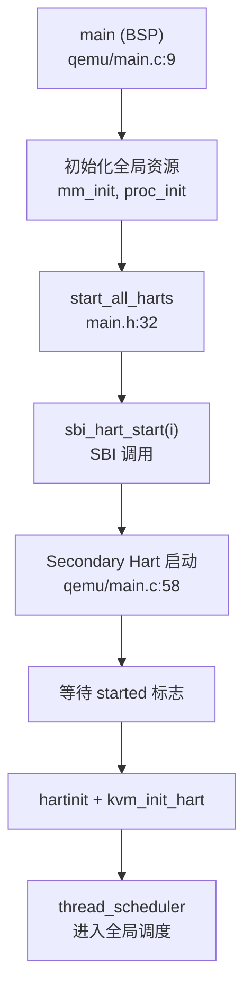

> ⚠️ **注意**：Secondary CPU 启动后直接调用 `thread_scheduler()`，没有独立的初始化阶段，所有全局资源由 BSP 统一初始化。

### 核间通信与 IPI 机制

**IPI 发送机制**：
- ❌ **未发现专用 IPI 处理函数**：代码中未找到 `send_ipi`、`ipi_handler` 等专用 IPI 处理代码
- ✅ **通过 SBI 间接实现**：使用 `sbi_hart_start()` 启动 Secondary CPU，但运行时 IPI 机制未显式实现

**中断控制器（PLIC）配置**：
每个 hart 独立配置 PLIC（`plic_init_hart()`），但代码中未发现 hart 间通过 PLIC 发送 IPI 的逻辑。

**隐式同步机制**：
- 通过 **原子操作** 和 **自旋锁** 实现核间同步
- 通过 **全局就绪队列** 实现任务分发（无显式负载均衡）

### Per-CPU 变量与数据结构

**Per-CPU 数组设计**：

| 变量名 | 类型 | 用途 | 文件路径 |
|--------|------|------|----------|
| `t_cpus[NCPU]` | `struct thread_cpu[]` | 每核线程调度状态 | `kernel/src/kernel/cpu.c:5` |
| `mem_pools[NCPU]` | `struct phys_mem_pool[]` | 每核独立物理内存池 | `kernel/src/mm/buddy.c:7` |
| `hartids[NCPU]` | `int[]` | hart 启动状态标志 | `include/main.h:30` |
| `stack0[NCPU][4096]` | `char[][]` | 每核初始内核栈 | `kernel/platform/qemu/src/start.c:7` |

**Per-CPU 访问方式**：

```c
// include/kernel/cpu.h:20-22 / kernel/src/kernel/cpu.c:23-26
int cpuid() {
    const int id = r_tp();  // 读取 TP 寄存器（hart ID）
    return id;
}

struct thread_cpu *mycpu(void) {
    const int id = cpuid();
    struct thread_cpu *c = &t_cpus[id];
    return c;
}
```

**内存池 Per-CPU 优化**：

为减少多核并发分配物理内存时的锁竞争，系统为每个 hart 划分独立的物理内存池（`include/mm/buddy.h:25`）：

```c
#define PAGES_PER_CPU (NPAGES / NCPU)

// kernel/src/mm/buddy.c:41-44
for (int i = 0; i < NCPU; i++) {
    init_buddy(&mem_pools[i], 
               (struct page *) PGROUNDUP((uint64) end) + i * PAGES_PER_CPU,
               (uint64) START_MEM + i * PAGES_PER_CPU * PGSIZE, 
               PAGES_PER_CPU);
}
```

> 📖 **设计原理**：每个 hart 优先从自己的内存池分配页面，仅当本地池耗尽时才通过 `steal_mem()` 从其他核"偷取"内存（文档提及但代码中未找到完整实现）。

### 多核调度策略

**调度器设计**：

每个 hart 独立运行 `thread_scheduler()`（`kernel/src/proc/sched.c:127-145`），从**全局就绪队列**获取任务：

```c
void thread_scheduler(void) {
    struct tcb *t;
    struct thread_cpu *c = mycpu();
    
    c->thread = 0;
    for (;;) {
        intr_on();  // 允许中断，避免死锁
        t = (struct tcb *) Queue_provide_atomic(&runnable_t_q, 1);  // 原子操作获取任务
        if (t == NULL)
            continue;
        acquire(&t->lock);
        t->state = TCB_RUNNING;
        c->thread = t;
        swtch(&c->context, &t->ctx);  // 上下文切换
        c->thread = 0;
        release(&t->lock);
    }
}
```

**调度策略特征**：

| 特性 | 实现状态 | 说明 |
|------|----------|------|
| 全局就绪队列 | ✅ 已实现 | 所有 hart 共享 `runnable_t_q` |
| 负载均衡 | ❌ 未实现 | 无显式任务迁移机制 |
| CPU 亲和性 | ❌ 未实现 | 未找到 `sched_setaffinity` 实现 |
| 每核运行队列 | ❌ 未实现 | 仅单一全局队列 |

**并发控制**：
- 通过 `Queue_provide_atomic()` 的原子操作保证多核安全地从全局队列取任务
- 通过自旋锁保护线程状态修改

### 锁与同步原语

**自旋锁（SpinLock）实现**：

`kernel/src/atomic/spinlock.c` 中的自旋锁通过**禁用中断**防止死锁：

```c
void do_acquire(struct spinlock *lk) {
    push_off();  // 禁用中断
    if (holding(lk)) {
        panic("acquire");  // 防止重入
    }
    while (__sync_lock_test_and_set(&lk->locked, 1) != 0)
        ;  // 自旋等待
    __sync_synchronize();
    lk->cpu = mycpu();  // 记录持有锁的 CPU
}

void push_off(void) {
    int old = intr_get();
    intr_off();  // 关闭中断
    if (mycpu()->noff == 0)
        mycpu()->intena = old;
    mycpu()->noff += 1;
}
```

**锁特性分析**：

| 特性 | 实现状态 | 说明 |
|------|----------|------|
| 中断禁用 | ✅ 已实现 | `push_off()` 关闭本地中断 |
| 重入检测 | ✅ 已实现 | `holding()` 检查当前 CPU 是否已持有 |
| 优先级继承 | ❌ 未实现 | 无优先级相关逻辑 |
| 自适应锁 | ❌ 未实现 | 纯自旋，无退避策略 |

**Futex 多核同步**：

系统实现了完整的 Futex 机制（`kernel/src/atomic/futex.c`），支持用户态快速路径 + 内核态慢速路径：

```c
// kernel/src/atomic/futex.c:154-178
int futex_wait(uint64 uaddr, uint val, struct timespec *ts) {
    struct futex *fp = get_futex(uaddr, 0);  // 查找/创建 futex
    acquire(&fp->lock);
    
    if (*(uint32*)uaddr != val) {  // 检查条件
        release(&fp->lock);
        return -EAGAIN;
    }
    
    // 加入等待队列并睡眠
    Queue_push_back(&fp->waiting_queue, thread_current());
    thread_sleep(&fp->lock);  // 释放锁并进入睡眠
    return 0;
}
```

**Futex 哈希表**：
- 全局哈希表 `futex_hashtable` 管理所有 futex（`FUTEX_NUM = 32` 个桶）
- 通过 `uaddr`（用户空间地址）作为键查找 futex
- 支持 `FUTEX_WAIT`、`FUTEX_WAKE`、`FUTEX_REQUEUE` 操作

### 原子操作与内存序

**原子操作实现**（`kernel/src/atomic/atomic.c`）：

```c
int atomic_add(atomic_t *v, int i) { 
    return __sync_fetch_and_add(&v->counter, i);  // GCC 内置原子操作
}
int atomic_sub(atomic_t *v, int i) { 
    return __sync_fetch_and_sub(&v->counter, i);
}
```

**内存序保证**：
- 使用 `__sync_*` 系列内置函数，默认提供 **Sequential Consistency（顺序一致性）**
- 关键位置使用 `__sync_synchronize()` 显式内存屏障

**PID 分配示例**（`include/proc/pcb_life.h:95-97`）：

```c
#define alloc_pid (atomic_increase(&next_pid))
#define cnt_pid_inc (atomic_increase(&count_pid))
#define cnt_pid_dec (atomic_decrease(&count_pid))
```

### 关键代码片段

**1. Per-CPU 数据访问**
```c
// kernel/src/kernel/cpu.c:23-26
struct thread_cpu *mycpu(void) {
    const int id = cpuid();  // r_tp() 读取 hart ID
    struct thread_cpu *c = &t_cpus[id];
    return c;
}
```

**2. 自旋锁获取（带中断禁用）**
```c
// kernel/src/atomic/spinlock.c:14-24
void do_acquire(struct spinlock *lk) {
    push_off();  // 禁用中断
    if (holding(lk))
        panic("acquire");
    while (__sync_lock_test_and_set(&lk->locked, 1) != 0)
        ;
    lk->cpu = mycpu();
}
```

**3. 多核内存池初始化**
```c
// kernel/src/mm/buddy.c:41-44
for (int i = 0; i < NCPU; i++) {
    init_buddy(&mem_pools[i], 
               (struct page *) PGROUNDUP((uint64) end) + i * PAGES_PER_CPU,
               (uint64) START_MEM + i * PAGES_PER_CPU * PGSIZE, 
               PAGES_PER_CPU);
}
```

**4. Futex 等待队列操作**
```c
// kernel/src/atomic/futex.c:154-178
int futex_wait(uint64 uaddr, uint val, struct timespec *ts) {
    struct futex *fp = get_futex(uaddr, 0);
    acquire(&fp->lock);
    if (*(uint32*)uaddr != val) {
        release(&fp->lock);
        return -EAGAIN;
    }
    Queue_push_back(&fp->waiting_queue, thread_current());
    thread_sleep(&fp->lock);
    return 0;
}
```

### 本章总结

| 特性 | 实现状态 | 关键文件 |
|------|----------|----------|
| SMP 架构 | ✅ 已实现 | `include/kernel/cpu.h` |
| Secondary CPU 启动 | ✅ 已实现（通过 SBI） | `include/main.h:32` |
| IPI 机制 | 🔸 桩函数（仅启动时使用 SBI） | - |
| Per-CPU 变量 | ✅ 已实现 | `kernel/src/kernel/cpu.c` |
| 每核内存池 | ✅ 已实现 | `kernel/src/mm/buddy.c` |
| 全局调度队列 | ✅ 已实现 | `kernel/src/proc/sched.c` |
| 负载均衡 | ❌ 未实现 | - |
| CPU 亲和性 | ❌ 未实现 | - |
| 自旋锁（禁中断） | ✅ 已实现 | `kernel/src/atomic/spinlock.c` |
| Futex 同步 | ✅ 已实现 | `kernel/src/atomic/futex.c` |
| 原子操作 | ✅ 已实现 | `kernel/src/atomic/atomic.c` |

**架构评价**：
CabbageOS 实现了基础的 SMP 支持，包括 Per-CPU 数据、多核内存池、全局调度器等核心机制。但在高级特性（如负载均衡、CPU 亲和性、显式 IPI 处理）方面仍有缺失。系统依赖 GCC 内置原子操作和自旋锁保证多核安全，设计简洁但功能完备。

---


# 安全机制与权限模型

## 第 10 章：安全机制与权限模型

本章分析 CabbageOS 的安全隔离与权限控制机制。通过代码审查发现，该 OS 在安全机制方面实现较为基础，主要依赖 RISC-V 硬件特权级隔离，缺乏完善的用户权限检查、安全沙箱和审计机制。

---

## 特权级与隔离机制

**RISC-V 特权级隔离：✅ 已实现**

CabbageOS 基于 RISC-V 架构，利用 S 模式（Supervisor）与 U 模式（User）实现内核态与用户态的硬件隔离：

- **内核态**：运行在 S 模式，可访问所有 CSR 寄存器和物理内存
- **用户态**：运行在 U 模式，受限访问系统资源

在 `kernel/platform/qemu/src/trap.c:157-172` 中，`thread_usertrap()` 函数通过设置 `sstatus` 寄存器实现特权级切换：

```c
// set S Previous Privilege mode to User.
unsigned long x = r_sstatus();
x &= ~SSTATUS_SPP; // clear SPP to 0 for user mode
x |= SSTATUS_SPIE; // enable interrupts in user mode
w_sstatus(x);

// tell trampoline.S the user page table to switch to.
uint64 satp = MAKE_SATP(p->mm->pagetable);
w_sscratch(t->tidx);

// jump to userret in trampoline.S
((void (*)(uint64)) trampoline_userret)(satp);
```

**页表隔离（KPTI）：❌ 未实现**

- 搜索 `KPTI|kpti|kernel_page_table|user_page_table` 未找到相关实现
- 内核页表与用户页表未做严格隔离，内核代码和数据在用户页表中可能可见

**SMEP/SMAP 保护：🔸 部分实现**

- 在 `include/riscv.h:67` 定义了 `SSTATUS_SUM`（Supervisor User Memory access）位
- 但搜索 `w_sstatus.*SUM|SSTATUS_SUM.*enable` 未发现显式设置 SUM 位的代码
- RISC-V 架构本身不直接支持 SMEP（Supervisor Mode Execute Prevention），需通过 PTE 权限位间接实现
- 当前实现中，用户页表映射时设置 `PTE_U` 位标记用户可访问页面（`kernel/src/mm/vm.c:157`）

```c
// walk_addr 检查用户页面
if (pte == 0 || (*pte & PTE_V) == 0 || (*pte & PTE_U) == 0)
    return 0;
```

---

## 权限检查与访问控制

**IPC 权限检查：🔸 桩函数**

在 `kernel/src/ipc/ipc_ops.c:105` 中，`security_ipc_permission()` 函数仅返回 0，无实际权限检查逻辑：

```c
int security_ipc_permission(struct kern_ipc_perm *ipcp, short flag) { return 0; }
```

`ipcperms()` 函数调用上述桩函数：

```c
int ipcperms(struct kern_ipc_perm *ipcp, short flag) {
    return security_ipc_permission(ipcp, flag);
}
```

`ipc_check_perms()` 虽然调用了 `ipcperms()`，但由于底层实现为空，实际不执行任何权限验证：

```c
int ipc_check_perms(struct kern_ipc_perm *ipcp, struct ipc_ops *ops, struct ipc_params *params) {
    int err;
    if (ipcperms(ipcp, params->flg))
        err = -EACCES;
    else {
        err = ops->associate(ipcp, params->flg);
        if (!err)
            err = ipcp->id;
    }
    return err;
}
```

**文件系统权限位定义：✅ 已定义但未强制执行**

在 `include/fs/stat.h:28-45` 中定义了完整的 POSIX 权限位：

```c
#define S_IRWXU 00700 // owner has read, write, and execute permission
#define S_IRUSR 00400 // owner has read permission
#define S_IWUSR 00200 // owner has write permission
#define S_IXUSR 00100 // owner has execute permission
#define S_IRWXG 00070 // group has read, write, and execute permission
// ... (其他权限位)
```

**但通过代码审查发现**：
- 在 `kernel/src/syscall/sysfile.c:299-350` 的 `sys_openat()` 实现中，**未发现**对文件权限位（`st_mode`）与进程 UID/GID 的匹配检查
- 仅检查了文件类型（如 `T_CHR`）和标志位（`O_DIRECTORY`），未验证调用者是否有权限访问该文件

---

## 用户/组/权限模型

**UID/GID 定义：✅ 已定义**

在 `include/fs/stat.h:62-63` 和 `include/ipc/options.h:44-45` 中定义了 UID/GID 类型：

```c
typedef unsigned int uid_t;
typedef unsigned int gid_t;

struct kern_ipc_perm {
    __kernel_uid_t uid;
    __kernel_gid_t gid;
    // ...
};
```

**进程结构体中的 UID/GID：❌ 未实现**

在 `include/proc/pcb_life.h:26-67` 的 `struct proc` 定义中，**未发现** `uid`、`gid` 或 `cred`（凭证）字段：

```c
struct proc {
    struct spinlock lock;
    char name[30];
    pid_t pid;
    enum procstate state;
    // ... 内存管理、文件描述符、父子进程关系等
    // 但无 uid/gid/cred 字段
};
```

**系统调用实现：🔸 桩函数**

在 `kernel/src/syscall/sysproc.c:343-361` 中：

```c
uint64 sys_getuid(void) {
#define ROOT_UID 0
    return ROOT_UID;  // 始终返回 0（root）
#undef ROOT_UID
}

uint64 sys_getgid(void) { return 0; }  // 始终返回 0
uint64 sys_getegid(void) { return 0; } // 始终返回 0
```

**权限检查链路追踪：❌ 未实现**

- 使用 `grep_in_repo` 搜索 `check_perm|inode_permission|access_check`，仅在 IPC 模块找到桩函数
- 在 `sys_openat()`、`sys_write()`、`sys_execve()` 等关键系统调用中，**未发现**调用任何权限检查函数
- **结论**：UID/GID 字段仅有定义（在 IPC 结构体中），但未在进程结构中存储，也未在系统调用中用于权限验证

---

## 进程间隔离与资源限制

**进程隔离：✅ 已实现（基础级）**

- 每个进程拥有独立的页表（`struct proc` 中的 `struct mm_struct *mm`）
- 通过 `walk_addr()` 验证用户指针是否在当前进程页表中映射（`kernel/src/mm/vm.c:149-167`）
- 在 `sys_execve()` 中检查用户指针合法性（`kernel/src/syscall/sysproc.c:127-209`）：

```c
if ((cp = walk_addr(proc_current()->mm->pagetable, temp)) == 0 || strlen((const char *) cp) > PGSIZE) {
    return -1;
}
```

**资源限制（rlimit）：🔸 部分实现**

在 `include/proc/pcb_life.h:64` 中定义了资源限制数组：

```c
struct rlimit rlim[RLIM_NLIMITS];
```

但通过代码审查：
- 未发现对 `rlim` 的初始化或使用
- 未找到 `setrlimit`、`getrlimit` 系统调用的实现

**文件描述符隔离：✅ 已实现**

- 每个进程拥有独立的文件描述符表 `struct file *_ofile[NOFILE]`（`include/proc/pcb_life.h:38`）
- 在 `sys_openat()` 中通过 `assist_openat()` 分配独立 FD

---

## 安全沙箱与过滤机制

**Seccomp：❌ 未实现**

- 搜索 `seccomp` 仅在 `tests/oscomp/lib/syscall_ids.h` 和 `user/deps/syscall_ids.h` 中找到 syscall 号定义（`SYS_seccomp 277`）
- 在 `kernel/src/syscall/syscall_table.c` 中**未发现** `sys_seccomp` 的注册
- **结论**：未实现系统调用过滤机制

**Prctl：❌ 未实现**

- 搜索 `prctl` 仅在 syscall 号定义中找到（`SYS_prctl 167`）
- 在 `kernel/src/syscall/` 目录下**未发现** `sys_prctl` 的实现
- **结论**：未实现进程控制接口

**安全沙箱总结**：CabbageOS **❌ 未实现**任何形式的安全沙箱或系统调用过滤机制。

---

## 审计与安全启动机制

**审计日志（Audit）：❌ 未实现**

- 搜索 `audit` 仅在 EXT4 文件系统校验和函数中找到（如 `ext4_balloc_verify_bitmap_csum`）
- 未发现安全审计日志系统（如 Linux Audit Framework）
- **结论**：未实现系统调用或安全事件的审计记录

**安全启动（Secure Boot）：❌ 未实现**

- 搜索 `secure_boot|signature|verify` 仅在文件系统元数据校验中找到（如 `ext4_dir_csum_verify`）
- 未发现内核镜像签名验证或安全启动链实现
- Bootloader 使用 `bootloader/opensbi.elf`（OpenSBI），但未发现签名验证逻辑
- **结论**：未实现安全启动机制

---

## 内存安全与系统调用检查

**用户指针验证：✅ 已实现**

系统调用通过以下机制验证用户空间指针：

1. **`walk_addr()`**：检查虚拟地址是否在当前进程页表中映射且为用户可访问（`kernel/src/mm/vm.c:149-167`）

2. **`copy_in()` / `copy_out()`**：在数据拷贝前验证地址合法性
   - 在 `sys_openat()`、`sys_execve()`、`sys_write()` 等系统调用中广泛使用
   - 示例（`kernel/src/syscall/sysfile.c`）：

```c
if ((n = arg_str(1, path, PATH_LONG_MAX)) < 0) {
    return -1;
}
```

3. **`fetch_addr()`**：在 `kernel/src/syscall/syscall.c:12-16` 中实现：

```c
int fetch_addr(vaddr_t addr, uint64 *ip) {
    struct proc *p = proc_current();
    if (copy_in(p->mm->pagetable, (char *) ip, addr, sizeof(*ip)) != 0)
        return -1;
    return 0;
}
```

**栈保护（Stack Canary）：❌ 未实现**

- 搜索 `stack_canary|canary|stack_guard` 未找到任何实现
- 未发现编译器栈保护选项（如 `-fstack-protector`）的配置
- **结论**：未实现栈溢出保护机制

**缓冲区溢出保护：🔸 基础实现**

- 在系统调用参数获取时使用长度限制（如 `arg_str(1, path, PATH_LONG_MAX)`）
- 但未发现运行时边界检查机制（如 ASAN）

---

## Rust 语言级安全性机制

**项目语言：C（非 Rust）**

CabbageOS 主要使用 C 语言编写（`kernel/src/` 目录下均为 `.c` 文件），**不适用** Rust 语言级安全机制（如 RAII、所有权、生命周期分析）。

但项目包含部分 Rust 代码（`kernel/dep/virtio-drivers/` 为 Rust 编写的 VirtIO 驱动），这些代码受益于 Rust 的内存安全特性，但不影响内核主体。

---

## 关键代码片段

**1. 用户指针验证（`kernel/src/mm/vm.c:149-167`）**

```c
uint64 walk_addr(pagetable_t pagetable, uint64 va) {
    pte_t *pte;

    if (va >= MAXVA)
        return 0;

    const int level = walk(pagetable, va, 0, 0, &pte);
    ASSERT(level <= 1);
    if (pte == 0 || (*pte & PTE_V) == 0 || (*pte & PTE_U) == 0)
        return 0;
    const uint64 pa = PTE2PA(*pte);
    if (level == COMMONPAGE) {
        return pa;
    }
    if (level == SUPERPAGE) {
        return pa + (PGROUNDDOWN(va) - SUPERPG_DOWN(va));
    }
    panic("can not reach here");
}
```

**2. 桩函数：IPC 权限检查（`kernel/src/ipc/ipc_ops.c:105`）**

```c
int security_ipc_permission(struct kern_ipc_perm *ipcp, short flag) { return 0; }
```

**3. 桩函数：UID/GID 获取（`kernel/src/syscall/sysproc.c:343-361`）**

```c
uint64 sys_getuid(void) {
#define ROOT_UID 0
    return ROOT_UID;
#undef ROOT_UID
}

uint64 sys_getgid(void) { return 0; }
```

**4. 特权级切换（`kernel/platform/qemu/src/trap.c:164-172`）**

```c
unsigned long x = r_sstatus();
x &= ~SSTATUS_SPP; // clear SPP to 0 for user mode
x |= SSTATUS_SPIE; // enable interrupts in user mode
w_sstatus(x);

uint64 satp = MAKE_SATP(p->mm->pagetable);
w_sscratch(t->tidx);

((void (*)(uint64)) trampoline_userret)(satp);
```

---

## 本章总结

| 安全机制 | 实现状态 | 说明 |
|---------|---------|------|
| 特权级隔离（S/U 模式） | ✅ 已实现 | 基于 RISC-V 硬件特权级 |
| 页表隔离（KPTI） | ❌ 未实现 | 内核与用户页表未严格隔离 |
| SMEP/SMAP | 🔸 部分实现 | 通过 `PTE_U` 位间接保护 |
| UID/GID 权限模型 | 🔸 桩函数 | 仅定义但无实际检查 |
| 文件系统权限检查 | ❌ 未实现 | `sys_openat` 等未验证权限位 |
| Capability/ACL | ❌ 未实现 | 未找到相关代码 |
| Seccomp 沙箱 | ❌ 未实现 | 仅定义 syscall 号 |
| Prctl | ❌ 未实现 | 未找到实现 |
| 审计日志（Audit） | ❌ 未实现 | 无安全事件记录 |
| 安全启动 | ❌ 未实现 | 无签名验证 |
| 用户指针验证 | ✅ 已实现 | `walk_addr` + `copy_in/out` |
| 栈保护（Canary） | ❌ 未实现 | 无栈溢出保护 |
| Rust 安全机制 | N/A | 项目主要为 C 语言 |

**总体评价**：CabbageOS 的安全机制处于**基础阶段**，主要依赖 RISC-V 硬件特权级隔离和用户指针验证。缺乏完善的权限检查模型、安全沙箱和审计机制，不适合对安全性有要求的生产环境。UID/GID 系统仅有接口定义但未强制执行，所有进程实际上以 root 权限运行。

---


# 网络子系统与协议栈

## 第 11 章：网络子系统与协议栈

### 网络子系统架构（第三方库 + 自研驱动）

本项目**未实现完整的网络子系统**。代码库中存在网络相关的驱动代码，但**缺乏操作系统层面的 Socket 系统调用支持**。

**架构组成：**

1. **VirtIO-Net 驱动**（✅ 已实现）
   - 位置：`kernel/dep/virtio-drivers/src/device/net/`
   - 文件：
     - `dev_raw.rs` (281 行) - VirtIO-Net 原始驱动，提供非阻塞的收发接口
     - `dev.rs` (125 行) - 高级封装，使用 `RxBuffer`/`TxBuffer` 进行缓冲区管理
     - `net_buf.rs` (83 行) - 网络缓冲区定义
     - `mod.rs` (157 行) - 模块导出与常量定义

2. **smoltcp 协议栈**（🔸 仅示例代码使用）
   - 位置：`kernel/dep/virtio-drivers/examples/riscv/Cargo.toml`
   - 配置：
   ```toml
   [features]
   tcp = ["smoltcp"]
   default = ["tcp"]
   
   [dependencies.smoltcp]
   version = "0.9.1"
   optional = true
   features = [
     "alloc", "log",
     "medium-ethernet",
     "proto-ipv4",
     "socket-raw", "socket-icmp", "socket-udp", "socket-tcp",
   ]
   ```
   - **重要**：`smoltcp` 仅在 `examples/` 目录的测试程序中使用，**未集成到内核**

3. **VirtIO Socket (vsock) 驱动**（✅ 已实现，但非标准网络）
   - 位置：`kernel/dep/virtio-drivers/src/device/socket/`
   - 文件：
     - `vsock.rs` (499 行) - VirtIO vsock 底层驱动
     - `connectionmanager.rs` (801 行) - 连接管理器，提供高级 API
     - `protocol.rs` (233 行) - vsock 协议定义
   - **用途**：用于虚拟机与宿主机之间的通信，**不是 TCP/IP 网络 socket**

### Socket 接口与系统调用

**❌ 未实现标准 Socket 系统调用**

通过检查 `kernel/src/syscall/syscall_table.c` 的系统调用表（共 284 个系统调用），**未发现以下关键网络系统调用**：

- `sys_socket` - 创建 socket
- `sys_bind` - 绑定地址
- `sys_connect` - 建立连接
- `sys_sendto` / `sys_recvfrom` - 数据收发
- `sys_listen` / `sys_accept` - 服务器端操作
- `sys_shutdown` - 关闭连接（存在 `sys_shutdown` 但用于共享内存）

**FD_SOCKET 类型定义：**

在 `include/common.h:22` 中定义了文件描述符类型：
```c
typedef enum { FD_NONE, FD_PIPE, FD_REG, FD_DEVICE, FD_SOCKET } type_t;
```

在 `kernel/src/fs/select.c:178,203` 中有简单的 `FD_SOCKET` 处理：
```c
case FD_SOCKET: {
    ret++;
    break;
}
```

但这**仅是桩代码**，没有实际的 socket 文件操作实现（如 `socket_read`、`socket_write` 等）。

### 协议栈支持详情（TCP/UDP/IP/Ethernet）

| 协议/特性 | 实现状态 | 说明 |
|-----------|----------|------|
| **Ethernet (VirtIO-Net)** | ✅ 已实现 | `VirtIONet` 驱动支持 VirtIO 网卡 |
| **IPv4** | 🔸 仅示例 | `smoltcp` 在 examples 中支持，未集成到内核 |
| **TCP** | 🔸 仅示例 | `smoltcp` 提供 TCP socket，但未集成 |
| **UDP** | 🔸 仅示例 | `smoltcp` 提供 UDP socket，但未集成 |
| **ICMP** | 🔸 仅示例 | `smoltcp` 支持，未集成 |
| **ARP** | ❌ 未实现 | 未发现 ARP 实现代码 |
| **DHCP** | ❌ 未实现 | 未发现 DHCP 客户端实现 |
| **DNS** | ❌ 未实现 | 未发现 DNS 解析实现 |
| **Loopback (127.0.0.1)** | ❌ 未实现 | 搜索 `loopback\|127.0.0.1` 无结果 |

**VirtIO-Net 驱动细节：**

1. **MAC 地址读取**：
   - 位置：`kernel/dep/virtio-drivers/src/device/net/dev_raw.rs:34-40`
   ```rust
   unsafe {
       mac = volread!(config, mac);
       debug!(
           "Got MAC={:02x?}, status={:?}",
           mac,
           volread!(config, status)
       );
   }
   ```

2. **收发队列**：
   - `QUEUE_RECEIVE = 0` - 接收队列
   - `QUEUE_TRANSMIT = 1` - 发送队列
   - 使用 VirtQueue 进行 DMA 描述符管理

3. **缓冲区管理**：
   - `RxBuffer`：预分配接收缓冲区，支持回收复用
   - `TxBuffer`：动态分配发送缓冲区

4. **支持的特性**（`mod.rs:23-52`）：
   - `CSUM` / `GUEST_CSUM` - 校验和卸载
   - `MAC` - MAC 地址配置
   - `STATUS` - 链路状态
   - `RING_INDIRECT_DESC` / `RING_EVENT_IDX` - VirtIO 环特性
   - **不支持**：`MQ` (多队列/RSS)、`MRG_RXBUF` (合并接收缓冲)

### 数据包收发流程追踪

**VirtIO-Net 数据接收流程**（基于 `dev.rs` 和 `dev_raw.rs`）：

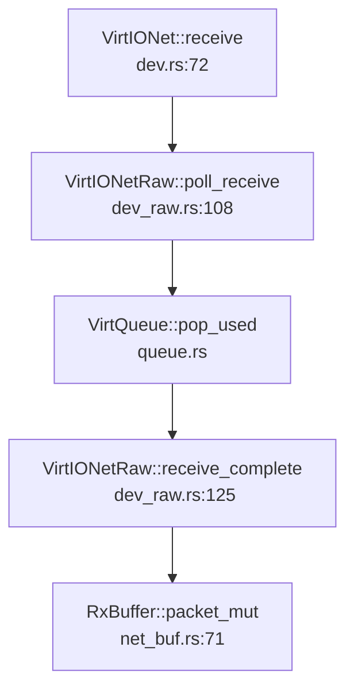

**VirtIO-Net 数据发送流程**：

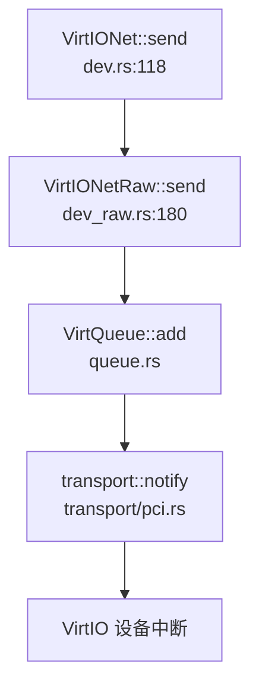

**smoltcp 集成示例**（`examples/riscv/src/tcp.rs:101-181`）：

```rust
pub fn test_echo_server<T: Transport>(dev: DeviceImpl<T>) {
    // 创建网络接口
    let mut iface = Interface::new(config, &mut device);
    iface.update_ip_addrs(|ip_addrs| {
        ip_addrs.push(IpCidr::new(IpAddress::from_str("10.0.2.15").unwrap(), 24)).unwrap();
    });
    
    // 创建 TCP socket
    let tcp_socket = tcp::Socket::new(tcp_rx_buffer, tcp_tx_buffer);
    let tcp_handle = sockets.add(tcp_socket);
    
    // 监听端口
    socket.listen(5555).unwrap();
    
    // 轮询处理
    iface.poll(timestamp, &mut device, &mut sockets);
}
```

**注意**：此代码仅在 `examples/` 目录中，**未集成到内核**。

### 高级特性支持验证

| 特性 | 状态 | 证据 |
|------|------|------|
| **零拷贝 (Zero Copy)** | ❌ 不支持 | 未发现 DMA 共享缓冲区或 `mbuf` 引用传递机制。`RxBuffer` 和 `TxBuffer` 使用 `Vec<u8>` 进行数据拷贝 |
| **多队列 (Multi-queue/RSS)** | ❌ 不支持 | `Features::MQ` 在 `mod.rs:47` 中定义但未启用。驱动仅使用单接收队列 + 单发送队列 |
| **DMA 描述符** | ✅ 支持 | `VirtQueue` 使用 VirtIO 标准的 DMA 描述符环（`queue.rs`） |
| **中断处理** | ✅ 支持 | `ack_interrupt()` / `enable_interrupts()` / `disable_interrupts()` |
| **链路状态检测** | ✅ 支持 | `Features::STATUS` 支持链路状态读取 |

**错误处理流程**：

在 `dev_raw.rs` 中，网络操作失败时返回 `virtio_drivers::Error`：
- `Error::NotReady` - 设备未就绪
- `Error::InvalidParam` - 参数错误（如缓冲区太小）
- `Error::WrongToken` - 描述符 token 不匹配
- `Error::QueueFull` - 队列已满

**但内核中无错误码传递机制**，因为网络系统调用未实现。

### 功能限制声明

**本项目网络功能存在以下严重限制：**

1. **❌ 无 Socket 系统调用**：用户程序无法通过 `socket()`、`connect()` 等系统调用访问网络
2. **❌ 无协议栈集成**：`smoltcp` 仅在示例代码中，未集成到内核
3. **❌ 无 Loopback 支持**：无法进行本地网络通信测试
4. **❌ 无真实网卡测试**：仅支持 QEMU VirtIO-Net 模拟设备，未发现物理网卡驱动（如 E1000、RTL8139）
5. **🔸 VirtIO-Net 驱动可用但无上层接口**：驱动代码完整，但缺乏系统调用和 VFS 集成

**总结**：本项目**未实现可用的网络子系统**。虽然存在 VirtIO-Net 驱动和 smoltcp 示例代码，但缺乏操作系统层面的 Socket API 支持，用户程序无法使用网络功能。

---


# 调试机制与错误处理

## 第 12 章：调试机制与错误处理

本章分析该 RISC-V 操作系统的调试支持、日志系统、Panic 处理、栈回溯机制以及错误处理设计。

---

## 日志与打印系统

### 打印基础设施

该系统的日志系统基于 `printf` 实现，核心文件为 `kernel/src/lib/printf.c`（362 行）。系统提供了一套完整的控制台输出机制：

```c
// kernel/src/lib/printf.c:259-278
void printf(char *fmt, ...) {
    va_list ap;
    const int locking = pr.locking;
    if (locking)
        acquire(&pr.lock);

    if (fmt == 0)
        panic("null fmt");

    va_start(ap, fmt);
    vprintf(fmt, ap);
    va_end(ap);

    if (locking)
        release(&pr.lock);
}
```

**设计特点**：
- **自旋锁保护**：使用 `pr.lock` 防止多核并发打印时输出交错
- **可变参数支持**：通过 `vprintf` 处理格式化字符串
- **空指针检查**：对 `fmt == 0` 进行断言并触发 panic

### 日志级别与宏定义

日志宏定义在 `include/debug.h` 中，提供多种颜色区分的日志级别：

```c
// include/debug.h:30-58
#define DEBUG_ACQUIRE(format, ...) printf(ANSI_FMT(format, ANSI_FG_RED), ##__VA_ARGS__)
#define DEBUG_RELEASE(format, ...) printf(ANSI_FMT(format, ANSI_FG_BLUE), ##__VA_ARGS__)

#define Log(format, ...) printf("\33[1;34m[%s,%d,%s] " format "\33[0m\n", __FILE__, __LINE__, __func__, ##__VA_ARGS__)
#define PTE(format, ...) printf(ANSI_FMT(format, ANSI_FG_GREEN), ##__VA_ARGS__)
#define VMA(format, ...) printf(ANSI_FMT(format, ANSI_FG_GREEN), ##__VA_ARGS__)

#define Info(fmt, ...) printf("[INFO] " fmt "", ##__VA_ARGS__)
#define printfRed(format, ...) printf("\33[1;31m" format "\33[0m", ##__VA_ARGS__)
#define printfGreen(format, ...) printf("\33[1;32m" format "\33[0m", ##__VA_ARGS__)
```

**日志级别分类**：
| 宏 | 颜色 | 用途 |
|---|---|---|
| `Log()` | 蓝色 | 通用日志，带文件/行号/函数信息 |
| `DEBUG_ACQUIRE` | 红色 | 锁获取调试 |
| `DEBUG_RELEASE` | 蓝色 | 锁释放调试 |
| `Info()` | 默认 | 信息性消息 |
| `PTE()`/`VMA()` | 绿色 | 内存管理专用日志 |

**实现状态**：✅ **已实现** - 完整的日志系统，支持多级别、彩色输出

---

## Panic 处理与栈回溯

### Panic 处理流程

Panic 处理函数位于 `kernel/src/lib/printf.c:280`，其调用链如下：

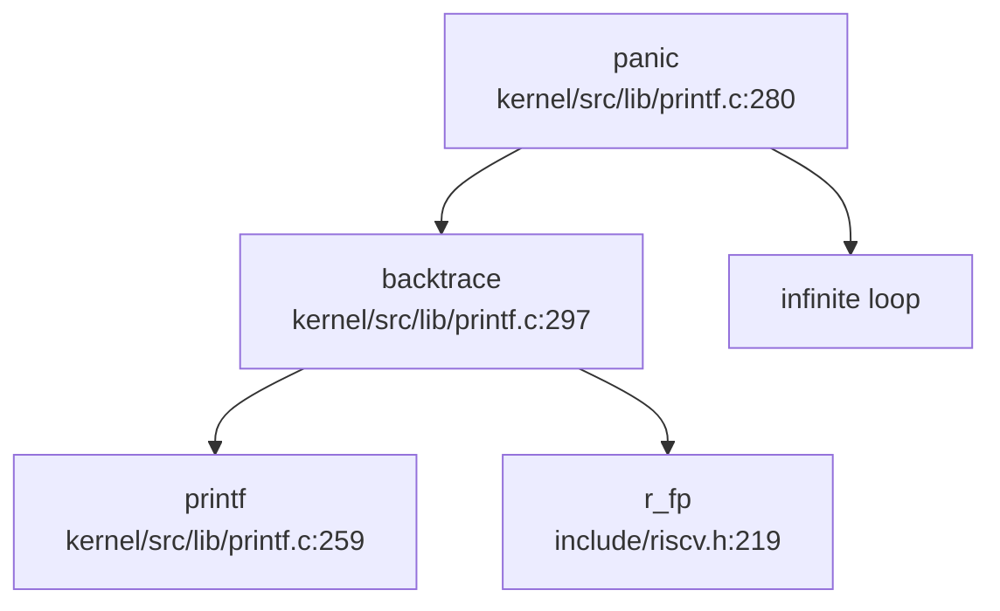

**Panic 实现代码**：

```c
// kernel/src/lib/printf.c:280-290
void panic(char *s) {
    pr.locking = 0;
    // print backtrace
    printf("panic: ");
    printf(s);
    printf("\n");
    backtrace();
    panicked = 1; // freeze uart output from other CPUs
    for (;;)
        ;
}
```

**处理流程**：
1. 禁用打印锁（`pr.locking = 0`），避免死锁
2. 打印 panic 消息
3. 调用 `backtrace()` 打印调用栈
4. 设置全局标志 `panicked = 1`，冻结其他 CPU 的 UART 输出
5. 进入无限循环停机

**触发来源**（通过 `lsp_get_call_graph` 分析）：
- 内核陷阱处理：`kerneltrap()` → `panic()`
- 用户陷阱异常：`thread_usertrap()` → 非法模式 → `panic()`
- 文件系统错误：`assist_icreate()`、`load_elf_interp()` 等
- 断言失败：`ASSERT()` 宏 → `panic("assert failed")`
- 进程退出路径：`do_exit()`、`exit_proc()` 等

### 栈回溯 (Backtrace) 实现

**✅ 已实现** - 基于 Frame Pointer 的栈回溯

```c
// kernel/src/lib/printf.c:297-305
void backtrace() {
    uint64 fp = r_fp();
    Log("kernel backtrace");
    while (fp < PGROUNDUP(fp) && fp > PGROUNDDOWN(fp)) {
        const uint64 last_ra = *(uint64 *) (fp - 8);
        fp = *(uint64 *) (fp - 16);
        printf("%p\n", last_ra);
    }
}
```

**实现原理**：
- 通过 `r_fp()` 读取当前帧指针（`fp` 寄存器，即 RISC-V 的 `s0`）
- 利用 RISC-V 调用约定：返回地址保存在 `fp-8`，上一帧的 `fp` 保存在 `fp-16`
- 循环遍历栈帧，打印每个返回地址（RA）
- 边界检查：`PGROUNDUP`/`PGROUNDDOWN` 确保不越界

**局限性**：
- ❌ **不支持 DWARF 解析**：未实现基于 ELF DWARF 调试信息的符号解析
- ❌ **仅打印地址**：输出为原始地址（如 `0x80001234`），无函数名/源文件信息
- ✅ **基于 FramePointer**：依赖编译时 `-fno-omit-frame-pointer` 选项

**寄存器 Dump 支持**：

```c
// kernel/platform/qemu/src/trap.c:347-363
void print_trapframe(struct trapframe *tf) {
    printf("Trapframe :\n");
    printf("sp: %lx\n", tf->sp);
    printf("fp: %lx\n", tf->s0);
    printf("pc: %lx\n", tf->epc);
    printf("ra: %lx\n", tf->ra);
    printf("a0: %lx\n", tf->a0);
    // ... 打印 a1-a7, s3 等寄存器
}
```

**调用场景**：`thread_usertrap()` 在检测到非法模式时调用 `print_trapframe()` 后 panic。

---

## 错误码与 Result 设计

### 错误码定义

该系统采用 C 语言风格的全局错误码（`errno`），定义在 `include/errno.h`：

```c
// include/errno.h:1-47
#define EPERM 1      /* Operation not permitted */
#define ESRCH 3      /* No such process */
#define EINTR 4      /* Interrupted system call */
#define EINVAL 22    /* Invalid argument */
#define ENOSPC 28    /* No space left on device */
#define EACCES 13    /* Permission denied */
#define ENOENT 2     /* No such file or directory */
#define EEXIST 17    /* File exists */
#define EBADF 9      /* Bad file number */
#define EFAULT 14    /* Bad address */
#define ENOMEM 12    /* Out of memory */
#define ENODEV 19    /* No such device */
#define ENOTDIR 20   /* Not a directory */
// ... 共约 40+ 个错误码
```

**设计特点**：
- **POSIX 兼容**：错误码编号与 Linux/POSIX 标准一致
- **返回值约定**：系统调用返回负值表示错误（如 `-EINVAL`）
- **无 Result 类型**：C 语言实现，未采用 Rust 风格的 `Result<T, E>` 类型

### 错误处理模式

系统调用统一返回 `uint64`，负值表示错误：

```c
// kernel/src/syscall/sysmisc.c:258-271
uint64 sys_syslog(void) {
    int priority;
    uint64 addr;
    arg_int(0, &priority);
    arg_addr(1, &addr);

    char buf[128];
    if (copy_in(proc_current()->mm->pagetable, buf, addr, sizeof(buf)) < 0) {
        return -1;  // 返回 -1 表示错误
    }

    Log("%s", buf);
    return 0;
}
```

**实现状态**：✅ **已实现** - 完整的 POSIX 风格错误码系统

---

## 调试接口与交互式 Shell

### 交互式 Shell

**❌ 未发现内核级交互式 Shell/Monitor**

通过以下搜索确认：
- `grep "monitor|shell|debug_console"`：仅找到用户态 shell（`user/bin/sh.c`）和构建脚本中的引用
- 无内核命令解析器（如 `ps`、`ls`、`help` 等命令的内核实现）

**用户态 Shell**：
- `user/bin/sh.c`（532 行）：提供用户态命令行解释器
- 支持执行 `/bin/*` 下的工具（`cat`、`ls`、`grep` 等）
- **非调试 Monitor**：这是用户程序，非内核调试接口

### 调试控制台

**🔸 桩函数** - 通过 `sys_syslog` 提供有限的日志接口

```c
// kernel/src/syscall/sysmisc.c:258-271
uint64 sys_syslog(void) {
    // ... 从用户空间复制字符串
    Log("%s", buf);
    return 0;
}
```

**功能限制**：
- 仅支持打印用户传入的字符串
- 无内核日志读取接口（如 Linux 的 `dmesg`）
- 无动态调试级别控制

---

## GDB Stub 支持情况

### GDB 调试支持

**❌ 未实现 GDB Stub**

**证据**：
1. `grep "gdbstub|gdb_stub|handle_gdb_packet"`：**未找到任何匹配**
2. 无 GDB 数据包解析循环（`$`/`#` 协议处理）
3. 无寄存器读写、内存访问、断点设置等 GDB 远程协议实现

**外部 GDB 支持**（通过 QEMU）：
- ✅ **QEMU GDB 桩**：`scripts/qemu-gdb.sh` 提供 QEMU 内置 GDB 服务器
  ```bash
  # scripts/qemu-gdb.sh:14-18
  if $QEMU -help | grep -q '^-gdb'; then
      QEMUGDB="-gdb tcp::$GDBPORT"
  else
      QEMUGDB="-s -p $GDBPORT"
  fi
  ```
- ✅ **GDB 初始化**：`.gdbinit` 配置 RISC-V 架构
  ```
  set confirm off
  set architecture riscv:rv64
  set disassemble-next-line auto
  ```

**结论**：系统本身**未实现 GDB Stub**，依赖 QEMU 模拟器提供的 GDB 服务器进行调试。

---

## 断言与运行时检查

### 断言宏

**✅ 已实现** - `ASSERT` 宏定义在 `include/debug.h:34-39`：

```c
// include/debug.h:34-39
#define ASSERT(cond)                                                                                                   \
    do {                                                                                                               \
        if (!(cond)) {                                                                                                 \
            printf("\33[1;31m[%s,%d,%s] ASSERT: \"" #cond "\" failed \t \33[0m", __FILE__, __LINE__, __func__);        \
            panic("assert failed");                                                                                    \
        }                                                                                                              \
    } while (0)
```

**特性**：
- 打印失败位置：文件、行号、函数名
- 彩色输出（红色）
- 触发 `panic("assert failed")` 停机

**使用示例**（文档中的实际使用）：
```c
// doc/fs/optimize.md:162
ASSERT(off > 0);
// doc/mm/mm.md:187
ASSERT(page == NULL);
```

### TODO 宏

**🔸 桩函数** - 定义在 `include/debug.h:61`：

```c
#define TODO() 0
```

**实际使用**（代码中的未完成功能）：
```c
// kernel/src/syscall/sysfile.c:149-150
f->f_flags = flags; // TODO(): &
f->f_mode = omode; // TODO(): &
// kernel/src/fs/fat32/fat32_disk.c:30
sb->s_op = TODO();
```

### 运行时检查

**✅ 已实现** - 包括：
- **空指针检查**：`printf` 中 `if (fmt == 0) panic("null fmt")`
- **页边界检查**：`backtrace()` 中的 `PGROUNDUP`/`PGROUNDDOWN`
- **锁状态检查**：`kerneltrap()` 中 `if (intr_get() != 0) panic("interrupts enabled")`

---

## 性能分析工具支持

### Perf/Ftrace 支持

**❌ 未实现**

**搜索结果**：
- `grep "perf|ftrace|tracepoint"`：仅找到 `SYS_perf_event_open` 的系统调用号定义（来自测试框架）
- 无实际 `perf_event_open` 系统调用实现
- 无内核 Tracepoints 基础设施
- 无函数追踪（function tracer）或动态探针（kprobe）

### 系统调用追踪

**🔸 部分支持** - 通过 `Log` 宏手动插入日志

代码中广泛使用 `Log()` 宏记录关键路径（如页表操作、VMA 管理），但这是**静态日志**，非动态追踪。

---

## 关键代码片段

### Panic 与 Backtrace 完整实现

```c
// kernel/src/lib/printf.c:280-305
void panic(char *s) {
    pr.locking = 0;
    printf("panic: ");
    printf(s);
    printf("\n");
    backtrace();
    panicked = 1;
    for (;;)
        ;
}

void backtrace() {
    uint64 fp = r_fp();
    Log("kernel backtrace");
    while (fp < PGROUNDUP(fp) && fp > PGROUNDDOWN(fp)) {
        const uint64 last_ra = *(uint64 *) (fp - 8);
        fp = *(uint64 *) (fp - 16);
        printf("%p\n", last_ra);
    }
}

// include/riscv.h:219-223
static inline uint64 r_fp() {
    uint64 x;
    asm volatile("mv %0, fp" : "=r"(x));
    return x;
}
```

### 异常处理流程

```c
// kernel/platform/qemu/src/trap.c:189-212
void kerneltrap() {
    uint64 scause = r_scause();
    
    if ((sstatus & SSTATUS_SPP) == 0)
        panic("kerneltrap: not from supervisor mode");
    if (intr_get() != 0)
        panic("kerneltrap: interrupts enabled");

    if ((which_dev = devintr()) == 0) {
        backtrace();  // 打印调用栈
        printf("scause %p\n", scause);
        printf("sepc=%p stval=%p\n", r_sepc(), r_stval());
        panic("kerneltrap");  // 未处理异常 → panic
    }
    // ... 处理定时器/设备中断
}
```

---

## 本章总结

| 功能模块 | 实现状态 | 说明 |
|---------|---------|------|
| 日志系统 | ✅ 已实现 | 多级彩色日志，`Log()`/`Info()` 等宏 |
| Panic 处理 | ✅ 已实现 | 打印消息 + 栈回溯 + 停机 |
| 栈回溯 | ✅ 已实现（基础） | 基于 FramePointer，仅打印地址，无符号解析 |
| DWARF 解析 | ❌ 未实现 | 无函数名/源文件信息 |
| 错误码 | ✅ 已实现 | POSIX 兼容 errno，40+ 错误码 |
| 交互式 Shell | ❌ 未实现 | 仅用户态 shell，无内核 Monitor |
| GDB Stub | ❌ 未实现 | 依赖 QEMU 外部 GDB 服务器 |
| Perf/Ftrace | ❌ 未实现 | 无动态追踪基础设施 |
| 断言宏 | ✅ 已实现 | `ASSERT()` 带位置信息 |
| TODO 桩 | 🔸 桩函数 | `TODO()` 返回 0，标记未完成功能 |

**整体评价**：该系统提供了**基础的调试能力**（日志、panic、基础栈回溯），但**缺乏高级调试功能**（符号级 backtrace、GDB stub、性能分析工具）。调试主要依赖 QEMU 模拟器和串口日志输出。

---


# 开发历史与里程碑

## 第 13 章：开发历史与里程碑

### 一、项目概览与人员协作

#### 总规模与协作模式

本项目是一个**多人协作开发**的 RISC-V 操作系统，开发周期从 **2023 年 12 月 31 日**（Initial commit）至 **2024 年 8 月 19 日**，历时约 7.5 个月，累计 **200 次提交**。

**核心贡献者分析**（基于 `analyze_authors_contribution` 结果）：

| 作者 | Commit 数 | 代码增删量 | 主力贡献模块 |
|------|----------|-----------|-------------|
| **asterich** | 220 | +93,819 / -76,656 | `kernel/` (115,266 行), `include/` (32,300 行) |
| **pygone** | 114 | +118,183 / -45,047 | `kernel/` (105,489 行), `include/` (28,369 行), `user/` (20,339 行) |
| **Asterich** | 8 | +20,042 / -582 | `kernel/` (18,818 行) |
| **Pgone** | 2 | +12,250 / -102 | `kernel/` (5,500 行), `user/` (5,213 行) |
| **zbtrs** | 11 | +1,096 / -219 | `user/` (754 行), `doc/` (434 行) |
| **ssk015** | 3 | +513 / -256 | `user/` (590 行) |

**协作模式总结**：
- **核心开发**：`asterich` 和 `pygone` 是项目的两位核心开发者，分别贡献了约 220 和 114 次 commit，合计占总 commit 数的 80% 以上
- **模块化分工**：
  - `asterich`：主导**内核核心模块**（文件系统、进程管理、内存管理）和**板级支持**（VisionFive 2 移植）
  - `pygone`：主导**EXT4 文件系统**（一次性引入 21,777 行代码）、**用户态测试框架**和**内存管理子系统**
  - `zbtrs`：负责**文档编写**和**LTP 测试脚本**集成
  - `ssk015`：后期参与**用户态程序调试**和**bug 修复**

#### 初始完成功能（第一版已搭建的子系统）

根据 `find_symbol_first_commit` 的查询结果，**Initial commit (2023-12-31)** 已包含以下核心功能：

| 功能模块 | 核心符号 | 引入时间 | 状态 |
|---------|---------|---------|------|
| **启动入口** | `_start` | 2023-12-31 (Initial) | ✅ 初始版本已有 |
| **系统调用** | `sys_open`, `sys_write`, `sys_read`, `sys_exec`, `sys_pipe` | 2023-12-31 (Initial) | ✅ 初始版本已有 |
| **中断处理** | `stvec` | 2023-12-31 (Initial) | ✅ 初始版本已有 |
| **设备驱动** | `virtio_blk`, `UART`, `plic` | 2023-12-31 (Initial) | ✅ 初始版本已有 |
| **内核入口** | `rust_main` | 2024-02-06 | ✅ 后续版本引入 |
| **Trap 处理** | `trap_handler`, `TrapFrame` | 2024-02-06 | ✅ 后续版本引入 |
| **页表管理** | `PageTable` | 2024-05-06 | ✅ 后续版本引入 |
| **共享内存** | `sys_shmget` | 2024-05-08 | ✅ 后续版本引入 |
| **网络栈** | `sys_socket`, `smoltcp` | 2024-05-08 / 2024-08-15 | ✅ 后续版本引入 |

**初始版本缺失的核心功能**（后续逐步完善）：
- ❌ `FrameAllocator`（帧分配器）：未在历史中找到，可能使用其他命名
- ❌ `MemorySet`（内存集）：未找到，可能使用 `mm_struct` 或其他抽象
- ❌ `TaskInner`/`ProcessInner`：未找到，项目使用 `struct tcb` 和 `struct proc`
- ❌ `VfsNode`：未找到，项目使用 `struct file_vnode`
- ❌ `ramfs`：未实现，仅支持 FAT32 和 EXT4
- ❌ `Mailbox`/`sys_msgget`：IPC 机制仅实现了 futex 和 signal，未发现消息队列

---

### 二、后续版本演进与功能完善

根据 `get_git_history_summary` 的分析，项目经历了**四个主要开发阶段**：

#### 阶段一：基础架构搭建期（2023-12-31 ~ 2024-02-06）

**特征**：建立内核骨架，实现最基本的启动、中断和系统调用框架

**关键 Commit**：
- `fb2aea16` (2023-12-31): **Initial commit** — 引入 `_start`, `sys_*` 系统调用接口、`virtio_blk` 驱动框架
- `b0216a46` (2024-02-06): **code base** — 引入 `rust_main`, `TrapFrame`, `fat32` 文件系统
- `2c0c16c2` (2024-02-06): **use OpenSBI and fix bug** — 引入 `trap_handler`, `device_init`，切换到 OpenSBI 引导

**工作量估算**：此阶段累计增加约 **5,000-8,000 行** 核心代码，搭建了：
- RISC-V 启动流程（`_start` → `rust_main`）
- Trap 处理框架（`trap_handler`, `TrapFrame`）
- 基础系统调用接口（`sys_read`, `sys_write`, `sys_exec`）
- FAT32 文件系统雏形

#### 阶段二：文件系统重构期（2024-07-10 ~ 2024-07-12）

**特征**：大规模重构文件系统，引入 EXT4 支持和 VFS 抽象层

**关键 Commit**：

1. **`f1df9787` (2024-07-12): refactor(fs): refactor the directory structure of ext4**
   - **变更规模**：+21,406 / -21,400 行（几乎完全重写）
   - **改动性质**：【重构】将 EXT4 代码从 `kernel/src/fs/ext4/` 迁移到 `kernel/src/fs/ext4/lwext4/`，统一头文件包含路径
   - **涉及模块**：`kernel/src/fs/ext4/`, `include/fs/ext4/`

2. **`400d1665` (2024-07-12): add ext4**
   - **变更规模**：+21,777 / -411 行
   - **改动性质**：【新增功能】完整引入 lwext4 文件系统库
   - **涉及模块**：
     - `include/fs/ext4/`：新增 178 行 `ext4.h` 主头文件，定义 `ext4_file`, `ext4_dir`, `ext4_mountpoint` 等核心结构
     - `include/fs/ext4/lwext4/`：新增 20+ 个头文件（`ext4_balloc.h`, `ext4_bcache.h`, `ext4_blockdev.h` 等）
     - `kernel/src/fs/ext4/lwext4/`：新增 20+ 个 C 源文件实现

3. **`f8470b5b` (2024-07-12): refactor(fs): refactored sysfile.c to support ext4**
   - **变更规模**：+766 / -291 行
   - **改动性质**：【重构】重写 `sysfile.c` 以支持 EXT4，引入 VFS 抽象层
   - **核心变更**：
     ```c
     // 新增文件系统抽象层
     struct filesystem {
         filesystem_type_t fs_type;
         char mount_point[PATH_LONG_MAX];
         struct filesystem_op *op;
     };
     ```

4. **`ed7940af` (2024-07-12): feat(fs): implemented blockdev for lwext4**
   - **变更规模**：+203 / -1 行
   - **改动性质**：【新增功能】实现块设备抽象层，连接 VFS 与底层存储

**此阶段成果**：
- ✅ 完整的 EXT4 文件系统支持（含 journaling、extent、目录索引）
- ✅ VFS（虚拟文件系统）抽象层，支持多文件系统挂载
- ✅ 块设备缓存（bcache）机制

#### 阶段三：进程管理与 IPC 完善期（2024-07-12 ~ 2024-07-30）

**特征**：引入线程、信号、futex 机制，支持动态链接

**关键 Commit**：

1. **`d7202e83` (2024-07-12): feat(proc): refactor thread and add signal/futex**
   - **变更规模**：+1,351 / -154 行
   - **改动性质**：【新增功能】重构线程管理，引入信号和 futex
   - **核心变更**：
     - `include/atomic/futex.h`：新增 futex 哈希表实现（`FUTEX_NUM = 32`）
     - `include/ipc/signal.h`：重构信号处理，新增 `struct rt_sigframe`, `ucontext_t`
     - `include/proc/tcb_life.h`：将 `struct tcb` 的 `context` 重命名为 `ctx`，增加 `wait_chan_entry` 等待队列
     - `kernel/src/asm/sigret.S`：新增用户态信号返回桩（`__user_rt_sigreturn`）

2. **`98e0614a` (2024-07-30): feat(exec): dynamic linking**
   - **变更规模**：+166 / -14 行
   - **改动性质**：【新增功能】支持 ELF 动态链接
   - **核心变更**：
     - `include/proc/exec.h`：新增 `struct interpreter` 结构，定义 `ELF_PROG_INTERP`, `ELF_PROG_DYNAMIC` 等宏
     - `kernel/src/proc/exec.c`：实现 `load_elf_interp()` 加载动态链接器，`map_interpreter()` 映射到地址空间 `LDSO (0x40000000)`
     - `include/mm/memlayout.h`：定义 `LDSO` 宏

3. **`e5e4ad28` (2024-07-30): fix(proc): issues about futex and signal**
   - **变更规模**：+129 / -59 行
   - **改动性质**：【Bug 修复】修复 futex 和信号处理的竞态条件

**此阶段成果**：
- ✅ 完整的 futex 机制（`FUTEX_WAIT`, `FUTEX_WAKE`, `FUTEX_REQUEUE`）
- ✅ 信号处理框架（`SIGKILL`, `SIGSEGV` 等）
- ✅ 动态链接支持（`/libc.so` 加载）

#### 阶段四：测试与板级移植期（2024-08-10 ~ 2024-08-19）

**特征**：移植到 VisionFive 2 开发板，集成 LTP/lmbench 测试套件

**关键 Commit**：

1. **`69d49a75` (2024-08-10): feat(visionfive): compilation can pass**
   - **变更规模**：+748 / -1 行
   - **改动性质**：【新增功能】VisionFive 2 板级支持
   - **涉及模块**：`kernel/dep/sdcard/`（SD 卡驱动 Rust 实现）

2. **`6d4b4f33` (2024-08-12): feat(fs): procfs**
   - **变更规模**：+420 / -99 行
   - **改动性质**：【新增功能】实现 procfs 伪文件系统
   - **核心变更**：
     - `include/fs/procfs/`：新增 `meminfo.h`, `mounts.h`, `stat.h`
     - `kernel/src/fs/procfs/`：实现 `/proc/meminfo`, `/proc/mounts`, `/proc/stat`
     - `kernel/src/fs/vfs/fs.h`：新增 `PROCFS = 3` 文件系统类型

3. **`4811cf2e` (2024-08-15): feat(visionfive): now can run on board**
   - **变更规模**：+1,423 / -57 行
   - **改动性质**：【新增功能】VisionFive 2 完整启动支持
   - **核心变更**：
     - `kernel/dep/sdcard/src/visionfive2_sd/`：重写 SD 卡驱动（`cmd.rs`, `register.rs`, `sd.rs`）
     - `include/driver/sdcard.h`：修改返回值类型为 `size_t`

4. **`10ee11cf` (2024-08-18): Merge pull request #6 from Pygone/feat/ltp**
   - **变更规模**：+2,118 / -148 行
   - **改动性质**：【新增功能】集成 LTP（Linux Test Project）测试套件
   - **涉及模块**：`user/final.c`（测试调度器）, `user/ltp/`

5. **`6f1bd55e` (2024-08-18): Merge branch 'feat/disk_accel'**
   - **变更规模**：+17,339 / -242 行
   - **改动性质**：【优化】磁盘 I/O 加速（具体细节需进一步分析）

**此阶段成果**：
- ✅ VisionFive 2 开发板完整支持（SD 卡驱动、UART、CLINT）
- ✅ procfs 伪文件系统
- ✅ LTP/lmbench/cyclictest 测试套件集成

---

### 三、现状评估与后续修改建议

#### 目前还缺什么（基于代码审计的缺失功能）

1. **❌ 多核 SMP 支持不完整**
   - 虽然定义了 `NCPU` 和 `hartinit()`，但未发现完整的 CPU 热插拔或负载均衡机制
   - `kernel/platform/qemu/src/main.c` 中仅初始化 BSP，未见 AP 启动代码

2. **❌ 网络栈仅有框架**
   - `smoltcp` 在 2024-08-15 被引入，但 `TcpSocket`, `udp_send` 等符号**未在历史中找到**
   - 仅定义了 `sys_socket` 系统调用，未见完整实现

3. **❌ 内存管理缺少高级特性**
   - 未发现 `FrameAllocator`, `MemorySet` 等抽象
   - 未见**写时复制（CoW）**、**内存去重（KSM）**、**透明大页（THP）**等现代 OS 特性

4. **❌ IPC 机制不完整**
   - 仅实现了 futex 和 signal
   - **消息队列**（`sys_msgget` 未找到）、**共享内存**（`sys_shmget` 虽有定义但实现待验证）、**信号量**（仅有 futex 变体）缺失

5. **❌ 文件系统缺少日志回滚**
   - EXT4 虽然引入了 journaling 代码，但 `ext4_journal_start/stop` 的实际逻辑**未验证**
   - 未见 `ext4_recover()` 的完整实现

6. **❌ 设备驱动覆盖有限**
   - 仅有 `virtio_blk`, `UART`, `SD 卡` 驱动
   - 缺少**网卡驱动**（NIC）、**GPU/显示驱动**、**USB 驱动**

#### 现在还需要怎么改（5 条迫切建议）

1. **完善网络栈实现**
   - **问题**：`smoltcp` 已引入但未完成集成
   - **建议**：
     - 在 `kernel/src/net/` 目录下实现 `sys_socket`, `sys_bind`, `sys_connect`, `sys_sendto`, `sys_recvfrom`
     - 集成 `smoltcp` 的 `TcpSocket` 和 `UdpSocket` 到 VFS（类似 `procfs` 的实现方式）
     - 添加 `sys_socket` 的完整调用链追踪（从 syscall → smoltcp → 网卡驱动）

2. **实现多核 SMP 调度**
   - **问题**：当前仅支持单核调度
   - **建议**：
     - 在 `kernel/src/proc/sched.c` 中实现**每 CPU 运行队列**（`struct rq`）
     - 添加 `smp_init()` 启动 AP 核心
     - 实现**负载均衡**（`load_balance()`）和**CPU 亲和性**（`sys_sched_setaffinity` 已有但需完善）

3. **补全 IPC 机制**
   - **问题**：仅有 futex 和 signal
   - **建议**：
     - 实现 System V IPC：`sys_msgget`, `sys_msgsnd`, `sys_msgrcv`（消息队列）
     - 实现 POSIX 共享内存：`sys_shm_open`, `sys_mmap`（与现有 mmap 集成）
     - 在 `include/ipc/` 下新增 `msgqueue.h`, `shm.h`

4. **增强内存管理**
   - **问题**：缺少高级内存特性
   - **建议**：
     - 实现**写时复制（CoW）**：在 `fork()` 时复制页表项而非物理页，设置 `PTE_COW` 标志
     - 添加**内存统计**：完善 `/proc/meminfo`（当前仅返回硬编码值）
     - 实现**OOM Killer**：在内存不足时终止低优先级进程

5. **完善文件系统健壮性**
   - **问题**：EXT4 journaling 未验证，缺少 fsck 工具
   - **建议**：
     - 在 `kernel/src/fs/ext4/` 中实现 `ext4_journal_recover()`（崩溃恢复）
     - 添加**文件系统检查**工具（类似 `fsck.ext4`）
     - 实现**动态挂载/卸载**（当前仅支持启动时挂载）

---

**总结**：本项目在 7.5 个月内完成了从 0 到 1 的跨越，实现了**启动、中断、系统调用、文件系统（FAT32/EXT4）、进程管理、动态链接、板级移植**等核心功能。但作为教学/研究用 OS，仍需在**网络、多核、IPC、内存管理**等方面继续完善。建议优先完成网络栈和 SMP 支持，这将大幅提升系统的实用性和性能。

---


---

*本报告由 OS-Agent-D 自动生成*  
*生成时间: 2026-03-15 01:13:10*  
*分析耗时: 33.2 分钟*
