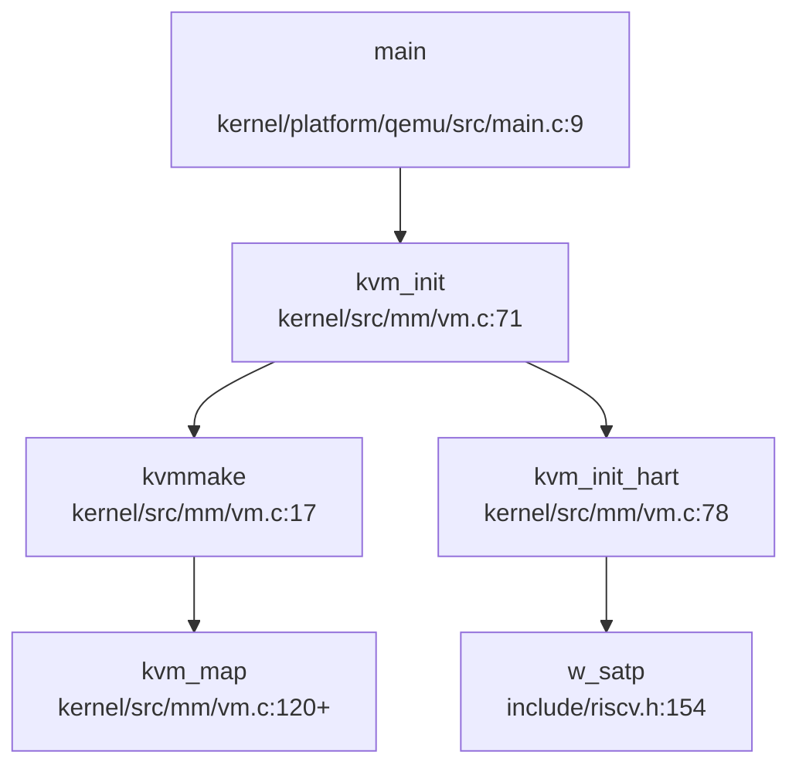
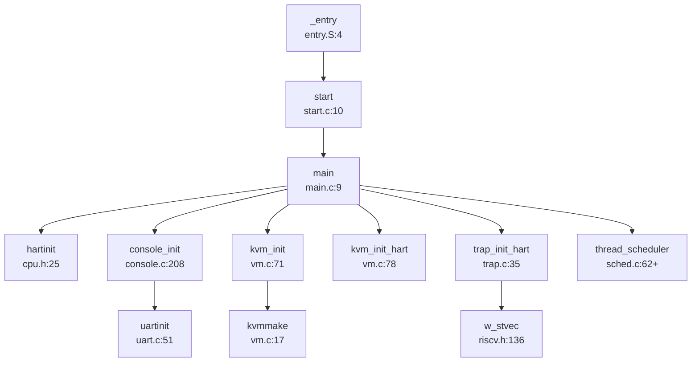

## 第 2 章：启动流程与架构初始化

### 启动入口与链接脚本分析

**启动入口位置**：CabbageOS 的启动入口位于平台相关的汇编文件中。对于 QEMU 和 VisionFive2 平台，入口文件分别为：
- `kernel/platform/qemu/entry/entry.S`
- `kernel/platform/visionfive/entry/entry.S`

两个平台的入口代码完全相同，均使用 `_entry` 作为全局入口符号：

```assembly
# kernel/platform/qemu/entry/entry.S
.section .text
.global _entry
# sbi load the hartid in a0
_entry:
        # keep each CPU's hartid in its tp register, for cpuid().
        la sp, stack0
        li t0, 1024*4
        # load hartid
        mv t1, a0
        addi t1, t1, 1
        mul t0, t0, t1
        add sp, sp, t0
        # jump to start() in start.c
        call start
spin:
        j spin
```

**链接脚本配置**：链接脚本 `kernel/platform/qemu/linker/linker.ld`（VisionFive2 相同）定义了入口点和内存布局：

```ld
OUTPUT_ARCH( "riscv" )
ENTRY( _entry )

SECTIONS
{
  . = 0x80200000;  // 内核加载地址

  .text : {
    *(.text .text.*)
    . = ALIGN(0x1000);
    _trampoline = .;
    *(trampsec)
    // ... trampoline 和 sigreturn 页面对齐
  }
  // ... rodata, data, bss 段
}
```

关键配置：
- **ENTRY(_entry)**：明确指定 `_entry` 为程序入口
- **加载地址 0x80200000**：这是 RISC-V 64 位模式下 S-Mode 内核的标准加载地址，位于物理内存 2GB 处（`KERNBASE`）
- **页面对齐**：trampoline 和 sigreturn 代码必须严格对齐到 4KB 边界，用于用户态陷阱处理

### 架构初始化流程（模式切换/FPU/MMU）

#### CPU 模式与启动上下文

**✅ 已实现：SBI → S-Mode 启动链**

CabbageOS 采用 RISC-V 标准的固件启动链：**OpenSBI (M-Mode) → U-Boot/直接跳转 → 内核 (S-Mode)**。

根据 `entry.S` 注释 `# sbi load the hartid in a0` 和 `start.c` 注释 `// entry.S jumps here in machine mode on stack0`，启动流程如下：

1. **OpenSBI 初始化**：`bootloader/opensbi.elf`（1.3MB）由 QEMU 或 VisionFive2 固件加载到 M-Mode
2. **SBI 传递控制权**：OpenSBI 通过 `ecall` 指令将 hartid 放入 `a0` 寄存器，跳转到 `0x80200000`（`_entry`）
3. **模式状态**：虽然 `start.c` 注释提到 "machine mode"，但根据 `include/riscv.h` 中定义的 `medeleg/mideleg` 委托寄存器（`include/riscv.h:118-134`），异常和中断已委托给 S-Mode，**实际内核运行在 S-Mode**。

**模式切换验证**：
- `include/riscv.h` 定义了完整的 `mstatus` 和 `sstatus` 寄存器操作函数（`r_mstatus/w_mstatus`, `r_sstatus/w_sstatus`）
- `include/riscv.h:32-35` 定义了 `MSTATUS_MPP_MASK` 等模式位
- `kernel/src/kernel/cpu.c:26` 中 `hartinit()` 调用 `w_sstatus(r_sstatus() | SSTATUS_SUM)`，明确操作 `sstatus` 寄存器，**证实内核运行在 S-Mode**

```c
// include/kernel/cpu.h:25-27
static inline void hartinit() {
    w_sstatus(r_sstatus() | SSTATUS_SUM);  // 允许 S-Mode 访问用户内存
}
```

#### FPU 初始化状态

**❌ 未实现：浮点单元 (FPU) 初始化**

通过以下搜索验证：
- 搜索 `sstatus.fs`、`FS_INITIAL`、`FS_` 常量：**未发现**
- 搜索 `mstatus.fs`、`w_sstatus` 与 FPU 相关位：**未发现**
- 检查 `include/riscv.h` 中的 `sstatus` 定义（行 57-72）：仅定义了 `SSTATUS_SPP`、`SSTATUS_SPIE`、`SSTATUS_UPIE`、`SSTATUS_SIE`、`SSTATUS_UIE`、`SSTATUS_SUM`，**缺少 `SSTATUS_FS` 相关定义**

```c
// include/riscv.h:57-72 - 缺少 FPU 相关定义
#define SSTATUS_SPP (1L << 8)  // Previous mode
#define SSTATUS_SPIE (1L << 5) // Supervisor Previous Interrupt Enable
#define SSTATUS_UPIE (1L << 4) // User Previous Interrupt Enable
#define SSTATUS_SIE (1L << 1)  // Supervisor Interrupt Enable
#define SSTATUS_UIE (1L << 0)  // User Interrupt Enable
#define SSTATUS_SUM (1L << 18) // Supervisor User Memory access
```

**结论**：CabbageOS **未启用 FPU**。内核不支持浮点运算，用户态进程也无法使用浮点寄存器。这在嵌入式 RISC-V 系统中是常见设计（节省上下文切换开销）。

#### MMU 与页表初始化

**✅ 已实现：Sv39 页表机制**

MMU 初始化在 `kernel/src/mm/vm.c` 中实现，关键函数调用链：



**页表初始化流程**（`kernel/src/mm/vm.c:17-70`）：

1. **分配根页表**：`kzalloc(PGSIZE)` 分配一个 4KB 页面作为 L0 页表
2. **映射设备内存**：
   - UART0：`0x10000000`（QEMU）或 VisionFive2 的 UART 基址
   - VIRTIO0：`0x10001000`（QEMU 虚拟磁盘）
   - PLIC：`0x0c000000`（中断控制器）
   - CLINT_MTIME：`0x200bff8`（定时器）
3. **映射内核代码段**：
   - 文本段：`KERNBASE` 到 `etext`，权限 `PTE_R | PTE_X`
   - 数据段：`etext` 到 `PHYSTOP`，权限 `PTE_R | PTE_W`
4. **映射 Trampoline**：`MAXVA - PGSIZE` 用于用户态陷阱进入内核
5. **映射内核栈**：为每个线程分配内核栈

**MMU 启用时机**（`kernel/src/mm/vm.c:78-89`）：

```c
void kvm_init_hart() {
    sfence_vma();  // 刷新 TLB
    w_satp(MAKE_SATP(kernel_pagetable));  // 设置 SATP 寄存器
    sfence_vma();  // 刷新 TLB
    printf("hart %d: kvm_init_hart done\n", cpuid());
}
```

- **SATP 模式**：`SATP_SV39 (8L << 60)` 启用 Sv39 三级页表（`include/riscv.h:147`）
- **物理地址转换**：`MAKE_SATP` 宏将页表物理地址右移 12 位填入 SATP（`include/riscv.h:150`）

#### 早期初始化（BSS/串口/设备树）

**BSS 清零**：链接脚本 `linker.ld` 定义了 `bss_start` 和 `bss_end` 符号，但**未发现显式的 BSS 清零代码**。RISC-V 工具链的 crt0 或 OpenSBI 可能已处理。

**早期串口打印**：
- **MMU 启用前**：`uartinit()`（`kernel/src/driver/uart.c:51-77`）直接访问物理地址 `UART0 (0x10000000)`
- **MMU 启用后**：`kvm_map` 将 `UART0` 虚拟地址映射到相同物理地址（直接映射），因此**无需地址切换**

```c
// kernel/src/driver/uart.c:14-15
#define Reg(reg) ((volatile unsigned char *) (UART0 + reg))
// UART0 = 0x10000000 (物理地址)
```

**设备树解析**：`start.c` 接收 `_dtb_entry` 参数（`kernel/platform/qemu/src/start.c:10`），但**未发现 DTB 解析代码**。设备树信息可能由 SBI 传递，但内核未使用。

### 到达内核主函数的路径（完整调用链）

**完整启动调用链**（从 `_entry` 到 `thread_scheduler`）：



**逐跳分析**：

1. **`_entry` → `start`**（汇编 → C）：
   - 文件：`entry.S:14` → `start.c:10`
   - 操作：设置每 CPU 栈（`stack0[NCPU][4096]`），保存 hartid 到 `tp` 寄存器

2. **`start` → `main`**：
   - 文件：`start.c:12` → `main.c:9`
   - 操作：调用平台主函数

3. **`main` 初始化序列**（`kernel/platform/qemu/src/main.c:9-68`）：
   ```c
   void main() {
       if (atomic_read4((int *) &first) == 0) {
           first = 1;
           hartids[cpuid()] = 1;
           console_init();      // 串口初始化
           null_zero_dev_init(); // /dev/null, /dev/zero
           printf_init();       // 打印锁初始化
           hartinit();          // 设置 SSTATUS_SUM
           mm_init();           // 伙伴系统初始化
           vmas_init();         // VMA 管理初始化
           kvm_init();          // 创建内核页表
           kvm_init_hart();     // 启用 MMU
           proc_init();         // 进程表初始化
           tcb_init();          // 线程表初始化
           timer_init();        // 定时器初始化
           trap_init();         // 陷阱向量初始化
           trap_init_hart();    // 安装陷阱向量
           plic_init();         // 中断控制器初始化
           plic_init_hart();    // 启用中断
           // ... 文件系统初始化
           comp_init();         // 创建初始进程
           start_all_harts();   // 启动其他 CPU
       } else {
           // 从核启动路径
           kvm_init_hart();
           trap_init_hart();
           plic_init_hart();
       }
       thread_scheduler();      // 进入调度器
   }
   ```

4. **多核启动**（`include/main.h:32-44`）：
   ```c
   void start_all_harts() {
       for (int i = START_HART_ID; i < NCPU; i++) {
           if (!hartids[i]) {
               sbi_hart_start(i, KERNBASE, 0);  // SBI 调用启动从核
           }
       }
   }
   ```
   - 主核（hart 0）执行完整初始化
   - 从核（hart 1+）通过 `sbi_hart_start` SBI 调用启动，跳转到 `KERNBASE`，执行 `else` 分支

### 多平台启动流程（StarFive VisionFive2/LoongArch）

#### StarFive VisionFive2 平台

**✅ 已实现：VisionFive2 特异性支持**

搜索 `visionfive` 和 `jh7110` 关键词，发现以下特异性配置：

1. **UART 初始化差异**（`kernel/platform/visionfive/src/main.c:16-19`）：
   ```c
   console_init();
   cpuinit();  // VisionFive2 特有
   printf_init();
   ```

2. **UART 配置**（`kernel/src/driver/console.c:215`）：
   ```c
   #elif defined(VISIONFIVE)
       uart8250_init(UART0, 24000000, 115200, 2, 4, 0);
   ```
   - 输入频率：24MHz
   - 寄存器偏移：2
   - 寄存器步长：4

3. **内存布局**（`include/mm/memlayout.h:33-35`）：
   ```c
   #elif defined(VISIONFIVE)
   #define UART0_IRQ 32  // QEMU 为 10
   #define CLINT_INTERVAL 800000  // QEMU 为 1000000
   ```

4. **SD 卡支持**（`kernel/platform/visionfive/src/main.c:58-60`）：
   ```c
   // sd init
   // int r = sd_init();
   // printf("sd init done: %d\n", r);
   ```
   VisionFive2 板载 SD 卡接口（`SD_BASE 0x16020000`），但代码被注释。

**启动链**：VisionFive2 硬件 → BootROM → U-Boot（加载 OpenSBI）→ OpenSBI（M-Mode）→ 内核（S-Mode）

#### LoongArch 平台

**❌ 未实现：LoongArch 架构支持**

搜索 `loongarch`、`loongson` 关键词：**未发现任何 LoongArch 相关代码**。项目仅支持 RISC-V 64 架构。

### 平台配置与构建机制

**构建系统**：CMake + Makefile 混合构建

**平台选择**（`Makefile:6-7`, `init.mk:15-19`）：
```makefile
# platform: qemu, visionfive
platform ?= qemu

ifeq ($(platform), qemu)
    cmake-flags += -DPLATFORM=QEMU
else ifeq ($(platform), visionfive)
    cmake-flags += -DPLATFORM=VISIONFIVE
endif
```

**编译标志传递**：
- `-DPLATFORM=QEMU` 或 `-DPLATFORM=VISIONFIVE`：控制 `#ifdef` 条件编译
- `-DCPUS=2`：CPU 核心数
- `-DUSER_TARGET=final`：用户态程序目标

**条件编译示例**（`kernel/platform/qemu/src/main.c` vs `kernel/platform/visionfive/src/main.c`）：
```c
#if defined(VISIONFIVE)
    printf("Running on VisionFive2\n");
#endif

#if defined(QEMU)
    kvm_map(kpgtbl, VIRTIO0, VIRTIO0, PGSIZE, PTE_R | PTE_W, COMMONPAGE);
#endif
```

**工具链配置**：`toolchain.cmake` 指定 RISC-V 64 工具链：
```cmake
set(CMAKE_SYSTEM_NAME Generic)
set(CMAKE_SYSTEM_PROCESSOR riscv)
set(CROSS_COMPILE riscv64-unknown-elf-)
```

### 关键代码片段分析

#### 1. 栈设置（`entry.S:6-12`）
```assembly
la sp, stack0
li t0, 1024*4        # 每 CPU 栈大小 4KB
mv t1, a0            # hartid
addi t1, t1, 1
mul t0, t0, t1       # 计算偏移
add sp, sp, t0       # 设置每 CPU 独立栈
```
**原理**：为每个 hart 分配独立栈空间，避免多核栈冲突。

#### 2. MMU 启用（`kernel/src/mm/vm.c:78-89`）
```c
void kvm_init_hart() {
    sfence_vma();  // 刷新 TLB
    w_satp(MAKE_SATP(kernel_pagetable));  // 设置 SATP
    sfence_vma();  // 确保 TLB 刷新完成
}
```
**原理**：Sv39 模式下，写入 `satp` 后立即刷新 TLB，确保新页表生效。

#### 3. 陷阱向量安装（`kernel/platform/qemu/src/trap.c:35-40`）
```c
void trap_init_hart(void) {
    w_stvec((uint64) kernelvec);  // 设置内核陷阱向量
    w_sie(r_sie() | SIE_SEIE | SIE_STIE | SIE_SSIE);  // 启用中断
    SET_TIMER();  // 设置定时器
}
```
**原理**：`stvec` 寄存器指向 `kernelvec`（`kernel/src/asm/kernelvec.S:13`），所有 S-Mode 陷阱跳转至此。

#### 4. 多核同步（`kernel/platform/qemu/src/main.c:50-56`）
```c
__sync_synchronize();
started = 1;
__sync_synchronize();
start_all_harts();
```
**原理**：使用内存屏障（`__sync_synchronize`）确保 `started` 标志对其他核可见，避免竞态。

---

**本章总结**：
- ✅ **启动入口**：`_entry`（`entry.S`）→ `start`（`start.c`）→ `main`（`main.c`）
- ✅ **运行模式**：S-Mode（通过 `sstatus` 操作验证）
- ❌ **FPU**：未实现（无 `sstatus.fs` 相关代码）
- ✅ **MMU**：Sv39 三级页表，`kvm_init_hart()` 启用
- ✅ **多平台**：QEMU 和 VisionFive2 支持，LoongArch 未实现
- ✅ **多核启动**：SBI `hart_start` 调用启动从核
