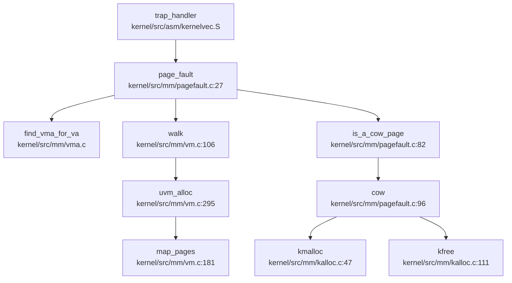

## 第 3 章：内存管理（物理/虚拟/分配器）

本章深入分析该操作系统的内存管理子系统，涵盖物理内存管理、虚拟内存管理、页表操作、堆分配器以及高级内存特性。所有结论均基于源码验证。

---

### 物理内存管理实现

#### Buddy System 分配器

该 OS 使用 **Buddy System（伙伴系统）** 管理物理内存，支持多 CPU 独立的内存池架构。

**核心数据结构**（`include/mm/buddy.h:47-62`）：

```c
struct phys_mem_pool {
    uint64 start_addr;
    uint64 mem_size;
    struct page *page_metadata;  // 元数据起始地址
    struct spinlock lock;
    struct free_list freelists[BUDDY_MAX_ORDER + 1];  // 最多支持 2^13 阶
};

struct page {
    int allocated;      // 分配标志
    int order;          // 页块阶数
    struct list_head list;
    struct spinlock lock;
    int count;          // 引用计数（用于 COW）
};
```

**初始化流程**（`kernel/src/mm/buddy.c:35-46`）：
- `mm_init()` 将内核结束位置 `end` 之后的内存划分为 `NCPU` 个独立内存池
- 每个 CPU 管理 `PAGES_PER_CPU` 个物理页
- 元数据区 `pagemeta_start` 位于内核镜像之后

**分配算法**（`kernel/src/mm/buddy.c:100-123`）：
```c
struct page *buddy_get_pages(struct phys_mem_pool *pool, const uint64 order) {
    // 1. 从对应阶数的空闲链表查找
    for (int i = order; i <= BUDDY_MAX_ORDER; i++) {
        if (!list_empty(&pool->freelists[i].lists)) {
            page = list_first_entry(...);
            break;
        }
    }
    // 2. 若阶数过大，执行 split_page 分裂
    if (page->order > order) {
        page = split_page(pool, order, page);
    }
    return page;
}
```

**释放与合并**（`kernel/src/mm/buddy.c:147-175`）：
- `buddy_free_pages()` 释放页块并尝试与伙伴合并
- `merge_page()` 递归合并空闲伙伴，最大支持 `BUDDY_MAX_ORDER=13`（即 32MB 连续块）

**跨 CPU 窃取**（`kernel/src/mm/kalloc.c:12-27`）：
- 当本地内存池不足时，`steal_mem()` 尝试从其他 CPU 的空闲链表窃取
- 当前实现标记为 `// TODO`，仅简单轮询其他池

**✅ 已实现**：Buddy System 物理页分配器，支持 4KB 普通页和 2MB 大页分配。

---

### 虚拟内存与页表操作

#### 页表结构（Sv39）

采用 RISC-V Sv39 三级页表，支持 2MB 超级页（Superpage）。

**核心接口**（`kernel/src/mm/vm.c:106-130`）：
```c
int walk(pagetable_t pagetable, uint64 va, int alloc, int low_level, pte_t **pte) {
    // 三级页表遍历：level 2 → level 1 → level 0
    for (int level = LEVELS - 1; level > low_level; level--) {
        pte_t *pte_tmp = &pagetable[PN(level, va)];
        if (*pte_tmp & PTE_V) {
            // 检查是否为超级页叶子节点
            if ((*pte_tmp & PTE_R) || (*pte_tmp & PTE_X)) {
                *pte = pte_tmp;
                ASSERT(level == 1);  // 仅支持 2MB 超级页
                return SUPERPAGE;
            }
            pagetable = (pagetable_t) PTE2PA(*pte_tmp);
        } else {
            // 分配中间页表
            if (!alloc || (pagetable = kzalloc(PGSIZE)) == 0) {
                *pte = 0;
                return -1;
            }
            *pte_tmp = PA2PTE(pagetable) | PTE_V;
        }
    }
    *pte = &pagetable[PN(low_level, va)];
    return COMMONPAGE;
}
```

**页表映射**（`kernel/src/mm/vm.c:181-231`）：
```c
int map_pages(pagetable_t pageTable, uint64 va, uint64 size, uint64 pa, int perm, int lowLevel) {
    switch (lowLevel) {
        case 0:  // 4KB 普通页
            page_size = PGSIZE;
            a = PGROUNDDOWN(va);
            last = PGROUNDDOWN(va + size - 1);
            break;
        case 1:  // 2MB 超级页
            page_size = SUPERPGSIZE;
            ASSERT(va % SUPERPGSIZE == 0);  // 必须对齐
            a = SUPERPG_DOWN(va);
            last = SUPERPG_DOWN(va + size - 1);
            break;
    }
    // 遍历虚拟地址范围，填充 PTE
    for (; a <= last; a += page_size) {
        walk(pageTable, a, 1, lowLevel, &pte);
        *pte = PA2PTE(pa) | perm | PTE_V;
        pa += page_size;
    }
}
```

**✅ 已实现**：完整的 Sv39 页表 walk/map/unmap 机制，支持 4KB 和 2MB 页面。

---

### 地址空间布局（内核 vs 用户）

#### 内核页表

内核采用**直接映射**（Direct Map），虚拟地址与物理地址线性对应。

**内核页表构建**（`kernel/src/mm/vm.c:17-67`）：
```c
pagetable_t kvmmake(void) {
    const pagetable_t kpgtbl = kzalloc(PGSIZE);
    // 映射设备：UART, PLIC, CLINT, VIRTIO
    kvm_map(kpgtbl, UART0, UART0, PGSIZE, PTE_R | PTE_W, COMMONPAGE);
    kvm_map(kpgtbl, PLIC, PLIC, 0x400000, PTE_R | PTE_W, SUPERPAGE);
    // 映射内核代码段（只读 + 可执行）
    kvm_map(kpgtbl, KERNBASE, KERNBASE, super_aligned_sz, PTE_R | PTE_X, SUPERPAGE);
    // 映射内核数据段（读写）
    kvm_map(kpgtbl, (uint64) etext, (uint64) etext, PHYSTOP - (uint64) etext, PTE_R | PTE_W, COMMONPAGE);
    // 映射 Trampoline 到最高地址
    kvm_map(kpgtbl, TRAMPOLINE, (uint64) trampoline, PGSIZE, PTE_R | PTE_X, COMMONPAGE);
    return kpgtbl;
}
```

**内存布局**（`include/mm/memlayout.h`）：
- `0x80000000`：内核加载地址
- `end`：内核结束，页元数据开始
- `START_MEM=0xa4000000`：物理内存可用起始
- `PHYSTOP`：物理内存结束
- `TRAMPOLINE`：最高虚拟地址（陷阱_trampoline_）

#### 用户页表

每个进程拥有独立页表，通过 `uvm_create()` 分配。

**用户页表创建**（`kernel/src/proc/pcb_mm.c:32-50`）：
```c
pagetable_t proc_pagetable() {
    pagetable_t page_table = uvm_create();
    // 映射 Trampoline（内核代码，用户不可访问）
    map_pages(page_table, TRAMPOLINE, PGSIZE, (uint64) trampoline, PTE_R | PTE_X, 0);
    // 映射信号返回桩
    map_pages(page_table, SIGRETURN, PGSIZE, (uint64)__user_rt_sigreturn, PTE_R | PTE_X | PTE_U, 0);
    return page_table;
}
```

**✅ 已实现**：内核与用户地址空间完全隔离，内核页表常驻 SATP，用户页表在进程切换时切换。

---

### 堆分配器解析

#### 内核堆分配器

内核提供 `kmalloc()`/`kfree()` 接口，底层基于 Buddy System。

**分配实现**（`kernel/src/mm/kalloc.c:47-72`）：
```c
void *kmalloc(const size_t size) {
    uint64 order = (size <= PGSIZE) ? 0 : size_to_page_order(size);
    struct page *page = buddy_get_pages(&mem_pools[cpuid()], order);
    if (page == NULL) {
        page = steal_mem(cpuid(), order);  // 跨 CPU 窃取
    }
    page->count = 1;
    return (void *) page_to_pa(page);
}
```

**`kalloc()`**（`kernel/src/mm/kalloc.c:89-109`）：
- 固定分配 1 个 4KB 页（`order=0`）
- 用于分配页表、内核栈、管道缓冲区等

#### 用户堆管理（brk/sbrk）

**系统调用**（`kernel/src/syscall/sysproc.c:240-263`）：
```c
uint64 sys_brk(void) {
    arg_addr(0, &newaddr);
    if (newaddr == 0) return oldaddr;  // brk(0) 返回当前 break
    increment = newaddr - oldaddr;
    if (grow_heap(increment) < 0) return -1;
    return newaddr;
}
```

**堆增长逻辑**（`kernel/src/proc/pcb_mm.c:93-140`）：
```c
int grow_heap(int n) {
    if (n > 0) {
        // 检查当前页是否足够
        if (level == COMMONPAGE && PGROUNDUP(oldsz) >= newsz) {
            p->mm->brk = newsz;
            return 0;  // ✅ 惰性分配：仅调整边界，不立即分配物理页
        }
        // 需要新页时调用 uvm_alloc
        if ((sz = uvm_alloc(p->mm->pagetable, oldsz, newsz, PTE_W | PTE_R)) == 0) {
            return -1;
        }
    }
    p->mm->brk = sz;
    return 0;
}
```

**✅ 已实现**：支持惰性分配（Lazy Allocation）——当 `brk` 增长未跨越页边界时，仅更新 `mm->brk` 而不分配物理页。

---

### 高级内存特性清单

#### 1. 写时复制（Copy-on-Write）

**✅ 已实现**

**COW 检测**（`kernel/src/mm/pagefault.c:82-94`）：
```c
int is_a_cow_page(const int flags) {
    if ((flags & PTE_SHARE) == 0) return 0;      // 非共享页
    if ((flags & PTE_READONLY) > 0) return 0;    // 已只读
    return 1;  // 共享且可写 → 需要 COW
}
```

**COW 处理**（`kernel/src/mm/pagefault.c:96-118`）：
```c
int cow(pte_t *pte, const int level, const paddr_t pa, const int flags) {
    void *mem;
    if (level == SUPERPAGE) {
        mem = kmalloc(SUPERPGSIZE);
        memmove(mem, (void *) pa, SUPERPGSIZE);
    } else {
        mem = kmalloc(PGSIZE);
        memmove(mem, (void *) pa, PGSIZE);
    }
    *pte = PA2PTE((uint64) mem) | flags | PTE_W;  // 新页可写
    kfree((void *) pa);  // 释放原共享页
    return 0;
}
```

**fork 时 COW 设置**（`kernel/src/mm/vm.c:404-482`）：
```c
int uvm_copy(mm_ptr_t src, mm_ptr_t dst) {
    // 遍历所有 VMA
    for (vaddr_t i = startva; i < endva; i += PGSIZE) {
        if (pos->type != VMA_FILE || !(pos->perm & PERM_SHARED)) {
            // 非共享页：标记为只读 + 共享标志
            if ((*pte & PTE_W) == 0 && (*pte & PTE_SHARE) == 0) {
                *pte = *pte | PTE_READONLY;
            }
            *pte = *pte | PTE_SHARE;
            *pte = *pte & ~PTE_W;  // 移除写权限
        }
        share_page(pa);  // 增加引用计数
    }
}
```

#### 2. 懒分配（Lazy Allocation）

**✅ 已实现**

- **堆增长**：`grow_heap()` 在页内增长时不分配物理页（见上文）
- **缺页分配**：`page_fault()` 在访问未映射地址时调用 `uvm_alloc()` 分配物理页（`kernel/src/mm/pagefault.c:52`）

#### 3. 共享内存（Shared Memory）

**✅ 已实现**

**系统调用**（`kernel/src/syscall/sysipc.c:130-147`）：
```c
uint64 sys_shmget(void) {
    arg_int(0, &key);
    arg_ulong(1, &size);
    arg_int(2, &shmflg);
    return ipcget(ns, &shm_ids(ns), &shm_ops, &shm_params);
}
```

**共享段创建**（`kernel/src/ipc/shm.c:77-151`）：
```c
int new_seg(struct ipc_namespace *ns, struct ipc_params *params) {
    // 创建后端文件（FAT32 或 EXT4）
    fp = shmem_kernel_file_setup(name, size);
    shp->shm_file = fp;
    id = ipc_addid(&shm_ids(ns), &shp->shm_perm, ns->shm_ctlmni);
    return id;
}
```

**删除策略**（`kernel/src/ipc/ipc_ops.c:239-245`）：
```c
void ipc_rmid(struct ipc_ids *ids, struct kern_ipc_perm *ipcp) {
    ids->key_ht->op->hash_delete(ids->key_ht, (void *) ipcp, 0, 1);
    ipcp->deleted = 1;  // 标记删除，但物理释放延迟到引用计数为 0
}
```

**⚠️ 注意**：未找到 `BTreeMap` 实现，使用哈希表（`key_ht`）管理共享段 ID，时间复杂度 O(1)。

#### 4. 反向映射表（rmap）

**❌ 未实现**

- 搜索 `rmap|reverse_map|page_to_vma` 无结果
- `struct page` 中仅包含 `mapping` 指针（指向 `address_space`），但无反向映射链表

#### 5. 交换区/页面置换（Swap）

**❌ 未实现**

- 搜索 `swap_out|swap_in` 仅找到链表交换宏（`LIST_SWAP` 等），无页面置换逻辑
- 无交换分区或交换文件管理代码

#### 6. 大页支持（Huge Page）

**✅ 已实现**

- 支持 2MB 超级页（`SUPERPAGE=1`）
- `map_pages()` 支持 `lowLevel=1` 映射 2MB 页
- `uvm_alloc()` 优先使用超级页分配（`kernel/src/mm/vm.c:320-330`）

**❌ 未实现 1G 大页**：仅支持 2MB，未找到 1G 页处理逻辑。

#### 7. 零拷贝与 mmap

**✅ 已实现（部分功能）**

**mmap 系统调用**（`kernel/src/mm/mmap.c:97-132`）：
```c
void *sys_mmap(void) {
    arg_addr(0, &addr);
    arg_ulong(1, &length);
    arg_int(2, &prot);
    arg_int(3, &flags);
    arg_fd(4, &fd, &fp);
    arg_long(5, &offset);
    return do_mmap(addr, length, prot, flags, fp, offset);
}
```

**MAP_FIXED 支持**（`kernel/src/mm/mmap.c:41-95`）：
```c
void *do_mmap(...) {
    if (addr == 0) {
        mapva = find_mapping_space(mm, addr, length);
    } else {
        if ((flags & MAP_FIXED) == 0) {
            Info("mmap: not support");
            return MAP_FAILED;  // ❌ 不支持非固定地址映射
        }
        // 处理 MAP_FIXED：分割现有 VMA
        if (split_vma(mm, vma, start, 1) < 0) return MAP_FAILED;
    }
    if (flags & MAP_ANONYMOUS || fp == NULL) {
        vma_map(mm, mapva, length, mkperm(prot, flags), VMA_ANON);
    } else {
        vma_map_file(mm, mapva, length, mkperm(prot, flags), VMA_FILE, offset, fp);
    }
}
```

**⚠️ 限制**：
- 仅支持 `MAP_FIXED` 模式，动态地址分配返回失败
- `offset != 0` 时未处理（注释掉）
- 未找到 `sendfile`/`splice` 零拷贝 IO 实现

---

### 关键代码片段与调用链分析

#### 缺页异常完整调用链

**Mermaid 调用图**：



**流程解析**：
1. **触发**：硬件触发 Page Fault 异常，`trap_handler` 调用 `page_fault()`
2. **VMA 查找**：`find_vma_for_va()` 检查访问地址是否在合法 VMA 内
3. **权限检查**：`CHECK_PERM()` 验证访问类型（读/写/执行）
4. **页表查询**：`walk()` 查找 PTE
   - 若 PTE 不存在（`*pte == 0`）：调用 `uvm_alloc()` 分配物理页并映射
   - 若 PTE 存在且为 COW 页：调用 `cow()` 执行写时复制
5. **文件映射处理**：若 VMA 类型为 `VMA_FILE`，从后端文件读取数据到物理页

**关键代码**（`kernel/src/mm/pagefault.c:27-81`）：
```c
int page_fault(uint64 cause, pagetable_t pagetable, vaddr_t st_val) {
    const struct vma *vma = find_vma_for_va(proc_current()->mm, st_val);
    if (vma != NULL) {
        if (!CHECK_PERM(cause, vma)) return -1;
        pte_t *pte;
        int level = walk(pagetable, st_val, 0, 0, &pte);
        if (pte == NULL || (*pte == 0)) {
            // 惰性分配：分配物理页
            uvm_alloc(pagetable, PGROUNDDOWN(st_val), PGROUNDUP(st_val + 1), perm_vma2pte(vma->perm));
            if (vma->type == VMA_FILE) {
                // 从文件读取数据
                f_inode->i_op->read(f_inode, 0, pa, vma->offset + PGROUNDDOWN(st_val) - vma->startva, PGSIZE);
            }
        } else {
            // COW 处理
            if (is_a_cow_page(flags)) {
                return cow(pte, level, pa, flags);
            }
        }
    }
    return 0;
}
```

---

### 内存管理特性总结表

| 特性 | 状态 | 实现位置 |
|------|------|----------|
| **物理分配器** | ✅ Buddy System | `kernel/src/mm/buddy.c` |
| **页表管理** | ✅ Sv39 + 2MB 超级页 | `kernel/src/mm/vm.c` |
| **内核/用户隔离** | ✅ 独立页表 | `kernel/src/proc/pcb_mm.c` |
| **堆分配（kmalloc）** | ✅ 基于 Buddy | `kernel/src/mm/kalloc.c` |
| **brk/sbrk** | ✅ 支持惰性分配 | `kernel/src/proc/pcb_mm.c:93` |
| **mmap** | 🔸 仅支持 MAP_FIXED | `kernel/src/mm/mmap.c` |
| **写时复制（COW）** | ✅ 完整实现 | `kernel/src/mm/pagefault.c:96` |
| **懒分配** | ✅ 缺页时分配 | `kernel/src/mm/pagefault.c:52` |
| **共享内存（shmget）** | ✅ 基于后端文件 | `kernel/src/ipc/shm.c` |
| **反向映射（rmap）** | ❌ 未实现 | - |
| **页面置换（Swap）** | ❌ 未实现 | - |
| **1G 大页** | ❌ 未实现 | - |
| **零拷贝 IO** | ❌ 未实现 | - |

---

### 设计评价

**优点**：
1. **Buddy System 多 CPU 设计**：每 CPU 独立内存池，减少锁竞争
2. **COW 优化 fork**：通过 `uvm_copy()` 标记只读页，延迟物理页复制
3. **惰性分配**：`grow_heap()` 和缺页处理均支持按需分配
4. **超级页支持**：2MB 大页减少 TLB Miss

**不足**：
1. **mmap 功能受限**：仅支持 `MAP_FIXED`，动态地址分配未实现
2. **无 Swap 支持**：物理内存耗尽时无法换出页面
3. **无 rmap**：无法高效回收共享页
4. **跨 CPU 窃取未优化**：`steal_mem()` 标记为 TODO，简单轮询效率低
