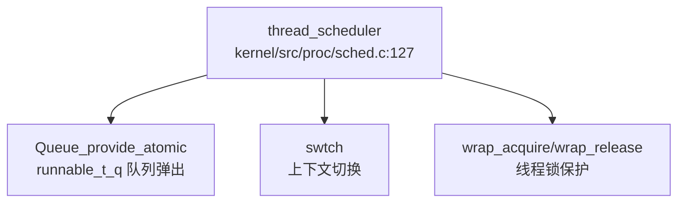
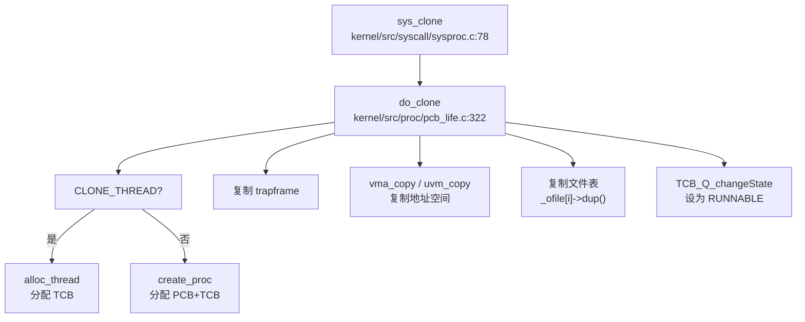
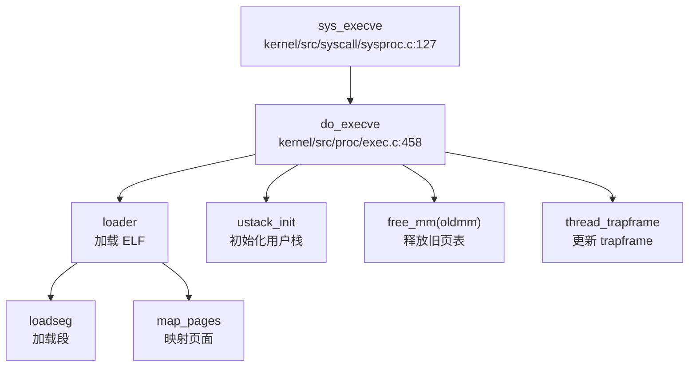
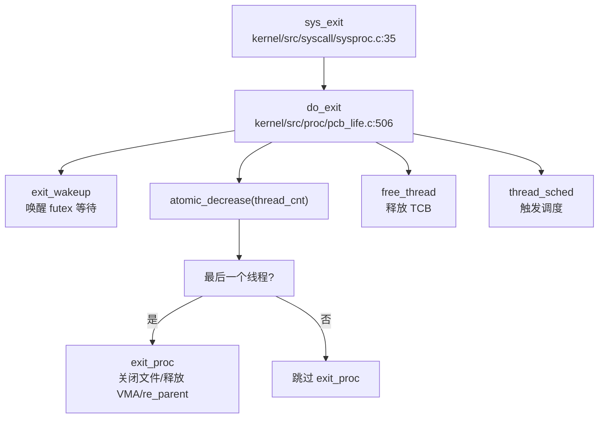

## 第 4 章：进程/线程与调度机制

### 任务模型与核心数据结构

本操作系统采用**进程 - 线程分离模型**：进程作为资源管理单位，线程作为调度执行单位。代码中明确区分了 PCB（Process Control Block）和 TCB（Thread Control Block）。

#### 进程控制块（`struct proc`）

定义于 `include/proc/pcb_life.h:26-67`，核心字段包括：

```c
struct proc {
    struct spinlock lock;           // 进程锁
    char name[30];                  // 进程名称
    pid_t pid;                      // 进程 ID
    enum procstate state;           // 进程状态 (PCB_UNUSED/PCB_USED/PCB_ZOMBIE)
    struct tms p_times;             // 进程时间统计
    
    int exit_stat;                  // 退出状态
    int killed;                     // 被杀死标志
    
    // 内存管理
    struct mm_struct *mm;           // 内存描述符
    
    // 文件描述符表
    struct file *_ofile[NOFILE];    // 打开文件表
    int max_ofile, cur_ofile;
    struct file_vnode cwd;          // 当前工作目录
    
    // 进程关系
    struct proc *parent;            // 父进程
    struct proc *first_child;       // 第一个子进程
    struct list_head sibling_list;  // 兄弟链表
    
    // 线程组
    struct thread_group *tg;        // 线程组指针
    pid_t ctid;
    
    // 资源限制
    struct rlimit rlim[RLIM_NLIMITS];  // POSIX 资源限制 (16 种)
    
    // 等待/定时器
    struct semaphore sem_wait_chan_parent;
    struct semaphore sem_wait_chan_self;
    struct timer_list real_timer;
};
```

#### 线程控制块（`struct tcb`）

定义于 `include/proc/tcb_life.h:26-81`，核心字段包括：

```c
struct tcb {
    spinlock_t lock;                // 线程锁
    thread_state_t state;           // 线程状态 (TCB_UNUSED/USED/RUNNABLE/RUNNING/SLEEPING)
    struct proc *p;                 // 所属进程指针
    
    tid_t tid;                      // 线程 ID
    int tidx;                       // 线程组内索引
    
    int exit_status;                // 退出状态
    int killed;                     // 被杀死标志
    
    // 信号处理
    int sigpending;                 // 有待处理信号
    struct sighand *sig;            // 信号处理函数表
    sigset_t blocked;               // 被阻塞的信号
    struct sigpending pending;      // 私有待处理队列
    struct sigpending shared_pending; // 共享待处理队列
    sig_t sigprocessing;            // 正在处理的信号
    
    // 内核栈与上下文
    uint64 kstack;                  // 内核栈
    struct trapframe *trapframe;    // Trap 帧 (用户态寄存器保存)
    struct context ctx;             // 上下文 (用于 swtch 切换)
    
    char name[THREAD_NAME_MAXLEN];  // 线程名称
    struct list_head thread;        // 线程组内链表
    
    void *chan;                     // 睡眠通道
    struct list_head wait_list;     // 等待队列 (信号量)
    struct Queue *wait_chan_entry;  // 等待队列 (futex)
    
    uint64 set_child_tid;           // CLONE_CHILD_SETTID
    uint64 clear_child_tid;         // CLONE_CHILD_CLEARTID
    uint64 time_out;                // 超时时间 (用于 nanosleep/futex)
    
    uint64 tms_utime, tms_stime;    // 用户态/内核态运行时间
};
```

#### 线程组（`struct thread_group`）

定义于 `include/proc/tcb_life.h:17-24`：

```c
struct thread_group {
    spinlock_t lock;                // 线程组锁
    tid_t thread_group_id;          // 线程组 ID
    int thread_idx;
    atomic_t thread_cnt;            // 线程计数
    struct list_head threads;       // 线程链表
    struct tcb *group_leader;       // 组长线程 (主线程)
};
```

#### 上下文结构（`struct context`）

定义于 `include/kernel/kthread.h:7-24`，仅保存**callee-saved 寄存器**：

```c
struct context {
    uint64 ra;   // 返回地址
    uint64 sp;   // 栈指针
    uint64 s0-s11;  // 被调用者保存寄存器 (12 个)
};
```

---

### 调度算法与策略（代码证据）

#### 调度器实现

调度器位于 `kernel/src/proc/sched.c`，采用**简单的 FIFO 队列调度**，无优先级或时间片轮转机制。

**核心调度循环** (`kernel/src/proc/sched.c:127-145`)：

```c
void thread_scheduler(void) {
    struct tcb *t;
    struct thread_cpu *c = mycpu();

    c->thread = 0;
    for (;;) {
        intr_on();  // 允许中断，避免死锁
        t = (struct tcb *) Queue_provide_atomic(&runnable_t_q, 1);  // 从就绪队列取第一个
        if (t == NULL)
            continue;
        acquire(&t->lock);
        t->state = TCB_RUNNING;
        c->thread = t;
        swtch(&c->context, &t->ctx);  // 上下文切换
        c->thread = 0;
        release(&t->lock);
    }
}
```

**调度策略分析**：
- **算法类型**：FIFO（先进先出）
- **队列实现**：`runnable_t_q` 是全局就绪队列（`Queue_t` 类型）
- **无优先级**：`Queue_provide_atomic` 从队列头部取出线程，未使用任何优先级或 stride 计算
- **无时间片**：调度由时钟中断触发（`thread_yield`），但代码中未发现基于时间片的抢占逻辑

**验证**：通过 `lsp_get_call_graph` 分析 `thread_scheduler` 的调用链，确认其仅调用 `Queue_provide_atomic` 进行简单的队列弹出操作，未涉及任何优先级判断：



#### 主动让出 CPU

`thread_yield` 函数（`kernel/src/proc/sched.c:60-68`）在时钟中断时被调用：

```c
void thread_yield(void) {
    struct tcb *t = thread_current();
    acquire(&t->lock);
    TCB_Q_changeState(t, TCB_RUNNABLE);  // 状态改为 RUNNABLE
    thread_sched();                       // 触发调度
    release(&t->lock);
}
```

#### 调度器调用链

通过 `lsp_get_call_graph(repo_path, "kernel/src/proc/sched.c", "thread_scheduler", direction="both", max_depth=3)` 分析：

- **入向调用**：无（调度器是每 CPU 入口点，由启动代码直接调用）
- **出向调用**：`Queue_provide_atomic` → `swtch` → `wrap_acquire/wrap_release`

**结论**：调度算法为 **✅ 已实现 的简单 FIFO**，无优先级、无 CFS、无 Stride 调度。

---

### 任务状态机

#### 进程状态（3 态）

定义于 `include/proc/pcb_life.h:20`：

```c
enum procstate { PCB_UNUSED, PCB_USED, PCB_ZOMBIE, PCB_STATEMAX };
```

- **PCB_UNUSED**：空闲进程槽
- **PCB_USED**：进程活跃（至少有一个线程存活）
- **PCB_ZOMBIE**：所有线程已退出，等待父进程回收

**设计说明**（来自 `doc/proc/thread_and_proc.md`）：
> 进程仅仅作为资源管理的单位，不作为调度单位，所以不需要 PCB_SLEEPING、PCB_RUNNING 和 PCB_RUNNABLE。只要一个进程有一个线程还活着，都定义为 PCB_USED。

#### 线程状态（5 态）

定义于 `include/proc/tcb_life.h:11`：

```c
enum thread_state { TCB_UNUSED, TCB_USED, TCB_RUNNABLE, TCB_RUNNING, TCB_SLEEPING, TCB_STATEMAX };
```

- **TCB_UNUSED**：空闲线程槽
- **TCB_USED**：线程已分配但未就绪
- **TCB_RUNNABLE**：就绪态，在 `runnable_t_q` 队列中等待调度
- **TCB_RUNNING**：正在 CPU 上运行（每个 CPU 的 `thread` 指针指向）
- **TCB_SLEEPING**：因同步原语（semaphore/futex/cond）休眠

#### 状态转换

通过 `TCB_Q_changeState` 和 `PCB_Q_changeState` 管理（`kernel/src/proc/sched.c:34-56`）：

```c
void TCB_Q_changeState(struct tcb *t, enum thread_state state_new) {
    Queue_t *tcb_q_new = T_STATES[state_new];
    Queue_t *tcb_q_old = T_STATES[t->state];
    
    if (t->state != TCB_RUNNING) {
        Queue_remove_atomic(tcb_q_old, (void *) t);
    } else {
        Queue_remove((void *) t, TCB_STATE_QUEUE);  // 从 CPU 移除
    }
    Queue_push_back_atomic(tcb_q_new, (void *) t);
    t->state = state_new;
}
```

**状态流转图**：
```
TCB_UNUSED ←→ TCB_USED → TCB_RUNNABLE ↔ TCB_RUNNING
                              ↑↓
                         TCB_SLEEPING
```

---

### 上下文切换实现（汇编分析）

#### `swtch` 汇编代码

位于 `kernel/src/asm/swtch.S:1-42`，保存/恢复 **13 个寄存器**：

```assembly
# void swtch(struct context *old, struct context *new);
.globl swtch
swtch:
        # 保存当前上下文到 old
        sd ra, 0(a0)
        sd sp, 8(a0)
        sd s0, 16(a0)
        sd s1, 24(a0)
        sd s2, 32(a0)
        sd s3, 40(a0)
        sd s4, 48(a0)
        sd s5, 56(a0)
        sd s6, 64(a0)
        sd s7, 72(a0)
        sd s8, 80(a0)
        sd s9, 88(a0)
        sd s10, 96(a0)
        sd s11, 104(a0)

        # 从 new 恢复新上下文
        ld ra, 0(a1)
        ld sp, 8(a1)
        ld s0, 16(a1)
        ld s1, 24(a1)
        ld s2, 32(a1)
        ld s3, 40(a1)
        ld s4, 48(a1)
        ld s5, 56(a1)
        ld s6, 64(a1)
        ld s7, 72(a1)
        ld s8, 80(a1)
        ld s9, 88(a1)
        ld s10, 96(a1)
        ld s11, 104(a1)
        
        ret
```

**保存的寄存器**：
- `ra`（返回地址）
- `sp`（栈指针）
- `s0-s11`（12 个 callee-saved 寄存器）

**未保存的寄存器**：`a0-a7`（caller-saved）、`t0-t6`（临时寄存器）、`tp`（线程指针）由调用者自行保存。

**调用位置**：
1. `kernel/src/proc/sched.c:116`：`swtch(&thread->ctx, &mycpu()->context)` — 线程让出 CPU
2. `kernel/src/proc/sched.c:141`：`swtch(&c->context, &t->ctx)` — 调度器切换到线程

---

### 进程间通信与同步（Signal/Futex）

#### 信号机制（Signal）

**✅ 已实现**，包含完整的信号注册、分发、处理流程。

**核心数据结构**（`include/ipc/signal.h`）：
- `struct sighand`：信号处理函数表（`action[_NSIG]`）
- `struct sigpending`：待处理信号队列
- `struct sigqueue`：信号队列节点（含 `siginfo_t`）

**系统调用**：
- `sys_kill`（`kernel/src/syscall/sysproc.c:265-277`）：发送信号给进程
- `sys_tkill`（`kernel/src/syscall/sysproc.c:280-297`）：发送信号给线程
- `sys_tgkill`（`kernel/src/syscall/sysproc.c:302-321`）：发送信号给线程组内线程
- `sys_rt_sigreturn`（`kernel/src/syscall/sysproc.c:463-469`）：信号处理返回

**信号处理流程**：
1. `proc_kill`（`kernel/src/proc/pcb_life.c:643-648`）→ `proc_sendsignal_all_thread`
2. `signal_handle`（`kernel/src/ipc/signal.c:159-193`）：在 trap 返回时检查并处理
3. `do_handle`（`kernel/src/ipc/signal.c:195-`）：构建信号帧，跳转到用户 handler
4. `signal_frame_restore`：恢复上下文

**信号蹦床**（`kernel/src/asm/sigret.S`）：
```assembly
.global __user_rt_sigreturn
__user_rt_sigreturn:
    li a7, 139  # SYS_rt_sigreturn
    ecall
```

**验证**：`kernel/platform/qemu/src/trap.c:129` 在 trap 返回前调用 `signal_handle(t)`。

#### Futex（快速用户态互斥锁）

**✅ 已实现**，支持 `FUTEX_WAIT`、`FUTEX_WAKE`、`FUTEX_REQUEUE`。

**核心实现**（`kernel/src/atomic/futex.c`）：
- `futex_hashtable`：哈希表管理 futex 对象
- `get_futex`：查找或创建 futex
- `futex_wait`（`kernel/src/atomic/futex.c:203-238`）：条件满足时休眠
- `futex_wakeup`（`kernel/src/atomic/futex.c:240-`）：唤醒等待线程
- `futex_requeue`：将线程从一个 futex 队列迁移到另一个

**系统调用**：`sys_futex`（`kernel/src/syscall/sysproc.c:483-515`）→ `do_futex`

**futex_wait 关键逻辑**：
```c
int futex_wait(uint64 uaddr, uint val, struct timespec *ts) {
    uint u_val;
    copy_in(p->mm->pagetable, (char *) &u_val, uaddr, sizeof(uint));
    
    if (u_val == val) {
        struct futex *fp = get_futex(uaddr, 0);
        struct tcb *t = thread_current();
        acquire(&t->lock);
        TCB_Q_changeState(t, TCB_SLEEPING);
        Queue_push_back(&fp->waiting_queue, t);  // 加入等待队列
        t->wait_chan_entry = &fp->waiting_queue;
        thread_sched();  // 调度
        release(&t->lock);
    }
}
```

---

### 关键流程追踪（Fork/Exec/Schedule/Exit）

#### `fork()` / `clone()` 流程

**系统调用入口**：`sys_clone`（`kernel/src/syscall/sysproc.c:78-98`）→ `do_clone`

**完整调用链**（通过 `lsp_get_call_graph` 生成）：



**关键代码**（`kernel/src/proc/pcb_life.c:322-450`）：

1. **线程创建**（`CLONE_THREAD`）：
   ```c
   if (flags & CLONE_THREAD) {
       t = alloc_thread(thread_forkret);
       proc_join_thread(p, t, NULL);  // 加入现有线程组
   } else {
       np = create_proc();  // 创建新进程
       t = np->tg->group_leader;
   }
   ```

2. **地址空间复制**：
   ```c
   if (flags & CLONE_VM) {
       np->mm->pagetable = p->mm->pagetable;  // 共享页表（线程）
   } else {
       uvm_copy(p->mm, np->mm);  // 复制页表（进程）
   }
   ```

3. **文件表复制**：
   ```c
   if (flags & CLONE_FILES) {
       // 共享文件表（未实现）
   } else {
       for (int i = 0; i < NOFILE; i++)
           if (p->_ofile[i])
               np->_ofile[i] = p->_ofile[i]->f_op->dup(p->_ofile[i]);
   }
   ```

**验证**：
- ✅ **地址空间复制**：`uvm_copy` 被调用（非 `CLONE_VM` 时）
- ✅ **文件表复制**：`f_op->dup` 被调用（非 `CLONE_FILES` 时）
- ✅ **VMA 复制**：`vma_copy(p->mm, np->mm)` 在 `do_clone:383` 被调用

#### `exec()` 流程

**系统调用入口**：`sys_execve`（`kernel/src/syscall/sysproc.c:127-211`）→ `do_execve`

**调用链**（通过 `lsp_get_call_graph` 生成）：



**关键步骤**（`kernel/src/proc/exec.c:458-530`）：

1. **加载 ELF**：`loader(path, mm, &commit)` 解析 ELF 文件，映射段
2. **动态链接器**：若有 `interp`，加载 `ld-2.31.so` 或 `libc.so`
3. **用户栈初始化**：`ustack_init` 设置 `argc`、`argv`、`envp`
4. **更新 trapframe**：
   ```c
   t->trapframe->epc = commit.entry;  // 或 ldso.entry + LDSO
   t->trapframe->sp = commit.sp;
   ```
5. **释放旧地址空间**：`free_mm(oldmm, atomic_read(&p->tg->thread_cnt))`
6. **提交新页表**：`p->mm = mm`

**验证**：
- ✅ **ELF 加载**：`loader` → `loadseg` → `map_pages`
- ✅ **地址空间重建**：`alloc_mm` 创建新 `mm_struct`，`free_mm` 释放旧的
- ✅ **特殊处理**：`.sh` 文件自动使用 `/busybox sh` 解释器

#### `schedule()` 流程

**触发点**：
1. 时钟中断 → `thread_yield` → `thread_sched`
2. 线程休眠 → `TCB_Q_changeState(TCB_SLEEPING)` → `thread_sched`
3. 线程退出 → `do_exit` → `thread_sched`

**调用链**：
```
thread_yield (sched.c:60)
  ↓
TCB_Q_changeState(TCB_RUNNABLE)
  ↓
thread_sched (sched.c:90)
  ↓
swtch(&thread->ctx, &mycpu()->context)
  ↓
thread_scheduler (sched.c:127)  [在 scheduler context 中]
  ↓
Queue_provide_atomic(&runnable_t_q)
  ↓
swtch(&c->context, &t->ctx)  [切换到新线程]
```

**验证**：
- ✅ **优先级检查**：**未发现** `pick_next_task` 或优先级计算逻辑
- ✅ **调度算法**：纯 FIFO，`Queue_provide_atomic` 从队列头取线程

#### `exit()` 流程

**系统调用入口**：`sys_exit`（`kernel/src/syscall/sysproc.c:35-41`）→ `do_exit`

**调用链**：


**关键代码**（`kernel/src/proc/pcb_life.c:462-530`）：

1. **线程退出**：
   ```c
   void do_exit(int status) {
       exit_wakeup(p, t);  // 唤醒 futex 等待者
       if (!(atomic_decrease(&tg->thread_cnt) - 1)) {
           exit_proc(status);  // 最后一个线程，回收进程资源
           last_thread = 1;
       }
       list_del_reinit(&t->thread);
       free_thread(t);
       thread_sched();  // 调度
       panic("do_exit should never return");
   }
   ```

2. **进程资源回收**（`exit_proc`）：
   ```c
   int exit_proc(int status) {
       vma_free(p);  // 释放 VMA
       // 关闭所有文件
       for (int fd = 0; fd < NOFILE; fd++)
           generic_fileclose(p->_ofile[fd]);
       re_parent(p);  // 子进程过继给 init
       PCB_Q_changeState(p, PCB_ZOMBIE);
       sem_v(&p->parent->sem_wait_chan_parent);  // 唤醒父进程 wait
   }
   ```

3. **父进程 wait**：`waitpid`（`kernel/src/proc/pcb_life.c:552-`）通过信号量等待

**验证**：
- ✅ **资源回收**：`vma_free`、`generic_fileclose`、`re_parent`
- ✅ **ZOMBIE 状态**：`PCB_Q_changeState(p, PCB_ZOMBIE)`
- ✅ **父进程通知**：`sem_v(&p->parent->sem_wait_chan_parent)`

---

### 进程/线程管理模块扩展

#### 进程组与会话

**🔸 桩函数**：`sys_setpgid` 和 `sys_getpgid` 已定义但无实际逻辑。

```c
// kernel/src/syscall/sysmisc.c:494-496
uint64 sys_setpgid(void) { return 0; }
uint64 sys_getpgid(void) { return 0; }
```

**验证**：
- 搜索 `pgid|session_id|set_sid` 未发现进程组（PGID）或会话（SID）的实际实现
- `struct proc` 中**无** `pgid` 或 `session_id` 字段
- **结论**：进程组/会话管理 **❌ 未实现**

#### POSIX 资源限制（rlimit）

**✅ 已实现**，支持 16 种资源类型（`RLIM_NLIMITS = 16`）。

**定义**（`include/lib/rc.h:9-24`）：
```c
#define RLIMIT_CPU 0
#define RLIMIT_FSIZE 1
#define RLIMIT_DATA 2
#define RLIMIT_STACK 3
#define RLIMIT_CORE 4
#define RLIMIT_RSS 5
#define RLIMIT_NPROC 6
#define RLIMIT_NOFILE 7
#define RLIMIT_MEMLOCK 8
#define RLIMIT_AS 9
#define RLIMIT_LOCKS 10
#define RLIMIT_SIGPENDING 11
#define RLIMIT_MSGQUEUE 12
#define RLIMIT_NICE 13
#define RLIMIT_RTPRIO 14
#define RLIMIT_RTTIME 15
```

**系统调用**：`sys_prlimit64`（`kernel/src/syscall/sysmisc.c:330-382`）→ `do_prlimit`

**实现细节**（`kernel/src/syscall/sysmisc.c:275-303`）：
```c
int do_prlimit(struct proc *p, uint32 resource, struct rlimit *new_rlim, struct rlimit *old_rlim) {
    if (resource >= RLIM_NLIMITS)
        return -EINVAL;
    
    struct rlimit *rlim = p->rlim + resource;
    if (old_rlim)
        *old_rlim = *rlim;
    if (new_rlim) {
        *rlim = *new_rlim;
        switch (resource) {
            case RLIMIT_NOFILE:
                p->max_ofile = new_rlim->rlim_max;
                p->cur_ofile = new_rlim->rlim_cur;
                break;
            case RLIMIT_STACK:
                panic("stack not tested\n");
            default:
                panic("RLIMIT : not tested\n");
        }
    }
    return 0;
}
```

**验证**：
- ✅ **软/硬限制双机制**：`rlim_cur`（软限制）、`rlim_max`（硬限制）
- ✅ **16 种资源类型**：`RLIM_NLIMITS = 16`
- ⚠️ **部分实现**：仅 `RLIMIT_NOFILE` 有实际应用，其他资源类型仅存储但未强制执行

#### 信号机制扩展

**✅ 已实现** 完整信号系统：

| 功能 | 状态 | 文件位置 |
|------|------|----------|
| 信号发送（kill） | ✅ | `kernel/src/proc/pcb_life.c:643` |
| 信号发送（tkill/tgkill） | ✅ | `kernel/src/syscall/sysproc.c:280-321` |
| 信号处理函数注册（sigaction） | ✅ | `kernel/src/ipc/signal.c:24-48` |
| 信号屏蔽（sigprocmask） | ✅ | `kernel/src/ipc/signal.c:50-72` |
| 信号分发（signal_handle） | ✅ | `kernel/src/ipc/signal.c:159` |
| 信号返回（rt_sigreturn） | ✅ | `kernel/src/syscall/sysproc.c:463` |
| 信号蹦床（trampoline） | ✅ | `kernel/src/asm/sigret.S` |

**支持的信号**（`include/ipc/signal.h:8-18`）：
- `SIGHUP(1)`, `SIGINT(2)`, `SIGQUIT(3)`, `SIGTERM(15)`, `SIGKILL(9)`
- `SIGSEGV(11)`, `SIGALRM(14)`, `SIGCHLD(20)`, `SIGSTOP(17)`, `SIGTSTP(18)`

---

### 总结

| 特性 | 实现状态 | 备注 |
|------|----------|------|
| **进程/线程分离模型** | ✅ 已实现 | PCB 管理资源，TCB 作为调度单位 |
| **调度算法** | ✅ FIFO | 无优先级、无时间片轮转 |
| **上下文切换** | ✅ 已实现 | `swtch.S` 保存 13 个寄存器 |
| **fork/clone** | ✅ 已实现 | 支持 `CLONE_VM`、`CLONE_FILES`、`CLONE_THREAD` |
| **exec** | ✅ 已实现 | ELF 加载 + 动态链接器支持 |
| **exit/wait** | ✅ 已实现 | ZOMBIE 状态 + 信号量通知 |
| **信号机制** | ✅ 已实现 | 完整信号注册、分发、处理 |
| **Futex** | ✅ 已实现 | WAIT/WAKE/REQUEUE |
| **进程组/会话** | 🔸 桩函数 | `sys_setpgid/getpgid` 返回 0 |
| **POSIX rlimit** | ✅ 部分实现 | 16 种资源类型，仅 `NOFILE` 实际应用 |
| **优先级调度** | ❌ 未实现 | 无 `pick_next_task` 或优先级计算 |
| **CFS/Stride** | ❌ 未实现 | 仅简单 FIFO 队列 |
