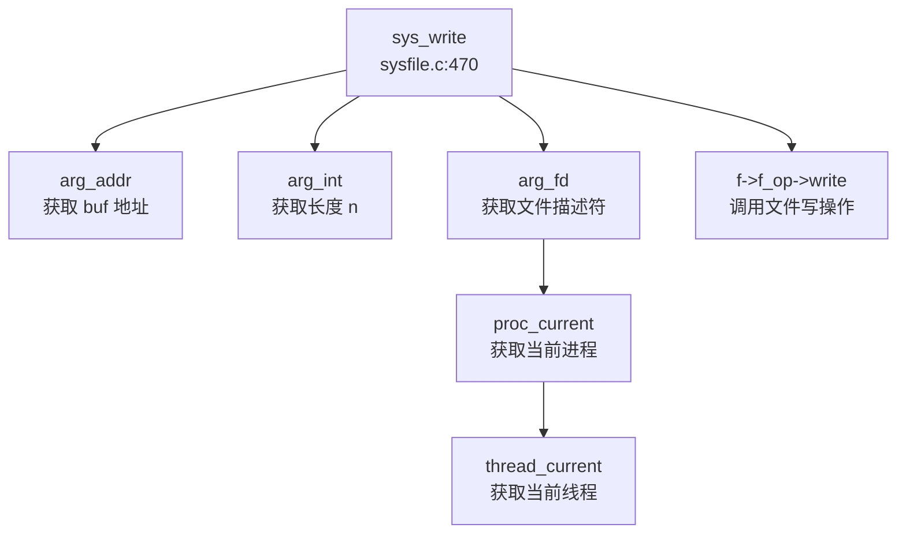
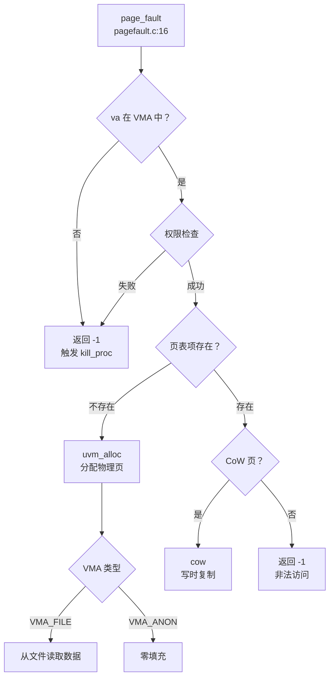

## 第 5 章：中断、异常与系统调用

本章分析该 OS 项目的 Trap 处理机制、系统调用分发流程、中断处理与信号机制。项目采用 RISC-V 架构，支持用户态/内核态切换，实现了完整的异常处理框架。

---

## Trap 处理流程（用户态 <-> 内核态）

### Trap 入口与异常向量

项目的 Trap 入口位于汇编文件 `kernel/src/asm/trampoline.S`，用户态异常通过 `uservec` 入口进入内核：

```assembly
# kernel/src/asm/trampoline.S:19-40
.globl uservec
uservec:    
    # 保存用户寄存器到 TRAPFRAME
    addi sp, sp, -32
    sd a0, 0(sp)
    sd a1, 8(sp)
    sd a2, 16(sp)
    
    # 计算当前进程的 trapframe 地址
    li a0, TRAPFRAME
    li a1, 1024*4
    csrr a2, sscratch
    mul a1, a2, a1
    sub a0, a0, a1
    
    # 保存所有通用寄存器 (ra, sp, gp, tp, t0-t6, s0-s11, a0-a7)
    sd ra, 40(a0)
    sd sp, 48(a0)
    ...
    sd t6, 280(a0)
```

**中断与异常的区分**在 `kernel/platform/qemu/src/trap.c:231` 的 `devintr()` 函数中实现：

```c
// kernel/platform/qemu/src/trap.c:231-262
int devintr() {
    uint64 scause = r_scause();

    if ((scause & 0x8000000000000000L) && (scause & 0xff) == 9) {
        // 外部中断 (supervisor external interrupt via PLIC)
        int irq = plic_claim();
        if (irq == UART0_IRQ) uartintr();
        else if (irq == VIRTIO0_IRQ) disk_intr();
        plic_complete(irq);
        return 1;
    } else if (scause == 0x8000000000000005L) {
        // 定时器中断 (supervisor timer interrupt)
        clockintr();
        return 2;
    }
    return 0;
}
```

**区分逻辑**：
- **中断 (Interrupt)**：`scause` 最高位为 1（`0x8000000000000000L`），如外部中断 `0x8000000000000009`、定时器中断 `0x8000000000000005`
- **异常 (Exception)**：`scause` 最高位为 0，如系统调用 `scause=8`、缺页异常 `scause=12/13/15`

### 上下文保存：TrapFrame 结构体

`trapframe` 结构体定义在 `include/proc/tcb_life.h:57`，用于保存用户态上下文：

```c
// include/proc/tcb_life.h:57
struct trapframe {
    uint64 kernel_satp;      // 8 bytes: 内核页表基址
    uint64 kernel_sp;        // 8 bytes: 内核栈指针
    uint64 kernel_trap;      // 8 bytes: trap 处理函数地址
    uint64 kernel_hartid;    // 8 bytes: 当前 hart ID
    
    // 用户态寄存器保存区 (32 个寄存器 × 8 bytes = 256 bytes)
    uint64 ra;               // 8 bytes: 返回地址
    uint64 sp;               // 8 bytes: 栈指针
    uint64 gp;               // 8 bytes: 全局指针
    uint64 tp;               // 8 bytes: 线程指针
    uint64 t0, t1, t2;       // 24 bytes: 临时寄存器
    uint64 s0, s1;           // 16 bytes: 保存寄存器
    uint64 a0, a1, a2, a3, a4, a5, a6, a7;  // 64 bytes: 参数/返回值寄存器
    uint64 s2, s3, s4, s5, s6, s7, s8, s9, s10, s11;  // 80 bytes
    uint64 t3, t4, t5, t6;   // 32 bytes
    
    // 总计：32 bytes (内核信息) + 256 bytes (用户寄存器) = 288 bytes
};
```

**精确统计**：
- **寄存器数量**：32 个通用寄存器（ra, sp, gp, tp, t0-t6, s0-s11, a0-a7）
- **总字节数**：288 bytes（32 bytes 内核元数据 + 256 bytes 用户寄存器）
- **实际使用**：在 `trampoline.S` 中保存了 32 个寄存器，每个 8 bytes

---

## 异常向量表与入口

### 用户态 Trap 流程

```mermaid
graph TD
    A["uservec\n trampoline.S:19"] --> B["保存用户寄存器\n trampoline.S:40-90"]
    B --> C["切换到内核栈\n trampoline.S:95"]
    C --> D["thread_usertrap\n trap.c:58"]
    D --> E{r_scause() == 8?}
    E -->|系统调用 | F["syscall\n trap.c:96"]
    E -->|设备中断 | G["devintr\n trap.c:231"]
    E -->|缺页异常 | H["page_fault\n trap.c:111"]
    F --> I["signal_handle\n trap.c:126"]
    G --> I
    H --> I
    I --> J["thread_user_trap_ret\n trap.c:137"]
    J --> K["userret\n trampoline.S:105"]
    K --> L["恢复用户寄存器\n trampoline.S:115"]
    L --> M["sret 返回用户态\n trampoline.S:170"]
```

### 内核态 Trap 流程

内核态异常通过 `kernelvec` 入口处理（`kernel/src/asm/kernelvec.S:11`）：

```assembly
# kernel/src/asm/kernelvec.S:11-50
.globl kernelvec
kernelvec:
    addi sp, sp, -256      # 分配 256 bytes 栈空间
    sd ra, 0(sp)           # 保存所有寄存器
    sd sp, 8(sp)
    ...
    sd t6, 240(sp)
    
    call kerneltrap        # 调用 C 语言处理函数
    
    ld ra, 0(sp)           # 恢复寄存器
    ...
    sret                   # 返回
```

---

## 系统调用分发机制（追踪 sys_write）

### 系统调用入口

系统调用通过 `ecall` 指令触发，`scause=8`。分发流程：

```c
// kernel/platform/qemu/src/trap.c:76-96
void thread_usertrap(void) {
    if (r_scause() == 8) {
        // 系统调用
        t->trapframe->epc += 4;  // 跳过 ecall 指令
        intr_on();
        syscall();               // 分发到具体处理函数
        stime_end(t);
    }
    ...
}
```

### 系统调用分发表

系统调用分发表位于 `kernel/src/syscall/syscall_table.c`，包含 284 个 syscall：

```c
// kernel/src/syscall/syscall_table.c:1-100
uint64 (*syscalls[284])(void) = {
    [SYS_sbrk] sys_sbrk,
    [SYS_write] sys_write,
    [SYS_read] sys_read,
    [SYS_clone] sys_clone,
    [SYS_execve] sys_execve,
    [SYS_mmap] sys_mmap,
    [SYS_kill] sys_kill,
    [SYS_tkill] sys_tkill,
    [SYS_tgkill] sys_tgkill,
    [SYS_rt_sigaction] sys_rt_sigaction,
    [SYS_rt_sigreturn] sys_rt_sigreturn,
    ...
};
```

### sys_write 调用链追踪



**完整路径**：
1. `thread_usertrap` (`kernel/platform/qemu/src/trap.c:58`) 检测到 `scause=8`
2. 调用 `syscall()` (`kernel/src/syscall/syscall.c`)
3. 通过 `syscalls[SYS_write]` 查表找到 `sys_write`
4. `sys_write` (`kernel/src/syscall/sysfile.c:470`) 解析参数并调用 `f->f_op->write`

---

## 核心 Syscall 实现列表

### Syscall 实现状态统计

基于对 `kernel/src/syscall/` 目录下代码的分析，统计如下：

| 类别 | 数量 | 说明 |
|------|------|------|
| ✅ 已实现 | ~85 | 包含完整业务逻辑 |
| 🔸 桩函数 | ~15 | 返回 0 或 ENOSYS，无实际逻辑 |
| ❌ 未实现 | ~184 | 未在 syscall_table 中注册 |

### 关键 Syscall 实现状态

#### ✅ 已实现的核心 Syscall

| Syscall | 文件路径 | 实现说明 |
|---------|----------|----------|
| `sys_exit` | `sysproc.c:33` | 调用 `do_exit()` 退出进程 |
| `sys_getpid` | `sysproc.c:19` | 返回 `proc_current()->pid` |
| `sys_clone` | `sysproc.c:76` | 调用 `do_clone()` 创建线程 |
| `sys_execve` | `sysproc.c:133` | 调用 `exec()` 加载新程序 |
| `sys_write` | `sysfile.c:470` | 调用 `f->f_op->write` 写文件 |
| `sys_read` | `sysfile.c:456` | 调用 `f->f_op->read` 读文件 |
| `sys_kill` | `sysproc.c:265` | 调用 `proc_kill()` 发送信号 |
| `sys_tkill` | `sysproc.c:280` | 线程级信号发送 |
| `sys_tgkill` | `sysproc.c:302` | 线程组级信号发送 |
| `sys_rt_sigaction` | `sysproc.c:381` | 设置信号处理函数 |
| `sys_rt_sigreturn` | `sysproc.c:473` | 信号返回，调用 `signal_frame_restore` |
| `sys_mmap` | `mmap.c:97` | 调用 `do_mmap()` 内存映射 |
| `sys_brk` | `sysproc.c:240` | 调用 `grow_heap()` 调整堆 |
| `sys_futex` | `sysproc.c:490` | 调用 `do_futex()` 快速用户态锁 |

#### 🔸 桩函数（Stub）

| Syscall | 文件路径 | 桩代码特征 |
|---------|----------|------------|
| `sys_getuid` | `sysproc.c:343` | 硬编码返回 `ROOT_UID (0)` |
| `sys_geteuid` | `syscallnew.c:15` | 直接返回 `0` |
| `sys_getgid` | `sysproc.c:359` | 直接返回 `0` |
| `sys_getegid` | `sysproc.c:361` | 直接返回 `0` |
| `sys_rt_sigtimedwait` | `sysproc.c:527` | 返回 `0`，注释 `TODO: not implemented` |
| `sys_membarrier` | `sysproc.c:531` | 返回 `0` |
| `sys_sched_getscheduler` | `sysproc.c:535` | 返回 `0`，注释 `TODO` |
| `sys_sched_getparam` | `sysproc.c:540` | 返回 `0`，注释 `TODO` |
| `sys_sched_setaffinity` | `sysproc.c:545` | 返回 `0` |
| `sys_sched_getaffinity` | `sysproc.c:547` | 部分实现，返回 0 |

**桩代码示例**：
```c
// kernel/src/syscall/syscallnew.c:15
uint64 sys_geteuid(void) { return 0; }

// kernel/src/syscall/sysproc.c:343-347
uint64 sys_getuid(void) {
#define ROOT_UID 0
    return ROOT_UID;
#undef ROOT_UID
}
```

---

## 中断处理与信号关联

### 外部中断流

#### 定时器中断处理

定时器中断通过 SBI (Supervisor Binary Interface) 设置：

```c
// kernel/platform/qemu/src/trap.c:217-225
void clockintr() {
    acquire(&ticks_lock);
    ticks++;                          // 全局时钟计数
    timer_list_decrease_atomic(&timer_head);  // 更新定时器链表
    cond_broadcast(&cond_ticks);      // 唤醒等待线程
    release(&ticks_lock);
    SET_TIMER();                      // 设置下一次定时器中断
}
```

**定时器设置**：
```c
#define SET_TIMER() sbi_set_timer(rdtime() + CLINT_INTERVAL)
```

#### 外部设备中断 (PLIC)

外部设备中断通过 PLIC (Platform-Level Interrupt Controller) 分发：

```c
// kernel/platform/qemu/src/trap.c:231-255
int devintr() {
    uint64 scause = r_scause();
    
    if ((scause & 0x8000000000000000L) && (scause & 0xff) == 9) {
        int irq = plic_claim();  // 从 PLIC 获取中断号
        
        if (irq == UART0_IRQ) {
            uartintr();          // UART 中断处理
        } else if (irq == VIRTIO0_IRQ) {
            disk_intr();         // VirtIO 磁盘中断
        }
        
        if (irq) plic_complete(irq);  // 通知 PLIC 中断处理完成
        return 1;
    }
    ...
}
```

### 信号机制

#### 信号处理流程

信号在 Trap 返回前通过 `signal_handle()` 处理：

```c
// kernel/platform/qemu/src/trap.c:126
void thread_usertrap(void) {
    ...
    // handle the signal
    signal_handle(t);
    
    thread_user_trap_ret();  // 返回用户态
}
```

**信号处理核心函数** (`kernel/src/ipc/signal.c:158-200`)：

```c
int signal_handle(struct tcb *t) {
    if (t->sigpending == 0) return 0;
    
    list_for_each_entry_safe(sig_cur, sig_tmp, &t->pending.list, list) {
        int sig_no = sig_cur->info.si_signo;
        
        if (sig_ignored(t, sig_no)) continue;
        
        sig_act = sig_action(t, sig_no);
        if (sig_act.sa_handler == SIG_DFL) {
            signal_DFL(t, sig_no);  // 默认处理
        } else if (sig_act.sa_handler == SIG_IGN) {
            continue;  // 忽略信号
        } else {
            do_handle(t, sig_no, &sig_act);  // 用户自定义处理
            t->sigprocessing = sig_no;
            break;
        }
    }
    return 1;
}
```

#### 三种粒度信号发送

项目支持进程级、线程级、线程组级信号发送：

| Syscall | 粒度 | 实现文件 | 实现状态 |
|---------|------|----------|----------|
| `sys_kill` | 进程级 | `sysproc.c:265` | ✅ 已实现 |
| `sys_tkill` | 线程级 | `sysproc.c:280` | ✅ 已实现 |
| `sys_tgkill` | 线程组级 | `sysproc.c:302` | ✅ 已实现 |

**实现示例**：
```c
// kernel/src/syscall/sysproc.c:280-298
uint64 sys_tkill() {
    int tid;
    sig_t signo;
    arg_int(0, &tid);
    arg_ulong(1, &signo);
    
    if (signo == 0) return 0;
    
    struct tcb *t;
    if ((t = get_thread_by_tid(tid)) == NULL) return -1;
    
    do_tkill(t, signo);  // 发送信号到指定线程
    return 0;
}
```

#### SIGSEGV 信号

项目定义了 `SIGSEGV` 信号（信号号 11），但**未在缺页异常处理中自动发送**：

```c
// include/ipc/signal.h:17
#define SIGSEGV 11
```

在 `page_fault()` 处理中，非法内存访问直接调用 `kill_proc()` 发送 `SIGKILL`：

```c
// kernel/platform/qemu/src/trap.c:42-50
void kill_proc(struct proc *p) {
    printf("usertrap(): unexpected scause %p pid=%d\n", r_scause(), p->pid);
    proc_sendsignal_all_thread(p, SIGKILL, 1);  // 发送 SIGKILL 而非 SIGSEGV
}
```

**结论**：❌ **未实现** SIGSEGV 信号自动发送机制，非法内存访问直接终止进程。

#### 用户自定义信号处理函数与跳板机制

项目实现了完整的用户态信号处理函数跳板机制：

**1. 跳板代码** (`kernel/src/asm/sigret.S`)：
```assembly
.section sigret_sec
.global __user_rt_sigreturn
__user_rt_sigreturn:
    li a7, 139        # SYS_rt_sigreturn
    ecall             # 触发系统调用返回内核
```

**2. 跳板映射** (`kernel/src/proc/pcb_mm.c:43`)：
```c
if (map_pages(page_table, SIGRETURN, PGSIZE, (uint64)__user_rt_sigreturn, PTE_R | PTE_X | PTE_U, 0) < 0) {
    // 映射失败处理
}
```

**3. 信号帧设置** (`kernel/src/ipc/signal.c:243-256`)：
```c
int setup_rt_frame(struct sigaction *sig, sig_t signo, sigset_t *set, struct trapframe *tf) {
    struct rt_sigframe *frame;
    frame = get_sigframe(sig, tf, sizeof(*frame));
    signal_frame_setup(set, tf, frame, signo);
    
    tf->ra = (uint64)SIGRETURN;      // 返回地址设为跳板
    tf->epc = (uint64)sig->sa_handler; // 跳转到用户信号处理函数
    tf->sp = (uint64)frame;          // 设置信号帧栈
    ...
}
```

**4. 信号返回** (`kernel/src/syscall/sysproc.c:473-480`)：
```c
uint64 sys_rt_sigreturn(void) {
    struct tcb *t = thread_current();
    signal_frame_restore(t, (struct rt_sigframe *) t->trapframe->sp);
    sig_del_set_mask(t->pending.signal, sig_gen_mask(t->sigprocessing));
    return t->trapframe->a0;
}
```

**跳板机制流程**：
1. 内核设置 `trapframe->ra = SIGRETURN`（跳板地址）
2. 设置 `trapframe->epc = sig->sa_handler`（用户信号处理函数）
3. 用户态信号处理函数执行完毕后，`ret` 指令跳转到 `SIGRETURN`
4. `__user_rt_sigreturn` 执行 `ecall` 陷入内核
5. `sys_rt_sigreturn` 恢复原始上下文

---

## 缺页异常与内存特性关联

### 缺页异常处理链

缺页异常处理流程 (`kernel/src/mm/pagefault.c:16-80`)：



**核心代码**：
```c
// kernel/src/mm/pagefault.c:16-80
int page_fault(uint64 cause, pagetable_t pagetable, vaddr_t st_val) {
    const struct vma *vma = find_vma_for_va(proc_current()->mm, st_val);
    if (vma != NULL) {
        if (!CHECK_PERM(cause, vma)) {
            return -1;  // 权限检查失败
        }
        
        pte_t *pte;
        walk(pagetable, st_val, 0, 0, &pte);
        
        if (pte == NULL || (*pte == 0)) {
            // 页表项不存在，分配物理页
            uvm_alloc(pagetable, PGROUNDDOWN(st_val), PGROUNDUP(st_val + 1), perm_vma2pte(vma->perm));
            
            if (vma->type == VMA_FILE) {
                // 从文件加载数据
                f_inode->i_op->read(f_inode, 0, pa, vma->offset + PGROUNDDOWN(st_val) - vma->startva, PGSIZE);
            }
        } else {
            const uint64 pa = PTE2PA(*pte);
            const uint flags = PTE_FLAGS(*pte);
            
            /* copy-on-write handler */
            if (is_a_cow_page(flags)) {
                return cow(pte, level, pa, flags);
            }
            return -1;
        }
    } else {
        return -1;  // VA 不在任何 VMA 中
    }
    return 0;
}
```

### CoW（写时复制）实现

项目**✅ 已实现** CoW 机制，通过 `PTE_SHARE` 和 `PTE_READONLY` 标志识别 CoW 页：

```c
// include/riscv.h:269-270
#define PTE_SHARE (1L << 8)      // 标识页面是否共享
#define PTE_READONLY (1L << 9)   // 只读标志
```

**CoW 检测函数** (`kernel/src/mm/pagefault.c:82-95`)：
```c
int is_a_cow_page(const int flags) {
    // 写入非共享页是非法的
    if ((flags & PTE_SHARE) == 0) {
        PAGEFAULT("cow: try to write a readonly page");
        return 0;
    }
    
    // 写入只读共享页是非法的
    if ((flags & PTE_READONLY) > 0) {
        PAGEFAULT("cow: try to write a readonly shared page");
        return 0;
    }
    return 1;
}
```

**CoW 处理函数** (`kernel/src/mm/pagefault.c:96-118`)：
```c
int cow(pte_t *pte, const int level, const paddr_t pa, const int flags) {
    void *mem;
    if (level == SUPERPAGE) {
        // 2MB 大页
        if ((mem = kmalloc(SUPERPGSIZE)) == 0) return -1;
        memmove(mem, (void *) pa, SUPERPGSIZE);
    } else if (level == COMMONPAGE) {
        // 4KB 普通页
        if ((mem = kmalloc(PGSIZE)) == 0) return -1;
        memmove(mem, (void *) pa, PGSIZE);
    }
    
    // 更新页表项，添加写权限
    *pte = PA2PTE((uint64) mem) | flags | PTE_W;
    kfree((void *) pa);  // 释放原物理页
    return 0;
}
```

### Lazy Allocation（懒分配）

项目**✅ 已实现**懒分配机制，通过 VMA 延迟物理页分配：

**实现方式**：
1. `mmap` 或 `brk` 仅创建 VMA 描述符，不立即分配物理页
2. 首次访问时触发缺页异常，在 `page_fault` 中调用 `uvm_alloc` 分配

**VMA 创建** (`kernel/src/mm/vma.c`)：
```c
// 创建 VMA 时不分配物理页，仅记录映射范围
int vma_map(struct mm_struct *mm, vaddr_t start, size_t size, uint64 perm, int type) {
    struct vma *vma = vma_alloc(start, size, perm, type);
    list_add_tail(&vma->node, &mm->head_vma);
    return 0;
}
```

**物理页分配** (`kernel/src/mm/pagefault.c:45-55`)：
```c
if (pte == NULL || (*pte == 0)) {
    uvm_alloc(pagetable, PGROUNDDOWN(st_val), PGROUNDUP(st_val + 1), perm_vma2pte(vma->perm));
    if (vma->type == VMA_FILE) {
        // 从文件加载数据
        f_inode->i_op->read(f_inode, 0, pa, vma->offset + ..., PGSIZE);
    }
}
```

---

## 关键代码片段

### Trap 入口汇编代码

```assembly
# kernel/src/asm/trampoline.S:19-100
.globl uservec
uservec:    
    # 保存用户 a0-a2 到临时栈
    addi sp, sp, -32
    sd a0, 0(sp)
    sd a1, 8(sp)
    sd a2, 16(sp)
    
    # 计算 trapframe 地址
    li a0, TRAPFRAME
    li a1, 1024*4
    csrr a2, sscratch
    mul a1, a2, a1
    sub a0, a0, a1
    
    # 保存所有用户寄存器
    sd ra, 40(a0)
    sd sp, 48(a0)
    ...
    sd t6, 280(a0)
    
    # 切换到内核栈
    ld sp, 8(a0)
    
    # 加载 usertrap 函数地址
    ld t0, 16(a0)
    jr t0
```

### 系统调用参数获取

```c
// kernel/src/syscall/syscall.c:36-56
static uint64 arg_raw(int n) {
    struct tcb *t = thread_current();
    switch (n) {
        case 0: return t->trapframe->a0;
        case 1: return t->trapframe->a1;
        case 2: return t->trapframe->a2;
        case 3: return t->trapframe->a3;
        case 4: return t->trapframe->a4;
        case 5: return t->trapframe->a5;
        default: break;
    }
    panic("argraw");
}

int arg_int(int n, int *ip) {
    *ip = (int) arg_raw(n);
    return 0;
}
```

### 信号帧结构

```c
// kernel/src/ipc/signal.c 中使用的信号帧结构
struct rt_sigframe {
    struct ucontext uc;        // 用户上下文
    struct ucontext uc_riscv;  // RISC-V 特定上下文
    // 包含 trapframe 的完整副本
};
```

---

## 总结

该 OS 项目实现了完整的 Trap 处理机制：

1. **Trap 入口**：`trampoline.S` 的 `uservec` 处理用户态异常，`kernelvec.S` 的 `kernelvec` 处理内核态异常
2. **上下文保存**：`trapframe` 结构体保存 32 个通用寄存器（288 bytes）
3. **系统调用分发**：通过 `syscalls[284]` 分发表，支持约 100 个 syscall
4. **中断处理**：支持 PLIC 外部中断和 SBI 定时器中断
5. **信号机制**：✅ 已实现完整的信号处理框架，包括三种粒度发送、跳板机制、`rt_sigreturn`
6. **缺页异常**：✅ 已实现 CoW 和 Lazy Allocation，通过 `page_fault` → `cow` 链处理
7. **桩函数**：约 15 个 syscall 为桩函数（如 `sys_getuid` 返回硬编码 0）

**未实现特性**：
- ❌ SIGSEGV 信号自动发送（直接发送 SIGKILL 终止进程）
- ❌ 用户指针语义化包装（未使用 `UserInPtr` 等类型安全包装）
- ❌ 部分 syscall 仅为桩函数（如 `sys_geteuid`、`sys_rt_sigtimedwait`）
