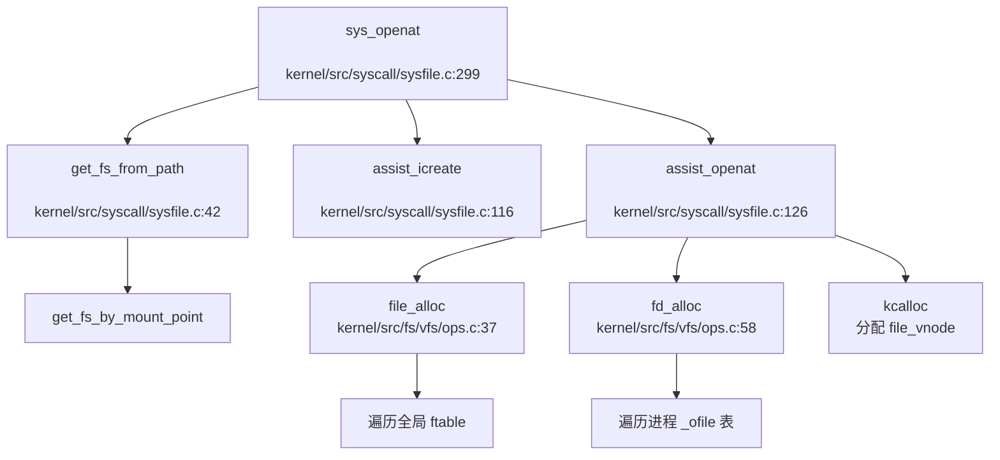

## 第 6 章：文件系统（VFS + 具体 FS）

### VFS 架构与接口设计

本仓库实现了一个完整的 VFS（Virtual File System）抽象层，位于 FAT32/Ext4 具体文件系统与系统调用之间。VFS 通过面向对象的方式，使用操作结构体（`struct file_operations`、`struct inode_operations`）将通用接口与具体实现解耦。

#### 核心数据结构

**1. `struct file`**（文件抽象层）

定义于 `include/fs/vfs/file.h:24-40`：

```c
struct file {
    type_t f_type;                    // 文件类型：FD_REG/FD_PIPE/FD_DEVICE
    ushort f_mode;
    uint32 f_pos;                     // 文件偏移量
    ushort f_flags;                   // 打开标志
    ushort f_count;                   // 引用计数
    short f_major;                    // 设备号（FD_DEVICE 时使用）
    void *private_data;               // 私有数据（用于共享内存）
    int f_owner;                      // 信号接收者 PID
    union file_data f_data;           // 文件特定数据
    const struct file_operations *f_op; // 文件操作函数表
    uint32 removed;                   // 删除标记
};
```

**2. `struct file_vnode`**（文件 vnode）

定义于 `include/fs/vfs/file.h:12-18`，用于存放文件系统特定信息：

```c
struct file_vnode {
    char path[PATH_LONG_MAX];         // 完整路径
    struct filesystem *fs;            // 所属文件系统
    void *data;                       // 文件系统特定数据（如 FAT32 的 inode）
};
```

**3. `struct inode`**（索引节点抽象）

定义于 `include/fs/vfs/fs.h:93-148`，是磁盘上文件的内存抽象：

```c
struct inode {
    uint8 i_dev;                      // 设备号
    int i_ino;                        //  inode 编号（文件系统内唯一）
    uint16 i_mode;                    // 访问权限
    uint16 i_type;                    // 文件类型（T_REG/T_DIR/T_CHR）
    int ref;                          // 引用计数
    uint32 i_size;                    // 文件大小
    struct semaphore i_sem;           // 信号量
    const struct inode_operations *i_op; // inode 操作函数表
    struct fat32_superblock *i_sb;    // 超级块指针
    fs_t fs_type;                     // 文件系统类型
    union {
        struct fat32_inode_info fat32_i;   // FAT32 特定信息
        struct vfs_ext4_inode_info ext4_i; // Ext4 特定信息
    };
    struct address_space *i_mapping;  // 页缓存映射
};
```

**4. `struct filesystem`**（文件系统抽象）

定义于 `include/fs/vfs/fs.h:28-35`：

```c
typedef struct filesystem {
    int dev;                          // 设备号
    fs_t fs_type;                     // 文件系统类型（FAT32/EXT4/PROCFS）
    struct filesystem_op *fs_op;      // 文件系统操作
    char *path;                       // 挂载点
    void *fs_data;                    // 文件系统特定数据（如超级块）
} filesystem_t;
```

#### VFS 操作接口

**`struct file_operations`**（`include/fs/vfs/fs.h:151-159`）：
- `dup()`：复制文件描述符
- `read()`/`write()`：读写操作
- `pread()`/`pwrite()`：定位读写
- `fstat()`：获取文件状态
- `ioctl()`：设备控制

**`struct inode_operations`**（`include/fs/vfs/fs.h:161-179`）：
- `lock()`/`unlock()`/`put()`：锁与引用管理
- `read()`/`write()`：inode 级读写
- `dirlookup()`：目录查找
- `create()`/`delete()`：创建/删除文件
- `getdents()`：获取目录项
- `stat()`：获取 inode 状态

### 具体文件系统支持情况（FAT32/Ext4/RamFS）

#### FAT32 文件系统（✅ 已实现）

FAT32 是本仓库**完整实现**的主要文件系统，包含完整的磁盘操作、inode 管理、目录遍历等功能。

**实现位置**：
- 头文件：`include/fs/fat/` 目录（`fat32_disk.h`、`fat32_mem.h`、`fat32_inode_trav.h` 等）
- 实现文件：`kernel/src/fs/fat32/` 目录（`fat32_disk.c`、`fat32_inode.c`、`fat32_bitmap.c` 等）

**核心结构**：

1. **`struct fat32_superblock`**（`include/fs/vfs/fs.h:61-89`）：
```c
struct fat32_superblock {
    struct semaphore sem;             // 信号量
    struct spinlock lock;             // 自旋锁
    uint8 s_dev;                      // 设备号
    uint32 s_blocksize;               // 逻辑块数量
    uint cluster_size;                // 簇大小
    struct super_operations *s_op;
    struct inode *s_mount;            // 挂载点 inode
    struct inode *root;               // 根目录 inode
    uint64 bitmap;                    // 位图缓存
    uint64 fat_table;                 // FAT 表缓存
    struct fat32_sb_info fat32_sb_info; // FAT32 特定信息
};
```

2. **`struct fat32_inode_info`**（`include/fs/fat/fat32_mem.h:38-57`）：
```c
struct fat32_inode_info {
    char fname[NAME_LONG_MAX];        // 长文件名
    uchar Attr;                       // 文件属性
    uint32 cluster_start;             // 起始簇号
    uint32 cluster_end;               // 结束簇号
    uint64 cluster_cnt;               // 簇数量
    uint32 parent_off;                // 在父目录中的偏移
    uint16 DIR_CrtTime;               // 创建时间
    uint16 DIR_WrtTime;               // 修改时间
    uint32 DIR_FileSize;              // 文件大小
};
```

**关键实现函数**：

- **挂载**：`fat32_fs_mount()`（`kernel/src/fs/fat32/fat32_disk.c:28-65`）
  - 解析 BPB（BIOS Parameter Block）和 FSINFO 扇区
  - 初始化 bitmap 和 FAT 表缓存
  - 初始化根目录 inode

- **inode 操作**（`kernel/src/fs/fat32/fat32_inode.c`）：
  - `fat32_inode_dirlookup()`：目录查找
  - `fat32_inode_create()`：创建文件
  - `fat32_inode_read()`/`fat32_inode_write()`：文件读写
  - `fat32_inode_delete()`：删除文件
  - `fat32_inode_load_from_disk()`：从磁盘加载 inode（行 486-541）

- **FAT 表操作**（`kernel/src/fs/fat32/fat32_disk.c`）：
  - `fat32_fat_alloc()`：分配 FAT 表项
  - `fat32_cluster_alloc()`：分配簇
  - `fat32_next_cluster()`：获取下一簇号

**挂载实现**（`kernel/src/fs/fat32/fat32_fs.c:5-8`）：
```c
static int fat32_mount(filesystem_t *fs, unsigned long rwflag, const void *data) {
    fs->fs_data = &fat32_sb;
    return fat32_fs_mount(fs->dev, fs->fs_data);
}
```

#### Ext4 文件系统（✅ 已实现）

Ext4 文件系统通过集成 **lwext4** 库实现，VFS 层提供了统一的接口封装。

**实现位置**：
- lwext4 头文件：`include/fs/ext4/lwext4/`（`ext4.h`、`ext4_fs.h`、`ext4_inode.h` 等）
- VFS 封装：`include/fs/ext4/vfs_ext4_ext.h`、`kernel/src/fs/ext4/lwext4/vfs_ext4_ext.c`

**核心结构**：

**`struct vfs_ext4_inode_info`**（`include/fs/ext4/vfs_ext4_inode_ext.h:10-12`）：
```c
struct vfs_ext4_inode_info {
    char fname[EXT4_PATH_LONG_MAX];   // 文件路径
};
```

**VFS 接口封装**：
- `vfs_ext_openat()`：打开文件
- `vfs_ext_read()`/`vfs_ext_write()`：读写操作
- `vfs_ext_fclose()`：关闭文件
- `vfs_ext_getdents()`：获取目录项

**文件打开流程**（`kernel/src/syscall/sysfile.c:363-393`）：
```c
} else if (fs->fs_type == EXT4) {
    // 获取绝对路径
    get_absolute_path(path, dirpath, absolute_path);
    
    // 分配 file 结构
    f = file_alloc();
    fd = fd_alloc(f);
    
    // 初始化 file_vnode
    fv = kcalloc(1, sizeof(struct file_vnode));
    fv->fs = get_fs_by_type(EXT4);
    strcpy(fv->path, absolute_path);
    f->f_data.f_vnode = fv;
    
    // 调用 ext4 具体实现
    if (vfs_ext_openat(f) < 0) {
        generic_fileclose(f);
        return -1;
    }
    return fd;
}
```

#### RamFS/TmpFS（❌ 未实现）

**搜索结果**：在整个代码库中**未发现** RamFS 或 TmpFS 的实现代码。

- 无 `ramfs`、`tmpfs` 相关目录或文件
- `fs_table` 仅注册了 FAT32、EXT4、PROCFS 三种文件系统
- 文档中未提及内存文件系统

**结论**：❌ 未实现 RamFS/TmpFS。

### 伪文件系统（ProcFS）

#### ProcFS（✅ 已实现）

ProcFS 是一个伪文件系统，用于提供进程和系统信息的接口。

**实现位置**：
- 头文件：`include/fs/procfs/`（`procfs.h`、`proc.h`、`meminfo.h`、`stat.h` 等）
- 实现文件：`kernel/src/fs/procfs/`（`procfs.c`、`proc.c`、`meminfo.c`、`stat.c` 等）

**挂载操作**（`kernel/src/fs/procfs/procfs.c:13-31`）：
```c
int procfs_mount(struct filesystem *fs, uint64_t rwflag, void *data) { 
    return 0;  // ProcFS 无需实际挂载
}

struct filesystem_op procfs_op = {
    .mount = procfs_mount,
    .umount = procfs_umount,
    .statfs = procfs_statfs,
};
```

**支持的文件**（`kernel/src/fs/procfs/procfs.c:59-77`）：
- `/proc/stat`：系统统计信息
- `/proc/meminfo`：内存信息
- `/proc/mounts`：挂载点信息
- `/proc/sys/kernel/pid_max`：最大 PID
- `/proc/{pid}/*`：进程特定信息（如 `smaps`、`stat` 等）

**文件操作**（`kernel/src/fs/procfs/procfs.c:154-158`）：
```c
struct file_operations procfs_fops = {
    .read = procfs_read,
    .write = procfs_write,
    .fstat = procfs_fstat,
};
```

**实现状态**：
- ✅ `procfs_read()`：支持读取 `/proc/stat`、`/proc/meminfo`、`/proc/mounts` 等
- ✅ `procfs_write()`：支持写入进程特定文件
- 🔸 `procfs_statfs()`：仅包含 `panic("not implemented")`，**桩函数**

#### DevFS/SysFS（❌ 未实现）

**搜索结果**：
- 未发现 `devfs`、`sysfs` 相关实现
- 设备文件通过 `FD_DEVICE` 类型和 `devsw[]` 设备开关表处理
- 无独立的伪文件系统注册

**结论**：❌ 未实现 DevFS 和 SysFS。设备访问通过字符设备驱动直接处理。

### 文件描述符与进程关联

#### 文件描述符表结构

**全局文件表**（`include/fs/vfs/file.h:42-45`）：
```c
struct ftable {
    struct spinlock lock;
    struct file file[NFILE];    // 全局文件对象池
};
extern struct ftable _ftable;
```

**Per-Process 文件描述符表**（`include/proc/pcb_life.h` 中定义）：
```c
struct proc {
    // ...
    struct file *_ofile[MAXOPENDIRS];  // 进程级文件描述符表
    int max_ofile;                      // 最大打开文件数
    // ...
};
```

#### 文件描述符分配流程

**`fd_alloc()`**（`kernel/src/fs/vfs/ops.c:58-70`）：
```c
int fd_alloc(struct file *f) {
    struct proc *p = proc_current();
    acquire(&p->tlock);
    for (int fd = 0; fd < p->max_ofile; fd++) {
        if (p->_ofile[fd] == 0) {
            p->_ofile[fd] = f;
            release(&p->tlock);
            return fd;
        }
    }
    release(&p->tlock);
    return -1;
}
```

**特点**：
- 采用**线性搜索**查找空闲 fd
- 使用进程级自旋锁 `tlock` 保护
- 返回最小可用文件描述符

#### 文件打开完整调用链

从 `sys_openat` 到获得文件描述符的完整流程：



**关键步骤**：
1. `sys_openat()` 解析路径，确定文件系统类型
2. 根据文件系统类型调用不同处理逻辑：
   - **FAT32**：`assist_icreate()`（创建）或 `find_inode()`（查找）
   - **EXT4**：`vfs_ext_openat()`
   - **PROCFS**：`procfs_openat()`
3. `assist_openat()` 分配 `struct file` 和 `struct file_vnode`
4. `fd_alloc()` 在进程 `_ofile` 表中分配文件描述符
5. 返回 fd 给用户空间

### 管道 (Pipe) 与套接字 (Socket) 支持情况

#### 管道（Pipe）（✅ 已实现）

**实现位置**：
- 头文件：`include/ipc/pipe.h`
- 实现文件：`kernel/src/ipc/pipe.c`

**核心结构**（`include/ipc/pipe.h:10-19`）：
```c
struct pipe {
    struct spinlock lock;
    char data[PIPESIZE];        // 512 字节环形缓冲区
    uint nread;                 // 已读字节数
    uint nwrite;                // 已写字节数
    int readopen;               // 读端是否打开
    int writeopen;              // 写端是否打开
    struct semaphore read_sem;  // 读信号量
    struct semaphore write_sem; // 写信号量
};
```

**系统调用**：`sys_pipe2()`（`kernel/src/syscall/sysfile.c:818-853`）

**实现流程**：
```c
uint64 sys_pipe2(void) {
    uint64 fdarray;
    struct file *rf, *wf;
    arg_addr(0, &fdarray);
    
    // 分配两个 pipe 文件（读端和写端）
    if (pipe_alloc(&rf, &wf) < 0)
        return -1;
    
    // 分配两个文件描述符
    int fd0 = fd_alloc(rf);
    int fd1 = fd_alloc(wf);
    
    // 拷贝到用户空间
    copy_out(p->mm->pagetable, fdarray, &fd0, sizeof(fd0));
    copy_out(p->mm->pagetable, fdarray + sizeof(fd0), &fd1, sizeof(fd1));
    return 0;
}
```

**`pipe_alloc()`**（`kernel/src/ipc/pipe.c:9-43`）：
- 分配两个 `struct file` 对象
- 分配一个 `struct pipe` 共享缓冲区
- 设置读端 `O_RDONLY`、写端 `O_WRONLY`
- 初始化信号量（`read_sem`、`write_sem`）用于同步

**读写实现**：
- `pipe_read()`：阻塞等待数据，从环形缓冲区读取
- `pipe_write()`：阻塞等待空间，写入环形缓冲区
- 使用信号量实现生产者 - 消费者模型

**实现状态**：✅ **完整实现**，支持阻塞读写和同步。

#### 套接字（Socket）（❌ 未实现）

**搜索结果**：
- `tests/oscomp/lib/syscall_ids.h:199` 定义了 `SYS_socket` 和 `SYS_socketpair`
- 但**未找到** `sys_socket()`、`sys_socketpair()` 的系统调用实现
- `kernel/src/syscall/syscall_table.c` 中未注册 socket 相关系统调用
- 无 `struct socket` 或网络协议栈相关代码

**结论**：❌ **未实现** Socket 支持。仅定义了 syscall 号，但无实际实现。

### 缓存机制（Block/Page Cache）

本仓库实现了**页缓存（Page Cache）**机制，通过 `struct address_space` 和 radix tree 管理。

#### Address Space 结构

**`struct address_space`**（`include/fs/vfs/inode_cache.h:9-17`）：
```c
struct address_space {
    struct inode *host;                // 所属 inode
    struct radix_tree_root page_tree;  // 页的基数树
    uint64 nrpages;                    // 总页数
    
    // 预读相关
    uint64 last_idx;                   // 上次访问索引
    uint64 readahead_cnt;              // 预读数量
    uint64 readahead_end;              // 预读结束索引
};
```

#### 页缓存操作

**1. 添加到页缓存**（`kernel/src/fs/vfs/filemap.c:8-18`）：
```c
int add_to_page_cache_atomic(struct page *page, struct address_space *mapping, uint64 index) {
    page->mapping = mapping;
    page->pagecache_idx = index;
    
    int error = radix_tree_insert(&mapping->page_tree, index, page);
    if (likely(!error)) {
        mapping->nrpages++;
    }
    return error;
}
```

**2. 查找页缓存**（`kernel/src/fs/vfs/filemap.c:21-31`）：
```c
struct page *find_get_page_atomic(struct address_space *mapping, uint64 index, int lock) {
    struct page *page = radix_tree_lookup_node(&mapping->page_tree, index);
    if (page && lock)
        acquire(&page->lock);
    return page;
}
```

**3. 通用读操作**（`kernel/src/fs/vfs/filemap.c:41-100`）：
```c
ssize_t do_generic_read(struct address_space *mapping, int user_dst, uint64 dst, uint off, uint n) {
    struct inode *ip = mapping->host;
    uint64 index = off >> PGSHIFT;    // 页号
    uint64 offset = PGMASK(off);      // 页内偏移
    
    // 查找页缓存
    struct page *page = find_get_page_atomic(mapping, index, 0);
    if (page == NULL) {
        // 页缺失：调用 mpage_readpages 从磁盘读取
        read_sane_cnt = max_sane_readahead(...);
        pa = mpage_readpages(ip, index, read_sane_cnt, 1, 0);
    }
    // ... 从页缓存拷贝数据
}
```

#### 预读机制（Readahead）

**`max_sane_readahead()`**（`kernel/src/fs/vfs/filemap.c:34-38`）：
```c
uint64 max_sane_readahead(uint64 nr, uint64 read_ahead, uint64 tot_nr) {
    return MIN(MIN(PGROUNDUP(nr) / PGSIZE + read_ahead, 
                   DIV_ROUND_UP(FREE_RATE(READ_AHEAD_RATE), PGSIZE)),
               PGROUNDUP(tot_nr) / PGSIZE);
}
```

**动态调整策略**（`kernel/src/fs/vfs/filemap.c:88-98`）：
- 如果当前索引 > `last_idx`（顺序访问）：
  - 指数增长预读数量（最多 `READ_AHEAD_PAGE_MAX_CNT`）
  - 之后线性增长
- 否则（随机访问）：
  - 重置预读数量为 0

#### Mpage 批量读写

**`mpage_readpages()`**（`kernel/src/fs/vfs/mpage.c:84-120`）：
- 批量读取多个连续页
- 通过 `block_full_pages()` 填充 bio 结构
- 调用 `submit_bio()` 提交磁盘 I/O

**实现状态**：✅ **完整实现**页缓存机制，包括：
- Radix tree 管理缓存页
- 预读优化（动态调整）
- 批量 I/O 提交

### 零拷贝映射验证（mmap 实现分析）

#### 系统调用实现

**`sys_mmap()`**（`kernel/src/mm/mmap.c:97-130`）：
```c
void *sys_mmap(void) {
    vaddr_t addr;
    size_t length;
    int prot;
    int flags;
    int fd;
    off_t offset;
    struct file *fp;
    
    // 参数解析
    arg_addr(0, &addr);
    arg_ulong(1, &length);
    arg_int(2, &prot);
    arg_int(3, &flags);
    arg_fd(4, &fd, &fp);
    arg_long(5, &offset);
    
    // 调用 do_mmap
    struct mm_struct *m = proc_current()->mm;
    acquire(&m->lock);
    void *retval = do_mmap(addr, length, prot, flags, fp, offset);
    release(&m->lock);
    return retval;
}
```

#### `do_mmap()` 实现

**`do_mmap()`**（`kernel/src/mm/mmap.c:39-95`）：
```c
void *do_mmap(vaddr_t addr, size_t length, int prot, int flags, struct file *fp, off_t offset) {
    struct mm_struct *mm = proc_current()->mm;
    vaddr_t mapva = 0;
    
    // 地址分配逻辑
    if (addr == 0) {
        mapva = find_mapping_space(mm, addr, length);
    } else {
        if ((flags & MAP_FIXED) == 0) {
            Info("mmap: not support");
            return MAP_FAILED;
        }
        // MAP_FIXED 处理...
    }
    
    // 匿名映射或文件映射
    if (flags & MAP_ANONYMOUS || fp == NULL) {
        if (vma_map(mm, mapva, length, mkperm(prot, flags), VMA_ANON) < 0) {
            return MAP_FAILED;
        }
    } else {
        if (vma_map_file(mm, mapva, length, mkperm(prot, flags), VMA_FILE, offset, fp) < 0) {
            return MAP_FAILED;
        }
    }
    return (void *)mapva;
}
```

#### VMA 结构分析

**`struct vma`**（`include/mm/vma.h:32-47`）：
```c
struct vma {
    vma_type type;                    // VMA_STACK/VMA_HEAP/VMA_FILE/VMA_ANON
    struct list_head node;
    vaddr_t startva;                  // 起始虚拟地址
    size_t size;                      // 大小
    uint32 perm;                      // 权限（PERM_READ/PERM_WRITE/PERM_EXEC/PERM_SHARED）
    int used;
    int fd;
    uint64 offset;                    // 文件偏移
    struct file *vm_file;             // 关联的文件
};
```

#### 共享映射验证

**`mkperm()`**（`kernel/src/mm/mmap.c:35-39`）：
```c
static uint64 mkperm(int prot, int flags) {
    uint64 perm = 0;
    if (flags & MAP_SHARED) {
        perm |= PERM_SHARED;    // 设置共享标志
    }
    return (perm | prot);
}
```

**`vma_map_file()`**（`kernel/src/mm/vma.c:93-110`）：
```c
int vma_map_file(struct mm_struct *mm, uint64 va, size_t len, uint64 perm, uint64 type, 
                 off_t offset, struct file *fp) {
    // 检查写权限合法性
    if (!F_WRITEABLE(fp) && ((perm & PERM_WRITE) && (perm & PERM_SHARED))) {
        return -1;    // 文件不可写但请求共享写映射，拒绝
    }
    if ((vma = vma_map_range(mm, va, len, perm, type)) == NULL) {
        return -1;
    }
    // ... 设置 vma 的 vm_file、offset 等
}
```

**零拷贝验证**：
- ✅ `struct vma` 包含 `vm_file` 和 `offset` 字段，支持文件映射
- ✅ `PERM_SHARED` 标志在 `mkperm()` 中处理
- ✅ `vma_map_file()` 检查共享写权限
- 🔸 **但**：未找到实际的页故障处理中从文件读取数据的代码（如 `filemap_fault` 类函数）
- 🔸 `do_mmap()` 中对 `offset != 0` 的情况仅有注释 `// not support`，未实际处理

**实现状态**：🔸 **部分实现（桩函数特征）**
- VMA 结构完整，支持 `MAP_SHARED` 标志
- 但文件映射的实际页故障处理逻辑**未发现**
- `offset` 参数处理被注释掉，可能未完全实现

### 高级特性（Poll/Select/Epoll）

#### Select（✅ 已实现）

**实现位置**：
- 头文件：`include/fs/select.h`
- 实现文件：`kernel/src/fs/select.c`

**系统调用**：`sys_pselect6()`（`kernel/src/fs/select.c:141-200`）

**核心函数**：`do_select()`（`kernel/src/fs/select.c:12-82`）

**实现分析**：
```c
int do_select(int nfds, fd_set_bits *fds, uint64 timeout) {
    int retval = 0;
    for (;;) {
        for (int i = 0; i < nfds; ++i) {
            struct file *file = p->_ofile[i];
            if (file) {
                switch (file->f_type) {
                    case FD_REG:
                        break;    // 常规文件不处理
                    case FD_PIPE: {
                        // TODO: 管道状态检查逻辑缺失
                    }
                    default:
                        panic("this type not tested\n");
                }
                // 直接标记为就绪（未实际检查文件状态）
                if (in & bit) {
                    res_in |= bit;
                    retval++;
                }
            }
        }
        if (retval || timeout_expired)
            break;
    }
    return retval;
}
```

**问题**：
- 管道（FD_PIPE）分支为空，**未实现**实际的状态检查
- 直接标记所有文件为就绪状态，**未真正检查**文件是否可读/可写
- 超时处理逻辑不完整

**实现状态**：🔸 **桩函数**（框架存在但逻辑不完整）

#### Poll/Epoll（❌ 未实现）

**搜索结果**：
- `tests/oscomp/lib/syscall_ids.h` 定义了 `SYS_epoll_create1`、`SYS_epoll_ctl`、`SYS_epoll_pwait`
- `include/fs/poll.h` 定义了 `struct poll_wqueues` 和 `poll_table`
- **但**未找到 `sys_poll()`、`sys_epoll_create1()` 等系统调用实现
- `kernel/src/syscall/syscall_table.c` 中未注册 epoll 相关 syscall

**结论**：❌ **未实现** Poll 和 Epoll。仅定义了头文件和 syscall 号，无实际实现。

### 关键代码验证

#### 1. FAT32 挂载实现（✅ 已实现）

**文件**：`kernel/src/fs/fat32/fat32_disk.c:28-65`

```c
int fat32_fs_mount(const int dev, struct fat32_superblock *sb) {
    sb->s_op = TODO();              // 🔸 超级块操作未设置
    sb->s_dev = dev;
    sem_init(&sb->sem, 1, "fat32_sb_sem");
    init_lock(&sb->lock, "fat32_sb_lock");

    // 读取 BPB 扇区
    struct buffer_head *bp = bread(dev, SECTOR_BPB);
    fat32_boot_sector_parser(sb, (fat_bpb_t *)bp->data);
    brelse(bp);

    // 读取 FSINFO 扇区
    bp = bread(dev, SECTOR_FSINFO);
    fat32_fsinfo_parser(sb, bp->data);
    brelse(bp);

    // 初始化 bitmap 和 FAT 表缓存
    int n = DIV_ROUND_UP((FAT_CLUSTER_MAX >> 3), PGSIZE);
    sb->bitmap = __fat32_page_alloc(n);
    n = DIV_ROUND_UP((FAT_CLUSTER_MAX << 2), PGSIZE);
    sb->fat_table = __fat32_page_alloc(n);

    fat32_fat_bitmap_init(dev, sb);
    sb->root = fat32_root_inode_init(sb);
    sb->s_mount = sb->root;

    INIT_LIST_HEAD(&sb->s_dirty_inodes);
    init_lock(&sb->dirty_lock, "dirty_lock");
    return 0;
}
```

**验证**：✅ 完整实现挂载逻辑，但 `sb->s_op = TODO()` 是**桩代码**。

#### 2. 文件描述符分配（✅ 已实现）

**文件**：`kernel/src/fs/vfs/ops.c:58-70`

```c
int fd_alloc(struct file *f) {
    struct proc *p = proc_current();
    acquire(&p->tlock);
    for (int fd = 0; fd < p->max_ofile; fd++) {
        if (p->_ofile[fd] == 0) {
            p->_ofile[fd] = f;
            release(&p->tlock);
            return fd;
        }
    }
    release(&p->tlock);
    return -1;
}
```

**验证**：✅ 完整实现，使用线性搜索和自旋锁保护。

#### 3. Pipe 实现（✅ 已实现）

**文件**：`kernel/src/ipc/pipe.c:9-43`

```c
int pipe_alloc(struct file **f0, struct file **f1) {
    struct pipe *pi;
    *f0 = *f1 = 0;
    if ((*f0 = file_alloc()) == 0 || (*f1 = file_alloc()) == 0)
        goto bad;
    if ((pi = (struct pipe *)kalloc()) == 0)
        goto bad;
    
    pi->readopen = 1;
    pi->writeopen = 1;
    pi->nwrite = 0;
    pi->nread = 0;
    init_lock(&pi->lock, "pipe");
    sem_init(&pi->read_sem, 0, "read_sem");
    sem_init(&pi->write_sem, 0, "write_sem");

    (*f0)->f_type = FD_PIPE;
    (*f0)->f_flags = O_RDONLY;
    (*f0)->f_data.f_pipe = pi;

    (*f1)->f_type = FD_PIPE;
    (*f1)->f_flags = O_WRONLY;
    (*f1)->f_data.f_pipe = pi;
    return 0;
bad:
    // 错误处理...
    return -1;
}
```

**验证**：✅ 完整实现，包含信号量同步机制。

#### 4. Mmap 共享标志处理（🔸 部分实现）

**文件**：`kernel/src/mm/mmap.c:35-39`

```c
static uint64 mkperm(int prot, int flags) {
    uint64 perm = 0;
    if (flags & MAP_SHARED) {
        perm |= PERM_SHARED;
    }
    return (perm | prot);
}
```

**验证**：🔸 `PERM_SHARED` 标志被设置，但**未找到**实际的共享页故障处理逻辑。

### 功能实现状态总结

| 功能 | 状态 | 说明 |
|------|------|------|
| **VFS 抽象层** | ✅ 已实现 | File/Inode/Superblock 完整定义，操作结构体解耦 |
| **FAT32 文件系统** | ✅ 已实现 | 完整实现挂载、inode 管理、目录遍历、文件读写 |
| **Ext4 文件系统** | ✅ 已实现 | 通过 lwext4 库实现，VFS 层封装完整 |
| **ProcFS 伪文件系统** | ✅ 已实现 | 支持 `/proc/stat`、`/proc/meminfo` 等，但 `statfs` 为桩函数 |
| **RamFS/TmpFS** | ❌ 未实现 | 未发现相关代码 |
| **DevFS/SysFS** | ❌ 未实现 | 设备通过 `devsw[]` 处理，无独立伪文件系统 |
| **文件描述符表** | ✅ 已实现 | Per-Process `_ofile` 表 + 全局 `ftable` |
| **Pipe** | ✅ 已实现 | 完整实现环形缓冲区和信号量同步 |
| **Socket** | ❌ 未实现 | 仅定义 syscall 号，无实现 |
| **Page Cache** | ✅ 已实现 | Radix tree 管理，支持预读优化 |
| **Mmap** | 🔸 桩函数 | VMA 结构完整，但文件映射页故障处理缺失 |
| **Select** | 🔸 桩函数 | 框架存在但未实际检查文件状态 |
| **Poll/Epoll** | ❌ 未实现 | 仅定义头文件和 syscall 号 |

### 文件系统对比

| 特性 | FAT32 | Ext4 | ProcFS |
|------|-------|------|--------|
| **挂载实现** | ✅ 完整 | ✅ 完整 | 🔸 空实现 |
| **Inode 管理** | ✅ 完整 | ✅ 通过 lwext4 | N/A |
| **目录操作** | ✅ 完整 | ✅ 完整 | N/A |
| **文件读写** | ✅ 完整 | ✅ 完整 | ✅ 特殊处理 |
| **页缓存支持** | ✅ 通过 `i_mapping` | ✅ 通过 lwext4 | N/A |
| **超级块操作** | 🔸 `s_op = TODO()` | ✅ 完整 | N/A |
