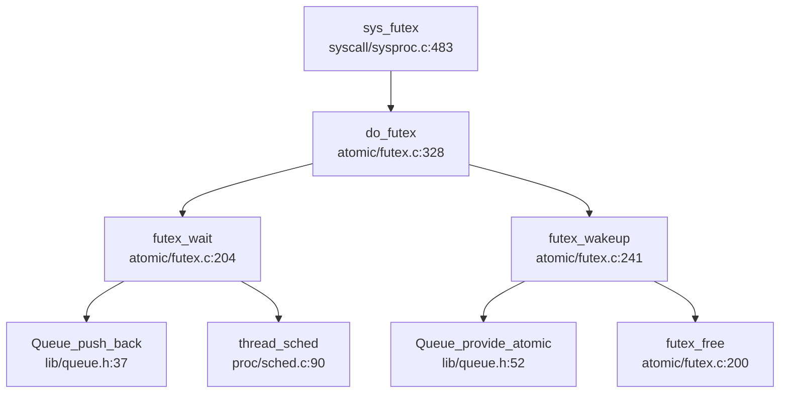

## 第 8 章：同步互斥与进程间通信

### 同步与互斥原语（锁与原子操作）

本操作系统实现了完整的同步互斥原语体系，包括自旋锁（SpinLock）、信号量（Semaphore）、条件变量（Condition Variable）和 Futex。所有原子操作均基于 RISC-V 架构的 `__sync_*` 内置函数实现。

#### 1. 自旋锁（SpinLock）实现

**实现状态：✅ 已实现**

自旋锁位于 `kernel/src/atomic/spinlock.c`，采用 RISC-V 的原子指令实现：

```c
// kernel/src/atomic/spinlock.c:14-24
void do_acquire(struct spinlock *lk) {
    push_off(); // disable interrupts to avoid deadlock.
    if (holding(lk)) {
        printf("%s\n", lk->name);
        panic("acquire");
    }
    while (__sync_lock_test_and_set(&lk->locked, 1) != 0)
        ;
    __sync_synchronize();
    lk->cpu = mycpu();
}
```

**关键特性：**
- **原子操作**：使用 `__sync_lock_test_and_set` 实现测试并设置（Test-and-Set）原子操作
- **内存屏障**：`__sync_synchronize()` 确保内存操作顺序
- **中断保护**：通过 `push_off()` 关闭中断防止死锁
- **死锁检测**：检查 `holding(lk)` 防止同一 CPU 重复获取锁
- **CPU 追踪**：记录持有锁的 CPU (`lk->cpu`)

**释放操作：**
```c
// kernel/src/atomic/spinlock.c:28-38
void do_release(struct spinlock *lk) {
    if (!holding(lk)) {
        printf("%s\n", lk->name);
        panic("release");
    }
    lk->cpu = 0;
    __sync_synchronize();
    __sync_lock_release(&lk->locked);
    pop_off();
}
```

#### 2. 信号量（Semaphore）实现

**实现状态：✅ 已实现**

信号量位于 `kernel/src/atomic/semaphore.c`，基于条件变量实现：

```c
// kernel/src/atomic/semaphore.c:11-31
void sem_p(sem *S) {
    acquire(&S->sem_lock);
    S->value--;
    if (S->value < 0) {
        do {
            cond_wait(&S->sem_cond, &S->sem_lock);
        } while (S->wakeup == 0);
        S->wakeup--;
    }
    release(&S->sem_lock);
}

void sem_v(sem *S) {
    acquire(&S->sem_lock);
    S->value++;
    if (S->value <= 0) {
        S->wakeup++;
        cond_signal(&S->sem_cond);
    }
    release(&S->sem_lock);
}
```

**PV 操作原理：**
- **P 操作（sem_p）**：value 减 1，若 value < 0 则线程进入等待队列
- **V 操作（sem_v）**：value 加 1，若 value ≤ 0 则唤醒一个等待线程
- **wakeup 计数器**：用于处理虚假唤醒（spurious wakeup）

#### 3. 条件变量（Condition Variable）实现

**实现状态：✅ 已实现**

条件变量位于 `kernel/src/atomic/cond.c`，提供 `cond_wait`、`cond_signal` 和 `cond_broadcast`：

```c
// kernel/src/atomic/cond.c:10-34
void cond_wait(struct cond *cond, struct spinlock *mutex) {
    struct tcb *t = thread_current();
    acquire(&t->lock);
    TCB_Q_changeState(t, TCB_SLEEPING);
    Queue_push_back(&cond->waiting_queue, t);
    t->wait_chan_entry = &cond->waiting_queue;
    release(mutex);
    thread_sched();
    // ... 唤醒后重新获取锁
    acquire(mutex);
}
```

**等待队列机制：**
- 使用 `Queue_push_back` 将线程加入等待队列
- 通过 `t->wait_chan_entry` 记录等待的队列指针
- 调用 `thread_sched()` 触发调度器选择其他线程运行

#### 4. 原子操作实现

**实现状态：✅ 已实现**

原子操作位于 `kernel/src/atomic/atomic.c`，使用 GCC 内置函数：

```c
// kernel/src/atomic/atomic.c:1-10
int atomic_add(atomic_t *v, int i) { return __sync_fetch_and_add(&v->counter, i); }
int atomic_sub(atomic_t *v, int i) { return __sync_fetch_and_sub(&v->counter, i); }
void set_bit(int nr, volatile uint64 *addr) { __op_bit(or, __NOP, nr, addr); }
```

**原子操作类型：**
- **加减操作**：`atomic_add`、`atomic_sub` 使用 `__sync_fetch_and_*`
- **位操作**：`set_bit`、`clear_bit`、`test_bit` 使用内联汇编

---

### 等待队列实现机制

**实现状态：✅ 已实现**

等待队列（WaitQueue）是线程阻塞/唤醒机制的核心，通过 `Queue` 结构体实现。

#### 1. 等待队列数据结构

等待队列基于 `lib/queue.h` 中的通用队列实现，支持以下操作：
- `Queue_push_back`：将线程加入队尾
- `Queue_provide_atomic`：从队首移除线程（原子操作）
- `Queue_remove_atomic`：从队列中移除指定线程
- `Queue_isempty_atomic`：检查队列是否为空

#### 2. 线程阻塞流程（以 cond_wait 为例）

```c
// kernel/src/atomic/cond.c:10-34
void cond_wait(struct cond *cond, struct spinlock *mutex) {
    struct tcb *t = thread_current();
    acquire(&t->lock);
    TCB_Q_changeState(t, TCB_SLEEPING);      // 状态改为 SLEEPING
    Queue_push_back(&cond->waiting_queue, t); // 加入等待队列
    t->wait_chan_entry = &cond->waiting_queue; // 记录等待位置
    release(mutex);                           // 释放互斥锁
    thread_sched();                           // 触发调度
    // ... 被唤醒后重新获取锁
    acquire(mutex);
}
```

**阻塞步骤：**
1. 获取线程锁 `t->lock`
2. 将线程状态改为 `TCB_SLEEPING`
3. 将线程加入等待队列
4. 设置 `t->wait_chan_entry` 指向等待队列
5. 释放原始互斥锁
6. 调用 `thread_sched()` 触发调度器

#### 3. 线程唤醒流程（以 cond_signal 为例）

```c
// kernel/src/atomic/cond.c:37-55
void cond_signal(struct cond *cond) {
    struct tcb *t;
    if (!Queue_isempty_atomic(&cond->waiting_queue)) {
        t = (struct tcb *) Queue_provide_atomic(&cond->waiting_queue, 1);
        acquire(&t->lock);
        t->wait_chan_entry = NULL;
        TCB_Q_changeState(t, TCB_RUNNABLE);  // 状态改为 RUNNABLE
        release(&t->lock);
    }
}
```

**唤醒步骤：**
1. 从等待队列中移除线程
2. 清除 `t->wait_chan_entry`
3. 将线程状态改为 `TCB_RUNNABLE`
4. 调度器会在下次调度时选择该线程运行

#### 4. 通用唤醒函数

```c
// kernel/src/proc/sched.c:70-76
void thread_wakeup(struct tcb *t) {
    ASSERT(t->wait_chan_entry != NULL);
    Queue_remove_atomic(t->wait_chan_entry, (void *)t);
    ASSERT(t->state == TCB_SLEEPING);
    t->wait_chan_entry = NULL;
    TCB_Q_changeState(t, TCB_RUNNABLE);
}
```

---

### 进程间通信（Pipe/MsgQueue/Sem）

#### 1. 管道（Pipe）实现

**实现状态：✅ 已实现**

管道位于 `kernel/src/ipc/pipe.c`，使用**环形缓冲区（Ring Buffer）**实现：

```c
// include/ipc/pipe.h:9-19
struct pipe {
    struct spinlock lock;
    char data[PIPESIZE];        // 512 字节环形缓冲区
    uint nread;                 // 已读取字节数
    uint nwrite;                // 已写入字节数
    int readopen;               // 读端是否打开
    int writeopen;              // 写端是否打开
    struct semaphore read_sem;  // 读信号量
    struct semaphore write_sem; // 写信号量
};
```

**环形缓冲区机制：**
- 缓冲区大小：`PIPESIZE = 512` 字节
- 使用 `nread % PIPESIZE` 和 `nwrite % PIPESIZE` 实现循环索引
- 空条件：`nread == nwrite`
- 满条件：`nwrite == nread + PIPESIZE`

**写操作实现：**
```c
// kernel/src/ipc/pipe.c:62-91
int pipe_write(struct pipe *pi, uint64 addr, int n) {
    int i = 0;
    acquire(&pi->lock);
    while (i < n) {
        if (pi->readopen == 0 || proc_is_killed(pr)) {
            release(&pi->lock);
            return -1;
        }
        if (pi->nwrite == pi->nread + PIPESIZE) { // 管道满
            sem_v(&pi->read_sem);
            release(&pi->lock);
            sem_p(&pi->write_sem);  // 阻塞等待
            acquire(&pi->lock);
        } else {
            char ch;
            copy_in(pr->mm->pagetable, &ch, addr + i, 1);
            pi->data[pi->nwrite++ % PIPESIZE] = ch;
            i++;
        }
    }
    sem_v(&pi->read_sem);
    release(&pi->lock);
    return i;
}
```

**读操作实现：**
```c
// kernel/src/ipc/pipe.c:93-119
int pipe_read(struct pipe *pi, uint64 addr, int n) {
    acquire(&pi->lock);
    while (pi->nread == pi->nwrite && pi->writeopen) { // 管道空
        if (proc_is_killed(pr)) {
            release(&pi->lock);
            return -1;
        }
        release(&pi->lock);
        sem_p(&pi->read_sem);  // 阻塞等待
        acquire(&pi->lock);
    }
    for (i = 0; i < n; i++) {
        if (pi->nread == pi->nwrite)
            break;
        ch = pi->data[pi->nread % PIPESIZE];
        copy_out(pr->mm->pagetable, addr + i, &ch, 1);
        ++pi->nread;
    }
    sem_v(&pi->write_sem);
    release(&pi->lock);
    return i;
}
```

**同步机制：**
- 使用 `read_sem` 和 `write_sem` 两个信号量协调读写
- 写满时写进程阻塞在 `write_sem`
- 读空时读进程阻塞在 `read_sem`

#### 2. 消息队列（MessageQueue）

**实现状态：❌ 未实现**

通过代码搜索发现：
- 系统调用号定义：`SYS_msgget = 186`、`SYS_msgsnd = 189`、`SYS_msgrcv = 188`（位于 `user/deps/syscall_ids.h`）
- **但内核中未找到 `sys_msgget`、`sys_msgsnd`、`sys_msgrcv` 的实现**
- `kernel/src/syscall/syscall_table.c` 中未注册消息队列相关系统调用

**结论**：消息队列仅有系统调用号定义，**未实现任何业务逻辑**。

#### 3. 共享内存（Shared Memory）实现

**实现状态：✅ 已实现**

共享内存位于 `kernel/src/ipc/shm.c`，通过文件系统后端实现：

```c
// kernel/src/ipc/shm.c:70-169
int new_seg(struct ipc_namespace *ns, struct ipc_params *params) {
    key_t key = params->key;
    size_t size = params->size;
    int shmflg = params->flg;
    
    // 创建共享内存段
    shp = kzalloc(sizeof(struct shmid_kernel));
    shp->shm_perm.key = key;
    shp->shm_perm.mode = (shmflg & S_IRWXUGO);
    
    // 创建后端文件
    snprintf(name, 13, "00SYSV%06d", key);
    fp = shmem_kernel_file_setup(name, size);
    
    shp->shm_segsz = size;
    shp->shm_file = fp;
    shp->shm_creator = p;
    
    id = ipc_addid(&shm_ids(ns), &shp->shm_perm, ns->shm_ctlmni);
    return id;
}
```

**关键特性：**
- **后端存储**：使用文件系统（FAT32/EXT4）作为共享内存 backing store
- **文件创建**：`shmem_kernel_file_setup()` 创建内核文件
- **内存映射**：通过 `do_shmat()` 将共享内存映射到进程地址空间

**附加操作（do_shmat）：**
```c
// kernel/src/syscall/sysipc.c:26-110
long do_shmat(int shmid, char *shmaddr, int shmflg, uint64 *raddr) {
    // 检查 shmid 有效性
    shp = shm_lock_check(ns, shmid);
    
    // 设置映射标志
    flags = MAP_SHARED | MAP_FIXED;
    prot = PROT_READ | PROT_WRITE;
    
    // 创建 VMA 并映射
    // ...
}
```

**系统调用接口：**
- `sys_shmget`：创建/获取共享内存段（✅ 已实现）
- `sys_shmat`：附加共享内存到进程地址空间（✅ 已实现）
- `sys_shmctl`：共享内存控制（🔸 部分实现，部分功能未测试）

#### 4. 信号量（System V Semaphore）

**实现状态：❌ 未实现**

通过代码搜索发现：
- 系统调用号定义：`SYS_semget = 190`、`SYS_semctl = 191`、`SYS_semop = 193`（位于 `user/deps/syscall_ids.h`）
- **但内核中未找到 `sys_semget`、`sys_semctl`、`sys_semop` 的实现**
- `kernel/src/syscall/syscall_table.c` 中未注册信号量相关系统调用

**注意**：内核中有基础的 `sem_p`/`sem_v` 函数（位于 `kernel/src/atomic/semaphore.c`），但这是**内核同步原语**，不是 POSIX/System V 信号量 IPC 机制。

**结论**：System V 信号量 IPC **未实现**。

#### 5. Futex 实现

**实现状态：✅ 已实现**

Futex（Fast Userspace Mutex）位于 `kernel/src/atomic/futex.c`，提供高效的线程同步机制。

**核心数据结构：**
```c
// kernel/src/atomic/futex.c:10-22
struct hash_table futex_hashtable = {.size = FUTEX_NUM};

struct futex {
    uint64 uaddr;
    struct Queue waiting_queue;
    struct list_head futex_list_node;
};
```

**Futex 等待流程：**
```c
// kernel/src/atomic/futex.c:204-239
int futex_wait(uint64 uaddr, uint val, struct timespec *ts) {
    // 1. 从用户空间读取 futex 值
    copy_in(p->mm->pagetable, (char *) &u_val, uaddr, sizeof(uint));
    
    // 2. 如果值匹配，进入等待
    if (u_val == val) {
        struct futex *fp = get_futex(uaddr, 0);
        struct tcb *t = thread_current();
        
        acquire(&t->lock);
        TCB_Q_changeState(t, TCB_SLEEPING);
        Queue_push_back(&fp->waiting_queue, t);
        t->wait_chan_entry = &fp->waiting_queue;
        
        release(&p->lock);
        thread_sched();  // 触发调度
        release(&t->lock);
    }
}
```

**Futex 唤醒流程：**
```c
// kernel/src/atomic/futex.c:241-280
int futex_wakeup(uint64 uaddr, int nr_wake) {
    struct futex *fp = get_futex(uaddr, 1);
    
    while (!Queue_isempty(&fp->waiting_queue) && ret < nr_wake) {
        t = (struct tcb *) Queue_provide_atomic(&fp->waiting_queue, 1);
        acquire(&t->lock);
        t->wait_chan_entry = NULL;
        TCB_Q_changeState(t, TCB_RUNNABLE);
        release(&t->lock);
        ret++;
    }
    
    if (Queue_isempty_atomic(&fp->waiting_queue)) {
        futex_free(uaddr);  // 清理空 futex
    }
    return ret;
}
```

**Futex 系统调用：**
```c
// kernel/src/syscall/sysproc.c:483-515
uint64 sys_futex() {
    arg_addr(0, &uaddr);
    arg_int(1, &futex_op);
    arg_uint(2, &val);
    
    int cmd = futex_op & FUTEX_CMD_MASK;
    switch (cmd) {
        case FUTEX_WAIT:
            ret = futex_wait(uaddr, val, ts);
            break;
        case FUTEX_WAKE:
            ret = futex_wakeup(uaddr, val);
            break;
        case FUTEX_REQUEUE:
            ret = futex_requeue(uaddr, val, uaddr2, val2);
            break;
    }
    return ret;
}
```

**Futex 调用链（Mermaid 图）：**



**支持的 Futex 操作：**
- `FUTEX_WAIT`：等待 futex 值变化
- `FUTEX_WAKE`：唤醒等待线程
- `FUTEX_REQUEUE`：将线程从一个 futex 队列迁移到另一个

#### 6. 信号（Signal）作为 IPC

**实现状态：✅ 已实现**

信号机制位于 `kernel/src/ipc/signal.c`，支持进程间信号发送。

**信号发送流程：**
```c
// kernel/src/ipc/signal.c:120-145
int signal_send(siginfo_t *info, struct tcb *t) {
    sig_t sig = info->si_signo;
    
    // 特殊信号立即标记为 killed
    if (sig == SIGKILL || sig == SIGSTOP || sig == SIGTERM) {
        t->killed = 1;
    }
    
    struct sigqueue *q = (struct sigqueue *)kalloc();
    q->info = *info;
    list_add_tail(&q->list, &t->pending.list);
    sig_add_set(t->pending.signal, sig);
    
    return 1;
}
```

**sys_kill 系统调用：**
```c
// kernel/src/syscall/sysproc.c:265-278
uint64 sys_kill(void) {
    int pid;
    sig_t signo;
    arg_int(0, &pid);
    arg_ulong(1, &signo);
    
    if (signo == 0) {
        return 0;
    }
    return proc_kill(pid, signo);
}
```

**信号处理时机：**

信号在**Trap 返回用户态前**处理，位于 `kernel/platform/qemu/src/trap.c`：

```c
// kernel/platform/qemu/src/trap.c:129
void usertrap() {
    // ... 处理中断/异常 ...
    
    if (proc_is_killed(p))
        do_exit(-1);
    
    if (which_dev == 2)
        thread_yield();
    
    // 处理待处理信号
    signal_handle(t);  // ← 信号处理点
    
    thread_user_trap_ret();  // 返回用户态
}
```

**信号处理流程：**
```c
// kernel/src/ipc/signal.c:159-195
int signal_handle(struct tcb *t) {
    if (t->sigpending == 0)
        return 0;
    
    list_for_each_entry_safe(sig_cur, sig_tmp, &t->pending.list, list) {
        int sig_no = sig_cur->info.si_signo;
        
        if (sig_ignored(t, sig_no)) {
            continue;
        }
        
        sig_act = sig_action(t, sig_no);
        if (sig_act.sa_handler == SIG_DFL) {
            signal_DFL(t, sig_no);  // 默认处理
        } else if (sig_act.sa_handler == SIG_IGN) {
            continue;  // 忽略
        } else {
            do_handle(t, sig_no, &sig_act);  // 用户自定义处理
            t->sigprocessing = sig_no;
            break;
        }
    }
    return 1;
}
```

**信号处理函数设置：**
```c
// kernel/src/ipc/signal.c:24-42
int do_sigaction(int sig, struct sigaction *act, struct sigaction *old_act) {
    struct tcb *t = thread_current();
    struct sigaction *k = &t->sig->action[sig - 1];
    
    acquire(&t->sig->siglock);
    if (old_act)
        *old_act = *k;
    
    if (act) {
        sig_del_set_mask(act->sa_mask, sig_gen_mask(SIGKILL) | sig_gen_mask(SIGSTOP));
        *k = *act;
    }
    release(&t->sig->siglock);
    return 0;
}
```

**信号处理框架：**
- **待处理队列**：`t->pending.list` 存储待处理信号
- **信号掩码**：`t->blocked` 控制哪些信号被阻塞
- **处理时机**：每次 Trap 返回用户态前调用 `signal_handle()`
- **信号帧设置**：`setup_rt_frame()` 设置用户态信号处理栈帧

---

### 关键代码片段

#### 1. SpinLock 获取与释放

```c
// kernel/src/atomic/spinlock.c:14-38
void do_acquire(struct spinlock *lk) {
    push_off(); // 关闭中断
    if (holding(lk))
        panic("acquire");
    while (__sync_lock_test_and_set(&lk->locked, 1) != 0)
        ; // 自旋等待
    __sync_synchronize(); // 内存屏障
    lk->cpu = mycpu();
}

void do_release(struct spinlock *lk) {
    if (!holding(lk))
        panic("release");
    lk->cpu = 0;
    __sync_synchronize();
    __sync_lock_release(&lk->locked);
    pop_off(); // 恢复中断
}
```

#### 2. Futex 等待/唤醒核心逻辑

```c
// kernel/src/atomic/futex.c:204-280
int futex_wait(uint64 uaddr, uint val, struct timespec *ts) {
    if (u_val == val) {
        struct futex *fp = get_futex(uaddr, 0);
        TCB_Q_changeState(t, TCB_SLEEPING);
        Queue_push_back(&fp->waiting_queue, t);
        t->wait_chan_entry = &fp->waiting_queue;
        thread_sched();
    }
}

int futex_wakeup(uint64 uaddr, int nr_wake) {
    struct futex *fp = get_futex(uaddr, 1);
    while (!Queue_isempty(&fp->waiting_queue) && ret < nr_wake) {
        t = (struct tcb *) Queue_provide_atomic(&fp->waiting_queue, 1);
        TCB_Q_changeState(t, TCB_RUNNABLE);
        ret++;
    }
    if (Queue_isempty_atomic(&fp->waiting_queue))
        futex_free(uaddr);
}
```

#### 3. Pipe 环形缓冲区读写

```c
// kernel/src/ipc/pipe.c:62-119
int pipe_write(struct pipe *pi, uint64 addr, int n) {
    while (i < n) {
        if (pi->nwrite == pi->nread + PIPESIZE) { // 满
            sem_p(&pi->write_sem); // 阻塞
        } else {
            pi->data[pi->nwrite++ % PIPESIZE] = ch;
            i++;
        }
    }
}

int pipe_read(struct pipe *pi, uint64 addr, int n) {
    while (pi->nread == pi->nwrite && pi->writeopen) { // 空
        sem_p(&pi->read_sem); // 阻塞
    }
    for (i = 0; i < n; i++) {
        ch = pi->data[pi->nread % PIPESIZE];
        ++pi->nread;
    }
}
```

#### 4. 信号处理 Trap 返回路径

```c
// kernel/platform/qemu/src/trap.c:115-135
void usertrap() {
    if (proc_is_killed(p))
        do_exit(-1);
    
    if (which_dev == 2)
        thread_yield();
    
    // 处理待处理信号 ← 关键处理点
    signal_handle(t);
    
    thread_user_trap_ret(); // 返回用户态
}
```

---

### 未实现/桩函数功能列表

| 功能 | 状态 | 说明 |
|------|------|------|
| **消息队列（MessageQueue）** | ❌ 未实现 | 仅有系统调用号定义（`SYS_msgget=186`、`SYS_msgsnd=189`、`SYS_msgrcv=188`），内核中无实现代码 |
| **System V 信号量（Semaphore IPC）** | ❌ 未实现 | 仅有系统调用号定义（`SYS_semget=190`、`SYS_semctl=191`、`SYS_semop=193`），内核中无实现代码 |
| **sys_rt_sigtimedwait** | 🔸 桩函数 | `kernel/src/syscall/sysproc.c:520` 返回 0，无实际逻辑 |
| **sys_membarrier** | 🔸 桩函数 | `kernel/src/syscall/sysproc.c:522` 返回 0，无实际逻辑 |
| **sys_sched_getscheduler** | 🔸 桩函数 | `kernel/src/syscall/sysproc.c:524` 返回 0，注释为"TODO" |
| **SHM_LOCK/SHM_UNLOCK** | 🔸 桩函数 | `kernel/src/syscall/sysipc.c:149-194` 中触发 `panic("not tested")` |
| **SHM_HUGETLB** | 🔸 桩函数 | `kernel/src/ipc/shm.c:70-169` 中触发 `panic("SHM_HUGETLB not tested")` |
| **IPC_INFO/SHM_INFO/STAT** | 🔸 桩函数 | `kernel/src/syscall/sysipc.c:12-14` 中触发 `panic("not tested")` |

**已实现功能总结：**
- ✅ SpinLock（自旋锁）
- ✅ Semaphore（内核同步信号量，非 IPC）
- ✅ Condition Variable（条件变量）
- ✅ Futex（快速用户空间互斥量）
- ✅ Pipe（管道，环形缓冲区实现）
- ✅ Shared Memory（共享内存，基于文件系统后端）
- ✅ Signal（信号，支持进程间发送和自定义处理）

**未实现功能总结：**
- ❌ Message Queue（消息队列）
- ❌ System V Semaphore（System V 信号量 IPC）
