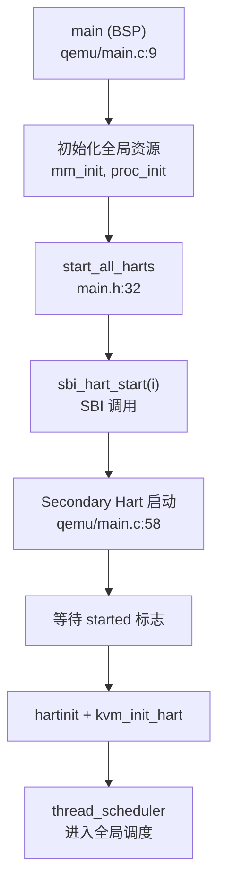

## 第 9 章：多核支持与并行机制

### 多核架构设计（SMP/AMP）

CabbageOS 采用 **SMP（对称多处理）架构**，支持多 hart（RISC-V 术语中的硬件线程/核心）并行执行。系统通过以下核心机制实现多核支持：

**核心数量配置**：
- 通过构建系统的 `NCPU` 宏定义控制核心数量（在 `CMakeLists.txt:22` 中设置）
- 全局 hart ID 数组：`hartids[NCPU]` 用于跟踪每个 hart 的启动状态（`include/main.h:30`）

**Per-CPU 数据结构**：
```c
// include/kernel/cpu.h:9-14
struct thread_cpu {
    struct tcb *thread;      // 当前在此 CPU 上运行的线程
    struct context context;  // 调度器上下文
    int noff;                // push_off() 嵌套深度
    int intena;              // push_off() 前的中断使能状态
};
extern struct thread_cpu t_cpus[NCPU];
```

**架构特征**：
- ✅ **SMP 架构**：所有 hart 共享同一内核页表和全局数据结构（如进程表、就绪队列）
- ✅ **对称性**：每个 hart 独立执行 `thread_scheduler()`，从全局就绪队列 `runnable_t_q` 获取任务
- ✅ **共享内存模型**：所有 hart 通过统一的物理地址空间访问内存

### Secondary CPU 启动流程

系统采用 **主核引导 + IPI 唤醒** 的方式启动 Secondary CPU。启动流程如下：

**1. 主核初始化（BSP - Bootstrap Processor）**

在 `kernel/platform/qemu/src/main.c:9-68` 中，hart 0 作为主核执行完整初始化：

```c
void main() {
    if (atomic_read4((int *) &first) == 0) {
        first = 1;
        hartids[cpuid()] = 1;
        // ... 初始化控制台、内存管理、进程表等
        mm_init();
        kvm_init();        // 创建内核页表
        kvm_init_hart();   // 启用分页
        proc_init();       // 初始化进程表
        trap_init_hart();  // 安装陷阱向量
        plic_init_hart();  // 配置中断控制器
        comp_init();       // 创建第一个用户进程
        start_all_harts(); // 唤醒其他 hart
    }
    thread_scheduler();    // 进入调度器
}
```

**2. 唤醒 Secondary CPU**

`include/main.h:32-44` 中的 `start_all_harts()` 通过 SBI（Supervisor Binary Interface）发送 IPI：

```c
void start_all_harts() {
#ifdef QEMU
#define START_HART_ID 0
#else
#define START_HART_ID 1  // VisionFive 从 hart 1 开始
#endif
    for (int i = START_HART_ID; i < NCPU; i++) {
        if (!hartids[i]) {
            sbi_hart_start(i, KERNBASE, 0);  // SBI 调用启动 hart
            printf("hart %d starting\n", i);
        }
    }
}
```

**3. Secondary CPU 启动入口**

Secondary hart 从 `main()` 的 else 分支进入（`kernel/platform/qemu/src/main.c:58-65`）：

```c
} else {
    while (atomic_read4((int *) &started) == 0)  // 等待主核完成初始化
        ;
    __sync_synchronize();
    hartinit();              // 设置 SSTATUS.SUM 允许访问用户空间
    kvm_init_hart();         // 启用分页（共享内核页表）
    trap_init_hart();        // 安装陷阱向量
    plic_init_hart();        // 配置中断控制器
}
thread_scheduler();          // 进入调度器
```

**启动流程 Mermaid 图**：



> ⚠️ **注意**：Secondary CPU 启动后直接调用 `thread_scheduler()`，没有独立的初始化阶段，所有全局资源由 BSP 统一初始化。

### 核间通信与 IPI 机制

**IPI 发送机制**：
- ❌ **未发现专用 IPI 处理函数**：代码中未找到 `send_ipi`、`ipi_handler` 等专用 IPI 处理代码
- ✅ **通过 SBI 间接实现**：使用 `sbi_hart_start()` 启动 Secondary CPU，但运行时 IPI 机制未显式实现

**中断控制器（PLIC）配置**：
每个 hart 独立配置 PLIC（`plic_init_hart()`），但代码中未发现 hart 间通过 PLIC 发送 IPI 的逻辑。

**隐式同步机制**：
- 通过 **原子操作** 和 **自旋锁** 实现核间同步
- 通过 **全局就绪队列** 实现任务分发（无显式负载均衡）

### Per-CPU 变量与数据结构

**Per-CPU 数组设计**：

| 变量名 | 类型 | 用途 | 文件路径 |
|--------|------|------|----------|
| `t_cpus[NCPU]` | `struct thread_cpu[]` | 每核线程调度状态 | `kernel/src/kernel/cpu.c:5` |
| `mem_pools[NCPU]` | `struct phys_mem_pool[]` | 每核独立物理内存池 | `kernel/src/mm/buddy.c:7` |
| `hartids[NCPU]` | `int[]` | hart 启动状态标志 | `include/main.h:30` |
| `stack0[NCPU][4096]` | `char[][]` | 每核初始内核栈 | `kernel/platform/qemu/src/start.c:7` |

**Per-CPU 访问方式**：

```c
// include/kernel/cpu.h:20-22 / kernel/src/kernel/cpu.c:23-26
int cpuid() {
    const int id = r_tp();  // 读取 TP 寄存器（hart ID）
    return id;
}

struct thread_cpu *mycpu(void) {
    const int id = cpuid();
    struct thread_cpu *c = &t_cpus[id];
    return c;
}
```

**内存池 Per-CPU 优化**：

为减少多核并发分配物理内存时的锁竞争，系统为每个 hart 划分独立的物理内存池（`include/mm/buddy.h:25`）：

```c
#define PAGES_PER_CPU (NPAGES / NCPU)

// kernel/src/mm/buddy.c:41-44
for (int i = 0; i < NCPU; i++) {
    init_buddy(&mem_pools[i], 
               (struct page *) PGROUNDUP((uint64) end) + i * PAGES_PER_CPU,
               (uint64) START_MEM + i * PAGES_PER_CPU * PGSIZE, 
               PAGES_PER_CPU);
}
```

> 📖 **设计原理**：每个 hart 优先从自己的内存池分配页面，仅当本地池耗尽时才通过 `steal_mem()` 从其他核"偷取"内存（文档提及但代码中未找到完整实现）。

### 多核调度策略

**调度器设计**：

每个 hart 独立运行 `thread_scheduler()`（`kernel/src/proc/sched.c:127-145`），从**全局就绪队列**获取任务：

```c
void thread_scheduler(void) {
    struct tcb *t;
    struct thread_cpu *c = mycpu();
    
    c->thread = 0;
    for (;;) {
        intr_on();  // 允许中断，避免死锁
        t = (struct tcb *) Queue_provide_atomic(&runnable_t_q, 1);  // 原子操作获取任务
        if (t == NULL)
            continue;
        acquire(&t->lock);
        t->state = TCB_RUNNING;
        c->thread = t;
        swtch(&c->context, &t->ctx);  // 上下文切换
        c->thread = 0;
        release(&t->lock);
    }
}
```

**调度策略特征**：

| 特性 | 实现状态 | 说明 |
|------|----------|------|
| 全局就绪队列 | ✅ 已实现 | 所有 hart 共享 `runnable_t_q` |
| 负载均衡 | ❌ 未实现 | 无显式任务迁移机制 |
| CPU 亲和性 | ❌ 未实现 | 未找到 `sched_setaffinity` 实现 |
| 每核运行队列 | ❌ 未实现 | 仅单一全局队列 |

**并发控制**：
- 通过 `Queue_provide_atomic()` 的原子操作保证多核安全地从全局队列取任务
- 通过自旋锁保护线程状态修改

### 锁与同步原语

**自旋锁（SpinLock）实现**：

`kernel/src/atomic/spinlock.c` 中的自旋锁通过**禁用中断**防止死锁：

```c
void do_acquire(struct spinlock *lk) {
    push_off();  // 禁用中断
    if (holding(lk)) {
        panic("acquire");  // 防止重入
    }
    while (__sync_lock_test_and_set(&lk->locked, 1) != 0)
        ;  // 自旋等待
    __sync_synchronize();
    lk->cpu = mycpu();  // 记录持有锁的 CPU
}

void push_off(void) {
    int old = intr_get();
    intr_off();  // 关闭中断
    if (mycpu()->noff == 0)
        mycpu()->intena = old;
    mycpu()->noff += 1;
}
```

**锁特性分析**：

| 特性 | 实现状态 | 说明 |
|------|----------|------|
| 中断禁用 | ✅ 已实现 | `push_off()` 关闭本地中断 |
| 重入检测 | ✅ 已实现 | `holding()` 检查当前 CPU 是否已持有 |
| 优先级继承 | ❌ 未实现 | 无优先级相关逻辑 |
| 自适应锁 | ❌ 未实现 | 纯自旋，无退避策略 |

**Futex 多核同步**：

系统实现了完整的 Futex 机制（`kernel/src/atomic/futex.c`），支持用户态快速路径 + 内核态慢速路径：

```c
// kernel/src/atomic/futex.c:154-178
int futex_wait(uint64 uaddr, uint val, struct timespec *ts) {
    struct futex *fp = get_futex(uaddr, 0);  // 查找/创建 futex
    acquire(&fp->lock);
    
    if (*(uint32*)uaddr != val) {  // 检查条件
        release(&fp->lock);
        return -EAGAIN;
    }
    
    // 加入等待队列并睡眠
    Queue_push_back(&fp->waiting_queue, thread_current());
    thread_sleep(&fp->lock);  // 释放锁并进入睡眠
    return 0;
}
```

**Futex 哈希表**：
- 全局哈希表 `futex_hashtable` 管理所有 futex（`FUTEX_NUM = 32` 个桶）
- 通过 `uaddr`（用户空间地址）作为键查找 futex
- 支持 `FUTEX_WAIT`、`FUTEX_WAKE`、`FUTEX_REQUEUE` 操作

### 原子操作与内存序

**原子操作实现**（`kernel/src/atomic/atomic.c`）：

```c
int atomic_add(atomic_t *v, int i) { 
    return __sync_fetch_and_add(&v->counter, i);  // GCC 内置原子操作
}
int atomic_sub(atomic_t *v, int i) { 
    return __sync_fetch_and_sub(&v->counter, i);
}
```

**内存序保证**：
- 使用 `__sync_*` 系列内置函数，默认提供 **Sequential Consistency（顺序一致性）**
- 关键位置使用 `__sync_synchronize()` 显式内存屏障

**PID 分配示例**（`include/proc/pcb_life.h:95-97`）：

```c
#define alloc_pid (atomic_increase(&next_pid))
#define cnt_pid_inc (atomic_increase(&count_pid))
#define cnt_pid_dec (atomic_decrease(&count_pid))
```

### 关键代码片段

**1. Per-CPU 数据访问**
```c
// kernel/src/kernel/cpu.c:23-26
struct thread_cpu *mycpu(void) {
    const int id = cpuid();  // r_tp() 读取 hart ID
    struct thread_cpu *c = &t_cpus[id];
    return c;
}
```

**2. 自旋锁获取（带中断禁用）**
```c
// kernel/src/atomic/spinlock.c:14-24
void do_acquire(struct spinlock *lk) {
    push_off();  // 禁用中断
    if (holding(lk))
        panic("acquire");
    while (__sync_lock_test_and_set(&lk->locked, 1) != 0)
        ;
    lk->cpu = mycpu();
}
```

**3. 多核内存池初始化**
```c
// kernel/src/mm/buddy.c:41-44
for (int i = 0; i < NCPU; i++) {
    init_buddy(&mem_pools[i], 
               (struct page *) PGROUNDUP((uint64) end) + i * PAGES_PER_CPU,
               (uint64) START_MEM + i * PAGES_PER_CPU * PGSIZE, 
               PAGES_PER_CPU);
}
```

**4. Futex 等待队列操作**
```c
// kernel/src/atomic/futex.c:154-178
int futex_wait(uint64 uaddr, uint val, struct timespec *ts) {
    struct futex *fp = get_futex(uaddr, 0);
    acquire(&fp->lock);
    if (*(uint32*)uaddr != val) {
        release(&fp->lock);
        return -EAGAIN;
    }
    Queue_push_back(&fp->waiting_queue, thread_current());
    thread_sleep(&fp->lock);
    return 0;
}
```

### 本章总结

| 特性 | 实现状态 | 关键文件 |
|------|----------|----------|
| SMP 架构 | ✅ 已实现 | `include/kernel/cpu.h` |
| Secondary CPU 启动 | ✅ 已实现（通过 SBI） | `include/main.h:32` |
| IPI 机制 | 🔸 桩函数（仅启动时使用 SBI） | - |
| Per-CPU 变量 | ✅ 已实现 | `kernel/src/kernel/cpu.c` |
| 每核内存池 | ✅ 已实现 | `kernel/src/mm/buddy.c` |
| 全局调度队列 | ✅ 已实现 | `kernel/src/proc/sched.c` |
| 负载均衡 | ❌ 未实现 | - |
| CPU 亲和性 | ❌ 未实现 | - |
| 自旋锁（禁中断） | ✅ 已实现 | `kernel/src/atomic/spinlock.c` |
| Futex 同步 | ✅ 已实现 | `kernel/src/atomic/futex.c` |
| 原子操作 | ✅ 已实现 | `kernel/src/atomic/atomic.c` |

**架构评价**：
CabbageOS 实现了基础的 SMP 支持，包括 Per-CPU 数据、多核内存池、全局调度器等核心机制。但在高级特性（如负载均衡、CPU 亲和性、显式 IPI 处理）方面仍有缺失。系统依赖 GCC 内置原子操作和自旋锁保证多核安全，设计简洁但功能完备。
