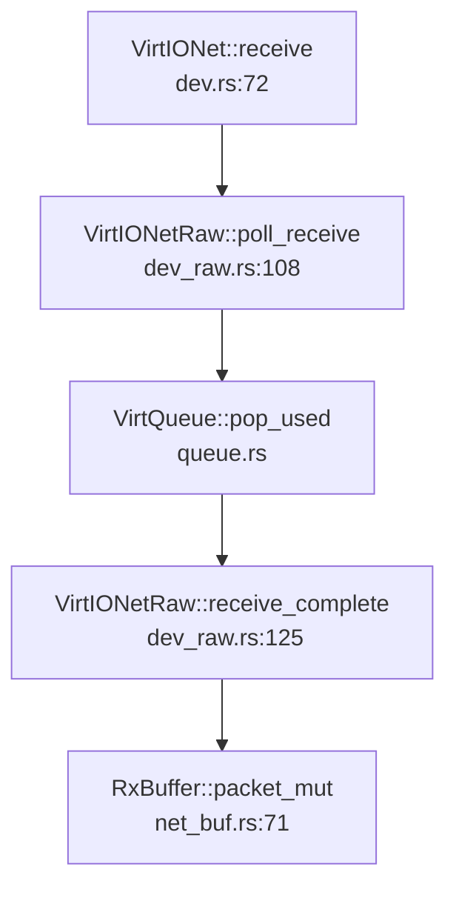
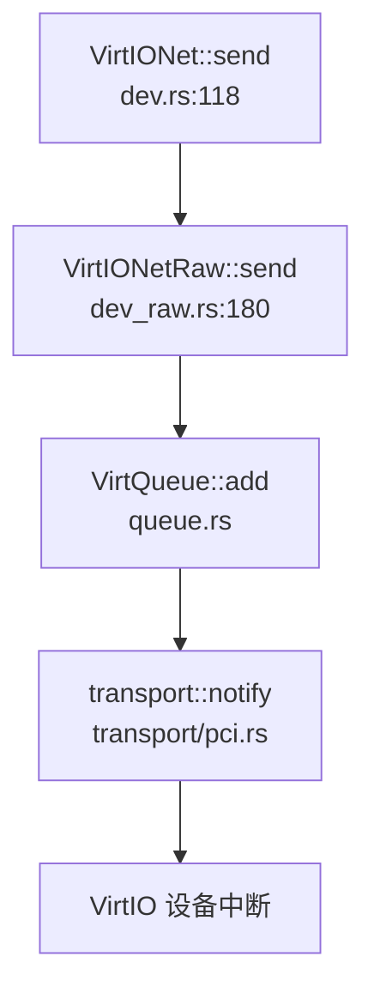

## 第 11 章：网络子系统与协议栈

### 网络子系统架构（第三方库 + 自研驱动）

本项目**未实现完整的网络子系统**。代码库中存在网络相关的驱动代码，但**缺乏操作系统层面的 Socket 系统调用支持**。

**架构组成：**

1. **VirtIO-Net 驱动**（✅ 已实现）
   - 位置：`kernel/dep/virtio-drivers/src/device/net/`
   - 文件：
     - `dev_raw.rs` (281 行) - VirtIO-Net 原始驱动，提供非阻塞的收发接口
     - `dev.rs` (125 行) - 高级封装，使用 `RxBuffer`/`TxBuffer` 进行缓冲区管理
     - `net_buf.rs` (83 行) - 网络缓冲区定义
     - `mod.rs` (157 行) - 模块导出与常量定义

2. **smoltcp 协议栈**（🔸 仅示例代码使用）
   - 位置：`kernel/dep/virtio-drivers/examples/riscv/Cargo.toml`
   - 配置：
   ```toml
   [features]
   tcp = ["smoltcp"]
   default = ["tcp"]
   
   [dependencies.smoltcp]
   version = "0.9.1"
   optional = true
   features = [
     "alloc", "log",
     "medium-ethernet",
     "proto-ipv4",
     "socket-raw", "socket-icmp", "socket-udp", "socket-tcp",
   ]
   ```
   - **重要**：`smoltcp` 仅在 `examples/` 目录的测试程序中使用，**未集成到内核**

3. **VirtIO Socket (vsock) 驱动**（✅ 已实现，但非标准网络）
   - 位置：`kernel/dep/virtio-drivers/src/device/socket/`
   - 文件：
     - `vsock.rs` (499 行) - VirtIO vsock 底层驱动
     - `connectionmanager.rs` (801 行) - 连接管理器，提供高级 API
     - `protocol.rs` (233 行) - vsock 协议定义
   - **用途**：用于虚拟机与宿主机之间的通信，**不是 TCP/IP 网络 socket**

### Socket 接口与系统调用

**❌ 未实现标准 Socket 系统调用**

通过检查 `kernel/src/syscall/syscall_table.c` 的系统调用表（共 284 个系统调用），**未发现以下关键网络系统调用**：

- `sys_socket` - 创建 socket
- `sys_bind` - 绑定地址
- `sys_connect` - 建立连接
- `sys_sendto` / `sys_recvfrom` - 数据收发
- `sys_listen` / `sys_accept` - 服务器端操作
- `sys_shutdown` - 关闭连接（存在 `sys_shutdown` 但用于共享内存）

**FD_SOCKET 类型定义：**

在 `include/common.h:22` 中定义了文件描述符类型：
```c
typedef enum { FD_NONE, FD_PIPE, FD_REG, FD_DEVICE, FD_SOCKET } type_t;
```

在 `kernel/src/fs/select.c:178,203` 中有简单的 `FD_SOCKET` 处理：
```c
case FD_SOCKET: {
    ret++;
    break;
}
```

但这**仅是桩代码**，没有实际的 socket 文件操作实现（如 `socket_read`、`socket_write` 等）。

### 协议栈支持详情（TCP/UDP/IP/Ethernet）

| 协议/特性 | 实现状态 | 说明 |
|-----------|----------|------|
| **Ethernet (VirtIO-Net)** | ✅ 已实现 | `VirtIONet` 驱动支持 VirtIO 网卡 |
| **IPv4** | 🔸 仅示例 | `smoltcp` 在 examples 中支持，未集成到内核 |
| **TCP** | 🔸 仅示例 | `smoltcp` 提供 TCP socket，但未集成 |
| **UDP** | 🔸 仅示例 | `smoltcp` 提供 UDP socket，但未集成 |
| **ICMP** | 🔸 仅示例 | `smoltcp` 支持，未集成 |
| **ARP** | ❌ 未实现 | 未发现 ARP 实现代码 |
| **DHCP** | ❌ 未实现 | 未发现 DHCP 客户端实现 |
| **DNS** | ❌ 未实现 | 未发现 DNS 解析实现 |
| **Loopback (127.0.0.1)** | ❌ 未实现 | 搜索 `loopback\|127.0.0.1` 无结果 |

**VirtIO-Net 驱动细节：**

1. **MAC 地址读取**：
   - 位置：`kernel/dep/virtio-drivers/src/device/net/dev_raw.rs:34-40`
   ```rust
   unsafe {
       mac = volread!(config, mac);
       debug!(
           "Got MAC={:02x?}, status={:?}",
           mac,
           volread!(config, status)
       );
   }
   ```

2. **收发队列**：
   - `QUEUE_RECEIVE = 0` - 接收队列
   - `QUEUE_TRANSMIT = 1` - 发送队列
   - 使用 VirtQueue 进行 DMA 描述符管理

3. **缓冲区管理**：
   - `RxBuffer`：预分配接收缓冲区，支持回收复用
   - `TxBuffer`：动态分配发送缓冲区

4. **支持的特性**（`mod.rs:23-52`）：
   - `CSUM` / `GUEST_CSUM` - 校验和卸载
   - `MAC` - MAC 地址配置
   - `STATUS` - 链路状态
   - `RING_INDIRECT_DESC` / `RING_EVENT_IDX` - VirtIO 环特性
   - **不支持**：`MQ` (多队列/RSS)、`MRG_RXBUF` (合并接收缓冲)

### 数据包收发流程追踪

**VirtIO-Net 数据接收流程**（基于 `dev.rs` 和 `dev_raw.rs`）：



**VirtIO-Net 数据发送流程**：



**smoltcp 集成示例**（`examples/riscv/src/tcp.rs:101-181`）：

```rust
pub fn test_echo_server<T: Transport>(dev: DeviceImpl<T>) {
    // 创建网络接口
    let mut iface = Interface::new(config, &mut device);
    iface.update_ip_addrs(|ip_addrs| {
        ip_addrs.push(IpCidr::new(IpAddress::from_str("10.0.2.15").unwrap(), 24)).unwrap();
    });
    
    // 创建 TCP socket
    let tcp_socket = tcp::Socket::new(tcp_rx_buffer, tcp_tx_buffer);
    let tcp_handle = sockets.add(tcp_socket);
    
    // 监听端口
    socket.listen(5555).unwrap();
    
    // 轮询处理
    iface.poll(timestamp, &mut device, &mut sockets);
}
```

**注意**：此代码仅在 `examples/` 目录中，**未集成到内核**。

### 高级特性支持验证

| 特性 | 状态 | 证据 |
|------|------|------|
| **零拷贝 (Zero Copy)** | ❌ 不支持 | 未发现 DMA 共享缓冲区或 `mbuf` 引用传递机制。`RxBuffer` 和 `TxBuffer` 使用 `Vec<u8>` 进行数据拷贝 |
| **多队列 (Multi-queue/RSS)** | ❌ 不支持 | `Features::MQ` 在 `mod.rs:47` 中定义但未启用。驱动仅使用单接收队列 + 单发送队列 |
| **DMA 描述符** | ✅ 支持 | `VirtQueue` 使用 VirtIO 标准的 DMA 描述符环（`queue.rs`） |
| **中断处理** | ✅ 支持 | `ack_interrupt()` / `enable_interrupts()` / `disable_interrupts()` |
| **链路状态检测** | ✅ 支持 | `Features::STATUS` 支持链路状态读取 |

**错误处理流程**：

在 `dev_raw.rs` 中，网络操作失败时返回 `virtio_drivers::Error`：
- `Error::NotReady` - 设备未就绪
- `Error::InvalidParam` - 参数错误（如缓冲区太小）
- `Error::WrongToken` - 描述符 token 不匹配
- `Error::QueueFull` - 队列已满

**但内核中无错误码传递机制**，因为网络系统调用未实现。

### 功能限制声明

**本项目网络功能存在以下严重限制：**

1. **❌ 无 Socket 系统调用**：用户程序无法通过 `socket()`、`connect()` 等系统调用访问网络
2. **❌ 无协议栈集成**：`smoltcp` 仅在示例代码中，未集成到内核
3. **❌ 无 Loopback 支持**：无法进行本地网络通信测试
4. **❌ 无真实网卡测试**：仅支持 QEMU VirtIO-Net 模拟设备，未发现物理网卡驱动（如 E1000、RTL8139）
5. **🔸 VirtIO-Net 驱动可用但无上层接口**：驱动代码完整，但缺乏系统调用和 VFS 集成

**总结**：本项目**未实现可用的网络子系统**。虽然存在 VirtIO-Net 驱动和 smoltcp 示例代码，但缺乏操作系统层面的 Socket API 支持，用户程序无法使用网络功能。
