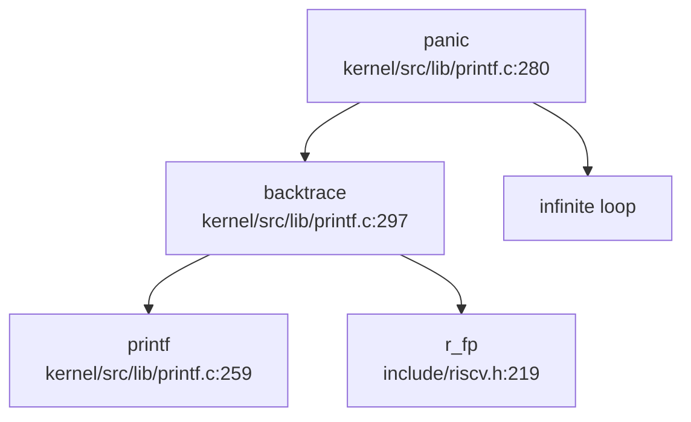

## 第 12 章：调试机制与错误处理

本章分析该 RISC-V 操作系统的调试支持、日志系统、Panic 处理、栈回溯机制以及错误处理设计。

---

## 日志与打印系统

### 打印基础设施

该系统的日志系统基于 `printf` 实现，核心文件为 `kernel/src/lib/printf.c`（362 行）。系统提供了一套完整的控制台输出机制：

```c
// kernel/src/lib/printf.c:259-278
void printf(char *fmt, ...) {
    va_list ap;
    const int locking = pr.locking;
    if (locking)
        acquire(&pr.lock);

    if (fmt == 0)
        panic("null fmt");

    va_start(ap, fmt);
    vprintf(fmt, ap);
    va_end(ap);

    if (locking)
        release(&pr.lock);
}
```

**设计特点**：
- **自旋锁保护**：使用 `pr.lock` 防止多核并发打印时输出交错
- **可变参数支持**：通过 `vprintf` 处理格式化字符串
- **空指针检查**：对 `fmt == 0` 进行断言并触发 panic

### 日志级别与宏定义

日志宏定义在 `include/debug.h` 中，提供多种颜色区分的日志级别：

```c
// include/debug.h:30-58
#define DEBUG_ACQUIRE(format, ...) printf(ANSI_FMT(format, ANSI_FG_RED), ##__VA_ARGS__)
#define DEBUG_RELEASE(format, ...) printf(ANSI_FMT(format, ANSI_FG_BLUE), ##__VA_ARGS__)

#define Log(format, ...) printf("\33[1;34m[%s,%d,%s] " format "\33[0m\n", __FILE__, __LINE__, __func__, ##__VA_ARGS__)
#define PTE(format, ...) printf(ANSI_FMT(format, ANSI_FG_GREEN), ##__VA_ARGS__)
#define VMA(format, ...) printf(ANSI_FMT(format, ANSI_FG_GREEN), ##__VA_ARGS__)

#define Info(fmt, ...) printf("[INFO] " fmt "", ##__VA_ARGS__)
#define printfRed(format, ...) printf("\33[1;31m" format "\33[0m", ##__VA_ARGS__)
#define printfGreen(format, ...) printf("\33[1;32m" format "\33[0m", ##__VA_ARGS__)
```

**日志级别分类**：
| 宏 | 颜色 | 用途 |
|---|---|---|
| `Log()` | 蓝色 | 通用日志，带文件/行号/函数信息 |
| `DEBUG_ACQUIRE` | 红色 | 锁获取调试 |
| `DEBUG_RELEASE` | 蓝色 | 锁释放调试 |
| `Info()` | 默认 | 信息性消息 |
| `PTE()`/`VMA()` | 绿色 | 内存管理专用日志 |

**实现状态**：✅ **已实现** - 完整的日志系统，支持多级别、彩色输出

---

## Panic 处理与栈回溯

### Panic 处理流程

Panic 处理函数位于 `kernel/src/lib/printf.c:280`，其调用链如下：



**Panic 实现代码**：

```c
// kernel/src/lib/printf.c:280-290
void panic(char *s) {
    pr.locking = 0;
    // print backtrace
    printf("panic: ");
    printf(s);
    printf("\n");
    backtrace();
    panicked = 1; // freeze uart output from other CPUs
    for (;;)
        ;
}
```

**处理流程**：
1. 禁用打印锁（`pr.locking = 0`），避免死锁
2. 打印 panic 消息
3. 调用 `backtrace()` 打印调用栈
4. 设置全局标志 `panicked = 1`，冻结其他 CPU 的 UART 输出
5. 进入无限循环停机

**触发来源**（通过 `lsp_get_call_graph` 分析）：
- 内核陷阱处理：`kerneltrap()` → `panic()`
- 用户陷阱异常：`thread_usertrap()` → 非法模式 → `panic()`
- 文件系统错误：`assist_icreate()`、`load_elf_interp()` 等
- 断言失败：`ASSERT()` 宏 → `panic("assert failed")`
- 进程退出路径：`do_exit()`、`exit_proc()` 等

### 栈回溯 (Backtrace) 实现

**✅ 已实现** - 基于 Frame Pointer 的栈回溯

```c
// kernel/src/lib/printf.c:297-305
void backtrace() {
    uint64 fp = r_fp();
    Log("kernel backtrace");
    while (fp < PGROUNDUP(fp) && fp > PGROUNDDOWN(fp)) {
        const uint64 last_ra = *(uint64 *) (fp - 8);
        fp = *(uint64 *) (fp - 16);
        printf("%p\n", last_ra);
    }
}
```

**实现原理**：
- 通过 `r_fp()` 读取当前帧指针（`fp` 寄存器，即 RISC-V 的 `s0`）
- 利用 RISC-V 调用约定：返回地址保存在 `fp-8`，上一帧的 `fp` 保存在 `fp-16`
- 循环遍历栈帧，打印每个返回地址（RA）
- 边界检查：`PGROUNDUP`/`PGROUNDDOWN` 确保不越界

**局限性**：
- ❌ **不支持 DWARF 解析**：未实现基于 ELF DWARF 调试信息的符号解析
- ❌ **仅打印地址**：输出为原始地址（如 `0x80001234`），无函数名/源文件信息
- ✅ **基于 FramePointer**：依赖编译时 `-fno-omit-frame-pointer` 选项

**寄存器 Dump 支持**：

```c
// kernel/platform/qemu/src/trap.c:347-363
void print_trapframe(struct trapframe *tf) {
    printf("Trapframe :\n");
    printf("sp: %lx\n", tf->sp);
    printf("fp: %lx\n", tf->s0);
    printf("pc: %lx\n", tf->epc);
    printf("ra: %lx\n", tf->ra);
    printf("a0: %lx\n", tf->a0);
    // ... 打印 a1-a7, s3 等寄存器
}
```

**调用场景**：`thread_usertrap()` 在检测到非法模式时调用 `print_trapframe()` 后 panic。

---

## 错误码与 Result 设计

### 错误码定义

该系统采用 C 语言风格的全局错误码（`errno`），定义在 `include/errno.h`：

```c
// include/errno.h:1-47
#define EPERM 1      /* Operation not permitted */
#define ESRCH 3      /* No such process */
#define EINTR 4      /* Interrupted system call */
#define EINVAL 22    /* Invalid argument */
#define ENOSPC 28    /* No space left on device */
#define EACCES 13    /* Permission denied */
#define ENOENT 2     /* No such file or directory */
#define EEXIST 17    /* File exists */
#define EBADF 9      /* Bad file number */
#define EFAULT 14    /* Bad address */
#define ENOMEM 12    /* Out of memory */
#define ENODEV 19    /* No such device */
#define ENOTDIR 20   /* Not a directory */
// ... 共约 40+ 个错误码
```

**设计特点**：
- **POSIX 兼容**：错误码编号与 Linux/POSIX 标准一致
- **返回值约定**：系统调用返回负值表示错误（如 `-EINVAL`）
- **无 Result 类型**：C 语言实现，未采用 Rust 风格的 `Result<T, E>` 类型

### 错误处理模式

系统调用统一返回 `uint64`，负值表示错误：

```c
// kernel/src/syscall/sysmisc.c:258-271
uint64 sys_syslog(void) {
    int priority;
    uint64 addr;
    arg_int(0, &priority);
    arg_addr(1, &addr);

    char buf[128];
    if (copy_in(proc_current()->mm->pagetable, buf, addr, sizeof(buf)) < 0) {
        return -1;  // 返回 -1 表示错误
    }

    Log("%s", buf);
    return 0;
}
```

**实现状态**：✅ **已实现** - 完整的 POSIX 风格错误码系统

---

## 调试接口与交互式 Shell

### 交互式 Shell

**❌ 未发现内核级交互式 Shell/Monitor**

通过以下搜索确认：
- `grep "monitor|shell|debug_console"`：仅找到用户态 shell（`user/bin/sh.c`）和构建脚本中的引用
- 无内核命令解析器（如 `ps`、`ls`、`help` 等命令的内核实现）

**用户态 Shell**：
- `user/bin/sh.c`（532 行）：提供用户态命令行解释器
- 支持执行 `/bin/*` 下的工具（`cat`、`ls`、`grep` 等）
- **非调试 Monitor**：这是用户程序，非内核调试接口

### 调试控制台

**🔸 桩函数** - 通过 `sys_syslog` 提供有限的日志接口

```c
// kernel/src/syscall/sysmisc.c:258-271
uint64 sys_syslog(void) {
    // ... 从用户空间复制字符串
    Log("%s", buf);
    return 0;
}
```

**功能限制**：
- 仅支持打印用户传入的字符串
- 无内核日志读取接口（如 Linux 的 `dmesg`）
- 无动态调试级别控制

---

## GDB Stub 支持情况

### GDB 调试支持

**❌ 未实现 GDB Stub**

**证据**：
1. `grep "gdbstub|gdb_stub|handle_gdb_packet"`：**未找到任何匹配**
2. 无 GDB 数据包解析循环（`$`/`#` 协议处理）
3. 无寄存器读写、内存访问、断点设置等 GDB 远程协议实现

**外部 GDB 支持**（通过 QEMU）：
- ✅ **QEMU GDB 桩**：`scripts/qemu-gdb.sh` 提供 QEMU 内置 GDB 服务器
  ```bash
  # scripts/qemu-gdb.sh:14-18
  if $QEMU -help | grep -q '^-gdb'; then
      QEMUGDB="-gdb tcp::$GDBPORT"
  else
      QEMUGDB="-s -p $GDBPORT"
  fi
  ```
- ✅ **GDB 初始化**：`.gdbinit` 配置 RISC-V 架构
  ```
  set confirm off
  set architecture riscv:rv64
  set disassemble-next-line auto
  ```

**结论**：系统本身**未实现 GDB Stub**，依赖 QEMU 模拟器提供的 GDB 服务器进行调试。

---

## 断言与运行时检查

### 断言宏

**✅ 已实现** - `ASSERT` 宏定义在 `include/debug.h:34-39`：

```c
// include/debug.h:34-39
#define ASSERT(cond)                                                                                                   \
    do {                                                                                                               \
        if (!(cond)) {                                                                                                 \
            printf("\33[1;31m[%s,%d,%s] ASSERT: \"" #cond "\" failed \t \33[0m", __FILE__, __LINE__, __func__);        \
            panic("assert failed");                                                                                    \
        }                                                                                                              \
    } while (0)
```

**特性**：
- 打印失败位置：文件、行号、函数名
- 彩色输出（红色）
- 触发 `panic("assert failed")` 停机

**使用示例**（文档中的实际使用）：
```c
// doc/fs/optimize.md:162
ASSERT(off > 0);
// doc/mm/mm.md:187
ASSERT(page == NULL);
```

### TODO 宏

**🔸 桩函数** - 定义在 `include/debug.h:61`：

```c
#define TODO() 0
```

**实际使用**（代码中的未完成功能）：
```c
// kernel/src/syscall/sysfile.c:149-150
f->f_flags = flags; // TODO(): &
f->f_mode = omode; // TODO(): &
// kernel/src/fs/fat32/fat32_disk.c:30
sb->s_op = TODO();
```

### 运行时检查

**✅ 已实现** - 包括：
- **空指针检查**：`printf` 中 `if (fmt == 0) panic("null fmt")`
- **页边界检查**：`backtrace()` 中的 `PGROUNDUP`/`PGROUNDDOWN`
- **锁状态检查**：`kerneltrap()` 中 `if (intr_get() != 0) panic("interrupts enabled")`

---

## 性能分析工具支持

### Perf/Ftrace 支持

**❌ 未实现**

**搜索结果**：
- `grep "perf|ftrace|tracepoint"`：仅找到 `SYS_perf_event_open` 的系统调用号定义（来自测试框架）
- 无实际 `perf_event_open` 系统调用实现
- 无内核 Tracepoints 基础设施
- 无函数追踪（function tracer）或动态探针（kprobe）

### 系统调用追踪

**🔸 部分支持** - 通过 `Log` 宏手动插入日志

代码中广泛使用 `Log()` 宏记录关键路径（如页表操作、VMA 管理），但这是**静态日志**，非动态追踪。

---

## 关键代码片段

### Panic 与 Backtrace 完整实现

```c
// kernel/src/lib/printf.c:280-305
void panic(char *s) {
    pr.locking = 0;
    printf("panic: ");
    printf(s);
    printf("\n");
    backtrace();
    panicked = 1;
    for (;;)
        ;
}

void backtrace() {
    uint64 fp = r_fp();
    Log("kernel backtrace");
    while (fp < PGROUNDUP(fp) && fp > PGROUNDDOWN(fp)) {
        const uint64 last_ra = *(uint64 *) (fp - 8);
        fp = *(uint64 *) (fp - 16);
        printf("%p\n", last_ra);
    }
}

// include/riscv.h:219-223
static inline uint64 r_fp() {
    uint64 x;
    asm volatile("mv %0, fp" : "=r"(x));
    return x;
}
```

### 异常处理流程

```c
// kernel/platform/qemu/src/trap.c:189-212
void kerneltrap() {
    uint64 scause = r_scause();
    
    if ((sstatus & SSTATUS_SPP) == 0)
        panic("kerneltrap: not from supervisor mode");
    if (intr_get() != 0)
        panic("kerneltrap: interrupts enabled");

    if ((which_dev = devintr()) == 0) {
        backtrace();  // 打印调用栈
        printf("scause %p\n", scause);
        printf("sepc=%p stval=%p\n", r_sepc(), r_stval());
        panic("kerneltrap");  // 未处理异常 → panic
    }
    // ... 处理定时器/设备中断
}
```

---

## 本章总结

| 功能模块 | 实现状态 | 说明 |
|---------|---------|------|
| 日志系统 | ✅ 已实现 | 多级彩色日志，`Log()`/`Info()` 等宏 |
| Panic 处理 | ✅ 已实现 | 打印消息 + 栈回溯 + 停机 |
| 栈回溯 | ✅ 已实现（基础） | 基于 FramePointer，仅打印地址，无符号解析 |
| DWARF 解析 | ❌ 未实现 | 无函数名/源文件信息 |
| 错误码 | ✅ 已实现 | POSIX 兼容 errno，40+ 错误码 |
| 交互式 Shell | ❌ 未实现 | 仅用户态 shell，无内核 Monitor |
| GDB Stub | ❌ 未实现 | 依赖 QEMU 外部 GDB 服务器 |
| Perf/Ftrace | ❌ 未实现 | 无动态追踪基础设施 |
| 断言宏 | ✅ 已实现 | `ASSERT()` 带位置信息 |
| TODO 桩 | 🔸 桩函数 | `TODO()` 返回 0，标记未完成功能 |

**整体评价**：该系统提供了**基础的调试能力**（日志、panic、基础栈回溯），但**缺乏高级调试功能**（符号级 backtrace、GDB stub、性能分析工具）。调试主要依赖 QEMU 模拟器和串口日志输出。
