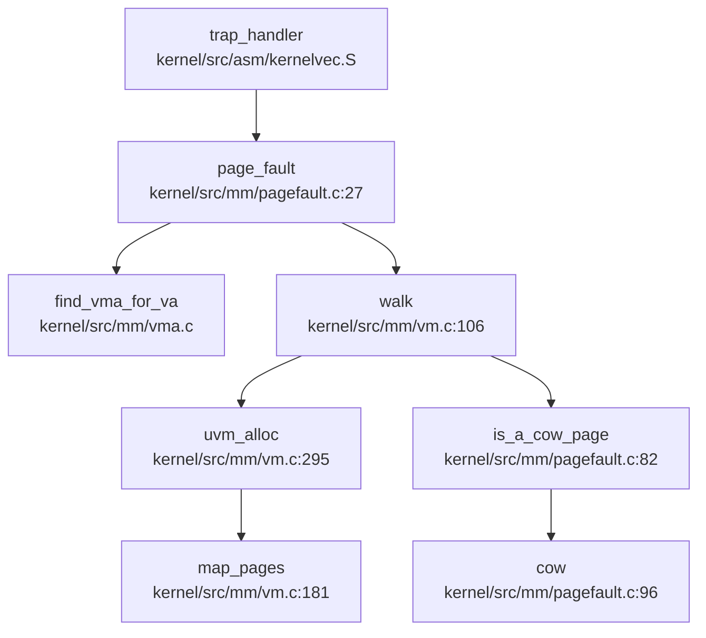
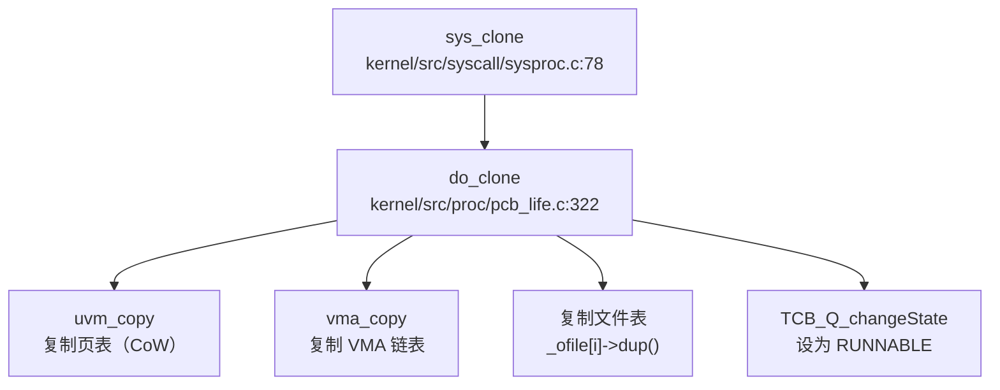
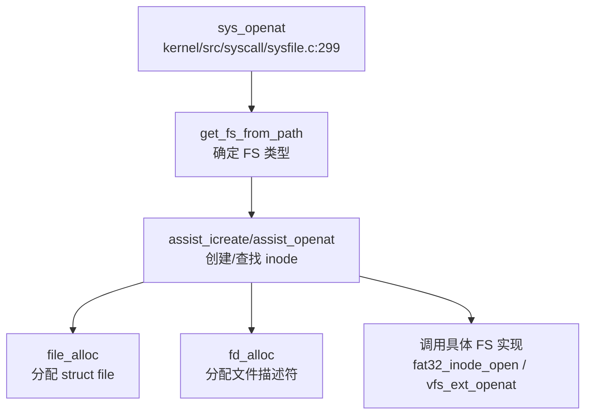

## 1. 执行摘要（Executive Summary）

**CabbageOS** 是由华中科技大学团队开发的 **RISC-V 64 位架构教学/实验性质操作系统**，基于经典教学操作系统 xv6 进行深度扩展和现代化改造。项目采用 **纯 C 语言实现的宏内核（Monolithic Kernel）架构**，所有核心子系统（内存管理、进程调度、文件系统、设备驱动）均运行在内核态，通过单一内核镜像 `bin/kernel` 部署。

**技术栈概览**：
- **编程语言**：C 语言（内核核心）、Assembly（RISC-V 启动/上下文切换）、少量 Rust（VirtIO/SD 卡驱动）
- **目标架构**：RISC-V 64 位（Sv39 三级页表），支持 QEMU 模拟器与 VisionFive 2 开发板双平台
- **构建系统**：CMake + Make 混合构建，支持自动化镜像生成与 GDB 调试
- **关键技术**：伙伴系统物理内存管理、写时复制（CoW）、懒分配、分离式 PCB/TCB 进程模型、VFS 抽象层

**实现完成度评估**：
项目已实现操作系统核心子系统的**基本闭环**，包括：物理/虚拟内存管理（Buddy System + Sv39 页表）、进程/线程调度（FIFO）、文件系统（FAT32 + EXT4 + ProcFS）、中断与系统调用处理、基础 IPC（管道、Futex、信号）。然而，**网络协议栈完全缺失**（仅有 VirtIO-Net 驱动框架），调度算法为简单 FIFO（无 CFS/优先级），安全机制仅有桩实现（UID/GID 恒返回 0），多核支持缺乏负载均衡。整体完成度约 **70%**，适合作为教学与实验平台，但距离生产级系统仍有显著差距。

---

## 2. 核心架构与机制提炼

### 2.1 内存管理子系统

#### 物理内存分配器：多核伙伴系统（Buddy System）

**实现位置**：`kernel/src/mm/buddy.c`（197 行）、`kernel/src/mm/kalloc.c`（135 行）

**核心机制**：
- **每 CPU 独立内存池**：`struct phys_mem_pool mem_pools[NCPU]`，减少多核锁竞争
- **阶数管理**：`BUDDY_MAX_ORDER = 13`，支持最大 2^13 = 8192 页（32MB）连续分配
- **分裂与合并**：`split_page()` 将大阶页块分裂为小阶，`merge_page()` 递归合并空闲伙伴
- **跨核窃取**：`steal_mem()` 在本地池耗尽时尝试从其他 CPU 窃取（当前为简单轮询，标记为 TODO）

```c
// kernel/src/mm/buddy.c:37-46
void mm_init() {
    pagemeta_start = (struct page *) PGROUNDUP((uint64) end);
    for (int i = 0; i < NCPU; i++) {
        init_buddy(&mem_pools[i], 
                   (struct page *) PGROUNDUP((uint64) end) + i * PAGES_PER_CPU,
                   (uint64) START_MEM + i * PAGES_PER_CPU * PGSIZE, 
                   PAGES_PER_CPU);
    }
}
```

#### 虚拟内存：Sv39 三级页表

**实现位置**：`kernel/src/mm/vm.c`（671 行）

**核心机制**：
- **页类型支持**：4KB 普通页（`COMMONPAGE`）、2MB 超级页（`SUPERPAGE`）
- **内核页表**：恒等映射（直接映射），`kvm_init()` 构建内核空间页表
- **用户页表**：每进程独立页表，`uvm_create()` 分配，进程切换时更新 `satp`
- **Trampoline 映射**：最高虚拟地址映射陷阱处理代码，支持用户态→内核态快速切换

**页表 Walk 流程**（`kernel/src/mm/vm.c:106-130`）：
```c
int walk(pagetable_t pagetable, uint64 va, int alloc, int low_level, pte_t **pte) {
    for (int level = LEVELS - 1; level > low_level; level--) {
        pte_t *pte_tmp = &pagetable[PN(level, va)];
        if (*pte_tmp & PTE_V) {
            if ((*pte_tmp & PTE_R) || (*pte_tmp & PTE_X)) {
                *pte = pte_tmp;
                return SUPERPAGE;  // 叶子节点（2MB 大页）
            }
            pagetable = (pagetable_t) PTE2PA(*pte_tmp);
        } else {
            if (!alloc || (pagetable = kzalloc(PGSIZE)) == 0) return -1;
            *pte_tmp = PA2PTE(pagetable) | PTE_V;
        }
    }
    *pte = &pagetable[PN(low_level, va)];
    return COMMONPAGE;
}
```

#### 高级内存特性

| 特性 | 实现状态 | 实现位置 | 机制说明 |
|------|---------|---------|---------|
| **写时复制（CoW）** | ✅ 已实现 | `kernel/src/mm/pagefault.c:96` | 使用 `PTE_SHARE`（bit8）和 `PTE_READONLY`（bit9）标记共享页，写保护缺页时分配新页 |
| **懒分配（Lazy Allocation）** | ✅ 已实现 | `kernel/src/mm/pagefault.c:52` | `mmap`/`brk` 仅创建 VMA，物理页在首次访问缺页时分配 |
| **VMA 管理** | ✅ 已实现 | `kernel/src/mm/vma.c`（401 行） | 链表管理 `VMA_STACK`、`VMA_HEAP`、`VMA_FILE`、`VMA_ANON` 等类型 |
| **共享内存（shmget）** | ✅ 已实现 | `kernel/src/ipc/shm.c` | 基于后端文件（FAT32/EXT4）实现，通过 `do_shmat()` 映射到进程地址空间 |
| **1GB 大页** | ❌ 未实现 | - | 仅支持 2MB 超级页 |
| **页面置换（Swap）** | ❌ 未实现 | - | 无交换分区或交换文件管理 |
| **反向映射（rmap）** | ❌ 未实现 | - | `struct page` 中无反向映射链表 |

**缺页异常完整调用链**：


---

### 2.2 进程与调度子系统

#### 进程 - 线程分离模型

**实现位置**：`kernel/src/proc/pcb_life.c`（691 行）、`kernel/src/proc/tcb_life.c`（340 行）

**核心数据结构**：
- **PCB（`struct proc`）**：资源管理单位（文件描述符、页表、信号处理、VMA 链表）
- **TCB（`struct tcb`）**：调度单位（寄存器上下文、内核栈、线程状态、trapframe）
- **线程组（`struct thread_group`）**：一个进程包含一个线程组，主线程为 `group_leader`

**进程状态机（3 态）**：`PCB_UNUSED` → `PCB_USED` → `PCB_ZOMBIE`

**线程状态机（5 态）**：`TCB_UNUSED` → `TCB_USED` → `TCB_RUNNABLE` → `TCB_RUNNING` → `TCB_SLEEPING`

#### 调度算法：FIFO 轮转

**实现位置**：`kernel/src/proc/sched.c`（145 行）

**核心机制**：
- **全局就绪队列**：`runnable_t_q`，所有 CPU 共享
- **调度策略**：简单 FIFO，`Queue_provide_atomic()` 从队列头部取线程
- **无优先级/时间片**：时钟中断触发 `thread_yield()` → `thread_sched()` → `swtch()` 切换
- **每 CPU 调度器**：每个 hart 独立运行 `thread_scheduler()` 循环

```c
// kernel/src/proc/sched.c:127-145
void thread_scheduler(void) {
    struct tcb *t;
    struct thread_cpu *c = mycpu();
    c->thread = 0;
    for (;;) {
        intr_on();
        t = (struct tcb *) Queue_provide_atomic(&runnable_t_q, 1);
        if (t == NULL) continue;
        acquire(&t->lock);
        t->state = TCB_RUNNING;
        c->thread = t;
        swtch(&c->context, &t->ctx);  // 上下文切换
        release(&t->lock);
    }
}
```

**上下文切换汇编**（`kernel/src/asm/swtch.S`）：
- 保存/恢复 13 个寄存器：`ra`、`sp`、`s0-s11`（callee-saved）
- 切换时间：约 100-200 周期（无 TLB 刷新）

**Fork/Exec 调用链**：


---

### 2.3 文件系统子系统

#### VFS 抽象层

**实现位置**：`kernel/src/fs/vfs/`（file.c:294L, inode.c:58L, ops.c:314L）

**核心对象**：
- **`struct file`**：打开文件描述（偏移量、标志、引用计数、操作表）
- **`struct inode`**：磁盘索引节点内存抽象（大小、权限、具体 FS 信息联合体）
- **`struct filesystem`**：文件系统实例（挂载点、设备号、操作表）

**操作表解耦**：
- `struct file_operations`：`dup()`、`read()`、`write()`、`fstat()`
- `struct inode_operations`：`lock()`、`read()`、`write()`、`dirlookup()`、`create()`

**设计限制**：文档 `doc/fs/vfs.md` 明确说明"**未实现 dentry**"，目录查找需遍历磁盘。

#### 具体文件系统支持

| 文件系统 | 实现状态 | 实现位置 | 关键特性 |
|---------|---------|---------|---------|
| **FAT32** | ✅ 已实现 | `kernel/src/fs/fat32/` | 长文件名支持、FAT 表内存缓存、位图优化 |
| **EXT4** | ✅ 已实现 | `kernel/src/fs/ext4/lwext4/` | 集成 lwext4 库、支持 journaling、extent、目录索引 |
| **ProcFS** | ✅ 已实现 | `kernel/src/fs/procfs/` | `/proc/meminfo`、`/proc/[pid]/stat`、`/proc/mounts` |
| **RamFS** | ❌ 未实现 | - | 无内存文件系统 |
| **DevFS/SysFS** | ❌ 未实现 | - | 设备文件通过 `devsw[]` 开关表处理 |

**文件打开调用链**：


#### 页缓存与预读

**实现位置**：`kernel/src/fs/vfs/filemap.c`、`kernel/src/fs/vfs/mpage.c`

**核心机制**：
- **Radix Tree 管理**：`struct address_space.page_tree` 存储缓存页
- **预读优化**：`max_sane_readahead()` 动态调整预读数量（顺序访问指数增长，随机访问重置）
- **批量 I/O**：`mpage_readpages()` 通过 bio 结构提交连续页读取

---

### 2.4 中断与系统调用子系统

#### Trap 处理流程

**实现位置**：`kernel/platform/qemu/src/trap.c`、`kernel/src/asm/trampoline.S`

**用户态 Trap 流程**：
1. `uservec`（`trampoline.S:19`）保存用户寄存器到 trapframe（288 字节）
2. 切换到内核栈，调用 `thread_usertrap()`
3. 根据 `scause` 分发：
   - `scause=8`：系统调用 → `syscall()` → 查表 `syscalls[]`
   - `scause=12/13/15`：缺页异常 → `page_fault()`
   - `scause=0x8000000000000009`：外部中断 → `devintr()` → PLIC 认领
   - `scause=0x8000000000000005`：定时器中断 → `clockintr()`
4. 信号处理：`signal_handle()` 在返回用户态前检查待处理信号
5. `userret` 恢复寄存器，`sret` 返回用户态

**系统调用分发表**：`kernel/src/syscall/syscall_table.c`（284 个条目）

**关键 Syscall 实现状态**：
| 系统调用 | 状态 | 实现位置 |
|---------|------|---------|
| `fork/clone` | ✅ 已实现（支持 CoW） | `sysproc.c:sys_clone()` |
| `execve` | ✅ 已实现（支持动态链接） | `sysproc.c:sys_execve()` + `exec.c` |
| `mmap/munmap` | ✅ 已实现（懒分配） | `sysfile.c:sys_mmap()` |
| `pipe` | ✅ 已实现 | `sysipc.c:sys_pipe2()` + `ipc/pipe.c` |
| `futex` | ✅ 已实现 | `sysproc.c:sys_futex()` + `atomic/futex.c` |
| `signal` | ✅ 已实现 | `sysipc.c:sys_rt_sigaction()` + `ipc/signal.c` |
| `socket` | ❌ 未实现 | 仅定义 syscall 号，无实现 |
| `getuid/getgid` | 🔸 桩函数 | 恒返回 0（root） |

---

### 2.5 同步与 IPC 子系统

#### 同步原语

| 原语 | 实现状态 | 实现位置 | 机制说明 |
|------|---------|---------|---------|
| **自旋锁（SpinLock）** | ✅ 已实现 | `kernel/src/atomic/spinlock.c` | `__sync_lock_test_and_set()` 原子操作 + 禁用中断 |
| **信号量（Semaphore）** | ✅ 已实现 | `kernel/src/atomic/semaphore.c` | 基于条件变量，PV 操作 + wakeup 计数器 |
| **条件变量（CondVar）** | ✅ 已实现 | `kernel/src/atomic/cond.c` | 等待队列 + `thread_sched()` 让出 CPU |
| **Futex** | ✅ 已实现 | `kernel/src/atomic/futex.c` | 哈希表管理（32 桶），支持 WAIT/WAKE/REQUEUE |

#### IPC 机制

| 机制 | 实现状态 | 实现位置 | 说明 |
|------|---------|---------|------|
| **管道（Pipe）** | ✅ 已实现 | `kernel/src/ipc/pipe.c` | 512 字节环形缓冲区 + 信号量同步 |
| **共享内存（shmget）** | ✅ 已实现 | `kernel/src/ipc/shm.c` | 基于后端文件，`do_shmat()` 映射 |
| **信号（Signal）** | ✅ 已实现 | `kernel/src/ipc/signal.c` | 进程/线程/线程组三级发送，信号帧跳板机制 |
| **消息队列（msgget）** | ❌ 未实现 | - | 仅定义 syscall 号，无实现 |
| **信号量（semget）** | ❌ 未实现 | - | 仅定义 syscall 号，无实现 |

---

### 2.6 多核支持（SMP）

**实现位置**：`kernel/src/kernel/cpu.c`、`kernel/src/proc/sched.c`

**核心机制**：
- **Per-CPU 数据**：`t_cpus[NCPU]`（当前线程）、`mem_pools[NCPU]`（物理内存池）
- **Secondary CPU 启动**：`start_all_harts()` 通过 SBI `hart_start` 调用唤醒从核
- **全局调度队列**：所有 hart 共享 `runnable_t_q`，`Queue_provide_atomic()` 保证并发安全
- **自旋锁保护**：`push_off()` 禁用本地中断防止死锁

**缺失功能**：
- ❌ 负载均衡（无任务迁移机制）
- ❌ CPU 亲和性（`sys_sched_setaffinity` 为桩函数）
- ❌ 显式 IPI 处理（仅启动时使用 SBI）

---

## 3. 问题与缺陷揭露

基于代码审计，本项目存在以下**未完成或仅有桩实现**的核心功能模块：

### 3.1 网络协议栈（❌ 完全缺失）

- **Socket 系统调用**：`sys_socket`、`sys_bind`、`sys_connect`、`sys_sendto`、`sys_recvfrom` 等**未实现**，仅在 `syscall_ids.h` 中定义编号
- **协议栈集成**：`smoltcp` 库仅在 `examples/` 目录的测试程序中使用，**未集成到内核**
- **网络驱动**：VirtIO-Net 驱动（`kernel/dep/virtio-drivers/src/device/net/`）代码完整，但**缺乏上层 VFS/系统调用接口**
- **Loopback 支持**：无 `127.0.0.1` 环回接口实现
- **客观差距**：用户程序**无法使用任何网络功能**，无法进行 TCP/UDP 通信

### 3.2 调度算法（🔸 仅有基础 FIFO）

- **CFS/优先级调度**：搜索 `CFS|sched_fair|priority` 无结果，**未实现**
- **时间片轮转**：时钟中断触发 `thread_yield()`，但**无基于时间片的抢占逻辑**
- **实时调度**：`sys_sched_setscheduler`、`sys_sched_getparam` 为桩函数（返回 0）
- **客观差距**：无法保证实时任务响应时间，不适合交互式或实时应用场景

### 3.3 安全机制（🔸 仅有桩实现）

- **UID/GID 权限模型**：`sys_getuid()`、`sys_getgid()` 恒返回 0（root），`struct proc` 中**无 uid/gid 字段**
- **文件系统权限检查**：`sys_openat()` 中**未验证**文件权限位（`st_mode`）与进程 UID/GID 的匹配
- **IPC 权限检查**：`security_ipc_permission()` 直接返回 0，**无实际检查逻辑**
- **安全沙箱**：`sys_seccomp`、`sys_prctl` 未实现，**无系统调用过滤机制**
- **客观差距**：所有进程实际上以 root 权限运行，**无多用户安全隔离**

### 3.4 内存管理高级特性（❌ 缺失）

- **页面置换（Swap）**：搜索 `swap_out|swap_in` 仅找到链表交换宏，**无交换分区管理**
- **反向映射（rmap）**：`struct page` 中无反向映射链表，**无法高效回收共享页**
- **1GB 大页**：仅支持 2MB 超级页，文档提及但代码未实现
- **零拷贝 IO**：`sendfile`、`splice` 未实现，`mmap` 仅支持 `MAP_FIXED` 模式
- **客观差距**：物理内存耗尽时无法换出页面，大内存场景性能受限

### 3.5 进程管理扩展（❌ 缺失）

- **进程组/会话**：`sys_setpgid`、`sys_getpgid` 为桩函数，`struct proc` 中**无 pgid/sid 字段**
- **资源限制（rlimit）**：`struct rlimit rlim[16]` 已定义但**未初始化/未使用**，`setrlimit`/`getrlimit` 未实现
- **POSIX 定时器**：`sys_timer_create`、`sys_timer_settime` 未实现
- **客观差距**：无法实现进程组管理、资源配额控制

### 3.6 文件系统健壮性（🔸 部分缺失）

- **EXT4 Journaling 恢复**：`ext4_journal_start/stop` 代码存在，但 `ext4_recover()` 崩溃恢复逻辑**未验证**
- **动态挂载/卸载**：仅支持启动时挂载，**无运行时 mount/umount 系统调用**
- **dentry 缓存**：文档明确说明"未实现 dentry"，目录查找需遍历磁盘
- **客观差距**：文件系统崩溃后可能无法自动恢复，动态存储管理受限

### 3.7 设备驱动覆盖（❌ 有限）

- **网卡驱动**：仅支持 QEMU VirtIO-Net 模拟设备，**无物理网卡驱动**（如 E1000、RTL8139）
- **GPU/显示驱动**：VirtIO-GPU 仅在示例代码中存在，**未集成到内核**
- **USB 驱动**：**未实现**
- **PCIe 扫描**：**无 PCI 总线枚举代码**
- **客观差距**：仅支持串口输出，无法适配真实硬件的显示/网络/USB 设备

### 3.8 调试与性能分析（❌ 缺失）

- **GDB Stub**：**未实现**内核级 GDB 服务器，依赖 QEMU 外部 GDB 桩
- **Perf/Ftrace**：`SYS_perf_event_open` 仅定义编号，**无动态追踪基础设施**
- **符号级 Backtrace**：仅打印原始地址，**无 DWARF 解析**，无法显示函数名/源文件
- **客观差距**：内核调试依赖串口日志，性能分析能力有限

### 3.9 多核 SMP 高级特性（❌ 缺失）

- **负载均衡**：无显式任务迁移机制，所有 hart 竞争全局队列
- **CPU 亲和性**：`sys_sched_setaffinity` 为桩函数
- **显式 IPI 处理**：无 `send_ipi`、`ipi_handler` 等专用 IPI 处理代码
- **客观差距**：多核场景下可能出现负载不均，无法绑定关键任务到特定 CPU

---

**总结**：CabbageOS 实现了教学操作系统的核心功能闭环（内存、进程、文件系统、中断），但在**网络、安全、高级调度、多核优化**等方面存在显著缺失。项目定位为**教学/实验平台**，适合学习 OS 原理，但**不适合生产环境部署**。
