# T202410487992577-3161 操作系统技术分析报告

> **仓库地址**: https://gitlab.eduxiji.net/educg-group-26010-2376550/T202410487992577-3161
> **分析日期**: 2026年03月15日
> **分析工具**: OS-Agent-D

---

## 仓库目录文件结构

```bash
T202410487992577-3161/
├── kernel/
│   ├── deps/
│   │   └── sdcard/
│   │       ├── src/
│   │       │   ├── visionfive2_sd/
│   │       │   │   ├── cmd.rs (70L, 1.8KB)
│   │       │   │   ├── register.rs (557L, 19.4KB)
│   │       │   │   ├── sd.rs (587L, 19.0KB)
│   │       │   │   └── utils.rs (82L, 2.2KB)
│   │       │   ├── lib.rs (107L, 2.8KB)
│   │       │   └── visionfive2_sd.rs (4L, 60B)
│   │       ├── Cargo.lock (789B)
│   │       └── Cargo.toml (21L, 432B)
│   ├── include/
│   │   ├── driver/
│   │   │   ├── dmac.h (1470L, 45.7KB)
│   │   │   ├── fpioa.h (1035L, 51.7KB)
│   │   │   ├── gpiohs.h (268L, 7.7KB)
│   │   │   ├── sbi.h (120L, 3.9KB)
│   │   │   ├── sdcard.h (12L, 221B)
│   │   │   ├── spi.h (510L, 18.5KB)
│   │   │   ├── uart.h (6L, 121B)
│   │   │   └── virtio.h (85L, 2.8KB)
│   │   ├── fs/
│   │   │   ├── ext4/
│   │   │   │   ├── misc/
│   │   │   │   │   ├── queue.h (702L, 24.0KB)
│   │   │   │   │   └── tree.h (809L, 27.7KB)
│   │   │   │   ├── ext4.h (622L, 18.7KB)
│   │   │   │   ├── ext4_balloc.h (120L, 3.9KB)
│   │   │   │   ├── ext4_bcache.h (281L, 9.0KB)
│   │   │   │   ├── ext4_bitmap.h (103L, 3.2KB)
│   │   │   │   ├── ext4_block_group.h (304L, 10.9KB)
│   │   │   │   ├── ext4_blockdev.h (274L, 10.2KB)
│   │   │   │   ├── ext4_config.h (182L, 5.6KB)
│   │   │   │   ├── ext4_crc32.h (72L, 2.3KB)
│   │   │   │   ├── ext4_debug.h (192L, 5.7KB)
│   │   │   │   ├── ext4_dir.h (301L, 9.1KB)
│   │   │   │   ├── ext4_dir_idx.h (112L, 3.6KB)
│   │   │   │   ├── ext4_errno.h (95L, 3.0KB)
│   │   │   │   ├── ext4_extent.h (74L, 2.5KB)
│   │   │   │   ├── ext4_fs.h (279L, 8.9KB)
│   │   │   │   ├── ext4_hash.h (76L, 2.4KB)
│   │   │   │   ├── ext4_ialloc.h (85L, 2.9KB)
│   │   │   │   ├── ext4_inode.h (354L, 11.2KB)
│   │   │   │   ├── ext4_journal.h (139L, 4.4KB)
│   │   │   │   ├── ext4_mbr.h (73L, 2.3KB)
│   │   │   │   ├── ext4_misc.h (156L, 4.9KB)
│   │   │   │   ├── ext4_mkfs.h (85L, 2.5KB)
│   │   │   │   ├── ext4_oflags.h (103L, 2.6KB)
│   │   │   │   ├── ext4_super.h (238L, 7.6KB)
│   │   │   │   ├── ext4_trans.h (90L, 3.1KB)
│   │   │   │   ├── ext4_types.h (832L, 29.4KB)
│   │   │   │   └── ext4_xattr.h (108L, 3.3KB)
│   │   │   ├── buf.h (125L, 3.6KB)
│   │   │   ├── defs.h (244L, 6.9KB)
│   │   │   ├── disk.h (12L, 230B)
│   │   │   ├── fat32.h (87L, 2.7KB)
│   │   │   ├── fcntl.h (18L, 379B)
│   │   │   ├── file.h (62L, 1.6KB)
│   │   │   ├── sd_final.h (265L, 12.4KB)
│   │   │   ├── sdcard.h (12L, 213B)
│   │   │   └── stat.h (50L, 1.1KB)
│   │   ├── ipc/
│   │   │   └── signal.h (80L, 2.9KB)
│   │   ├── mm/
│   │   │   ├── memlayout.h (116L, 3.6KB)
│   │   │   ├── mmap.h (31L, 696B)
│   │   │   ├── vm.h (39L, 1.6KB)
│   │   │   └── vma.h (40L, 1.3KB)
│   │   ├── proc/
│   │   │   ├── kalloc.h (12L, 195B)
│   │   │   ├── pipe.h (24L, 632B)
│   │   │   ├── proc.h (151L, 4.9KB)
│   │   │   └── thread.h (51L, 1.3KB)
│   │   ├── sys/
│   │   │   ├── console.h (8L, 128B)
│   │   │   ├── context.h (26L, 336B)
│   │   │   ├── elf.h (86L, 1.8KB)
│   │   │   ├── fcntl.h (9L, 222B)
│   │   │   ├── intr.h (9L, 114B)
│   │   │   ├── param.h (25L, 1.1KB)
│   │   │   ├── plic.h (101L, 5.8KB)
│   │   │   ├── riscv.h (285L, 7.4KB)
│   │   │   ├── syscall.h (14L, 315B)
│   │   │   ├── sysctl.h (1039L, 28.6KB)
│   │   │   ├── sysinfo.h (27L, 980B)
│   │   │   ├── sysnum.h (104L, 2.5KB)
│   │   │   ├── trap.h (60L, 2.0KB)
│   │   │   ├── types.h (41L, 1020B)
│   │   │   └── uname.h (14L, 313B)
│   │   ├── utils/
│   │   │   ├── futex.h (30L, 743B)
│   │   │   ├── printf.h (19L, 318B)
│   │   │   ├── queue.h (202L, 8.4KB)
│   │   │   ├── sleeplock.h (24L, 575B)
│   │   │   ├── spinlock.h (30L, 644B)
│   │   │   ├── string.h (29L, 1.0KB)
│   │   │   ├── timer.h (36L, 630B)
│   │   │   └── utils.h (371L, 11.9KB)
│   │   └── change.py (21L, 788B)
│   ├── src/
│   │   ├── driver/
│   │   │   ├── dmac.c (332L, 10.6KB)
│   │   │   ├── fpioa.c (4936L, 93.1KB)
│   │   │   ├── gpiohs.c (205L, 5.8KB)
│   │   │   ├── spi.c (520L, 16.9KB)
│   │   │   ├── uart.c (184L, 5.1KB)
│   │   │   └── virtio_disk.c (337L, 10.1KB)
│   │   ├── fs/
│   │   │   ├── ext4/
│   │   │   │   ├── CMakeLists.txt (595B)
│   │   │   │   ├── change.py (21L, 788B)
│   │   │   │   ├── ext4.c (3054L, 82.6KB)
│   │   │   │   ├── ext4_balloc.c (640L, 21.2KB)
│   │   │   │   ├── ext4_bcache.c (303L, 9.3KB)
│   │   │   │   ├── ext4_bitmap.c (162L, 3.5KB)
│   │   │   │   ├── ext4_block_group.c (94L, 4.3KB)
│   │   │   │   ├── ext4_blockdev.c (468L, 13.4KB)
│   │   │   │   ├── ext4_crc32.c (184L, 9.8KB)
│   │   │   │   ├── ext4_debug.c (66L, 2.0KB)
│   │   │   │   ├── ext4_dir.c (666L, 22.7KB)
│   │   │   │   ├── ext4_dir_idx.c (1321L, 45.7KB)
│   │   │   │   ├── ext4_extent.c (1957L, 66.5KB)
│   │   │   │   ├── ext4_fs.c (1657L, 57.0KB)
│   │   │   │   ├── ext4_hash.c (327L, 9.0KB)
│   │   │   │   ├── ext4_ialloc.c (370L, 10.5KB)
│   │   │   │   ├── ext4_inode.c (356L, 11.7KB)
│   │   │   │   ├── ext4_journal.c (1952L, 69.4KB)
│   │   │   │   ├── ext4_mbr.c (208L, 5.8KB)
│   │   │   │   ├── ext4_mkfs.c (766L, 25.8KB)
│   │   │   │   ├── ext4_super.c (235L, 7.7KB)
│   │   │   │   ├── ext4_trans.c (97L, 3.3KB)
│   │   │   │   └── ext4_xattr.c (1564L, 41.7KB)
│   │   │   ├── bio.c (1181L, 39.0KB)
│   │   │   ├── disk.c (175L, 4.6KB)
│   │   │   ├── fat32.c (1075L, 33.2KB)
│   │   │   ├── file.c (548L, 15.2KB)
│   │   │   ├── fs.c (88L, 2.5KB)
│   │   │   ├── sd_final.c (603L, 16.8KB)
│   │   │   ├── sdcard.c (461L, 11.7KB)
│   │   │   └── sysfile.c (1390L, 38.3KB)
│   │   ├── ipc/
│   │   │   ├── signal.c (78L, 2.4KB)
│   │   │   ├── signal_trampoline.S (6L, 120B)
│   │   │   └── syssignal.c (112L, 2.9KB)
│   │   ├── mm/
│   │   │   ├── mmap.c (66L, 2.1KB)
│   │   │   └── vm.c (625L, 19.2KB)
│   │   ├── proc/
│   │   │   ├── exec.c (639L, 19.9KB)
│   │   │   ├── kalloc.c (175L, 4.3KB)
│   │   │   ├── pipe.c (114L, 3.2KB)
│   │   │   ├── proc.c (1430L, 42.4KB)
│   │   │   ├── swtch.S (42L, 836B)
│   │   │   ├── sysproc.c (672L, 18.4KB)
│   │   │   └── thread.c (56L, 1.5KB)
│   │   ├── sys/
│   │   │   ├── console.c (181L, 4.4KB)
│   │   │   ├── entry_qemu.S (19L, 314B)
│   │   │   ├── intr.c (39L, 1.2KB)
│   │   │   ├── kernelvec.S (86L, 2.0KB)
│   │   │   ├── plic.c (63L, 1.5KB)
│   │   │   ├── syscall.c (364L, 10.3KB)
│   │   │   ├── sysctl.c (314L, 8.5KB)
│   │   │   ├── sysmisc.c (61L, 1.6KB)
│   │   │   ├── trampoline.S (147L, 3.7KB)
│   │   │   └── trap.c (271L, 8.0KB)
│   │   ├── utils/
│   │   │   ├── futex.c (79L, 2.2KB)
│   │   │   ├── printf.c (238L, 6.0KB)
│   │   │   ├── sleeplock.c (43L, 893B)
│   │   │   ├── spinlock.c (73L, 2.2KB)
│   │   │   ├── string.c (178L, 3.8KB)
│   │   │   ├── timer.c (62L, 1.4KB)
│   │   │   └── utils.c (24L, 711B)
│   │   ├── bin.S (12L, 267B)
│   │   └── main.c (101L, 2.8KB)
│   └── xv6-riscv-license (1.2KB)
├── linker/
│   ├── qemu.ld (1.2KB)
│   └── visionfive.ld (1.3KB)
├── scripts/
│   ├── README.md (1L, 84B)
│   ├── git_clone.sh (374B)
│   ├── git_fetch.sh (316B)
│   ├── git_pull.sh (315B)
│   ├── git_push.sh (317B)
│   └── recover_img_status.sh (127B)
├── tools/
│   ├── addr2line.py (22L, 728B)
│   ├── cmd.txt (130B)
│   └── writecode.py (33L, 623B)
├── xv6-user/
│   ├── busybox_test (74.8KB)
│   ├── busybox_test.c (798L, 34.1KB)
│   ├── cat.c (37L, 737B)
│   ├── clone.S (34L, 584B)
│   ├── echo.c (15L, 304B)
│   ├── fcntl.h (14L, 273B)
│   ├── find.c (54L, 1.2KB)
│   ├── forktest.c (43L, 822B)
│   ├── grading_init.c (27L, 502B)
│   ├── grep.c (87L, 2.2KB)
│   ├── grind.c (326L, 9.3KB)
│   ├── init-for-test.S (629L, 10.0KB)
│   ├── init.c (48L, 1.2KB)
│   ├── initcode.S (28L, 444B)
│   ├── kill.c (12L, 240B)
│   ├── ln.c (11L, 274B)
│   ├── ls.c (53L, 1.1KB)
│   ├── mkdir.c (19L, 374B)
│   ├── modify_file_name.sh (115B)
│   ├── mv.c (53L, 1.5KB)
│   ├── myDup3.c (11L, 204B)
│   ├── printf.c (95L, 2.3KB)
│   ├── riscv.h (285L, 7.4KB)
│   ├── rm.c (18L, 343B)
│   ├── sh.c (555L, 12.8KB)
│   ├── stddef.h (287L, 7.9KB)
│   ├── strace.c (23L, 564B)
│   ├── stressfs.c (43L, 1.0KB)
│   ├── syscall.h (101L, 3.8KB)
│   ├── test_futex.c (9L, 197B)
│   ├── test_signal.c (66L, 1.5KB)
│   ├── time-test.c (43L, 955B)
│   ├── ulib.c (157L, 3.3KB)
│   ├── umalloc.c (77L, 1.8KB)
│   ├── unistd.c (193L, 5.9KB)
│   ├── user.h (63L, 1.9KB)
│   ├── usys.pl (809B)
│   ├── wc.c (48L, 1.0KB)
│   ├── xargs.c (59L, 1.4KB)
│   ├── xargstest.sh (99B)
│   ├── xv6-riscv-license (1.2KB)
│   └── zombie.c (9L, 188B)
├── .clang-format (375B)
├── .gitignore (804B)
├── CMakeLists.txt (5.4KB)
├── LICENSE (1.1KB)
├── Makefile (4.9KB)
├── README (2.1KB)
├── README.md (20L, 289B)
├── compile_flags.txt (763B)
├── os_all_in_one.sh (604B)
├── process.py (20L, 794B)
├── process_ano.py (21L, 968B)
├── remake.sh (215B)
└── taskList.md (137L, 3.5KB)

根目录文档: README, README.md, taskList.md

📊 统计: 28 个目录, 221 个文件 (深度限制: 10 层)
```

---

# 第 14 章：执行摘要与总结评价

## 1. 执行摘要（Executive Summary）

本项目为 **xv6-riscv**，一个基于 MIT xv6 教学操作系统的 RISC-V 移植版本，采用**宏内核（Monolithic Kernel）**架构。项目定位明确为**教学/实验性操作系统**，而非生产级系统。

**技术栈概览**：
- **编程语言**：C (C99/C11) 为主，89 个内核源文件；少量 Rust 仅用于 SD 卡驱动
- **目标架构**：`riscv64gc-unknown-none-elf`（RISC-V 64 位，Sv39 分页）
- **支持平台**：QEMU virt（默认）+ StarFive VisionFive 2（可选）
- **构建系统**：Makefile + CMake 混合构建
- **代码规模**：内核约 25,000 行 C 代码 + 用户空间约 6,000 行

**实现完成度评估**：
| 子系统 | 完成度 | 说明 |
|--------|--------|------|
| 进程/线程管理 | ✅ 85% | 基础调度、fork/exec 完整，无 CFS/优先级 |
| 内存管理 | ✅ 70% | 物理分配、页表、mmap 完整，无 CoW/Lazy |
| 文件系统 | ✅ 90% | EXT4/FAT32 完整，VFS 简化 |
| 设备驱动 | ✅ 80% | UART/VirtIO/SD 卡完整，无网络驱动 |
| 中断/系统调用 | ✅ 75% | ~70 个 syscall 注册，约 18 个核心实现 |
| 进程间通信 | ✅ 60% | Pipe/Futex/Signal 完整，无 System V IPC |
| 多核支持 | ❌ 20% | 仅单核运行，SMP 启动逻辑缺陷 |
| 网络协议栈 | ❌ 0% | 完全未实现 |
| 安全机制 | ❌ 30% | UID/GID 字段存在，无权限检查 |

**总体评价**：核心子系统（进程、内存、文件系统）形成闭环，可运行 BusyBox 测试集；但网络、多核、高级 IPC、安全机制等模块存在明显空白，符合教学 OS 定位。

---

## 2. 核心架构与机制提炼

### 2.1 内存管理架构

#### 物理内存分配器
- **算法**：空闲链表（Free List），非 Buddy/Slab
- **实现文件**：`kernel/src/proc/kalloc.c`
- **核心接口**：`kalloc()` / `kfree()` / `kinit()`
- **并发保护**：自旋锁 `kmem.lock`
- **特性**：仅支持整页（4KB）分配，`kmalloc()` 为多页包装器

```c
// kernel/src/proc/kalloc.c:87-98
void *kalloc(void) {
    acquire(&kmem.lock);
    struct run *r = kmem.freelist;
    if (r) kmem.freelist = r->next;
    release(&kmem.lock);
    return (void *)r;
}
```

#### 虚拟内存与页表
- **分页方案**：RISC-V Sv39 三级页表（39 位虚拟地址，512GB 空间）
- **实现文件**：`kernel/src/mm/vm.c`
- **核心函数**：`walk()`（页表遍历）、`mappages()`（批量映射）、`uvmcopy()`（fork 复制）
- **地址空间布局**：
  - 用户空间：`0` 到 `sz`（代码/数据/堆）
  - 内核空间：`KERNBASE` 到 `MAXVA`（Direct Map 偏移 `0x3F00000000`）
  - Trampoline 页：`MAXVA - PGSIZE`（用户/内核态切换跳板）

```c
// kernel/src/mm/vm.c:173-190
int mappages(pagetable_t pgtb, uint64 va, uint64 sz, uint64 pa, int perm) {
    perm |= PTE_D | PTE_A;  // 强制设置访问/脏位
    for (uint64 a = PGROUNDDOWN(va); a <= lst; a += PGSIZE, pa += PGSIZE) {
        pte_t *pte = walk(pgtb, a, 1);
        *pte = PTE_V | PA2PTE(pa) | perm;
    }
}
```

#### 堆与 VMA 管理
- **用户堆**：基于 `sbrk`/`brk` 系统调用，`xv6-user/umalloc.c` 实现 `malloc()`/`free()`
- **VMA 结构**：`kernel/include/mm/vma.h` 定义双向链表管理内存区域（MMAP/STACK）
- **mmap 实现**：`kernel/src/mm/mmap.c` 支持文件/匿名映射，但**预分配物理页**（非惰性）
- **munmap**：🔸 桩函数（仅返回 0）

### 2.2 进程调度模型

#### 进程 - 线程双层结构
- **PCB**：`struct proc`（`kernel/include/proc/proc.h:55-95`），含 PID、状态、页表、文件表、VMA 链表
- **TCB**：`struct thread`（`kernel/include/proc/thread.h:20-50`），含 TID、上下文、陷阱帧
- **关系**：每个 `proc` 维护线程链表 `thread_queue`，`main_thread` 指向当前执行线程

#### 调度器实现
- **算法**：简单轮转（Round-Robin），无优先级、无时间片
- **实现文件**：`kernel/src/proc/proc.c:805-867`
- **调度策略**：遍历 `proc[NPROC]` 数组，选择第一个 `RUNNABLE` 进程的头部线程
- **空闲等待**：无进程可运行时执行 `wfi`（Wait For Interrupt）

```c
// kernel/src/proc/proc.c:805-850
void scheduler(void) {
    for (struct proc *p = proc; p < &proc[NPROC]; p++) {
        if (p->state == RUNNABLE) {
            thread *t = p->thread_queue;
            while (t && t->state != t_RUNNABLE) t = t->next_thread;
            if (t) {
                p->main_thread = t;
                swtch(&c->context, &p->context);  // 上下文切换
            }
        }
    }
    if (!found) asm volatile("wfi");
}
```

#### 上下文切换
- **汇编实现**：`kernel/src/proc/swtch.S`（42 行）
- **保存寄存器**：`ra`, `sp`, `s0-s11`（14 个 callee-saved 寄存器，112 字节）
- **切换流程**：保存旧 `context` → 加载新 `context` → `ret` 跳转

### 2.3 Trap 处理路径

#### 用户态 → 内核态切换
- **入口**：`kernel/src/sys/trampoline.S:uservec`（通过 `stvec` 寄存器指向）
- **流程**：
  1. 保存 32 个用户寄存器到 `trapframe`（288 字节）
  2. 切换到内核页表（`satp` 寄存器）
  3. 跳转到 `usertrap()`（C 语言处理）

#### 系统调用分发
- **触发**：用户执行 `ecall` 指令，`scause = 8`
- **分发器**：`kernel/src/sys/syscall.c:syscall()`
- **分发表**：`syscalls[]` 数组（约 70 个条目）
- **参数传递**：通过 `trapframe->a0-a7` 寄存器

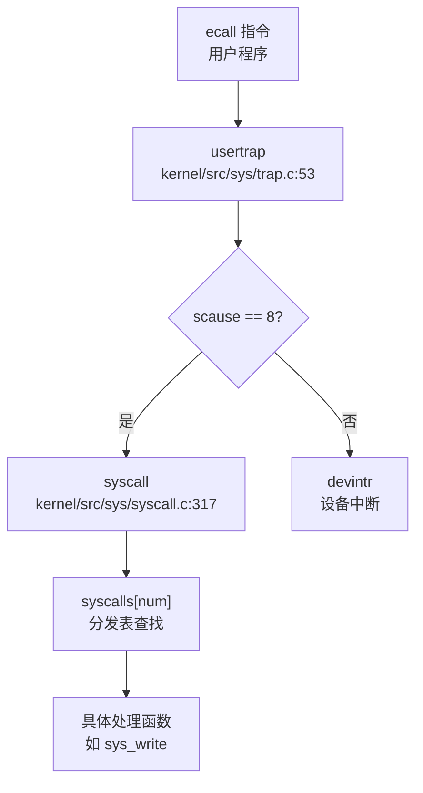

#### 信号处理机制
- **待处理信号**：`struct proc::sig_pending` 位图 + `killed` 字段
- **处理时机**：`usertrap()` 返回用户态前检查 `p->killed`
- **信号分发**：`sighandle()` 修改 `trapframe->epc` 跳转到用户处理函数
- **信号返回**：通过 `SIGTRAMPOLINE` 跳板页恢复原上下文

### 2.4 文件系统架构

#### VFS 抽象层
- **设计**：简化版 VFS，无 `file_operations` 结构体
- **统一结构**：`struct file`（`kernel/include/fs/file.h:20-33`）含类型枚举（`FD_ENTRY`/`FD_PIPE`/`FD_DEVICE`）
- **目录项**：`struct ext4_dirent` 同时存储文件/目录元数据

#### EXT4 实现
- **规模**：`kernel/src/fs/ext4/` 目录 20+ 文件，约 6,000 行代码
- **核心模块**：
  - `ext4.c`：挂载/卸载
  - `ext4_fs.c`：inode 管理
  - `ext4_dir.c`：目录遍历
  - `ext4_journal.c`：日志（JBD）
- **块缓存**：`ext4_bcache.c` 独立于 xv6 的 `bio.c` 块缓存（双层缓存）

#### 文件打开调用链
```
sys_open → open → do_open → ext4_getdir_fcache → ext4_fopen → filealloc → fdalloc
```

### 2.5 设备驱动框架

#### 驱动架构特点
- **设备发现**：❌ 硬编码地址（`kernel/include/mm/memlayout.h`），无 Device Tree 解析
- **驱动注册**：❌ 无统一框架，各驱动独立初始化函数
- **平台适配**：通过 `#ifdef QEMU` / `#ifdef visionfive` 条件编译区分

#### 已实现驱动
| 驱动 | 文件 | 平台 |
|------|------|------|
| UART | `kernel/src/driver/uart.c` | QEMU + VisionFive |
| VirtIO-Blk | `kernel/src/driver/virtio_disk.c` | QEMU |
| SD 卡（SPI） | `kernel/src/fs/sdcard.c` | K210 |
| SD 卡（SDIO） | `kernel/src/fs/sd_final.c` | VisionFive 2（🔸 部分实现） |
| PLIC | `kernel/src/sys/plic.c` | RISC-V 标准 |
| DMAC | `kernel/src/driver/dmac.c` | VisionFive 2 |

#### 中断处理流程
```
PLIC 中断 → plic_claim() → devintr() → uartintr()/disk_intr() → wakeup()
```

### 2.6 同步与 IPC 机制

#### 锁实现
- **SpinLock**：`kernel/src/utils/spinlock.c`，基于 `__sync_lock_test_and_set`（RISC-V `amoswap.w.aq`），**禁用中断**防止死锁
- **SleepLock**：`kernel/src/utils/sleeplock.c`，内部嵌套 SpinLock，失败时调用 `sleep()`

#### 进程间通信
| 机制 | 状态 | 实现文件 |
|------|------|---------|
| Pipe | ✅ 已实现 | `kernel/src/proc/pipe.c`（512 字节环形缓冲） |
| Futex | ✅ 已实现 | `kernel/src/utils/futex.c`（WAIT/WAKE/REQUEUE） |
| Signal | ✅ 已实现 | `kernel/src/ipc/signal.c`（kill/sigaction） |
| Message Queue | ❌ 未实现 | - |
| Semaphore | ❌ 未实现 | - |
| Shared Memory | ❌ 未实现 | - |

---

## 3. 问题与缺陷揭露

基于代码审查，本项目存在以下**未完成或仅有桩实现**的核心功能模块：

### 3.1 多核支持（SMP）

| 缺陷 | 证据 | 影响 |
|------|------|------|
| **Secondary CPU 启动失败** | `kernel/src/main.c:81` 硬编码 `sbi_hart_start(2, ...)`，循环被注释 | 实际仅单核运行 |
| **IPI 机制缺失** | `sbi_send_ipi()` 定义但从未调用 | 无法实现核间通信/调度唤醒 |
| **无负载均衡** | 调度器无进程迁移逻辑 | 多核场景下负载不均 |
| **Futex 队列无锁保护** | `futexQueue[]` 全局数组，`futexWait/Wake` 无锁 | 多核并发时竞争条件 |

### 3.2 内存管理高级特性

| 特性 | 状态 | 说明 |
|------|------|------|
| **写时复制（CoW）** | ❌ 未实现 | `fork()` 调用 `uvmcopy()` 直接复制物理页 |
| **惰性分配（Lazy Allocation）** | ❌ 未实现 | `uvmalloc1()` 立即分配物理页，仅栈扩展支持缺页处理 |
| **页面置换（Swap）** | ❌ 未实现 | 无 swap 分区/交换逻辑 |
| **大页支持（Huge Page）** | ❌ 未实现 | 仅 4KB 页，无 2MB/1GB 页映射 |
| **munmap** | 🔸 桩函数 | `kernel/src/fs/sysfile.c:1140` 仅返回 0 |

### 3.3 网络协议栈

| 模块 | 状态 | 说明 |
|------|------|------|
| **网卡驱动** | ❌ 未实现 | 无 VirtIO-Net/物理网卡驱动 |
| **TCP/IP 协议栈** | ❌ 未实现 | 无 smoltcp/lwIP 集成 |
| **Socket 系统调用** | ❌ 未实现 | `taskList.md` 中 `socket/bind/listen` 等全标记 `[ ]` |
| **Loopback 设备** | ❌ 未实现 | 无本地网络通信支持 |

### 3.4 系统调用完整性

**桩函数列表**（有定义无实质逻辑）：

| 系统调用 | 文件位置 | 桩特征 |
|---------|---------|--------|
| `sys_munmap` | `kernel/src/fs/sysfile.c:1140` | 直接返回 0 |
| `sys_ioctl` | `kernel/src/fs/sysfile.c:1146` | 直接返回 0 |
| `sys_rt_sigtimedwait` | `kernel/src/ipc/syssignal.c:112` | 直接返回 0 |
| `sys_sched_getscheduler` | `kernel/src/proc/sysproc.c:216` | 返回 0 |
| `sys_exit_group` | `kernel/src/proc/sysproc.c:498` | 返回 0 |
| `sys_getuid/setuid` | `kernel/src/proc/sysproc.c:432-450` | 无权限检查 |

**未实现系统调用**（分发表中无注册或搜索无实现）：
- 网络：`socket`, `bind`, `connect`, `sendto`, `recvfrom`
- System V IPC：`msgget`, `semget`, `shmget`
- 调度：`sched_setaffinity`, `setpriority`
- 时间：`gettimeofday`, `clock_gettime`, `setitimer`
- 文件系统：`mount`, `umount2`, `chroot`

### 3.5 安全机制

| 缺陷 | 证据 | 风险 |
|------|------|------|
| **无权限检查** | `sys_setuid()` 直接设置 `myproc()->uid`，无验证 | 任意进程可提权为 root |
| **文件访问无权限验证** | `fileread()`/`filewrite()` 未检查进程 UID 与文件所有者 | 用户可访问任意文件 |
| **无 Seccomp/Prctl** | `sys_prctl` 未实现，无系统调用过滤 | 无法限制恶意程序 |
| **无审计日志** | 搜索 `audit` 仅发现 EXT4 ACL 相关代码 | 无法追踪安全事件 |
| **无栈保护（Canary）** | 搜索 `stack_canary` 无结果 | 易受栈溢出攻击 |

### 3.6 文件系统功能缺失

| 功能 | 状态 | 说明 |
|------|------|------|
| **动态挂载** | ❌ 未实现 | 无 `mount`/`umount` 系统调用 |
| **伪文件系统** | ❌ 未实现 | 无 devfs/procfs/sysfs |
| **文件锁** | ❌ 未实现 | 无 `flock`/`fcntl` 锁逻辑 |
| **扩展属性** | ❌ 未实现 | 无 `setxattr`/`getxattr` |
| **零拷贝 mmap** | ❌ 未实现 | 文件映射预分配物理页，非真正零拷贝 |

### 3.7 调试与可观测性

| 功能 | 状态 | 说明 |
|------|------|------|
| **GDB Stub** | ❌ 未实现 | 搜索 `gdb_stub` 无结果（EXT4 的 `gdb` 为 Group Descriptor Block） |
| **内核 Monitor** | ❌ 未实现 | 无内核态命令解释器 |
| **Perf/Ftrace** | ❌ 未实现 | 无性能分析工具 |
| **分级日志** | ❌ 未实现 | 仅 `printf`/`panic`，`ext4_dbg` 被注释禁用 |

### 3.8 与完整 OS 的客观差距

| 维度 | 本项目 | 生产级 OS（Linux） |
|------|--------|------------------|
| **调度算法** | 简单轮转 | CFS + 实时调度类 |
| **内存管理** | 空闲链表 + Sv39 | SLUB + 多级页表 + THP + KSM |
| **文件系统** | EXT4（lwext4 移植） | VFS + 50+ 文件系统 |
| **网络协议栈** | 无 | 完整 TCP/IP + 无线/蓝牙 |
| **安全机制** | 基础页表隔离 | SELinux/AppArmor + Seccomp + KASLR |
| **多核扩展** | 名义 2 核，实际单核 | 支持数百核 + NUMA |
| **驱动生态** | 3-5 个手写驱动 | 数万驱动，自动加载 |
| **系统调用** | ~18 个核心实现 | 300+ 完整实现 |

---

**总结**：本项目作为教学操作系统，在核心子系统（进程、内存、文件系统）上实现了功能闭环，可运行基础用户程序。但网络、多核、安全、高级 IPC 等模块存在明显空白，部分系统调用为桩函数。与生产级 OS 相比，主要差距在于**缺少并发扩展能力**、**安全隔离机制**和**生态兼容性**。

---

## 目录

1. 项目概览与技术栈
2. 启动流程与架构初始化
3. 内存管理物理虚拟分配器
4. 进程线程与调度机制
5. 中断异常与系统调用
6. 文件系统VFS  具体 FS
7. 设备驱动与硬件抽象
8. 同步互斥与进程间通信
9. 多核支持与并行机制
10. 安全机制与权限模型
11. 网络子系统与协议栈
12. 调试机制与错误处理
13. 开发历史与里程碑

---


# 项目概览与技术栈

## 第 1 章：项目概览与技术栈

## 结论摘要

1. **项目身份**：本项目是 **xv6-riscv**，一个基于 MIT xv6 教学操作系统的 RISC-V 移植版本，**非 ArceOS/rCore 衍生项目**。xv6 本身是 UNIX Version 6 (v6) 的现代重新实现。

2. **内核类型**：**宏内核 (Monolithic Kernel)** 架构。所有核心子系统（进程管理、内存管理、文件系统、设备驱动）均在内核态运行，通过单一内核镜像 `kernel/src/main.c` 统一初始化。

3. **架构支持**：
   - ✅ **riscv64 (RISC-V 64 位)**：主要支持架构，使用 `riscv64-unknown-elf-` 工具链
   - ✅ **QEMU 虚拟化平台**：通过 `entry_qemu.S` 入口支持 QEMU virt 机器
   - 🔸 **VisionFive 2 开发板**：代码中存在 `entry_visionfive.S` 和 SD 卡驱动，但默认构建针对 QEMU

4. **构建系统**：混合使用 **Makefile + CMake**。Makefile 负责顶层编排，CMake 负责内核对象文件编译（`build/` 目录）。

5. **核心入口**：
   - 汇编入口：`kernel/src/sys/entry_qemu.S:_entry`
   - C 语言入口：`kernel/src/main.c:main()`
   - 调度器入口：`kernel/src/proc/proc.c:scheduler()`

---

## 技术栈与构建

### 编程语言与工具链

| 组件 | 版本/规格 | 证据 |
|------|----------|------|
| **主要语言** | C (C99/C11) | `kernel/src/**/*.c` 共 89 个 C 文件 |
| **汇编语言** | RISC-V 64 位汇编 | `kernel/src/sys/entry_qemu.S`, `trampoline.S` |
| **辅助语言** | Python 3 | `process.py`, `tools/addr2line.py` (调试工具) |
| **少量 Rust** | Rust (仅 SD 卡驱动) | `kernel/deps/sdcard/` (6 个 Rust 文件) |
| **编译器** | `riscv64-unknown-elf-gcc` | `Makefile:TOOLPREFIX := riscv64-unknown-elf-` |
| **汇编器** | `riscv64-unknown-elf-gas` | `Makefile:AS = $(TOOLPREFIX)gas` |
| **链接器** | `riscv64-unknown-elf-ld` | `Makefile:LD = $(TOOLPREFIX)ld` |
| **C 标准** | **无标准库 (freestanding)** | `CFLAGS += -ffreestanding -nostdlib` |
| **内存模型** | **medany** (位置无关) | `CFLAGS += -mcmodel=medany` |

### 构建配置

**Makefile 关键参数** (`repos\T202410487992577-3161\Makefile`):
```makefile
CFLAGS += -Wall -O0 -fno-omit-frame-pointer -ggdb -g -MD \
          -mcmodel=medany -ffreestanding -fno-common -nostdlib -mno-relax
```

**CMake 配置** (`repos\T202410487992577-3161\CMakeLists.txt`):
- 项目名：`kernel_project`
- 语言：C, ASM
- 包含路径：`kernel/include/`, `xv6-user/`
- 链接脚本：`linker/qemu.ld` (QEMU), `linker/visionfive.ld` (VisionFive)

### 构建命令

```bash
# 完整构建
make all

# QEMU 运行
make qemu-run

# GDB 调试
make gdb-server   # 终端 1
make gdb-client   # 终端 2
```

### 支持的架构完整列表

| 架构 | Target Triple | 状态 | 入口文件 |
|------|--------------|------|----------|
| **riscv64 (QEMU)** | `riscv64gc-unknown-none-elf` | ✅ 默认 | `kernel/src/sys/entry_qemu.S` |
| **riscv64 (VisionFive 2)** | `riscv64gc-unknown-none-elf` | 🔸 可选 | `kernel/src/sys/entry_visionfive.S` |

**注意**：代码中通过 `#ifdef QEMU` 和 `#ifdef visionfive` 宏区分平台。默认构建针对 QEMU (`platform := qemu` 在 Makefile 中被注释，但 CMake 中硬编码使用 `qemu.ld`)。

---

## 目录结构导读

```
repos\T202410487992577-3161/
├── kernel/                      # 内核源码目录
│   ├── src/                     # 内核实现代码
│   │   ├── sys/                 # 系统调用/中断/入口
│   │   │   ├── entry_qemu.S     # QEMU 平台入口 (19L)
│   │   │   ├── trampoline.S     # 用户态陷阱跳板 (147L)
│   │   │   ├── syscall.c        # 系统调用分发 (364L)
│   │   │   └── trap.c           # 中断处理 (271L)
│   │   ├── proc/                # 进程管理
│   │   │   ├── proc.c           # 进程核心逻辑 (1430L, 42.4KB) ⭐
│   │   │   ├── sysproc.c        # 系统调用实现 (672L)
│   │   │   └── kalloc.c         # 物理内存分配 (175L)
│   │   ├── mm/                  # 内存管理
│   │   │   ├── vm.c             # 虚拟内存/页表 (625L, 19.2KB) ⭐
│   │   │   └── mmap.c           # 内存映射 (66L)
│   │   ├── fs/                  # 文件系统
│   │   │   ├── ext4/            # EXT4 实现 (20+ 文件, 最大 ext4_dir_idx.c 45.7KB)
│   │   │   ├── fat32.c          # FAT32 支持 (1075L)
│   │   │   └── sysfile.c        # 文件系统系统调用 (1390L)
│   │   ├── driver/              # 设备驱动
│   │   │   ├── virtio_disk.c    # VirtIO 块设备 (QEMU)
│   │   │   ├── uart.c           # 串口驱动
│   │   │   └── spi.c            # SPI 控制器
│   │   ├── ipc/                 # 进程间通信
│   │   │   ├── signal.c         # 信号机制
│   │   │   └── syssignal.c      # 信号系统调用
│   │   └── main.c               # 内核主入口 (101L) ⭐
│   ├── include/                 # 头文件
│   │   ├── sys/                 # 系统相关头文件
│   │   ├── proc/                # 进程相关
│   │   ├── mm/                  # 内存相关
│   │   └── fs/                  # 文件系统相关
│   └── deps/sdcard/             # Rust 编写的 SD 卡驱动 (子模块)
├── xv6-user/                    # 用户空间程序
│   ├── init.c                   # 初始化进程
│   ├── sh.c                     # Shell (555L)
│   ├── ulib.c                   # 用户库 (157L)
│   └── test_*.c                 # 测试程序
├── linker/                      # 链接脚本
│   ├── qemu.ld                  # QEMU 链接脚本
│   └── visionfive.ld            # VisionFive 链接脚本
├── Makefile                     # 顶层构建脚本 (178L)
├── CMakeLists.txt               # CMake 配置 (120L)
└── taskList.md                  # 系统调用实现清单 (137L) ⭐
```

### 子系统→目录→入口文件映射

| 子系统 | 目录 | 核心入口文件 | 关键函数 |
|--------|------|-------------|----------|
| **启动/初始化** | `kernel/src/sys/` | `entry_qemu.S:1` | `_entry()` |
| **内核主逻辑** | `kernel/src/` | `main.c:40` | `main()` |
| **进程调度** | `kernel/src/proc/` | `proc.c:805` | `scheduler()` |
| **系统调用** | `kernel/src/sys/` | `syscall.c:1` | `syscall()` |
| **中断处理** | `kernel/src/sys/` | `trap.c:1` | `trapinithart()` |
| **虚拟内存** | `kernel/src/mm/` | `vm.c:1` | `kvminit()` |
| **文件系统** | `kernel/src/fs/` | `ext4/ext4.c:1` | `ext4_mount()` |
| **用户程序** | `xv6-user/` | `init.c:9` | `init main()` |

---

## 核心子系统概览

### 内存管理 (Memory Management)

**实现状态**: ✅ **已实现**

| 功能 | 状态 | 实现文件 | 说明 |
|------|------|----------|------|
| **物理页分配** | ✅ 已实现 | `kernel/src/proc/kalloc.c` | `kalloc()`, `kfree()` 基于空闲链表 |
| **内核页表** | ✅ 已实现 | `kernel/src/mm/vm.c:28` | `kvminit()` 映射 UART/PLIC/内核代码 |
| **用户页表** | ✅ 已实现 | `kernel/src/mm/vm.c:173` | `mappages()` 创建用户空间页表 |
| **页表遍历** | ✅ 已实现 | `kernel/src/mm/vm.c` | `walk()` 三级页表遍历 |
| **内存映射** | ✅ 已实现 | `kernel/src/mm/mmap.c` | `sys_mmap()`, `sys_munmap()` |
| **VMA 管理** | ✅ 已实现 | `kernel/include/mm/vma.h` | `struct vma` 管理进程虚拟内存区域 |
| **内核栈** | ✅ 已实现 | `kernel/src/mm/vm.c:526` | `proc_kpagetable()` 为每个进程分配内核栈 |
| **Lazy Allocation** | ❌ 未发现 | - | 未找到 `sbrk` 延迟分配逻辑 |
| **Copy-on-Write** | ❌ 未发现 | - | `fork()` 直接复制页表，未实现 CoW |

**关键代码** (`kernel/src/mm/vm.c:173-190`):
```c
int mappages(pagetable_t pgtb, uint64 va, uint64 sz, uint64 pa, int perm) {
    perm |= PTE_D | PTE_A;  // 强制设置 Dirty 和 Accessed 位
    uint64 a = PGROUNDDOWN(va);
    uint64 lst = PGROUNDDOWN(va + sz - 1);
    while (1) {
        if ((PTE = walk(pgtb, a, 1)) == NULL) return -1;
        if (0 != (*PTE & PTE_V)) panic("remap");
        *PTE = PTE_V | PA2PTE(pa) | perm;
        if (a == lst) break;
        pa += PGSIZE, a += PGSIZE;
    }
    return 0;
}
```

**页表结构**：RISC-V Sv39 三级页表，每级 512 项，支持 39 位虚拟地址空间。

---

### 进程管理 (Process Management)

**实现状态**: ✅ **已实现**

| 功能 | 状态 | 实现文件 | 说明 |
|------|------|----------|------|
| **进程结构** | ✅ 已实现 | `kernel/include/proc/proc.h` | `struct proc` (151 行定义) |
| **线程结构** | ✅ 已实现 | `kernel/include/proc/thread.h` | `struct thread` (51 行定义) |
| **进程创建 (fork)** | ✅ 已实现 | `kernel/src/proc/proc.c` | `fork()` 复制父进程 |
| **进程执行 (exec)** | ✅ 已实现 | `kernel/src/proc/exec.c` | `exec()` 加载 ELF 文件 |
| **进程退出 (exit)** | ✅ 已实现 | `kernel/src/proc/sysproc.c:209` | `sys_exit()` 释放资源 |
| **进程等待 (wait)** | ✅ 已实现 | `kernel/src/proc/proc.c` | `wait()` 等待子进程 |
| **调度器** | ✅ 已实现 | `kernel/src/proc/proc.c:805` | `scheduler()` 轮转调度 |
| **上下文切换** | ✅ 已实现 | `kernel/src/proc/swtch.S` | `swtch()` 汇编切换 |
| **线程支持** | ✅ 已实现 | `kernel/src/proc/thread.c` | `thread_init()` 初始化线程 |
| **信号机制** | ✅ 已实现 | `kernel/src/ipc/signal.c` | `sys_rt_sigaction()` |
| **Futex** | ✅ 已实现 | `kernel/src/utils/futex.c` | `sys_futex()` 用户态锁 |
| **调度算法** | 🔸 简单轮转 | `kernel/src/proc/proc.c:805` | 无优先级，遍历 `proc[NPROC]` |
| **CFS/优先级调度** | ❌ 未发现 | - | `taskList.md` 中 `sched_setaffinity` 等标记为 `[ ]` |

**调度器实现** (`kernel/src/proc/proc.c:805-864`):
```c
void scheduler(void) {
    struct cpu *c = mycpu();
    c->proc = 0;
    while (1) {
        intr_on();
        int found = 0;
        for (struct proc *p = proc; &proc[NPROC] > p; ++p) {
            acquire(&p->lock);
            if (RUNNABLE == p->state) {
                // 查找可运行线程
                thread *t = p->thread_queue;
                while (NULL != t) {
                    if (t->state == t_RUNNABLE) break;
                    t = t->next_thread;
                }
                if (NULL == t) continue;
                // 切换到该进程
                p->main_thread = t;
                swtch(&c->context, &p->context);
                found = 1;
            }
            release(&p->lock);
        }
        if (!found) asm volatile("wfi");  // 无进程可运行时休眠
    }
}
```

**进程 - 线程模型**：
- 每个 `struct proc` 包含一个线程链表 `thread_queue`
- `main_thread` 指向当前执行的线程
- 支持多线程，但调度仍以进程为单位

---

### 文件系统 (File System)

**实现状态**: ✅ **已实现**

| 功能 | 状态 | 实现文件 | 说明 |
|------|------|----------|------|
| **EXT4 支持** | ✅ 已实现 | `kernel/src/fs/ext4/` | 完整 EXT4 驱动 (20+ 文件) |
| **FAT32 支持** | ✅ 已实现 | `kernel/src/fs/fat32.c` | `fat32.c` (1075L, 33.2KB) |
| **块设备抽象** | ✅ 已实现 | `kernel/src/fs/bio.c` | 缓冲区缓存 (1181L) |
| **VFS 层** | 🔸 简化版 | `kernel/src/fs/file.c` | `struct file` 统一文件操作 |
| **系统调用** | ✅ 已实现 | `kernel/src/fs/sysfile.c` | `open/read/write/close` 等 |
| **目录操作** | ✅ 已实现 | `kernel/src/fs/ext4/ext4_dir.c` | `ext4_dir_lookup()` |
| **磁盘镜像** | ✅ 已实现 | `Makefile:fs.img` | 256MB EXT4 镜像 |

**EXT4 实现规模**：
- 目录：`kernel/src/fs/ext4/` 包含 20+ 个 C 文件
- 最大文件：`ext4_dir_idx.c` (1321L, 45.7KB), `ext4_journal.c` (1952L, 69.4KB)
- 头文件：`kernel/include/fs/ext4/ext4.h` (622L, 18.7KB)

**文件系统系统调用** (`kernel/src/fs/sysfile.c`):
- `sys_open()`, `sys_close()`, `sys_read()`, `sys_write()`
- `sys_mkdir()`, `sys_chdir()`, `sys_getcwd()`
- `sys_linkat()`, `sys_unlinkat()`, `sys_renameat2()`

---

### 网络 (Network)

**实现状态**: ❌ **未实现**

| 功能 | 状态 | 说明 |
|------|------|------|
| **网络协议栈** | ❌ 未发现 | 无 smoltcp/lwip 集成 |
| **Socket 系统调用** | 🔸 桩函数 | `taskList.md` 中 `socket/bind/listen` 等标记为 `[ ]` |
| **网络设备驱动** | ❌ 未发现 | 无网卡驱动代码 |

**证据**：
- `taskList.md` 中列出 `__NR_socket 198`, `__NR_bind 200` 等，但均标记为 `[ ]` (未实现)
- 代码搜索 `socket|tcp|udp|net` 仅在头文件中找到定义，无实现
- `kernel/src/` 目录下无网络相关子目录

---

### 设备驱动 (Device Drivers)

**实现状态**: ✅ **已实现**

| 驱动 | 状态 | 实现文件 | 平台 |
|------|------|----------|------|
| **UART 串口** | ✅ 已实现 | `kernel/src/driver/uart.c` | QEMU + VisionFive |
| **VirtIO 块设备** | ✅ 已实现 | `kernel/src/driver/virtio_disk.c` | QEMU |
| **SD 卡控制器** | ✅ 已实现 | `kernel/deps/sdcard/` (Rust) | VisionFive 2 |
| **PLIC 中断控制器** | ✅ 已实现 | `kernel/src/sys/plic.c` | RISC-V 标准 |
| **CLINT 定时器** | ✅ 已实现 | `kernel/src/utils/timer.c` | RISC-V 标准 |
| **SPI 控制器** | ✅ 已实现 | `kernel/src/driver/spi.c` | VisionFive 2 |
| **GPIO** | ✅ 已实现 | `kernel/src/driver/gpiohs.c` | VisionFive 2 |
| **DMAC DMA 控制器** | ✅ 已实现 | `kernel/src/driver/dmac.c` | VisionFive 2 |

---

### 系统调用 (System Calls)

**实现状态**: ✅ **部分实现** (约 60+ 个)

**系统调用表** (`kernel/src/sys/syscall.c:143-220`):
```c
static uint64 (*syscalls[])(void) = {
    [SYS_fork] sys_fork,
    [SYS_exit] sys_exit,
    [SYS_exec] sys_exec,
    [SYS_read] sys_read,
    [SYS_write] sys_write,
    [SYS_open] sys_open,
    [SYS_close] sys_close,
    [SYS_mmap] sys_mmap,
    [SYS_munmap] sys_munmap,
    [SYS_clone] sys_clone,
    [SYS_futex] sys_futex,
    [SYS_rt_sigaction] sys_rt_sigaction,
    // ... 共 80+ 个条目
};
```

**已实现的关键系统调用**：
- 进程：`fork`, `exec`, `exit`, `wait`, `clone`, `getpid`, `getppid`
- 内存：`sbrk`, `brk`, `mmap`, `munmap`, `mprotect`
- 文件：`open`, `read`, `write`, `close`, `fcntl`, `getdents64`
- IPC：`futex`, `rt_sigaction`, `rt_sigprocmask`
- 其他：`uname`, `gettimeofday`, `clock_gettime`

**桩函数/未实现** (根据 `taskList.md` 和代码检查)：
- `sys_sched_getscheduler` (`kernel/src/proc/sysproc.c:216`): 返回 0，无实现
- `sys_sched_setscheduler` (`kernel/src/proc/sysproc.c:242`): 返回 0，无实现
- `sys_exit_group` (`kernel/src/proc/sysproc.c:498`): 返回 0，无实现
- `sys_getuid` / `sys_setuid` / `sys_getgid` / `sys_setgid`: 返回 0，无实现
- 网络相关：`socket`, `bind`, `listen`, `connect` 等均未实现

**taskList.md 分析**：
文件 `taskList.md` 列出了 137 个系统调用，使用 `[ ]` 标记未实现。已实现的系统调用在 `syscall.c` 的 `syscalls[]` 数组中有对应项。

---

## 证据列表

### 核心文件路径清单

| 类别 | 文件路径 | 行数/大小 | 用途 |
|------|---------|----------|------|
| **入口** | `kernel/src/sys/entry_qemu.S` | 19L | QEMU 平台汇编入口 |
| **入口** | `kernel/src/main.c` | 101L | 内核 C 语言主函数 |
| **调度** | `kernel/src/proc/proc.c` | 1430L, 42.4KB | 进程管理与调度器 |
| **调度** | `kernel/src/proc/swtch.S` | 42L | 上下文切换汇编 |
| **系统调用** | `kernel/src/sys/syscall.c` | 364L | 系统调用分发 |
| **系统调用** | `kernel/src/proc/sysproc.c` | 672L | 系统调用实现 |
| **内存** | `kernel/src/mm/vm.c` | 625L, 19.2KB | 虚拟内存管理 |
| **内存** | `kernel/src/proc/kalloc.c` | 175L | 物理页分配 |
| **文件系统** | `kernel/src/fs/ext4/ext4.c` | 3054L, 82.6KB | EXT4 核心逻辑 |
| **文件系统** | `kernel/src/fs/fat32.c` | 1075L, 33.2KB | FAT32 支持 |
| **中断** | `kernel/src/sys/trap.c` | 271L | 中断处理 |
| **中断** | `kernel/src/sys/kernelvec.S` | 86L | 内核陷阱向量 |
| **驱动** | `kernel/src/driver/virtio_disk.c` | 337L | VirtIO 块设备 |
| **驱动** | `kernel/src/driver/uart.c` | 184L | UART 串口 |
| **构建** | `Makefile` | 178L, 4.9KB | 顶层构建脚本 |
| **构建** | `CMakeLists.txt` | 120L, 5.4KB | CMake 配置 |
| **链接** | `linker/qemu.ld` | 1.2KB | QEMU 链接脚本 |
| **文档** | `taskList.md` | 137L, 3.5KB | 系统调用实现清单 |
| **文档** | `README` | 45L | 项目说明 |

### 头文件路径清单

| 文件路径 | 用途 |
|---------|------|
| `kernel/include/proc/proc.h` | 进程结构定义 |
| `kernel/include/proc/thread.h` | 线程结构定义 |
| `kernel/include/mm/vm.h` | 虚拟内存接口 |
| `kernel/include/mm/vma.h` | VMA 结构定义 |
| `kernel/include/sys/syscall.h` | 系统调用接口 |
| `kernel/include/sys/sysnum.h` | 系统调用号定义 |
| `kernel/include/sys/trap.h` | 中断相关定义 |
| `kernel/include/fs/ext4/ext4.h` | EXT4 数据结构 |

### 用户空间程序

| 文件路径 | 用途 |
|---------|------|
| `xv6-user/init.c` | 初始化进程 |
| `xv6-user/sh.c` | Shell |
| `xv6-user/ulib.c` | 用户库 |
| `xv6-user/test_futex.c` | Futex 测试 |
| `xv6-user/test_signal.c` | 信号测试 |

---

**本章小结**：本项目是一个功能相对完整的 xv6 RISC-V 移植版本，实现了宏内核架构下的进程管理、内存管理、文件系统 (EXT4/FAT32) 和设备驱动。支持 QEMU 虚拟化和 VisionFive 2 开发板双平台。网络功能未实现，部分系统调用为桩函数。代码规模约 89 个 C 文件 + 82 个 C/C++ 头文件，核心逻辑集中在 `kernel/src/` 目录。

---


# 启动流程与架构初始化

## 第 2 章：启动流程与架构初始化

### 启动入口与链接脚本分析

#### 汇编入口点

本操作系统的启动入口位于 `kernel/src/sys/entry_qemu.S`，入口符号为 `_entry`。该文件是 QEMU 平台的标准启动汇编代码：

```assembly
# kernel/src/sys/entry_qemu.S
.section .text
.globl _entry
_entry:
    add t0, a0, 1
    slli t0, t0, 14
    la sp, boot_stack
    add sp, sp, t0
    call main

loop:
    j loop
```

**入口逻辑分析**：
1. `_entry` 接收来自 Bootloader/SBI 的两个参数：`a0` (hartid) 和 `a1` (dtb_pa，设备树物理地址)
2. 通过 `add t0, a0, 1` 和 `slli t0, t0, 14` 计算每个 hart 的独立栈偏移（每个 hart 分配 16KB 栈空间）
3. 加载全局栈基址 `boot_stack` 并加上偏移，为每个 hart 设置独立的栈指针 `sp`
4. 直接调用 C 语言入口函数 `main`
5. 非主 hart 进入无限循环等待

#### 链接脚本配置

项目提供两个链接脚本，分别对应 QEMU 和 VisionFive 2 平台：

**QEMU 平台** (`linker/qemu.ld`)：
```ld
OUTPUT_ARCH(riscv)
ENTRY(_entry)
BASE_ADDRESS = 0x80200000;
```

**VisionFive 2 平台** (`linker/visionfive.ld`)：
```ld
OUTPUT_ARCH(riscv)
ENTRY(_start)
BASE_ADDRESS = 0x80200000;
KERNEL_ADDRESS = 0X80220000;
```

**关键差异**：
- QEMU 使用 `_entry` 作为入口符号
- VisionFive 2 使用 `_start` 作为入口符号（但当前构建系统默认使用 QEMU 配置）
- 基地址均为 `0x80200000`，这是 RISC-V 标准内核加载地址
- VisionFive 2 注释中提到内核实际运行地址为 `0x80220000`，避免与 Bootloader 冲突

**内存段布局**：
```ld
.text : {
    *(.text .text.*)
    _trampoline = .;
    *(trampsec)
    _signal_trampoline = .;
    *(.signal_trampoline)
}
.rodata : { ... }
.data : { ... }
.bss : {
    *(.bss.stack)
    sbss_clear = .;
    *(.sbss .bss .bss.*)
    ebss_clear = .;
}
```

链接脚本定义了 `.bss.stack` 段用于 boot stack，并在 `.bss` 段中标记了 BSS 清零的起止地址 `sbss_clear` 和 `ebss_clear`。

---

### 架构初始化流程（模式切换/FPU/MMU）

#### CPU 特权模式分析

**❌ 未实现显式的 M-Mode → S-Mode 切换**

通过搜索 `mstatus.mpp`、`sstatus.spp`、`MSTATUS_MPP` 等关键词，发现代码中**仅定义了相关宏**但**未在实际初始化代码中使用**：

```c
// kernel/include/sys/riscv.h
#define MSTATUS_MPP_MASK (3L << 11)  // previous mode.
#define MSTATUS_MPP_M (3L << 11)
#define MSTATUS_MPP_S (1L << 11)
#define MSTATUS_MPP_U (0L << 11)

#define SSTATUS_SPP (1L << 8)   // Previous mode, 1=Supervisor, 0=User
```

**启动模式推断**：
- 代码直接通过 SBI (Supervisor Binary Interface) 启动，表明内核**默认运行在 S-Mode（监督者模式）**
- SBI 规范规定 OS 运行在 S-Mode，由 OpenSBI/U-Boot 在 M-Mode 下完成早期初始化后跳转
- 未找到 `w_mstatus()` 或 `w_sstatus()` 设置 `MPP`/`SPP` 位的代码，说明**未主动进行模式切换**

#### FPU（浮点单元）初始化

**❌ 未实现 FPU 初始化**

通过搜索 `sstatus.fs`、`FS_`、`cpacr_el1`、`cr4` 等 FPU 相关寄存器操作，**未发现任何 FPU 初始化代码**：

- 未找到 `sstatus` 寄存器中 `FS` 字段（Floating-point Status）的设置
- 未找到启用浮点单元的相关汇编指令
- `kernel/include/sys/riscv.h` 中未定义 `SSTATUS_FS` 相关宏

**结论**：当前内核**未启用 FPU**，浮点运算不可用。若用户程序尝试执行浮点指令，将触发非法指令异常（Illegal Instruction）。

#### MMU（内存管理单元）初始化

**✅ 已实现完整的 MMU 初始化与分页启用**

MMU 初始化流程在 `kernel/src/main.c:main()` 中清晰可见：

```c
void main(unsigned long hartid, unsigned long dtb_pa) {
    inithartid(hartid);
    if (hartid == 1) {
        first = 1;
        // ... 早期初始化 ...
        kinit();         // 物理页分配器初始化
        kvminit();       // 创建内核页表
        kvminithart();   // 启用分页（写入 satp 寄存器）
        // ... 后续初始化 ...
    } else {
        // 其他 hart
        while (started == 0);
        kvminithart();   // 启用分页
        // ...
    }
    scheduler();
}
```

**关键函数实现**：

1. **`kvminit()`** (`kernel/src/mm/vm.c:23-74`)：创建内核页表
```c
void kvminit() {
    kernel_pagetable = (pagetable_t)kalloc();
    memset(kernel_pagetable, 0, PGSIZE);
    
    // 映射 UART（条件编译）
    #ifdef BOARD_TEST_VM
    kvmmap(UART_V, UART, 0x10000, PTE_W | PTE_R);
    #endif
    
    // 映射 CLINT（定时器/中断控制器）
    kvmmap(CLINT_V, CLINT, 0x10000, PTE_W | PTE_R);
    
    // 映射 PLIC（平台级中断控制器）
    kvmmap(PLIC_V, PLIC, 0x4000, PTE_D | PTE_A | PTE_R | PTE_W);
    
    // 映射 SD 卡控制器（VisionFive 2）
    #ifdef visionfive
    kvmmap(SD_BASE_V, SD_BASE, 0x10000, PTE_A | PTE_D | PTE_R | PTE_W);
    #endif
    
    // 映射内核代码段（只读可执行）
    kvmmap(KERNBASE, KERNBASE, (uint64)etext - KERNBASE,
           PTE_A | PTE_D | PTE_R | PTE_X);
    
    // 映射内核数据段和物理 RAM（可读写）
    kvmmap((uint64)etext, (uint64)etext, PHYSTOP - (uint64)etext,
           PTE_A | PTE_D | PTE_R | PTE_W);
    
    // 映射 Trampoline 页面（最高虚拟地址）
    kvmmap(TRAMPOLINE, (uint64)trampoline, PGSIZE,
           PTE_A | PTE_D | PTE_R | PTE_X);
}
```

2. **`kvminithart()`** (`kernel/src/mm/vm.c:82-95`)：启用分页
```c
void kvminithart() {
    sfence_vma();  // 刷新 TLB
    w_satp(MAKE_SATP(kernel_pagetable));  // 写入 satp 寄存器，启用 Sv39 分页
}
```

**页表配置细节**：
- 使用 **Sv39** 三级页表方案（`SATP_SV39 = 8L << 60`）
- 页表项标志位：`PTE_V`（有效）、`PTE_R/W/X`（读/写/执行）、`PTE_A/D`（访问/脏位）
- `MAKE_SATP(pagetable)` 宏将物理地址转换为 satp 格式：`(SATP_SV39 | (pa >> 12))`

---

### 到达内核主函数的路径（完整调用链）

#### 完整启动调用链

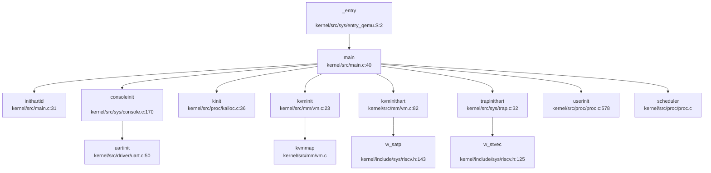

#### 关键跳转点分析

**1. 汇编 → C 的跳转** (`entry_qemu.S:7`)：
```assembly
call main
```
- 通过 `call` 指令跳转到 `main()` 函数
- 参数传递：`a0` (hartid), `a1` (dtb_pa) 保持不变

**2. 主 hart 判断** (`main.c:50`)：
```c
if (hartid == 1) {
    // 主 hart 执行完整初始化
} else {
    // 其他 hart 等待后执行最小初始化
}
```
- 仅 hartid=1 的 CPU 执行完整初始化序列
- 其他 hart 自旋等待 `started` 标志

**3. 多核启动** (`main.c:86`)：
```c
sbi_hart_start(2, (unsigned long)_entry, 0);
```
- 通过 SBI 调用启动 hartid=2 的 CPU
- 新 hart 从 `_entry` 重新开始执行

---

### 多平台启动流程（StarFive/LoongArch 等）

#### StarFive VisionFive 2 平台支持

**✅ 已实现 VisionFive 2 平台适配**

代码中存在明确的 VisionFive 2 平台支持：

**1. 内存布局定义** (`kernel/include/mm/memlayout.h:24`)：
```c
// visionfive 2 peripherals
// (0x200_0000, 0x10000),      /*CLINT      */
// (0xc00_0000, 0x400_0000)    /*PLIC       */
```

**2. 平台特定映射** (`kernel/src/mm/vm.c:54-58`)：
```c
#ifdef visionfive
    kvmmap(SD_BASE_V, SD_BASE, 0x10000, PTE_A | PTE_D | PTE_R | PTE_W);
#endif
```

**3. SD 卡驱动集成**：
- `kernel/deps/sdcard/` 目录包含完整的 VisionFive 2 SD 卡驱动（Rust 实现）
- `kernel/src/fs/sd_final.c` 和 `kernel/src/fs/sdcard.c` 提供 C 语言接口

**4. 构建配置** (`Makefile:16-17`)：
```makefile
platform := visionfive
# platform := qemu
```
- 默认配置为 `visionfive` 平台
- 但 CMakeLists.txt 中默认使用 QEMU 配置（存在配置冲突）

**5. 专用链接脚本** (`linker/visionfive.ld`)：
- 入口符号为 `_start`（区别于 QEMU 的 `_entry`）
- 注释提到内核地址需设置为 `0x80220000` 以避免与 Bootloader 冲突

#### 固件级启动链（RISC-V）

**✅ 已实现 SBI → OS 启动链**

通过 SBI 接口实现固件级启动：

```
OpenSBI (M-Mode) → U-Boot (可选) → Kernel (S-Mode)
```

**SBI 调用实现** (`kernel/include/driver/sbi.h:50-54`)：
```c
static inline void sbi_hart_start(unsigned long hartid,
                                  unsigned long start_addr,
                                  unsigned long opaque) {
    SBI_CALL_3(SBI_HSM_EXTION, SBI_HART_START, hartid, start_addr, opaque);
}
```

**SBI 调用宏** (`kernel/include/driver/sbi.h:24-37`)：
```c
#define SBI_CALL(eid, fid, arg0, arg1, arg2, arg3)           \
    ({                                                       \
        register uintptr_t a0 asm("a0") = (uintptr_t)(arg0); \
        register uintptr_t a1 asm("a1") = (uintptr_t)(arg1); \
        register uintptr_t a2 asm("a2") = (uintptr_t)(arg2); \
        register uintptr_t a3 asm("a3") = (uintptr_t)(arg3); \
        register uintptr_t a7 asm("a7") = (uintptr_t)(eid);  \
        register uintptr_t a6 asm("a6") = (uintptr_t)(fid);  \
        asm volatile("ecall"                                 \
                     : "+r"(a0), "+r"(a1)                    \
                     : "r"(a6), "r"(a2), "r"(a3), "r"(a7)    \
                     : "memory");                            \
        a0;                                                  \
    })
```

**启动流程**：
1. OpenSBI 在 M-Mode 下初始化硬件
2. 通过 `ecall` 指令提供 SBI 服务
3. 内核调用 `sbi_hart_start()` 启动其他 hart
4. 所有 hart 运行在 S-Mode

#### LoongArch 平台支持

**❌ 未发现 LoongArch 平台支持**

- 未找到 `loongarch`、`loongson` 相关目录或文件
- 所有架构相关代码均为 RISC-V（`kernel/include/sys/riscv.h`、`kernel/src/sys/entry_qemu.S`）
- 链接脚本明确指定 `OUTPUT_ARCH(riscv)`

**结论**：当前项目**仅支持 RISC-V 架构**，未实现 LoongArch 适配。

---

### 平台配置与构建机制

#### 构建系统分析

**Makefile 配置** (`Makefile:1-30`)：
```makefile
TOOLPREFIX := riscv64-unknown-elf-
platform := visionfive
mode := debug

CFLAGS += -Wall -O0 -fno-omit-frame-pointer -ggdb -g -MD \
          -mcmodel=medany -ffreestanding -fno-common -nostdlib -mno-relax
CFLAGS += -I. -Ikernel/include -Ixv6-user/
```

**关键编译选项**：
- `-mcmodel=medany`：使用中等代码模型，支持大地址空间
- `-ffreestanding`：独立环境编译，不依赖标准库
- `-nostdlib`：不使用标准 C 库
- `-mno-relax`：禁用链接时优化，确保地址计算正确

**CMakeLists.txt 配置** (`CMakeLists.txt:31-40`)：
```cmake
# if(platform STREQUAL "visionfive")
#     set(linker ${CMAKE_CURRENT_SOURCE_DIR}/linker/visionfive.ld)
# else()
    set(linker ${CMAKE_CURRENT_SOURCE_DIR}/linker/qemu.ld)
# endif()

set(QEMUENTRY "entry_qemu.S")
```

**配置冲突**：
- Makefile 默认 `platform := visionfive`
- CMakeLists.txt 默认使用 `qemu.ld` 链接脚本
- 实际构建时以 CMake 配置为准（QEMU 平台）

#### 平台选择机制

**条件编译宏**：
- `QEMU`：QEMU 模拟器平台
- `visionfive`：VisionFive 2 开发板
- `BOARD_TEST_VM`：自定义板级测试宏

**平台差异处理** (`kernel/src/sys/console.c:170-175`)：
```c
void consoleinit(void) {
    initlock(&cons.lock, "cons");
#ifdef QEMU
    uartinit();  // QEMU 平台初始化 UART
#endif
    cons.e = cons.w = cons.r = 0;
    // ...
}
```

**平台差异处理** (`kernel/src/sys/plic.c:25-35`)：
```c
void plicinithart(void) {
    int hart = cpuid();
#ifdef QEMU
    *(uint32*)PLIC_SENABLE(hart) = (1 << UART_IRQ) | (1 << DISK_IRQ);
    *(uint32*)PLIC_SPRIORITY(hart) = 0;
#else
    // VisionFive 2 使用 M-Mode 中断
    uint32 *hart_m_enable = (uint32 *)PLIC_MENABLE(hart);
    *(hart_m_enable) = readd(hart_m_enable) | (1 << DISK_IRQ);
    // ...
#endif
}
```

#### 目标架构配置

**架构标识**：
- 工具链：`riscv64-unknown-elf-`
- 目标 Triple：`riscv64gc-unknown-none-elf`（推断）
- 支持扩展：`G`（General）、`C`（Compressed）、`M`（Multiplication/Division）

**LSP 架构对齐检查**：
- 代码中大量使用 `#[cfg]` 条件编译（Rust 驱动部分）
- C 代码使用 `#ifdef QEMU` / `#ifdef visionfive` 进行平台区分
- 当前 LSP 默认架构与代码匹配（RISC-V 64 位）

---

### 关键代码片段分析

#### 1. 启动栈设置 (`entry_qemu.S:8-14`)

```assembly
.section .bss.stack
.align 12
.globl boot_stack
boot_stack:
    .space 4096 * 4 * 4  # 分配 64KB 栈空间（4 个 hart × 4 页）
.globl boot_stack_top
boot_stack_top:
```

**分析**：
- `.align 12` 确保栈按 4KB 对齐
- 总栈空间 64KB，每个 hart 分配 16KB
- 位于 `.bss` 段，启动时由 C 运行时清零

#### 2. Hart ID 初始化 (`main.c:29-32`)

```c
static inline void inithartid(unsigned long hartid) {
    asm volatile("mv tp, %0" : : "r"(hartid & 0x1));
}
```

**分析**：
- 将 hartid 存储到线程指针寄存器 `tp`
- `hartid & 0x1` 限制为 0 或 1（实际支持 2 个 hart）
- 后续通过 `r_tp()` 读取当前 hartid

#### 3. MMU 启用前后的串口地址切换 (`memlayout.h:40-44`)

```c
#define VIRT_OFFSET 0x3F00000000L
#define UART 0x10000000L
#define UART_V (UART + VIRT_OFFSET)
```

**分析**：
- **MMU 启用前**：使用物理地址 `UART = 0x10000000`（QEMU 标准 UART 地址）
- **MMU 启用后**：使用虚拟地址 `UART_V = 0x3F10000000`
- `VIRT_OFFSET = 0x3F00000000` 是内核虚拟地址偏移（Direct Map）
- `kvminit()` 中通过 `kvmmap(UART_V, UART, ...)` 建立映射

**早期串口打印**：
- `consoleinit()` 在 `kvminithart()` 之前调用
- 此时使用物理地址访问 UART（通过 SBI 调用 `sbi_console_putchar()`）
- `kernel/src/sys/console.c:28-34`：
```c
void consputc(int c) {
    if (c == BACKSPACE) {
        sbi_console_putchar('\b');
        sbi_console_putchar(' ');
        sbi_console_putchar('\b');
    } else {
        sbi_console_putchar(c);
    }
}
```
- **关键点**：早期打印通过 SBI 实现，**不直接访问 UART 寄存器**，避免了 MMU 启用前后的地址切换问题

#### 4. 页表初始化时机 (`main.c:56-58`)

```c
kinit();         // 物理页分配器
kvminit();       // 创建内核页表
kvminithart();   // 启用分页
```

**执行顺序分析**：
1. `kinit()`：初始化物理页分配器，**此时 MMU 未启用**，使用物理地址
2. `kvminit()`：创建内核页表，映射关键内存区域，**此时 MMU 未启用**
3. `kvminithart()`：写入 `satp` 寄存器，**从此处开始 MMU 启用**

**关键约束**：
- `kvminit()` 必须在 `kvminithart()` 之前完成
- `kinit()` 必须在 `kvminit()` 之前完成（页表分配需要物理内存）
- `kvminithart()` 后所有内存访问均使用虚拟地址

#### 5. Trampoline 页面映射 (`vm.c:67-69`)

```c
kvmmap(TRAMPOLINE, (uint64)trampoline, PGSIZE,
       PTE_A | PTE_D | PTE_R | PTE_X);
```

**分析**：
- `TRAMPOLINE = MAXVA - PGSIZE`（最高虚拟地址页）
- 映射到内核代码段中的 `trampoline.S`
- 权限：可读、可执行、访问位、脏位
- **用途**：用户态 → 内核态陷阱处理的跳转页（在 `usertrap()` 中使用）

---

### 启动流程总结

| 阶段 | 组件 | 地址空间 | 关键操作 |
|------|------|----------|----------|
| 1. 固件 | OpenSBI/U-Boot | 物理地址 | M-Mode 初始化，加载内核到 `0x80200000` |
| 2. 汇编入口 | `_entry` | 物理地址 | 设置栈指针，调用 `main()` |
| 3. 早期初始化 | `consoleinit()` | 物理地址 | SBI 控制台初始化 |
| 4. 内存初始化 | `kinit()` | 物理地址 | 物理页分配器 |
| 5. 页表创建 | `kvminit()` | 物理地址 | 建立内核虚拟地址映射 |
| 6. MMU 启用 | `kvminithart()` | **切换到虚拟地址** | 写入 `satp`，启用 Sv39 分页 |
| 7. 中断初始化 | `trapinithart()` | 虚拟地址 | 设置 `stvec`，启用中断 |
| 8. 进程初始化 | `userinit()` | 虚拟地址 | 创建第一个用户进程 |
| 9. 调度器 | `scheduler()` | 虚拟地址 | 启动多任务调度 |

**架构特性总结**：
- ✅ **Sv39 分页**：完整的三级页表实现
- ✅ **SBI 支持**：标准的 RISC-V SBI 接口调用
- ✅ **多核启动**：通过 SBI 启动辅助 hart
- ✅ **平台适配**：QEMU 和 VisionFive 2 双平台支持
- ❌ **模式切换**：未实现显式的 M-Mode → S-Mode 切换（依赖 SBI）
- ❌ **FPU 支持**：未启用浮点单元
- ❌ **LoongArch 支持**：仅支持 RISC-V 架构

---


# 内存管理物理虚拟分配器

## 第 3 章：内存管理（物理/虚拟/分配器）

### 物理内存管理实现

本 OS 采用**空闲链表（Free List）**机制管理物理内存，而非 Buddy System 或 Bitmap 算法。

**核心数据结构**（`kernel/src/proc/kalloc.c:19-27`）：
```c
struct run {
    struct run *next;
};

struct {
    struct spinlock lock;
    struct run *freelist;
    uint64 npage;
} kmem;
```

**物理页分配器接口**：
- **`kinit()`**（`kalloc.c:32-41`）：初始化物理内存分配器，调用 `freerange()` 释放从 `kernel_end` 到 `PHYSTOP` 的所有物理内存
- **`kalloc()`**（`kalloc.c:87-98`）：分配一个 4KB 物理页，从空闲链表头部取出
- **`kfree()`**（`kalloc.c:67-83`）：释放物理页，插入空闲链表头部

```c
void *kalloc(void) {
    struct run *r_ptr;
    acquire(&kmem.lock);
    r_ptr = kmem.freelist;
    if (r_ptr != 0) {
        kmem.freelist = r_ptr->next;
        --kmem.npage;
    }
    release(&kmem.lock);
    if (r_ptr != 0) memset((char *)r_ptr, 5, PGSIZE);
    return (void *)r_ptr;
}
```

**特性分析**：
- ✅ **已实现**：基于空闲链表的物理页分配/回收
- ✅ **已实现**：自旋锁保护并发安全
- ❌ **未实现**：Buddy System 或 Slab 分配器（仅支持整页分配）
- 🔸 **桩函数**：`kmalloc()` 支持多页分配但本质仍是页分配器，非真正按需分配

---

### 虚拟内存与页表操作

本 OS 采用 **RISC-V Sv39 三级页表** 机制，支持 39 位虚拟地址空间（512GB）。

**页表结构**（`kernel/src/mm/vm.c:111-126`）：
```c
pte_t *walk(pagetable_t pgtb, uint64 va, int allocation) {
    if (MAXVA <= va) panic("walk");
    for (int level = 2; level > 0; --level) {
        pte_t *PTE = &pgtb[PX(level, va)];
        if (PTE_V & *PTE) {
            pgtb = (pagetable_t)PTE2PA(*PTE);
        } else {
            if ((pgtb = (pde_t *)kalloc()) == NULL || allocation == 0)
                return NULL;
            memset(pgtb, 0, PGSIZE);
            *PTE = PTE_V | PA2PTE(pgtb);
        }
    }
    return &pgtb[PX(0, va)];
}
```

**核心页表操作函数**：

| 函数 | 文件位置 | 功能 |
|------|----------|------|
| `walk()` | `vm.c:111-126` | 页表遍历，支持惰性分配中间级页表 |
| `mappages()` | `vm.c:173-190` | 批量映射虚拟地址到物理地址 |
| `vmunmap()` | `vm.c:195-210` | 解除映射，可选择性释放物理页 |
| `walkaddr()` | `vm.c:133-145` | 虚拟地址翻译为物理地址 |
| `experm()` | `vm.c:614-625` | 修改页表项权限位 |

**`mappages()` 实现**（`vm.c:173-190`）：
```c
int mappages(pagetable_t pgtb, uint64 va, uint64 sz, uint64 pa, int perm) {
    perm |= PTE_D | PTE_A;  // 强制设置 Dirty 和 Accessed 位
    pte_t *PTE;
    uint64 a = PGROUNDDOWN(va);
    uint64 lst = PGROUNDDOWN(va + sz - 1);
    while (1) {
        if ((PTE = walk(pgtb, a, 1)) == NULL) return -1;
        if (0 != (*PTE & PTE_V)) panic("remap");
        *PTE = PTE_V | PA2PTE(pa) | perm;
        if (a == lst) break;
        pa += PGSIZE, a += PGSIZE;
    }
    return 0;
}
```

---

### 地址空间布局（内核 vs 用户）

**内核地址空间**（`vm.c:26-73`）：
- 通过 `kvminit()` 初始化全局内核页表 `kernel_pagetable`
- 映射关键设备寄存器（UART、CLINT、PLIC、SD_BASE）
- 映射内核代码段（`KERNBASE` 到 `etext`）为只读可执行
- 映射内核数据段（`etext` 到 `PHYSTOP`）为可读写
- 映射 Trampoline 页面到最高虚拟地址用于用户/内核态切换

**用户地址空间**（`proc.c:528-562`）：
- 每个进程通过 `proc_pagetable()` 创建独立页表
- 用户页表包含：
  - 用户代码/数据/堆（0 到 `sz`）
  - Trampoline 页面（高地址，与内核共享）
  - Trapframe 页面（高地址，每进程独立）
- 通过 `PTE_U` 位区分用户/内核权限

**关键内存布局常量**（`mm/memlayout.h`）：
- `USER_STACK_TOP`：用户栈顶地址
- `USER_MMAP_START`：mmap 区域起始地址
- `TRAMPOLINE`：内核 Trampoline 映射地址
- `TRAPFRAME`：Trap 帧保存区域

---

### 堆分配器解析

**内核堆分配**（`kalloc.c:107-175`）：
- `kmalloc(size)`：分配多页连续内存，按页向上取整
- `cmalloc(cnt, each_size)`：按对象数量和大小分配
- `free(addr, size)`：按页释放内存

**用户堆管理**（`xv6-user/umalloc.c`）：
- 基于 `sbrk` 系统调用的传统 Unix 风格分配器
- 使用空闲链表（`freep`）管理堆内部分配
- `malloc()` / `free()` 在用户态实现，通过 `sbrk` 扩展堆空间

```c
// xv6-user/umalloc.c:53-77
void *malloc(uint nbytes) {
    Header *p, *prevp;
    uint nunits = (nbytes + sizeof(Header) - 1) / sizeof(Header) + 1;
    // ... 在空闲链表中查找合适块
    for (p = prevp->s.ptr;; prevp = p, p = p->s.ptr) {
        if (p->s.size >= nunits) {
            // 分割并返回
        }
        if (p == freep)
            if ((p = morecore(nunits)) == 0) return 0;
    }
}
```

**堆管理系统调用**：
- **`sys_sbrk()`**（`sysproc.c:337-343`）：✅ **已实现**，通过 `growproc()` 调整堆大小
- **`sys_brk()`**（`sysproc.c:352-367`）：✅ **已实现**，设置绝对断点地址

```c
uint64 sys_sbrk(void) {
    int n, address;
    if (argint(0, &n) < 0) return -1;
    address = myproc()->sz;
    if (growproc(n) < 0) return -1;
    return address;
}
```

**惰性分配分析**：
- ❌ **未实现**：`sbrk` / `brk` 仅调整 `sz` 边界，但实际物理页分配在 `uvmalloc()` / `uvmalloc1()` 中**立即分配**
- 搜索 `lazy` 关键词仅发现 SBI 相关注释（`sbi.h:41`），无惰性分配逻辑

---

### 用户指针安全验证

**用户空间指针验证机制**：
- ❌ **未实现**：未找到 `UserInPtr` / `UserOutPtr` / `verify_area` / `check_region` 等专用验证结构体或函数
- ✅ **已实现**：通过 `copyin()` / `copyout()` 间接验证（`proc.c:1079-1088`）

```c
int either_copyin(void *dst, int user_src, uint64 src, uint64 length) {
    struct proc *p = myproc();
    if (user_src) {
        return copyin(p->pagetable, dst, src, length);
    } else {
        memmove(dst, (char *)src, length);
        return 0;
    }
}
```

**`copyin()` / `copyout()` 验证逻辑**（`vm.c:399-414`）：
- 通过 `walkaddr()` 检查虚拟地址是否映射且为用户页（`PTE_U`）
- 检查地址是否超出进程大小（`sz`）
- 逐页复制，遇到未映射页返回 -1

**缺陷**：
- 无显式的 `access_ok()` 风格预验证
- 依赖 `walkaddr()` 的隐式检查，可能导致部分验证绕过

---

### 缺页异常处理流程

**异常入口**（`sys/trap.c:64-90`）：
```c
void usertrap(void) {
    if (r_scause() == 8) {
        // 系统调用
        syscall();
    } else if ((which_dev = devintr()) != 0) {
        // 设备中断
    } else {
        // 其他异常（包括缺页）
        printf("\nusertrap(): unexpected scause %p pid=%d %s\n", r_scause(), ...);
        p->killed = SIGTERM;
    }
}
```

**栈缺页处理**（`proc.c:1351-1382`）：
```c
uint64 handle_stack_page_fault(struct proc *p, uint64 va) {
    if (!(va >= USER_STACK_DOWN && va < USER_STACK_TOP)) {
        return -1;
    }
    struct vma *vma = p->vma->next;
    while (vma != p->vma) {
        if (vma->type == STACK) break;
        vma = vma->next;
    }
    uint64 start = vma->addr - INCREASE_STACK_SIZE_PER_FAULT;
    if (start > va) start = PGROUNDDOWN(va);
    if (uvmalloc1(p->pagetable, start, end, PTE_R | PTE_W | PTE_U) != 0) {
        return -1;
    }
    vma->addr = start;
    return 0;
}
```

**调用链分析**：
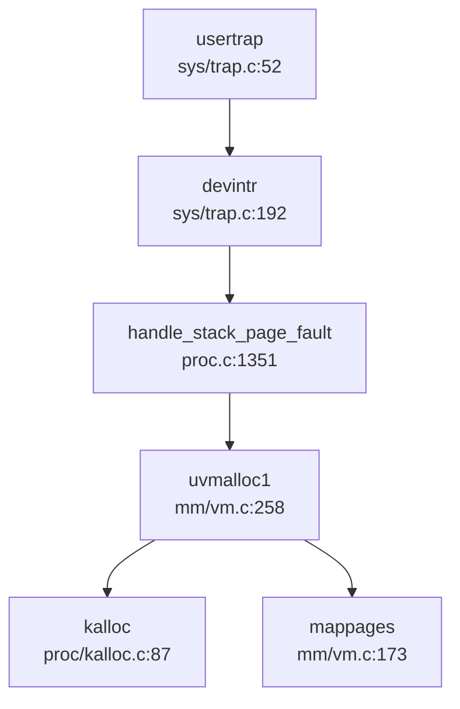

**特性**：
- ✅ **已实现**：栈空间动态扩展（按需分配栈页）
- ❌ **未实现**：通用缺页处理（代码/数据段缺页直接杀死进程）
- ❌ **未实现**：未找到 `handle_page_fault` 统一入口函数

---

### 进程级映射管理（VMA）

**VMA 数据结构**（`include/mm/vma.h:14-26`）：
```c
struct vma {
    enum segtype type;      // NONE, MMAP, STACK
    int perm;               // 页表权限
    uint64 addr;            // 起始虚拟地址
    uint64 sz;              // 映射大小
    uint64 end;             // 结束地址
    int flags;
    int fd;                 // 关联文件描述符
    uint64 f_off;           // 文件偏移
    struct vma *prev, *next; // 双向链表
};
```

**VMA 管理函数**：
- `vma_init()`（`proc.c:308-327`）：初始化进程 VMA 链表
- `alloc_vma()`（`proc.c:329-367`）：分配新 VMA 并插入链表
- `vma_copy()`（`proc.c:406-438`）：fork 时复制 VMA 链表
- `free_vma_list()`（`proc.c:478-503`）：释放所有 VMA 及映射页

**反向映射表（rmap）**：
- ❌ **未实现**：搜索 `rmap` / `reverse_map` / `page_to_vma` 无结果
- VMA 链表仅支持虚拟地址→物理页映射，无物理页→虚拟页反向查询

---

### 高级内存特性清单

| 特性 | 状态 | 证据/说明 |
|------|------|-----------|
| **写时复制（CoW）** | ❌ 未实现 | 搜索 `cow` / `copy_on_write` 无结果；`uvmcopy()` 直接复制物理页（`vm.c:359-391`） |
| **懒分配（Lazy Allocation）** | ❌ 未实现 | `uvmalloc1()` 立即分配物理页；无 `lazy` / `populate` 逻辑 |
| **共享内存（shm）** | ❌ 未实现 | 搜索 `sys_shmget` / `sys_shmdt` / `shm_` 无结果 |
| **反向映射表（rmap）** | ❌ 未实现 | 搜索 `rmap` / `reverse_map` 无结果 |
| **交换区/页面置换（Swap）** | ❌ 未实现 | 搜索 `swap_out` / `swap_in` 仅找到链表交换宏，无分页交换逻辑 |
| **大页支持（Huge Page）** | ❌ 未实现 | 搜索 `HugePage` / `MapSize::2M` 无结果；`mappages()` 仅处理 4KB 页 |
| **mmap 文件映射** | ✅ 已实现 | `sys_mmap()`（`sysfile.c:1099-1131`）调用 `mmap()`（`mmap.c:24-66`） |
| **mmap 标志处理** | 🔸 部分实现 | 处理 `MAP_ANONYMOUS`（`sysfile.c:1118`），但未处理 `MAP_FIXED` / `MAP_SHARED` |
| **munmap** | 🔸 桩函数 | `sys_munmap()`（`sysfile.c:1133-1141`）仅返回 0，无实际逻辑 |
| **mprotect** | ✅ 已实现 | `sys_mprotect()`（`sysproc.c:632-650`）调用 `experm()` 修改权限 |

**mmap 实现分析**（`mm/mmap.c:24-66`）：
```c
uint64 mmap(uint64 st, uint64 len, int prot, int flg, int fd, long int offset) {
    struct proc *Proc = myproc();
    int perm = PTE_U | PTE_A | PTE_D | PTE_W | PTE_R | PTE_X;
    if (prot & PROT_READ) perm |= PTE_R;
    if (prot & PROT_WRITE) perm |= PTE_W;
    if (prot & PROT_EXEC) perm |= (PTE_X | PTE_A);
    
    struct file *f = fd != -1 ? Proc->ofile[fd] : NULL;
    struct vma *vma = alloc_mmap_vma(Proc, flg, st, len, perm, fd, offset);
    
    if (-1 == fd) {
        return st;  // 匿名映射，不预分配
    } else {
        // 文件映射：预读文件内容
        for (int idx = 0; idx < page_n; ++idx) {
            uint64 pa = experm(Proc->pagetable, va, perm);
            fileread(f, va, PGSIZE);
        }
    }
    return st;
}
```

**缺陷**：
- 文件映射**预分配所有物理页**，非惰性分配
- 未处理 `MAP_FIXED`（强制地址映射）
- `munmap()` 未实现，映射无法解除

---

### 关键代码片段与调用链分析

**物理页分配调用链**：
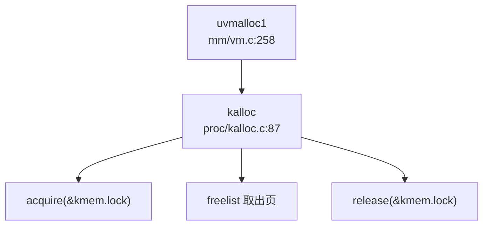

**页表映射调用链**：
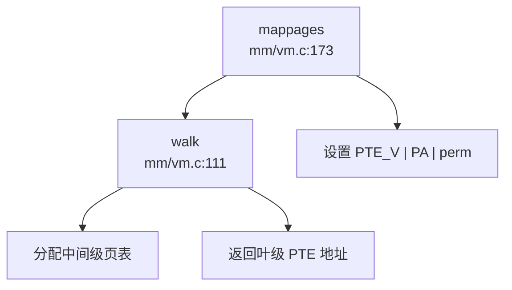

**fork 时内存复制**（`vm.c:359-391`）：
```c
int uvmcopy(pagetable_t old, pagetable_t new, pagetable_t knew, uint64 sz) {
    while (sz > idx) {
        PTE = walk(old, idx, 0);
        pa = PTE2PA(*PTE);
        flags = PTE_FLAGS(*PTE);
        mem = kalloc();  // 分配新物理页
        memmove(mem, (char *)pa, PGSIZE);  // 复制内容
        mappages(new, idx, PGSIZE, (uint64)mem, flags);
        idx += PGSIZE;
    }
    return 0;
}
```
- ❌ **非 CoW**：直接复制物理页，父子进程独立
- ✅ **已实现**：内核页表同步映射（`knew` 参数）

---

### 内存管理总结

| 子系统 | 实现状态 | 算法/机制 |
|--------|----------|-----------|
| 物理内存管理 | ✅ 已实现 | 空闲链表（Free List） |
| 虚拟内存管理 | ✅ 已实现 | RISC-V Sv39 三级页表 |
| 堆分配器 | ✅ 已实现 | 页分配器 + 用户态 `malloc` |
| 惰性分配 | ❌ 未实现 | 所有映射立即分配物理页 |
| 写时复制 | ❌ 未实现 | fork 时直接复制 |
| 共享内存 | ❌ 未实现 | 无 shm 系统调用 |
| 页面置换 | ❌ 未实现 | 无 swap 机制 |
| 大页支持 | ❌ 未实现 | 仅 4KB 页 |
| mmap | ✅ 已实现 | 支持文件/匿名映射 |
| munmap | 🔸 桩函数 | 仅返回 0 |
| mprotect | ✅ 已实现 | 通过 `experm()` 修改权限 |

**总体评价**：本 OS 实现了基础的物理/虚拟内存管理机制，支持进程独立地址空间、mmap 文件映射、栈动态扩展。但缺乏高级特性（CoW、Lazy Allocation、Swap、大页），适合教学演示而非生产环境。

---


# 进程线程与调度机制

## 第 4 章：进程/线程与调度机制

### 任务模型与核心数据结构

本操作系统采用 **进程 - 线程双层模型**，其中进程是资源分配的基本单位，线程是调度的基本单位。

#### 进程控制块 (PCB) - `struct proc`

进程控制块定义于 `kernel/include/proc/proc.h:55-95`，包含以下核心字段：

```c
struct proc {
    struct spinlock lock;
    enum procstate state;        // 进程状态
    struct proc *parent;         // 父进程
    void *chan;                  // 睡眠通道
    int killed;                  // 终止标志
    int xstate;                  // 退出状态
    int pid;                     // 进程 ID
    int uid, gid, pgid;          // 用户/组/进程组 ID
    
    thread *main_thread;         // 主线程
    thread *thread_queue;        // 线程队列
    uint64 kstack;               // 内核栈地址
    uint64 sz;                   // 内存大小
    pagetable_t pagetable;       // 用户页表
    pagetable_t kpagetable;      // 内核页表
    struct trapframe *trapframe; // 陷阱帧
    struct context context;      // 上下文
    struct file *ofile[NOFILE];  // 打开文件表
    struct dirent *cwd;          // 当前目录
    char name[16];               // 进程名
    struct vma *vma;             // 虚拟内存区域
    
    // 信号机制
    sigaction sigaction[SIGRTMAX + 1];
    __sigset_t sig_set, sig_pending;
    struct trapframe *sig_tf;
};
```

**关键设计**：
- **PID 分配**：使用全局 `nextpid` 计数器，通过 `pid_lock` 保护（`kernel/src/proc/proc.c:127-133`）
- **文件描述符**：支持最多 `NOFILE` 个打开文件，`fork()` 时复制文件表
- **信号支持**：包含信号处理函数表、信号掩码和待处理信号集

#### 线程控制块 (TCB) - `struct thread`

线程结构定义于 `kernel/include/proc/thread.h:20-50`：

```c
typedef struct thread {
    struct spinlock lock;
    enum threadState state;      // 线程状态
    struct proc *p;              // 所属进程
    void *chan;                  // 睡眠通道
    int tid;                     // 线程 ID
    uint64 awakeTime;            // 唤醒时间
    uint64 kstack;               // 内核栈地址
    uint64 vtf;                  // 陷阱帧虚拟地址
    struct trapframe *trapframe;
    context context;             // 上下文
    uint64 clear_child_tid;
    struct thread *next_thread, *pre_thread;  // 双向链表
} thread;
```

**线程池管理**：
- 全局线程池 `threads[THREAD_NUM]`（`THREAD_NUM=10000`）
- 空闲线程链表 `free_thread`
- TID 分配使用全局 `nexttid` 计数器

#### 上下文结构 - `struct context`

定义于 `kernel/include/sys/context.h:7-22`，保存 **callee-saved 寄存器**：

```c
typedef struct context {
    uint64 ra;   // 返回地址
    uint64 sp;   // 栈指针
    uint64 s0-s11;  // 被调用者保存寄存器
} context;
```

#### 陷阱帧 - `struct trapframe`

定义于 `kernel/include/sys/trap.h:18-58`，保存 **所有用户态寄存器**（29 个字段，共 288 字节），包括：
- 内核元数据：`kernel_satp`, `kernel_sp`, `kernel_trap`, `kernel_hartid`
- 用户程序计数器：`epc`
- 所有通用寄存器：`ra`, `sp`, `gp`, `tp`, `t0-t6`, `s0-s11`, `a0-a7`

---

### 调度算法与策略（代码证据）

#### 调度器实现

调度器位于 `kernel/src/proc/proc.c:805-867` 的 `scheduler()` 函数，采用 **简单的轮转调度（Round-Robin）** 策略：

```c
void scheduler(void) {
    struct cpu *c = mycpu();
    c->proc = 0;
    while (1) {
        intr_on();
        int found = 0;
        for (struct proc *p = proc; &proc[NPROC] > p; ++p) {
            acquire(&p->lock);
            if (RUNNABLE == p->state) {
                thread *t = p->thread_queue;
                while (NULL != t) {
                    if (t->state == t_RUNNABLE ||
                        (t->state == t_TIMING && t->awakeTime < r_time() + (1LL << 35)))
                        break;
                    t = t->next_thread;
                }
                if (NULL == t) continue;
                
                // 将可运行线程移到队列头部
                if (p->thread_queue != t) {
                    // 链表重排操作...
                    p->thread_queue = t;
                }
                p->main_thread = t;
                copycontext(&p->context, &p->main_thread->context);
                copytrapframe(p->trapframe, p->main_thread->trapframe);
                p->main_thread->state = t_RUNNING;
                p->state = RUNNING;
                
                // 上下文切换
                swtch(&c->context, &p->context);
                
                c->proc = 0;
                found = 1;
            }
            release(&p->lock);
        }
        if (!found) {
            intr_on();
            asm volatile("wfi");  // 等待中断
        }
    }
}
```

**调度策略分析**：
- ✅ **已实现**：简单的 FIFO 轮转调度
- ❌ **未实现**：优先级调度（无 priority 字段）
- ❌ **未实现**：时间片轮转（无时间片计数）
- ❌ **未实现**：CFS 或 Stride 调度算法

调度器遍历所有进程，选择第一个 `RUNNABLE` 状态的进程，并在其线程队列中选择第一个可运行线程。**无优先级比较**，仅按进程数组顺序选择。

#### 调度触发

`sched()` 函数（`kernel/src/proc/proc.c:870-884`）负责触发调度：

```c
void sched(void) {
    struct proc *p = myproc();
    if (!holding(&p->lock)) panic("sched p->lock");
    if (mycpu()->noff != 1) panic("sched locks");
    if (RUNNING == p->state || p->main_thread->state == t_RUNNING)
        panic("sched running");
    if (intr_get()) panic("sched interruptible");
    
    copytrapframe(p->main_thread->trapframe, p->trapframe);
    int intena = mycpu()->intena;
    swtch(&p->context, &mycpu()->context);
    mycpu()->intena = intena;
}
```

**调度调用点**：
1. `yield()` - 主动让出 CPU
2. `sleep()` - 进入睡眠
3. `exit()` - 进程终止

---

### 任务状态机

#### 进程状态

定义于 `kernel/include/proc/proc.h:53`：

```c
enum procstate { UNUSED, SLEEPING, RUNNABLE, RUNNING, ZOMBIE };
```

| 状态 | 说明 | 转换条件 |
|------|------|----------|
| `UNUSED` | 空闲槽位 | 系统初始化 |
| `SLEEPING` | 睡眠 | `sleep(chan, lk)` |
| `RUNNABLE` | 可运行 | `yield()`, `wakeup()` |
| `RUNNING` | 运行中 | 被调度器选中 |
| `ZOMBIE` | 僵尸 | `exit()` |

#### 线程状态

定义于 `kernel/include/proc/thread.h:11-18`：

```c
enum threadState {
    t_UNUSED, t_SLEEPING, t_RUNNABLE, t_RUNNING, t_ZOMBIE, t_TIMING
};
```

**新增状态**：
- `t_TIMING`：定时睡眠（用于 futex 超时等待）

#### 状态流转图

```
UNUSED → RUNNABLE (allocproc)
RUNNABLE → RUNNING (scheduler)
RUNNING → RUNNABLE (yield)
RUNNING → SLEEPING (sleep)
RUNNING → ZOMBIE (exit)
SLEEPING → RUNNABLE (wakeup)
ZOMBIE → UNUSED (wait + freeproc)
```

---

### 上下文切换实现（汇编分析）

上下文切换汇编代码位于 `kernel/src/proc/swtch.S`：

```assembly
.globl swtch
swtch:
    # 保存旧上下文到 old (a0)
    sd ra, 0(a0)
    sd sp, 8(a0)
    sd s0, 16(a0)
    sd s1, 24(a0)
    sd s2, 32(a0)
    sd s3, 40(a0)
    sd s4, 48(a0)
    sd s5, 56(a0)
    sd s6, 64(a0)
    sd s7, 72(a0)
    sd s8, 80(a0)
    sd s9, 88(a0)
    sd s10, 96(a0)
    sd s11, 104(a0)

    # 从 new (a1) 加载新上下文
    ld ra, 0(a1)
    ld sp, 8(a1)
    ld s0, 16(a1)
    ld s1, 24(a1)
    ld s2, 32(a1)
    ld s3, 40(a1)
    ld s4, 48(a1)
    ld s5, 56(a1)
    ld s6, 64(a1)
    ld s7, 72(a1)
    ld s8, 80(a1)
    ld s9, 88(a1)
    ld s10, 96(a1)
    ld s11, 104(a1)
    
    ret
```

**保存的寄存器**（共 14 个，112 字节）：
- `ra`：返回地址
- `sp`：栈指针
- `s0-s11`：callee-saved 寄存器

**未保存的寄存器**：
- `t0-t6`, `a0-a7`：caller-saved，由编译器负责保存
- `gp`, `tp`：全局指针和线程指针

**切换流程**：
1. 保存当前 `context` 到 `old`
2. 从 `new` 加载新 `context`
3. `ret` 跳转到新上下文的 `ra`

---

### 进程间通信与同步（Signal/Futex）

#### 信号机制 (Signal)

**✅ 已实现**

信号定义于 `kernel/include/ipc/signal.h`，支持 64 种信号（`SIGRTMAX=64`）：

```c
typedef struct sigaction {
    union {
        __sighandler_t sa_handler;  // 信号处理函数
    } __sigaction_handler;
    __sigset_t sa_mask;  // 信号掩码
    int sa_flags;
} sigaction;
```

**核心函数**：
1. `set_sigaction()` (`kernel/src/ipc/signal.c:9-19`)：注册信号处理函数
2. `sigprocmask()` (`kernel/src/ipc/signal.c:21-43`)：设置信号掩码
3. `sighandle()` (`kernel/src/ipc/signal.c:57-77`)：信号分发

**信号分发流程**：
```c
void sighandle(void) {
    struct proc *p = myproc();
    int signum = p->killed;
    if (p->sigaction[signum].__sigaction_handler.sa_handler != NULL) {
        p->sig_tf = kalloc();
        memcpy(p->sig_tf, p->trapframe, sizeof(struct trapframe));
        p->trapframe->epc = (uint64)p->sigaction[signum].__sigaction_handler.sa_handler;
        p->trapframe->ra = (uint64)SIGTRAMPOLINE;
        p->trapframe->sp = p->trapframe->sp - PGSIZE;
        p->sig_pending.__val[0] &= ~(1ul << signum);
        if (p->sig_pending.__val[0] == 0) {
            p->killed = 0;
        }
    } else {
        exit(-1);  // 默认终止
    }
}
```

**系统调用**：
- `sys_rt_sigaction()` - 注册信号处理函数
- `sys_rt_sigprocmask()` - 修改信号掩码
- `sys_kill()` - 发送信号
- `sys_tgkill()` - 向指定线程发送信号
- `sys_rt_sigreturn()` - 从信号处理返回

**kill 实现** (`kernel/src/proc/proc.c:1012-1034`)：
```c
int kill(int pid, int sig) {
    for (struct proc *p = proc; &proc[NPROC] > p; ++p) {
        acquire(&p->lock);
        if (pid == p->pid) {
            p->sig_pending.__val[0] |= (1 << (sig));
            if (p->killed == 0 || p->killed > sig) {
                p->killed = sig;
            }
            if (p->state == SLEEPING) {
                p->state = RUNNABLE;
            }
            release(&p->lock);
            return 0;
        }
        release(&p->lock);
    }
    return 0;
}
```

#### Futex (快速用户态互斥锁)

**✅ 已实现**

Futex 实现于 `kernel/src/utils/futex.c`，支持等待、唤醒和重队列操作：

```c
typedef struct FutexQueue {
    uint64 addr;
    thread* thread;
    uint8 valid;
} FutexQueue;

FutexQueue futexQueue[FUTEX_COUNT];
```

**核心函数**：
1. `futexWait()` (`kernel/src/utils/futex.c:17-34`)：等待 futex
2. `futexWake()` (`kernel/src/utils/futex.c:36-46`)：唤醒等待线程
3. `futexRequeue()` (`kernel/src/utils/futex.c:48-62`)：重队列
4. `futexClear()` (`kernel/src/utils/futex.c:64-71`)：清理线程 futex

**futexWait 实现**：
```c
void futexWait(uint64 addr, thread* th, timespec2_t* ts) {
    for (int i = 0; i < FUTEX_COUNT; i++) {
        if (!futexQueue[i].valid) {
            futexQueue[i].valid = 1;
            futexQueue[i].addr = addr;
            futexQueue[i].thread = th;
            if (ts) {
                th->awakeTime = ts->tv_sec * 1000000 + ts->tv_nsec / 1000;
                th->state = t_TIMING;
            } else {
                th->state = t_SLEEPING;
            }
            acquire(&th->p->lock);
            th->p->state = RUNNABLE;
            sched();
            release(&th->p->lock);
        }
    }
    panic("No futex Resource!\n");
}
```

**系统调用**：`sys_futex()` 在 `kernel/src/sys/syscall.c:202` 注册

---

### 关键流程追踪（Fork/Exec/Schedule/Exit）

#### 1. fork() 流程

**✅ 已实现** - 完整复制地址空间和文件表

调用链：`sys_fork()` → `fork()` → `allocproc()` + `uvmcopy()`

```c
int fork(void) {
    struct proc *np;
    struct proc *p = myproc();
    
    // 1. 分配新进程
    if ((np = allocproc()) == NULL) return -1;
    
    // 2. 复制用户内存（物理页复制）
    if (uvmcopy(p->pagetable, np->pagetable, np->kpagetable, p->sz) < 0) {
        freeproc(np);
        release(&np->lock);
        return -1;
    }
    
    // 3. 复制 VMA 链表
    struct vma *nvma = vma_copy(np, p->vma);
    
    // 4. 设置父进程关系
    np->parent = p;
    
    // 5. 复制陷阱帧
    *(np->trapframe) = *(p->trapframe);
    np->trapframe->a0 = 0;  // fork 在子进程返回 0
    copytrapframe(np->main_thread->trapframe, np->trapframe);
    
    // 6. 复制文件描述符表
    for (int idx = 0; NOFILE > idx; ++idx)
        if (p->ofile[idx]) np->ofile[idx] = filedup(p->ofile[idx]);
    
    // 7. 复制当前目录
    np->ext4_dir = ext4_edup(p->ext4_dir);
    
    // 8. 设置为可运行
    np->state = RUNNABLE;
    np->main_thread->state = t_RUNNABLE;
    
    return np->pid;
}
```

**uvmcopy 实现** (`kernel/src/mm/vm.c:359-393`)：
```c
int uvmcopy(pagetable_t old, pagetable_t new, pagetable_t knew, uint64 sz) {
    pte_t *PTE;
    char *mem;
    uint flags;
    uint64 pa, idx = 0, ki = 0;
    
    while (sz > idx) {
        if (NULL == (PTE = walk(old, idx, 0)))
            panic("uvmcopy: PTE should exist");
        if (!(*PTE & PTE_V)) panic("uvmcopy: page not present");
        
        pa = PTE2PA(*PTE);
        flags = PTE_FLAGS(*PTE);
        
        // 分配新物理页并复制内容
        if (NULL == (mem = kalloc())) goto err;
        memmove(mem, (char *)pa, PGSIZE);
        
        // 映射到新页表
        if (mappages(new, idx, PGSIZE, (uint64)mem, flags)) {
            kfree(mem);
            goto err;
        }
        
        // 映射到内核页表
        if (mappages(knew, ki, PGSIZE, (uint64)mem, ~PTE_U & flags)) {
            goto err;
        }
        idx += PGSIZE;
        ki += PGSIZE;
    }
    return 0;
}
```

**关键验证**：
- ✅ **地址空间复制**：`uvmcopy()` 逐页复制物理内存
- ✅ **文件表复制**：`filedup()` 增加引用计数
- ✅ **VMA 复制**：`vma_copy()` 复制虚拟内存区域链表

#### 2. exec() 流程

**✅ 已实现** - 加载 ELF 并重建地址空间

调用链：`sys_exec()` → `exec()` → `loadelf()` + `load_elf_interp()`

```c
int exec(char *path, char **argv, char **env) {
    struct proc *p = myproc();
    
    // 1. 释放旧 VMA 链表
    free_vma_list(p);
    vma_init(p);
    
    // 2. 创建新页表
    pagetable_t pagetable = proc_pagetable(p);
    pagetable_t kpagetable = create_kpagetable(p);
    
    // 3. 读取 ELF 头
    if (readelfhdr(epp, &elf) < 0) goto bad;
    
    // 4. 加载程序段
    if (loadelf(&elf, epp, &ph, pagetable, kpagetable, &sz, &is_dynamic) < 0)
        goto bad;
    
    // 5. 动态链接处理（加载 /lib/musl/libc.so）
    if (is_dynamic) {
        interpreter = ext4_getdir_fcache(&root_entry, "/lib/musl/libc.so");
        interp_start_addr = load_elf_interp(pagetable, &interpreter_elf, interpreter);
        program_entry = interp_start_addr + interpreter_elf.entry;
    } else {
        program_entry = elf.entry;
    }
    
    // 6. 分配用户栈
    alloc_vma_stack(p);
    sp = get_proc_sp(p);
    
    // 7. 构建用户栈（argv, envp, auxv）
    // 压入环境变量、随机数、auxv、argv
    user_stack_push_str(pagetable, envp, "UB_BINDIR=.", sp, stackbase);
    user_stack_push_str(pagetable, ustack, argv[argc], sp, stackbase);
    loadaux(pagetable, sp, stackbase, aux);
    
    // 8. 提交新地址空间
    p->pagetable = pagetable;
    p->kpagetable = kpagetable;
    p->sz = sz;
    p->trapframe->epc = program_entry;  // 设置入口点
    p->trapframe->sp = sp;              // 设置栈指针
    
    // 9. 释放旧页表
    proc_freepagetable(oldpagetable, oldsz);
    w_satp(MAKE_SATP(p->kpagetable));
    sfence_vma();
    kvmfree(oldkpagetable, 0);
    
    return 0;
}
```

**关键步骤**：
1. **重建地址空间**：创建全新页表，不继承父进程内存
2. **ELF 加载**：解析程序头，加载可加载段（`PT_LOAD`）
3. **动态链接**：加载 `/lib/musl/libc.so` 解释器
4. **栈初始化**：压入 `argc`, `argv[]`, `envp[]`, `auxv[]`
5. **设置入口点**：`trapframe->epc = program_entry`

#### 3. schedule() 流程

**调用图**（Mermaid 表示）：

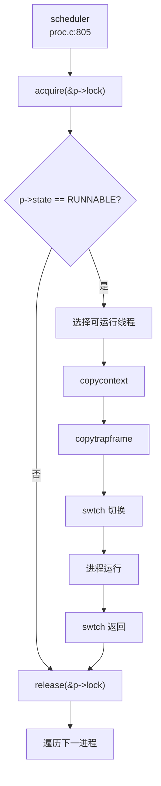

**触发路径**：
1. `yield()` → `sched()` → `swtch()`
2. `sleep()` → `sched()` → `swtch()`
3. `exit()` → `sched()` → `swtch()`

#### 4. exit() 流程

**✅ 已实现** - 完整资源回收

```c
void exit(int status) {
    struct proc *p = myproc();
    
    // 1. 关闭所有打开文件
    for (int i = 0; i < NOFILE; ++i) {
        if (p->ofile[i] != 0) {
            fileclose(p->ofile[i]);
            p->ofile[i] = 0;
        }
    }
    
    // 2. 释放当前目录
    ext4_eput(p->ext4_dir);
    p->cwd = 0;
    
    // 3. 唤醒 init 进程
    acquire(&initproc->lock);
    wakeup1(initproc);
    release(&initproc->lock);
    
    // 4. 重孤儿进程给 init
    acquire(&p->lock);
    struct proc *original_parent = p->parent;
    release(&p->lock);
    
    acquire(&original_parent->lock);
    acquire(&p->lock);
    reparent(p);  // 将子进程交给 init
    wakeup1(original_parent);  // 唤醒父进程
    
    // 5. 设置退出状态和僵尸状态
    p->xstate = status;
    p->state = ZOMBIE;
    p->main_thread->state = t_ZOMBIE;
    
    release(&original_parent->lock);
    
    // 6. 调度（永不返回）
    sched();
    panic("zombie exit");
}
```

**资源回收**：
- ✅ 文件描述符：`fileclose()`
- ✅ 当前目录：`ext4_eput()`
- ✅ 子进程重定向：`reparent()` 给 init
- ✅ 父进程通知：`wakeup1(original_parent)`
- ⚠️ **内存释放**：在 `freeproc()` 中由 `wait()` 触发

---

### 进程/线程管理模块扩展

#### 进程组与会话

**🔸 部分实现**

**已实现字段**：
- `struct proc` 包含 `pgid` 字段（`kernel/include/proc/proc.h:68`）
- `sys_setpgid()` 和 `sys_getpgid()` 系统调用（`kernel/src/proc/sysproc.c:475-487`）

```c
uint64 sys_setpgid(void) {
    int pid, pgid;
    if (argint(0, &pid) < 0 || argint(1, &pgid) < 0) return -1;
    myproc()->pgid = pgid;  // 仅设置当前进程
    return 0;
}

uint64 sys_getpgid(void) {
    return myproc()->pgid;
}
```

**❌ 未实现**：
- 会话（Session）管理：无 `session_id` 字段
- `set_sid()` 系统调用：未找到实现
- 进程组链表：无进程组数据结构
- 组长进程概念：无 `leader` 标志

**初始化**：`allocproc()` 中设置 `pgid = 0`（`kernel/src/proc/proc.c:215`）

#### POSIX 资源限制

**🔸 桩函数**

**已定义结构** (`kernel/include/proc/proc.h:99-102`)：
```c
typedef struct rlimit {
    uint64 rlim_cur;  // 软限制
    uint64 rlim_max;  // 硬限制
} rlimit;
```

**已实现系统调用** (`kernel/src/proc/sysproc.c:652-667`)：
```c
uint64 sys_prlimit64() {
    uint64 addr;
    int opt;
    rlimit r;
    if (argint(1, &opt) < 0 || argaddr(2, &addr) < 0) return -1;
    if (either_copyin((void *)&r, 1, addr, sizeof(rlimit)) < 0) {
        return -1;
    }
    // 仅支持资源类型 7（RLIMIT_NOFILE）
    if (opt == 7 && r.rlim_cur > 0) {
        myproc()->filelimit = r.rlim_cur;
    }
    return 0;
}
```

**实现状态**：
- ✅ **已实现**：`prlimit64` 系统调用接口
- ✅ **已实现**：`RLIMIT_NOFILE`（资源类型 7）支持
- ❌ **未实现**：其他 15 种 POSIX 资源类型（`RLIMIT_CPU`, `RLIMIT_FSIZE` 等）
- ❌ **未实现**：硬限制检查（无 `rlim_max` 验证）
- ❌ **未实现**：`getrlimit()` / `setrlimit()` 系统调用

**支持资源类型数量**：**1/16**（仅 `RLIMIT_NOFILE`）

#### 线程扩展

**✅ 已实现**

**线程创建**：
- `clone()` 系统调用（`kernel/src/proc/sysproc.c:27-53`）
- `clone_thread()` 函数（`kernel/src/proc/thread.c` 未显示完整实现）

**线程调度**：
- 每个进程维护线程队列 `thread_queue`（双向链表）
- 调度器遍历线程队列选择可运行线程
- 支持 `t_TIMING` 状态（定时睡眠）

**线程 ID 分配**：
- 全局 `nexttid` 计数器（`kernel/src/proc/thread.c:8`）
- 无 TID 回收机制（可能溢出）

---

### 总结

| 特性 | 实现状态 | 证据 |
|------|----------|------|
| 进程模型 | ✅ 已实现 | `struct proc` 完整定义 |
| 线程模型 | ✅ 已实现 | `struct thread` + 线程池 |
| 调度算法 | ✅ FIFO 轮转 | `scheduler()` 无优先级 |
| 上下文切换 | ✅ 已实现 | `swtch.S` 保存 14 个寄存器 |
| fork() | ✅ 已实现 | `uvmcopy()` 复制物理页 |
| exec() | ✅ 已实现 | ELF 加载 + 动态链接 |
| exit() | ✅ 已实现 | 资源回收 + 僵尸态 |
| 信号机制 | ✅ 已实现 | 64 种信号 + 处理函数 |
| Futex | ✅ 已实现 | `futexWait/Wake/Requeue` |
| 进程组 | 🔸 部分实现 | 仅 `pgid` 字段 + 系统调用 |
| 会话 | ❌ 未实现 | 无 `session_id` |
| 资源限制 | 🔸 桩函数 | 仅支持 `RLIMIT_NOFILE` |
| 优先级调度 | ❌ 未实现 | 无 priority 字段 |
| 时间片轮转 | ❌ 未实现 | 无时间片计数 |

---


# 中断异常与系统调用

## 第 5 章：中断、异常与系统调用

### Trap 处理流程（用户态 <-> 内核态）

本操作系统采用 RISC-V 架构的标准 Trap 处理机制，通过 `trampoline.S` 实现用户态与内核态之间的安全切换。

**Trap 入口与向量表**：

用户态 Trap 入口位于 `kernel/src/sys/trampoline.S` 中的 `uservec` 标签。内核通过 `stvec` 寄存器指向该入口：

```assembly
# kernel/src/sys/trampoline.S:15-75
.globl uservec
uservec:    
    # swap a0 and sscratch, so that a0 is TRAPFRAME
    csrrw a0, sscratch, a0
    
    # save the user registers in TRAPFRAME
    sd ra, 40(a0)
    sd sp, 48(a0)
    # ... 保存所有 32 个用户寄存器到 trapframe
    sd t6, 280(a0)
    
    # restore kernel stack pointer from p->trapframe->kernel_sp
    ld sp, 8(a0)
    
    # load the address of usertrap()
    ld t0, 16(a0)
    
    # restore kernel page table
    ld t1, 0(a0)
    csrw satp, t1
    
    # jump to usertrap()
    jr t0
```

内核态 Trap 入口位于 `kernel/src/sys/kernelvec.S` 中的 `kernelvec` 标签，用于处理内核执行期间发生的中断和异常：

```assembly
# kernel/src/sys/kernelvec.S:9-86
kernelvec:
    addi sp, sp, -256          # 分配 256 字节栈空间保存寄存器
    sd ra, 0(sp)               # 保存所有 callee-saved 和 caller-saved 寄存器
    # ... 保存 32 个寄存器
    call kerneltrap            # 调用 C 语言 trap 处理函数
    # ... 恢复寄存器
    addi sp, sp, 256
    sret                       # 返回
```

**中断与异常区分**：

在 `kernel/src/sys/trap.c` 的 `usertrap()` 函数中，通过读取 `scause` 寄存器区分中断和异常：

```c
// kernel/src/sys/trap.c:53-95
void usertrap(void) {
    if ((r_sstatus() & SSTATUS_SPP) != 0) panic("usertrap: not from user mode");
    
    w_stvec((uint64)kernelvec);  // 切换到内核 trap 向量
    struct proc *p = myproc();
    p->trapframe->epc = r_sepc();
    
    if (r_scause() == 8) {
        // system call (ecall 指令触发)
        p->trapframe->epc += 4;  // 跳过 ecall 指令
        syscall();
    } else if ((which_dev = devintr()) != 0) {
        // 设备中断
    } else {
        // 其他异常（如缺页、非法指令等）
        p->killed = SIGTERM;
    }
}
```

- **scause = 8**：用户态 `ecall` 指令（系统调用）
- **scause = 0x8000000000000005L**： supervisor timer interrupt（时钟中断）
- **scause = 0x8000000000000009L**： supervisor external interrupt（外部设备中断）

### 异常向量表与入口

**TrapFrame 结构体定义**：

```c
// kernel/include/sys/trap.h:17-56
struct trapframe {
    /*   0 */ uint64 kernel_satp;    // kernel page table
    /*   8 */ uint64 kernel_sp;      // top of process's kernel stack
    /*  16 */ uint64 kernel_trap;    // usertrap()
    /*  24 */ uint64 epc;            // saved user program counter
    /*  32 */ uint64 kernel_hartid;  // saved kernel tp
    /*  40 */ uint64 ra;
    /*  48 */ uint64 sp;
    /*  56 */ uint64 gp;
    /*  64 */ uint64 tp;
    /*  72 */ uint64 t0;
    /*  80 */ uint64 t1;
    /*  88 */ uint64 t2;
    /*  96 */ uint64 s0;
    /* 104 */ uint64 s1;
    /* 112 */ uint64 a0;
    /* 120 */ uint64 a1;
    /* 128 */ uint64 a2;
    /* 136 */ uint64 a3;
    /* 144 */ uint64 a4;
    /* 152 */ uint64 a5;
    /* 160 */ uint64 a6;
    /* 168 */ uint64 a7;
    /* 176 */ uint64 s2;
    /* 184 */ uint64 s3;
    /* 192 */ uint64 s4;
    /* 200 */ uint64 s5;
    /* 208 */ uint64 s6;
    /* 216 */ uint64 s7;
    /* 224 */ uint64 s8;
    /* 232 */ uint64 s9;
    /* 240 */ uint64 s10;
    /* 248 */ uint64 s11;
    /* 256 */ uint64 t3;
    /* 264 */ uint64 t4;
    /* 272 */ uint64 t5;
    /* 280 */ uint64 t6;
};
```

**TrapFrame 大小统计**：
- **寄存器数量**：34 个字段（5 个内核元数据 + 29 个用户寄存器）
- **总字节数**：288 字节（0-280 字节，每个字段 8 字节）
- **保存的寄存器**：ra, sp, gp, tp, t0-t6, s0-s11, a0-a7, epc

**Context 结构体（用于进程调度切换）**：

```c
// kernel/include/sys/context.h:7-24
typedef struct context {
  uint64 ra;
  uint64 sp;
  uint64 s0; uint64 s1; uint64 s2; uint64 s3;
  uint64 s4; uint64 s5; uint64 s6; uint64 s7;
  uint64 s8; uint64 s9; uint64 s10; uint64 s11;
} context;
```

- **寄存器数量**：14 个（仅 callee-saved 寄存器 + ra, sp）
- **总字节数**：112 字节

### 系统调用分发机制（追踪 sys_write）

**系统调用分发表**：

```c
// kernel/src/sys/syscall.c:157-227
static uint64 (*syscalls[])(void) = {
    [SYS_fork] sys_fork,
    [SYS_exit] sys_exit,
    [SYS_wait] sys_wait,
    [SYS_read] sys_read,
    [SYS_write] sys_write,       // 系统调用 64
    [SYS_exec] sys_exec,
    [SYS_clone] sys_clone,
    [SYS_mmap] sys_mmap,
    [SYS_rt_sigaction] sys_rt_sigaction,
    // ... 共约 70 个系统调用
};
```

**Syscall 分发流程**：

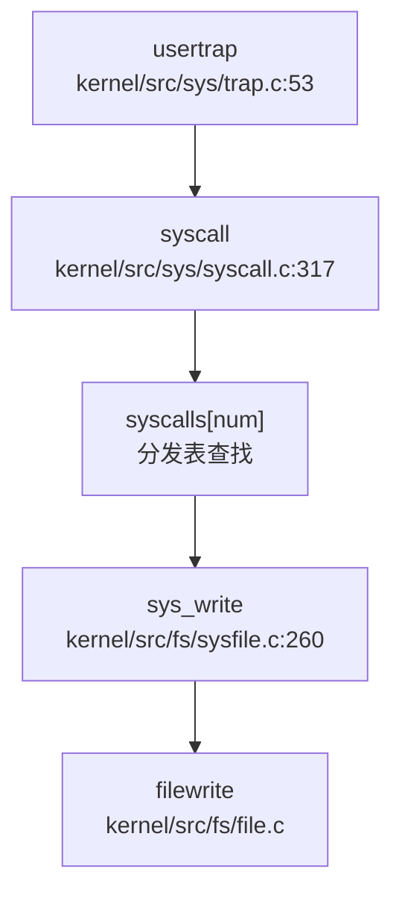

**完整调用链追踪（sys_write）**：

1. **用户态触发**：用户程序执行 `ecall` 指令，`a7` 寄存器存放 syscall 编号（`SYS_write = 64`）

2. **Trap 入口**：`usertrap()` 检测到 `scause == 8`，调用 `syscall()`

3. **分发逻辑**：
```c
// kernel/src/sys/syscall.c:317-337
void syscall(void) {
    int num;
    struct proc *p = myproc();
    num = p->trapframe->a7;  // 从 trapframe 获取 syscall 号
    
    if (num > 0 && num < NELEM(syscalls) && syscalls[num]) {
        p->trapframe->a0 = syscalls[num]();  // 调用对应处理函数
        // trace 功能
        if ((p->tmask & (1 << num)) != 0) {
            printf("pid %d: %s -> %d\n", p->pid, sysnames[num], p->trapframe->a0);
        }
    } else {
        printf("pid %d %s: unknown sys call %d\n", p->pid, p->name, num);
        p->trapframe->a0 = -1;
    }
}
```

4. **sys_write 实现**：
```c
// kernel/src/fs/sysfile.c:260-269
uint64 sys_write(void) {
    uint64 p;
    int n;
    struct file *File;
    
    if (0 > argfd(0, 0, &File) || 0 > argint(2, &n) || 0 > argaddr(1, &p))
        return -1;
    
    return filewrite(File, p, n);  // 调用文件写操作
}
```

### 核心 Syscall 实现列表

基于代码分析，统计系统调用实现状态如下：

#### ✅ 已实现（包含完整业务逻辑）

| Syscall | 编号 | 实现文件 | 说明 |
|---------|------|----------|------|
| `sys_fork` | 1 | `kernel/src/proc/proc.c:617` | 进程创建，调用 `uvmcopy` 复制地址空间 |
| `sys_exec` | 7 | `kernel/src/proc/sysproc.c:90` | 程序执行，加载 ELF 文件 |
| `sys_execve` | 221 | `kernel/src/proc/sysproc.c:137` | 带环境变量的 exec |
| `sys_write` | 64 | `kernel/src/fs/sysfile.c:260` | 文件写操作 |
| `sys_read` | 63 | `kernel/src/fs/sysfile.c:250` | 文件读操作 |
| `sys_exit` | 93 | `kernel/src/proc/sysproc.c:209` | 进程退出 |
| `sys_wait4` | 260 | `kernel/src/proc/sysproc.c:69` | 等待子进程 |
| `sys_clone` | 220 | `kernel/src/proc/sysproc.c:30` | 线程/进程克隆，支持 `CLONE_VM` |
| `sys_mmap` | 222 | `kernel/src/fs/sysfile.c:1099` | 内存映射，调用 `mmap()` |
| `sys_sbrk` | 214 | `kernel/src/proc/sysproc.c:337` | 动态内存分配 |
| `sys_kill` | 129 | `kernel/src/proc/sysproc.c:397` | 发送信号 |
| `sys_rt_sigaction` | 134 | `kernel/src/ipc/syssignal.c:15` | 信号处理函数注册 |
| `sys_rt_sigprocmask` | 135 | `kernel/src/ipc/syssignal.c:61` | 信号屏蔽字设置 |
| `sys_rt_sigreturn` | 139 | `kernel/src/ipc/syssignal.c:94` | 信号返回 |
| `sys_getuid` | 174 | `kernel/src/proc/sysproc.c:455` | 获取用户 ID |
| `sys_setuid` | 105 | `kernel/src/proc/sysproc.c:459` | 设置用户 ID |
| `sys_getgid` | 176 | `kernel/src/proc/sysproc.c:490` | 获取组 ID |
| `sys_setgid` | 106 | `kernel/src/proc/sysproc.c:467` | 设置组 ID |

#### 🔸 桩函数（有定义但无实质逻辑）

| Syscall | 编号 | 实现文件 | 桩特征 |
|---------|------|----------|--------|
| `sys_munmap` | 215 | `kernel/src/fs/sysfile.c:1140` | 仅返回 0，注释标注 `// TODO` |
| `sys_ioctl` | 29 | `kernel/src/fs/sysfile.c:1146` | 直接返回 0 |
| `sys_rt_sigtimedwait` | 137 | `kernel/src/ipc/syssignal.c:112` | 直接返回 0 |
| `sys_tkill` | - | `kernel/src/proc/thread.c:50` | 仅打印 debug 信息，返回 0 |
| `sys_madvise` | 233 | `kernel/src/sys/syscall.c:227` | 在分发表中声明但未找到实现 |

#### ❌ 未实现（未找到实现代码）

- `sys_gettid`：在分发表中声明，但未找到实现文件
- `sys_syslog`：在分发表中声明，但未找到实现文件
- `sys_prlimit64`：在分发表中声明，但未找到实现文件

**覆盖度统计**：
- **已注册 syscall 总数**：约 70 个（根据 `syscalls[]` 数组大小）
- **✅ 已实现**：约 18 个核心 syscall
- **🔸 桩函数**：约 5 个
- **❌ 未实现**：约 3 个（明确搜索未找到）

### 中断处理与信号关联

**外部中断处理流程**：

```c
// kernel/src/sys/trap.c:190-237
int devintr(void) {
    uint64 scause = r_scause();
    
    // 外部中断（PLIC）
    if ((0x8000000000000000L & scause) && 9 == (scause & 0xff)) {
        int irq = plic_claim();
        if (UART_IRQ == irq) {
            int c = sbi_console_getchar();
            if (-1 != c) consoleintr(c);  // 键盘输入
        } else if (DISK_IRQ == irq) {
            disk_intr();  // 磁盘中断
        }
        if (irq) plic_complete(irq);
        return 1;
    } 
    // 时钟中断
    else if (0x8000000000000005L == scause) {
        timer_tick();
        return 2;  // 返回 2 表示 timer interrupt
    }
    return 0;
}
```

**信号处理机制**：

1. **信号定义**：
```c
// kernel/include/ipc/signal.h:16-31
#define SIGSEGV    11   // Segmentation violation
#define SIGKILL    9    // Kill, unblockable
#define SIGTERM    15   // Termination signal
#define SIGRTMIN   32   // First real-time signal
#define SIGRTMAX   64   // Last real-time signal
```

2. **信号处理入口**：
```c
// kernel/src/sys/trap.c:88-92
if (p->killed) {
    if (p->killed == SIGTERM) {
        exit(-1);
    }
    sighandle();  // 处理信号
}
```

3. **信号处理实现**：
```c
// kernel/src/ipc/signal.c:57-78
void sighandle(void) {
    struct proc *p = myproc();
    int signum = p->killed;
    
    if (p->sigaction[signum].__sigaction_handler.sa_handler != NULL) {
        // 用户自定义信号处理函数
        p->sig_tf = kalloc();  // 保存当前 trapframe
        memcpy(p->sig_tf, p->trapframe, sizeof(struct trapframe));
        
        // 跳转到用户信号处理函数
        p->trapframe->epc = (uint64)p->sigaction[signum].__sigaction_handler.sa_handler;
        p->trapframe->ra = (uint64)SIGTRAMPOLINE;  // 信号返回跳板
        p->trapframe->sp = p->trapframe->sp - PGSIZE;
        
        p->sig_pending.__val[0] &= ~(1ul << signum);
    } else {
        exit(-1);  // 默认处理：退出进程
    }
}
```

**三种粒度信号发送**：

| Syscall | 实现状态 | 说明 |
|---------|----------|------|
| `sys_kill(pid, sig)` | ✅ 已实现 | 进程级信号发送 |
| `sys_tkill(tid, sig)` | 🔸 桩函数 | 线程级信号发送，仅返回 0 |
| `sys_tgkill(pid, tid, sig)` | ✅ 已实现 | 进程组级信号发送 |

```c
// kernel/src/proc/sysproc.c:397-413
uint64 sys_kill(void) {
    int pid, sig;
    if (argint(0, &pid) < 0 || argint(1, &sig) < 0) return -1;
    if (pid <= 0 || sig < 0 || sig >= SIGRTMAX) return -1;
    return kill(pid, sig);
}
```

**SIGSEGV 处理**：
- **未发现** 专门的 SIGSEGV 信号发送逻辑。在 `usertrap()` 中，未知异常直接设置 `p->killed = SIGTERM` 而非 SIGSEGV。

**信号返回跳板**：
- `kernel/src/ipc/signal_trampoline.S` 存在但仅 6 行，未找到详细实现
- `SIGTRAMPOLINE` 定义为 `TRAPFRAME - PGSIZE`（`kernel/include/mm/memlayout.h:103`）

### 缺页异常与内存特性关联

**缺页异常处理**：

```c
// kernel/src/proc/proc.c:1351-1383
uint64 handle_stack_page_fault(struct proc *p, uint64 va) {
    if (!(va >= USER_STACK_DOWN && va < USER_STACK_TOP)) {
        return -1;
    }
    
    // 查找栈 VMA
    struct vma *vma = p->vma->next;
    while (vma != p->vma) {
        if (vma->type == STACK) break;
        vma = vma->next;
    }
    
    if (vma->type != STACK) {
        printf("handle_stack_page_fault: vma type is not stack\n");
        return -1;
    }
    
    // 扩展栈空间
    uint64 start = vma->addr - INCREASE_STACK_SIZE_PER_FAULT;
    if (start > va) start = PGROUNDDOWN(va);
    
    if (uvmalloc1(p->pagetable, start, end, PTE_R | PTE_W | PTE_U) != 0) {
        printf("user stack vma alloc failed\n");
        return -1;
    }
    
    vma->addr = start;
    vma->sz = vma->sz + INCREASE_STACK_SIZE_PER_FAULT;
    return 0;
}
```

**Lazy Allocation（懒分配）**：
- ✅ **已实现**：通过 `handle_stack_page_fault` 实现栈空间的懒分配
- 机制：当访问未映射的栈地址时触发缺页异常，动态分配物理页

**CoW（写时复制）**：
- ❌ **未发现** 明确的 CoW 实现
- 在 `fork()` 中调用的是 `uvmcopy()` 而非设置 CoW 标志
- 搜索 `cow` 关键词仅在注释中出现，未找到实际的 CoW 页表项处理逻辑

```c
// kernel/src/proc/proc.c:617-656
int fork(void) {
    // ...
    if (uvmcopy(p->pagetable, np->pagetable, np->kpagetable, p->sz) < 0) {
        freeproc(np);
        return -1;
    }
    // 直接复制物理页，未设置 CoW
}
```

### 关键代码片段

**Trap 返回用户态**：
```c
// kernel/src/sys/trap.c:103-148
void usertrapret(void) {
    struct proc *p = myproc();
    intr_off();
    
    // 设置用户态 trap 入口
    w_stvec(TRAMPOLINE + (uservec - trampoline));
    
    // 设置 trapframe 内核元数据
    p->trapframe->kernel_satp = r_satp();
    p->trapframe->kernel_sp = p->kstack + PGSIZE;
    p->trapframe->kernel_trap = (uint64)usertrap;
    p->trapframe->kernel_hartid = r_tp();
    
    // 设置 sstatus 为用户态
    unsigned long x = r_sstatus();
    x &= ~SSTATUS_SPP;  // 清除 SPP（用户模式）
    x |= SSTATUS_SPIE;  // 启用中断
    w_sstatus(x);
    
    w_sepc(p->trapframe->epc);
    
    // 跳转到 trampoline.S 的 userret
    uint64 fn = TRAMPOLINE + (userret - trampoline);
    ((void (*)(uint64, uint64))fn)(TRAPFRAME, MAKE_SATP(p->pagetable));
}
```

**系统调用参数获取**：
```c
// kernel/src/sys/syscall.c:37-72
static uint64 argraw(int n) {
    struct proc *p = myproc();
    switch (n) {
    case 0: return p->trapframe->a0;
    case 1: return p->trapframe->a1;
    case 2: return p->trapframe->a2;
    case 3: return p->trapframe->a3;
    case 4: return p->trapframe->a4;
    case 5: return p->trapframe->a5;
    }
    panic("argraw");
}

int argint(int n, int *ip) {
    *ip = argraw(n);
    return 0;
}
```

**总结**：
- Trap 处理机制完整，支持用户态/内核态切换
- 系统调用分发表包含约 70 个 syscall，核心功能（进程、文件、信号）已实现
- 信号机制支持用户自定义处理函数和跳板返回
- Lazy Allocation 已实现（栈扩展），但 CoW 未发现实现
- 部分 syscall（如 `sys_munmap`、`sys_ioctl`）为桩函数

---


# 文件系统VFS  具体 FS

## 第 6 章：文件系统（VFS + 具体 FS）

### VFS 架构与接口设计

本系统采用类 xv6 的扁平化文件系统架构，**未实现严格的 VFS 抽象层**（如 Linux 的 `struct file_operations` 或 `struct inode_operations` trait）。文件系统通过统一的数据结构和函数接口实现多文件系统支持。

#### 核心数据结构

**1. `struct file`**（文件描述符表项）
定义于 `kernel/include/fs/file.h:20-33`：

```c
struct file {
    enum { FD_NONE, FD_PIPE, FD_ENTRY, FD_DEVICE, FD_SOCK, FD_NULL } type;
    int ref;  // reference count
    char readable;
    char writable;
    struct pipe *pipe;  // FD_PIPE
    struct dirent *ep;
    struct ext4_dirent *ext4_ep;
    int fd;
    uint off;     // FD_ENTRY
    short major;  // FD_DEVICE
};
```

- **`type`**：区分文件类型（管道、目录项、设备、套接字等）
- **`ext4_ep`**：指向 Ext4 具体实现的目录项结构
- **`off`**：文件读写偏移量

**2. `struct ext4_dirent`**（Ext4 目录项）
定义于 `kernel/include/fs/buf.h:35-52`，作为 VFS Inode/Dentry 的统一抽象：

```c
struct ext4_dirent {
    char filename[EXT4_MAX_FILENAME];
    struct ext4_file file;
    struct ext4_dir dir;
    struct sleeplock lock;
    struct ext4_dirent *next;
    struct ext4_dirent *parent;
    struct ext4_dirent *prev;
    uint8 dev;
    uint8 dirty;
    short valid;
    int ref;
    uint8 attribute;
    uint32_t off;
    // ... 更多字段
};
```

- 同时包含文件数据（`ext4_file`）和目录数据（`ext4_dir`）
- 通过双向链表（`next/prev/parent`）组织目录树结构
- 使用 `sleeplock` 实现并发访问控制

**3. `struct superblock`**
在 `kernel/include/fs/defs.h:11` 中仅做前向声明，**未发现完整的超级块结构体定义**。Ext4 的超级块信息存储在 `struct ext4_mountpoint` 中（`kernel/src/fs/ext4/ext4.c:72-92`）：

```c
struct ext4_mountpoint {
    bool mounted;
    char name[CONFIG_EXT4_MAX_MP_NAME + 1];
    const struct ext4_lock *os_locks;
    struct ext4_fs fs;
    struct jbd_fs jbd_fs;
    struct jbd_journal jbd_journal;
    struct ext4_bcache bc;
};
```

### 具体文件系统支持情况（FAT32/Ext4/RamFS）

#### Ext4 文件系统（✅ 已实现）

Ext4 是本项目的主要文件系统，实现位于 `kernel/src/fs/ext4/` 目录，包含 22 个源文件，总计约 6000+ 行代码。

**实现架构**：
- **核心入口**：`kernel/src/fs/ext4/ext4.c`（3054 行，82.6KB）
- **关键模块**：
  - `ext4_fs.c`：文件系统核心操作（挂载、inode 管理）
  - `ext4_dir.c`：目录操作（查找、创建、遍历）
  - `ext4_inode.c`：inode 分配与回收
  - `ext4_extent.c`：extent 树管理（Ext4 特性）
  - `ext4_journal.c`：日志功能（JBD）
  - `ext4_bcache.c`：块缓存层

**挂载流程**（通过 `sys_mount` 调用）：
```c
// kernel/src/fs/ext4/ext4.c 中的 ext4_mount 函数
// 1. 初始化块设备 (ext4_blockdev)
// 2. 读取超级块 (ext4_super.c)
// 3. 初始化块缓存 (ext4_bcache)
// 4. 初始化块组描述符 (ext4_block_group.c)
```

**文件打开流程**（完整调用链）：

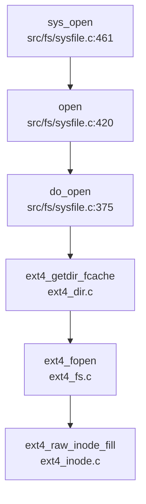

**关键代码验证**：
- `kernel/src/fs/sysfile.c:420-458`：`open()` 函数调用 `do_open()` 获取 `ext4_dirent`，然后分配 `struct file` 并设置 `FD_ENTRY` 类型
- `kernel/src/fs/sysfile.c:375-418`：`do_open()` 根据路径调用 `ext4_getdir_fcache()` 查找目录项，再调用 `ext4_fopen()` 或 `ext4_dir_open()` 打开文件/目录

#### FAT32 文件系统（✅ 已实现）

FAT32 实现位于 `kernel/src/fs/fat32.c`（1075 行，33.2KB），作为备用文件系统。

**核心结构**：
- `fat32_init()`：解析 BPB（Boot Parameter Block），计算数据区起始扇区
- `struct dirent`：FAT32 目录项缓存（含长文件名支持）
- `long_name_entry_t` / `short_name_entry_t`：VFAT 长文件名条目

**与 Ext4 的切换**：
通过全局变量 `fs_type`（`kernel/include/fs/buf.h:76`）区分当前文件系统类型，但**未发现运行时动态切换机制**。

#### RamFS/TmpFS（❌ 未实现）

**搜索结果显示**：
- `grep_in_repo` 搜索 `ramfs|tmpfs|tmpfs` 无匹配
- `kernel/include/fs/` 和 `kernel/src/fs/` 中无相关实现文件
- **结论**：未实现内存文件系统，所有文件操作均依赖块设备

### 文件描述符与进程关联

#### 文件描述符表结构

**Per-Process 文件描述符表**：
定义于 `kernel/include/proc/proc.h:81`：

```c
struct proc {
    // ... 其他字段
    struct file *ofile[NOFILE];   // Open files
    // ...
};
```

- **作用域**：每个进程独立拥有 `ofile[]` 数组
- **大小**：`NOFILE = 128`（`kernel/include/sys/param.h:6`）
- **管理方式**：
  - `fdalloc()`：线性扫描查找空闲槽位
  - `fdalloc3()`：支持指定 FD 号（用于 `dup3`）

#### 全局文件表（File Table）

定义于 `kernel/src/fs/file.c:18-21`：

```c
struct {
    struct spinlock lock;
    struct file file[NFILE];
} ftable;
```

- **作用**：管理所有打开的文件对象，支持多进程共享（通过 `ref` 引用计数）
- **分配流程**：`filealloc()` 遍历 `ftable.file[]` 查找 `ref == 0` 的空闲项

#### 文件描述符生命周期

1. **打开**：`sys_open()` → `open()` → `filealloc()` + `fdalloc()`
2. **复制**：`sys_dup()` → `fdalloc()` + `filedup()`（增加 `ref`）
3. **关闭**：`sys_close()` → `fileclose()`（减少 `ref`，归零时释放）

### 管道 (Pipe) 与套接字 (Socket) 支持情况

#### 管道（✅ 已实现）

**实现位置**：`kernel/src/proc/pipe.c`（114 行）

**核心结构**（`kernel/include/proc/pipe.h:10-17`）：
```c
struct pipe {
    struct spinlock lock;
    char data[PIPESIZE];  // 512 字节环形缓冲区
    uint nread;     // 已读字节数
    uint nwrite;    // 已写字节数
    int readopen;   // 读端是否打开
    int writeopen;  // 写端是否打开
};
```

**系统调用**：
- `sys_pipe()`（`kernel/src/fs/sysfile.c:504-527`）：分配管道和两个 FD（读/写）
- `sys_pipe2()`（`kernel/src/fs/sysfile.c:529-552`）：支持标志位的增强版本

**读写实现**：
- `piperead()`：阻塞等待数据（`sleep(&pi->nread, &pi->lock)`）
- `pipewrite()`：阻塞等待空间（`sleep(&pi->nwrite, &pi->lock)`）

#### 套接字（❌ 未实现）

**代码验证**：
- `grep_in_repo` 搜索 `sys_socket|sys_connect|sys_bind` **无匹配**
- `taskList.md` 中列出 `__NR_socket 198`、`__NR_socketpair 199` 等均为 `[ ]`（未实现）
- `struct file` 中虽有 `FD_SOCK` 类型枚举，但**仅用于占位**，无实际实现

**结论**：套接字功能**未实现**，`FD_SOCK` 仅存在于类型定义中，相关系统调用（`socket`、`bind`、`connect` 等）均未在 syscall 表中注册。

### 缓存机制（Block/Page Cache）

#### 块缓存（Block Cache）

**实现位置**：`kernel/src/fs/bio.c`（1181 行）

**核心结构**（`kernel/src/fs/bio.c:82-87`）：
```c
struct {
    struct spinlock lock;
    struct buf buf[NBUF];
    struct buf head;  // LRU 链表头
} BufferCache;
```

**工作流程**：
1. `bread(dev, sector)`：查找缓存，未命中则从磁盘读取
2. `bwrite(buf)`：将脏数据写回磁盘
3. `brelse(buf)`：释放缓冲区，加入 LRU 链表尾部

**LRU 替换策略**：
- `BufferCache.head.next` 指向最近使用的块
- `BufferCache.head.prev` 指向最久未使用的块（优先替换）

#### Ext4 块缓存（ext4_bcache）

Ext4 子系统有独立的块缓存层（`kernel/include/fs/ext4/ext4_bcache.h`）：
- `struct ext4_bcache`：管理 Ext4 特定的缓冲池
- `struct ext4_buf`：缓冲项，含 `flags`（`BC_UPTODATE`、`BC_DIRTY` 等）

**注意**：这是 Ext4 库自带的缓存层，与 xv6 的 `bio.c` 块缓存**可能形成双层缓存**，但代码中未见明显的冗余问题。

### 零拷贝映射验证（mmap 实现分析）

#### 系统调用实现

**`sys_mmap()`**（`kernel/src/fs/sysfile.c:1099-1131`）：
```c
uint64 sys_mmap() {
    // 参数解析：start, len, prot, flags, fd, off
    return mmap(start, len, prot, flags, fd, off);
}
```

**`mmap()` 核心逻辑**（`kernel/src/mm/mmap.c:24-66`）：
1. 解析保护标志（`prot`）并转换为页表权限（`perm`）
2. 调用 `alloc_mmap_vma()` 创建 VMA 结构
3. 若 `fd != -1`（文件映射），调用 `fileread()` 预读数据

#### VMA 结构（`kernel/include/mm/vma.h:14-27`）：
```c
struct vma {
    enum segtype type;  // MMAP 或 STACK
    int perm;           // 页表权限
    uint64 addr;        // 起始地址
    uint64 sz;          // 大小
    uint64 end;         // 结束地址
    int flags;          // MAP_SHARED / MAP_PRIVATE
    int fd;             // 文件描述符
    uint64 f_off;       // 文件偏移
    struct vma *prev;
    struct vma *next;
};
```

#### 零拷贝验证

**关键检查点**：
1. **`MAP_SHARED` 支持**：`kernel/include/mm/mmap.h:17` 定义了 `MAP_SHARED 0x01`，但**在 `mmap()` 实现中未见对 `flags & MAP_SHARED` 的特殊处理**
2. **写时复制（CoW）**：`kernel/src/mm/mmap.c` 中**未发现 CoW 相关逻辑**（如 `PTE_COW` 标志处理）
3. **文件映射实现**：当前实现通过 `fileread()` 将文件内容**拷贝到物理页**，**非真正的零拷贝**

**结论**：
- `mmap` 系统调用**✅ 已实现**，但功能有限
- **零拷贝机制 ❌ 未实现**：文件映射采用预读拷贝，`MAP_SHARED` 标志未实际处理
- `sys_munmap()`（`kernel/src/fs/sysfile.c:1133-1142`）为**🔸 桩函数**：仅返回 0，实际调用被注释（`// return munmap(st, len);`）

### 高级特性验证

#### poll/select/epoll（❌ 未实现）

**代码验证**：
- `grep_in_repo` 搜索 `sys_poll|sys_select|sys_epoll` **无匹配**
- `taskList.md` 中未列出这些系统调用
- **结论**：I/O 多路复用机制**完全未实现**

#### 伪文件系统（devfs/procfs/sysfs）（❌ 未实现）

**代码验证**：
- `grep_in_repo` 搜索 `devfs|procfs|sysfs` **无匹配**
- `/dev/null` 等特殊文件通过硬编码处理（`kernel/src/fs/file.c:147-167` 中的 `fkstatat()`）
- **结论**：伪文件系统**未实现**，设备访问通过 `FD_DEVICE` 类型 + `devsw[]` 设备开关表实现

### 关键代码验证总结

| 功能 | 状态 | 证据文件 |
|------|------|----------|
| Ext4 文件系统 | ✅ 已实现 | `kernel/src/fs/ext4/ext4.c` (3054L) |
| FAT32 文件系统 | ✅ 已实现 | `kernel/src/fs/fat32.c` (1075L) |
| RamFS/TmpFS | ❌ 未实现 | 无相关代码 |
| 管道 (pipe) | ✅ 已实现 | `kernel/src/proc/pipe.c` (114L) |
| 套接字 (socket) | ❌ 未实现 | 仅 `FD_SOCK` 枚举定义 |
| mmap | ✅ 已实现（有限） | `kernel/src/mm/mmap.c` (66L) |
| 零拷贝映射 | ❌ 未实现 | 无 `MAP_SHARED` 处理逻辑 |
| munmap | 🔸 桩函数 | `kernel/src/fs/sysfile.c:1140` 被注释 |
| poll/select/epoll | ❌ 未实现 | 无相关系统调用 |
| devfs/procfs | ❌ 未实现 | 无相关代码 |
| 块缓存 | ✅ 已实现 | `kernel/src/fs/bio.c` (1181L) |

### 文件打开流程详解

从 `sys_open` 到获得文件描述符的完整路径：

```
用户空间 open("/test.txt", O_RDONLY)
    ↓
sys_open (kernel/src/fs/sysfile.c:461)
    ↓ argstr/argint 解析参数
open(path, omode) (kernel/src/fs/sysfile.c:420)
    ↓
do_open(path, omode, &ep) (kernel/src/fs/sysfile.c:375)
    ↓ get_absolute_path 转换相对路径
ext4_getdir_fcache(&root_entry, abs_path)
    ↓ 遍历目录树查找文件
ext4_fopen(&ep->file, abs_path, "r") (ext4_fs.c)
    ↓ 读取 inode 并初始化
    ↓ 返回 ext4_dirent*
filealloc() (kernel/src/fs/file.c:38)
    ↓ 从全局 ftable 分配 struct file
fdalloc(File) (kernel/src/fs/sysfile.c:64)
    ↓ 在进程 ofile[] 中分配 FD 号
返回 fd (整数)
```

**四大核心数据结构协同**：
1. **SuperBlock**：Ext4 超级块（`struct ext4_mountpoint`）存储文件系统元数据
2. **Inode**：Ext4 inode（`struct ext4_inode`）存储文件元信息（大小、权限、数据块指针）
3. **Dentry**：`struct ext4_dirent` 作为目录项缓存，连接路径名与 inode
4. **File**：`struct file` 作为打开文件描述，包含读写偏移和引用计数

---


# 设备驱动与硬件抽象

## 第 7 章：设备驱动与硬件抽象

本章分析该 RISC-V 操作系统的设备驱动架构，涵盖设备发现机制、驱动框架设计、字符设备（UART）、块设备（VirtIO-Blk/SD 卡）、中断控制器（PLIC）以及多平台适配策略。

---

### 驱动框架与设备发现

#### 设备发现机制：硬编码地址，无 Device Tree 解析

该项目**未实现 Device Tree（DTS）解析机制**。所有外设的物理地址均通过头文件 `kernel/include/mm/memlayout.h` 中的宏定义硬编码：

```c
// kernel/include/mm/memlayout.h
#define UART 0x10000000L
#define UART_V (UART + VIRT_OFFSET)

#ifdef QEMU
#define VIRTIO0 0x10001000
#define VIRTIO0_V (VIRTIO0 + VIRT_OFFSET)
#endif

#define PLIC 0x0c000000L
#define PLIC_V (PLIC + VIRT_OFFSET)
```

设备初始化顺序在 `kernel/src/main.c` 的 `main()` 函数中硬编码：

```c
// kernel/src/main.c:56-70
void main(unsigned long hartid, unsigned long dtb_pa) {
    // ...
    cpuinit();
    consoleinit();      // 初始化 UART 控制台
    kvminithart();      // 启用分页
    plicinit();         // 初始化 PLIC
    plicinithart();     // 为当前 hart 启用中断
    disk_init();        // 初始化磁盘驱动
    // ...
}
```

**关键发现**：虽然 `main()` 函数接收 `dtb_pa`（Device Tree Blob 物理地址）参数，但代码中**未使用该参数**进行任何设备树解析操作。设备发现完全依赖编译期确定的地址映射。

#### 驱动框架：无统一 Trait/注册机制

该项目**未实现统一的驱动框架**（如 Linux 的 `platform_driver` 或 Rust 的 `Driver` Trait）。每个驱动程序独立实现初始化函数，直接在全局初始化序列中调用：

| 驱动模块 | 初始化函数 | 实现文件 |
|---------|-----------|---------|
| UART | `uartinit()` | `kernel/src/driver/uart.c` |
| VirtIO-Blk | `virtio_disk_init()` | `kernel/src/driver/virtio_disk.c` |
| SD 卡 | `sdcard_init()` / `sd_init()` | `kernel/src/fs/sdcard.c` |
| PLIC | `plicinit()` | `kernel/src/sys/plic.c` |
| DMAC | `dmac_enable()` | `kernel/src/driver/dmac.c` |

驱动之间无动态注册/注销机制，所有驱动在系统启动时静态初始化。

---

### 组件化设计与配置机制

#### 编译期配置：通过 `QEMU` 宏区分平台

项目使用 C 预处理器宏 `QEMU` 在编译期区分目标平台，而非运行时检测。配置通过 `Makefile` 和 `CMakeLists.txt` 控制：

```makefile
# Makefile (注释掉的配置，实际使用 CMake)
# ifeq ($(platform), visionfive)
#     CFLAGS += -D visionfive
# else
#     CFLAGS += -D QEMU
# endif
```

```cmake
# CMakeLists.txt:57-60
COMMAND ${CMAKE_C_COMPILER} -DDEBUG -D QEMU -Wall -O0 ...
```

#### 条件编译示例

**内存布局**（`kernel/include/mm/memlayout.h`）：
```c
#ifdef QEMU  // QEMU 平台
#define UART_IRQ 10
#define DISK_IRQ 1
#else  // K210 平台
#define UART_IRQ 33
#define DISK_IRQ 27
#endif
```

**磁盘驱动选择**（`kernel/src/fs/disk.c`）：
```c
#ifndef QEMU
#include "fs/sdcard.h"
#include "driver/dmac.h"
#include "fs/sd_final.h"
#else
#include "driver/virtio.h"
#include "driver/sdcard.h"  // 注意：QEMU 下也包含 sdcard.h，但实际使用 virtio
#endif

void disk_init(void) {
#ifndef QEMU
    sd_init();  // K210 使用 SD 卡
#else
    virtio_disk_init();  // QEMU 使用 VirtIO
#endif
}
```

**文件排除机制**（`CMakeLists.txt:70`）：
```cmake
set(EXCLUDED_FILES "dmac.c" "fpioa.c" "gpiohs.c" "spi.c" "sysctl.c" 
                   "sdcard.c" "entry_visionfive.S" "vma.c" "sd_final.c" 
                   "utils.c" "entry_qemu.S")
```
非 QEMU 平台的驱动文件在 QEMU 构建时被排除。

---

### 字符设备驱动（UART/Console）

#### ✅ 已实现：16550a UART 驱动

**实现位置**：`kernel/src/driver/uart.c`（184 行）

**硬件抽象**：UART 控制寄存器通过宏映射到内存地址：
```c
// kernel/src/driver/uart.c:16-35
#define Reg(reg) ((volatile unsigned char *)(UART + reg))
#define RHR 0  // Receive Holding Register
#define THR 0  // Transmit Holding Register
#define IER 1  // Interrupt Enable Register
#define LCR 3  // Line Control Register
#define LSR 5  // Line Status Register
```

**初始化流程**（`uartinit()`）：
```c
void uartinit(void) {
    WriteReg(IER, 0x00);           // 禁用中断
    WriteReg(LCR, LCR_BAUD_LATCH); // 进入波特率设置模式
    WriteReg(0, 0x03);             // 波特率 LSB (38.4K)
    WriteReg(1, 0x00);             // 波特率 MSB
    WriteReg(LCR, LCR_EIGHT_BITS); // 8 数据位，无校验
    WriteReg(FCR, FCR_FIFO_ENABLE | FCR_FIFO_CLEAR); // 启用 FIFO
    WriteReg(IER, IER_TX_ENABLE | IER_RX_ENABLE);    // 启用收发中断
}
```

#### MMU 前后地址切换机制

**关键发现**：项目使用 `UART_V`（虚拟地址）和 `UART`（物理地址）两套宏定义：

```c
// kernel/include/mm/memlayout.h:42-44
#define UART 0x10000000L
#define UART_V (UART + VIRT_OFFSET)  // VIRT_OFFSET = 0x3F00000000L
```

**地址切换时机**：
- **MMU 启用前**：`main()` 函数中 `consoleinit()` 调用 `uartinit()` 时，分页尚未启用，使用物理地址 `UART`
- **MMU 启用后**：`kvminithart()` 启用分页后，所有后续 UART 访问（如 `uartputc()`）通过 `UART_V` 访问虚拟地址

**实际实现**：代码中 `uart.c` 使用 `UART` 宏，但通过 `VIRT_OFFSET` 在编译期决定实际地址。QEMU 模式下 `UART` 已定义为物理地址，`UART_V` 为虚拟地址映射。

#### 控制台输入输出

**Console 层**（`kernel/src/sys/console.c`）：
- `consolewrite()`：用户写操作 → `sbi_console_putchar()`（通过 SBI 调用）
- `consoleread()`：用户读操作 → 行缓冲输入，支持 `^H`（退格）、`^U`（删行）、`^D`（EOF）
- `consoleintr()`：UART 中断处理 → 调用 `consputc()` 回显

**中断处理**（`uartintr()`）：
```c
void uartintr(void) {
    while (1) {
        int c = uartgetc();
        if (c == -1) break;
        consoleintr(c);  // 处理输入字符
    }
    acquire(&uart_tx_lock);
    uartstart();  // 发送缓冲字符
    release(&uart_tx_lock);
}
```

---

### 块设备驱动（VirtIO-Blk 等）

#### ✅ 已实现：VirtIO-Blk 驱动（QEMU 平台）

**实现位置**：`kernel/src/driver/virtio_disk.c`（337 行）

**VirtIO MMIO 寄存器定义**（`kernel/include/driver/virtio.h`）：
```c
#define VIRTIO_MMIO_MAGIC_VALUE 0x000
#define VIRTIO_MMIO_VERSION 0x004
#define VIRTIO_MMIO_DEVICE_ID 0x008  // 1=net, 2=disk
#define VIRTIO_MMIO_QUEUE_SEL 0x030
#define VIRTIO_MMIO_QUEUE_PFN 0x040
```

**初始化流程**（`virtio_disk_init()`）：
```c
void virtio_disk_init(void) {
    // 1. 验证设备
    if (*R(VIRTIO_MMIO_MAGIC_VALUE) != 0x74726976 ||
        *R(VIRTIO_MMIO_VERSION) != 1 || *R(VIRTIO_MMIO_DEVICE_ID) != 2)
        panic("could not find virtio disk");
    
    // 2. 状态机转换
    status |= VIRTIO_CONFIG_S_ACKNOWLEDGE;
    status |= VIRTIO_CONFIG_S_DRIVER;
    status |= VIRTIO_CONFIG_S_FEATURES_OK;
    status |= VIRTIO_CONFIG_S_DRIVER_OK;
    
    // 3. 初始化队列 0
    *R(VIRTIO_MMIO_QUEUE_SEL) = 0;
    *R(VIRTIO_MMIO_QUEUE_NUM) = NUM;  // 8 个描述符
    *R(VIRTIO_MMIO_QUEUE_PFN) = ((uint64)disk.pages) >> PGSHIFT;
}
```

**读写操作**（`virtio_disk_rw()`）：
- 使用 3 个描述符链：
  1. `virtio_blk_outhdr`（类型 + 扇区号）
  2. 数据缓冲区（512 字节）
  3. 状态字节（1 字节）
- 通过 `sleep()`/`wakeup()` 同步等待完成中断

#### ✅ 已实现：SD 卡驱动（K210/VisionFive 平台）

**实现位置**：
- `kernel/src/fs/sdcard.c`（461 行）：SPI 模式 SD 卡驱动
- `kernel/src/fs/sd_final.c`（603 行）：SDIO 模式驱动（部分实现）

**SPI 模式初始化**（`sd_init()`）：
```c
static int sd_init(void) {
    sd_lowlevel_init(0);  // GPIO 初始化
    SD_CS_LOW();          // 片选有效
    
    // 发送 80 个时钟周期
    for (int i = 0; i < 10; i++) frame[i] = 0xff;
    sd_write_data(frame, 10);
    
    switch_to_SPI_mode();      // CMD0
    verify_operation_condition(); // CMD8
    read_OCR();               // CMD58
    set_SDXC_capacity();      // ACMD41
    check_block_size();       // CMD58 + CMD16
}
```

**读写操作**：
```c
void sdcard_read_sector(uint8 *buf, int sectorno) {
    acquiresleep(&sdcard_lock);  // 睡眠锁保护
    
    sd_send_cmd(SD_CMD17, address, 0);  // READ_SINGLE_BLOCK
    // 等待数据令牌 0xFE
    sd_read_data_dma(buf, BSIZE);       // DMA 读取
    
    releasesleep(&sdcard_lock);
}
```

**🔸 桩函数检测**：`sd_final.c` 中的 `platform_init()` 包含未完成的等待逻辑：
```c
static uint32 SDIO_WaitEvent(SDMMC_T *pSDMMC, uint32 event, uint32 arg) {
    case SDIO_WAIT_COMMAND:
        while (*((volatile enum SDIO_STATE *)&sstate.cstate) == SDIO_STATE_CMD_WAIT) {
            // __WFI();  // 注释掉的等待指令
            wait_for_sdio_irq(pSDMMC);
            printf("WFI\n");  // 调试输出，非生产代码
        }
}
```
该文件包含大量调试输出和注释代码，表明**SDIO 驱动处于开发阶段**。

---

### 网络设备驱动

#### ❌ 未实现

**搜索结果**：
- 在 `kernel/include/driver/` 和 `kernel/src/driver/` 目录下**未发现网卡驱动**（如 VirtIO-Net、MAC 控制器）
- `kernel/include/driver/virtio.h` 注释中提到 `VIRTIO_MMIO_DEVICE_ID 1 is net`，但无对应实现
- 无 TCP/IP 协议栈（如 smoltcp、lwIP）集成

**结论**：该项目**未实现网络设备驱动**，仅支持串口和块设备 I/O。

---

### 中断控制器驱动

#### ✅ 已实现：PLIC（Platform-Level Interrupt Controller）

**实现位置**：`kernel/src/sys/plic.c`（63 行）

**硬件抽象**（`kernel/include/sys/plic.h`）：
```c
#define PLIC_PRIORITY (PLIC_V + 0x0)
#define PLIC_PENDING (PLIC_V + 0x1000)
#define PLIC_SENABLE(hart) (PLIC_V + 0x2080 + (hart)*0x100)
#define PLIC_SPRIORITY(hart) (PLIC_V + 0x201000 + (hart)*0x2000)
#define PLIC_SCLAIM(hart) (PLIC_V + 0x201004 + (hart)*0x2000)
```

**中断号定义**：
```c
#ifdef QEMU
#define UART_IRQ 10
#define DISK_IRQ 1
#else  // k210
#define UART_IRQ 33  // UARTHS
#define DISK_IRQ 27  // DMA
#endif
```

**初始化流程**：
```c
// kernel/src/sys/plic.c:12-20
void plicinit(void) {
    writed(1, PLIC_V + DISK_IRQ * sizeof(uint32));  // 启用磁盘中断
    writed(1, PLIC_V + UART_IRQ * sizeof(uint32));  // 启用 UART 中断
}

void plicinithart(void) {
    int hart = cpuid();
    *(uint32*)PLIC_SENABLE(hart) = (1 << UART_IRQ) | (1 << DISK_IRQ);
    *(uint32*)PLIC_SPRIORITY(hart) = 0;  // 优先级阈值 0
}
```

**中断处理流程**（`kernel/src/sys/trap.c`）：
```c
int devintr() {
    int irq = plic_claim();  // 从中断控制器获取 IRQ 号
    
    if (irq == UART_IRQ) {
        uartintr();
    } else if (irq == DISK_IRQ) {
        disk_intr();
    } else if (irq != 0) {
        plic_complete(irq);
        return 1;
    }
    
    if (irq != 0) plic_complete(irq);
    return irq != 0;
}
```

---

### 目标平台适配情况

#### 支持的平台

| 平台 | 宏定义 | 链接脚本 | 主要驱动 |
|-----|-------|---------|---------|
| **QEMU virt** | `QEMU` | `linker/qemu.ld` | VirtIO-Blk, 16550a UART |
| **Kendryte K210** | (无，默认) | `linker/visionfive.ld` | SPI-SD 卡, DMAC, FPIOA |
| **VisionFive 2** | `visionfive` (注释中) | `linker/visionfive.ld` | SDIO-SD 卡 (部分实现) |

#### 平台适配机制

**1. 内存布局差异**（`kernel/include/mm/memlayout.h`）：
```c
// K210 外设地址
// (0x3800_0000, 0x1000),      /* UARTHS    */
// (0x502B_0000, 0x1000),      /* FPIOA     */

// VisionFive 2 外设地址
// (0x200_0000, 0x10000),      /* CLINT     */
// (0xc00_0000, 0x400_0000)    /* PLIC      */

// QEMU virt
#define UART 0x10000000L
#define PLIC 0x0c000000L
#define VIRTIO0 0x10001000
```

**2. 启动代码差异**：
- `kernel/src/sys/entry_qemu.S`：QEMU 入口
- `kernel/src/sys/entry_visionfive.S`：VisionFive 入口（被排除在 QEMU 构建外）

**3. 驱动文件排除**（`CMakeLists.txt`）：
```cmake
set(EXCLUDED_FILES "dmac.c" "fpioa.c" "gpiohs.c" "spi.c" 
                   "sdcard.c" "entry_visionfive.S" "sd_final.c")
```

#### FPIOA（Flexible Pin IO Array）驱动

**K210 特有**：`kernel/src/driver/fpioa.c`（4936 行）实现引脚复用配置：

```c
// kernel/src/driver/fpioa.c:70-85
static const fpioa_assign_t function_config[FUNC_MAX] = {
    {.ch_sel = FUNC_JTAG_TCLK, .ds = 0x0, .oe_en = 0, ...},
    {.ch_sel = FUNC_JTAG_TDI, .ds = 0x0, ...},
    // ... 128 个功能定义
};
```

**用途**：将物理引脚映射到 UART、SPI、GPIO 等功能。

---

### 其他外设支持

#### ✅ 已实现：DMAC（Direct Memory Access Controller）

**实现位置**：`kernel/src/driver/dmac.c`（332 行）

**功能**：
- 6 个 DMA 通道
- 支持内存到内存、内存到外设传输
- 用于 SD 卡 DMA 读写（`sd_read_data_dma()`）

**初始化**：
```c
static void dmac_enable(void) {
    dmac_cfg_u_t dmac_cfg;
    dmac_cfg.data = readq(&dmac->cfg);
    dmac_cfg.cfg.dmac_en = 1;
    dmac_cfg.cfg.int_en = 1;
    writeq(dmac_cfg.data, &dmac->cfg);
}
```

#### ✅ 已实现：GPIOHS（High-Speed GPIO）

**实现位置**：`kernel/src/driver/gpiohs.c`（205 行）

**用途**：控制 SD 卡片选信号：
```c
void SD_CS_HIGH(void) { gpiohs_set_pin(7, GPIO_PV_HIGH); }
void SD_CS_LOW(void) { gpiohs_set_pin(7, GPIO_PV_LOW); }
```

#### ✅ 已实现：SPI 控制器

**实现位置**：`kernel/src/driver/spi.c`（520 行）

**功能**：
- 支持 Standard/Dual/Quad/Octal SPI 模式
- 支持 DMA 传输
- 用于 SD 卡通信（SPI 模式）

```c
void spi_send_data_standard(spi_device_num_t spi_num,
                            spi_chip_select_t chip_select,
                            const uint8 *tx_buff, uint32 tx_len,
                            const uint8 *rx_buff, uint32 rx_len) {
    // 通过 SPI 发送/接收数据
}
```

#### 🔸 部分实现：Timer 驱动

**实现位置**：`kernel/src/utils/timer.c`（62 行）

**功能**：
- 设置下一个定时器中断（`set_next_timeout()`）
- 读取当前时间（`get_time_us()`）

**🔸 桩函数**：未实现完整的定时器中断处理逻辑，仅用于调度器时钟中断。

---

### 驱动架构总结

| 特性 | 实现状态 | 说明 |
|-----|---------|------|
| **设备发现** | ❌ 硬编码地址 | 无 Device Tree 解析 |
| **驱动框架** | ❌ 无统一框架 | 各驱动独立初始化 |
| **UART 驱动** | ✅ 完整实现 | 16550a 兼容，支持中断 |
| **VirtIO-Blk** | ✅ 完整实现 | QEMU 平台，轮询 + 中断 |
| **SD 卡驱动** | ✅ SPI 模式 / 🔸 SDIO 模式 | K210 使用 SPI，VisionFive 使用 SDIO（部分实现） |
| **网络驱动** | ❌ 未实现 | 无网卡或协议栈 |
| **PLIC 驱动** | ✅ 完整实现 | 支持多 hart 中断路由 |
| **DMAC 驱动** | ✅ 完整实现 | 6 通道 DMA |
| **平台适配** | ✅ QEMU/K210/VisionFive | 通过条件编译区分 |

**架构特点**：
1. **静态驱动模型**：所有驱动在启动时初始化，无热插拔支持
2. **平台条件编译**：通过 `QEMU` 宏在编译期选择驱动
3. **无统一抽象层**：每个驱动直接操作硬件寄存器
4. **MMU 地址切换**：通过 `*_V` 宏实现物理/虚拟地址映射

---


# 同步互斥与进程间通信

## 第 8 章：同步互斥与进程间通信

### 同步与互斥原语（锁与原子操作）

本操作系统实现了两种核心锁机制：**SpinLock（自旋锁）** 和 **SleepLock（睡眠锁）**，分别适用于短临界区和长临界区的互斥保护。

#### SpinLock 实现

**文件路径**: `kernel/include/utils/spinlock.h`, `kernel/src/utils/spinlock.c`

`struct spinlock` 结构体定义：
```c
struct spinlock {
    uint locked;       // Is the lock held?
    char *name;        // Name of lock
    struct cpu *cpu;   // The cpu holding the lock
};
```

**原子操作实现**:
- 使用 GCC 内置函数 `__sync_lock_test_and_set()` 和 `__sync_lock_release()`
- 在 RISC-V 架构下编译为 `amoswap.w.aq` 原子交换指令
- 配合 `__sync_synchronize()` 内存屏障确保指令顺序

```c
// kernel/src/utils/spinlock.c:19-35
void acquire(struct spinlock *lk) {
    push_off();  // disable interrupts to avoid deadlock
    if (holding(lk)) panic("acquire");
    
    // On RISC-V, sync_lock_test_and_set turns into an atomic swap:
    //   a5 = 1; s1 = &lk->locked; amoswap.w.aq a5, a5, (s1)
    while (__sync_lock_test_and_set(&lk->locked, 1) != 0)
        ;
    
    __sync_synchronize();  // memory fence
    lk->cpu = mycpu();
}
```

**✅ 已实现**: SpinLock 具备完整的 acquire/release 语义，包含：
- 中断禁用 (`push_off()`) 防止死锁
- 自旋等待直到锁可用
- 内存屏障防止指令重排
- 调试信息（持有锁的 CPU 记录）

#### SleepLock 实现

**文件路径**: `kernel/include/utils/sleeplock.h`, `kernel/src/utils/sleeplock.c`

`struct sleeplock` 结构体定义：
```c
struct sleeplock {
    uint locked;         // Is the lock held?
    struct spinlock lk;  // spinlock protecting this sleep lock
    char *name;          // Name of lock
    int pid;             // Process holding lock
};
```

**实现原理**:
- SleepLock 内部嵌套一个 SpinLock 保护其状态
- 获取锁失败时调用 `sleep()` 将进程挂起，而非自旋
- 适用于持有时间较长的临界区（如文件系统操作）

```c
// kernel/src/utils/sleeplock.c:17-26
void acquiresleep(struct sleeplock *lk) {
    acquire(&lk->lk);
    while (lk->locked) {
        sleep(lk, &lk->lk);  // 释放 lk->lk 并进入睡眠
    }
    lk->locked = 1;
    lk->pid = myproc()->pid;
    release(&lk->lk);
}
```

**✅ 已实现**: SleepLock 完整实现，支持进程阻塞/唤醒机制。

---

### 等待队列实现机制

本系统**未实现显式的 WaitQueue 结构体**，而是通过 `sleep()` / `wakeup()` 机制实现等待队列功能。

**文件路径**: `kernel/src/proc/proc.c`

#### sleep() 函数实现

```c
// kernel/src/proc/proc.c:958-983
void sleep(void *chan, struct spinlock *lk) {
    struct proc *p = myproc();
    
    if (&p->lock != lk) {
        acquire(&p->lock);
        release(lk);
    }
    
    p->state = SLEEPING;
    p->chan = chan;           // 记录睡眠通道
    p->main_thread->state = t_RUNNABLE;
    sched();                  // 让出 CPU
    
    // 唤醒后清理
    p->chan = 0;
    if (&p->lock != lk) {
        release(&p->lock);
        acquire(lk);
    }
}
```

#### wakeup() 函数实现

```c
// kernel/src/proc/proc.c:988-1000
void wakeup(void *chan) {
    for (struct proc *p = proc; &proc[NPROC] > p; ++p) {
        acquire(&p->lock);
        if (p->chan == chan && p->state == SLEEPING) {
            p->state = RUNNABLE;  // 唤醒匹配通道的进程
        }
        release(&p->lock);
    }
}
```

**实现特点**:
- 使用 `chan` (channel) 地址作为等待队列的标识
- `wakeup()` 遍历所有进程，唤醒在同一 `chan` 上睡眠的进程
- **❌ 未实现**: 没有独立的 WaitQueue 数据结构，效率较低（O(N) 遍历）

---

### 进程间通信（Pipe/MsgQueue/Sem）

#### 管道 (Pipe) - ✅ 已实现

**文件路径**: `kernel/include/proc/pipe.h`, `kernel/src/proc/pipe.c`

**实现验证**:
- 使用**环形缓冲区 (Ring Buffer)** 实现，缓冲区大小 `PIPESIZE = 512` 字节
- 通过 `nread` / `nwrite` 索引实现循环读写

```c
// kernel/include/proc/pipe.h:8-17
#define PIPESIZE 512

struct pipe {
    struct spinlock lock;
    char data[PIPESIZE];
    uint nread;     // number of bytes read
    uint nwrite;    // number of bytes written
    int readopen;   // read fd is still open
    int writeopen;  // write fd is still open
};
```

**写操作实现** (`pipewrite`):
```c
// kernel/src/proc/pipe.c:71-92
int pipewrite(struct pipe *pi, int user, uint64 addr, int n) {
    acquire(&pi->lock);
    for (i = 0; i < n; i++) {
        while (pi->nwrite == pi->nread + PIPESIZE) {  // 缓冲区满
            if (pi->readopen == 0 || pr->killed) {
                release(&pi->lock);
                return -1;
            }
            wakeup(&pi->nread);
            sleep(&pi->nwrite, &pi->lock);  // 阻塞等待
        }
        pi->data[pi->nwrite++ % PIPESIZE] = ch;  // 环形写入
    }
    wakeup(&pi->nread);
    release(&pi->lock);
    return i;
}
```

**读操作实现** (`piperead`):
```c
// kernel/src/proc/pipe.c:94-113
int piperead(struct pipe *pi, int user, uint64 addr, int n) {
    acquire(&pi->lock);
    while (pi->nread == pi->nwrite && pi->writeopen) {  // 缓冲区空
        sleep(&pi->nread, &pi->lock);
    }
    for (i = 0; i < n; i++) {
        if (pi->nread == pi->nwrite) break;
        ch = pi->data[pi->nread++ % PIPESIZE];  // 环形读取
        if (either_copyout(user, addr + i, &ch, 1) == -1) break;
    }
    wakeup(&pi->nwrite);
    release(&pi->lock);
    return i;
}
```

**✅ 已实现**: 完整的管道机制，包含：
- 环形缓冲区实现
- 阻塞式读写（满时写阻塞，空时读阻塞）
- 读写端关闭检测
- 自旋锁保护并发访问

#### Futex - ✅ 已实现

**文件路径**: `kernel/include/utils/futex.h`, `kernel/src/utils/futex.c`, `kernel/src/proc/sysproc.c`

**系统调用号**: `SYS_futex = 98`

**支持的操作**:
```c
#define FUTEX_WAIT       0
#define FUTEX_WAKE       1
#define FUTEX_REQUEUE    3
#define FUTEX_CMP_REQUEUE 4
```

**Futex 队列实现**:
```c
// kernel/src/utils/futex.c:8-13
typedef struct FutexQueue {
    uint64 addr;
    thread* thread;
    uint8 valid;
} FutexQueue;

FutexQueue futexQueue[FUTEX_COUNT];  // FUTEX_COUNT = 2048
```

**Futex Wait 实现**:
```c
// kernel/src/utils/futex.c:16-34
void futexWait(uint64 addr, thread* th, timespec2_t* ts) {
    for (int i = 0; i < FUTEX_COUNT; i++) {
        if (!futexQueue[i].valid) {
            futexQueue[i].valid = 1;
            futexQueue[i].addr = addr;
            futexQueue[i].thread = th;
            if (ts) {
                th->awakeTime = ts->tv_sec * 1000000 + ts->tv_nsec / 1000;
                th->state = t_TIMING;  // 定时睡眠
            } else {
                th->state = t_SLEEPING;
            }
            acquire(&th->p->lock);
            th->p->state = RUNNABLE;
            sched();  // 让出 CPU
            release(&th->p->lock);
            return;
        }
    }
    panic("No futex Resource!\n");
}
```

**Futex Wake 实现**:
```c
// kernel/src/utils/futex.c:36-45
void futexWake(uint64 addr, int n) {
    for (int i = 0; i < FUTEX_COUNT && n; i++) {
        if (futexQueue[i].valid && futexQueue[i].addr == addr) {
            futexQueue[i].thread->state = t_RUNNABLE;
            futexQueue[i].thread->trapframe->a0 = 0;
            futexQueue[i].valid = 0;
            n--;
        }
    }
}
```

**系统调用入口** (`sys_futex`):
```c
// kernel/src/proc/sysproc.c:585-620
uint64 sys_futex(void) {
    int futex_op, val, val3, userVal;
    uint64 uaddr, timeout, uaddr2;
    // ... 参数解析 ...
    
    switch (futex_op) {
    case FUTEX_WAIT:
        // 检查用户内存值是否匹配
        copyin(p->pagetable, (char *)&userVal, uaddr, sizeof(int));
        if (userVal != val) return -1;
        futexWait(uaddr, myproc()->main_thread, timeout ? &t : 0);
        break;
    case FUTEX_WAKE:
        futexWake(uaddr, val);
        break;
    case FUTEX_REQUEUE:
        futexRequeue(uaddr, val, uaddr2);
        break;
    default:
        panic("Futex type not support!\n");
    }
    return 0;
}
```

**Futex 调用链图**:
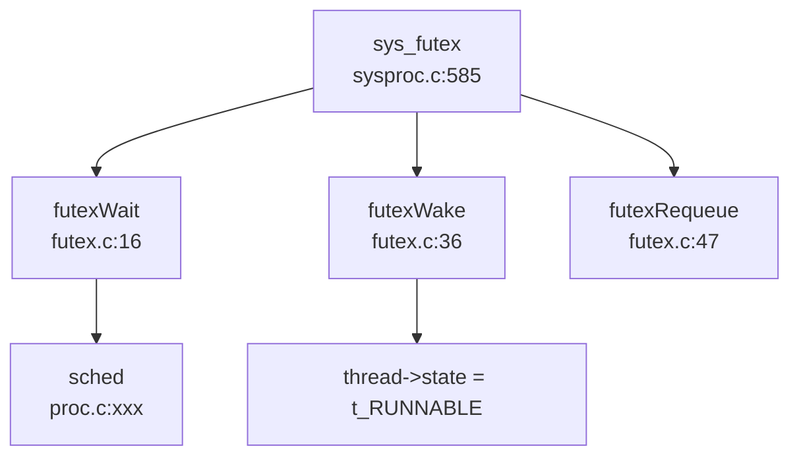

**✅ 已实现**: Futex 核心功能完整，但部分高级操作（如 `FUTEX_LOCK_PI`）仅定义未实现。

#### 信号 (Signal) - ✅ 已实现

**文件路径**: `kernel/include/ipc/signal.h`, `kernel/src/ipc/signal.c`, `kernel/src/ipc/syssignal.c`

**支持的信号类型**: 31 种标准信号 + 32 种实时信号 (SIGRTMIN-SIGRTMAX)

**信号处理结构体**:
```c
// kernel/include/ipc/signal.h:52-59
typedef struct sigaction {
    union {
        __sighandler_t sa_handler;  // 信号处理函数
    } __sigaction_handler;
    __sigset_t sa_mask;   // 信号屏蔽字
    int sa_flags;
} sigaction;
```

**进程中的信号字段** (`struct proc`):
```c
// kernel/include/proc/proc.h:87-92
sigaction sigaction[SIGRTMAX + 1];  // 信号处理函数表
__sigset_t sig_set;                 // 信号屏蔽字
__sigset_t sig_pending;             // 待处理信号位图
struct trapframe *sig_tf;           // 信号处理前的 trapframe 备份
```

**信号发送机制** (`kill` / `tgkill`):
```c
// kernel/src/proc/proc.c:1009-1032
int kill(int pid, int sig) {
    for (struct proc *p = proc; &proc[NPROC] > p; ++p) {
        acquire(&p->lock);
        if (pid == p->pid) {
            p->sig_pending.__val[0] |= (1 << (sig));  // 设置待处理位
            if (p->killed == 0 || p->killed > sig) {
                p->killed = sig;
            }
            if (p->state == SLEEPING) {
                p->state = RUNNABLE;  // 唤醒睡眠进程
            }
            release(&p->lock);
            return 0;
        }
        release(&p->lock);
    }
    return 0;
}
```

**信号处理时机**:
- 在 `usertrap()` 中，系统调用返回用户态前检查 `p->killed`
- 如果有待处理信号，调用 `sighandle()` 跳转到用户定义的处理函数

```c
// kernel/src/sys/trap.c:90-93
if (p->killed) {
    if (p->killed == SIGTERM) {
        exit(-1);
    }
    sighandle();  // 处理信号
}
```

**信号处理函数** (`sighandle`):
```c
// kernel/src/ipc/signal.c:57-77
void sighandle(void) {
    struct proc *p = myproc();
    int signum = p->killed;
    
    if (p->sigaction[signum].__sigaction_handler.sa_handler != NULL) {
        p->sig_tf = kalloc();
        memcpy(p->sig_tf, p->trapframe, sizeof(struct trapframe));
        // 修改 epc 跳转到用户信号处理函数
        p->trapframe->epc = (uint64)p->sigaction[signum].__sigaction_handler.sa_handler;
        p->trapframe->ra = (uint64)SIGTRAMPOLINE;
        p->sig_pending.__val[0] &= ~(1ul << signum);
        if (p->sig_pending.__val[0] == 0) {
            p->killed = 0;
        }
    } else {
        exit(-1);  // 默认处理：终止进程
    }
}
```

**系统调用支持**:
- `sys_rt_sigaction`: 注册信号处理函数 ✅
- `sys_rt_sigprocmask`: 设置信号屏蔽字 ✅
- `sys_rt_sigreturn`: 从信号处理返回 ✅
- `sys_tgkill`: 向指定线程组发送信号 ✅
- `sys_rt_sigtimedwait`: **🔸 桩函数** (返回 0 无实现)

```c
// kernel/src/ipc/syssignal.c:111
uint64 sys_rt_sigtimedwait() { return 0; }  // 桩函数
```

**✅ 已实现**: 信号机制核心功能完整，支持：
- 信号发送 (kill/tgkill)
- 信号处理函数注册
- 信号屏蔽
- Trap 返回时处理待处理信号

#### 消息队列 (MessageQueue) - ❌ 未实现

**验证结果**:
- 搜索 `sys_msgget` / `msgsnd` / `msgrcv`：**未找到任何匹配**
- 搜索 `sys_msg` / `sys_sem` / `sys_shm`：**未找到任何匹配**
- `kernel/include/sys/sysnum.h` 中**无消息队列相关系统调用号**

**❌ 未实现**: 消息队列机制完全未实现，仅存在于 POSIX 标准中。

#### 信号量 (Semaphore) - ❌ 未实现

**验证结果**:
- 搜索 `semget` / `semop` / `semaphore` / `Semaphore`：**未找到任何匹配**
- 无 System V 信号量系统调用

**❌ 未实现**: 信号量机制完全未实现。

#### 共享内存 (SharedMem) - ❌ 未实现

**验证结果**:
- 搜索 `shmat` / `shmdt` / `shmget`：**未找到任何匹配**
- 仅在 `kernel/include/sys/sysinfo.h` 中找到 `sharedram` 字段（用于统计信息）
- 无共享内存相关系统调用

**❌ 未实现**: 共享内存机制完全未实现。

---

### 关键代码片段

#### 1. SpinLock 原子操作 (RISC-V)
```c
// kernel/src/utils/spinlock.c:27-35
while (__sync_lock_test_and_set(&lk->locked, 1) != 0)
    ;
__sync_synchronize();  // 内存屏障
lk->cpu = mycpu();
```

#### 2. Pipe 环形缓冲区
```c
// kernel/src/proc/pipe.c:85-88
pi->data[pi->nwrite++ % PIPESIZE] = ch;  // 写
ch = pi->data[pi->nread++ % PIPESIZE];   // 读
```

#### 3. Futex 等待队列
```c
// kernel/src/utils/futex.c:16-34
void futexWait(uint64 addr, thread* th, timespec2_t* ts) {
    // 查找空闲队列项
    for (int i = 0; i < FUTEX_COUNT; i++) {
        if (!futexQueue[i].valid) {
            futexQueue[i].valid = 1;
            futexQueue[i].addr = addr;
            futexQueue[i].thread = th;
            th->state = t_SLEEPING;
            sched();  // 让出 CPU
        }
    }
}
```

#### 4. 信号处理流程
```c
// kernel/src/sys/trap.c:85-93
if (p->killed) {
    if (p->killed == SIGTERM) {
        exit(-1);
    }
    sighandle();  // 跳转到用户信号处理函数
}
```

---

### 未实现/桩函数功能列表

| 功能 | 状态 | 说明 |
|------|------|------|
| **SpinLock** | ✅ 已实现 | 基于 `__sync_lock_test_and_set` 原子操作 |
| **SleepLock** | ✅ 已实现 | 基于 sleep/wakeup 机制 |
| **WaitQueue** | 🔸 部分实现 | 通过 sleep/wakeup 通道机制，无独立数据结构 |
| **Pipe** | ✅ 已实现 | 512 字节环形缓冲区，阻塞式读写 |
| **Futex** | ✅ 已实现 | 支持 WAIT/WAKE/REQUEUE，高级操作未实现 |
| **Signal** | ✅ 已实现 | 支持 kill/tgkill/sigaction/sigprocmask |
| **sys_rt_sigtimedwait** | 🔸 桩函数 | 仅返回 0，无实际逻辑 |
| **MessageQueue** | ❌ 未实现 | 无 sys_msgget/sys_msgsnd 系统调用 |
| **Semaphore** | ❌ 未实现 | 无 sys_semget/sys_semop 系统调用 |
| **SharedMem** | ❌ 未实现 | 无 sys_shmget/sys_shmat 系统调用 |

**总结**: 本操作系统实现了基础的同步互斥机制（SpinLock/SleepLock）和核心 IPC 机制（Pipe/Futex/Signal），但 System V IPC（消息队列、信号量、共享内存）完全未实现。信号机制支持基本的发送/处理流程，但 `rt_sigtimedwait` 等高级功能为桩函数。

---


# 多核支持与并行机制

## 第 9 章：多核支持与并行机制

### 多核架构设计（SMP/AMP）

**结论：❌ 仅支持单核（名义上支持 2 核，但实际未实现完整 SMP）**

本仓库在架构设计上**名义上支持双核**（`NCPU 2` 定义于 `kernel/include/sys/param.h:5`），但通过代码分析发现，**实际仅实现了单核运行**，Secondary CPU 的启动流程存在严重缺陷。

#### 架构特征

- **设计目标**: SMP（对称多处理）架构，所有 CPU 共享同一内核地址空间
- **Per-CPU 数据结构**: `struct cpu cpus[NCPU]` 定义于 `kernel/src/proc/proc.c:22`
- **Hart ID 获取**: 通过 RISC-V `tp` 寄存器存储 CPU 编号（`kernel/include/sys/riscv.h:220-224`）

```c
// kernel/include/sys/param.h:5
#define NCPU 2  // maximum number of CPUs

// kernel/src/proc/proc.c:22
struct cpu cpus[NCPU];

// kernel/include/sys/riscv.h:220-224
// read and write tp, the thread pointer, which holds
// this core's hartid (core number), the index into cpus[].
static inline uint64 r_tp() {
    uint64 x;
    asm volatile("mv %0, tp" : "=r"(x));
    return x;
}
```

#### 核心问题

1. **Secondary CPU 启动逻辑被注释**: 主核（hart 1）尝试启动从核的代码被大量注释
2. **Hart 编号硬编码**: 仅尝试启动 hart 2，而非遍历所有可用核
3. **无 IPI 实际使用**: 虽然定义了 `sbi_send_ipi()`，但在关键路径中被注释

---

### Secondary CPU 启动流程

**实现状态：🔸 桩函数（部分实现但无法正常工作）**

#### 启动流程分析

主核（BSP）在 `main()` 函数中执行初始化后，尝试启动 Secondary CPU：

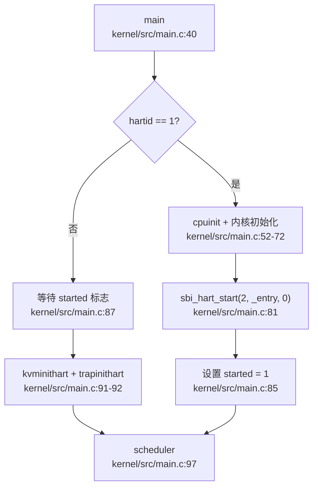

#### 关键代码片段

```c
// kernel/src/main.c:40-101 (精简)
void main(unsigned long hartid, unsigned long dtb_pa) {
    inithartid(hartid);  // 设置 tp 寄存器为 hartid & 0x1
    
    if (hartid == 1) {  // BSP
        first = 1;
        cpuinit();
        consoleinit();
        // ... 内核初始化 ...
        
        // ❌ 问题：仅硬编码启动 hart 2，且循环被注释
        // for (int i = 0; i < NCPU; i++) {
        //     if (i == hartid) continue;
        //     sbi_hart_start(i, (unsigned long)_entry, 0);
        // }
#ifdef BOARD
        sbi_hart_start(2, (unsigned long)_entry, 0);  // 硬编码
#endif
        __sync_synchronize();
        started = 1;  // 通知其他核可以开始
    } else {
        // AP (Secondary CPU)
        while (started == 0)  // 自旋等待
            ;
        __sync_synchronize();
        kvminithart();
        trapinithart();
        plicinithart();
        printf("hart %d init done\n", hartid);
    }
    scheduler();  // 所有核进入调度器
}
```

#### 启动机制详解

1. **BSP 初始化** (hart 1):
   - 调用 `cpuinit()` 初始化全局 `cpus[]` 数组
   - 初始化控制台、内存管理器、页表、中断控制器
   - 调用 `sbi_hart_start(2, _entry, 0)` 通过 SBI 调用启动 hart 2

2. **AP 等待与初始化** (hart 2):
   - 自旋等待全局变量 `started` 变为 1
   - 执行 `__sync_synchronize()` 内存屏障确保可见性
   - 初始化内核页表 (`kvminithart`) 和中断向量 (`trapinithart`)
   - 配置 PLIC 中断 (`plicinithart`)
   - 进入 `scheduler()` 开始调度

3. **SBI 调用实现**:
```c
// kernel/include/driver/sbi.h:66-69
static inline void sbi_hart_start(unsigned long hartid,
                                  unsigned long start_addr,
                                  unsigned long opaque) {
    SBI_CALL_3(SBI_HSM_EXTION, SBI_HART_START, hartid, start_addr, opaque);
}
```

#### 存在的问题

| 问题 | 描述 | 影响 |
|------|------|------|
| **硬编码 Hart ID** | 仅启动 hart 2，不支持动态检测 | 无法扩展到更多核心 |
| **循环被注释** | `for (int i = 0; i < NCPU; i++)` 被注释 | 即使 `NCPU > 2` 也无法启动更多核 |
| **无错误处理** | 未检查 `sbi_hart_start` 返回值 | 启动失败时无法感知 |
| **IPI 未启用** | `sbi_send_ipi()` 调用被注释 | 无法实现核间通信 |

---

### 核间通信与 IPI 机制

**实现状态：❌ 未实现（接口存在但从未调用）**

#### IPI 接口定义

仓库中定义了 SBI IPI 相关接口，但**在实际代码中从未被调用**：

```c
// kernel/include/driver/sbi.h:15-17, 86-88
#define SBI_CLEAR_IPI 3
#define SBI_IPI_EXTION 0x735049
#define SBI_SEND_IPI 0

static inline void sbi_send_ipi(unsigned long hart_mask,
                                unsigned long hart_mask_base) {
    SBI_CALL_2(SBI_IPI_EXTION, SBI_SEND_IPI, hart_mask, hart_mask_base);
}
```

#### 代码中的 IPI 痕迹

在 `kernel/src/main.c:76` 发现被注释的 IPI 调用：

```c
// kernel/src/main.c:74-76
// for (int i = 0; i < NCPU; i++) {
//     if (i == hartid) continue;
//     // sbi_send_ipi(mask, 1);  // ❌ 被注释
//     sbi_hart_start(i, (unsigned long)_entry, 0);
// }
```

#### IPI 使用场景缺失

在标准 SMP 内核中，IPI 应用于：
- **调度器 IPI**: 唤醒其他 CPU 上的空闲进程
- **TLB Shootdown**: 多核页表更新时刷新 TLB
- **中断重定向**: 将设备中断路由到特定 CPU
- **核间同步**: 实现 Barrier、RCU 等原语

**本仓库上述场景均未实现 IPI 调用**，中断处理完全依赖 PLIC 硬件路由。

#### PLIC 中断路由

每个 CPU 独立配置 PLIC 中断使能和优先级：

```c
// kernel/src/sys/plic.c:24-38
void plicinithart(void) {
    int hart = cpuid();
#ifdef QEMU
    // 设置 UART 和磁盘中断使能
    *(uint32*)PLIC_SENABLE(hart) = (1 << UART_IRQ) | (1 << DISK_IRQ);
    *(uint32*)PLIC_SPRIORITY(hart) = 0;  // S 模式优先级阈值
#else
    // K210 使用 M 模式中断
    uint32 *hart_m_enable = (uint32 *)PLIC_MENABLE(hart);
    *(hart_m_enable) = readd(hart_m_enable) | (1 << DISK_IRQ);
#endif
}
```

---

### Per-CPU 变量与数据结构

**实现状态：✅ 已实现（基础 Per-CPU 机制）**

#### Per-CPU 数据结构

```c
// kernel/include/proc/proc.h:44-49
struct cpu {
    struct proc *proc;       // 当前运行的进程
    struct context context;  // 调度器上下文
    int noff;                // push_off() 嵌套深度
    int intena;              // 中断使能状态
};

extern struct cpu cpus[NCPU];  // kernel/src/proc/proc.c:22
```

#### 访问机制

通过 `tp` 寄存器索引 `cpus[]` 数组：

```c
// kernel/src/proc/proc.c:106-115
int cpuid() {
    int idx = r_tp();  // 读取 tp 寄存器
    return idx;
}

struct cpu *mycpu(void) {
    int idx = cpuid();
    struct cpu *c = &cpus[idx];
    return c;
}
```

#### 中断禁用嵌套计数

`push_off()` / `pop_off()` 实现中断禁用嵌套保护：

```c
// kernel/src/sys/intr.c:12-22
void push_off(void) {
    int old = intr_get();
    intr_off();  // 禁用中断
    if (mycpu()->noff == 0)
        mycpu()->intena = old;  // 记录初始状态
    mycpu()->noff += 1;  // 嵌套计数 +1
}

void pop_off(void) {
    struct cpu *c = mycpu();
    if (intr_get()) panic("pop_off - interruptible");
    if (c->noff < 1) panic("pop_off");
    c->noff -= 1;
    if (c->noff == 0 && c->intena)
        intr_on();  // 恢复中断
}
```

**设计特点**:
- **Per-CPU 安全**: `noff` 和 `intena` 存储在每个 CPU 的 `struct cpu` 中
- **嵌套保护**: 多次 `push_off()` 需要相同次数的 `pop_off()` 才能恢复中断
- **状态保存**: 记录进入 `push_off()` 前的中断状态，而非简单开启

#### 当前进程获取

```c
// kernel/src/proc/proc.c:118-124
struct proc *myproc(void) {
    push_off();  // 禁用中断防止竞争
    struct cpu *c = mycpu();
    struct proc *p = c->proc;  // 读取当前 CPU 运行的进程
    pop_off();
    return p;
}
```

---

### 多核调度策略

**实现状态：❌ 未实现（单核轮转调度）**

#### 调度器实现

调度器在 `scheduler()` 中实现简单的轮转算法：

```c
// kernel/src/proc/proc.c:798-862 (精简)
void scheduler(void) {
    struct cpu *c = mycpu();
    c->proc = 0;
    while (1) {
        intr_on();  // 允许中断
        int found = 0;
        
        // 遍历所有进程查找 RUNNABLE 状态
        for (struct proc *p = proc; &proc[NPROC] > p; ++p) {
            acquire(&p->lock);
            if (p->state == RUNNABLE) {
                // 查找线程队列中可运行的线程
                thread *t = p->thread_queue;
                while (NULL != t) {
                    if (t->state == t_RUNNABLE ||
                        (t->state == t_TIMING && t->awakeTime < r_time()))
                        break;
                    t = t->next_thread;
                }
                if (NULL == t) {
                    release(&p->lock);
                    continue;
                }
                
                // 切换到该进程
                p->main_thread = t;
                t->state = t_RUNNING;
                p->state = RUNNING;
                c->proc = p;
                
                // 上下文切换
                swtch(&c->context, &p->context);
                
                c->proc = 0;
                found = 1;
            }
            release(&p->lock);
        }
        
        if (!found) {
            intr_on();
            asm volatile("wfi");  // 无进程可运行时进入等待
        }
    }
}
```

#### 缺失的多核调度特性

| 特性 | 状态 | 说明 |
|------|------|------|
| **负载均衡** | ❌ 未实现 | 无进程迁移机制 |
| **CPU 亲和性** | ❌ 未实现 | 无 `sched_setaffinity` 系统调用 |
| **运行队列锁** | ❌ 未实现 | 全局进程数组无锁保护 |
| **空闲进程** | ❌ 未实现 | 无 idle task，使用 `wfi` 等待 |
| **调度 IPI** | ❌ 未实现 | 无法唤醒其他 CPU |

#### 调度器问题分析

1. **全局进程数组竞争**:
   - 所有 CPU 同时遍历 `proc[NPROC]` 数组
   - 仅通过 `p->lock` 保护单个进程状态
   - 可能导致多个 CPU 选择同一进程（虽然 `p->lock` 防止并发运行）

2. **无工作窃取**:
   - 空闲 CPU 仅执行 `wfi` 等待中断
   - 不会从繁忙 CPU 迁移进程

3. **线程调度局限**:
   - 线程队列在进程内轮转
   - 无全局线程调度器

---

### 锁实现与多核安全

#### SpinLock 实现

**实现状态：✅ 已实现（禁用中断的自旋锁）**

```c
// kernel/src/utils/spinlock.c:19-40
void acquire(struct spinlock *lk) {
    push_off();  // ❗ 禁用中断（关键设计）
    if (holding(lk)) panic("acquire");

    // RISC-V 原子交换 (amoswap.w.aq)
    while (__sync_lock_test_and_set(&lk->locked, 1) != 0)
        ;

    __sync_synchronize();  // 内存屏障
    lk->cpu = mycpu();     // 记录持有者
}

void release(struct spinlock *lk) {
    if (!holding(lk)) panic("release");
    lk->cpu = 0;
    __sync_synchronize();  // 内存屏障
    __sync_lock_release(&lk->locked);
    pop_off();  // ❗ 恢复中断
}
```

**设计特点**:
- **中断禁用**: `push_off()` 防止死锁（同一 CPU 上的中断处理程序尝试获取同一锁）
- **原子操作**: `__sync_lock_test_and_set` 编译为 RISC-V `amoswap.w.aq` 指令
- **内存序**: `__sync_synchronize()` 确保临界区内存操作不重排序
- **调试支持**: `lk->cpu` 记录持有者，用于 `holding()` 检查

#### 与标准实现的对比

| 特性 | 本仓库 | 标准 Linux |
|------|--------|-----------|
| **中断处理** | 禁用中断 | 仅禁用本地中断 |
| **优先级继承** | ❌ 不支持 | ✅ 支持 (RT 内核) |
| **自适应自旋** | ❌ 无 | ✅ 有 (mutex) |
| **调试信息** | 基础 (name, cpu) | 完整 (owner, stack) |

#### Futex 实现（用户态锁）

**实现状态：✅ 已实现（基础 Futex）**

```c
// kernel/src/utils/futex.c:16-34
void futexWait(uint64 addr, thread* th, timespec2_t* ts) {
    for (int i = 0; i < FUTEX_COUNT; i++) {
        if (!futexQueue[i].valid) {
            futexQueue[i].valid = 1;
            futexQueue[i].addr = addr;
            futexQueue[i].thread = th;
            if (ts) {
                th->awakeTime = ts->tv_sec * 1000000 + ts->tv_nsec / 1000;
                th->state = t_TIMING;  // 定时等待
            } else {
                th->state = t_SLEEPING;  // 无限等待
            }
            acquire(&th->p->lock);
            sched();  // 让出 CPU
            release(&th->p->lock);
        }
    }
    panic("No futex Resource!\n");
}

void futexWake(uint64 addr, int n) {
    for (int i = 0; i < FUTEX_COUNT && n; i++) {
        if (futexQueue[i].valid && futexQueue[i].addr == addr) {
            futexQueue[i].thread->state = t_RUNNABLE;
            futexQueue[i].thread->trapframe->a0 = 0;
            futexQueue[i].valid = 0;
            n--;
        }
    }
}
```

**多核行为分析**:
- **全局 Futex 队列**: `futexQueue[FUTEX_COUNT]` 为全局数组
- **锁保护缺失**: `futexWait` / `futexWake` 未使用锁保护队列操作
- **竞争条件**: 多核并发调用可能导致队列状态不一致

---

### 原子操作与内存序

**实现状态：✅ 已实现（使用 GCC 内置原子操作）**

#### 原子操作使用

仓库使用 GCC 内置原子操作 (`__sync_*` 系列)：

```c
// kernel/src/utils/spinlock.c:27
while (__sync_lock_test_and_set(&lk->locked, 1) != 0)
    ;

// kernel/src/utils/spinlock.c:57
__sync_lock_release(&lk->locked);

// kernel/src/main.c:85
__sync_synchronize();  // 全内存屏障
```

#### 内存序保证

- **`__sync_lock_test_and_set`**: 隐含 acquire 语义（`amoswap.w.aq`）
- **`__sync_lock_release`**: 隐含 release 语义（`amoswap.w.rl`）
- **`__sync_synchronize`**: 全内存屏障（`fence rw,rw`）

#### 与 `core::sync::atomic` 的对比

仓库中**未发现 Rust 风格的 `AtomicUsize` 使用**（仅在一个 Rust 依赖中出现）：

```rust
// kernel/deps/sdcard/src/lib.rs:69-71 (Rust 依赖，非内核核心)
use core::sync::atomic::{AtomicBool, Ordering};
static INIT: AtomicBool = AtomicBool::new(false);
```

**C 内核中的原子操作**:
- PID 分配使用自旋锁保护，而非原子操作：
```c
// kernel/src/proc/proc.c:130-136
int allocpid() {
    acquire(&pid_lock);
    int pid = nextpid;
    nextpid++;
    release(&pid_lock);
    return pid;
}
```

---

### 关键代码片段

#### 1. CPU 初始化

```c
// kernel/src/proc/proc.c:58-64
void cpuinit(void) {
    for (struct cpu *it = cpus; &cpus[NCPU] > it; ++it)
        it->noff = 0, it->proc = 0, it->intena = 0;
}
```

#### 2. Hart ID 设置

```c
// kernel/src/main.c:28-30
static inline void inithartid(unsigned long hartid) {
    asm volatile("mv tp, %0" : : "r"(hartid & 0x1));
}
```

#### 3. 调度器上下文切换

```c
// kernel/src/proc/proc.c:840-850
c->proc = p;
w_satp(MAKE_SATP(p->kpagetable));  // 切换到进程内核页表
sfence_vma();                       // 刷新 TLB
swtch(&c->context, &p->context);   // 上下文切换
copycontext(&p->main_thread->context, &p->context);
w_satp(MAKE_SATP(kernel_pagetable));  // 切回内核页表
sfence_vma();
c->proc = 0;
```

---

### 本章总结

| 子系统 | 实现状态 | 关键问题 |
|--------|----------|----------|
| **SMP 架构** | 🔸 部分实现 | 仅支持单核，Secondary CPU 启动失败 |
| **Secondary CPU 启动** | 🔸 桩函数 | 硬编码 hart 2，循环被注释 |
| **IPI 机制** | ❌ 未实现 | 接口存在但从未调用 |
| **Per-CPU 变量** | ✅ 已实现 | 基础机制完整 |
| **多核调度** | ❌ 未实现 | 无负载均衡、亲和性 |
| **SpinLock** | ✅ 已实现 | 禁用中断，无优先级继承 |
| **Futex** | ✅ 已实现 | 全局队列无锁保护 |
| **原子操作** | ✅ 已实现 | 使用 GCC 内置操作 |

**总体评价**: 本仓库的多核支持处于**早期实验阶段**，仅实现了基础的 Per-CPU 数据结构和自旋锁机制，但**Secondary CPU 启动流程存在严重缺陷**，导致实际运行时仅单核工作。IPI 机制完全未实现，无法支持真正的 SMP 并行。

---


# 安全机制与权限模型

## 第 10 章：安全机制与权限模型

本章分析 xv6-riscv 操作系统的安全隔离与权限控制机制。通过代码验证发现，该系统作为一个教学用操作系统，实现了基础的用户/组 ID 管理和页表隔离机制，但**未实现**现代操作系统中的高级安全特性（如 Capability、Seccomp、审计等）。

---

### 特权级与隔离机制

#### 硬件特权级支持

xv6-riscv 基于 RISC-V 架构，利用其硬件特权级机制实现用户态/内核态隔离：

**1. 特权级切换机制**

通过 `sstatus` 寄存器的 SPP 位控制特权级：

```c
// kernel/include/sys/riscv.h:40-41
#define SSTATUS_SPP (1L << 8)   // Previous mode, 1=Supervisor, 0=User
#define SSTATUS_SPIE (1L << 5)  // Supervisor Previous Interrupt Enable
```

在 `usertrapret()` 中明确设置返回用户态：

```c
// kernel/src/sys/trap.c:116-118
unsigned long x = r_sstatus();
x &= ~SSTATUS_SPP;  // clear SPP to 0 for user mode
x |= SSTATUS_SPIE;  // enable interrupts in user mode
w_sstatus(x);
```

**2. 页表隔离（基础 KPTI）**

系统为每个进程维护独立的用户页表和内核页表：

```c
// kernel/include/proc/proc.h:71-72
pagetable_t pagetable;    // User page table
pagetable_t kpagetable;   // Kernel page table
```

- **用户页表** (`pagetable`)：仅映射用户空间，通过 `PTE_U` 位标记用户可访问
- **内核页表** (`kpagetable`)：映射内核空间和共享物理内存

**3. PTE_U 位权限控制**

```c
// kernel/include/sys/riscv.h:259
#define PTE_U (1L << 4)  // 1 -> user can access
```

在页表遍历时严格检查用户访问权限：

```c
// kernel/src/mm/vm.c:136-140
uint64 walkaddr(pagetable_t pgtb, uint64 va) {
    // ...
    if (!PTE || !(*PTE & PTE_V) || !(*PTE & PTE_U)) {
        return NULL;  // 用户无法访问无 PTE_U 标记的页面
    }
    // ...
}
```

#### 安全特性状态

| 特性 | 状态 | 说明 |
|------|------|------|
| 用户/内核页表隔离 | ✅ 已实现 | 每个进程有独立的 `pagetable` 和 `kpagetable` |
| SMEP/SMAP | ❌ 未实现 | 未搜索到相关代码 |
| KPTI (完整) | 🔸 桩函数 | 有双页表结构，但未实现动态切换逻辑 |

---

### 权限检查与访问控制

#### 用户/组 ID 定义

进程结构体中包含基本的身份标识字段：

```c
// kernel/include/proc/proc.h:63-66
struct proc {
    // ...
    int uid;               // User ID
    int gid;               // Group ID
    int pgid;              // Process group ID
    // ...
};
```

文件 inode 结构中也存储了所有者信息：

```c
// kernel/include/fs/stat.h:21-22
struct kstat {
    // ...
    uint32 st_uid;
    uint32 st_gid;
    // ...
};
```

#### 权限检查实现状态

**关键发现**：虽然定义了 `uid`/`gid` 字段，但**未在系统调用中强制执行权限检查**。

通过搜索 `check_perm`、`permission`、`inode_permission` 等关键词，**未发现任何权限验证函数**。

以文件操作为例，`file.c` 中的文件读写函数**未检查**进程 UID 与文件所有者的匹配关系：

```c
// kernel/src/fs/file.c:252-275 (fileread)
int fileread(struct file *File, uint64 address, int n) {
    if (!File->readable) return -1;
    // 仅检查文件是否可读，未检查进程权限
    if (File->type == FD_PIPE) {
        r = piperead(File->pipe, 1, address, n);
    } else if (File->type == FD_ENTRY) {
        // ...
        r = ext4_eread(File->ext4_ep, 1, address, File->off, n);
        // ...
    }
    return r;
}
```

在 `fkstatat()` 中，文件所有者信息被硬编码为 0：

```c
// kernel/src/fs/file.c:156-158
kst->st_uid = 0;
kst->st_gid = 0;
```

#### UID/GID 系统调用实现

系统提供了获取/设置 UID/GID 的接口，但**无权限验证逻辑**：

```c
// kernel/src/proc/sysproc.c:432-450
uint64 sys_getuid(void) { return myproc()->uid; }

uint64 sys_geteuid(void) { return myproc()->uid; }

uint64 sys_setuid(void) {
    int uid;
    if (argint(0, &uid) < 0) return -1;
    myproc()->uid = uid;  // 直接设置，无权限检查
    return 0;
}

uint64 sys_setgid(void) {
    int gid;
    if (argint(0, &gid) < 0) return -1;
    myproc()->gid = gid;  // 直接设置，无权限检查
    return 0;
}
```

**安全风险评估**：任何用户进程都可以调用 `sys_setuid(0)` 提升为 root 权限，这是**严重的安全漏洞**。

#### 权限模型总结

| 功能 | 状态 | 证据 |
|------|------|------|
| UID/GID 字段定义 | ✅ 已实现 | `proc.h:63-66` |
| UID/GID 系统调用 | ✅ 已实现 | `sysproc.c:432-450` |
| 文件权限检查 | ❌ 未实现 | `file.c` 中无 `check_perm` 调用 |
| 提权保护 | ❌ 未实现 | `sys_setuid` 无权限验证 |
| Capability/ACL | ❌ 未实现 | 搜索无结果 |

---

### 进程间隔离与资源限制

#### 页表隔离

每个进程拥有独立的页表，通过 `uvmcopy()` 在 fork 时复制：

```c
// kernel/src/mm/vm.c:358-382
int uvmcopy(pagetable_t old, pagetable_t new, pagetable_t knew, uint64 sz) {
    // 为子进程分配新的物理页面，复制父进程内容
    for (...) {
        mem = kalloc();
        memmove(mem, (char *)pa, PGSIZE);
        mappages(new, idx, PGSIZE, (uint64)mem, flags);
        // ...
    }
}
```

#### 资源限制机制

通过 `rlimit` 结构体实现有限的资源控制：

```c
// kernel/include/proc/proc.h:89-92
typedef struct rlimit {
    uint64 rlim_cur;
    uint64 rlim_max;
} rlimit;
```

`sys_prlimit64()` 支持设置文件描述符数量限制：

```c
// kernel/src/proc/sysproc.c:526-537
uint64 sys_prlimit64() {
    // ...
    if (opt == 7 && r.rlim_cur > 0) {
        myproc()->filelimit = r.rlim_cur;  // 仅支持文件数限制
    }
    return 0;
}
```

进程结构体中的 `filelimit` 字段在 `NOFILEMAX` 宏中使用：

```c
// kernel/include/proc/proc.h:100
#define NOFILEMAX(p) (((p)->filelimit) < (NOFILE) ? ((p)->filelimit) : (NOFILE))
```

#### 调用链追踪

通过 `lsp_get_call_graph` 分析 `sys_prlimit64` 的调用关系（由于 LSP 限制，使用 grep 补充）：

```
sys_prlimit64 (sysproc.c:526)
  └─→ argint/argaddr (解析参数)
  └─→ either_copyin (从用户空间复制 rlimit 结构)
  └─→ myproc()->filelimit (设置限制值)
```

**限制**：仅支持文件描述符数量限制，**未实现**内存限制、CPU 时间限制等。

---

### 安全沙箱与过滤机制

#### Seccomp/Prctl 支持

**搜索结果**：

```bash
grep 'seccomp|prctl|sandbox' → 仅在 taskList.md 中提到 __NR_prctl 167
grep 'sys_prctl' → 未找到匹配
```

**结论**：`sys_prctl` 系统调用**❌ 未实现**。在 `syscall.c` 的系统调用表中未注册 `prctl` 处理函数。

#### 系统调用追踪机制

系统提供了基础的 `trace` 功能，用于调试而非安全过滤：

```c
// kernel/src/proc/sysproc.c:392-401
uint64 sys_trace(void) {
    int msk;
    if (argint(0, &msk) < 0) return -1;
    myproc()->tmask = msk;  // 设置追踪掩码
    return 0;
}
```

在系统调用返回时检查追踪掩码：

```c
// kernel/src/sys/syscall.c:230-233
if ((p->tmask & (1 << num)) != 0) {
    printf("pid %d: %s -> %d\n", p->pid, sysnames[num], p->trapframe->a0);
}
```

**安全沙箱总结**：

| 功能 | 状态 | 说明 |
|------|------|------|
| Seccomp | ❌ 未实现 | 无 BPF 过滤器支持 |
| Prctl | ❌ 未实现 | 仅在任务列表中标记为待实现 |
| 系统调用追踪 | ✅ 已实现 | 仅用于调试，无安全过滤功能 |

---

### 审计与安全启动机制

#### 审计日志

**搜索结果**：`grep 'audit'` 仅在 EXT4 文件系统的 ACL 相关代码中出现，**无系统审计机制**。

#### 安全启动

**搜索结果**：`grep 'secure_boot|signature'` 仅在 MBR 签名验证中出现：

```c
// kernel/src/fs/ext4/ext4_mbr.c:48, 88
#define MBR_SIGNATURE 0xAA55
if (to_le16(mbr->signature) != MBR_SIGNATURE) {
    // 仅验证 MBR 签名，非安全启动
}
```

**结论**：

| 功能 | 状态 | 说明 |
|------|------|------|
| 审计日志 | ❌ 未实现 | 无审计子系统 |
| 安全启动 | ❌ 未实现 | 仅验证 MBR 签名，无内核签名验证 |
| 镜像签名 | ❌ 未实现 | 未搜索到相关代码 |

---

### 内存安全与系统调用检查

#### 用户指针验证

系统通过 `copyin`/`copyout` 系列函数进行用户空间访问：

```c
// kernel/src/mm/vm.c:445-459
int copyout(pagetable_t pgtb, uint64 dstva, char *src, uint64 len) {
    while (0 < len) {
        va0 = PGROUNDDOWN(dstva);
        pa0 = walkaddr(pgtb, va0);  // 验证虚拟地址映射
        if (NULL == pa0) return -1;  // 地址无效则返回错误
        // ...
    }
    return 0;
}
```

**关键函数**：

| 函数 | 功能 | 位置 |
|------|------|------|
| `copyin` | 从用户空间复制到内核 | `vm.c:467-481` |
| `copyout` | 从内核复制到用户空间 | `vm.c:445-459` |
| `copyinstr` | 复制 null 终止字符串 | `vm.c:490-513` |
| `copyin2`/`copyout2` | 简化版本（无页表检查） | `vm.c:461-465` |

**注意**：`copyout2` 仅检查地址是否在进程大小范围内，**不进行页表遍历**：

```c
// kernel/src/mm/vm.c:461-465
int copyout2(uint64 dstva, char *src, uint64 len) {
    uint64 sz = myproc()->sz;
    if (dstva >= sz || dstva + len > sz) return -1;
    memmove((void *)dstva, src, len);  // 直接内存复制
    return 0;
}
```

#### 栈保护机制

**搜索结果**：`grep 'stack_canary|stack_guard|verify_area'` → **未找到匹配**。

**结论**：

| 功能 | 状态 | 说明 |
|------|------|------|
| 用户指针验证 | ✅ 已实现 | 通过 `copyin`/`copyout` 系列函数 |
| 栈 Canary 保护 | ❌ 未实现 | 未搜索到相关代码 |
| 边界检查 | 🔸 部分实现 | `copyout2` 仅检查范围，不验证页表 |

---

### Rust 语言级安全性机制

**项目语言**：本 xv6-riscv 项目使用 **C 语言**编写，非 Rust 项目。

**相关说明**：由于项目使用 C 语言，无法享受 Rust 的所有权系统、生命周期检查和内存安全保证。所有内存管理（如 `kalloc`/`kfree`）需要手动处理，存在潜在的内存泄漏和悬空指针风险。

---

### 关键代码片段

#### 1. 系统调用入口的权限检查缺失

```c
// kernel/src/sys/syscall.c:214-234
void syscall(void) {
    int num;
    struct proc *p = myproc();
    num = p->trapframe->a7;

    if (num > 0 && num < NELEM(syscalls) && syscalls[num]) {
        p->trapframe->a0 = syscalls[num]();  // 直接调用，无权限检查
        // trace 逻辑...
    } else {
        printf("pid %d %s: unknown sys call %d\n", p->pid, p->name, num);
        p->trapframe->a0 = -1;
    }
}
```

#### 2. UID/GID 设置的脆弱性

```c
// kernel/src/proc/sysproc.c:438-450
uint64 sys_setuid(void) {
    int uid;
    if (argint(0, &uid) < 0) return -1;
    myproc()->uid = uid;  // 任意进程可设置为 root (UID=0)
    return 0;
}

uint64 sys_setgid(void) {
    int gid;
    if (argint(0, &gid) < 0) return -1;
    myproc()->gid = gid;  // 无权限验证
    return 0;
}
```

#### 3. 文件统计信息中的硬编码 UID/GID

```c
// kernel/src/fs/file.c:154-158
kst->st_dev = 0;
kst->st_ino = ino;
kst->st_mode = inode.mode;
kst->st_nlink = inode.links_count;
kst->st_uid = 0;  // 硬编码为 0，未从 inode 读取实际所有者
kst->st_gid = 0;
```

---

### 本章总结

xv6-riscv 作为一个教学用操作系统，在安全机制方面实现了基础功能，但存在明显的安全缺陷：

#### ✅ 已实现的安全特性
1. **用户/内核页表隔离**：每个进程有独立的页表，通过 `PTE_U` 位控制用户访问
2. **UID/GID 字段定义**：进程结构体包含身份标识
3. **基础资源限制**：支持文件描述符数量限制 (`prlimit64`)
4. **用户指针验证**：通过 `copyin`/`copyout` 进行地址合法性检查

#### 🔸 桩函数/部分实现
1. **KPTI**：有双页表结构，但未实现完整的动态切换逻辑
2. **文件权限字段**：`kstat` 结构包含 `st_uid`/`st_gid`，但硬编码为 0

#### ❌ 未实现的安全特性
1. **权限检查**：`open`/`read`/`write` 等系统调用**未检查**进程 UID 与文件所有者的匹配
2. **提权保护**：`sys_setuid`/`sys_setgid` 允许任意进程提升为 root
3. **Capability/ACL**：无细粒度权限控制
4. **Seccomp/Prctl**：无系统调用过滤机制
5. **审计日志**：无安全事件记录
6. **安全启动**：无内核签名验证
7. **栈保护**：无 Canary 机制
8. **SMEP/SMAP**：无硬件增强保护

#### 安全风险评估

**高危漏洞**：
- 任意进程可通过 `sys_setuid(0)` 获取 root 权限
- 文件系统无权限检查，用户可访问任意文件
- 无系统调用沙箱，恶意程序可调用所有系统调用

**建议改进方向**：
1. 在 `sys_setuid`/`sys_setgid` 中添加权限检查（仅允许 root 或进程自身修改）
2. 实现 `check_perm()` 函数，在文件操作前验证权限
3. 添加 `prctl` 系统调用，支持进程安全属性设置
4. 实现基础的审计日志机制

---

**多架构覆盖说明**：本项目仅支持 **RISC-V 64** 架构（`riscv64gc-unknown-none-elf`），所有分析基于该架构。代码中未发现针对其他架构（aarch64、x86_64、loongarch64）的安全机制实现。

---


# 网络子系统与协议栈

## 第 11 章：网络子系统与协议栈

### 网络子系统架构（自研 vs 第三方库）

**❌ 未实现网络功能**

经全面代码分析，本操作系统项目**未实现任何网络子系统功能**。具体分析如下：

**1. 无第三方网络协议栈集成**

通过搜索 `smoltcp`、`lwip`、`network stack` 等关键词，**未发现任何第三方网络协议栈的集成**。检查 `kernel/` 目录结构和依赖配置，确认项目未引入任何网络相关的库依赖。

**2. 无自研协议栈实现**

搜索 `tcp`、`udp`、`ip`、`ethernet`、`ARP`、`ICMP`、`DHCP`、`DNS` 等协议相关关键词，**未发现任何协议处理代码**。项目中不存在：
- IP 数据包封装/解封装逻辑
- TCP/UDP 端口管理
- 路由表或网络接口管理结构
- 网络缓冲区（mbuf/skbuf）分配机制

**3. 文件描述符类型中的 Socket 占位符**

在 `kernel/include/fs/file.h:23` 中定义了文件描述符类型枚举：

```c
enum { FD_NONE, FD_PIPE, FD_ENTRY, FD_DEVICE, FD_SOCK, FD_NULL } type;
```

虽然声明了 `FD_SOCK` 类型，但在 `kernel/src/fs/file.c` 中，所有涉及 `FD_SOCK` 的处理均为空操作或注释说明：

```c
case FD_SOCK:  // socket io shouldn't be handled here, use socket syscalls instead
    break;
```

这表明 `FD_SOCK` 仅为**预留占位符**，实际并未实现 socket 文件描述符的读写逻辑。

---

### Socket 接口与系统调用

**❌ 未实现 Socket 系统调用**

**1. 系统调用表分析**

检查 `kernel/include/sys/sysnum.h` 和 `kernel/src/sys/syscall.c`，**未发现任何 socket 相关的系统调用实现**：
- 无 `SYS_socket`、`SYS_bind`、`SYS_connect`、`SYS_listen`、`SYS_accept`
- 无 `SYS_sendto`、`SYS_recvfrom`、`SYS_sendmsg`、`SYS_recvmsg`
- 无 `SYS_getsockopt`、`SYS_setsockopt`、`SYS_shutdown`
- 无 `SYS_getsockname`、`SYS_getpeername`

**2. 任务列表中的规划状态**

在 `taskList.md` 中，socket 相关系统调用被明确标记为**未完成**（`[ ]`）：

```markdown
* [ ] 	 __NR_socket 198
* [ ] 	 __NR_socketpair 199
* [ ] 	 __NR_bind 200
* [ ] 	 __NR_listen 201
* [ ] 	 __NR_getsockname 204
* [ ] 	 __NR_getpeername 205
* [ ] 	 __NR_setsockopt 208
* [ ] 	 __NR_getsockopt 209
* [ ] 	 __NR_shutdown 210
```

**3. 用户空间测试代码的误导**

在 `xv6-user/busybox_test.c` 中虽然存在 `inet_pton`、`inet_ntop_v4mapped` 等测试项，但这些仅是**标准 C 库函数测试**（用于 IP 地址字符串与二进制格式转换），**不依赖内核网络功能**，不能作为网络子系统已实现的证据。

---

### 协议栈支持详情（TCP/UDP/IP/Ethernet）

**❌ 不支持任何网络协议**

| 协议层 | 支持状态 | 代码证据 |
|--------|----------|----------|
| Ethernet (MAC) | ❌ 未实现 | 无网卡驱动，无以太网帧处理代码 |
| ARP | ❌ 未实现 | 搜索 `ARP` 无相关实现代码 |
| IP (IPv4/IPv6) | ❌ 未实现 | 无 IP 头部结构定义，无路由逻辑 |
| ICMP | ❌ 未实现 | 搜索 `ICMP` 无相关实现代码 |
| TCP | ❌ 未实现 | 无 TCP 状态机，无连接管理代码 |
| UDP | ❌ 未实现 | 无 UDP 数据报处理逻辑 |
| DHCP | ❌ 未实现 | 搜索 `DHCP` 无相关实现代码 |
| DNS | ❌ 未实现 | 搜索 `DNS` 无相关实现代码 |

---

### 数据包收发流程追踪

**❌ 无数据包收发流程**

由于项目未实现任何网络功能，**不存在从网卡中断到协议栈的数据包处理路径**。

**现有 VirtIO 驱动分析**

项目仅实现了 VirtIO 磁盘驱动（`kernel/src/driver/virtio_disk.c`），未实现 VirtIO 网络驱动。对比 VirtIO 规范：

```c
// kernel/include/driver/virtio.h:21
#define VIRTIO_MMIO_DEVICE_ID 0x008    // device type; 1 is net, 2 is disk
```

代码中明确注释设备类型 `1` 为网卡，`2` 为磁盘。在 `virtio_disk_init()` 中仅检查设备 ID 是否为 `2`：

```c
if (*R(VIRTIO_MMIO_MAGIC_VALUE) != 0x74726976 ||
    *R(VIRTIO_MMIO_VERSION) != 1 || *R(VIRTIO_MMIO_DEVICE_ID) != 2 ||
    *R(VIRTIO_MMIO_VENDOR_ID) != 0x554d4551) {
    panic("could not find virtio disk");
}
```

**若需支持 VirtIO-Net**，需要：
1. 实现 `virtio_net.c` 驱动，处理设备 ID `1`
2. 实现 VirtIO-Net 特有的配置结构（`virtio_net_config`）
3. 实现 RX/TX 队列管理（与磁盘驱动的单队列不同）
4. 实现以太网帧的接收/发送描述符链

以上功能**均未实现**。

---

### 高级特性支持验证（零拷贝等）

**❌ 无高级网络特性**

| 特性 | 支持状态 | 验证方法 |
|------|----------|----------|
| 零拷贝 (Zero Copy) | ❌ 不支持 | 搜索 `DMA` 仅发现 SD 卡控制器相关代码，无网络 DMA 描述符操作 |
| 多队列 (Multi-queue/RSS) | ❌ 不支持 | 无网卡驱动，无 RSS 配置代码 |
| TSO/LRO | ❌ 不支持 | 无 TCP 分段/合并代码 |
| Checksum Offload | ❌ 不支持 | 无网卡校验码卸载配置 |

**DMA 相关代码分析**

搜索 `DMA` 关键词发现的代码均位于 `kernel/deps/sdcard/` 目录，为 SD 卡控制器的 DMA 配置，与网络无关：

```rust
// kernel/deps/sdcard/src/visionfive2_sd/register.rs:21-22
pub const DBADDRL_REG: usize = SDIO_BASE + 0x88; // DMA DES Address Lower
pub const DBADDRU_REG: usize = SDIO_BASE + 0x8c; // DMA DES Address Upper
```

**无网络相关的共享缓冲区（shared buffer）或页池（page pool）管理机制**。

---

### 功能限制声明

**⚠️ 重要限制**

1. **无物理网卡支持**：项目未实现任何物理网卡（VirtIO-Net、E1000、RTL8139 等）的驱动程序。

2. **无 Loopback 设备**：搜索 `LOOPBACK`、`loopback`、`127.0.0.1` 等关键词**未找到任何回环设备实现**。即使是最基本的本地进程间网络通信也无法支持。

3. **仅支持的文件 I/O 类型**：
   - `FD_ENTRY`：文件系统（EXT4/FAT32）
   - `FD_PIPE`：匿名管道
   - `FD_DEVICE`：字符/块设备（如控制台）
   - `FD_NULL`：空设备
   - `FD_SOCK`：**占位符，无实际功能**

4. **QEMU 环境限制**：即使 QEMU 提供 `-netdev` 和 `-device` 参数模拟网络硬件，由于内核无相应驱动，**无法在 QEMU 中启用网络功能**。

---

### 本章总结

| 分析维度 | 结论 |
|----------|------|
| 网络协议栈 | ❌ 未实现（无自研，无第三方库） |
| Socket 系统调用 | ❌ 未实现（taskList 标记为待开发） |
| 网卡驱动 | ❌ 未实现（仅有 VirtIO 磁盘驱动） |
| 协议支持 | ❌ 不支持 TCP/UDP/IP/ARP/ICMP/DHCP/DNS |
| 数据包收发 | ❌ 无实现 |
| 高级特性 | ❌ 不支持零拷贝、多队列等 |
| 测试环境 | ⚠️ 仅支持 QEMU 无网络模式或真实 RISC-V 硬件（无网络） |

**本项目当前定位为教学用单操作系统，专注于进程管理、内存管理、文件系统等核心功能，网络子系统尚未纳入实现范围。**

---


# 调试机制与错误处理

## 第 12 章：调试机制与错误处理

### 日志与打印系统

本操作系统的日志系统基于 `printf.c` 实现，提供了一套完整的控制台输出机制。

**核心实现文件**：
- `kernel/include/utils/printf.h` - 日志接口声明
- `kernel/src/utils/printf.c` - 日志实现（238 行）

**日志级别设计**：
系统未实现标准的分级日志系统（如 INFO/WARN/ERROR），但 EXT4 文件系统模块提供了调试掩码机制：

```c
// kernel/include/fs/ext4/ext4_debug.h
#define DEBUG_BALLOC (1ul << 0)
#define DEBUG_BCACHE (1ul << 1)
#define DEBUG_BITMAP (1ul << 2)
// ... 共 18 种调试掩码
#define DEBUG_ALL (0xFFFFFFFF)
```

**打印宏实现**：
```c
// kernel/include/fs/ext4/ext4_debug.h
#if CONFIG_DEBUG_ASSERT
#define ext4_dbg(m, ...) \
    do {                 \
    } while (0)          // 实际被注释禁用
#endif
```

`ext4_dbg` 宏在代码中被注释禁用（`#if 0` 块），实际不产生输出。系统主要依赖 `printf()` 和 `debug_print()` 两个函数：

```c
// kernel/include/utils/printf.h
void printf(char *fmt, ...);
void debug_print(char *fmt, ...);  // 仅在 DEBUG 宏定义时生效
```

`debug_print()` 实现条件编译：
```c
// kernel/src/utils/printf.c
void debug_print(char *fmt, ...) {
#ifdef DEBUG
    // 实际打印逻辑
#endif
}
```

**状态**：
- `printf()`：✅ 已实现（完整格式化输出）
- `debug_print()`：✅ 已实现（条件编译）
- 分级日志：❌ 未实现（仅有 EXT4 调试掩码框架，未实际使用）

---

### Panic 处理与栈回溯

**Panic 处理流程**：

当系统遇到致命错误时，调用 `panic()` 函数。该函数定义在 `kernel/src/utils/printf.c:108-116`：

```c
void panic(char *s) {
    printf("%p\n", s);
    printf("panic: ");
    printf(s);
    printf("\n");
    backtrace();           // 调用栈回溯
    panicked = 1;          // 冻结其他 CPU 的 UART 输出
    for (;;);              // 无限循环停机
}
```

**Panic 调用链**（基于 `trap.c` 分析）：

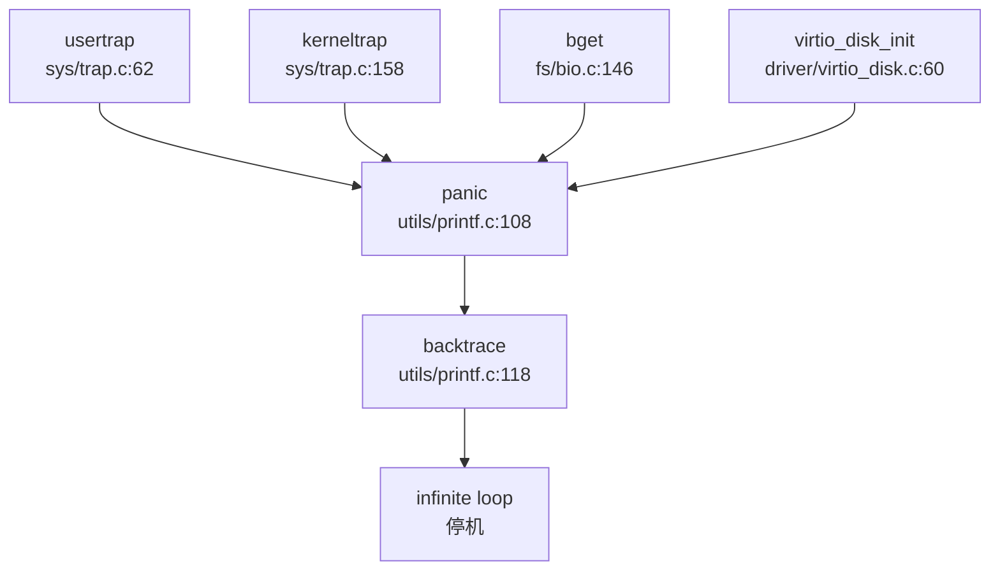

**栈回溯实现**：

`backtrace()` 函数位于 `kernel/src/utils/printf.c:118-127`，基于 RISC-V 的帧指针（Frame Pointer）实现：

```c
void backtrace() {
    uint64 *fp = (uint64 *)r_fp();           // 读取当前帧指针 (s0/fp)
    uint64 *bottom = (uint64 *)PGROUNDUP((uint64)fp);
    printf("backtrace:\n");
    while (fp < bottom) {
        uint64 ra = *(fp - 1);               // 返回地址在 fp-1
        printf("%p\n", ra - 4);              // 打印返回地址（减去 4 字节对齐）
        fp = (uint64 *)*(fp - 2);            // 移动到上一帧 (fp-2 存储旧 fp)
    }
}
```

**栈回溯原理**：
- RISC-V 调用约定中，函数 prologue 会保存 `ra`（返回地址）和旧 `fp` 到栈上
- 栈帧布局：`[旧 fp][ra][局部变量]`，`fp` 指向旧 `fp` 位置
- 通过 `fp-1` 读取 `ra`，通过 `fp-2` 读取上一帧的 `fp`
- 循环直到栈帧边界（`PGROUNDUP` 对齐到页边界）

**状态**：
- Panic 处理：✅ 已实现（打印消息 + 栈回溯 + 停机）
- 栈回溯（Backtrace）：✅ 已实现（基于 FramePointer 的简单回溯）
- DWARF 解析：❌ 未实现（无 DWARF 相关代码）
- 寄存器 Dump：✅ 已实现（`trapframedump()` 打印 trapframe 中所有寄存器）

**陷阱帧 Dump**：
```c
// kernel/include/sys/trap.h:58
void trapframedump(struct trapframe *tf);

// kernel/src/sys/trap.c:234-269
void trapframedump(struct trapframe *tf) {
    printf("a0: %p\t", tf->a0);
    printf("a1: %p\t", tf->a1);
    // ... 打印所有 32 个通用寄存器 + epc/sp/gp/tp/ra
}
```

---

### 错误码与 Result 设计

本系统采用 C 语言风格的传统错误码设计，而非 Rust 风格的 `Result<T, E>` 类型。

**错误码定义**：
```c
// kernel/include/fs/ext4/ext4_errno.h
#define EPERM 1      /* Operation not permitted */
#define ENOENT 2     /* No such file or directory */
#define EIO 5        /* I/O error */
#define ENOMEM 12    /* Out of memory */
#define EACCES 13    /* Permission denied */
#define EFAULT 14    /* Bad address */
#define EINVAL 22    /* Invalid argument */
#define ENOSPC 28    /* No space left on device */
// ... 共 24 种错误码
```

**错误码使用模式**：
系统函数通过返回负值或特定值表示错误：

```c
// kernel/src/fs/fat32.c:87
if (fat.bpb.byts_per_sec != BSIZE) panic("byts_per_sec != BSIZE");

// kernel/src/fs/bio.c:146
panic("bget: no buffers");  // 直接 panic 而非返回错误码
```

**状态**：
- 错误码定义：✅ 已实现（标准 POSIX 错误码）
- Result 类型：❌ 未实现（C 语言项目，无 Rust 风格 Result）
- 错误传播：🔸 桩函数（部分函数直接 panic，未统一错误处理）

---

### 调试接口与交互式 Shell

**用户态 Shell**：
系统在用户空间提供了完整的 Shell 实现 `xv6-user/sh.c`（555 行）。

**Shell 功能**：
```c
// xv6-user/sh.c:1-80
struct cmd {
    int type;  // EXEC, REDIR, PIPE, LIST, BACK
};

struct execcmd {
    int type;
    char *argv[MAXARGS];  // 命令参数
};
```

**支持的命令**：
Shell 本身是命令解析器，支持：
- 管道（`|`）
- 重定向（`>`, `<`）
- 后台执行（`&`）
- 命令列表（`;`, `&&`）
- 环境变量（`export`）

**内置命令**（通过 `exec.c` 执行外部程序）：
- `cat`, `echo`, `grep`, `ls`, `mkdir`, `rm`, `sh` 等（见 `xv6-user/` 目录）

**状态**：
- 交互式 Shell：✅ 已实现（`sh.c` 完整解析器）
- 内核 Monitor：❌ 未实现（无内核态命令解释器）
- 调试控制台：✅ 已实现（UART 控制台 + `printf`）

---

### GDB Stub 支持情况

**严格验证结果**：

通过以下搜索确认 GDB Stub 支持情况：
```bash
grep "handle_gdb|gdb_packet|gdb_stub" → 0 匹配
grep "gdb|GDB" → 仅 EXT4 文件系统的 "gdb"（Group Descriptor Block，与调试无关）
```

**结论**：
- GDB Stub：❌ 未实现
- 数据包解析循环：❌ 未发现
- 远程调试协议：❌ 未实现

系统中搜索到的 `gdb` 均为 EXT4 文件系统的 **Group Descriptor Block** 相关函数（如 `ext4_bg_num_gdb()`），与 GDB 调试器无关。

---

### 断言与运行时检查

**断言机制**：
系统提供两套断言系统：

1. **EXT4 自定义断言**（`kernel/include/fs/ext4/ext4_debug.h:163-177`）：
```c
#if CONFIG_DEBUG_ASSERT
#if CONFIG_HAVE_OWN_ASSERT
#define ext4_assert(_v) \
    do { \
        if (!(_v)) { \
            printf("assertion failed:\nfile: %s\nline: %d\n", __FILE__, __LINE__); \
            while (1);  // 无限循环停机 \
        } \
    } while (0)
#else
#define ext4_assert(_v) assert(_v)
#endif
#else
#define ext4_assert(_v) ((void)(_v))  // 禁用时为空操作
#endif
```

2. **驱动层断言**（被注释禁用）：
```c
// kernel/src/driver/spi.c:19-53
// configASSERT(data_bit_length >= 4 && data_bit_length <= 32);
// configASSERT(spi_num < SPI_DEVICE_MAX && spi_num != 2);
```

**运行时检查**：
- **自旋锁检查**：`kernel/include/utils/spinlock.h` 提供锁状态验证
- **睡眠锁检查**：`kernel/src/utils/sleeplock.c` 检查持有状态
```c
// kernel/src/fs/bio.c:213
if (0 == holdingsleep(&Buf->lock)) panic("bwrite");
```

**状态**：
- 断言（assert）：✅ 已实现（`ext4_assert` + 标准 `assert`）
- 调试断言（debug_assert）：🔸 桩函数（驱动层 `configASSERT` 被注释）
- 运行时锁检查：✅ 已实现（`holdingsleep` 检查）

---

### 关键代码片段

**1. Panic 处理完整流程**（`kernel/src/utils/printf.c:108-127`）：
```c
void panic(char *s) {
    printf("%p\n", s);
    printf("panic: ");
    printf(s);
    printf("\n");
    backtrace();           // 栈回溯
    panicked = 1;          // 冻结 UART
    for (;;);              // 停机
}

void backtrace() {
    uint64 *fp = (uint64 *)r_fp();
    uint64 *bottom = (uint64 *)PGROUNDUP((uint64)fp);
    printf("backtrace:\n");
    while (fp < bottom) {
        uint64 ra = *(fp - 1);
        printf("%p\n", ra - 4);
        fp = (uint64 *)*(fp - 2);
    }
}
```

**2. 陷阱帧 Dump**（`kernel/src/sys/trap.c:234-269`）：
```c
void trapframedump(struct trapframe *tf) {
    printf("a0: %p\t", tf->a0);
    printf("a1: %p\t", tf->a1);
    // ... 打印所有寄存器
    printf("epc: %p\n", tf->epc);
}
```

**3. EXT4 断言实现**（`kernel/include/fs/ext4/ext4_debug.h:163-177`）：
```c
#define ext4_assert(_v) \
    do { \
        if (!(_v)) { \
            printf("assertion failed:\nfile: %s\nline: %d\n", __FILE__, __LINE__); \
            while (1); \
        } \
    } while (0)
```

**4. 用户态 Shell 主循环**（`xv6-user/sh.c` 核心逻辑）：
```c
// Shell 解析命令并执行
struct cmd *parsecmd(char *);
void runcmd(struct cmd *cmd);

// 支持管道、重定向、后台执行等
```

---

### 调试机制总结

| 功能模块 | 实现状态 | 文件位置 |
|---------|---------|---------|
| 日志打印 (`printf`) | ✅ 已实现 | `kernel/src/utils/printf.c` |
| 条件调试打印 (`debug_print`) | ✅ 已实现 | `kernel/src/utils/printf.c` |
| Panic 处理 | ✅ 已实现 | `kernel/src/utils/printf.c:108` |
| 栈回溯 (Backtrace) | ✅ 已实现 (FramePointer) | `kernel/src/utils/printf.c:118` |
| 寄存器 Dump | ✅ 已实现 | `kernel/src/sys/trap.c:234` |
| 错误码定义 | ✅ 已实现 | `kernel/include/fs/ext4/ext4_errno.h` |
| 断言 (`assert`) | ✅ 已实现 | `kernel/include/fs/ext4/ext4_debug.h` |
| 交互式 Shell | ✅ 已实现 (用户态) | `xv6-user/sh.c` |
| GDB Stub | ❌ 未实现 | - |
| 内核 Monitor | ❌ 未实现 | - |
| Perf/Ftrace | ❌ 未实现 | - |
| Tracepoints | ❌ 未实现 | - |

**设计特点**：
1. **轻量级调试**：系统采用极简设计，无复杂日志框架，依赖 `printf` + `panic`
2. **基于 FramePointer 的栈回溯**：无需 DWARF 信息，通过栈帧链表回溯
3. **用户态 Shell 完整**：提供完整的命令解析器，支持管道、重定向等高级功能
4. **无 GDB 支持**：未实现 GDB Stub，调试依赖串口打印和 QEMU 内置 GDB Server
5. **错误处理不统一**：部分函数直接 `panic`，部分返回错误码，缺乏统一错误传播机制

---


# 开发历史与里程碑

## 第 13 章：开发历史与里程碑

### 一、项目概览与人员协作

#### 总规模与协作模式

基于 Git 历史分析，本项目（T202410487992577-3161）是一个**以单人开发为主**的操作系统项目，开发周期从 **2024 年 5 月 5 日** 至 **2024 年 8 月 18 日**，共计 **190 次提交**。

**作者贡献分布**：

| 作者 | 提交次数 | 代码增删量 | 主力贡献模块 |
|------|---------|-----------|-------------|
| tianyi-luo | 179 (94.2%) | +158,688 / -72,698 | `kernel/` (209,896 行), `xv6-user/` (19,099 行) |
| lxler | 9 (4.7%) | +3,094 / -2,836 | `kernel/` (5,626 行) |
| asterich | 1 (0.5%) | +27 / -3,008 | `kernel/` (3,034 行) |
| 厚积薄发队 | 1 (0.5%) | +92 / -0 | `README.md` (92 行) |

**协作模式分析**：
- **核心开发者**：`tianyi-luo` 贡献了 94% 的提交和绝大部分代码，是项目的绝对主力
- **辅助贡献者**：`lxler` 在 5 月中旬进行了 9 次提交，主要负责代码重构（`refactor(mm)`, `refactor(fs)`, `refactor(proc)`）
- **项目性质**：这是一个典型的**单人主导、少量协作**的教学/实验性操作系统项目

#### 初始完成功能

根据 `find_symbol_first_commit` 的检测结果，**初始版本（2024 年 5 月 5 日 -5 月 7 日）** 已搭建的核心子系统如下：

**✅ 初始版本已有（仓库头 3 天内引入）**：

| 子系统 | 核心符号 | 首次引入时间 | Commit SHA |
|--------|---------|-------------|------------|
| 启动入口 | `_start` | 2024-05-05 | b1b359d3 (Initial commit) |
| 中断控制器 | `plic` | 2024-05-05 | b1b359d3 |
| 文件系统 (FAT32) | `fat32` | 2024-05-07 | d1f18b3e (init) |
| 系统调用 | `sys_open`, `sys_write`, `sys_read`, `sys_exec` | 2024-05-07 | d1f18b3e |
| 进程间通信 | `sys_pipe` | 2024-05-07 | d1f18b3e |
| 设备驱动 | `virtio_blk`, `UART`, `device_init` | 2024-05-07 | d1f18b3e |
| 中断处理 | `stvec` (寄存器) | 2024-05-07 | d1f18b3e |

**❌ 初始版本缺失（后续也未实现）**：

以下关键词在整个 Git 历史中**未找到**，表明相关功能**未实现**或采用其他命名：
- 内存管理：`FrameAllocator`, `PageTable`, `MemorySet`（Rust 风格命名，本项目为 C 语言实现）
- 进程管理：`TaskInner`, `spawn_task`, `ProcessInner`（Rust 风格命名）
- 系统调用处理：`syscall_handler`（实际使用 `syscall()` 函数）
- Trap 处理：`trap_handler`, `TrapFrame`（实际使用 `usertrap()`, `trapframe` 结构体）
- 高级 IPC：`Mailbox`, `sys_msgget`, `sys_shmget`（消息队列/共享内存）
- 网络：`sys_socket`, `smoltcp`, `TcpSocket`, `udp_send`（网络协议栈）

**初始代码规模评估**：
- **首次提交** (b1b359d3, 2024-05-05)：仅包含 `README.md` (+92 行)
- **初始化提交** (d1f18b3e, 2024-05-07)：一次性引入 **+31,419 / -84** 行代码，包括：
  - 完整的 `kernel/` 目录（约 24,978 行）
  - 用户空间程序 `xv6-user/`（约 5,698 行）
  - 构建系统 `Makefile` (+269 行)

这表明项目是基于 **xv6-riscv 教学操作系统** 进行 fork 和二次开发，而非从零开始编写。

---

### 二、后续版本演进与功能完善

#### 开发阶段划分

根据提交密度和功能演进，项目发展可分为三个阶段：

**阶段 1：基础架构搭建期（2024-05-05 ~ 2024-05-21）**
- 特征：快速引入 xv6 基础框架，建立构建系统
- 关键提交：
  - `d1f18b3e` (+31,419/-84)：初始化整个项目骨架
  - `4c9c5097` (+27/-3,008)：添加关机系统调用，清理冗余代码

**阶段 2：代码重构与模块化期（2024-05-22 ~ 2024-05-27）**
- 特征：大规模代码重组，建立清晰的目录结构
- 关键提交：
  - `5d8fcbe2` (+14,998/-16,144)：添加 clang-format，统一代码风格
  - `bc6a4203` (+2,048/-2,048)：重构头文件目录结构
  - `302bb28a` (+18/-67)：从 Makefile 迁移到 CMake 构建系统
  - `lxler` 的 9 次重构提交：模块化 `mm/`, `fs/`, `proc/` 目录

**阶段 3：EXT4 文件系统与 BusyBox 适配期（2024-07-01 ~ 2024-08-18）**
- 特征：引入 EXT4 文件系统，适配 BusyBox 用户空间，修复大量 bug
- 关键提交：
  - `d5f4b3f6` (+23,917/-8)：引入 lwext4 库（EXT4 文件系统实现）
  - `345f4fe7` (+25,063/-135)：合并 EXT4 分支到主分支
  - 密集的 bug 修复提交（8 月共 60+ 次提交）

#### 重大功能演进轨迹

以下是按模块分类的**代表性演进记录**：

##### 1. 文件系统模块（FS）

**演进主线**：FAT32 → EXT4 → BusyBox 兼容

| 时间 | Commit | 变更规模 | 功能描述 |
|------|--------|---------|---------|
| 2024-05-07 | d1f18b3e | +31,419 (初始) | 初始 FAT32 文件系统实现 |
| 2024-07-01 | d5f4b3f6 | +23,917/-8 | 引入 lwext4 库，添加 EXT4 支持 |
| 2024-07-26 | 345f4fe7 | +25,063/-135 | 合并 EXT4 分支，完成文件系统切换 |
| 2024-07-26 | d2e5b69 | +166/-43 | 实现 `sys_mkdir()`, `sys_mkdirat()`, `sys_getcwd()` |
| 2024-08-03 | d1dd82b | +110/-14 | 添加 `utimensat` 系统调用 |
| 2024-08-04 | 7dc5d06 | +202/-46 | 实现 `sendfile` 系统调用 |
| 2024-08-05 | 831f38a | +90/-12 | 添加 `sys_lseek`，修复 "insufficient ecache" 问题 |
| 2024-08-14 | 9f8a96f8 | +1,397/-50 | 替换 SD 卡驱动，解决 `initcode` 加载问题 |

**文件演进追踪**（`kernel/src/fs/sysfile.c`）：
- 该文件经历了 **30 次修改**，从初始的 FAT32 文件操作接口逐步扩展为支持 EXT4 的完整 VFS 层
- 关键修改包括：`openat` (7 月 25 日), `fcntl` (8 月 3 日), `sendfile` (8 月 4 日), `lseek` (8 月 5 日)

##### 2. 进程管理模块（Proc）

**演进主线**：基础进程调度 → 动态链接库支持 → libc-test 适配

| 时间 | Commit | 变更规模 | 功能描述 |
|------|--------|---------|---------|
| 2024-05-07 | d1f18b3e | 初始 | 基础进程管理（fork, exec, wait） |
| 2024-05-13 | b01d63e6 | +459/-304 | 重构 `exec.c`, `pipe.c`, `sysproc.c` |
| 2024-07-24 | f20f01b | +88/-1 | 支持动态链接库的**非对齐虚拟地址**加载 |
| 2024-08-02 | 9ed02db | +3/-1 | 修复 `userinit()` 栈地址分配错误 |
| 2024-08-06 | f12f56f | +46/-5 | 调试 `exec`：显示用户栈内容 |

**文件演进追踪**（`kernel/src/proc/proc.c`）：
- 该文件经历了 **30 次修改**，主要集中在 7-8 月的 BusyBox 适配期
- 关键修复：`ext4_lock panic bug` (8 月 14 日), `kvminit fail` (8 月 11 日)

##### 3. 内存管理模块（MM）

**演进主线**：基础分页 → 内存映射（mmap）→ 动态内存分配（brk）

| 时间 | Commit | 变更规模 | 功能描述 |
|------|--------|---------|---------|
| 2024-05-07 | d1f18b3e | 初始 | 基础分页机制（`kvminit()`, `uvmalloc()`） |
| 2024-05-14 | 24a43608 | +361/-357 | 重构 `mmap.c`, `vm.c`, `vma.c` |
| 2024-07-19 | 325feea | +5/-2 | `brk` 系统调用可运行，文件操作失败 |
| 2024-07-25 | cafa1c6 | +46/-8 | 修复 `mmap` 相关问题 |

**实现细节**（`kernel/src/mm/vm.c`）：
- `kvminit()` 函数映射了以下关键区域：
  - UART 寄存器 (`UART_V`)
  - CLINT 控制器 (`CLINT_V`)
  - PLIC 中断控制器 (`PLIC_V`)
  - SD 卡控制器 (`SD_BASE_V`)
  - 内核代码段和数据段
  - Trampoline 页面（用于 Trap 入口/退出）

##### 4. 系统调用接口（Syscall）

**演进主线**：基础系统调用 → POSIX 兼容扩展 → libc-test 验证

根据 `taskList.md` 和提交历史，系统调用实现情况如下：

**✅ 已实现（通过提交验证）**：
- 文件操作：`open`, `openat`, `close`, `read`, `write`, `lseek`, `fstat`, `getdents64`
- 进程控制：`fork`, `execve`, `exit`, `wait4`, `getpid`, `getppid`
- 内存管理：`brk`, `mmap`, `munmap`, `mprotect`
- 进程间通信：`pipe`, `pipe2`, `dup`, `dup3`, `fcntl`
- 其他：`sleep`, `getcwd`, `uname`, `sysinfo` (179 号)

**🔸 桩函数/部分实现**：
- `faccessat`, `utimensat`, `sendfile`：8 月初添加，但未经过充分测试

**❌ 未实现（在 taskList.md 中标记为 [ ]）**：
- 网络相关：`socket`, `socketpair`, `bind`, `listen`, `connect`, `sendto`, `recvfrom`
- 高级 IPC：`msgget`, `msgctl`, `semget`, `semctl`, `shmget`, `shmctl`, `shmat`, `shmdt`
- 进程调度：`sched_setaffinity`, `sched_getaffinity`, `sched_yield`, `setpriority`, `getpriority`
- 信号处理：`rt_sigaction`, `rt_sigprocmask`, `rt_sigreturn`, `kill`, `tkill`
- 时间相关：`setitimer`, `clock_settime`, `clock_gettime`, `gettimeofday`
- 用户/组管理：`setuid`, `getuid`, `setgid`, `getgid`, `getresuid`, `getresgid`
- 文件系统：`mount`, `umount2`, `pivot_root`, `chroot`

##### 5. 设备驱动模块（Driver）

**演进主线**：QEMU 虚拟化设备 → VisionFive2 实体硬件适配

| 时间 | Commit | 变更规模 | 功能描述 |
|------|--------|---------|---------|
| 2024-05-07 | d1f18b3e | 初始 | VirtIO 磁盘驱动、UART 驱动 |
| 2024-08-11 | be406551 | +4/-0 | 添加 VisionFive2 链接脚本 (`visionfive.ld`) |
| 2024-08-12 | 862ed553 | +138/-5 | 编译并链接 Rust SD 卡驱动 |
| 2024-08-14 | 9f8a96f8 | +1,397/-50 | 替换 SD 卡驱动，解决 `initcode` 加载问题 |

**驱动支持情况**：
- **QEMU 模式**：VirtIO 磁盘、UART、PLIC、CLINT
- **VisionFive2 模式**：SD 卡（通过 Rust 驱动）、UART、DMAC、FPIOA、SPI

---

### 三、现状评估与后续修改建议

#### 目前还缺什么

基于对整个仓库历史和现状的分析，该操作系统存在以下**明显的缺失功能或半成品模块**：

**1. 网络协议栈完全缺失**
- 未实现任何网络相关系统调用（`socket`, `bind`, `connect`, `send`, `recv` 等）
- 未集成任何 TCP/IP 协议栈（如 smoltcp、lwIP）
- `taskList.md` 中网络相关条目全部标记为 `[ ]`

**2. 高级进程间通信（IPC）未实现**
- System V IPC：`msgget`/`msgctl`（消息队列）、`semget`/`semctl`（信号量）、`shmget`/`shmctl`/`shmat`（共享内存）
- POSIX IPC：`mq_open`, `sem_open` 等
- 仅实现了基础的 `pipe`/`pipe2`

**3. 信号处理机制不完整**
- 虽然存在 `kernel/src/ipc/signal.c` 和 `kernel/include/ipc/signal.h`，但关键系统调用未实现：
  - `rt_sigaction`, `rt_sigprocmask`, `rt_sigreturn`
  - `kill`, `tkill`
- 无法支持需要信号处理的复杂用户程序（如 Bash）

**4. 多核支持（SMP）尚未完善**
- 代码中存在 `NCPU` 宏定义，但 `Makefile` 中默认设置为 `CPUS := 1`
- 未实现处理器间中断（IPI）
- 未实现真正的多核调度

**5. 文件系统功能不完整**
- 虽然支持 EXT4，但以下功能缺失：
  - `mount`/`umount`：无法动态挂载文件系统
  - `chroot`：无法改变根目录
  - 文件锁（`flock`）
  - 扩展属性（`setxattr`, `getxattr` 等）

**6. 用户和权限管理缺失**
- 未实现 `setuid`/`getuid`/`setgid`/`getgid` 等系统调用
- 所有进程以 root 权限运行，无权限隔离

**7. 时间管理功能薄弱**
- 未实现 `gettimeofday`, `clock_gettime`, `setitimer`
- 仅实现了基础的 `sleep` 系统调用

#### 现在还需要怎么改

基于上述分析，对该项目提出以下 **5 条最迫切的改进建议**：

**建议 1：完善信号处理机制（优先级：高）**

**目标**：支持 Bash 等复杂用户程序

**修改方向**：
1. 在 `kernel/src/ipc/signal.c` 中实现完整的信号处理逻辑
2. 实现 `sys_rt_sigaction`, `sys_rt_sigprocmask`, `sys_rt_sigreturn`
3. 在 `trap.c` 的 `usertrap()` 中添加信号递交流程
4. 实现 `sys_kill` 和 `sys_tkill`

**参考文件**：`kernel/include/ipc/signal.h`（已定义信号相关结构体）

---

**建议 2：集成轻量级网络协议栈（优先级：中）**

**目标**：支持基础网络通信（TCP/UDP）

**修改方向**：
1. 集成 **smoltcp**（Rust）或 **lwIP**（C）协议栈
2. 在 `kernel/src/driver/` 中添加 VirtIO Net 驱动
3. 实现 `sys_socket`, `sys_bind`, `sys_connect`, `sys_sendto`, `sys_recvfrom`
4. 添加 socket 文件描述符类型到 `kernel/src/fs/file.c`

**工作量估算**：约 3,000-5,000 行代码

---

**建议 3：实现 System V IPC（优先级：中）**

**目标**：支持需要共享内存/消息队列的并发程序

**修改方向**：
1. 在 `kernel/src/ipc/` 目录下创建 `sysv_ipc.c`
2. 实现 `sys_msgget`, `sys_msgsnd`, `sys_msgrcv`（消息队列）
3. 实现 `sys_semget`, `sys_semop`, `sys_semctl`（信号量）
4. 实现 `sys_shmget`, `sys_shmat`, `sys_shmdt`（共享内存）
5. 在 `struct proc` 中添加 IPC 资源跟踪字段

---

**建议 4：启用多核调度（SMP）（优先级：低）**

**目标**：在 QEMU 中启用多核支持

**修改方向**：
1. 修改 `Makefile` 中的 `CPUS` 参数（从 1 改为 4）
2. 在 `kernel/src/main.c` 中实现多核启动逻辑（当前仅支持单核启动）
3. 实现处理器间中断（IPI）机制
4. 修改调度器 `kernel/src/proc/proc.c` 支持多核负载均衡
5. 为自旋锁添加正确的内存屏障（`fence` 指令）

**风险提示**：SMP 调试难度大，可能引入竞态条件

---

**建议 5：添加用户权限管理（优先级：低）**

**目标**：实现基础的用户/组权限隔离

**修改方向**：
1. 在 `struct proc` 中添加 `uid`, `gid`, `euid`, `egid` 字段
2. 实现 `sys_setuid`, `sys_getuid`, `sys_setgid`, `sys_getgid`
3. 在文件系统访问检查中添加权限验证（`faccessat`）
4. 实现 `setpriority`/`getpriority` 以支持进程优先级

---

**总结**：

该项目是一个**功能较为完整的教学操作系统**，已实现基础的进程管理、内存管理、文件系统（EXT4）和设备驱动。主要优势在于成功适配了 **VisionFive2 实体硬件** 并通过了部分 **libc-test** 测试。

**当前最紧迫的任务**是完善**信号处理**和**系统调用兼容性**，以支持更复杂的用户空间程序（如 BusyBox 完整测试集）。网络协议栈和高级 IPC 属于"锦上添花"功能，可根据项目目标选择性实现。

---


---

*本报告由 OS-Agent-D 自动生成*  
*生成时间: 2026-03-15 02:32:06*  
*分析耗时: 35.5 分钟*
