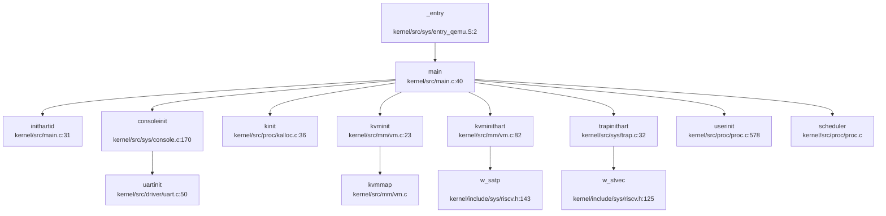

## 第 2 章：启动流程与架构初始化

### 启动入口与链接脚本分析

#### 汇编入口点

本操作系统的启动入口位于 `kernel/src/sys/entry_qemu.S`，入口符号为 `_entry`。该文件是 QEMU 平台的标准启动汇编代码：

```assembly
# kernel/src/sys/entry_qemu.S
.section .text
.globl _entry
_entry:
    add t0, a0, 1
    slli t0, t0, 14
    la sp, boot_stack
    add sp, sp, t0
    call main

loop:
    j loop
```

**入口逻辑分析**：
1. `_entry` 接收来自 Bootloader/SBI 的两个参数：`a0` (hartid) 和 `a1` (dtb_pa，设备树物理地址)
2. 通过 `add t0, a0, 1` 和 `slli t0, t0, 14` 计算每个 hart 的独立栈偏移（每个 hart 分配 16KB 栈空间）
3. 加载全局栈基址 `boot_stack` 并加上偏移，为每个 hart 设置独立的栈指针 `sp`
4. 直接调用 C 语言入口函数 `main`
5. 非主 hart 进入无限循环等待

#### 链接脚本配置

项目提供两个链接脚本，分别对应 QEMU 和 VisionFive 2 平台：

**QEMU 平台** (`linker/qemu.ld`)：
```ld
OUTPUT_ARCH(riscv)
ENTRY(_entry)
BASE_ADDRESS = 0x80200000;
```

**VisionFive 2 平台** (`linker/visionfive.ld`)：
```ld
OUTPUT_ARCH(riscv)
ENTRY(_start)
BASE_ADDRESS = 0x80200000;
KERNEL_ADDRESS = 0X80220000;
```

**关键差异**：
- QEMU 使用 `_entry` 作为入口符号
- VisionFive 2 使用 `_start` 作为入口符号（但当前构建系统默认使用 QEMU 配置）
- 基地址均为 `0x80200000`，这是 RISC-V 标准内核加载地址
- VisionFive 2 注释中提到内核实际运行地址为 `0x80220000`，避免与 Bootloader 冲突

**内存段布局**：
```ld
.text : {
    *(.text .text.*)
    _trampoline = .;
    *(trampsec)
    _signal_trampoline = .;
    *(.signal_trampoline)
}
.rodata : { ... }
.data : { ... }
.bss : {
    *(.bss.stack)
    sbss_clear = .;
    *(.sbss .bss .bss.*)
    ebss_clear = .;
}
```

链接脚本定义了 `.bss.stack` 段用于 boot stack，并在 `.bss` 段中标记了 BSS 清零的起止地址 `sbss_clear` 和 `ebss_clear`。

---

### 架构初始化流程（模式切换/FPU/MMU）

#### CPU 特权模式分析

**❌ 未实现显式的 M-Mode → S-Mode 切换**

通过搜索 `mstatus.mpp`、`sstatus.spp`、`MSTATUS_MPP` 等关键词，发现代码中**仅定义了相关宏**但**未在实际初始化代码中使用**：

```c
// kernel/include/sys/riscv.h
#define MSTATUS_MPP_MASK (3L << 11)  // previous mode.
#define MSTATUS_MPP_M (3L << 11)
#define MSTATUS_MPP_S (1L << 11)
#define MSTATUS_MPP_U (0L << 11)

#define SSTATUS_SPP (1L << 8)   // Previous mode, 1=Supervisor, 0=User
```

**启动模式推断**：
- 代码直接通过 SBI (Supervisor Binary Interface) 启动，表明内核**默认运行在 S-Mode（监督者模式）**
- SBI 规范规定 OS 运行在 S-Mode，由 OpenSBI/U-Boot 在 M-Mode 下完成早期初始化后跳转
- 未找到 `w_mstatus()` 或 `w_sstatus()` 设置 `MPP`/`SPP` 位的代码，说明**未主动进行模式切换**

#### FPU（浮点单元）初始化

**❌ 未实现 FPU 初始化**

通过搜索 `sstatus.fs`、`FS_`、`cpacr_el1`、`cr4` 等 FPU 相关寄存器操作，**未发现任何 FPU 初始化代码**：

- 未找到 `sstatus` 寄存器中 `FS` 字段（Floating-point Status）的设置
- 未找到启用浮点单元的相关汇编指令
- `kernel/include/sys/riscv.h` 中未定义 `SSTATUS_FS` 相关宏

**结论**：当前内核**未启用 FPU**，浮点运算不可用。若用户程序尝试执行浮点指令，将触发非法指令异常（Illegal Instruction）。

#### MMU（内存管理单元）初始化

**✅ 已实现完整的 MMU 初始化与分页启用**

MMU 初始化流程在 `kernel/src/main.c:main()` 中清晰可见：

```c
void main(unsigned long hartid, unsigned long dtb_pa) {
    inithartid(hartid);
    if (hartid == 1) {
        first = 1;
        // ... 早期初始化 ...
        kinit();         // 物理页分配器初始化
        kvminit();       // 创建内核页表
        kvminithart();   // 启用分页（写入 satp 寄存器）
        // ... 后续初始化 ...
    } else {
        // 其他 hart
        while (started == 0);
        kvminithart();   // 启用分页
        // ...
    }
    scheduler();
}
```

**关键函数实现**：

1. **`kvminit()`** (`kernel/src/mm/vm.c:23-74`)：创建内核页表
```c
void kvminit() {
    kernel_pagetable = (pagetable_t)kalloc();
    memset(kernel_pagetable, 0, PGSIZE);
    
    // 映射 UART（条件编译）
    #ifdef BOARD_TEST_VM
    kvmmap(UART_V, UART, 0x10000, PTE_W | PTE_R);
    #endif
    
    // 映射 CLINT（定时器/中断控制器）
    kvmmap(CLINT_V, CLINT, 0x10000, PTE_W | PTE_R);
    
    // 映射 PLIC（平台级中断控制器）
    kvmmap(PLIC_V, PLIC, 0x4000, PTE_D | PTE_A | PTE_R | PTE_W);
    
    // 映射 SD 卡控制器（VisionFive 2）
    #ifdef visionfive
    kvmmap(SD_BASE_V, SD_BASE, 0x10000, PTE_A | PTE_D | PTE_R | PTE_W);
    #endif
    
    // 映射内核代码段（只读可执行）
    kvmmap(KERNBASE, KERNBASE, (uint64)etext - KERNBASE,
           PTE_A | PTE_D | PTE_R | PTE_X);
    
    // 映射内核数据段和物理 RAM（可读写）
    kvmmap((uint64)etext, (uint64)etext, PHYSTOP - (uint64)etext,
           PTE_A | PTE_D | PTE_R | PTE_W);
    
    // 映射 Trampoline 页面（最高虚拟地址）
    kvmmap(TRAMPOLINE, (uint64)trampoline, PGSIZE,
           PTE_A | PTE_D | PTE_R | PTE_X);
}
```

2. **`kvminithart()`** (`kernel/src/mm/vm.c:82-95`)：启用分页
```c
void kvminithart() {
    sfence_vma();  // 刷新 TLB
    w_satp(MAKE_SATP(kernel_pagetable));  // 写入 satp 寄存器，启用 Sv39 分页
}
```

**页表配置细节**：
- 使用 **Sv39** 三级页表方案（`SATP_SV39 = 8L << 60`）
- 页表项标志位：`PTE_V`（有效）、`PTE_R/W/X`（读/写/执行）、`PTE_A/D`（访问/脏位）
- `MAKE_SATP(pagetable)` 宏将物理地址转换为 satp 格式：`(SATP_SV39 | (pa >> 12))`

---

### 到达内核主函数的路径（完整调用链）

#### 完整启动调用链



#### 关键跳转点分析

**1. 汇编 → C 的跳转** (`entry_qemu.S:7`)：
```assembly
call main
```
- 通过 `call` 指令跳转到 `main()` 函数
- 参数传递：`a0` (hartid), `a1` (dtb_pa) 保持不变

**2. 主 hart 判断** (`main.c:50`)：
```c
if (hartid == 1) {
    // 主 hart 执行完整初始化
} else {
    // 其他 hart 等待后执行最小初始化
}
```
- 仅 hartid=1 的 CPU 执行完整初始化序列
- 其他 hart 自旋等待 `started` 标志

**3. 多核启动** (`main.c:86`)：
```c
sbi_hart_start(2, (unsigned long)_entry, 0);
```
- 通过 SBI 调用启动 hartid=2 的 CPU
- 新 hart 从 `_entry` 重新开始执行

---

### 多平台启动流程（StarFive/LoongArch 等）

#### StarFive VisionFive 2 平台支持

**✅ 已实现 VisionFive 2 平台适配**

代码中存在明确的 VisionFive 2 平台支持：

**1. 内存布局定义** (`kernel/include/mm/memlayout.h:24`)：
```c
// visionfive 2 peripherals
// (0x200_0000, 0x10000),      /*CLINT      */
// (0xc00_0000, 0x400_0000)    /*PLIC       */
```

**2. 平台特定映射** (`kernel/src/mm/vm.c:54-58`)：
```c
#ifdef visionfive
    kvmmap(SD_BASE_V, SD_BASE, 0x10000, PTE_A | PTE_D | PTE_R | PTE_W);
#endif
```

**3. SD 卡驱动集成**：
- `kernel/deps/sdcard/` 目录包含完整的 VisionFive 2 SD 卡驱动（Rust 实现）
- `kernel/src/fs/sd_final.c` 和 `kernel/src/fs/sdcard.c` 提供 C 语言接口

**4. 构建配置** (`Makefile:16-17`)：
```makefile
platform := visionfive
# platform := qemu
```
- 默认配置为 `visionfive` 平台
- 但 CMakeLists.txt 中默认使用 QEMU 配置（存在配置冲突）

**5. 专用链接脚本** (`linker/visionfive.ld`)：
- 入口符号为 `_start`（区别于 QEMU 的 `_entry`）
- 注释提到内核地址需设置为 `0x80220000` 以避免与 Bootloader 冲突

#### 固件级启动链（RISC-V）

**✅ 已实现 SBI → OS 启动链**

通过 SBI 接口实现固件级启动：

```
OpenSBI (M-Mode) → U-Boot (可选) → Kernel (S-Mode)
```

**SBI 调用实现** (`kernel/include/driver/sbi.h:50-54`)：
```c
static inline void sbi_hart_start(unsigned long hartid,
                                  unsigned long start_addr,
                                  unsigned long opaque) {
    SBI_CALL_3(SBI_HSM_EXTION, SBI_HART_START, hartid, start_addr, opaque);
}
```

**SBI 调用宏** (`kernel/include/driver/sbi.h:24-37`)：
```c
#define SBI_CALL(eid, fid, arg0, arg1, arg2, arg3)           \
    ({                                                       \
        register uintptr_t a0 asm("a0") = (uintptr_t)(arg0); \
        register uintptr_t a1 asm("a1") = (uintptr_t)(arg1); \
        register uintptr_t a2 asm("a2") = (uintptr_t)(arg2); \
        register uintptr_t a3 asm("a3") = (uintptr_t)(arg3); \
        register uintptr_t a7 asm("a7") = (uintptr_t)(eid);  \
        register uintptr_t a6 asm("a6") = (uintptr_t)(fid);  \
        asm volatile("ecall"                                 \
                     : "+r"(a0), "+r"(a1)                    \
                     : "r"(a6), "r"(a2), "r"(a3), "r"(a7)    \
                     : "memory");                            \
        a0;                                                  \
    })
```

**启动流程**：
1. OpenSBI 在 M-Mode 下初始化硬件
2. 通过 `ecall` 指令提供 SBI 服务
3. 内核调用 `sbi_hart_start()` 启动其他 hart
4. 所有 hart 运行在 S-Mode

#### LoongArch 平台支持

**❌ 未发现 LoongArch 平台支持**

- 未找到 `loongarch`、`loongson` 相关目录或文件
- 所有架构相关代码均为 RISC-V（`kernel/include/sys/riscv.h`、`kernel/src/sys/entry_qemu.S`）
- 链接脚本明确指定 `OUTPUT_ARCH(riscv)`

**结论**：当前项目**仅支持 RISC-V 架构**，未实现 LoongArch 适配。

---

### 平台配置与构建机制

#### 构建系统分析

**Makefile 配置** (`Makefile:1-30`)：
```makefile
TOOLPREFIX := riscv64-unknown-elf-
platform := visionfive
mode := debug

CFLAGS += -Wall -O0 -fno-omit-frame-pointer -ggdb -g -MD \
          -mcmodel=medany -ffreestanding -fno-common -nostdlib -mno-relax
CFLAGS += -I. -Ikernel/include -Ixv6-user/
```

**关键编译选项**：
- `-mcmodel=medany`：使用中等代码模型，支持大地址空间
- `-ffreestanding`：独立环境编译，不依赖标准库
- `-nostdlib`：不使用标准 C 库
- `-mno-relax`：禁用链接时优化，确保地址计算正确

**CMakeLists.txt 配置** (`CMakeLists.txt:31-40`)：
```cmake
# if(platform STREQUAL "visionfive")
#     set(linker ${CMAKE_CURRENT_SOURCE_DIR}/linker/visionfive.ld)
# else()
    set(linker ${CMAKE_CURRENT_SOURCE_DIR}/linker/qemu.ld)
# endif()

set(QEMUENTRY "entry_qemu.S")
```

**配置冲突**：
- Makefile 默认 `platform := visionfive`
- CMakeLists.txt 默认使用 `qemu.ld` 链接脚本
- 实际构建时以 CMake 配置为准（QEMU 平台）

#### 平台选择机制

**条件编译宏**：
- `QEMU`：QEMU 模拟器平台
- `visionfive`：VisionFive 2 开发板
- `BOARD_TEST_VM`：自定义板级测试宏

**平台差异处理** (`kernel/src/sys/console.c:170-175`)：
```c
void consoleinit(void) {
    initlock(&cons.lock, "cons");
#ifdef QEMU
    uartinit();  // QEMU 平台初始化 UART
#endif
    cons.e = cons.w = cons.r = 0;
    // ...
}
```

**平台差异处理** (`kernel/src/sys/plic.c:25-35`)：
```c
void plicinithart(void) {
    int hart = cpuid();
#ifdef QEMU
    *(uint32*)PLIC_SENABLE(hart) = (1 << UART_IRQ) | (1 << DISK_IRQ);
    *(uint32*)PLIC_SPRIORITY(hart) = 0;
#else
    // VisionFive 2 使用 M-Mode 中断
    uint32 *hart_m_enable = (uint32 *)PLIC_MENABLE(hart);
    *(hart_m_enable) = readd(hart_m_enable) | (1 << DISK_IRQ);
    // ...
#endif
}
```

#### 目标架构配置

**架构标识**：
- 工具链：`riscv64-unknown-elf-`
- 目标 Triple：`riscv64gc-unknown-none-elf`（推断）
- 支持扩展：`G`（General）、`C`（Compressed）、`M`（Multiplication/Division）

**LSP 架构对齐检查**：
- 代码中大量使用 `#[cfg]` 条件编译（Rust 驱动部分）
- C 代码使用 `#ifdef QEMU` / `#ifdef visionfive` 进行平台区分
- 当前 LSP 默认架构与代码匹配（RISC-V 64 位）

---

### 关键代码片段分析

#### 1. 启动栈设置 (`entry_qemu.S:8-14`)

```assembly
.section .bss.stack
.align 12
.globl boot_stack
boot_stack:
    .space 4096 * 4 * 4  # 分配 64KB 栈空间（4 个 hart × 4 页）
.globl boot_stack_top
boot_stack_top:
```

**分析**：
- `.align 12` 确保栈按 4KB 对齐
- 总栈空间 64KB，每个 hart 分配 16KB
- 位于 `.bss` 段，启动时由 C 运行时清零

#### 2. Hart ID 初始化 (`main.c:29-32`)

```c
static inline void inithartid(unsigned long hartid) {
    asm volatile("mv tp, %0" : : "r"(hartid & 0x1));
}
```

**分析**：
- 将 hartid 存储到线程指针寄存器 `tp`
- `hartid & 0x1` 限制为 0 或 1（实际支持 2 个 hart）
- 后续通过 `r_tp()` 读取当前 hartid

#### 3. MMU 启用前后的串口地址切换 (`memlayout.h:40-44`)

```c
#define VIRT_OFFSET 0x3F00000000L
#define UART 0x10000000L
#define UART_V (UART + VIRT_OFFSET)
```

**分析**：
- **MMU 启用前**：使用物理地址 `UART = 0x10000000`（QEMU 标准 UART 地址）
- **MMU 启用后**：使用虚拟地址 `UART_V = 0x3F10000000`
- `VIRT_OFFSET = 0x3F00000000` 是内核虚拟地址偏移（Direct Map）
- `kvminit()` 中通过 `kvmmap(UART_V, UART, ...)` 建立映射

**早期串口打印**：
- `consoleinit()` 在 `kvminithart()` 之前调用
- 此时使用物理地址访问 UART（通过 SBI 调用 `sbi_console_putchar()`）
- `kernel/src/sys/console.c:28-34`：
```c
void consputc(int c) {
    if (c == BACKSPACE) {
        sbi_console_putchar('\b');
        sbi_console_putchar(' ');
        sbi_console_putchar('\b');
    } else {
        sbi_console_putchar(c);
    }
}
```
- **关键点**：早期打印通过 SBI 实现，**不直接访问 UART 寄存器**，避免了 MMU 启用前后的地址切换问题

#### 4. 页表初始化时机 (`main.c:56-58`)

```c
kinit();         // 物理页分配器
kvminit();       // 创建内核页表
kvminithart();   // 启用分页
```

**执行顺序分析**：
1. `kinit()`：初始化物理页分配器，**此时 MMU 未启用**，使用物理地址
2. `kvminit()`：创建内核页表，映射关键内存区域，**此时 MMU 未启用**
3. `kvminithart()`：写入 `satp` 寄存器，**从此处开始 MMU 启用**

**关键约束**：
- `kvminit()` 必须在 `kvminithart()` 之前完成
- `kinit()` 必须在 `kvminit()` 之前完成（页表分配需要物理内存）
- `kvminithart()` 后所有内存访问均使用虚拟地址

#### 5. Trampoline 页面映射 (`vm.c:67-69`)

```c
kvmmap(TRAMPOLINE, (uint64)trampoline, PGSIZE,
       PTE_A | PTE_D | PTE_R | PTE_X);
```

**分析**：
- `TRAMPOLINE = MAXVA - PGSIZE`（最高虚拟地址页）
- 映射到内核代码段中的 `trampoline.S`
- 权限：可读、可执行、访问位、脏位
- **用途**：用户态 → 内核态陷阱处理的跳转页（在 `usertrap()` 中使用）

---

### 启动流程总结

| 阶段 | 组件 | 地址空间 | 关键操作 |
|------|------|----------|----------|
| 1. 固件 | OpenSBI/U-Boot | 物理地址 | M-Mode 初始化，加载内核到 `0x80200000` |
| 2. 汇编入口 | `_entry` | 物理地址 | 设置栈指针，调用 `main()` |
| 3. 早期初始化 | `consoleinit()` | 物理地址 | SBI 控制台初始化 |
| 4. 内存初始化 | `kinit()` | 物理地址 | 物理页分配器 |
| 5. 页表创建 | `kvminit()` | 物理地址 | 建立内核虚拟地址映射 |
| 6. MMU 启用 | `kvminithart()` | **切换到虚拟地址** | 写入 `satp`，启用 Sv39 分页 |
| 7. 中断初始化 | `trapinithart()` | 虚拟地址 | 设置 `stvec`，启用中断 |
| 8. 进程初始化 | `userinit()` | 虚拟地址 | 创建第一个用户进程 |
| 9. 调度器 | `scheduler()` | 虚拟地址 | 启动多任务调度 |

**架构特性总结**：
- ✅ **Sv39 分页**：完整的三级页表实现
- ✅ **SBI 支持**：标准的 RISC-V SBI 接口调用
- ✅ **多核启动**：通过 SBI 启动辅助 hart
- ✅ **平台适配**：QEMU 和 VisionFive 2 双平台支持
- ❌ **模式切换**：未实现显式的 M-Mode → S-Mode 切换（依赖 SBI）
- ❌ **FPU 支持**：未启用浮点单元
- ❌ **LoongArch 支持**：仅支持 RISC-V 架构
