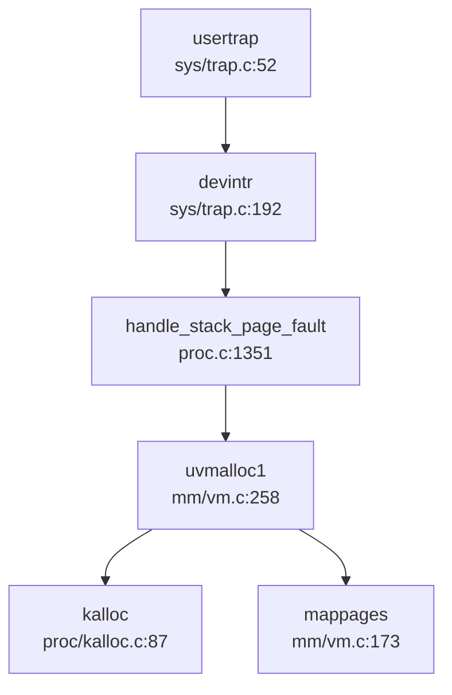
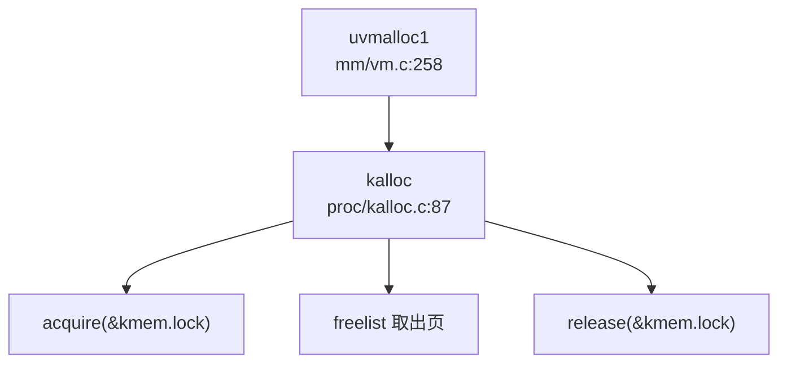
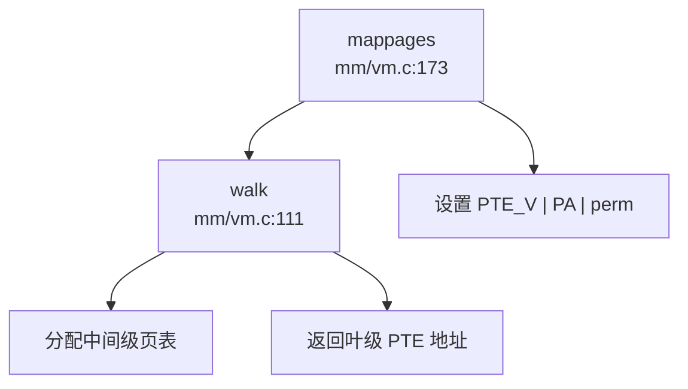

## 第 3 章：内存管理（物理/虚拟/分配器）

### 物理内存管理实现

本 OS 采用**空闲链表（Free List）**机制管理物理内存，而非 Buddy System 或 Bitmap 算法。

**核心数据结构**（`kernel/src/proc/kalloc.c:19-27`）：
```c
struct run {
    struct run *next;
};

struct {
    struct spinlock lock;
    struct run *freelist;
    uint64 npage;
} kmem;
```

**物理页分配器接口**：
- **`kinit()`**（`kalloc.c:32-41`）：初始化物理内存分配器，调用 `freerange()` 释放从 `kernel_end` 到 `PHYSTOP` 的所有物理内存
- **`kalloc()`**（`kalloc.c:87-98`）：分配一个 4KB 物理页，从空闲链表头部取出
- **`kfree()`**（`kalloc.c:67-83`）：释放物理页，插入空闲链表头部

```c
void *kalloc(void) {
    struct run *r_ptr;
    acquire(&kmem.lock);
    r_ptr = kmem.freelist;
    if (r_ptr != 0) {
        kmem.freelist = r_ptr->next;
        --kmem.npage;
    }
    release(&kmem.lock);
    if (r_ptr != 0) memset((char *)r_ptr, 5, PGSIZE);
    return (void *)r_ptr;
}
```

**特性分析**：
- ✅ **已实现**：基于空闲链表的物理页分配/回收
- ✅ **已实现**：自旋锁保护并发安全
- ❌ **未实现**：Buddy System 或 Slab 分配器（仅支持整页分配）
- 🔸 **桩函数**：`kmalloc()` 支持多页分配但本质仍是页分配器，非真正按需分配

---

### 虚拟内存与页表操作

本 OS 采用 **RISC-V Sv39 三级页表** 机制，支持 39 位虚拟地址空间（512GB）。

**页表结构**（`kernel/src/mm/vm.c:111-126`）：
```c
pte_t *walk(pagetable_t pgtb, uint64 va, int allocation) {
    if (MAXVA <= va) panic("walk");
    for (int level = 2; level > 0; --level) {
        pte_t *PTE = &pgtb[PX(level, va)];
        if (PTE_V & *PTE) {
            pgtb = (pagetable_t)PTE2PA(*PTE);
        } else {
            if ((pgtb = (pde_t *)kalloc()) == NULL || allocation == 0)
                return NULL;
            memset(pgtb, 0, PGSIZE);
            *PTE = PTE_V | PA2PTE(pgtb);
        }
    }
    return &pgtb[PX(0, va)];
}
```

**核心页表操作函数**：

| 函数 | 文件位置 | 功能 |
|------|----------|------|
| `walk()` | `vm.c:111-126` | 页表遍历，支持惰性分配中间级页表 |
| `mappages()` | `vm.c:173-190` | 批量映射虚拟地址到物理地址 |
| `vmunmap()` | `vm.c:195-210` | 解除映射，可选择性释放物理页 |
| `walkaddr()` | `vm.c:133-145` | 虚拟地址翻译为物理地址 |
| `experm()` | `vm.c:614-625` | 修改页表项权限位 |

**`mappages()` 实现**（`vm.c:173-190`）：
```c
int mappages(pagetable_t pgtb, uint64 va, uint64 sz, uint64 pa, int perm) {
    perm |= PTE_D | PTE_A;  // 强制设置 Dirty 和 Accessed 位
    pte_t *PTE;
    uint64 a = PGROUNDDOWN(va);
    uint64 lst = PGROUNDDOWN(va + sz - 1);
    while (1) {
        if ((PTE = walk(pgtb, a, 1)) == NULL) return -1;
        if (0 != (*PTE & PTE_V)) panic("remap");
        *PTE = PTE_V | PA2PTE(pa) | perm;
        if (a == lst) break;
        pa += PGSIZE, a += PGSIZE;
    }
    return 0;
}
```

---

### 地址空间布局（内核 vs 用户）

**内核地址空间**（`vm.c:26-73`）：
- 通过 `kvminit()` 初始化全局内核页表 `kernel_pagetable`
- 映射关键设备寄存器（UART、CLINT、PLIC、SD_BASE）
- 映射内核代码段（`KERNBASE` 到 `etext`）为只读可执行
- 映射内核数据段（`etext` 到 `PHYSTOP`）为可读写
- 映射 Trampoline 页面到最高虚拟地址用于用户/内核态切换

**用户地址空间**（`proc.c:528-562`）：
- 每个进程通过 `proc_pagetable()` 创建独立页表
- 用户页表包含：
  - 用户代码/数据/堆（0 到 `sz`）
  - Trampoline 页面（高地址，与内核共享）
  - Trapframe 页面（高地址，每进程独立）
- 通过 `PTE_U` 位区分用户/内核权限

**关键内存布局常量**（`mm/memlayout.h`）：
- `USER_STACK_TOP`：用户栈顶地址
- `USER_MMAP_START`：mmap 区域起始地址
- `TRAMPOLINE`：内核 Trampoline 映射地址
- `TRAPFRAME`：Trap 帧保存区域

---

### 堆分配器解析

**内核堆分配**（`kalloc.c:107-175`）：
- `kmalloc(size)`：分配多页连续内存，按页向上取整
- `cmalloc(cnt, each_size)`：按对象数量和大小分配
- `free(addr, size)`：按页释放内存

**用户堆管理**（`xv6-user/umalloc.c`）：
- 基于 `sbrk` 系统调用的传统 Unix 风格分配器
- 使用空闲链表（`freep`）管理堆内部分配
- `malloc()` / `free()` 在用户态实现，通过 `sbrk` 扩展堆空间

```c
// xv6-user/umalloc.c:53-77
void *malloc(uint nbytes) {
    Header *p, *prevp;
    uint nunits = (nbytes + sizeof(Header) - 1) / sizeof(Header) + 1;
    // ... 在空闲链表中查找合适块
    for (p = prevp->s.ptr;; prevp = p, p = p->s.ptr) {
        if (p->s.size >= nunits) {
            // 分割并返回
        }
        if (p == freep)
            if ((p = morecore(nunits)) == 0) return 0;
    }
}
```

**堆管理系统调用**：
- **`sys_sbrk()`**（`sysproc.c:337-343`）：✅ **已实现**，通过 `growproc()` 调整堆大小
- **`sys_brk()`**（`sysproc.c:352-367`）：✅ **已实现**，设置绝对断点地址

```c
uint64 sys_sbrk(void) {
    int n, address;
    if (argint(0, &n) < 0) return -1;
    address = myproc()->sz;
    if (growproc(n) < 0) return -1;
    return address;
}
```

**惰性分配分析**：
- ❌ **未实现**：`sbrk` / `brk` 仅调整 `sz` 边界，但实际物理页分配在 `uvmalloc()` / `uvmalloc1()` 中**立即分配**
- 搜索 `lazy` 关键词仅发现 SBI 相关注释（`sbi.h:41`），无惰性分配逻辑

---

### 用户指针安全验证

**用户空间指针验证机制**：
- ❌ **未实现**：未找到 `UserInPtr` / `UserOutPtr` / `verify_area` / `check_region` 等专用验证结构体或函数
- ✅ **已实现**：通过 `copyin()` / `copyout()` 间接验证（`proc.c:1079-1088`）

```c
int either_copyin(void *dst, int user_src, uint64 src, uint64 length) {
    struct proc *p = myproc();
    if (user_src) {
        return copyin(p->pagetable, dst, src, length);
    } else {
        memmove(dst, (char *)src, length);
        return 0;
    }
}
```

**`copyin()` / `copyout()` 验证逻辑**（`vm.c:399-414`）：
- 通过 `walkaddr()` 检查虚拟地址是否映射且为用户页（`PTE_U`）
- 检查地址是否超出进程大小（`sz`）
- 逐页复制，遇到未映射页返回 -1

**缺陷**：
- 无显式的 `access_ok()` 风格预验证
- 依赖 `walkaddr()` 的隐式检查，可能导致部分验证绕过

---

### 缺页异常处理流程

**异常入口**（`sys/trap.c:64-90`）：
```c
void usertrap(void) {
    if (r_scause() == 8) {
        // 系统调用
        syscall();
    } else if ((which_dev = devintr()) != 0) {
        // 设备中断
    } else {
        // 其他异常（包括缺页）
        printf("\nusertrap(): unexpected scause %p pid=%d %s\n", r_scause(), ...);
        p->killed = SIGTERM;
    }
}
```

**栈缺页处理**（`proc.c:1351-1382`）：
```c
uint64 handle_stack_page_fault(struct proc *p, uint64 va) {
    if (!(va >= USER_STACK_DOWN && va < USER_STACK_TOP)) {
        return -1;
    }
    struct vma *vma = p->vma->next;
    while (vma != p->vma) {
        if (vma->type == STACK) break;
        vma = vma->next;
    }
    uint64 start = vma->addr - INCREASE_STACK_SIZE_PER_FAULT;
    if (start > va) start = PGROUNDDOWN(va);
    if (uvmalloc1(p->pagetable, start, end, PTE_R | PTE_W | PTE_U) != 0) {
        return -1;
    }
    vma->addr = start;
    return 0;
}
```

**调用链分析**：


**特性**：
- ✅ **已实现**：栈空间动态扩展（按需分配栈页）
- ❌ **未实现**：通用缺页处理（代码/数据段缺页直接杀死进程）
- ❌ **未实现**：未找到 `handle_page_fault` 统一入口函数

---

### 进程级映射管理（VMA）

**VMA 数据结构**（`include/mm/vma.h:14-26`）：
```c
struct vma {
    enum segtype type;      // NONE, MMAP, STACK
    int perm;               // 页表权限
    uint64 addr;            // 起始虚拟地址
    uint64 sz;              // 映射大小
    uint64 end;             // 结束地址
    int flags;
    int fd;                 // 关联文件描述符
    uint64 f_off;           // 文件偏移
    struct vma *prev, *next; // 双向链表
};
```

**VMA 管理函数**：
- `vma_init()`（`proc.c:308-327`）：初始化进程 VMA 链表
- `alloc_vma()`（`proc.c:329-367`）：分配新 VMA 并插入链表
- `vma_copy()`（`proc.c:406-438`）：fork 时复制 VMA 链表
- `free_vma_list()`（`proc.c:478-503`）：释放所有 VMA 及映射页

**反向映射表（rmap）**：
- ❌ **未实现**：搜索 `rmap` / `reverse_map` / `page_to_vma` 无结果
- VMA 链表仅支持虚拟地址→物理页映射，无物理页→虚拟页反向查询

---

### 高级内存特性清单

| 特性 | 状态 | 证据/说明 |
|------|------|-----------|
| **写时复制（CoW）** | ❌ 未实现 | 搜索 `cow` / `copy_on_write` 无结果；`uvmcopy()` 直接复制物理页（`vm.c:359-391`） |
| **懒分配（Lazy Allocation）** | ❌ 未实现 | `uvmalloc1()` 立即分配物理页；无 `lazy` / `populate` 逻辑 |
| **共享内存（shm）** | ❌ 未实现 | 搜索 `sys_shmget` / `sys_shmdt` / `shm_` 无结果 |
| **反向映射表（rmap）** | ❌ 未实现 | 搜索 `rmap` / `reverse_map` 无结果 |
| **交换区/页面置换（Swap）** | ❌ 未实现 | 搜索 `swap_out` / `swap_in` 仅找到链表交换宏，无分页交换逻辑 |
| **大页支持（Huge Page）** | ❌ 未实现 | 搜索 `HugePage` / `MapSize::2M` 无结果；`mappages()` 仅处理 4KB 页 |
| **mmap 文件映射** | ✅ 已实现 | `sys_mmap()`（`sysfile.c:1099-1131`）调用 `mmap()`（`mmap.c:24-66`） |
| **mmap 标志处理** | 🔸 部分实现 | 处理 `MAP_ANONYMOUS`（`sysfile.c:1118`），但未处理 `MAP_FIXED` / `MAP_SHARED` |
| **munmap** | 🔸 桩函数 | `sys_munmap()`（`sysfile.c:1133-1141`）仅返回 0，无实际逻辑 |
| **mprotect** | ✅ 已实现 | `sys_mprotect()`（`sysproc.c:632-650`）调用 `experm()` 修改权限 |

**mmap 实现分析**（`mm/mmap.c:24-66`）：
```c
uint64 mmap(uint64 st, uint64 len, int prot, int flg, int fd, long int offset) {
    struct proc *Proc = myproc();
    int perm = PTE_U | PTE_A | PTE_D | PTE_W | PTE_R | PTE_X;
    if (prot & PROT_READ) perm |= PTE_R;
    if (prot & PROT_WRITE) perm |= PTE_W;
    if (prot & PROT_EXEC) perm |= (PTE_X | PTE_A);
    
    struct file *f = fd != -1 ? Proc->ofile[fd] : NULL;
    struct vma *vma = alloc_mmap_vma(Proc, flg, st, len, perm, fd, offset);
    
    if (-1 == fd) {
        return st;  // 匿名映射，不预分配
    } else {
        // 文件映射：预读文件内容
        for (int idx = 0; idx < page_n; ++idx) {
            uint64 pa = experm(Proc->pagetable, va, perm);
            fileread(f, va, PGSIZE);
        }
    }
    return st;
}
```

**缺陷**：
- 文件映射**预分配所有物理页**，非惰性分配
- 未处理 `MAP_FIXED`（强制地址映射）
- `munmap()` 未实现，映射无法解除

---

### 关键代码片段与调用链分析

**物理页分配调用链**：


**页表映射调用链**：


**fork 时内存复制**（`vm.c:359-391`）：
```c
int uvmcopy(pagetable_t old, pagetable_t new, pagetable_t knew, uint64 sz) {
    while (sz > idx) {
        PTE = walk(old, idx, 0);
        pa = PTE2PA(*PTE);
        flags = PTE_FLAGS(*PTE);
        mem = kalloc();  // 分配新物理页
        memmove(mem, (char *)pa, PGSIZE);  // 复制内容
        mappages(new, idx, PGSIZE, (uint64)mem, flags);
        idx += PGSIZE;
    }
    return 0;
}
```
- ❌ **非 CoW**：直接复制物理页，父子进程独立
- ✅ **已实现**：内核页表同步映射（`knew` 参数）

---

### 内存管理总结

| 子系统 | 实现状态 | 算法/机制 |
|--------|----------|-----------|
| 物理内存管理 | ✅ 已实现 | 空闲链表（Free List） |
| 虚拟内存管理 | ✅ 已实现 | RISC-V Sv39 三级页表 |
| 堆分配器 | ✅ 已实现 | 页分配器 + 用户态 `malloc` |
| 惰性分配 | ❌ 未实现 | 所有映射立即分配物理页 |
| 写时复制 | ❌ 未实现 | fork 时直接复制 |
| 共享内存 | ❌ 未实现 | 无 shm 系统调用 |
| 页面置换 | ❌ 未实现 | 无 swap 机制 |
| 大页支持 | ❌ 未实现 | 仅 4KB 页 |
| mmap | ✅ 已实现 | 支持文件/匿名映射 |
| munmap | 🔸 桩函数 | 仅返回 0 |
| mprotect | ✅ 已实现 | 通过 `experm()` 修改权限 |

**总体评价**：本 OS 实现了基础的物理/虚拟内存管理机制，支持进程独立地址空间、mmap 文件映射、栈动态扩展。但缺乏高级特性（CoW、Lazy Allocation、Swap、大页），适合教学演示而非生产环境。
