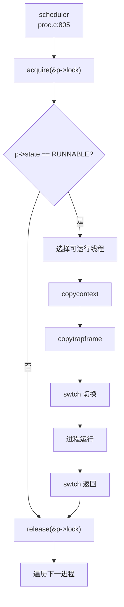

## 第 4 章：进程/线程与调度机制

### 任务模型与核心数据结构

本操作系统采用 **进程 - 线程双层模型**，其中进程是资源分配的基本单位，线程是调度的基本单位。

#### 进程控制块 (PCB) - `struct proc`

进程控制块定义于 `kernel/include/proc/proc.h:55-95`，包含以下核心字段：

```c
struct proc {
    struct spinlock lock;
    enum procstate state;        // 进程状态
    struct proc *parent;         // 父进程
    void *chan;                  // 睡眠通道
    int killed;                  // 终止标志
    int xstate;                  // 退出状态
    int pid;                     // 进程 ID
    int uid, gid, pgid;          // 用户/组/进程组 ID
    
    thread *main_thread;         // 主线程
    thread *thread_queue;        // 线程队列
    uint64 kstack;               // 内核栈地址
    uint64 sz;                   // 内存大小
    pagetable_t pagetable;       // 用户页表
    pagetable_t kpagetable;      // 内核页表
    struct trapframe *trapframe; // 陷阱帧
    struct context context;      // 上下文
    struct file *ofile[NOFILE];  // 打开文件表
    struct dirent *cwd;          // 当前目录
    char name[16];               // 进程名
    struct vma *vma;             // 虚拟内存区域
    
    // 信号机制
    sigaction sigaction[SIGRTMAX + 1];
    __sigset_t sig_set, sig_pending;
    struct trapframe *sig_tf;
};
```

**关键设计**：
- **PID 分配**：使用全局 `nextpid` 计数器，通过 `pid_lock` 保护（`kernel/src/proc/proc.c:127-133`）
- **文件描述符**：支持最多 `NOFILE` 个打开文件，`fork()` 时复制文件表
- **信号支持**：包含信号处理函数表、信号掩码和待处理信号集

#### 线程控制块 (TCB) - `struct thread`

线程结构定义于 `kernel/include/proc/thread.h:20-50`：

```c
typedef struct thread {
    struct spinlock lock;
    enum threadState state;      // 线程状态
    struct proc *p;              // 所属进程
    void *chan;                  // 睡眠通道
    int tid;                     // 线程 ID
    uint64 awakeTime;            // 唤醒时间
    uint64 kstack;               // 内核栈地址
    uint64 vtf;                  // 陷阱帧虚拟地址
    struct trapframe *trapframe;
    context context;             // 上下文
    uint64 clear_child_tid;
    struct thread *next_thread, *pre_thread;  // 双向链表
} thread;
```

**线程池管理**：
- 全局线程池 `threads[THREAD_NUM]`（`THREAD_NUM=10000`）
- 空闲线程链表 `free_thread`
- TID 分配使用全局 `nexttid` 计数器

#### 上下文结构 - `struct context`

定义于 `kernel/include/sys/context.h:7-22`，保存 **callee-saved 寄存器**：

```c
typedef struct context {
    uint64 ra;   // 返回地址
    uint64 sp;   // 栈指针
    uint64 s0-s11;  // 被调用者保存寄存器
} context;
```

#### 陷阱帧 - `struct trapframe`

定义于 `kernel/include/sys/trap.h:18-58`，保存 **所有用户态寄存器**（29 个字段，共 288 字节），包括：
- 内核元数据：`kernel_satp`, `kernel_sp`, `kernel_trap`, `kernel_hartid`
- 用户程序计数器：`epc`
- 所有通用寄存器：`ra`, `sp`, `gp`, `tp`, `t0-t6`, `s0-s11`, `a0-a7`

---

### 调度算法与策略（代码证据）

#### 调度器实现

调度器位于 `kernel/src/proc/proc.c:805-867` 的 `scheduler()` 函数，采用 **简单的轮转调度（Round-Robin）** 策略：

```c
void scheduler(void) {
    struct cpu *c = mycpu();
    c->proc = 0;
    while (1) {
        intr_on();
        int found = 0;
        for (struct proc *p = proc; &proc[NPROC] > p; ++p) {
            acquire(&p->lock);
            if (RUNNABLE == p->state) {
                thread *t = p->thread_queue;
                while (NULL != t) {
                    if (t->state == t_RUNNABLE ||
                        (t->state == t_TIMING && t->awakeTime < r_time() + (1LL << 35)))
                        break;
                    t = t->next_thread;
                }
                if (NULL == t) continue;
                
                // 将可运行线程移到队列头部
                if (p->thread_queue != t) {
                    // 链表重排操作...
                    p->thread_queue = t;
                }
                p->main_thread = t;
                copycontext(&p->context, &p->main_thread->context);
                copytrapframe(p->trapframe, p->main_thread->trapframe);
                p->main_thread->state = t_RUNNING;
                p->state = RUNNING;
                
                // 上下文切换
                swtch(&c->context, &p->context);
                
                c->proc = 0;
                found = 1;
            }
            release(&p->lock);
        }
        if (!found) {
            intr_on();
            asm volatile("wfi");  // 等待中断
        }
    }
}
```

**调度策略分析**：
- ✅ **已实现**：简单的 FIFO 轮转调度
- ❌ **未实现**：优先级调度（无 priority 字段）
- ❌ **未实现**：时间片轮转（无时间片计数）
- ❌ **未实现**：CFS 或 Stride 调度算法

调度器遍历所有进程，选择第一个 `RUNNABLE` 状态的进程，并在其线程队列中选择第一个可运行线程。**无优先级比较**，仅按进程数组顺序选择。

#### 调度触发

`sched()` 函数（`kernel/src/proc/proc.c:870-884`）负责触发调度：

```c
void sched(void) {
    struct proc *p = myproc();
    if (!holding(&p->lock)) panic("sched p->lock");
    if (mycpu()->noff != 1) panic("sched locks");
    if (RUNNING == p->state || p->main_thread->state == t_RUNNING)
        panic("sched running");
    if (intr_get()) panic("sched interruptible");
    
    copytrapframe(p->main_thread->trapframe, p->trapframe);
    int intena = mycpu()->intena;
    swtch(&p->context, &mycpu()->context);
    mycpu()->intena = intena;
}
```

**调度调用点**：
1. `yield()` - 主动让出 CPU
2. `sleep()` - 进入睡眠
3. `exit()` - 进程终止

---

### 任务状态机

#### 进程状态

定义于 `kernel/include/proc/proc.h:53`：

```c
enum procstate { UNUSED, SLEEPING, RUNNABLE, RUNNING, ZOMBIE };
```

| 状态 | 说明 | 转换条件 |
|------|------|----------|
| `UNUSED` | 空闲槽位 | 系统初始化 |
| `SLEEPING` | 睡眠 | `sleep(chan, lk)` |
| `RUNNABLE` | 可运行 | `yield()`, `wakeup()` |
| `RUNNING` | 运行中 | 被调度器选中 |
| `ZOMBIE` | 僵尸 | `exit()` |

#### 线程状态

定义于 `kernel/include/proc/thread.h:11-18`：

```c
enum threadState {
    t_UNUSED, t_SLEEPING, t_RUNNABLE, t_RUNNING, t_ZOMBIE, t_TIMING
};
```

**新增状态**：
- `t_TIMING`：定时睡眠（用于 futex 超时等待）

#### 状态流转图

```
UNUSED → RUNNABLE (allocproc)
RUNNABLE → RUNNING (scheduler)
RUNNING → RUNNABLE (yield)
RUNNING → SLEEPING (sleep)
RUNNING → ZOMBIE (exit)
SLEEPING → RUNNABLE (wakeup)
ZOMBIE → UNUSED (wait + freeproc)
```

---

### 上下文切换实现（汇编分析）

上下文切换汇编代码位于 `kernel/src/proc/swtch.S`：

```assembly
.globl swtch
swtch:
    # 保存旧上下文到 old (a0)
    sd ra, 0(a0)
    sd sp, 8(a0)
    sd s0, 16(a0)
    sd s1, 24(a0)
    sd s2, 32(a0)
    sd s3, 40(a0)
    sd s4, 48(a0)
    sd s5, 56(a0)
    sd s6, 64(a0)
    sd s7, 72(a0)
    sd s8, 80(a0)
    sd s9, 88(a0)
    sd s10, 96(a0)
    sd s11, 104(a0)

    # 从 new (a1) 加载新上下文
    ld ra, 0(a1)
    ld sp, 8(a1)
    ld s0, 16(a1)
    ld s1, 24(a1)
    ld s2, 32(a1)
    ld s3, 40(a1)
    ld s4, 48(a1)
    ld s5, 56(a1)
    ld s6, 64(a1)
    ld s7, 72(a1)
    ld s8, 80(a1)
    ld s9, 88(a1)
    ld s10, 96(a1)
    ld s11, 104(a1)
    
    ret
```

**保存的寄存器**（共 14 个，112 字节）：
- `ra`：返回地址
- `sp`：栈指针
- `s0-s11`：callee-saved 寄存器

**未保存的寄存器**：
- `t0-t6`, `a0-a7`：caller-saved，由编译器负责保存
- `gp`, `tp`：全局指针和线程指针

**切换流程**：
1. 保存当前 `context` 到 `old`
2. 从 `new` 加载新 `context`
3. `ret` 跳转到新上下文的 `ra`

---

### 进程间通信与同步（Signal/Futex）

#### 信号机制 (Signal)

**✅ 已实现**

信号定义于 `kernel/include/ipc/signal.h`，支持 64 种信号（`SIGRTMAX=64`）：

```c
typedef struct sigaction {
    union {
        __sighandler_t sa_handler;  // 信号处理函数
    } __sigaction_handler;
    __sigset_t sa_mask;  // 信号掩码
    int sa_flags;
} sigaction;
```

**核心函数**：
1. `set_sigaction()` (`kernel/src/ipc/signal.c:9-19`)：注册信号处理函数
2. `sigprocmask()` (`kernel/src/ipc/signal.c:21-43`)：设置信号掩码
3. `sighandle()` (`kernel/src/ipc/signal.c:57-77`)：信号分发

**信号分发流程**：
```c
void sighandle(void) {
    struct proc *p = myproc();
    int signum = p->killed;
    if (p->sigaction[signum].__sigaction_handler.sa_handler != NULL) {
        p->sig_tf = kalloc();
        memcpy(p->sig_tf, p->trapframe, sizeof(struct trapframe));
        p->trapframe->epc = (uint64)p->sigaction[signum].__sigaction_handler.sa_handler;
        p->trapframe->ra = (uint64)SIGTRAMPOLINE;
        p->trapframe->sp = p->trapframe->sp - PGSIZE;
        p->sig_pending.__val[0] &= ~(1ul << signum);
        if (p->sig_pending.__val[0] == 0) {
            p->killed = 0;
        }
    } else {
        exit(-1);  // 默认终止
    }
}
```

**系统调用**：
- `sys_rt_sigaction()` - 注册信号处理函数
- `sys_rt_sigprocmask()` - 修改信号掩码
- `sys_kill()` - 发送信号
- `sys_tgkill()` - 向指定线程发送信号
- `sys_rt_sigreturn()` - 从信号处理返回

**kill 实现** (`kernel/src/proc/proc.c:1012-1034`)：
```c
int kill(int pid, int sig) {
    for (struct proc *p = proc; &proc[NPROC] > p; ++p) {
        acquire(&p->lock);
        if (pid == p->pid) {
            p->sig_pending.__val[0] |= (1 << (sig));
            if (p->killed == 0 || p->killed > sig) {
                p->killed = sig;
            }
            if (p->state == SLEEPING) {
                p->state = RUNNABLE;
            }
            release(&p->lock);
            return 0;
        }
        release(&p->lock);
    }
    return 0;
}
```

#### Futex (快速用户态互斥锁)

**✅ 已实现**

Futex 实现于 `kernel/src/utils/futex.c`，支持等待、唤醒和重队列操作：

```c
typedef struct FutexQueue {
    uint64 addr;
    thread* thread;
    uint8 valid;
} FutexQueue;

FutexQueue futexQueue[FUTEX_COUNT];
```

**核心函数**：
1. `futexWait()` (`kernel/src/utils/futex.c:17-34`)：等待 futex
2. `futexWake()` (`kernel/src/utils/futex.c:36-46`)：唤醒等待线程
3. `futexRequeue()` (`kernel/src/utils/futex.c:48-62`)：重队列
4. `futexClear()` (`kernel/src/utils/futex.c:64-71`)：清理线程 futex

**futexWait 实现**：
```c
void futexWait(uint64 addr, thread* th, timespec2_t* ts) {
    for (int i = 0; i < FUTEX_COUNT; i++) {
        if (!futexQueue[i].valid) {
            futexQueue[i].valid = 1;
            futexQueue[i].addr = addr;
            futexQueue[i].thread = th;
            if (ts) {
                th->awakeTime = ts->tv_sec * 1000000 + ts->tv_nsec / 1000;
                th->state = t_TIMING;
            } else {
                th->state = t_SLEEPING;
            }
            acquire(&th->p->lock);
            th->p->state = RUNNABLE;
            sched();
            release(&th->p->lock);
        }
    }
    panic("No futex Resource!\n");
}
```

**系统调用**：`sys_futex()` 在 `kernel/src/sys/syscall.c:202` 注册

---

### 关键流程追踪（Fork/Exec/Schedule/Exit）

#### 1. fork() 流程

**✅ 已实现** - 完整复制地址空间和文件表

调用链：`sys_fork()` → `fork()` → `allocproc()` + `uvmcopy()`

```c
int fork(void) {
    struct proc *np;
    struct proc *p = myproc();
    
    // 1. 分配新进程
    if ((np = allocproc()) == NULL) return -1;
    
    // 2. 复制用户内存（物理页复制）
    if (uvmcopy(p->pagetable, np->pagetable, np->kpagetable, p->sz) < 0) {
        freeproc(np);
        release(&np->lock);
        return -1;
    }
    
    // 3. 复制 VMA 链表
    struct vma *nvma = vma_copy(np, p->vma);
    
    // 4. 设置父进程关系
    np->parent = p;
    
    // 5. 复制陷阱帧
    *(np->trapframe) = *(p->trapframe);
    np->trapframe->a0 = 0;  // fork 在子进程返回 0
    copytrapframe(np->main_thread->trapframe, np->trapframe);
    
    // 6. 复制文件描述符表
    for (int idx = 0; NOFILE > idx; ++idx)
        if (p->ofile[idx]) np->ofile[idx] = filedup(p->ofile[idx]);
    
    // 7. 复制当前目录
    np->ext4_dir = ext4_edup(p->ext4_dir);
    
    // 8. 设置为可运行
    np->state = RUNNABLE;
    np->main_thread->state = t_RUNNABLE;
    
    return np->pid;
}
```

**uvmcopy 实现** (`kernel/src/mm/vm.c:359-393`)：
```c
int uvmcopy(pagetable_t old, pagetable_t new, pagetable_t knew, uint64 sz) {
    pte_t *PTE;
    char *mem;
    uint flags;
    uint64 pa, idx = 0, ki = 0;
    
    while (sz > idx) {
        if (NULL == (PTE = walk(old, idx, 0)))
            panic("uvmcopy: PTE should exist");
        if (!(*PTE & PTE_V)) panic("uvmcopy: page not present");
        
        pa = PTE2PA(*PTE);
        flags = PTE_FLAGS(*PTE);
        
        // 分配新物理页并复制内容
        if (NULL == (mem = kalloc())) goto err;
        memmove(mem, (char *)pa, PGSIZE);
        
        // 映射到新页表
        if (mappages(new, idx, PGSIZE, (uint64)mem, flags)) {
            kfree(mem);
            goto err;
        }
        
        // 映射到内核页表
        if (mappages(knew, ki, PGSIZE, (uint64)mem, ~PTE_U & flags)) {
            goto err;
        }
        idx += PGSIZE;
        ki += PGSIZE;
    }
    return 0;
}
```

**关键验证**：
- ✅ **地址空间复制**：`uvmcopy()` 逐页复制物理内存
- ✅ **文件表复制**：`filedup()` 增加引用计数
- ✅ **VMA 复制**：`vma_copy()` 复制虚拟内存区域链表

#### 2. exec() 流程

**✅ 已实现** - 加载 ELF 并重建地址空间

调用链：`sys_exec()` → `exec()` → `loadelf()` + `load_elf_interp()`

```c
int exec(char *path, char **argv, char **env) {
    struct proc *p = myproc();
    
    // 1. 释放旧 VMA 链表
    free_vma_list(p);
    vma_init(p);
    
    // 2. 创建新页表
    pagetable_t pagetable = proc_pagetable(p);
    pagetable_t kpagetable = create_kpagetable(p);
    
    // 3. 读取 ELF 头
    if (readelfhdr(epp, &elf) < 0) goto bad;
    
    // 4. 加载程序段
    if (loadelf(&elf, epp, &ph, pagetable, kpagetable, &sz, &is_dynamic) < 0)
        goto bad;
    
    // 5. 动态链接处理（加载 /lib/musl/libc.so）
    if (is_dynamic) {
        interpreter = ext4_getdir_fcache(&root_entry, "/lib/musl/libc.so");
        interp_start_addr = load_elf_interp(pagetable, &interpreter_elf, interpreter);
        program_entry = interp_start_addr + interpreter_elf.entry;
    } else {
        program_entry = elf.entry;
    }
    
    // 6. 分配用户栈
    alloc_vma_stack(p);
    sp = get_proc_sp(p);
    
    // 7. 构建用户栈（argv, envp, auxv）
    // 压入环境变量、随机数、auxv、argv
    user_stack_push_str(pagetable, envp, "UB_BINDIR=.", sp, stackbase);
    user_stack_push_str(pagetable, ustack, argv[argc], sp, stackbase);
    loadaux(pagetable, sp, stackbase, aux);
    
    // 8. 提交新地址空间
    p->pagetable = pagetable;
    p->kpagetable = kpagetable;
    p->sz = sz;
    p->trapframe->epc = program_entry;  // 设置入口点
    p->trapframe->sp = sp;              // 设置栈指针
    
    // 9. 释放旧页表
    proc_freepagetable(oldpagetable, oldsz);
    w_satp(MAKE_SATP(p->kpagetable));
    sfence_vma();
    kvmfree(oldkpagetable, 0);
    
    return 0;
}
```

**关键步骤**：
1. **重建地址空间**：创建全新页表，不继承父进程内存
2. **ELF 加载**：解析程序头，加载可加载段（`PT_LOAD`）
3. **动态链接**：加载 `/lib/musl/libc.so` 解释器
4. **栈初始化**：压入 `argc`, `argv[]`, `envp[]`, `auxv[]`
5. **设置入口点**：`trapframe->epc = program_entry`

#### 3. schedule() 流程

**调用图**（Mermaid 表示）：



**触发路径**：
1. `yield()` → `sched()` → `swtch()`
2. `sleep()` → `sched()` → `swtch()`
3. `exit()` → `sched()` → `swtch()`

#### 4. exit() 流程

**✅ 已实现** - 完整资源回收

```c
void exit(int status) {
    struct proc *p = myproc();
    
    // 1. 关闭所有打开文件
    for (int i = 0; i < NOFILE; ++i) {
        if (p->ofile[i] != 0) {
            fileclose(p->ofile[i]);
            p->ofile[i] = 0;
        }
    }
    
    // 2. 释放当前目录
    ext4_eput(p->ext4_dir);
    p->cwd = 0;
    
    // 3. 唤醒 init 进程
    acquire(&initproc->lock);
    wakeup1(initproc);
    release(&initproc->lock);
    
    // 4. 重孤儿进程给 init
    acquire(&p->lock);
    struct proc *original_parent = p->parent;
    release(&p->lock);
    
    acquire(&original_parent->lock);
    acquire(&p->lock);
    reparent(p);  // 将子进程交给 init
    wakeup1(original_parent);  // 唤醒父进程
    
    // 5. 设置退出状态和僵尸状态
    p->xstate = status;
    p->state = ZOMBIE;
    p->main_thread->state = t_ZOMBIE;
    
    release(&original_parent->lock);
    
    // 6. 调度（永不返回）
    sched();
    panic("zombie exit");
}
```

**资源回收**：
- ✅ 文件描述符：`fileclose()`
- ✅ 当前目录：`ext4_eput()`
- ✅ 子进程重定向：`reparent()` 给 init
- ✅ 父进程通知：`wakeup1(original_parent)`
- ⚠️ **内存释放**：在 `freeproc()` 中由 `wait()` 触发

---

### 进程/线程管理模块扩展

#### 进程组与会话

**🔸 部分实现**

**已实现字段**：
- `struct proc` 包含 `pgid` 字段（`kernel/include/proc/proc.h:68`）
- `sys_setpgid()` 和 `sys_getpgid()` 系统调用（`kernel/src/proc/sysproc.c:475-487`）

```c
uint64 sys_setpgid(void) {
    int pid, pgid;
    if (argint(0, &pid) < 0 || argint(1, &pgid) < 0) return -1;
    myproc()->pgid = pgid;  // 仅设置当前进程
    return 0;
}

uint64 sys_getpgid(void) {
    return myproc()->pgid;
}
```

**❌ 未实现**：
- 会话（Session）管理：无 `session_id` 字段
- `set_sid()` 系统调用：未找到实现
- 进程组链表：无进程组数据结构
- 组长进程概念：无 `leader` 标志

**初始化**：`allocproc()` 中设置 `pgid = 0`（`kernel/src/proc/proc.c:215`）

#### POSIX 资源限制

**🔸 桩函数**

**已定义结构** (`kernel/include/proc/proc.h:99-102`)：
```c
typedef struct rlimit {
    uint64 rlim_cur;  // 软限制
    uint64 rlim_max;  // 硬限制
} rlimit;
```

**已实现系统调用** (`kernel/src/proc/sysproc.c:652-667`)：
```c
uint64 sys_prlimit64() {
    uint64 addr;
    int opt;
    rlimit r;
    if (argint(1, &opt) < 0 || argaddr(2, &addr) < 0) return -1;
    if (either_copyin((void *)&r, 1, addr, sizeof(rlimit)) < 0) {
        return -1;
    }
    // 仅支持资源类型 7（RLIMIT_NOFILE）
    if (opt == 7 && r.rlim_cur > 0) {
        myproc()->filelimit = r.rlim_cur;
    }
    return 0;
}
```

**实现状态**：
- ✅ **已实现**：`prlimit64` 系统调用接口
- ✅ **已实现**：`RLIMIT_NOFILE`（资源类型 7）支持
- ❌ **未实现**：其他 15 种 POSIX 资源类型（`RLIMIT_CPU`, `RLIMIT_FSIZE` 等）
- ❌ **未实现**：硬限制检查（无 `rlim_max` 验证）
- ❌ **未实现**：`getrlimit()` / `setrlimit()` 系统调用

**支持资源类型数量**：**1/16**（仅 `RLIMIT_NOFILE`）

#### 线程扩展

**✅ 已实现**

**线程创建**：
- `clone()` 系统调用（`kernel/src/proc/sysproc.c:27-53`）
- `clone_thread()` 函数（`kernel/src/proc/thread.c` 未显示完整实现）

**线程调度**：
- 每个进程维护线程队列 `thread_queue`（双向链表）
- 调度器遍历线程队列选择可运行线程
- 支持 `t_TIMING` 状态（定时睡眠）

**线程 ID 分配**：
- 全局 `nexttid` 计数器（`kernel/src/proc/thread.c:8`）
- 无 TID 回收机制（可能溢出）

---

### 总结

| 特性 | 实现状态 | 证据 |
|------|----------|------|
| 进程模型 | ✅ 已实现 | `struct proc` 完整定义 |
| 线程模型 | ✅ 已实现 | `struct thread` + 线程池 |
| 调度算法 | ✅ FIFO 轮转 | `scheduler()` 无优先级 |
| 上下文切换 | ✅ 已实现 | `swtch.S` 保存 14 个寄存器 |
| fork() | ✅ 已实现 | `uvmcopy()` 复制物理页 |
| exec() | ✅ 已实现 | ELF 加载 + 动态链接 |
| exit() | ✅ 已实现 | 资源回收 + 僵尸态 |
| 信号机制 | ✅ 已实现 | 64 种信号 + 处理函数 |
| Futex | ✅ 已实现 | `futexWait/Wake/Requeue` |
| 进程组 | 🔸 部分实现 | 仅 `pgid` 字段 + 系统调用 |
| 会话 | ❌ 未实现 | 无 `session_id` |
| 资源限制 | 🔸 桩函数 | 仅支持 `RLIMIT_NOFILE` |
| 优先级调度 | ❌ 未实现 | 无 priority 字段 |
| 时间片轮转 | ❌ 未实现 | 无时间片计数 |
