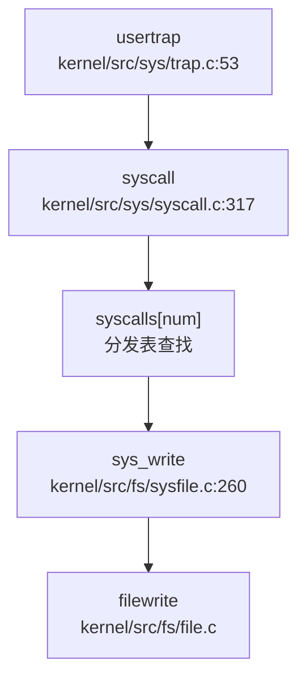

## 第 5 章：中断、异常与系统调用

### Trap 处理流程（用户态 <-> 内核态）

本操作系统采用 RISC-V 架构的标准 Trap 处理机制，通过 `trampoline.S` 实现用户态与内核态之间的安全切换。

**Trap 入口与向量表**：

用户态 Trap 入口位于 `kernel/src/sys/trampoline.S` 中的 `uservec` 标签。内核通过 `stvec` 寄存器指向该入口：

```assembly
# kernel/src/sys/trampoline.S:15-75
.globl uservec
uservec:    
    # swap a0 and sscratch, so that a0 is TRAPFRAME
    csrrw a0, sscratch, a0
    
    # save the user registers in TRAPFRAME
    sd ra, 40(a0)
    sd sp, 48(a0)
    # ... 保存所有 32 个用户寄存器到 trapframe
    sd t6, 280(a0)
    
    # restore kernel stack pointer from p->trapframe->kernel_sp
    ld sp, 8(a0)
    
    # load the address of usertrap()
    ld t0, 16(a0)
    
    # restore kernel page table
    ld t1, 0(a0)
    csrw satp, t1
    
    # jump to usertrap()
    jr t0
```

内核态 Trap 入口位于 `kernel/src/sys/kernelvec.S` 中的 `kernelvec` 标签，用于处理内核执行期间发生的中断和异常：

```assembly
# kernel/src/sys/kernelvec.S:9-86
kernelvec:
    addi sp, sp, -256          # 分配 256 字节栈空间保存寄存器
    sd ra, 0(sp)               # 保存所有 callee-saved 和 caller-saved 寄存器
    # ... 保存 32 个寄存器
    call kerneltrap            # 调用 C 语言 trap 处理函数
    # ... 恢复寄存器
    addi sp, sp, 256
    sret                       # 返回
```

**中断与异常区分**：

在 `kernel/src/sys/trap.c` 的 `usertrap()` 函数中，通过读取 `scause` 寄存器区分中断和异常：

```c
// kernel/src/sys/trap.c:53-95
void usertrap(void) {
    if ((r_sstatus() & SSTATUS_SPP) != 0) panic("usertrap: not from user mode");
    
    w_stvec((uint64)kernelvec);  // 切换到内核 trap 向量
    struct proc *p = myproc();
    p->trapframe->epc = r_sepc();
    
    if (r_scause() == 8) {
        // system call (ecall 指令触发)
        p->trapframe->epc += 4;  // 跳过 ecall 指令
        syscall();
    } else if ((which_dev = devintr()) != 0) {
        // 设备中断
    } else {
        // 其他异常（如缺页、非法指令等）
        p->killed = SIGTERM;
    }
}
```

- **scause = 8**：用户态 `ecall` 指令（系统调用）
- **scause = 0x8000000000000005L**： supervisor timer interrupt（时钟中断）
- **scause = 0x8000000000000009L**： supervisor external interrupt（外部设备中断）

### 异常向量表与入口

**TrapFrame 结构体定义**：

```c
// kernel/include/sys/trap.h:17-56
struct trapframe {
    /*   0 */ uint64 kernel_satp;    // kernel page table
    /*   8 */ uint64 kernel_sp;      // top of process's kernel stack
    /*  16 */ uint64 kernel_trap;    // usertrap()
    /*  24 */ uint64 epc;            // saved user program counter
    /*  32 */ uint64 kernel_hartid;  // saved kernel tp
    /*  40 */ uint64 ra;
    /*  48 */ uint64 sp;
    /*  56 */ uint64 gp;
    /*  64 */ uint64 tp;
    /*  72 */ uint64 t0;
    /*  80 */ uint64 t1;
    /*  88 */ uint64 t2;
    /*  96 */ uint64 s0;
    /* 104 */ uint64 s1;
    /* 112 */ uint64 a0;
    /* 120 */ uint64 a1;
    /* 128 */ uint64 a2;
    /* 136 */ uint64 a3;
    /* 144 */ uint64 a4;
    /* 152 */ uint64 a5;
    /* 160 */ uint64 a6;
    /* 168 */ uint64 a7;
    /* 176 */ uint64 s2;
    /* 184 */ uint64 s3;
    /* 192 */ uint64 s4;
    /* 200 */ uint64 s5;
    /* 208 */ uint64 s6;
    /* 216 */ uint64 s7;
    /* 224 */ uint64 s8;
    /* 232 */ uint64 s9;
    /* 240 */ uint64 s10;
    /* 248 */ uint64 s11;
    /* 256 */ uint64 t3;
    /* 264 */ uint64 t4;
    /* 272 */ uint64 t5;
    /* 280 */ uint64 t6;
};
```

**TrapFrame 大小统计**：
- **寄存器数量**：34 个字段（5 个内核元数据 + 29 个用户寄存器）
- **总字节数**：288 字节（0-280 字节，每个字段 8 字节）
- **保存的寄存器**：ra, sp, gp, tp, t0-t6, s0-s11, a0-a7, epc

**Context 结构体（用于进程调度切换）**：

```c
// kernel/include/sys/context.h:7-24
typedef struct context {
  uint64 ra;
  uint64 sp;
  uint64 s0; uint64 s1; uint64 s2; uint64 s3;
  uint64 s4; uint64 s5; uint64 s6; uint64 s7;
  uint64 s8; uint64 s9; uint64 s10; uint64 s11;
} context;
```

- **寄存器数量**：14 个（仅 callee-saved 寄存器 + ra, sp）
- **总字节数**：112 字节

### 系统调用分发机制（追踪 sys_write）

**系统调用分发表**：

```c
// kernel/src/sys/syscall.c:157-227
static uint64 (*syscalls[])(void) = {
    [SYS_fork] sys_fork,
    [SYS_exit] sys_exit,
    [SYS_wait] sys_wait,
    [SYS_read] sys_read,
    [SYS_write] sys_write,       // 系统调用 64
    [SYS_exec] sys_exec,
    [SYS_clone] sys_clone,
    [SYS_mmap] sys_mmap,
    [SYS_rt_sigaction] sys_rt_sigaction,
    // ... 共约 70 个系统调用
};
```

**Syscall 分发流程**：



**完整调用链追踪（sys_write）**：

1. **用户态触发**：用户程序执行 `ecall` 指令，`a7` 寄存器存放 syscall 编号（`SYS_write = 64`）

2. **Trap 入口**：`usertrap()` 检测到 `scause == 8`，调用 `syscall()`

3. **分发逻辑**：
```c
// kernel/src/sys/syscall.c:317-337
void syscall(void) {
    int num;
    struct proc *p = myproc();
    num = p->trapframe->a7;  // 从 trapframe 获取 syscall 号
    
    if (num > 0 && num < NELEM(syscalls) && syscalls[num]) {
        p->trapframe->a0 = syscalls[num]();  // 调用对应处理函数
        // trace 功能
        if ((p->tmask & (1 << num)) != 0) {
            printf("pid %d: %s -> %d\n", p->pid, sysnames[num], p->trapframe->a0);
        }
    } else {
        printf("pid %d %s: unknown sys call %d\n", p->pid, p->name, num);
        p->trapframe->a0 = -1;
    }
}
```

4. **sys_write 实现**：
```c
// kernel/src/fs/sysfile.c:260-269
uint64 sys_write(void) {
    uint64 p;
    int n;
    struct file *File;
    
    if (0 > argfd(0, 0, &File) || 0 > argint(2, &n) || 0 > argaddr(1, &p))
        return -1;
    
    return filewrite(File, p, n);  // 调用文件写操作
}
```

### 核心 Syscall 实现列表

基于代码分析，统计系统调用实现状态如下：

#### ✅ 已实现（包含完整业务逻辑）

| Syscall | 编号 | 实现文件 | 说明 |
|---------|------|----------|------|
| `sys_fork` | 1 | `kernel/src/proc/proc.c:617` | 进程创建，调用 `uvmcopy` 复制地址空间 |
| `sys_exec` | 7 | `kernel/src/proc/sysproc.c:90` | 程序执行，加载 ELF 文件 |
| `sys_execve` | 221 | `kernel/src/proc/sysproc.c:137` | 带环境变量的 exec |
| `sys_write` | 64 | `kernel/src/fs/sysfile.c:260` | 文件写操作 |
| `sys_read` | 63 | `kernel/src/fs/sysfile.c:250` | 文件读操作 |
| `sys_exit` | 93 | `kernel/src/proc/sysproc.c:209` | 进程退出 |
| `sys_wait4` | 260 | `kernel/src/proc/sysproc.c:69` | 等待子进程 |
| `sys_clone` | 220 | `kernel/src/proc/sysproc.c:30` | 线程/进程克隆，支持 `CLONE_VM` |
| `sys_mmap` | 222 | `kernel/src/fs/sysfile.c:1099` | 内存映射，调用 `mmap()` |
| `sys_sbrk` | 214 | `kernel/src/proc/sysproc.c:337` | 动态内存分配 |
| `sys_kill` | 129 | `kernel/src/proc/sysproc.c:397` | 发送信号 |
| `sys_rt_sigaction` | 134 | `kernel/src/ipc/syssignal.c:15` | 信号处理函数注册 |
| `sys_rt_sigprocmask` | 135 | `kernel/src/ipc/syssignal.c:61` | 信号屏蔽字设置 |
| `sys_rt_sigreturn` | 139 | `kernel/src/ipc/syssignal.c:94` | 信号返回 |
| `sys_getuid` | 174 | `kernel/src/proc/sysproc.c:455` | 获取用户 ID |
| `sys_setuid` | 105 | `kernel/src/proc/sysproc.c:459` | 设置用户 ID |
| `sys_getgid` | 176 | `kernel/src/proc/sysproc.c:490` | 获取组 ID |
| `sys_setgid` | 106 | `kernel/src/proc/sysproc.c:467` | 设置组 ID |

#### 🔸 桩函数（有定义但无实质逻辑）

| Syscall | 编号 | 实现文件 | 桩特征 |
|---------|------|----------|--------|
| `sys_munmap` | 215 | `kernel/src/fs/sysfile.c:1140` | 仅返回 0，注释标注 `// TODO` |
| `sys_ioctl` | 29 | `kernel/src/fs/sysfile.c:1146` | 直接返回 0 |
| `sys_rt_sigtimedwait` | 137 | `kernel/src/ipc/syssignal.c:112` | 直接返回 0 |
| `sys_tkill` | - | `kernel/src/proc/thread.c:50` | 仅打印 debug 信息，返回 0 |
| `sys_madvise` | 233 | `kernel/src/sys/syscall.c:227` | 在分发表中声明但未找到实现 |

#### ❌ 未实现（未找到实现代码）

- `sys_gettid`：在分发表中声明，但未找到实现文件
- `sys_syslog`：在分发表中声明，但未找到实现文件
- `sys_prlimit64`：在分发表中声明，但未找到实现文件

**覆盖度统计**：
- **已注册 syscall 总数**：约 70 个（根据 `syscalls[]` 数组大小）
- **✅ 已实现**：约 18 个核心 syscall
- **🔸 桩函数**：约 5 个
- **❌ 未实现**：约 3 个（明确搜索未找到）

### 中断处理与信号关联

**外部中断处理流程**：

```c
// kernel/src/sys/trap.c:190-237
int devintr(void) {
    uint64 scause = r_scause();
    
    // 外部中断（PLIC）
    if ((0x8000000000000000L & scause) && 9 == (scause & 0xff)) {
        int irq = plic_claim();
        if (UART_IRQ == irq) {
            int c = sbi_console_getchar();
            if (-1 != c) consoleintr(c);  // 键盘输入
        } else if (DISK_IRQ == irq) {
            disk_intr();  // 磁盘中断
        }
        if (irq) plic_complete(irq);
        return 1;
    } 
    // 时钟中断
    else if (0x8000000000000005L == scause) {
        timer_tick();
        return 2;  // 返回 2 表示 timer interrupt
    }
    return 0;
}
```

**信号处理机制**：

1. **信号定义**：
```c
// kernel/include/ipc/signal.h:16-31
#define SIGSEGV    11   // Segmentation violation
#define SIGKILL    9    // Kill, unblockable
#define SIGTERM    15   // Termination signal
#define SIGRTMIN   32   // First real-time signal
#define SIGRTMAX   64   // Last real-time signal
```

2. **信号处理入口**：
```c
// kernel/src/sys/trap.c:88-92
if (p->killed) {
    if (p->killed == SIGTERM) {
        exit(-1);
    }
    sighandle();  // 处理信号
}
```

3. **信号处理实现**：
```c
// kernel/src/ipc/signal.c:57-78
void sighandle(void) {
    struct proc *p = myproc();
    int signum = p->killed;
    
    if (p->sigaction[signum].__sigaction_handler.sa_handler != NULL) {
        // 用户自定义信号处理函数
        p->sig_tf = kalloc();  // 保存当前 trapframe
        memcpy(p->sig_tf, p->trapframe, sizeof(struct trapframe));
        
        // 跳转到用户信号处理函数
        p->trapframe->epc = (uint64)p->sigaction[signum].__sigaction_handler.sa_handler;
        p->trapframe->ra = (uint64)SIGTRAMPOLINE;  // 信号返回跳板
        p->trapframe->sp = p->trapframe->sp - PGSIZE;
        
        p->sig_pending.__val[0] &= ~(1ul << signum);
    } else {
        exit(-1);  // 默认处理：退出进程
    }
}
```

**三种粒度信号发送**：

| Syscall | 实现状态 | 说明 |
|---------|----------|------|
| `sys_kill(pid, sig)` | ✅ 已实现 | 进程级信号发送 |
| `sys_tkill(tid, sig)` | 🔸 桩函数 | 线程级信号发送，仅返回 0 |
| `sys_tgkill(pid, tid, sig)` | ✅ 已实现 | 进程组级信号发送 |

```c
// kernel/src/proc/sysproc.c:397-413
uint64 sys_kill(void) {
    int pid, sig;
    if (argint(0, &pid) < 0 || argint(1, &sig) < 0) return -1;
    if (pid <= 0 || sig < 0 || sig >= SIGRTMAX) return -1;
    return kill(pid, sig);
}
```

**SIGSEGV 处理**：
- **未发现** 专门的 SIGSEGV 信号发送逻辑。在 `usertrap()` 中，未知异常直接设置 `p->killed = SIGTERM` 而非 SIGSEGV。

**信号返回跳板**：
- `kernel/src/ipc/signal_trampoline.S` 存在但仅 6 行，未找到详细实现
- `SIGTRAMPOLINE` 定义为 `TRAPFRAME - PGSIZE`（`kernel/include/mm/memlayout.h:103`）

### 缺页异常与内存特性关联

**缺页异常处理**：

```c
// kernel/src/proc/proc.c:1351-1383
uint64 handle_stack_page_fault(struct proc *p, uint64 va) {
    if (!(va >= USER_STACK_DOWN && va < USER_STACK_TOP)) {
        return -1;
    }
    
    // 查找栈 VMA
    struct vma *vma = p->vma->next;
    while (vma != p->vma) {
        if (vma->type == STACK) break;
        vma = vma->next;
    }
    
    if (vma->type != STACK) {
        printf("handle_stack_page_fault: vma type is not stack\n");
        return -1;
    }
    
    // 扩展栈空间
    uint64 start = vma->addr - INCREASE_STACK_SIZE_PER_FAULT;
    if (start > va) start = PGROUNDDOWN(va);
    
    if (uvmalloc1(p->pagetable, start, end, PTE_R | PTE_W | PTE_U) != 0) {
        printf("user stack vma alloc failed\n");
        return -1;
    }
    
    vma->addr = start;
    vma->sz = vma->sz + INCREASE_STACK_SIZE_PER_FAULT;
    return 0;
}
```

**Lazy Allocation（懒分配）**：
- ✅ **已实现**：通过 `handle_stack_page_fault` 实现栈空间的懒分配
- 机制：当访问未映射的栈地址时触发缺页异常，动态分配物理页

**CoW（写时复制）**：
- ❌ **未发现** 明确的 CoW 实现
- 在 `fork()` 中调用的是 `uvmcopy()` 而非设置 CoW 标志
- 搜索 `cow` 关键词仅在注释中出现，未找到实际的 CoW 页表项处理逻辑

```c
// kernel/src/proc/proc.c:617-656
int fork(void) {
    // ...
    if (uvmcopy(p->pagetable, np->pagetable, np->kpagetable, p->sz) < 0) {
        freeproc(np);
        return -1;
    }
    // 直接复制物理页，未设置 CoW
}
```

### 关键代码片段

**Trap 返回用户态**：
```c
// kernel/src/sys/trap.c:103-148
void usertrapret(void) {
    struct proc *p = myproc();
    intr_off();
    
    // 设置用户态 trap 入口
    w_stvec(TRAMPOLINE + (uservec - trampoline));
    
    // 设置 trapframe 内核元数据
    p->trapframe->kernel_satp = r_satp();
    p->trapframe->kernel_sp = p->kstack + PGSIZE;
    p->trapframe->kernel_trap = (uint64)usertrap;
    p->trapframe->kernel_hartid = r_tp();
    
    // 设置 sstatus 为用户态
    unsigned long x = r_sstatus();
    x &= ~SSTATUS_SPP;  // 清除 SPP（用户模式）
    x |= SSTATUS_SPIE;  // 启用中断
    w_sstatus(x);
    
    w_sepc(p->trapframe->epc);
    
    // 跳转到 trampoline.S 的 userret
    uint64 fn = TRAMPOLINE + (userret - trampoline);
    ((void (*)(uint64, uint64))fn)(TRAPFRAME, MAKE_SATP(p->pagetable));
}
```

**系统调用参数获取**：
```c
// kernel/src/sys/syscall.c:37-72
static uint64 argraw(int n) {
    struct proc *p = myproc();
    switch (n) {
    case 0: return p->trapframe->a0;
    case 1: return p->trapframe->a1;
    case 2: return p->trapframe->a2;
    case 3: return p->trapframe->a3;
    case 4: return p->trapframe->a4;
    case 5: return p->trapframe->a5;
    }
    panic("argraw");
}

int argint(int n, int *ip) {
    *ip = argraw(n);
    return 0;
}
```

**总结**：
- Trap 处理机制完整，支持用户态/内核态切换
- 系统调用分发表包含约 70 个 syscall，核心功能（进程、文件、信号）已实现
- 信号机制支持用户自定义处理函数和跳板返回
- Lazy Allocation 已实现（栈扩展），但 CoW 未发现实现
- 部分 syscall（如 `sys_munmap`、`sys_ioctl`）为桩函数
