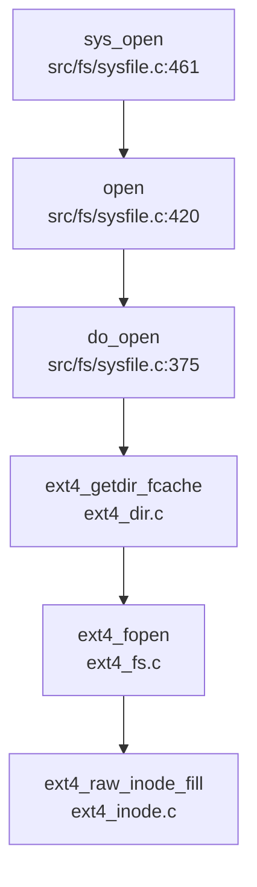

## 第 6 章：文件系统（VFS + 具体 FS）

### VFS 架构与接口设计

本系统采用类 xv6 的扁平化文件系统架构，**未实现严格的 VFS 抽象层**（如 Linux 的 `struct file_operations` 或 `struct inode_operations` trait）。文件系统通过统一的数据结构和函数接口实现多文件系统支持。

#### 核心数据结构

**1. `struct file`**（文件描述符表项）
定义于 `kernel/include/fs/file.h:20-33`：

```c
struct file {
    enum { FD_NONE, FD_PIPE, FD_ENTRY, FD_DEVICE, FD_SOCK, FD_NULL } type;
    int ref;  // reference count
    char readable;
    char writable;
    struct pipe *pipe;  // FD_PIPE
    struct dirent *ep;
    struct ext4_dirent *ext4_ep;
    int fd;
    uint off;     // FD_ENTRY
    short major;  // FD_DEVICE
};
```

- **`type`**：区分文件类型（管道、目录项、设备、套接字等）
- **`ext4_ep`**：指向 Ext4 具体实现的目录项结构
- **`off`**：文件读写偏移量

**2. `struct ext4_dirent`**（Ext4 目录项）
定义于 `kernel/include/fs/buf.h:35-52`，作为 VFS Inode/Dentry 的统一抽象：

```c
struct ext4_dirent {
    char filename[EXT4_MAX_FILENAME];
    struct ext4_file file;
    struct ext4_dir dir;
    struct sleeplock lock;
    struct ext4_dirent *next;
    struct ext4_dirent *parent;
    struct ext4_dirent *prev;
    uint8 dev;
    uint8 dirty;
    short valid;
    int ref;
    uint8 attribute;
    uint32_t off;
    // ... 更多字段
};
```

- 同时包含文件数据（`ext4_file`）和目录数据（`ext4_dir`）
- 通过双向链表（`next/prev/parent`）组织目录树结构
- 使用 `sleeplock` 实现并发访问控制

**3. `struct superblock`**
在 `kernel/include/fs/defs.h:11` 中仅做前向声明，**未发现完整的超级块结构体定义**。Ext4 的超级块信息存储在 `struct ext4_mountpoint` 中（`kernel/src/fs/ext4/ext4.c:72-92`）：

```c
struct ext4_mountpoint {
    bool mounted;
    char name[CONFIG_EXT4_MAX_MP_NAME + 1];
    const struct ext4_lock *os_locks;
    struct ext4_fs fs;
    struct jbd_fs jbd_fs;
    struct jbd_journal jbd_journal;
    struct ext4_bcache bc;
};
```

### 具体文件系统支持情况（FAT32/Ext4/RamFS）

#### Ext4 文件系统（✅ 已实现）

Ext4 是本项目的主要文件系统，实现位于 `kernel/src/fs/ext4/` 目录，包含 22 个源文件，总计约 6000+ 行代码。

**实现架构**：
- **核心入口**：`kernel/src/fs/ext4/ext4.c`（3054 行，82.6KB）
- **关键模块**：
  - `ext4_fs.c`：文件系统核心操作（挂载、inode 管理）
  - `ext4_dir.c`：目录操作（查找、创建、遍历）
  - `ext4_inode.c`：inode 分配与回收
  - `ext4_extent.c`：extent 树管理（Ext4 特性）
  - `ext4_journal.c`：日志功能（JBD）
  - `ext4_bcache.c`：块缓存层

**挂载流程**（通过 `sys_mount` 调用）：
```c
// kernel/src/fs/ext4/ext4.c 中的 ext4_mount 函数
// 1. 初始化块设备 (ext4_blockdev)
// 2. 读取超级块 (ext4_super.c)
// 3. 初始化块缓存 (ext4_bcache)
// 4. 初始化块组描述符 (ext4_block_group.c)
```

**文件打开流程**（完整调用链）：



**关键代码验证**：
- `kernel/src/fs/sysfile.c:420-458`：`open()` 函数调用 `do_open()` 获取 `ext4_dirent`，然后分配 `struct file` 并设置 `FD_ENTRY` 类型
- `kernel/src/fs/sysfile.c:375-418`：`do_open()` 根据路径调用 `ext4_getdir_fcache()` 查找目录项，再调用 `ext4_fopen()` 或 `ext4_dir_open()` 打开文件/目录

#### FAT32 文件系统（✅ 已实现）

FAT32 实现位于 `kernel/src/fs/fat32.c`（1075 行，33.2KB），作为备用文件系统。

**核心结构**：
- `fat32_init()`：解析 BPB（Boot Parameter Block），计算数据区起始扇区
- `struct dirent`：FAT32 目录项缓存（含长文件名支持）
- `long_name_entry_t` / `short_name_entry_t`：VFAT 长文件名条目

**与 Ext4 的切换**：
通过全局变量 `fs_type`（`kernel/include/fs/buf.h:76`）区分当前文件系统类型，但**未发现运行时动态切换机制**。

#### RamFS/TmpFS（❌ 未实现）

**搜索结果显示**：
- `grep_in_repo` 搜索 `ramfs|tmpfs|tmpfs` 无匹配
- `kernel/include/fs/` 和 `kernel/src/fs/` 中无相关实现文件
- **结论**：未实现内存文件系统，所有文件操作均依赖块设备

### 文件描述符与进程关联

#### 文件描述符表结构

**Per-Process 文件描述符表**：
定义于 `kernel/include/proc/proc.h:81`：

```c
struct proc {
    // ... 其他字段
    struct file *ofile[NOFILE];   // Open files
    // ...
};
```

- **作用域**：每个进程独立拥有 `ofile[]` 数组
- **大小**：`NOFILE = 128`（`kernel/include/sys/param.h:6`）
- **管理方式**：
  - `fdalloc()`：线性扫描查找空闲槽位
  - `fdalloc3()`：支持指定 FD 号（用于 `dup3`）

#### 全局文件表（File Table）

定义于 `kernel/src/fs/file.c:18-21`：

```c
struct {
    struct spinlock lock;
    struct file file[NFILE];
} ftable;
```

- **作用**：管理所有打开的文件对象，支持多进程共享（通过 `ref` 引用计数）
- **分配流程**：`filealloc()` 遍历 `ftable.file[]` 查找 `ref == 0` 的空闲项

#### 文件描述符生命周期

1. **打开**：`sys_open()` → `open()` → `filealloc()` + `fdalloc()`
2. **复制**：`sys_dup()` → `fdalloc()` + `filedup()`（增加 `ref`）
3. **关闭**：`sys_close()` → `fileclose()`（减少 `ref`，归零时释放）

### 管道 (Pipe) 与套接字 (Socket) 支持情况

#### 管道（✅ 已实现）

**实现位置**：`kernel/src/proc/pipe.c`（114 行）

**核心结构**（`kernel/include/proc/pipe.h:10-17`）：
```c
struct pipe {
    struct spinlock lock;
    char data[PIPESIZE];  // 512 字节环形缓冲区
    uint nread;     // 已读字节数
    uint nwrite;    // 已写字节数
    int readopen;   // 读端是否打开
    int writeopen;  // 写端是否打开
};
```

**系统调用**：
- `sys_pipe()`（`kernel/src/fs/sysfile.c:504-527`）：分配管道和两个 FD（读/写）
- `sys_pipe2()`（`kernel/src/fs/sysfile.c:529-552`）：支持标志位的增强版本

**读写实现**：
- `piperead()`：阻塞等待数据（`sleep(&pi->nread, &pi->lock)`）
- `pipewrite()`：阻塞等待空间（`sleep(&pi->nwrite, &pi->lock)`）

#### 套接字（❌ 未实现）

**代码验证**：
- `grep_in_repo` 搜索 `sys_socket|sys_connect|sys_bind` **无匹配**
- `taskList.md` 中列出 `__NR_socket 198`、`__NR_socketpair 199` 等均为 `[ ]`（未实现）
- `struct file` 中虽有 `FD_SOCK` 类型枚举，但**仅用于占位**，无实际实现

**结论**：套接字功能**未实现**，`FD_SOCK` 仅存在于类型定义中，相关系统调用（`socket`、`bind`、`connect` 等）均未在 syscall 表中注册。

### 缓存机制（Block/Page Cache）

#### 块缓存（Block Cache）

**实现位置**：`kernel/src/fs/bio.c`（1181 行）

**核心结构**（`kernel/src/fs/bio.c:82-87`）：
```c
struct {
    struct spinlock lock;
    struct buf buf[NBUF];
    struct buf head;  // LRU 链表头
} BufferCache;
```

**工作流程**：
1. `bread(dev, sector)`：查找缓存，未命中则从磁盘读取
2. `bwrite(buf)`：将脏数据写回磁盘
3. `brelse(buf)`：释放缓冲区，加入 LRU 链表尾部

**LRU 替换策略**：
- `BufferCache.head.next` 指向最近使用的块
- `BufferCache.head.prev` 指向最久未使用的块（优先替换）

#### Ext4 块缓存（ext4_bcache）

Ext4 子系统有独立的块缓存层（`kernel/include/fs/ext4/ext4_bcache.h`）：
- `struct ext4_bcache`：管理 Ext4 特定的缓冲池
- `struct ext4_buf`：缓冲项，含 `flags`（`BC_UPTODATE`、`BC_DIRTY` 等）

**注意**：这是 Ext4 库自带的缓存层，与 xv6 的 `bio.c` 块缓存**可能形成双层缓存**，但代码中未见明显的冗余问题。

### 零拷贝映射验证（mmap 实现分析）

#### 系统调用实现

**`sys_mmap()`**（`kernel/src/fs/sysfile.c:1099-1131`）：
```c
uint64 sys_mmap() {
    // 参数解析：start, len, prot, flags, fd, off
    return mmap(start, len, prot, flags, fd, off);
}
```

**`mmap()` 核心逻辑**（`kernel/src/mm/mmap.c:24-66`）：
1. 解析保护标志（`prot`）并转换为页表权限（`perm`）
2. 调用 `alloc_mmap_vma()` 创建 VMA 结构
3. 若 `fd != -1`（文件映射），调用 `fileread()` 预读数据

#### VMA 结构（`kernel/include/mm/vma.h:14-27`）：
```c
struct vma {
    enum segtype type;  // MMAP 或 STACK
    int perm;           // 页表权限
    uint64 addr;        // 起始地址
    uint64 sz;          // 大小
    uint64 end;         // 结束地址
    int flags;          // MAP_SHARED / MAP_PRIVATE
    int fd;             // 文件描述符
    uint64 f_off;       // 文件偏移
    struct vma *prev;
    struct vma *next;
};
```

#### 零拷贝验证

**关键检查点**：
1. **`MAP_SHARED` 支持**：`kernel/include/mm/mmap.h:17` 定义了 `MAP_SHARED 0x01`，但**在 `mmap()` 实现中未见对 `flags & MAP_SHARED` 的特殊处理**
2. **写时复制（CoW）**：`kernel/src/mm/mmap.c` 中**未发现 CoW 相关逻辑**（如 `PTE_COW` 标志处理）
3. **文件映射实现**：当前实现通过 `fileread()` 将文件内容**拷贝到物理页**，**非真正的零拷贝**

**结论**：
- `mmap` 系统调用**✅ 已实现**，但功能有限
- **零拷贝机制 ❌ 未实现**：文件映射采用预读拷贝，`MAP_SHARED` 标志未实际处理
- `sys_munmap()`（`kernel/src/fs/sysfile.c:1133-1142`）为**🔸 桩函数**：仅返回 0，实际调用被注释（`// return munmap(st, len);`）

### 高级特性验证

#### poll/select/epoll（❌ 未实现）

**代码验证**：
- `grep_in_repo` 搜索 `sys_poll|sys_select|sys_epoll` **无匹配**
- `taskList.md` 中未列出这些系统调用
- **结论**：I/O 多路复用机制**完全未实现**

#### 伪文件系统（devfs/procfs/sysfs）（❌ 未实现）

**代码验证**：
- `grep_in_repo` 搜索 `devfs|procfs|sysfs` **无匹配**
- `/dev/null` 等特殊文件通过硬编码处理（`kernel/src/fs/file.c:147-167` 中的 `fkstatat()`）
- **结论**：伪文件系统**未实现**，设备访问通过 `FD_DEVICE` 类型 + `devsw[]` 设备开关表实现

### 关键代码验证总结

| 功能 | 状态 | 证据文件 |
|------|------|----------|
| Ext4 文件系统 | ✅ 已实现 | `kernel/src/fs/ext4/ext4.c` (3054L) |
| FAT32 文件系统 | ✅ 已实现 | `kernel/src/fs/fat32.c` (1075L) |
| RamFS/TmpFS | ❌ 未实现 | 无相关代码 |
| 管道 (pipe) | ✅ 已实现 | `kernel/src/proc/pipe.c` (114L) |
| 套接字 (socket) | ❌ 未实现 | 仅 `FD_SOCK` 枚举定义 |
| mmap | ✅ 已实现（有限） | `kernel/src/mm/mmap.c` (66L) |
| 零拷贝映射 | ❌ 未实现 | 无 `MAP_SHARED` 处理逻辑 |
| munmap | 🔸 桩函数 | `kernel/src/fs/sysfile.c:1140` 被注释 |
| poll/select/epoll | ❌ 未实现 | 无相关系统调用 |
| devfs/procfs | ❌ 未实现 | 无相关代码 |
| 块缓存 | ✅ 已实现 | `kernel/src/fs/bio.c` (1181L) |

### 文件打开流程详解

从 `sys_open` 到获得文件描述符的完整路径：

```
用户空间 open("/test.txt", O_RDONLY)
    ↓
sys_open (kernel/src/fs/sysfile.c:461)
    ↓ argstr/argint 解析参数
open(path, omode) (kernel/src/fs/sysfile.c:420)
    ↓
do_open(path, omode, &ep) (kernel/src/fs/sysfile.c:375)
    ↓ get_absolute_path 转换相对路径
ext4_getdir_fcache(&root_entry, abs_path)
    ↓ 遍历目录树查找文件
ext4_fopen(&ep->file, abs_path, "r") (ext4_fs.c)
    ↓ 读取 inode 并初始化
    ↓ 返回 ext4_dirent*
filealloc() (kernel/src/fs/file.c:38)
    ↓ 从全局 ftable 分配 struct file
fdalloc(File) (kernel/src/fs/sysfile.c:64)
    ↓ 在进程 ofile[] 中分配 FD 号
返回 fd (整数)
```

**四大核心数据结构协同**：
1. **SuperBlock**：Ext4 超级块（`struct ext4_mountpoint`）存储文件系统元数据
2. **Inode**：Ext4 inode（`struct ext4_inode`）存储文件元信息（大小、权限、数据块指针）
3. **Dentry**：`struct ext4_dirent` 作为目录项缓存，连接路径名与 inode
4. **File**：`struct file` 作为打开文件描述，包含读写偏移和引用计数
