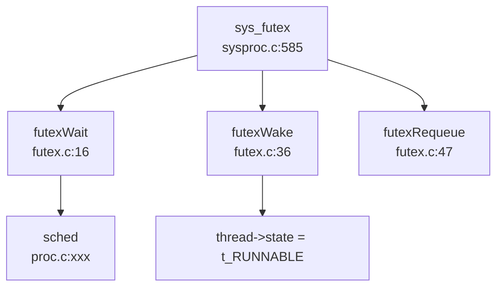

## 第 8 章：同步互斥与进程间通信

### 同步与互斥原语（锁与原子操作）

本操作系统实现了两种核心锁机制：**SpinLock（自旋锁）** 和 **SleepLock（睡眠锁）**，分别适用于短临界区和长临界区的互斥保护。

#### SpinLock 实现

**文件路径**: `kernel/include/utils/spinlock.h`, `kernel/src/utils/spinlock.c`

`struct spinlock` 结构体定义：
```c
struct spinlock {
    uint locked;       // Is the lock held?
    char *name;        // Name of lock
    struct cpu *cpu;   // The cpu holding the lock
};
```

**原子操作实现**:
- 使用 GCC 内置函数 `__sync_lock_test_and_set()` 和 `__sync_lock_release()`
- 在 RISC-V 架构下编译为 `amoswap.w.aq` 原子交换指令
- 配合 `__sync_synchronize()` 内存屏障确保指令顺序

```c
// kernel/src/utils/spinlock.c:19-35
void acquire(struct spinlock *lk) {
    push_off();  // disable interrupts to avoid deadlock
    if (holding(lk)) panic("acquire");
    
    // On RISC-V, sync_lock_test_and_set turns into an atomic swap:
    //   a5 = 1; s1 = &lk->locked; amoswap.w.aq a5, a5, (s1)
    while (__sync_lock_test_and_set(&lk->locked, 1) != 0)
        ;
    
    __sync_synchronize();  // memory fence
    lk->cpu = mycpu();
}
```

**✅ 已实现**: SpinLock 具备完整的 acquire/release 语义，包含：
- 中断禁用 (`push_off()`) 防止死锁
- 自旋等待直到锁可用
- 内存屏障防止指令重排
- 调试信息（持有锁的 CPU 记录）

#### SleepLock 实现

**文件路径**: `kernel/include/utils/sleeplock.h`, `kernel/src/utils/sleeplock.c`

`struct sleeplock` 结构体定义：
```c
struct sleeplock {
    uint locked;         // Is the lock held?
    struct spinlock lk;  // spinlock protecting this sleep lock
    char *name;          // Name of lock
    int pid;             // Process holding lock
};
```

**实现原理**:
- SleepLock 内部嵌套一个 SpinLock 保护其状态
- 获取锁失败时调用 `sleep()` 将进程挂起，而非自旋
- 适用于持有时间较长的临界区（如文件系统操作）

```c
// kernel/src/utils/sleeplock.c:17-26
void acquiresleep(struct sleeplock *lk) {
    acquire(&lk->lk);
    while (lk->locked) {
        sleep(lk, &lk->lk);  // 释放 lk->lk 并进入睡眠
    }
    lk->locked = 1;
    lk->pid = myproc()->pid;
    release(&lk->lk);
}
```

**✅ 已实现**: SleepLock 完整实现，支持进程阻塞/唤醒机制。

---

### 等待队列实现机制

本系统**未实现显式的 WaitQueue 结构体**，而是通过 `sleep()` / `wakeup()` 机制实现等待队列功能。

**文件路径**: `kernel/src/proc/proc.c`

#### sleep() 函数实现

```c
// kernel/src/proc/proc.c:958-983
void sleep(void *chan, struct spinlock *lk) {
    struct proc *p = myproc();
    
    if (&p->lock != lk) {
        acquire(&p->lock);
        release(lk);
    }
    
    p->state = SLEEPING;
    p->chan = chan;           // 记录睡眠通道
    p->main_thread->state = t_RUNNABLE;
    sched();                  // 让出 CPU
    
    // 唤醒后清理
    p->chan = 0;
    if (&p->lock != lk) {
        release(&p->lock);
        acquire(lk);
    }
}
```

#### wakeup() 函数实现

```c
// kernel/src/proc/proc.c:988-1000
void wakeup(void *chan) {
    for (struct proc *p = proc; &proc[NPROC] > p; ++p) {
        acquire(&p->lock);
        if (p->chan == chan && p->state == SLEEPING) {
            p->state = RUNNABLE;  // 唤醒匹配通道的进程
        }
        release(&p->lock);
    }
}
```

**实现特点**:
- 使用 `chan` (channel) 地址作为等待队列的标识
- `wakeup()` 遍历所有进程，唤醒在同一 `chan` 上睡眠的进程
- **❌ 未实现**: 没有独立的 WaitQueue 数据结构，效率较低（O(N) 遍历）

---

### 进程间通信（Pipe/MsgQueue/Sem）

#### 管道 (Pipe) - ✅ 已实现

**文件路径**: `kernel/include/proc/pipe.h`, `kernel/src/proc/pipe.c`

**实现验证**:
- 使用**环形缓冲区 (Ring Buffer)** 实现，缓冲区大小 `PIPESIZE = 512` 字节
- 通过 `nread` / `nwrite` 索引实现循环读写

```c
// kernel/include/proc/pipe.h:8-17
#define PIPESIZE 512

struct pipe {
    struct spinlock lock;
    char data[PIPESIZE];
    uint nread;     // number of bytes read
    uint nwrite;    // number of bytes written
    int readopen;   // read fd is still open
    int writeopen;  // write fd is still open
};
```

**写操作实现** (`pipewrite`):
```c
// kernel/src/proc/pipe.c:71-92
int pipewrite(struct pipe *pi, int user, uint64 addr, int n) {
    acquire(&pi->lock);
    for (i = 0; i < n; i++) {
        while (pi->nwrite == pi->nread + PIPESIZE) {  // 缓冲区满
            if (pi->readopen == 0 || pr->killed) {
                release(&pi->lock);
                return -1;
            }
            wakeup(&pi->nread);
            sleep(&pi->nwrite, &pi->lock);  // 阻塞等待
        }
        pi->data[pi->nwrite++ % PIPESIZE] = ch;  // 环形写入
    }
    wakeup(&pi->nread);
    release(&pi->lock);
    return i;
}
```

**读操作实现** (`piperead`):
```c
// kernel/src/proc/pipe.c:94-113
int piperead(struct pipe *pi, int user, uint64 addr, int n) {
    acquire(&pi->lock);
    while (pi->nread == pi->nwrite && pi->writeopen) {  // 缓冲区空
        sleep(&pi->nread, &pi->lock);
    }
    for (i = 0; i < n; i++) {
        if (pi->nread == pi->nwrite) break;
        ch = pi->data[pi->nread++ % PIPESIZE];  // 环形读取
        if (either_copyout(user, addr + i, &ch, 1) == -1) break;
    }
    wakeup(&pi->nwrite);
    release(&pi->lock);
    return i;
}
```

**✅ 已实现**: 完整的管道机制，包含：
- 环形缓冲区实现
- 阻塞式读写（满时写阻塞，空时读阻塞）
- 读写端关闭检测
- 自旋锁保护并发访问

#### Futex - ✅ 已实现

**文件路径**: `kernel/include/utils/futex.h`, `kernel/src/utils/futex.c`, `kernel/src/proc/sysproc.c`

**系统调用号**: `SYS_futex = 98`

**支持的操作**:
```c
#define FUTEX_WAIT       0
#define FUTEX_WAKE       1
#define FUTEX_REQUEUE    3
#define FUTEX_CMP_REQUEUE 4
```

**Futex 队列实现**:
```c
// kernel/src/utils/futex.c:8-13
typedef struct FutexQueue {
    uint64 addr;
    thread* thread;
    uint8 valid;
} FutexQueue;

FutexQueue futexQueue[FUTEX_COUNT];  // FUTEX_COUNT = 2048
```

**Futex Wait 实现**:
```c
// kernel/src/utils/futex.c:16-34
void futexWait(uint64 addr, thread* th, timespec2_t* ts) {
    for (int i = 0; i < FUTEX_COUNT; i++) {
        if (!futexQueue[i].valid) {
            futexQueue[i].valid = 1;
            futexQueue[i].addr = addr;
            futexQueue[i].thread = th;
            if (ts) {
                th->awakeTime = ts->tv_sec * 1000000 + ts->tv_nsec / 1000;
                th->state = t_TIMING;  // 定时睡眠
            } else {
                th->state = t_SLEEPING;
            }
            acquire(&th->p->lock);
            th->p->state = RUNNABLE;
            sched();  // 让出 CPU
            release(&th->p->lock);
            return;
        }
    }
    panic("No futex Resource!\n");
}
```

**Futex Wake 实现**:
```c
// kernel/src/utils/futex.c:36-45
void futexWake(uint64 addr, int n) {
    for (int i = 0; i < FUTEX_COUNT && n; i++) {
        if (futexQueue[i].valid && futexQueue[i].addr == addr) {
            futexQueue[i].thread->state = t_RUNNABLE;
            futexQueue[i].thread->trapframe->a0 = 0;
            futexQueue[i].valid = 0;
            n--;
        }
    }
}
```

**系统调用入口** (`sys_futex`):
```c
// kernel/src/proc/sysproc.c:585-620
uint64 sys_futex(void) {
    int futex_op, val, val3, userVal;
    uint64 uaddr, timeout, uaddr2;
    // ... 参数解析 ...
    
    switch (futex_op) {
    case FUTEX_WAIT:
        // 检查用户内存值是否匹配
        copyin(p->pagetable, (char *)&userVal, uaddr, sizeof(int));
        if (userVal != val) return -1;
        futexWait(uaddr, myproc()->main_thread, timeout ? &t : 0);
        break;
    case FUTEX_WAKE:
        futexWake(uaddr, val);
        break;
    case FUTEX_REQUEUE:
        futexRequeue(uaddr, val, uaddr2);
        break;
    default:
        panic("Futex type not support!\n");
    }
    return 0;
}
```

**Futex 调用链图**:


**✅ 已实现**: Futex 核心功能完整，但部分高级操作（如 `FUTEX_LOCK_PI`）仅定义未实现。

#### 信号 (Signal) - ✅ 已实现

**文件路径**: `kernel/include/ipc/signal.h`, `kernel/src/ipc/signal.c`, `kernel/src/ipc/syssignal.c`

**支持的信号类型**: 31 种标准信号 + 32 种实时信号 (SIGRTMIN-SIGRTMAX)

**信号处理结构体**:
```c
// kernel/include/ipc/signal.h:52-59
typedef struct sigaction {
    union {
        __sighandler_t sa_handler;  // 信号处理函数
    } __sigaction_handler;
    __sigset_t sa_mask;   // 信号屏蔽字
    int sa_flags;
} sigaction;
```

**进程中的信号字段** (`struct proc`):
```c
// kernel/include/proc/proc.h:87-92
sigaction sigaction[SIGRTMAX + 1];  // 信号处理函数表
__sigset_t sig_set;                 // 信号屏蔽字
__sigset_t sig_pending;             // 待处理信号位图
struct trapframe *sig_tf;           // 信号处理前的 trapframe 备份
```

**信号发送机制** (`kill` / `tgkill`):
```c
// kernel/src/proc/proc.c:1009-1032
int kill(int pid, int sig) {
    for (struct proc *p = proc; &proc[NPROC] > p; ++p) {
        acquire(&p->lock);
        if (pid == p->pid) {
            p->sig_pending.__val[0] |= (1 << (sig));  // 设置待处理位
            if (p->killed == 0 || p->killed > sig) {
                p->killed = sig;
            }
            if (p->state == SLEEPING) {
                p->state = RUNNABLE;  // 唤醒睡眠进程
            }
            release(&p->lock);
            return 0;
        }
        release(&p->lock);
    }
    return 0;
}
```

**信号处理时机**:
- 在 `usertrap()` 中，系统调用返回用户态前检查 `p->killed`
- 如果有待处理信号，调用 `sighandle()` 跳转到用户定义的处理函数

```c
// kernel/src/sys/trap.c:90-93
if (p->killed) {
    if (p->killed == SIGTERM) {
        exit(-1);
    }
    sighandle();  // 处理信号
}
```

**信号处理函数** (`sighandle`):
```c
// kernel/src/ipc/signal.c:57-77
void sighandle(void) {
    struct proc *p = myproc();
    int signum = p->killed;
    
    if (p->sigaction[signum].__sigaction_handler.sa_handler != NULL) {
        p->sig_tf = kalloc();
        memcpy(p->sig_tf, p->trapframe, sizeof(struct trapframe));
        // 修改 epc 跳转到用户信号处理函数
        p->trapframe->epc = (uint64)p->sigaction[signum].__sigaction_handler.sa_handler;
        p->trapframe->ra = (uint64)SIGTRAMPOLINE;
        p->sig_pending.__val[0] &= ~(1ul << signum);
        if (p->sig_pending.__val[0] == 0) {
            p->killed = 0;
        }
    } else {
        exit(-1);  // 默认处理：终止进程
    }
}
```

**系统调用支持**:
- `sys_rt_sigaction`: 注册信号处理函数 ✅
- `sys_rt_sigprocmask`: 设置信号屏蔽字 ✅
- `sys_rt_sigreturn`: 从信号处理返回 ✅
- `sys_tgkill`: 向指定线程组发送信号 ✅
- `sys_rt_sigtimedwait`: **🔸 桩函数** (返回 0 无实现)

```c
// kernel/src/ipc/syssignal.c:111
uint64 sys_rt_sigtimedwait() { return 0; }  // 桩函数
```

**✅ 已实现**: 信号机制核心功能完整，支持：
- 信号发送 (kill/tgkill)
- 信号处理函数注册
- 信号屏蔽
- Trap 返回时处理待处理信号

#### 消息队列 (MessageQueue) - ❌ 未实现

**验证结果**:
- 搜索 `sys_msgget` / `msgsnd` / `msgrcv`：**未找到任何匹配**
- 搜索 `sys_msg` / `sys_sem` / `sys_shm`：**未找到任何匹配**
- `kernel/include/sys/sysnum.h` 中**无消息队列相关系统调用号**

**❌ 未实现**: 消息队列机制完全未实现，仅存在于 POSIX 标准中。

#### 信号量 (Semaphore) - ❌ 未实现

**验证结果**:
- 搜索 `semget` / `semop` / `semaphore` / `Semaphore`：**未找到任何匹配**
- 无 System V 信号量系统调用

**❌ 未实现**: 信号量机制完全未实现。

#### 共享内存 (SharedMem) - ❌ 未实现

**验证结果**:
- 搜索 `shmat` / `shmdt` / `shmget`：**未找到任何匹配**
- 仅在 `kernel/include/sys/sysinfo.h` 中找到 `sharedram` 字段（用于统计信息）
- 无共享内存相关系统调用

**❌ 未实现**: 共享内存机制完全未实现。

---

### 关键代码片段

#### 1. SpinLock 原子操作 (RISC-V)
```c
// kernel/src/utils/spinlock.c:27-35
while (__sync_lock_test_and_set(&lk->locked, 1) != 0)
    ;
__sync_synchronize();  // 内存屏障
lk->cpu = mycpu();
```

#### 2. Pipe 环形缓冲区
```c
// kernel/src/proc/pipe.c:85-88
pi->data[pi->nwrite++ % PIPESIZE] = ch;  // 写
ch = pi->data[pi->nread++ % PIPESIZE];   // 读
```

#### 3. Futex 等待队列
```c
// kernel/src/utils/futex.c:16-34
void futexWait(uint64 addr, thread* th, timespec2_t* ts) {
    // 查找空闲队列项
    for (int i = 0; i < FUTEX_COUNT; i++) {
        if (!futexQueue[i].valid) {
            futexQueue[i].valid = 1;
            futexQueue[i].addr = addr;
            futexQueue[i].thread = th;
            th->state = t_SLEEPING;
            sched();  // 让出 CPU
        }
    }
}
```

#### 4. 信号处理流程
```c
// kernel/src/sys/trap.c:85-93
if (p->killed) {
    if (p->killed == SIGTERM) {
        exit(-1);
    }
    sighandle();  // 跳转到用户信号处理函数
}
```

---

### 未实现/桩函数功能列表

| 功能 | 状态 | 说明 |
|------|------|------|
| **SpinLock** | ✅ 已实现 | 基于 `__sync_lock_test_and_set` 原子操作 |
| **SleepLock** | ✅ 已实现 | 基于 sleep/wakeup 机制 |
| **WaitQueue** | 🔸 部分实现 | 通过 sleep/wakeup 通道机制，无独立数据结构 |
| **Pipe** | ✅ 已实现 | 512 字节环形缓冲区，阻塞式读写 |
| **Futex** | ✅ 已实现 | 支持 WAIT/WAKE/REQUEUE，高级操作未实现 |
| **Signal** | ✅ 已实现 | 支持 kill/tgkill/sigaction/sigprocmask |
| **sys_rt_sigtimedwait** | 🔸 桩函数 | 仅返回 0，无实际逻辑 |
| **MessageQueue** | ❌ 未实现 | 无 sys_msgget/sys_msgsnd 系统调用 |
| **Semaphore** | ❌ 未实现 | 无 sys_semget/sys_semop 系统调用 |
| **SharedMem** | ❌ 未实现 | 无 sys_shmget/sys_shmat 系统调用 |

**总结**: 本操作系统实现了基础的同步互斥机制（SpinLock/SleepLock）和核心 IPC 机制（Pipe/Futex/Signal），但 System V IPC（消息队列、信号量、共享内存）完全未实现。信号机制支持基本的发送/处理流程，但 `rt_sigtimedwait` 等高级功能为桩函数。
