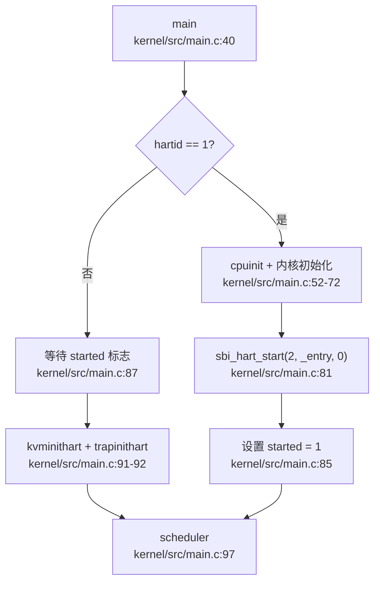

## 第 9 章：多核支持与并行机制

### 多核架构设计（SMP/AMP）

**结论：❌ 仅支持单核（名义上支持 2 核，但实际未实现完整 SMP）**

本仓库在架构设计上**名义上支持双核**（`NCPU 2` 定义于 `kernel/include/sys/param.h:5`），但通过代码分析发现，**实际仅实现了单核运行**，Secondary CPU 的启动流程存在严重缺陷。

#### 架构特征

- **设计目标**: SMP（对称多处理）架构，所有 CPU 共享同一内核地址空间
- **Per-CPU 数据结构**: `struct cpu cpus[NCPU]` 定义于 `kernel/src/proc/proc.c:22`
- **Hart ID 获取**: 通过 RISC-V `tp` 寄存器存储 CPU 编号（`kernel/include/sys/riscv.h:220-224`）

```c
// kernel/include/sys/param.h:5
#define NCPU 2  // maximum number of CPUs

// kernel/src/proc/proc.c:22
struct cpu cpus[NCPU];

// kernel/include/sys/riscv.h:220-224
// read and write tp, the thread pointer, which holds
// this core's hartid (core number), the index into cpus[].
static inline uint64 r_tp() {
    uint64 x;
    asm volatile("mv %0, tp" : "=r"(x));
    return x;
}
```

#### 核心问题

1. **Secondary CPU 启动逻辑被注释**: 主核（hart 1）尝试启动从核的代码被大量注释
2. **Hart 编号硬编码**: 仅尝试启动 hart 2，而非遍历所有可用核
3. **无 IPI 实际使用**: 虽然定义了 `sbi_send_ipi()`，但在关键路径中被注释

---

### Secondary CPU 启动流程

**实现状态：🔸 桩函数（部分实现但无法正常工作）**

#### 启动流程分析

主核（BSP）在 `main()` 函数中执行初始化后，尝试启动 Secondary CPU：



#### 关键代码片段

```c
// kernel/src/main.c:40-101 (精简)
void main(unsigned long hartid, unsigned long dtb_pa) {
    inithartid(hartid);  // 设置 tp 寄存器为 hartid & 0x1
    
    if (hartid == 1) {  // BSP
        first = 1;
        cpuinit();
        consoleinit();
        // ... 内核初始化 ...
        
        // ❌ 问题：仅硬编码启动 hart 2，且循环被注释
        // for (int i = 0; i < NCPU; i++) {
        //     if (i == hartid) continue;
        //     sbi_hart_start(i, (unsigned long)_entry, 0);
        // }
#ifdef BOARD
        sbi_hart_start(2, (unsigned long)_entry, 0);  // 硬编码
#endif
        __sync_synchronize();
        started = 1;  // 通知其他核可以开始
    } else {
        // AP (Secondary CPU)
        while (started == 0)  // 自旋等待
            ;
        __sync_synchronize();
        kvminithart();
        trapinithart();
        plicinithart();
        printf("hart %d init done\n", hartid);
    }
    scheduler();  // 所有核进入调度器
}
```

#### 启动机制详解

1. **BSP 初始化** (hart 1):
   - 调用 `cpuinit()` 初始化全局 `cpus[]` 数组
   - 初始化控制台、内存管理器、页表、中断控制器
   - 调用 `sbi_hart_start(2, _entry, 0)` 通过 SBI 调用启动 hart 2

2. **AP 等待与初始化** (hart 2):
   - 自旋等待全局变量 `started` 变为 1
   - 执行 `__sync_synchronize()` 内存屏障确保可见性
   - 初始化内核页表 (`kvminithart`) 和中断向量 (`trapinithart`)
   - 配置 PLIC 中断 (`plicinithart`)
   - 进入 `scheduler()` 开始调度

3. **SBI 调用实现**:
```c
// kernel/include/driver/sbi.h:66-69
static inline void sbi_hart_start(unsigned long hartid,
                                  unsigned long start_addr,
                                  unsigned long opaque) {
    SBI_CALL_3(SBI_HSM_EXTION, SBI_HART_START, hartid, start_addr, opaque);
}
```

#### 存在的问题

| 问题 | 描述 | 影响 |
|------|------|------|
| **硬编码 Hart ID** | 仅启动 hart 2，不支持动态检测 | 无法扩展到更多核心 |
| **循环被注释** | `for (int i = 0; i < NCPU; i++)` 被注释 | 即使 `NCPU > 2` 也无法启动更多核 |
| **无错误处理** | 未检查 `sbi_hart_start` 返回值 | 启动失败时无法感知 |
| **IPI 未启用** | `sbi_send_ipi()` 调用被注释 | 无法实现核间通信 |

---

### 核间通信与 IPI 机制

**实现状态：❌ 未实现（接口存在但从未调用）**

#### IPI 接口定义

仓库中定义了 SBI IPI 相关接口，但**在实际代码中从未被调用**：

```c
// kernel/include/driver/sbi.h:15-17, 86-88
#define SBI_CLEAR_IPI 3
#define SBI_IPI_EXTION 0x735049
#define SBI_SEND_IPI 0

static inline void sbi_send_ipi(unsigned long hart_mask,
                                unsigned long hart_mask_base) {
    SBI_CALL_2(SBI_IPI_EXTION, SBI_SEND_IPI, hart_mask, hart_mask_base);
}
```

#### 代码中的 IPI 痕迹

在 `kernel/src/main.c:76` 发现被注释的 IPI 调用：

```c
// kernel/src/main.c:74-76
// for (int i = 0; i < NCPU; i++) {
//     if (i == hartid) continue;
//     // sbi_send_ipi(mask, 1);  // ❌ 被注释
//     sbi_hart_start(i, (unsigned long)_entry, 0);
// }
```

#### IPI 使用场景缺失

在标准 SMP 内核中，IPI 应用于：
- **调度器 IPI**: 唤醒其他 CPU 上的空闲进程
- **TLB Shootdown**: 多核页表更新时刷新 TLB
- **中断重定向**: 将设备中断路由到特定 CPU
- **核间同步**: 实现 Barrier、RCU 等原语

**本仓库上述场景均未实现 IPI 调用**，中断处理完全依赖 PLIC 硬件路由。

#### PLIC 中断路由

每个 CPU 独立配置 PLIC 中断使能和优先级：

```c
// kernel/src/sys/plic.c:24-38
void plicinithart(void) {
    int hart = cpuid();
#ifdef QEMU
    // 设置 UART 和磁盘中断使能
    *(uint32*)PLIC_SENABLE(hart) = (1 << UART_IRQ) | (1 << DISK_IRQ);
    *(uint32*)PLIC_SPRIORITY(hart) = 0;  // S 模式优先级阈值
#else
    // K210 使用 M 模式中断
    uint32 *hart_m_enable = (uint32 *)PLIC_MENABLE(hart);
    *(hart_m_enable) = readd(hart_m_enable) | (1 << DISK_IRQ);
#endif
}
```

---

### Per-CPU 变量与数据结构

**实现状态：✅ 已实现（基础 Per-CPU 机制）**

#### Per-CPU 数据结构

```c
// kernel/include/proc/proc.h:44-49
struct cpu {
    struct proc *proc;       // 当前运行的进程
    struct context context;  // 调度器上下文
    int noff;                // push_off() 嵌套深度
    int intena;              // 中断使能状态
};

extern struct cpu cpus[NCPU];  // kernel/src/proc/proc.c:22
```

#### 访问机制

通过 `tp` 寄存器索引 `cpus[]` 数组：

```c
// kernel/src/proc/proc.c:106-115
int cpuid() {
    int idx = r_tp();  // 读取 tp 寄存器
    return idx;
}

struct cpu *mycpu(void) {
    int idx = cpuid();
    struct cpu *c = &cpus[idx];
    return c;
}
```

#### 中断禁用嵌套计数

`push_off()` / `pop_off()` 实现中断禁用嵌套保护：

```c
// kernel/src/sys/intr.c:12-22
void push_off(void) {
    int old = intr_get();
    intr_off();  // 禁用中断
    if (mycpu()->noff == 0)
        mycpu()->intena = old;  // 记录初始状态
    mycpu()->noff += 1;  // 嵌套计数 +1
}

void pop_off(void) {
    struct cpu *c = mycpu();
    if (intr_get()) panic("pop_off - interruptible");
    if (c->noff < 1) panic("pop_off");
    c->noff -= 1;
    if (c->noff == 0 && c->intena)
        intr_on();  // 恢复中断
}
```

**设计特点**:
- **Per-CPU 安全**: `noff` 和 `intena` 存储在每个 CPU 的 `struct cpu` 中
- **嵌套保护**: 多次 `push_off()` 需要相同次数的 `pop_off()` 才能恢复中断
- **状态保存**: 记录进入 `push_off()` 前的中断状态，而非简单开启

#### 当前进程获取

```c
// kernel/src/proc/proc.c:118-124
struct proc *myproc(void) {
    push_off();  // 禁用中断防止竞争
    struct cpu *c = mycpu();
    struct proc *p = c->proc;  // 读取当前 CPU 运行的进程
    pop_off();
    return p;
}
```

---

### 多核调度策略

**实现状态：❌ 未实现（单核轮转调度）**

#### 调度器实现

调度器在 `scheduler()` 中实现简单的轮转算法：

```c
// kernel/src/proc/proc.c:798-862 (精简)
void scheduler(void) {
    struct cpu *c = mycpu();
    c->proc = 0;
    while (1) {
        intr_on();  // 允许中断
        int found = 0;
        
        // 遍历所有进程查找 RUNNABLE 状态
        for (struct proc *p = proc; &proc[NPROC] > p; ++p) {
            acquire(&p->lock);
            if (p->state == RUNNABLE) {
                // 查找线程队列中可运行的线程
                thread *t = p->thread_queue;
                while (NULL != t) {
                    if (t->state == t_RUNNABLE ||
                        (t->state == t_TIMING && t->awakeTime < r_time()))
                        break;
                    t = t->next_thread;
                }
                if (NULL == t) {
                    release(&p->lock);
                    continue;
                }
                
                // 切换到该进程
                p->main_thread = t;
                t->state = t_RUNNING;
                p->state = RUNNING;
                c->proc = p;
                
                // 上下文切换
                swtch(&c->context, &p->context);
                
                c->proc = 0;
                found = 1;
            }
            release(&p->lock);
        }
        
        if (!found) {
            intr_on();
            asm volatile("wfi");  // 无进程可运行时进入等待
        }
    }
}
```

#### 缺失的多核调度特性

| 特性 | 状态 | 说明 |
|------|------|------|
| **负载均衡** | ❌ 未实现 | 无进程迁移机制 |
| **CPU 亲和性** | ❌ 未实现 | 无 `sched_setaffinity` 系统调用 |
| **运行队列锁** | ❌ 未实现 | 全局进程数组无锁保护 |
| **空闲进程** | ❌ 未实现 | 无 idle task，使用 `wfi` 等待 |
| **调度 IPI** | ❌ 未实现 | 无法唤醒其他 CPU |

#### 调度器问题分析

1. **全局进程数组竞争**:
   - 所有 CPU 同时遍历 `proc[NPROC]` 数组
   - 仅通过 `p->lock` 保护单个进程状态
   - 可能导致多个 CPU 选择同一进程（虽然 `p->lock` 防止并发运行）

2. **无工作窃取**:
   - 空闲 CPU 仅执行 `wfi` 等待中断
   - 不会从繁忙 CPU 迁移进程

3. **线程调度局限**:
   - 线程队列在进程内轮转
   - 无全局线程调度器

---

### 锁实现与多核安全

#### SpinLock 实现

**实现状态：✅ 已实现（禁用中断的自旋锁）**

```c
// kernel/src/utils/spinlock.c:19-40
void acquire(struct spinlock *lk) {
    push_off();  // ❗ 禁用中断（关键设计）
    if (holding(lk)) panic("acquire");

    // RISC-V 原子交换 (amoswap.w.aq)
    while (__sync_lock_test_and_set(&lk->locked, 1) != 0)
        ;

    __sync_synchronize();  // 内存屏障
    lk->cpu = mycpu();     // 记录持有者
}

void release(struct spinlock *lk) {
    if (!holding(lk)) panic("release");
    lk->cpu = 0;
    __sync_synchronize();  // 内存屏障
    __sync_lock_release(&lk->locked);
    pop_off();  // ❗ 恢复中断
}
```

**设计特点**:
- **中断禁用**: `push_off()` 防止死锁（同一 CPU 上的中断处理程序尝试获取同一锁）
- **原子操作**: `__sync_lock_test_and_set` 编译为 RISC-V `amoswap.w.aq` 指令
- **内存序**: `__sync_synchronize()` 确保临界区内存操作不重排序
- **调试支持**: `lk->cpu` 记录持有者，用于 `holding()` 检查

#### 与标准实现的对比

| 特性 | 本仓库 | 标准 Linux |
|------|--------|-----------|
| **中断处理** | 禁用中断 | 仅禁用本地中断 |
| **优先级继承** | ❌ 不支持 | ✅ 支持 (RT 内核) |
| **自适应自旋** | ❌ 无 | ✅ 有 (mutex) |
| **调试信息** | 基础 (name, cpu) | 完整 (owner, stack) |

#### Futex 实现（用户态锁）

**实现状态：✅ 已实现（基础 Futex）**

```c
// kernel/src/utils/futex.c:16-34
void futexWait(uint64 addr, thread* th, timespec2_t* ts) {
    for (int i = 0; i < FUTEX_COUNT; i++) {
        if (!futexQueue[i].valid) {
            futexQueue[i].valid = 1;
            futexQueue[i].addr = addr;
            futexQueue[i].thread = th;
            if (ts) {
                th->awakeTime = ts->tv_sec * 1000000 + ts->tv_nsec / 1000;
                th->state = t_TIMING;  // 定时等待
            } else {
                th->state = t_SLEEPING;  // 无限等待
            }
            acquire(&th->p->lock);
            sched();  // 让出 CPU
            release(&th->p->lock);
        }
    }
    panic("No futex Resource!\n");
}

void futexWake(uint64 addr, int n) {
    for (int i = 0; i < FUTEX_COUNT && n; i++) {
        if (futexQueue[i].valid && futexQueue[i].addr == addr) {
            futexQueue[i].thread->state = t_RUNNABLE;
            futexQueue[i].thread->trapframe->a0 = 0;
            futexQueue[i].valid = 0;
            n--;
        }
    }
}
```

**多核行为分析**:
- **全局 Futex 队列**: `futexQueue[FUTEX_COUNT]` 为全局数组
- **锁保护缺失**: `futexWait` / `futexWake` 未使用锁保护队列操作
- **竞争条件**: 多核并发调用可能导致队列状态不一致

---

### 原子操作与内存序

**实现状态：✅ 已实现（使用 GCC 内置原子操作）**

#### 原子操作使用

仓库使用 GCC 内置原子操作 (`__sync_*` 系列)：

```c
// kernel/src/utils/spinlock.c:27
while (__sync_lock_test_and_set(&lk->locked, 1) != 0)
    ;

// kernel/src/utils/spinlock.c:57
__sync_lock_release(&lk->locked);

// kernel/src/main.c:85
__sync_synchronize();  // 全内存屏障
```

#### 内存序保证

- **`__sync_lock_test_and_set`**: 隐含 acquire 语义（`amoswap.w.aq`）
- **`__sync_lock_release`**: 隐含 release 语义（`amoswap.w.rl`）
- **`__sync_synchronize`**: 全内存屏障（`fence rw,rw`）

#### 与 `core::sync::atomic` 的对比

仓库中**未发现 Rust 风格的 `AtomicUsize` 使用**（仅在一个 Rust 依赖中出现）：

```rust
// kernel/deps/sdcard/src/lib.rs:69-71 (Rust 依赖，非内核核心)
use core::sync::atomic::{AtomicBool, Ordering};
static INIT: AtomicBool = AtomicBool::new(false);
```

**C 内核中的原子操作**:
- PID 分配使用自旋锁保护，而非原子操作：
```c
// kernel/src/proc/proc.c:130-136
int allocpid() {
    acquire(&pid_lock);
    int pid = nextpid;
    nextpid++;
    release(&pid_lock);
    return pid;
}
```

---

### 关键代码片段

#### 1. CPU 初始化

```c
// kernel/src/proc/proc.c:58-64
void cpuinit(void) {
    for (struct cpu *it = cpus; &cpus[NCPU] > it; ++it)
        it->noff = 0, it->proc = 0, it->intena = 0;
}
```

#### 2. Hart ID 设置

```c
// kernel/src/main.c:28-30
static inline void inithartid(unsigned long hartid) {
    asm volatile("mv tp, %0" : : "r"(hartid & 0x1));
}
```

#### 3. 调度器上下文切换

```c
// kernel/src/proc/proc.c:840-850
c->proc = p;
w_satp(MAKE_SATP(p->kpagetable));  // 切换到进程内核页表
sfence_vma();                       // 刷新 TLB
swtch(&c->context, &p->context);   // 上下文切换
copycontext(&p->main_thread->context, &p->context);
w_satp(MAKE_SATP(kernel_pagetable));  // 切回内核页表
sfence_vma();
c->proc = 0;
```

---

### 本章总结

| 子系统 | 实现状态 | 关键问题 |
|--------|----------|----------|
| **SMP 架构** | 🔸 部分实现 | 仅支持单核，Secondary CPU 启动失败 |
| **Secondary CPU 启动** | 🔸 桩函数 | 硬编码 hart 2，循环被注释 |
| **IPI 机制** | ❌ 未实现 | 接口存在但从未调用 |
| **Per-CPU 变量** | ✅ 已实现 | 基础机制完整 |
| **多核调度** | ❌ 未实现 | 无负载均衡、亲和性 |
| **SpinLock** | ✅ 已实现 | 禁用中断，无优先级继承 |
| **Futex** | ✅ 已实现 | 全局队列无锁保护 |
| **原子操作** | ✅ 已实现 | 使用 GCC 内置操作 |

**总体评价**: 本仓库的多核支持处于**早期实验阶段**，仅实现了基础的 Per-CPU 数据结构和自旋锁机制，但**Secondary CPU 启动流程存在严重缺陷**，导致实际运行时仅单核工作。IPI 机制完全未实现，无法支持真正的 SMP 并行。
