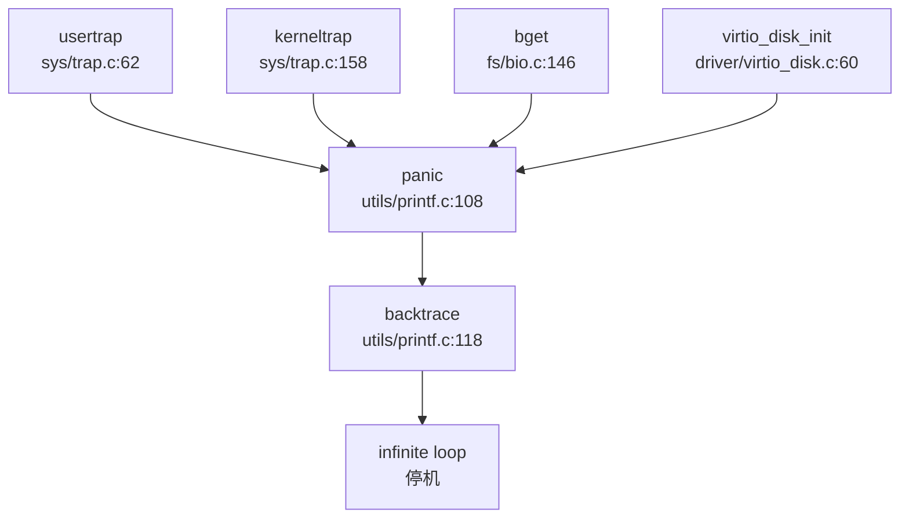

## 第 12 章：调试机制与错误处理

### 日志与打印系统

本操作系统的日志系统基于 `printf.c` 实现，提供了一套完整的控制台输出机制。

**核心实现文件**：
- `kernel/include/utils/printf.h` - 日志接口声明
- `kernel/src/utils/printf.c` - 日志实现（238 行）

**日志级别设计**：
系统未实现标准的分级日志系统（如 INFO/WARN/ERROR），但 EXT4 文件系统模块提供了调试掩码机制：

```c
// kernel/include/fs/ext4/ext4_debug.h
#define DEBUG_BALLOC (1ul << 0)
#define DEBUG_BCACHE (1ul << 1)
#define DEBUG_BITMAP (1ul << 2)
// ... 共 18 种调试掩码
#define DEBUG_ALL (0xFFFFFFFF)
```

**打印宏实现**：
```c
// kernel/include/fs/ext4/ext4_debug.h
#if CONFIG_DEBUG_ASSERT
#define ext4_dbg(m, ...) \
    do {                 \
    } while (0)          // 实际被注释禁用
#endif
```

`ext4_dbg` 宏在代码中被注释禁用（`#if 0` 块），实际不产生输出。系统主要依赖 `printf()` 和 `debug_print()` 两个函数：

```c
// kernel/include/utils/printf.h
void printf(char *fmt, ...);
void debug_print(char *fmt, ...);  // 仅在 DEBUG 宏定义时生效
```

`debug_print()` 实现条件编译：
```c
// kernel/src/utils/printf.c
void debug_print(char *fmt, ...) {
#ifdef DEBUG
    // 实际打印逻辑
#endif
}
```

**状态**：
- `printf()`：✅ 已实现（完整格式化输出）
- `debug_print()`：✅ 已实现（条件编译）
- 分级日志：❌ 未实现（仅有 EXT4 调试掩码框架，未实际使用）

---

### Panic 处理与栈回溯

**Panic 处理流程**：

当系统遇到致命错误时，调用 `panic()` 函数。该函数定义在 `kernel/src/utils/printf.c:108-116`：

```c
void panic(char *s) {
    printf("%p\n", s);
    printf("panic: ");
    printf(s);
    printf("\n");
    backtrace();           // 调用栈回溯
    panicked = 1;          // 冻结其他 CPU 的 UART 输出
    for (;;);              // 无限循环停机
}
```

**Panic 调用链**（基于 `trap.c` 分析）：



**栈回溯实现**：

`backtrace()` 函数位于 `kernel/src/utils/printf.c:118-127`，基于 RISC-V 的帧指针（Frame Pointer）实现：

```c
void backtrace() {
    uint64 *fp = (uint64 *)r_fp();           // 读取当前帧指针 (s0/fp)
    uint64 *bottom = (uint64 *)PGROUNDUP((uint64)fp);
    printf("backtrace:\n");
    while (fp < bottom) {
        uint64 ra = *(fp - 1);               // 返回地址在 fp-1
        printf("%p\n", ra - 4);              // 打印返回地址（减去 4 字节对齐）
        fp = (uint64 *)*(fp - 2);            // 移动到上一帧 (fp-2 存储旧 fp)
    }
}
```

**栈回溯原理**：
- RISC-V 调用约定中，函数 prologue 会保存 `ra`（返回地址）和旧 `fp` 到栈上
- 栈帧布局：`[旧 fp][ra][局部变量]`，`fp` 指向旧 `fp` 位置
- 通过 `fp-1` 读取 `ra`，通过 `fp-2` 读取上一帧的 `fp`
- 循环直到栈帧边界（`PGROUNDUP` 对齐到页边界）

**状态**：
- Panic 处理：✅ 已实现（打印消息 + 栈回溯 + 停机）
- 栈回溯（Backtrace）：✅ 已实现（基于 FramePointer 的简单回溯）
- DWARF 解析：❌ 未实现（无 DWARF 相关代码）
- 寄存器 Dump：✅ 已实现（`trapframedump()` 打印 trapframe 中所有寄存器）

**陷阱帧 Dump**：
```c
// kernel/include/sys/trap.h:58
void trapframedump(struct trapframe *tf);

// kernel/src/sys/trap.c:234-269
void trapframedump(struct trapframe *tf) {
    printf("a0: %p\t", tf->a0);
    printf("a1: %p\t", tf->a1);
    // ... 打印所有 32 个通用寄存器 + epc/sp/gp/tp/ra
}
```

---

### 错误码与 Result 设计

本系统采用 C 语言风格的传统错误码设计，而非 Rust 风格的 `Result<T, E>` 类型。

**错误码定义**：
```c
// kernel/include/fs/ext4/ext4_errno.h
#define EPERM 1      /* Operation not permitted */
#define ENOENT 2     /* No such file or directory */
#define EIO 5        /* I/O error */
#define ENOMEM 12    /* Out of memory */
#define EACCES 13    /* Permission denied */
#define EFAULT 14    /* Bad address */
#define EINVAL 22    /* Invalid argument */
#define ENOSPC 28    /* No space left on device */
// ... 共 24 种错误码
```

**错误码使用模式**：
系统函数通过返回负值或特定值表示错误：

```c
// kernel/src/fs/fat32.c:87
if (fat.bpb.byts_per_sec != BSIZE) panic("byts_per_sec != BSIZE");

// kernel/src/fs/bio.c:146
panic("bget: no buffers");  // 直接 panic 而非返回错误码
```

**状态**：
- 错误码定义：✅ 已实现（标准 POSIX 错误码）
- Result 类型：❌ 未实现（C 语言项目，无 Rust 风格 Result）
- 错误传播：🔸 桩函数（部分函数直接 panic，未统一错误处理）

---

### 调试接口与交互式 Shell

**用户态 Shell**：
系统在用户空间提供了完整的 Shell 实现 `xv6-user/sh.c`（555 行）。

**Shell 功能**：
```c
// xv6-user/sh.c:1-80
struct cmd {
    int type;  // EXEC, REDIR, PIPE, LIST, BACK
};

struct execcmd {
    int type;
    char *argv[MAXARGS];  // 命令参数
};
```

**支持的命令**：
Shell 本身是命令解析器，支持：
- 管道（`|`）
- 重定向（`>`, `<`）
- 后台执行（`&`）
- 命令列表（`;`, `&&`）
- 环境变量（`export`）

**内置命令**（通过 `exec.c` 执行外部程序）：
- `cat`, `echo`, `grep`, `ls`, `mkdir`, `rm`, `sh` 等（见 `xv6-user/` 目录）

**状态**：
- 交互式 Shell：✅ 已实现（`sh.c` 完整解析器）
- 内核 Monitor：❌ 未实现（无内核态命令解释器）
- 调试控制台：✅ 已实现（UART 控制台 + `printf`）

---

### GDB Stub 支持情况

**严格验证结果**：

通过以下搜索确认 GDB Stub 支持情况：
```bash
grep "handle_gdb|gdb_packet|gdb_stub" → 0 匹配
grep "gdb|GDB" → 仅 EXT4 文件系统的 "gdb"（Group Descriptor Block，与调试无关）
```

**结论**：
- GDB Stub：❌ 未实现
- 数据包解析循环：❌ 未发现
- 远程调试协议：❌ 未实现

系统中搜索到的 `gdb` 均为 EXT4 文件系统的 **Group Descriptor Block** 相关函数（如 `ext4_bg_num_gdb()`），与 GDB 调试器无关。

---

### 断言与运行时检查

**断言机制**：
系统提供两套断言系统：

1. **EXT4 自定义断言**（`kernel/include/fs/ext4/ext4_debug.h:163-177`）：
```c
#if CONFIG_DEBUG_ASSERT
#if CONFIG_HAVE_OWN_ASSERT
#define ext4_assert(_v) \
    do { \
        if (!(_v)) { \
            printf("assertion failed:\nfile: %s\nline: %d\n", __FILE__, __LINE__); \
            while (1);  // 无限循环停机 \
        } \
    } while (0)
#else
#define ext4_assert(_v) assert(_v)
#endif
#else
#define ext4_assert(_v) ((void)(_v))  // 禁用时为空操作
#endif
```

2. **驱动层断言**（被注释禁用）：
```c
// kernel/src/driver/spi.c:19-53
// configASSERT(data_bit_length >= 4 && data_bit_length <= 32);
// configASSERT(spi_num < SPI_DEVICE_MAX && spi_num != 2);
```

**运行时检查**：
- **自旋锁检查**：`kernel/include/utils/spinlock.h` 提供锁状态验证
- **睡眠锁检查**：`kernel/src/utils/sleeplock.c` 检查持有状态
```c
// kernel/src/fs/bio.c:213
if (0 == holdingsleep(&Buf->lock)) panic("bwrite");
```

**状态**：
- 断言（assert）：✅ 已实现（`ext4_assert` + 标准 `assert`）
- 调试断言（debug_assert）：🔸 桩函数（驱动层 `configASSERT` 被注释）
- 运行时锁检查：✅ 已实现（`holdingsleep` 检查）

---

### 关键代码片段

**1. Panic 处理完整流程**（`kernel/src/utils/printf.c:108-127`）：
```c
void panic(char *s) {
    printf("%p\n", s);
    printf("panic: ");
    printf(s);
    printf("\n");
    backtrace();           // 栈回溯
    panicked = 1;          // 冻结 UART
    for (;;);              // 停机
}

void backtrace() {
    uint64 *fp = (uint64 *)r_fp();
    uint64 *bottom = (uint64 *)PGROUNDUP((uint64)fp);
    printf("backtrace:\n");
    while (fp < bottom) {
        uint64 ra = *(fp - 1);
        printf("%p\n", ra - 4);
        fp = (uint64 *)*(fp - 2);
    }
}
```

**2. 陷阱帧 Dump**（`kernel/src/sys/trap.c:234-269`）：
```c
void trapframedump(struct trapframe *tf) {
    printf("a0: %p\t", tf->a0);
    printf("a1: %p\t", tf->a1);
    // ... 打印所有寄存器
    printf("epc: %p\n", tf->epc);
}
```

**3. EXT4 断言实现**（`kernel/include/fs/ext4/ext4_debug.h:163-177`）：
```c
#define ext4_assert(_v) \
    do { \
        if (!(_v)) { \
            printf("assertion failed:\nfile: %s\nline: %d\n", __FILE__, __LINE__); \
            while (1); \
        } \
    } while (0)
```

**4. 用户态 Shell 主循环**（`xv6-user/sh.c` 核心逻辑）：
```c
// Shell 解析命令并执行
struct cmd *parsecmd(char *);
void runcmd(struct cmd *cmd);

// 支持管道、重定向、后台执行等
```

---

### 调试机制总结

| 功能模块 | 实现状态 | 文件位置 |
|---------|---------|---------|
| 日志打印 (`printf`) | ✅ 已实现 | `kernel/src/utils/printf.c` |
| 条件调试打印 (`debug_print`) | ✅ 已实现 | `kernel/src/utils/printf.c` |
| Panic 处理 | ✅ 已实现 | `kernel/src/utils/printf.c:108` |
| 栈回溯 (Backtrace) | ✅ 已实现 (FramePointer) | `kernel/src/utils/printf.c:118` |
| 寄存器 Dump | ✅ 已实现 | `kernel/src/sys/trap.c:234` |
| 错误码定义 | ✅ 已实现 | `kernel/include/fs/ext4/ext4_errno.h` |
| 断言 (`assert`) | ✅ 已实现 | `kernel/include/fs/ext4/ext4_debug.h` |
| 交互式 Shell | ✅ 已实现 (用户态) | `xv6-user/sh.c` |
| GDB Stub | ❌ 未实现 | - |
| 内核 Monitor | ❌ 未实现 | - |
| Perf/Ftrace | ❌ 未实现 | - |
| Tracepoints | ❌ 未实现 | - |

**设计特点**：
1. **轻量级调试**：系统采用极简设计，无复杂日志框架，依赖 `printf` + `panic`
2. **基于 FramePointer 的栈回溯**：无需 DWARF 信息，通过栈帧链表回溯
3. **用户态 Shell 完整**：提供完整的命令解析器，支持管道、重定向等高级功能
4. **无 GDB 支持**：未实现 GDB Stub，调试依赖串口打印和 QEMU 内置 GDB Server
5. **错误处理不统一**：部分函数直接 `panic`，部分返回错误码，缺乏统一错误传播机制
