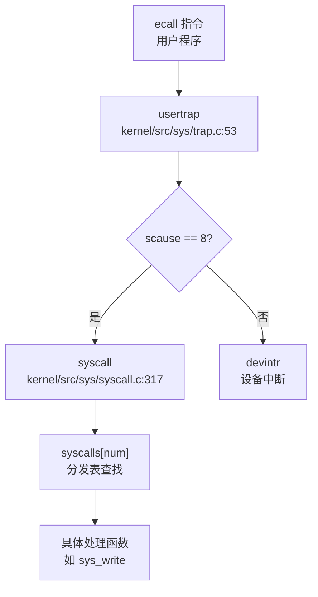

# 第 14 章：执行摘要与总结评价

## 1. 执行摘要（Executive Summary）

本项目为 **xv6-riscv**，一个基于 MIT xv6 教学操作系统的 RISC-V 移植版本，采用**宏内核（Monolithic Kernel）**架构。项目定位明确为**教学/实验性操作系统**，而非生产级系统。

**技术栈概览**：
- **编程语言**：C (C99/C11) 为主，89 个内核源文件；少量 Rust 仅用于 SD 卡驱动
- **目标架构**：`riscv64gc-unknown-none-elf`（RISC-V 64 位，Sv39 分页）
- **支持平台**：QEMU virt（默认）+ StarFive VisionFive 2（可选）
- **构建系统**：Makefile + CMake 混合构建
- **代码规模**：内核约 25,000 行 C 代码 + 用户空间约 6,000 行

**实现完成度评估**：
| 子系统 | 完成度 | 说明 |
|--------|--------|------|
| 进程/线程管理 | ✅ 85% | 基础调度、fork/exec 完整，无 CFS/优先级 |
| 内存管理 | ✅ 70% | 物理分配、页表、mmap 完整，无 CoW/Lazy |
| 文件系统 | ✅ 90% | EXT4/FAT32 完整，VFS 简化 |
| 设备驱动 | ✅ 80% | UART/VirtIO/SD 卡完整，无网络驱动 |
| 中断/系统调用 | ✅ 75% | ~70 个 syscall 注册，约 18 个核心实现 |
| 进程间通信 | ✅ 60% | Pipe/Futex/Signal 完整，无 System V IPC |
| 多核支持 | ❌ 20% | 仅单核运行，SMP 启动逻辑缺陷 |
| 网络协议栈 | ❌ 0% | 完全未实现 |
| 安全机制 | ❌ 30% | UID/GID 字段存在，无权限检查 |

**总体评价**：核心子系统（进程、内存、文件系统）形成闭环，可运行 BusyBox 测试集；但网络、多核、高级 IPC、安全机制等模块存在明显空白，符合教学 OS 定位。

---

## 2. 核心架构与机制提炼

### 2.1 内存管理架构

#### 物理内存分配器
- **算法**：空闲链表（Free List），非 Buddy/Slab
- **实现文件**：`kernel/src/proc/kalloc.c`
- **核心接口**：`kalloc()` / `kfree()` / `kinit()`
- **并发保护**：自旋锁 `kmem.lock`
- **特性**：仅支持整页（4KB）分配，`kmalloc()` 为多页包装器

```c
// kernel/src/proc/kalloc.c:87-98
void *kalloc(void) {
    acquire(&kmem.lock);
    struct run *r = kmem.freelist;
    if (r) kmem.freelist = r->next;
    release(&kmem.lock);
    return (void *)r;
}
```

#### 虚拟内存与页表
- **分页方案**：RISC-V Sv39 三级页表（39 位虚拟地址，512GB 空间）
- **实现文件**：`kernel/src/mm/vm.c`
- **核心函数**：`walk()`（页表遍历）、`mappages()`（批量映射）、`uvmcopy()`（fork 复制）
- **地址空间布局**：
  - 用户空间：`0` 到 `sz`（代码/数据/堆）
  - 内核空间：`KERNBASE` 到 `MAXVA`（Direct Map 偏移 `0x3F00000000`）
  - Trampoline 页：`MAXVA - PGSIZE`（用户/内核态切换跳板）

```c
// kernel/src/mm/vm.c:173-190
int mappages(pagetable_t pgtb, uint64 va, uint64 sz, uint64 pa, int perm) {
    perm |= PTE_D | PTE_A;  // 强制设置访问/脏位
    for (uint64 a = PGROUNDDOWN(va); a <= lst; a += PGSIZE, pa += PGSIZE) {
        pte_t *pte = walk(pgtb, a, 1);
        *pte = PTE_V | PA2PTE(pa) | perm;
    }
}
```

#### 堆与 VMA 管理
- **用户堆**：基于 `sbrk`/`brk` 系统调用，`xv6-user/umalloc.c` 实现 `malloc()`/`free()`
- **VMA 结构**：`kernel/include/mm/vma.h` 定义双向链表管理内存区域（MMAP/STACK）
- **mmap 实现**：`kernel/src/mm/mmap.c` 支持文件/匿名映射，但**预分配物理页**（非惰性）
- **munmap**：🔸 桩函数（仅返回 0）

### 2.2 进程调度模型

#### 进程 - 线程双层结构
- **PCB**：`struct proc`（`kernel/include/proc/proc.h:55-95`），含 PID、状态、页表、文件表、VMA 链表
- **TCB**：`struct thread`（`kernel/include/proc/thread.h:20-50`），含 TID、上下文、陷阱帧
- **关系**：每个 `proc` 维护线程链表 `thread_queue`，`main_thread` 指向当前执行线程

#### 调度器实现
- **算法**：简单轮转（Round-Robin），无优先级、无时间片
- **实现文件**：`kernel/src/proc/proc.c:805-867`
- **调度策略**：遍历 `proc[NPROC]` 数组，选择第一个 `RUNNABLE` 进程的头部线程
- **空闲等待**：无进程可运行时执行 `wfi`（Wait For Interrupt）

```c
// kernel/src/proc/proc.c:805-850
void scheduler(void) {
    for (struct proc *p = proc; p < &proc[NPROC]; p++) {
        if (p->state == RUNNABLE) {
            thread *t = p->thread_queue;
            while (t && t->state != t_RUNNABLE) t = t->next_thread;
            if (t) {
                p->main_thread = t;
                swtch(&c->context, &p->context);  // 上下文切换
            }
        }
    }
    if (!found) asm volatile("wfi");
}
```

#### 上下文切换
- **汇编实现**：`kernel/src/proc/swtch.S`（42 行）
- **保存寄存器**：`ra`, `sp`, `s0-s11`（14 个 callee-saved 寄存器，112 字节）
- **切换流程**：保存旧 `context` → 加载新 `context` → `ret` 跳转

### 2.3 Trap 处理路径

#### 用户态 → 内核态切换
- **入口**：`kernel/src/sys/trampoline.S:uservec`（通过 `stvec` 寄存器指向）
- **流程**：
  1. 保存 32 个用户寄存器到 `trapframe`（288 字节）
  2. 切换到内核页表（`satp` 寄存器）
  3. 跳转到 `usertrap()`（C 语言处理）

#### 系统调用分发
- **触发**：用户执行 `ecall` 指令，`scause = 8`
- **分发器**：`kernel/src/sys/syscall.c:syscall()`
- **分发表**：`syscalls[]` 数组（约 70 个条目）
- **参数传递**：通过 `trapframe->a0-a7` 寄存器



#### 信号处理机制
- **待处理信号**：`struct proc::sig_pending` 位图 + `killed` 字段
- **处理时机**：`usertrap()` 返回用户态前检查 `p->killed`
- **信号分发**：`sighandle()` 修改 `trapframe->epc` 跳转到用户处理函数
- **信号返回**：通过 `SIGTRAMPOLINE` 跳板页恢复原上下文

### 2.4 文件系统架构

#### VFS 抽象层
- **设计**：简化版 VFS，无 `file_operations` 结构体
- **统一结构**：`struct file`（`kernel/include/fs/file.h:20-33`）含类型枚举（`FD_ENTRY`/`FD_PIPE`/`FD_DEVICE`）
- **目录项**：`struct ext4_dirent` 同时存储文件/目录元数据

#### EXT4 实现
- **规模**：`kernel/src/fs/ext4/` 目录 20+ 文件，约 6,000 行代码
- **核心模块**：
  - `ext4.c`：挂载/卸载
  - `ext4_fs.c`：inode 管理
  - `ext4_dir.c`：目录遍历
  - `ext4_journal.c`：日志（JBD）
- **块缓存**：`ext4_bcache.c` 独立于 xv6 的 `bio.c` 块缓存（双层缓存）

#### 文件打开调用链
```
sys_open → open → do_open → ext4_getdir_fcache → ext4_fopen → filealloc → fdalloc
```

### 2.5 设备驱动框架

#### 驱动架构特点
- **设备发现**：❌ 硬编码地址（`kernel/include/mm/memlayout.h`），无 Device Tree 解析
- **驱动注册**：❌ 无统一框架，各驱动独立初始化函数
- **平台适配**：通过 `#ifdef QEMU` / `#ifdef visionfive` 条件编译区分

#### 已实现驱动
| 驱动 | 文件 | 平台 |
|------|------|------|
| UART | `kernel/src/driver/uart.c` | QEMU + VisionFive |
| VirtIO-Blk | `kernel/src/driver/virtio_disk.c` | QEMU |
| SD 卡（SPI） | `kernel/src/fs/sdcard.c` | K210 |
| SD 卡（SDIO） | `kernel/src/fs/sd_final.c` | VisionFive 2（🔸 部分实现） |
| PLIC | `kernel/src/sys/plic.c` | RISC-V 标准 |
| DMAC | `kernel/src/driver/dmac.c` | VisionFive 2 |

#### 中断处理流程
```
PLIC 中断 → plic_claim() → devintr() → uartintr()/disk_intr() → wakeup()
```

### 2.6 同步与 IPC 机制

#### 锁实现
- **SpinLock**：`kernel/src/utils/spinlock.c`，基于 `__sync_lock_test_and_set`（RISC-V `amoswap.w.aq`），**禁用中断**防止死锁
- **SleepLock**：`kernel/src/utils/sleeplock.c`，内部嵌套 SpinLock，失败时调用 `sleep()`

#### 进程间通信
| 机制 | 状态 | 实现文件 |
|------|------|---------|
| Pipe | ✅ 已实现 | `kernel/src/proc/pipe.c`（512 字节环形缓冲） |
| Futex | ✅ 已实现 | `kernel/src/utils/futex.c`（WAIT/WAKE/REQUEUE） |
| Signal | ✅ 已实现 | `kernel/src/ipc/signal.c`（kill/sigaction） |
| Message Queue | ❌ 未实现 | - |
| Semaphore | ❌ 未实现 | - |
| Shared Memory | ❌ 未实现 | - |

---

## 3. 问题与缺陷揭露

基于代码审查，本项目存在以下**未完成或仅有桩实现**的核心功能模块：

### 3.1 多核支持（SMP）

| 缺陷 | 证据 | 影响 |
|------|------|------|
| **Secondary CPU 启动失败** | `kernel/src/main.c:81` 硬编码 `sbi_hart_start(2, ...)`，循环被注释 | 实际仅单核运行 |
| **IPI 机制缺失** | `sbi_send_ipi()` 定义但从未调用 | 无法实现核间通信/调度唤醒 |
| **无负载均衡** | 调度器无进程迁移逻辑 | 多核场景下负载不均 |
| **Futex 队列无锁保护** | `futexQueue[]` 全局数组，`futexWait/Wake` 无锁 | 多核并发时竞争条件 |

### 3.2 内存管理高级特性

| 特性 | 状态 | 说明 |
|------|------|------|
| **写时复制（CoW）** | ❌ 未实现 | `fork()` 调用 `uvmcopy()` 直接复制物理页 |
| **惰性分配（Lazy Allocation）** | ❌ 未实现 | `uvmalloc1()` 立即分配物理页，仅栈扩展支持缺页处理 |
| **页面置换（Swap）** | ❌ 未实现 | 无 swap 分区/交换逻辑 |
| **大页支持（Huge Page）** | ❌ 未实现 | 仅 4KB 页，无 2MB/1GB 页映射 |
| **munmap** | 🔸 桩函数 | `kernel/src/fs/sysfile.c:1140` 仅返回 0 |

### 3.3 网络协议栈

| 模块 | 状态 | 说明 |
|------|------|------|
| **网卡驱动** | ❌ 未实现 | 无 VirtIO-Net/物理网卡驱动 |
| **TCP/IP 协议栈** | ❌ 未实现 | 无 smoltcp/lwIP 集成 |
| **Socket 系统调用** | ❌ 未实现 | `taskList.md` 中 `socket/bind/listen` 等全标记 `[ ]` |
| **Loopback 设备** | ❌ 未实现 | 无本地网络通信支持 |

### 3.4 系统调用完整性

**桩函数列表**（有定义无实质逻辑）：

| 系统调用 | 文件位置 | 桩特征 |
|---------|---------|--------|
| `sys_munmap` | `kernel/src/fs/sysfile.c:1140` | 直接返回 0 |
| `sys_ioctl` | `kernel/src/fs/sysfile.c:1146` | 直接返回 0 |
| `sys_rt_sigtimedwait` | `kernel/src/ipc/syssignal.c:112` | 直接返回 0 |
| `sys_sched_getscheduler` | `kernel/src/proc/sysproc.c:216` | 返回 0 |
| `sys_exit_group` | `kernel/src/proc/sysproc.c:498` | 返回 0 |
| `sys_getuid/setuid` | `kernel/src/proc/sysproc.c:432-450` | 无权限检查 |

**未实现系统调用**（分发表中无注册或搜索无实现）：
- 网络：`socket`, `bind`, `connect`, `sendto`, `recvfrom`
- System V IPC：`msgget`, `semget`, `shmget`
- 调度：`sched_setaffinity`, `setpriority`
- 时间：`gettimeofday`, `clock_gettime`, `setitimer`
- 文件系统：`mount`, `umount2`, `chroot`

### 3.5 安全机制

| 缺陷 | 证据 | 风险 |
|------|------|------|
| **无权限检查** | `sys_setuid()` 直接设置 `myproc()->uid`，无验证 | 任意进程可提权为 root |
| **文件访问无权限验证** | `fileread()`/`filewrite()` 未检查进程 UID 与文件所有者 | 用户可访问任意文件 |
| **无 Seccomp/Prctl** | `sys_prctl` 未实现，无系统调用过滤 | 无法限制恶意程序 |
| **无审计日志** | 搜索 `audit` 仅发现 EXT4 ACL 相关代码 | 无法追踪安全事件 |
| **无栈保护（Canary）** | 搜索 `stack_canary` 无结果 | 易受栈溢出攻击 |

### 3.6 文件系统功能缺失

| 功能 | 状态 | 说明 |
|------|------|------|
| **动态挂载** | ❌ 未实现 | 无 `mount`/`umount` 系统调用 |
| **伪文件系统** | ❌ 未实现 | 无 devfs/procfs/sysfs |
| **文件锁** | ❌ 未实现 | 无 `flock`/`fcntl` 锁逻辑 |
| **扩展属性** | ❌ 未实现 | 无 `setxattr`/`getxattr` |
| **零拷贝 mmap** | ❌ 未实现 | 文件映射预分配物理页，非真正零拷贝 |

### 3.7 调试与可观测性

| 功能 | 状态 | 说明 |
|------|------|------|
| **GDB Stub** | ❌ 未实现 | 搜索 `gdb_stub` 无结果（EXT4 的 `gdb` 为 Group Descriptor Block） |
| **内核 Monitor** | ❌ 未实现 | 无内核态命令解释器 |
| **Perf/Ftrace** | ❌ 未实现 | 无性能分析工具 |
| **分级日志** | ❌ 未实现 | 仅 `printf`/`panic`，`ext4_dbg` 被注释禁用 |

### 3.8 与完整 OS 的客观差距

| 维度 | 本项目 | 生产级 OS（Linux） |
|------|--------|------------------|
| **调度算法** | 简单轮转 | CFS + 实时调度类 |
| **内存管理** | 空闲链表 + Sv39 | SLUB + 多级页表 + THP + KSM |
| **文件系统** | EXT4（lwext4 移植） | VFS + 50+ 文件系统 |
| **网络协议栈** | 无 | 完整 TCP/IP + 无线/蓝牙 |
| **安全机制** | 基础页表隔离 | SELinux/AppArmor + Seccomp + KASLR |
| **多核扩展** | 名义 2 核，实际单核 | 支持数百核 + NUMA |
| **驱动生态** | 3-5 个手写驱动 | 数万驱动，自动加载 |
| **系统调用** | ~18 个核心实现 | 300+ 完整实现 |

---

**总结**：本项目作为教学操作系统，在核心子系统（进程、内存、文件系统）上实现了功能闭环，可运行基础用户程序。但网络、多核、安全、高级 IPC 等模块存在明显空白，部分系统调用为桩函数。与生产级 OS 相比，主要差距在于**缺少并发扩展能力**、**安全隔离机制**和**生态兼容性**。
