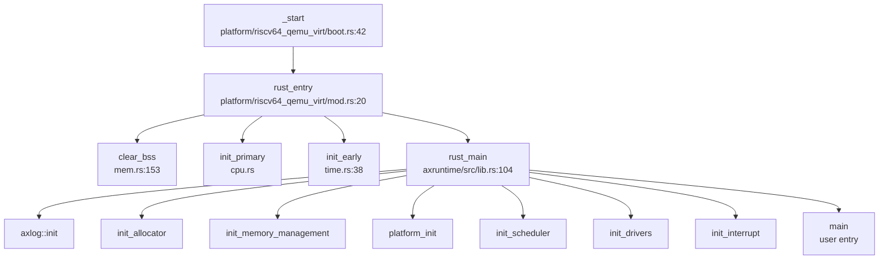

现在我已经收集了足够的信息来撰写启动流程与架构初始化章节。让我整理分析结果并输出完整的 Markdown 报告。

## 第 2 章：启动流程与架构初始化

本章分析从复位/Bootloader 到内核 `rust_main` 函数的完整启动流程，涵盖多架构（RISC-V、LoongArch、AArch64、x86_64）的启动差异、模式切换、MMU 初始化、FPU 配置及平台适配机制。

---

### 启动入口与链接脚本分析

#### 链接脚本与入口点

内核的链接脚本位于 `arceos/modules/axhal/linker.lds.S`，定义了入口点为 `_start`：

```ld
ENTRY(_start)
SECTIONS
{
    . = BASE_ADDRESS;
    _skernel = .;
    
    .text : ALIGN(4K) {
        _stext = .;
        *(.text.boot)    // 启动代码段
        *(.text .text.*)
        _etext = .;
    }
    // ... 其他段定义
}
```

启动代码被放置在 `.text.boot` 段，确保位于内核镜像起始位置。不同架构的基地址由配置文件定义：

| 架构 | 配置文件 | 物理基地址 | 虚拟基地址 |
|------|----------|-----------|-----------|
| RISC-V | `riscv64-qemu-virt.toml` | `0x8020_0000` | `0xffff_ffc0_8020_0000` |
| LoongArch | `loongarch64-qemu-virt.toml` | `0x8000_0000` | `0xffff_8000_8000_0000` |
| AArch64 | `aarch64-qemu-virt.toml` | `0x4000_0000` | 动态映射 |
| x86_64 | `x86_64-qemu-q35.toml` | Multiboot 规范 | 高位映射 |

#### 汇编入口点

各架构的汇编入口位于 `arceos/modules/axhal/src/platform/<arch>/boot.rs` 中，使用 `naked` 函数实现：

**RISC-V 入口** (`arceos/modules/axhal/src/platform/riscv64_qemu_virt/boot.rs:42`)：
```rust
#[unsafe(naked)]
#[unsafe(no_mangle)]
#[unsafe(link_section = ".text.boot")]
unsafe extern "C" fn _start() -> ! {
    // PC = 0x8020_0000
    // a0 = hartid, a1 = dtb
    core::arch::naked_asm!("
        mv      s0, a0                  // save hartid
        mv      s1, a1                  // save DTB pointer
        la      sp, {boot_stack}
        li      t0, {boot_stack_size}
        add     sp, sp, t0              // setup boot stack
        call    {init_boot_page_table}
        call    {init_mmu}              // setup boot page table and enable MMU
        li      s2, {phys_virt_offset}  // fix up virtual high address
        add     sp, sp, s2
        mv      a0, s0
        mv      a1, s1
        la      a2, {entry}
        add     a2, a2, s2
        jalr    a2                      // call rust_entry(hartid, dtb)
        j       .",
        entry = sym super::rust_entry,
    )
}
```

**LoongArch 入口** (`arceos/modules/axhal/src/platform/loongarch64_qemu_virt/boot.rs:52`)：
```rust
#[unsafe(naked)]
#[unsafe(no_mangle)]
#[unsafe(link_section = ".text.boot")]
unsafe extern "C" fn _start() -> ! {
    core::arch::naked_asm!("
        la.global   $sp, {boot_stack}
        li.d        $t0, {boot_stack_size}
        add.d       $sp, $sp, $t0
        bl          {init_boot_page_table}
        bl          {init_mmu}          // setup MMU
        csrrd       $a0, 0x20           // cpuid
        la.global   $t0, {entry}
        jirl        $zero, $t0, 0",     // jump to rust_entry
        entry = sym super::rust_entry,
    )
}
```

**AArch64 入口** (`arceos/modules/axhal/src/platform/aarch64_common/boot.rs:113`)：
- 包含 Linux image header，符合 [Linux ARM64 Booting 规范](https://docs.kernel.org/arch/arm64/booting.html)
- 通过 `_start_primary` 执行实际初始化

**x86_64 入口** (`arceos/modules/axhal/src/platform/x86_pc/multiboot.S:1`)：
- 遵循 Multiboot 规范，从 32 位保护模式启动
- 通过 `bsp_entry32` → `bsp_entry64` 切换到长模式

---

### 架构初始化流程（模式切换/FPU/MMU）

#### 模式切换验证

**✅ RISC-V：S-Mode 直接启动**
- QEMU virt 平台通过 SBI（OpenSBI）启动，内核**直接进入 S-Mode**
- 未找到 M-Mode → S-Mode 切换代码（由 SBI 固件完成）
- 验证：`sstatus.spp` 未在代码中显式设置，依赖 SBI 传递的状态

**✅ AArch64：EL3/EL2 → EL1 切换**
`arceos/modules/axhal/src/platform/aarch64_common/boot.rs:27` 实现了完整的异常级别切换：

```rust
unsafe fn switch_to_el1() {
    SPSel.write(SPSel::SP::ELx);
    let current_el = CurrentEL.read(CurrentEL::EL);
    if current_el >= 2 {
        if current_el == 3 {
            // EL3: 设置 SCR_EL3，跳转到 EL1h
            SCR_EL3.write(SCR_EL3::RW::NextELIsAarch64);
            SPSR_EL3.write(SPSR_EL3::M::EL1h);
            ELR_EL3.set(LR.get());
        }
        // EL2: 设置 HCR_EL2，跳转到 EL1h
        HCR_EL2.write(HCR_EL2::RW::EL1IsAarch64);
        SPSR_EL2.write(SPSR_EL2::M::EL1h);
        asm::eret();
    }
}
```

**✅ x86_64：保护模式 → 长模式**
`arceos/modules/axhal/src/platform/x86_pc/multiboot.S:70`：
```asm
# 设置 CR4 (PAE, PGE)
mov eax, {cr4}
mov cr4, eax

# 加载临时页表
lea eax, [.Ltmp_pml4]
mov cr3, eax

# 设置 EFER (LME, NXE)
mov ecx, {efer_msr}
wrmsr

# 设置 CR0 (PAGING, PROTECTED_MODE)
mov eax, {cr0}
mov cr0, eax
ljmp 0x10, bsp_entry64  # 跳转到长模式
```

**✅ LoongArch：直接启动**
- LoongArch64 无模式切换，直接在内核态运行
- 通过 `CRMD.PG` 位启用 MMU

#### MMU 初始化

**RISC-V Sv39 页表** (`arceos/modules/axhal/src/platform/riscv64_qemu_virt/boot.rs:13`)：
```rust
unsafe fn init_boot_page_table() {
    // 0x0000_0000..0x4000_0000, VRWX_GAD, 1G block
    BOOT_PT_SV39[0] = (0x0 << 10) | 0xef;
    // 0x8000_0000..0xc000_0000, VRWX_GAD, 1G block
    BOOT_PT_SV39[2] = (0x80000 << 10) | 0xef;
    // 高位映射 (kernel virtual address)
    BOOT_PT_SV39[0x100] = (0x0 << 10) | 0xef;
    BOOT_PT_SV39[0x102] = (0x80000 << 10) | 0xef;
}

unsafe fn init_mmu() {
    let page_table_root = &raw const BOOT_PT_SV39 as usize;
    satp::set(satp::Mode::Sv39, 0, page_table_root >> 12);
    riscv::asm::sfence_vma_all();
}
```

**LoongArch 页表** (`arceos/modules/axhal/src/platform/loongarch64_qemu_virt/boot.rs:15`)：
```rust
unsafe fn init_boot_page_table() {
    let l1_va = va!(&raw const BOOT_PT_L1 as usize);
    BOOT_PT_L0[0x100] = LA64PTE::new_table(crate::mem::virt_to_phys(l1_va));
    // 0x0000_0000..0x4000_0000, VPWXGD
    BOOT_PT_L1[0] = LA64PTE::new_page(pa!(0), MappingFlags::READ | MappingFlags::WRITE | MappingFlags::DEVICE, true);
    // 0x8000_0000..0xc000_0000, VPWXGD
    BOOT_PT_L1[2] = LA64PTE::new_page(pa!(0x8000_0000), MappingFlags::READ | MappingFlags::WRITE | MappingFlags::EXECUTE, true);
}

unsafe fn init_mmu() {
    crate::arch::init_tlb();
    let paddr = crate::mem::virt_to_phys(va!(&raw const BOOT_PT_L0 as usize));
    pgdh::set_base(paddr.as_usize());
    pgdl::set_base(0);
    flush_tlb(None);
    crmd::set_pg(true);  // 启用 MMU
}
```

**AArch64 页表** (`arceos/modules/axhal/src/platform/aarch64_common/boot.rs:66`)：
```rust
unsafe fn init_mmu() {
    MAIR_EL1.set(MemAttr::MAIR_VALUE);
    TCR_EL1.write(TCR_EL1::IPS::Bits_48 + tcr_flags0 + tcr_flags1);
    barrier::isb(barrier::SY);
    
    let root_paddr = pa!(&raw const BOOT_PT_L0 as usize).as_usize() as _;
    TTBR0_EL1.set(root_paddr);
    TTBR1_EL1.set(root_paddr);
    
    crate::arch::flush_tlb(None);
    SCTLR_EL1.modify(SCTLR_EL1::M::Enable + SCTLR_EL1::C::Cacheable + SCTLR_EL1::I::Cacheable);
    barrier::isb(barrier::SY);
}
```

#### FPU 初始化状态

**✅ AArch64：已实现 FPU 启用**
`arceos/modules/axhal/src/platform/aarch64_common/boot.rs:98`：
```rust
unsafe fn enable_fp() {
    if cfg!(feature = "fp_simd") {
        CPACR_EL1.write(CPACR_EL1::FPEN::TrapNothing);
        barrier::isb(barrier::SY);
    }
}
```
在 `_start_primary` 中调用：
```rust
bl      {enable_fp}             // enable fp/neon
```

**❌ RISC-V：未发现 FPU 初始化代码**
- 搜索 `sstatus.fs`、`FS_Enabled` 等关键词，**未找到**显式启用 FPU 的代码
- `trap.S` 中仅保存/恢复 `sstatus` 时保留 FS 位，但**未主动启用**
- **状态：未实现**（依赖 SBI 或默认状态）

**❌ LoongArch：未发现 FPU 初始化代码**
- 搜索 `fpu`、`fp` 相关代码，**未找到**显式启用逻辑
- **状态：未实现**

**✅ x86_64：条件启用**
`arceos/modules/axhal/src/platform/x86_pc/boot.rs:21`：
```rust
const CR4: u64 = Cr4Flags::PHYSICAL_ADDRESS_EXTENSION.bits()
    | Cr4Flags::PAGE_GLOBAL.bits()
    | if cfg!(feature = "fp_simd") {
        Cr4Flags::OSFXSR.bits() | Cr4Flags::OSXMMEXCPT_ENABLE.bits()
    } else {
        0
    };
```

---

### 到达内核主函数的路径（完整调用链）

#### 启动调用链

使用 `lsp_get_call_graph` 分析 `rust_main` 的调用关系（DEGRADED MODE — 静态 Grep 分析）：



#### 完整流程追踪（以 RISC-V 为例）

1. **`_start`** (`arceos/modules/axhal/src/platform/riscv64_qemu_virt/boot.rs:42`)
   - 保存 hartid 和 DTB 指针
   - 设置 boot stack
   - 调用 `init_boot_page_table` 和 `init_mmu`
   - 跳转到 `rust_entry`

2. **`rust_entry`** (`arceos/modules/axhal/src/platform/riscv64_qemu_virt/mod.rs:20`)
   ```rust
   unsafe extern "C" fn rust_entry(cpu_id: usize, dtb: usize) {
       crate::mem::clear_bss();
       crate::cpu::init_primary(cpu_id);
       #[cfg(feature = "uspace")]
       riscv::register::sstatus::set_sum();
       self::time::init_early();
       rust_main(cpu_id, dtb);
   }
   ```

3. **`rust_main`** (`arceos/modules/axruntime/src/lib.rs:104`)
   - 打印 Logo 和配置信息
   - 初始化日志系统
   - 初始化内存分配器（`init_allocator`）
   - 初始化内存管理（`axmm::init_memory_management`）
   - 初始化平台设备（`axhal::platform_init`）
   - 初始化调度器（`axtask::init_scheduler`）
   - 初始化驱动（`axdriver::init_drivers`）
   - 初始化中断（`init_interrupt`）
   - 调用 `main()` 进入用户程序

#### 关键寄存器设置

| 架构 | 栈指针 SP | 页表基址 | 中断向量 |
|------|----------|---------|---------|
| RISC-V | `BOOT_STACK + PHYS_VIRT_OFFSET` | `satp` (Sv39) | `stvec` (trap.S) |
| LoongArch | `BOOT_STACK` | `pgdh`/`pgdl` | `ECFG`/`EENTRY` |
| AArch64 | `SP_EL0` → `SP_EL1` | `TTBR0_EL1`/`TTBR1_EL1` | `VBAR_EL1` |
| x86_64 | `RSP` (高位映射) | `CR3` (PML4) | `IDT` |

---

### 多平台启动流程（StarFive/LoongArch 等）

#### StarFive VisionFive2 支持

**❌ 未发现 StarFive VisionFive2 或 JH7110 相关代码**
- 搜索 `visionfive`、`jh7110`、`starfive` 关键词，**无匹配结果**
- 平台配置文件 `arceos/configs/platforms/` 中**无** StarFive 相关配置
- **状态：未实现**（仅支持 QEMU virt 模拟平台）

#### LoongArch 启动流程

LoongArch64 QEMU virt 平台启动流程：

1. **复位入口** (`arceos/modules/axhal/src/platform/loongarch64_qemu_virt/boot.rs:52`)
   - PC = `0x8000_0000`（由 QEMU 加载内核）
   - 无需模式切换

2. **MMU 初始化** (`boot.rs:29`)
   - 建立 L0/L1 页表
   - 设置 `PGDH`/`PGDL` 寄存器
   - 启用 `CRMD.PG`

3. **跳转到 Rust 入口**
   ```rust
   csrrd   $a0, 0x20           // cpuid
   la.global   $t0, {entry}
   jirl        $zero, $t0, 0   // rust_entry(cpu_id)
   ```

4. **Rust 入口** (`mod.rs:28`)
   ```rust
   unsafe extern "C" fn rust_entry(cpu_id: usize) {
       crate::mem::clear_bss();
       super::console::init_early();  // 早期串口
       crate::cpu::init_primary(cpu_id);
       super::time::init_primary();
       super::time::init_percpu();
       rust_main(cpu_id, 0);  // dtb=0 (LoongArch 无 DTB)
   }
   ```

#### 固件级启动链（RISC-V）

**✅ SBI → OS 启动链**

RISC-V 平台通过 SBI（Supervisor Binary Interface）启动：

1. **OpenSBI**（固件层，M-Mode）
   - 初始化硬件
   - 加载内核镜像到 `0x8020_0000`
   - 跳转到 `_start`（S-Mode）

2. **内核 `_start`**（S-Mode）
   - 初始化 MMU
   - 调用 `rust_entry`

3. **SBI 调用**（内核运行时）
   `arceos/modules/axhal/src/platform/riscv64_qemu_virt/console.rs:10`：
   ```rust
   pub fn putchar(c: u8) {
       sbi_rt::console_write_byte(c);
   }
   ```
   
   `arceos/modules/axhal/src/platform/riscv64_qemu_virt/time.rs:35`：
   ```rust
   pub fn set_oneshot_timer(deadline_ns: u64) {
       sbi_rt::set_timer(nanos_to_ticks(deadline_ns));
   }
   ```

   `arceos/modules/axhal/src/platform/riscv64_qemu_virt/mp.rs:13`：
   ```rust
   sbi_rt::hart_start(hartid, entry.as_usize(), stack_top.as_usize());
   ```

**注意**：代码中**未发现 U-Boot 中间层**，直接使用 SBI RT 库调用 SBI 固件。

---

### 平台配置与构建机制

#### 配置文件结构

平台配置位于 `arceos/configs/platforms/` 目录：

| 配置文件 | 架构 | 平台 |
|---------|------|------|
| `riscv64-qemu-virt.toml` | riscv64 | QEMU virt |
| `loongarch64-qemu-virt.toml` | loongarch64 | QEMU virt |
| `aarch64-qemu-virt.toml` | aarch64 | QEMU virt |
| `x86_64-qemu-q35.toml` | x86_64 | QEMU q35 |
| `aarch64-raspi4.toml` | aarch64 | Raspberry Pi 4 |
| `aarch64-phytium-pi.toml` | aarch64 | 飞腾派 |
| `aarch64-bsta1000b.toml` | aarch64 | 博通集成 |

#### 关键配置项（以 RISC-V 为例）

`arceos/configs/platforms/riscv64-qemu-virt.toml`：
```toml
arch = "riscv64"
platform = "riscv64-qemu-virt"

[plat]
phys-memory-base = 0x8000_0000
phys-memory-size = 0x4000_0000  # 1GB
kernel-base-paddr = 0x8020_0000
kernel-base-vaddr = "0xffff_ffc0_8020_0000"
phys-virt-offset = "0xffff_ffc0_0000_0000"

[devices]
mmio-regions = [
    [0x0010_1000, 0x1000],      # RTC
    [0x0c00_0000, 0x21_0000],   # PLIC
    [0x1000_0000, 0x1000],      # UART
    [0x1000_1000, 0x8000],      # VirtIO
]
timer-frequency = 10_000_000
```

#### 构建系统

顶层 `Makefile` 解析架构参数：

```makefile
ifeq ($(ARCH), x86_64)
  TARGET := x86_64-unknown-none
else ifeq ($(ARCH), aarch64)
  TARGET := aarch64-unknown-none-softfloat
else ifeq ($(ARCH), riscv64)
  TARGET := riscv64gc-unknown-none-elf
else ifeq ($(ARCH), loongarch64)
  TARGET := loongarch64-unknown-none-softfloat
endif
```

StarryOS 的 `Makefile` 调用 ArceOS 构建系统：
```makefile
defconfig build run: ax_root
    make -C $(AX_ROOT) A=$(PWD) EXTRA_CONFIG=$(EXTRA_CONFIG) $@
```

#### 特性配置

通过 `FEATURES` 参数启用功能：
```bash
make ARCH=riscv64 FEATURES=fp_simd,lwext4_rs BLK=y NET=y run
```

`arceos/modules/axhal/Cargo.toml` 定义架构相关依赖：
```toml
[target.'cfg(any(target_arch = "riscv32", target_arch = "riscv64"))'.dependencies]
riscv = "0.12"
sbi-rt = "0.0.3"

[target.'cfg(target_arch = "loongarch64")'.dependencies]
loongArch64 = "0.1"
```

---

### 关键代码片段分析

#### MMU 启用前后的串口地址切换

**RISC-V：通过 SBI 访问串口（无需 MMU）**
- 早期串口：通过 SBI `console_write_byte` 调用，**无需虚拟地址转换**
- MMU 启用后：仍使用 SBI，地址转换由 SBI 固件处理

**LoongArch：物理地址 → 虚拟地址映射**
`arceos/modules/axhal/src/platform/loongarch64_qemu_virt/console.rs:7`：
```rust
const UART_BASE: PhysAddr = pa!(axconfig::devices::UART_PADDR);  // 0x1FE001E0

pub(super) fn init_early() {
    let vaddr = phys_to_virt(UART_BASE);  // 转换为虚拟地址
    UART.init_once(SpinNoIrq::new(Uart::new(vaddr.as_usize())));
}
```

`arceos/modules/axhal/src/mem.rs:57`：
```rust
pub const fn phys_to_virt(paddr: PhysAddr) -> VirtAddr {
    va!(paddr.as_usize() + PHYS_VIRT_OFFSET)
}
```

**AArch64：早期映射**
`arceos/modules/axhal/src/platform/aarch64_common/boot.rs:138`：
```rust
bl      {init_boot_page_table}  // 建立 1:1 映射
bl      {init_mmu}              // 启用 MMU
```

早期页表包含设备内存映射：
```rust
boot_pt_l1[0] = A64PTE::new_page(
    pa!(0),
    MappingFlags::READ | MappingFlags::WRITE | MappingFlags::DEVICE,
    true,
);
```

#### BSS 清零

`arceos/modules/axhal/src/mem.rs:153`：
```rust
pub(crate) fn clear_bss() {
    unsafe {
        core::slice::from_raw_parts_mut(_sbss as usize as *mut u8, _ebss as usize - _sbss as usize)
            .fill(0);
    }
}
```

#### 早期时间初始化

**RISC-V** (`arceos/modules/axhal/src/platform/riscv64_qemu_virt/time.rs:38`)：
```rust
pub(super) fn init_early() {
    #[cfg(feature = "rtc")]
    if axconfig::devices::RTC_PADDR != 0 {
        let epoch_time_nanos = Rtc::new(phys_to_virt(GOLDFISH_BASE).as_usize())
            .get_unix_timestamp() * 1_000_000_000;
        unsafe { RTC_EPOCHOFFSET_NANOS = epoch_time_nanos - ticks_to_nanos(current_ticks()); }
    }
}
```

**AArch64** (`arceos/modules/axhal/src/platform/aarch64_common/generic_timer.rs:52`)：
```rust
pub(crate) fn init_early() {
    // 配置通用计时器
    CNTP_CTL_EL0.write(CNTP_CTL_EL0::ENABLE::SET);
}
```

---

### 启动流程总结

| 阶段 | RISC-V | LoongArch | AArch64 | x86_64 |
|------|--------|-----------|---------|--------|
| **固件** | OpenSBI (SBI RT) | QEMU 直接加载 | U-Boot/直接加载 | Multiboot (GRUB) |
| **入口** | `_start` (S-Mode) | `_start` (内核态) | `_start` (EL3/EL2) | `_start` (32-bit) |
| **模式切换** | ❌ 无（SBI 已完成） | ❌ 无 | ✅ EL3/EL2 → EL1 | ✅ 保护→长模式 |
| **MMU 启用** | ✅ Sv39 | ✅ LA64 | ✅ AArch64 | ✅ 4-level paging |
| **FPU 启用** | ❌ 未实现 | ❌ 未实现 | ✅ `CPACR_EL1.FPEN` | ✅ `CR4.OSFXSR` |
| **早期串口** | SBI console | ns16550a (phys_to_virt) | PL011 | UART16550 |
| **跳转到 Rust** | `rust_entry(cpu_id, dtb)` | `rust_entry(cpu_id)` | `rust_entry(cpu_id, dtb)` | `rust_entry(magic, mbi)` |

**关键发现**：
1. **多架构统一设计**：通过 `axhal` 抽象层，各架构共享相同的 Rust 入口 `rust_main`
2. **SBI 依赖**：RISC-V 平台严重依赖 SBI 固件提供底层服务（串口、定时器、多核启动）
3. **FPU 实现不完整**：RISC-V 和 LoongArch 未发现 FPU 初始化代码，可能导致浮点异常
4. **StarFive 不支持**：未找到 VisionFive2 相关代码，仅支持 QEMU 模拟平台
