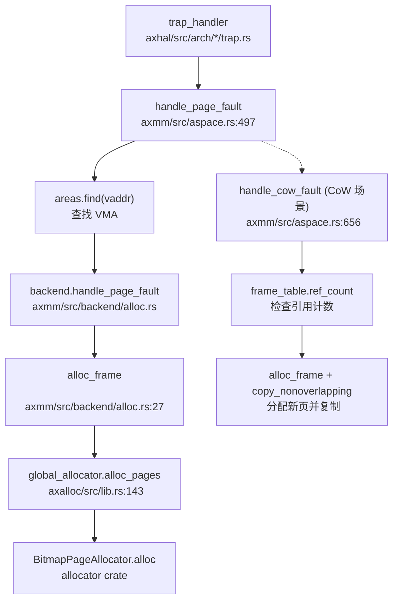
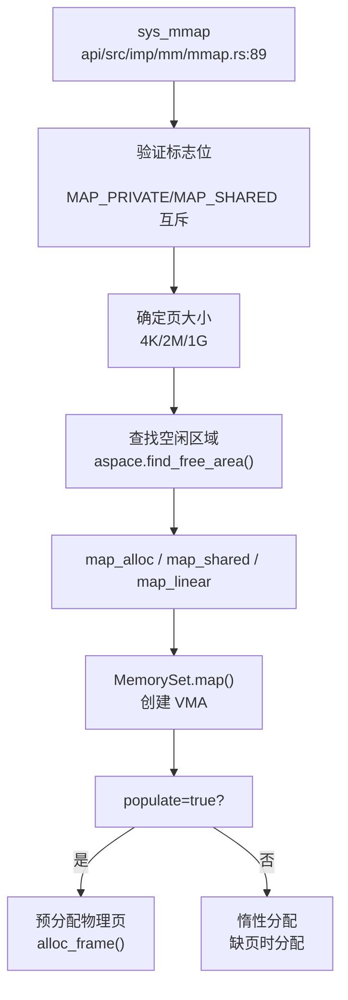
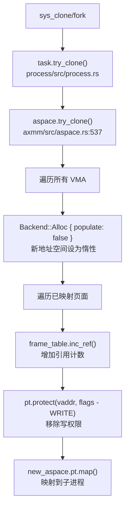

现在我已经收集了足够的信息来撰写完整的内存管理分析报告。让我输出最终报告。

## 第 3 章：内存管理（物理/虚拟/分配器）

### 物理内存管理实现

本项目基于 **ArceOS** 框架实现物理内存管理，采用 **两级分配器架构**：

#### 1. 物理页分配器（Page Allocator）

**位置**: `arceos/modules/axalloc/src/lib.rs`

使用 **Bitmap Page Allocator**（位图页分配器）管理物理页帧：

```rust
// arceos/modules/axalloc/src/lib.rs:40-55
pub struct GlobalAllocator {
    balloc: SpinNoIrq<DefaultByteAllocator>,
    palloc: SpinNoIrq<BitmapPageAllocator<PAGE_SIZE>>,
}
```

- **页大小**: 4KB (`PAGE_SIZE = 0x1000`)
- **分配器类型**: 支持多种后端（通过 Cargo 特性切换）：
  - `tlsf`（默认）: TLSF（Two-Level Segregated Fit）字节分配器
  - `slab`: Slab 分配器
  - `buddy`: Buddy System 分配器
- **物理页管理**: 使用 `BitmapPageAllocator<PAGE_SIZE>` 管理 4KB 页帧

**核心接口** (`arceos/modules/axalloc/src/lib.rs:100-160`):
- `alloc_pages(num_pages, align)`: 分配连续页帧
- `dealloc_pages(vaddr, num_pages)`: 释放页帧
- `add_memory(start_vaddr, size)`: 添加物理内存区域

#### 2. 物理帧引用计数

**位置**: `arceos/modules/axmm/src/frameinfo.rs`

实现了简单的物理帧引用计数机制，用于 CoW 和共享内存：

```rust
// arceos/modules/axmm/src/frameinfo.rs:19-25
lazy_static! {
    static ref FRAME_INFO_TABLE: FrameRefTable = FrameRefTable::default();
}

pub(crate) struct FrameRefTable {
    data: Box<[FrameInfo; MAX_FRAME_NUM]>,
}
```

- **MAX_FRAME_NUM**: 由 `axconfig::plat::PHYS_MEMORY_SIZE >> 12` 计算得出
- **引用计数操作**:
  - `inc_ref(paddr)`: 增加引用计数（原子操作）
  - `dec_ref(paddr)`: 减少引用计数，返回更新后的计数
  - `ref_count(paddr)`: 查询当前引用计数

**✅ 已实现**: 物理页帧的引用计数追踪，支持 CoW 和共享内存场景。

---

### 虚拟内存与页表操作

#### 1. 地址空间结构（AddrSpace）

**位置**: `arceos/modules/axmm/src/aspace.rs`

```rust
// arceos/modules/axmm/src/aspace.rs:18-23
pub struct AddrSpace {
    va_range: VirtAddrRange,
    areas: MemorySet<Backend>,
    pt: PageTable,
}
```

**字段说明**:
- `va_range`: 虚拟地址范围（起始和结束地址）
- `areas`: 内存区域集合（`MemorySet<Backend>`），使用 `BTreeMap` 管理 VMA
- `pt`: 页表实例（`PageTable`），来自 `page_table_multiarch` 模块

#### 2. 页表操作接口

**核心方法** (`arceos/modules/axmm/src/aspace.rs:26-56`):
- `page_table()`: 获取页表不可变引用
- `page_table_mut()`: 获取页表可变引用
- `page_table_root()`: 获取页表根物理地址
- `contains_range(start, size)`: 检查地址范围是否在地址空间内

**映射操作**:
- `map_linear()`: 线性映射（虚拟地址与物理地址有固定偏移）
- `map_alloc()`: 分配映射（从全局分配器获取物理页）
- `map_shared()`: 共享映射（用于共享内存）
- `unmap()`: 解除映射
- `protect()`: 修改页表权限

#### 3. 页表后端（Backend）

**位置**: `arceos/modules/axmm/src/backend/mod.rs`

```rust
// arceos/modules/axmm/src/backend/mod.rs:25-50
pub enum Backend {
    Shared {
        shared_frame: Arc<SharedFrame>,
        align: PageSize,
    },
    Linear {
        pa_va_offset: usize,
        align: PageSize,
    },
    Alloc {
        populate: bool,
        align: PageSize,
    },
}
```

**三种映射后端**:
1. **Linear**: 线性映射，用于内核直接映射物理内存
2. **Alloc**: 分配映射，支持惰性分配（`populate=false` 时延迟分配物理页）
3. **Shared**: 共享映射，用于进程间共享内存

---

### 地址空间布局（内核 vs 用户）

#### 1. 内核与用户地址空间分离

**位置**: `core/src/mm.rs`

```rust
// core/src/mm.rs:14-19
pub fn new_user_aspace_empty() -> AxResult<AddrSpace> {
    AddrSpace::new_empty(
        VirtAddr::from_usize(axconfig::plat::USER_SPACE_BASE),
        axconfig::plat::USER_SPACE_SIZE,
    )
}
```

**架构差异** (`core/src/mm.rs:21-32`):
- **x86_64**: 用户地址空间需要复制内核映射（`copy_mappings_from`）
- **aarch64/loongarch64**: 使用独立的页表（TTBR0_EL1/PGDL），无需复制内核映射

#### 2. 用户空间配置

通过 `axconfig::plat` 配置：
- `USER_SPACE_BASE`: 用户空间基地址
- `USER_SPACE_SIZE`: 用户空间大小
- `USER_HEAP_SIZE`: 用户堆大小（用于 `brk` 系统调用）
- `USER_INTERP_BASE`: 动态链接器基地址

#### 3. 内核重映射

**✅ 已实现**: 内核地址空间通过 `kernel_aspace()`（`LazyInit<SpinNoIrq<AddrSpace>>`）全局管理，在系统初始化时建立。

---

### 堆分配器解析

#### 1. 内核堆分配器

**位置**: `arceos/modules/axalloc/src/lib.rs`

注册为全局分配器：

```rust
// arceos/modules/axalloc/src/lib.rs:185-197
impl GlobalAlloc for GlobalAllocator {
    fn alloc(&self, layout: Layout) -> *mut u8 {
        // ...
    }
    fn dealloc(&self, ptr: *mut u8, layout: Layout) {
        // ...
    }
}

#[global_allocator]
static GLOBAL_ALLOCATOR: GlobalAllocator = GlobalAllocator::new();
```

**两级分配策略**:
1. 首先尝试从字节分配器（`balloc`）分配
2. 如果字节分配器空间不足，从页分配器（`palloc`）获取更多页，添加到字节分配器

#### 2. 用户堆管理（brk 系统调用）

**位置**: `api/src/imp/mm/brk.rs`

```rust
// api/src/imp/mm/brk.rs:6-13
#[syscall_trace]
pub fn sys_brk(addr: usize) -> LinuxResult<isize> {
    let mut return_val: isize = current_process_data().get_heap_top() as isize;
    let heap_bottom = current_process_data().get_heap_bottom();
    if addr != 0 && addr >= heap_bottom && addr <= heap_bottom + axconfig::plat::USER_HEAP_SIZE {
        current_process_data().set_heap_top(addr);
        return_val = addr as isize;
    }
    Ok(return_val)
}
```

**🔸 桩函数**: `sys_brk` 仅调整堆顶指针，**不实际分配物理页**。这是典型的惰性分配策略（仅调整边界，不立即分配物理页）。

**验证**:
- 检查范围：`heap_bottom <= addr <= heap_bottom + USER_HEAP_SIZE`
- 返回当前堆顶地址（调用前）或新堆顶地址（成功后）

---

### 用户指针安全验证

#### 1. 用户指针类型系统

**位置**: `api/src/ptr.rs`

定义了类型安全的用户指针包装器：

```rust
// api/src/ptr.rs:368-369
pub type UserOutPtr<T> = UserPtr<T>;
pub type UserInPtr<T> = UserConstPtr<T>;
```

**类型**:
- `UserInPtr<T>`: 用户空间到内核的输入指针（只读）
- `UserOutPtr<T>`: 内核到用户空间的输出指针（只写）
- `UserInOutPtr<T>`: 双向指针

#### 2. 区域验证机制

**位置**: `api/src/ptr.rs:11-35`

```rust
// api/src/ptr.rs:11-32
fn check_region(start: VirtAddr, layout: Layout, access_flags: MappingFlags) -> LinuxResult<()> {
    let align = layout.align();
    if start.as_usize() & (align - 1) != 0 {
        return Err(LinuxError::EFAULT);
    }

    let task = current_process_data();
    if start.checked_add(layout.size()).is_none() {
        return Err(LinuxError::EFAULT);
    }
    let mut aspace = task.addr_space.lock();

    if !aspace.check_region_access(
        VirtAddrRange::from_start_size(start, layout.size()),
        access_flags,
    ) {
        return Err(LinuxError::EFAULT);
    }

    // 预填充页面（触发缺页分配）
    let page_start = start.align_down_4k();
    let page_end = (start + layout.size()).align_up_4k();
    aspace.populate_area(page_start, page_end - page_start, access_flags)?;

    Ok(())
}
```

**验证步骤**:
1. **对齐检查**: 验证地址是否符合类型对齐要求
2. **溢出检查**: 验证 `start + size` 不会溢出
3. **区域访问检查**: 调用 `aspace.check_region_access()` 验证地址范围在用户空间内且有相应权限
4. **页面预填充**: 调用 `populate_area()` 确保页面已映射（触发惰性分配）

**✅ 已实现**: 完整的用户指针验证机制，在所有系统调用入口处强制执行。

---

### 缺页异常处理流程

#### 1. 缺页异常入口

**位置**: `arceos/modules/axmm/src/aspace.rs`

```rust
// arceos/modules/axmm/src/aspace.rs:497-535
pub fn handle_page_fault(&mut self, vaddr: VirtAddr, access_flags: MappingFlags) -> bool {
    if !self.va_range.contains(vaddr) {
        return false;
    }
    if let Some(area) = self.areas.find(vaddr) {
        let orig_flags = area.flags();
        if orig_flags.contains(access_flags) {
            // 共享页或 CoW 场景
            #[cfg(feature = "cow")]
            if access_flags.contains(MappingFlags::WRITE)
                && let Ok((paddr, _, page_size)) = self.pt.query(vaddr)
            {
                return Self::handle_cow_fault(
                    vaddr, paddr, orig_flags, page_size, &mut self.pt,
                );
            }

            return area.backend().handle_page_fault(vaddr, orig_flags, &mut self.pt);
        }
    }
    false
}
```

#### 2. 缺页处理调用链

**完整流程**（基于代码分析）:

```
trap_handler (axhal)
  └─→ handle_page_fault (AddrSpace)
       ├─→ 检查地址是否在有效范围内
       ├─→ 查找对应的 VMA (area)
       ├─→ [CoW 场景] handle_cow_fault()
       └─→ backend.handle_page_fault_alloc()
            └─→ alloc_frame() (分配物理页)
                 └─→ global_allocator().alloc_pages()
```

#### 3. 惰性分配实现

**位置**: `arceos/modules/axmm/src/backend/alloc.rs`

```rust
// arceos/modules/axmm/src/backend/alloc.rs:88-120
pub(crate) fn map_alloc(
    start: VirtAddr, size: usize, flags: MappingFlags,
    pt: &mut PageTable, populate: bool, align: PageSize,
) -> bool {
    if populate {
        // 预分配所有物理页
        for vaddr in PageIterWrapper::new(...) {
            let paddr = alloc_frame(true, align)?;
            pt.map(vaddr, paddr, align, flags)?;
        }
    }
    // populate=false 时，仅创建 VMA，物理页在缺页时分配
    true
}
```

**✅ 已实现**: 惰性分配（Lazy Allocation）通过 `populate=false` 参数实现，物理页在首次访问时通过缺页异常分配。

---

### 进程级映射管理

#### 1. VMA 管理结构

**位置**: `arceos/modules/axmm/src/aspace.rs`

使用 `memory_set` crate 的 `MemorySet<Backend>` 管理 VMA：

```rust
// arceos/modules/axmm/src/aspace.rs:7
use memory_set::{MemoryArea, MemorySet};

pub struct AddrSpace {
    areas: MemorySet<Backend>,
    // ...
}
```

**MemoryArea 结构**（来自 `memory_set` crate）:
- `start()`: VMA 起始地址
- `size()`: VMA 大小
- `flags()`: 访问权限（读/写/执行/用户）
- `backend()`: 映射后端（Linear/Alloc/Shared）

#### 2. 反向映射表（rmap）

**❌ 未实现**: 搜索 `rmap|reverse_map|page_to_vma|ReverseMap` 未找到任何匹配。

当前实现**没有**物理页到虚拟页的反向映射机制。物理帧引用计数（`FrameInfo`）仅追踪引用次数，不记录哪些虚拟地址映射了该物理页。

---

### 高级内存特性清单

#### 1. 写时复制（Copy-on-Write）

**位置**: `arceos/modules/axmm/src/aspace.rs`

**✅ 已实现**（需要启用 `cow` 特性）:

```rust
// arceos/modules/axmm/src/aspace.rs:656-695
#[cfg(feature = "cow")]
fn handle_cow_fault(
    vaddr: VirtAddr, paddr: PhysAddr, flags: MappingFlags,
    align: PageSize, pt: &mut PageTable,
) -> bool {
    let paddr = paddr.align_down(align);

    match frame_table().ref_count(paddr) {
        0 => unreachable!(),
        1 => pt.protect(vaddr, flags).map(|(_, tlb)| tlb.flush()).is_ok(),
        2.. => {
            // 引用计数 > 1，需要复制
            match alloc_frame(false, align) {
                Some(new_frame) => {
                    unsafe {
                        core::ptr::copy_nonoverlapping(
                            phys_to_virt(paddr).as_ptr(),
                            phys_to_virt(new_frame).as_mut_ptr(),
                            align.into(),
                        )
                    };
                    dealloc_frame(paddr, align);
                    pt.remap(vaddr, new_frame, flags).map(|(_, tlb)| tlb.flush()).is_ok()
                }
                None => false,
            }
        }
    }
}
```

**CoW 触发场景**:
1. `fork()` 时复制地址空间（`try_clone()`）
2. 写保护页面被写入时（`handle_page_fault()` 检测 `WRITE` 访问）
3. `mprotect()` 修改权限时

**验证**: `arceos/modules/axmm/Cargo.toml` 中定义了 `cow = ["dep:lazy_static"]` 特性。

#### 2. 懒分配（Lazy Allocation）

**✅ 已实现**:

通过 `Backend::Alloc { populate: false }` 实现：

```rust
// arceos/modules/axmm/src/aspace.rs:180-198
pub fn map_alloc(
    &mut self, start: VirtAddr, size: usize,
    flags: MappingFlags, populate: bool, align: PageSize,
) -> AxResult {
    let area = MemoryArea::new(start, size, flags, Backend::new_alloc(populate, align));
    self.areas.map(area, &mut self.pt, false)?;
    Ok(())
}
```

**应用场景**:
- `mmap()` 匿名映射（`MAP_ANONYMOUS`）时 `populate=false`
- `brk` 扩展堆时仅调整边界，不分配物理页

#### 3. 共享内存管理（SharedMem）

**位置**: `api/src/interface/mm/shm.rs` + `core/src/shared_memory.rs`

**✅ 已实现**:

**系统调用**:
- `sys_shmget()`: 创建/获取共享内存段
- `sys_shmat()`: 附加共享内存到进程地址空间
- `sys_shmdt()`: 分离共享内存
- `sys_shmctl()`: 控制共享内存（仅部分实现）

**数据结构** (`core/src/shared_memory.rs:29-37`):
```rust
pub struct SharedMemoryManager {
    mem_map: Mutex<BTreeMap<u32, Arc<SharedMemory>>>,
    next_key: AtomicU32,
}
```

**关键实现**:
- 使用 `BTreeMap<u32, Arc<SharedMemory>>` 管理共享内存段（O(log n) 查找）
- `Arc<SharedMemory>` 实现引用计数
- `sys_shmdt()` 仅从进程映射中移除，**不删除共享内存段**

**IPC_RMID 删除策略** (`api/src/interface/mm/shm.rs:124-130`):
```rust
// IPC_RMID
if SHARED_MEMORY_MANAGER.delete(shared_memory.key) {
    Ok(0)
} else {
    Err(LinuxError::EINVAL)
}
```

**🔸 部分实现**: `sys_shmctl()` 的 `IPC_STAT` 操作返回 `ENOSYS`（未实现）。

**IPC_RMID 行为**: **立即删除**共享内存段（从 `BTreeMap` 中移除），`Arc` 引用计数会在最后一个引用释放时自动 dealloc 物理页。

#### 4. 交换区/页面置换（Swap）

**❌ 未实现**: 搜索 `swap_out|swap_in|swap` 仅找到 `/proc/meminfo` 中的统计信息展示（硬编码为 0），未找到实际的交换实现。

#### 5. 大页支持（Huge Page）

**✅ 已实现**:

**位置**: `api/src/imp/mm/mmap.rs`

```rust
// api/src/imp/mm/mmap.rs:109-120
let page_size = if map_flags.contains(MmapFlags::HUGETLB) {
    if map_flags.contains(MmapFlags::HUGE_1GB) {
        PageSize::Size1G
    } else if map_flags.contains(MmapFlags::HUGE_2MB) {
        PageSize::Size2M
    } else {
        error!("[sys_mmap] HUGETLB flag is set, but no supported huge page size is specified.");
        return Err(LinuxError::EINVAL);
    }
} else {
    PageSize::Size4K
};
```

**支持的大页尺寸**:
- 2MB (`PageSize::Size2M`)
- 1GB (`PageSize::Size1G`)

**标志位**:
- `MAP_HUGETLB`: 请求大页
- `MAP_HUGE_2MB`: 指定 2MB 大页
- `MAP_HUGE_1GB`: 指定 1GB 大页

#### 6. 零拷贝与 mmap

**mmap 实现**:

**✅ 已实现**（完整功能）:

**位置**: `api/src/imp/mm/mmap.rs`

**支持的标志**:
- `MAP_SHARED` / `MAP_PRIVATE`: 共享/私有映射
- `MAP_FIXED` / `MAP_FIXED_NOREPLACE`: 固定地址映射
- `MAP_ANONYMOUS`: 匿名映射（不关联文件）
- `MAP_STACK`: 栈映射
- `MAP_HUGETLB` + `MAP_HUGE_2MB/1GB`: 大页支持

**文件映射逻辑** (`api/src/imp/mm/mmap.rs:151-180`):
```rust
let populate = fd > 0 && !map_flags.contains(MmapFlags::MAP_ANONYMOUS);
// ...
if populate {
    let file = File::from_fd(fd)?;
    let file_size = file.status()?.size as usize;
    // 读取文件内容到映射区域
    let mut buf = vec![0u8; length];
    file.read_at(&mut buf, offset as _)?;
    aspace.write(start_addr, page_size, &buf)?;
}
```

**零拷贝 IO**:

**🔸 部分实现**: `sendfile()` / `splice()` / `copy_file_range()` 已实现，但**不是真正的零拷贝**。

**位置**: `api/src/imp/fs/io.rs`

```rust
// api/src/imp/fs/io.rs:105-125
let buf_size = count.min(40960);
let mut buf = vec![0u8; buf_size];
let mut transferred = 0;

while transferred < count {
    // 读取到内核缓冲区
    let read_len = match &in_file {
        FileWrapper::FileLike(in_file) => in_file.read(buffer)?,
        FileWrapper::FileLikeSeekable(in_file) => in_file.inner().read_at(buffer, ...)?,
    };
    // 从内核缓冲区写入
    let write_len = match &out_file {
        FileWrapper::FileLike(out_file) => out_file.write(&buffer[..read_len])?,
        FileWrapper::FileLikeSeekable(out_file) => out_file.inner().write_at(&buffer[..read_len], ...)?,
    };
    transferred += write_len;
}
```

**问题**: 使用了内核缓冲区（`buf = vec![0u8; buf_size]`），数据需要从源文件读到内核缓冲区，再写入目标文件，**不是真正的零拷贝**（真正的零拷贝应使用 DMA 或页表重映射）。

---

### 关键代码片段与调用链分析

#### 1. 缺页异常完整调用链



#### 2. mmap 系统调用流程



#### 3. fork() 时的 CoW 实现



---

### 内存管理特性总结表

| 特性 | 状态 | 实现位置 | 备注 |
|------|------|----------|------|
| 物理页分配 | ✅ 已实现 | `arceos/modules/axalloc/` | Bitmap + TLSF/Slab/Buddy |
| 虚拟地址空间 | ✅ 已实现 | `arceos/modules/axmm/src/aspace.rs` | `AddrSpace` + `MemorySet` |
| 页表管理 | ✅ 已实现 | `page_table_multiarch` 模块 | 多架构支持 |
| 内核/用户空间分离 | ✅ 已实现 | `core/src/mm.rs` | 架构差异化处理 |
| 全局堆分配器 | ✅ 已实现 | `arceos/modules/axalloc/` | `GlobalAllocator` |
| brk/sbrk | 🔸 桩函数 | `api/src/imp/mm/brk.rs` | 仅调整指针，不分配物理页 |
| 用户指针验证 | ✅ 已实现 | `api/src/ptr.rs` | `UserInPtr`/`UserOutPtr` + `check_region` |
| 缺页异常处理 | ✅ 已实现 | `arceos/modules/axmm/src/aspace.rs:497` | 完整调用链 |
| 惰性分配 | ✅ 已实现 | `arceos/modules/axmm/src/backend/alloc.rs` | `populate=false` |
| 写时复制 (CoW) | ✅ 已实现 | `arceos/modules/axmm/src/aspace.rs:656` | 需启用 `cow` 特性 |
| 共享内存 (shm) | ✅ 已实现 | `api/src/interface/mm/shm.rs` | BTreeMap + Arc |
| IPC_RMID | ✅ 已实现 | `api/src/interface/mm/shm.rs:124` | 立即删除 |
| IPC_STAT | 🔸 未实现 | `api/src/interface/mm/shm.rs:132` | 返回 `ENOSYS` |
| 反向映射表 (rmap) | ❌ 未实现 | - | 无物理页到虚拟页的映射 |
| 交换区 (Swap) | ❌ 未实现 | - | 仅 `/proc/meminfo` 展示 |
| 大页 (HugePage) | ✅ 已实现 | `api/src/imp/mm/mmap.rs:109` | 2MB/1GB 支持 |
| mmap | ✅ 已实现 | `api/src/imp/mm/mmap.rs:89` | 完整标志支持 |
| 零拷贝 (sendfile) | 🔸 部分实现 | `api/src/imp/fs/io.rs:59` | 使用内核缓冲区，非真正零拷贝 |
| mprotect | ✅ 已实现 | `api/src/imp/mm/mmap.rs:236` | 权限修改 |
| mremap | ❌ 未实现 | - | 搜索未找到 |
| madvise | 🔸 桩函数 | `src/syscall.rs:491` | `stub_bypass` |

---

### 设计评价

**优点**:
1. **模块化设计**: 物理分配器（`axalloc`）与虚拟内存管理（`axmm`）分离，职责清晰
2. **惰性分配**: 通过 `populate` 参数灵活控制预分配策略
3. **类型安全**: `UserInPtr`/`UserOutPtr` 提供编译期用户指针检查
4. **CoW 优化**: 引用计数 + 延迟复制，减少 `fork()` 开销
5. **多架构支持**: 页表模块支持 x86_64、aarch64、riscv64、loongarch64

**不足**:
1. **缺少反向映射**: 无法高效实现页面回收、迁移等高级功能
2. **无交换支持**: 物理内存受限场景下可能 OOM
3. **零拷贝不彻底**: `sendfile()` 仍使用内核缓冲区拷贝
4. **shmctl 不完整**: `IPC_STAT` 等操作未实现

**建议改进**:
1. 实现 rmap 机制，支持更高效的页面管理
2. 添加 swap 后端，支持内存超卖
3. 优化 `sendfile()` 使用页表重映射实现真正零拷贝
4. 完善 `sys_shmctl()` 的统计信息返回
