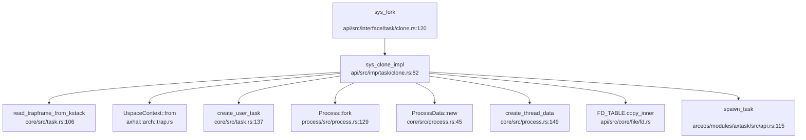
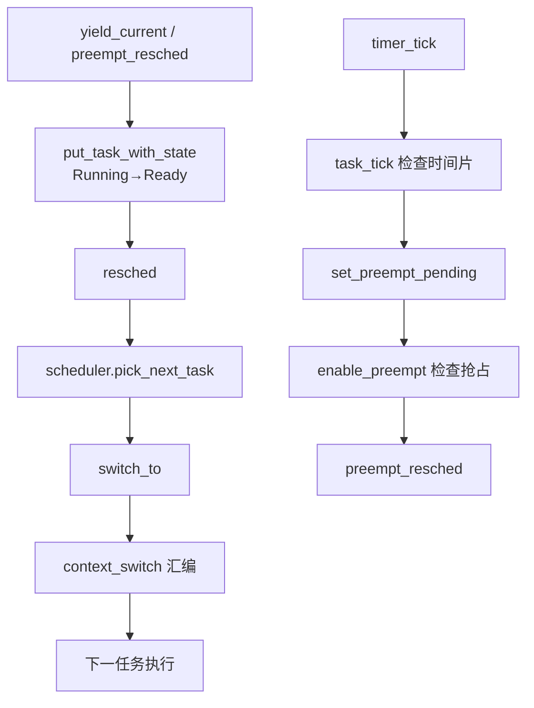

现在我已经收集了足够的信息。让我撰写完整的第 4 章报告。

## 第 4 章：进程/线程与调度机制

### 任务模型与核心数据结构

本操作系统采用 **三层任务模型**：`Process`（进程）- `Thread`（线程）- `TaskInner`（调度实体），分别对应 POSIX 语义的进程控制块、线程控制块和内核调度实体。

#### Process 结构体（进程控制块）

**位置**: `process/src/process.rs:10-18`

```rust
pub struct Process {
    pid: Pid,
    threads: Mutex<BTreeMap<Pid, Arc<Thread>>>,
    process_group: Mutex<Weak<ProcessGroup>>,
    children: Mutex<BTreeMap<Pid, Arc<Process>>>,
    parent: Mutex<Weak<Process>>,
    is_zombie: AtomicBool,
    exit_code: AtomicI32,
}
```

**字段说明**:
- `pid`: 进程标识符，由全局原子计数器 `NEXT_PID` 分配
- `threads`: 该进程包含的所有线程（`BTreeMap<Pid, Arc<Thread>>`）
- `process_group`: 所属进程组的弱引用
- `children`: 子进程表
- `parent`: 父进程弱引用
- `is_zombie`: 僵尸状态标志
- `exit_code`: 退出码

#### Thread 结构体（线程控制块）

**位置**: `process/src/thread.rs:7-10`

```rust
pub struct Thread {
    tid: Pid,
    process: Weak<Process>,
}
```

**说明**: 线程模型极为精简，仅包含线程 ID 和所属进程的弱引用。线程 ID 与进程 ID 共享同一命名空间（主线程的 `tid == pid`）。

#### ProcessData 结构体（进程资源数据）

**位置**: `core/src/process.rs:19-42`

```rust
pub struct ProcessData {
    pub command_line: Mutex<Vec<String>>,
    pub addr_space: Arc<Mutex<AddrSpace>>,
    heap_bottom: AtomicUsize,
    heap_top: AtomicUsize,
    pub resource_limits: Arc<Mutex<ResourceLimits>>,
    pub child_exit_wq: WaitQueue,
    pub exit_signal: Option<Signo>,
    pub signal: Arc<ProcessSignalManager<RawMutex, WaitQueueWrapper>>,
    pub futex_table: Mutex<BTreeMap<usize, Arc<WaitQueue>>>,
    pub shared_memory: Mutex<BTreeMap<VirtAddr, Arc<SharedMemory>>>,
}
```

**关键字段**:
- `addr_space`: 地址空间（所有线程共享）
- `resource_limits`: POSIX 资源限制（16 种资源类型）
- `signal`: 进程级信号管理器
- `futex_table`: Futex 等待队列表
- `child_exit_wq`: 子进程退出等待队列

#### ThreadData 结构体（线程私有数据）

**位置**: `core/src/process.rs:105-124`

```rust
pub struct ThreadData {
    tid: Pid,
    pub process_data: Arc<ProcessData>,
    pub namespace: AxNamespace,
    pub addr_clear_child_tid: AtomicUsize,
    pub addr_set_child_tid: AtomicUsize,
    pub signal: ThreadSignalManager<RawMutex, WaitQueueWrapper>,
}
```

**说明**: 
- `namespace`: 资源命名空间（包含文件描述符表、当前工作目录等）
- `signal`: 线程级信号管理器
- `addr_clear_child_tid`: 用于 `CLONE_CHILD_CLEARTID` 的 futex 地址

#### TaskInner 结构体（调度实体）

**位置**: `arceos/modules/axtask/src/task.rs:33-78`

```rust
pub struct TaskInner {
    id: TaskId,
    name: UnsafeCell<String>,
    is_idle: bool,
    is_init: bool,
    entry: Option<*mut dyn FnOnce()>,
    state: AtomicU8,
    cpumask: SpinNoIrq<AxCpuMask>,
    in_wait_queue: AtomicBool,
    #[cfg(feature = "smp")]
    on_cpu: AtomicBool,
    #[cfg(feature = "preempt")]
    need_resched: AtomicBool,
    #[cfg(feature = "preempt")]
    preempt_disable_count: AtomicUsize,
    exit_code: AtomicI32,
    wait_for_exit: WaitQueue,
    kstack: Option<TaskStack>,
    ctx: UnsafeCell<TaskContext>,
    task_ext: AxTaskExt,
    #[cfg(feature = "tls")]
    tls: TlsArea,
}
```

**TaskExt 扩展数据**（`core/src/task.rs:18-24`）:
```rust
pub struct TaskExt {
    pub time: RefCell<TimeStat>,      // 时间统计
    pub thread: Arc<Thread>,          // 对应的 POSIX 线程
    pub thread_data: Arc<ThreadData>, // 线程私有数据
}
```

---

### 调度算法与策略（代码证据）

本系统基于 **ArceOS 框架** 的模块化调度器，支持三种调度策略，通过 Cargo 特性编译时选择：

**位置**: `arceos/modules/axtask/src/api.rs:28-41`

```rust
cfg_if::cfg_if! {
    if #[cfg(feature = "sched_rr")] {
        const MAX_TIME_SLICE: usize = 5;
        pub(crate) type AxTask = scheduler::RRTask<TaskInner, MAX_TIME_SLICE>;
        pub(crate) type Scheduler = scheduler::RRScheduler<TaskInner, MAX_TIME_SLICE>;
    } else if #[cfg(feature = "sched_cfs")] {
        pub(crate) type AxTask = scheduler::CFSTask<TaskInner>;
        pub(crate) type Scheduler = scheduler::CFScheduler<TaskInner>;
    } else {
        // 默认：FIFO
        pub(crate) type AxTask = scheduler::FifoTask<TaskInner>;
        pub(crate) type Scheduler = scheduler::FifoScheduler<TaskInner>;
    }
}
```

#### 调度策略分类

| 特性标志 | 算法 | 说明 |
|---------|------|------|
| `sched_rr` | **Round-Robin** | 时间片轮转抢占式调度，时间片 = 5 tick |
| `sched_cfs` | **CFS** | 完全公平调度器（基于红黑树 vruntime） |
| 无（默认） | **FIFO** | 协作式先进先出调度 |

#### 调度器核心流程

**调度入口**: `arceos/modules/axtask/src/run_queue.rs:504-516`

```rust
fn resched(&mut self) {
    let next = self
        .scheduler
        .lock()
        .pick_next_task()  // 调度器选择下一任务
        .unwrap_or_else(|| unsafe {
            IDLE_TASK.current_ref_raw().get_unchecked().clone()
        });
    self.switch_to(crate::current(), next);
}
```

**时间片 tick 处理**: `arceos/modules/axtask/src/run_queue.rs:273-279`

```rust
pub fn scheduler_timer_tick(&mut self) {
    let curr = &self.current_task;
    if !curr.is_idle() && self.inner.scheduler.lock().task_tick(curr.as_task_ref()) {
        #[cfg(feature = "preempt")]
        curr.set_preempt_pending(true);  // 标记需要抢占
    }
}
```

**优先级设置 API**: `arceos/modules/axtask/src/api.rs:145-154`
```rust
pub fn set_priority(prio: isize) -> bool {
    current_run_queue::<NoPreemptIrqSave>().set_current_priority(prio)
}
```

> **注意**: `pick_next_task` 的具体实现位于 `scheduler` crate（外部依赖），本仓库未包含其源码。但通过类型定义可确认系统支持 RR/CFS/FIFO 三种策略。

---

### 任务状态机

**位置**: `arceos/modules/axtask/src/task.rs:23-31`

```rust
#[repr(u8)]
#[derive(Debug, Clone, Copy, Eq, PartialEq)]
pub enum TaskState {
    Running = 1,   // 正在 CPU 上运行
    Ready = 2,     // 在就绪队列中等待
    Blocked = 3,   // 在等待队列中阻塞
    Exited = 4,    // 已退出，等待回收
}
```

#### 状态流转图

```mermaid
graph TD
    A[Ready] -->|schedule()| B[Running]
    B -->|yield/preempt| A
    B -->|wait/blocked_resched| C[Blocked]
    C -->|notify_one/all| A
    B -->|exit| D[Exited]
    D -->|GC| E[dropped]
```

**状态转换实现**:
- **Ready → Running**: `resched()` 调用 `switch_to()` 设置 `next_task.set_state(TaskState::Running)`
- **Running → Ready**: `yield_current()` 调用 `put_task_with_state(curr, Running, false)`
- **Running → Blocked**: `blocked_resched()` 将任务加入等待队列并设置 `Blocked` 状态
- **Blocked → Ready**: `WaitQueue::notify_one/all()` 唤醒任务并重新入队
- **Running → Exited**: `exit_current()` 设置 `Exited` 状态并加入 `EXITED_TASKS` 列表

**僵尸进程处理**:
- 进程退出时调用 `Process::exit()` 设置 `is_zombie = true`
- 父进程通过 `waitpid()` 回收后调用 `Process::release()` 从进程表移除

---

### 上下文切换实现（汇编分析）

系统支持多架构，上下文切换汇编因架构而异。以下分析 x86_64 和 RISC-V 的实现。

#### x86_64 架构

**位置**: `arceos/modules/axhal/src/arch/x86_64/context.rs:452-470`

```rust
#[unsafe(naked)]
unsafe extern "C" fn context_switch(_current_stack: &mut u64, _next_stack: &u64) {
    naked_asm!(
        "
        .code64
        push    rbp
        push    rbx
        push    r12
        push    r13
        push    r14
        push    r15
        mov     [rdi], rsp      // 保存当前栈顶到 *current_stack

        mov     rsp, [rsi]      // 恢复下一任务栈顶
        pop     r15
        pop     r14
        pop     r13
        pop     r12
        pop     rbx
        pop     rbp
        ret
        "
    )
}
```

**保存的寄存器**（共 7 个）:
- `rbp`, `rbx`, `r12`, `r13`, `r14`, `r15`（callee-saved 寄存器）
- `rsp`（通过栈指针隐式保存）

**切换流程**:
1. 将 callee-saved 寄存器压入当前栈
2. 将当前 `rsp` 保存到 `*current_stack` 指针
3. 从 `*next_stack` 加载新栈顶到 `rsp`
4. 从新栈弹出寄存器
5. `ret` 跳转到新任务的指令流

#### RISC-V 架构

**位置**: `arceos/modules/axhal/src/arch/riscv/context.rs:467-505`

```rust
#[unsafe(naked)]
unsafe extern "C" fn context_switch(_current_task: &mut TaskContext, _next_task: &TaskContext) {
    naked_asm!(
        "
        // 保存旧上下文 (callee-saved 寄存器)
        STR     ra, a0, 0       // 保存 ra 到 current_task[0]
        STR     sp, a0, 1       // 保存 sp 到 current_task[1]
        STR     s0, a0, 2
        STR     s1, a0, 3
        STR     s2, a0, 4
        STR     s3, a0, 5
        STR     s4, a0, 6
        STR     s5, a0, 7
        STR     s6, a0, 8
        STR     s7, a0, 9
        STR     s8, a0, 10
        STR     s9, a0, 11
        STR     s10, a0, 12
        STR     s11, a0, 13

        // 恢复新上下文
        LDR     s11, a1, 13
        LDR     s10, a1, 12
        LDR     s9, a1, 11
        LDR     s8, a1, 10
        LDR     s7, a1, 9
        LDR     s6, a1, 8
        LDR     s5, a1, 7
        LDR     s4, a1, 6
        LDR     s3, a1, 5
        LDR     s2, a1, 4
        LDR     s1, a1, 3
        LDR     s0, a1, 2
        LDR     sp, a1, 1
        LDR     ra, a1, 0
        ret
        ",
    )
}
```

**保存的寄存器**（共 15 个）:
- `ra`（返回地址）
- `sp`（栈指针）
- `s0-s11`（callee-saved 寄存器）

**TaskContext 布局**（`arceos/modules/axhal/src/arch/riscv/context.rs:296-326`）:
```rust
#[repr(C)]
pub struct TaskContext {
    ra: usize,      // 返回地址
    sp: usize,      // 栈指针
    s: [usize; 12], // s0-s11
    fp_state: FpState, // 浮点状态（可选）
}
```

---

### 进程间通信与同步（Signal/Futex）

#### 信号机制（Signal）

**实现状态**: ✅ **已实现**

**核心组件**:
- **信号管理器**: `axsignal::ProcessSignalManager` / `ThreadSignalManager`
- **信号集**: `SignalSet`（位图表示）
- **信号动作**: `SignalActions`（数组索引为 `Signo`）

**系统调用实现**:

**1. `sys_rt_sigaction`**（`api/src/imp/task/signal.rs:123-142`）:
```rust
pub fn sys_rt_sigaction(
    signo: u32,
    act: UserConstPtr<kernel_sigaction>,
    oldact: UserPtr<kernel_sigaction>,
    sigsetsize: usize,
) -> LinuxResult<isize> {
    let signo = parse_signo(signo)?;
    if matches!(signo, Signo::SIGKILL | Signo::SIGSTOP) {
        return Err(LinuxError::EINVAL);
    }
    let signal = &current_process_data().signal;
    let mut actions = signal.actions.lock();
    if let Some(oldact) = oldact.nullable(UserPtr::get)? {
        actions[signo].to_ctype(unsafe { &mut *oldact });
    }
    if let Some(act) = act.nullable(UserConstPtr::get)? {
        actions[signo] = unsafe { (*act).try_into()? };
    }
    Ok(0)
}
```

**2. `sys_rt_sigprocmask`**（`api/src/imp/task/signal.rs:93-115`）:
```rust
pub fn sys_rt_sigprocmask(
    how: i32,
    set: UserConstPtr<SignalSet>,
    oldset: UserPtr<SignalSet>,
    sigsetsize: usize,
) -> LinuxResult<isize> {
    current_thread_data()
        .signal
        .with_blocked_mut::<LinuxResult<_>>(|blocked| {
            if let Some(oldset) = oldset.nullable(UserPtr::get)? {
                unsafe { *oldset = *blocked };
            }
            if let Some(set) = set.nullable(UserConstPtr::get)? {
                let set = unsafe { *set };
                match how as u32 {
                    SIG_BLOCK => *blocked |= set,
                    SIG_UNBLOCK => *blocked &= !set,
                    SIG_SETMASK => *blocked = set,
                    _ => return Err(LinuxError::EINVAL),
                }
            }
            Ok(())
        })?;
    Ok(0)
}
```

**3. 信号检查与分发**（`api/src/imp/task/signal.rs:25-67`）:
```rust
pub fn check_signals(tf: &mut TrapFrame, restore_blocked: Option<SignalSet>) -> bool {
    let signal = &current_thread_data().signal;
    let Some((sig, os_action)) = signal.check_signals(tf, restore_blocked) else {
        return false;
    };
    match os_action {
        SignalOSAction::Terminate => {
            sys_exit_impl(0, signo as u32, true);
        }
        SignalOSAction::CoreDump => {
            sys_exit_impl(0, CORE_DUMP + signo as u32, true);
        }
        SignalOSAction::Handler => {
            // 设置用户态信号处理函数入口
        }
        // ...
    }
    true
}
```

**信号触发机制**:
- 在 `POST_TRAP` 陷阱处理后回调中检查信号（`api/src/imp/task/signal.rs:70-75`）
- 从用户态返回内核态时自动检查待处理信号

**进程组信号**:
- `send_signal_process_group(pgid, sig)` 向进程组内所有进程发送信号
- `sys_kill(pid, sig)` 支持向进程/进程组/会话发送信号

#### Futex（快速用户态互斥锁）

**实现状态**: ✅ **已实现**

**位置**: `api/src/imp/task/futex.rs`

**系统调用**: `sys_futex(uaddr, futex_op, value, timeout, uaddr2, value3)`

**支持的操作**:

| 操作 | 实现状态 | 说明 |
|-----|---------|------|
| `FUTEX_WAIT` | ✅ 已实现 | 阻塞等待 futex 值变化 |
| `FUTEX_WAKE` | ✅ 已实现 | 唤醒等待的线程 |
| `FUTEX_REQUEUE` | ✅ 已实现 | 将等待线程从一个 futex 移动到另一个 |
| `FUTEX_CMP_REQUEUE` | ✅ 已实现 | 带比较的 requeue |
| `FUTEX_WAIT_BITSET` | 🔸 部分实现 | 仅支持 `FUTEX_BITSET_MATCH_ANY` |
| `FUTEX_WAKE_BITSET` | 🔸 部分实现 | 仅支持 `FUTEX_BITSET_MATCH_ANY` |

**核心实现**（`api/src/imp/task/futex.rs:17-62`）:

```rust
pub fn sys_futex(
    uaddr: UserInPtr<u32>,
    futex_op: u32,
    value: u32,
    timeout: UserInPtr<timespec>,
    uaddr2: UserInPtr<u32>,
    value3: u32,
) -> LinuxResult<isize> {
    let futex_table = &current_process_data().futex_table;
    let addr = uaddr.address().as_usize();
    let command = futex_op & (FUTEX_CMD_MASK as u32);
    
    match command {
        FUTEX_WAIT => {
            if *uaddr.get_as_ref()? != value {
                return Err(LinuxError::EAGAIN);
            }
            let wq = futex_table
                .lock()
                .entry(addr)
                .or_insert_with(new_futex)
                .clone();
            if !timeout.is_null() {
                wq.wait_timeout(timespec_to_timevalue(*timeout.get_as_ref()?), false);
            } else {
                wq.wait();
            }
            Ok(0)
        }
        FUTEX_WAKE => {
            let wq = futex_table.lock().get(&addr).cloned();
            let mut count = 0;
            if let Some(wq) = wq {
                for _ in 0..value {
                    if !wq.notify_one(false) { break; }
                    count += 1;
                }
            }
            axtask::yield_now();
            Ok(count)
        }
        // ...
    }
}
```

**Futex 表结构**:
- 每个进程维护一个 `BTreeMap<usize, Arc<WaitQueue>>`
- 键为用户空间地址，值为等待队列

---

### 关键流程追踪（Fork/Exec/Schedule/Exit）

#### 1. `fork()` 流程

**系统调用入口**: `api/src/interface/task/clone.rs:120-123`

```rust
#[syscall_trace]
pub fn sys_fork() -> LinuxResult<isize> {
    sys_clone_impl(CloneFlags::empty(), 0, 0, 0, None)
}
```

**调用链**（`lsp_get_call_graph` 分析）:



**关键步骤**（`api/src/imp/task/clone.rs:82-219`）:

1. **复制 TrapFrame**: `read_trapframe_from_kstack()` 从内核栈复制父用户上下文
2. **创建新任务**: `create_user_task()` 创建 `TaskInner` 并初始化 `UspaceContext`
3. **进程/线程分支**:
   - 若 `CLONE_THREAD`: 创建线程（共享地址空间）
   - 否则：创建进程
4. **地址空间处理**:
   ```rust
   let addr_space = if clone_flags.contains(CloneFlags::VM) 
       && !clone_flags.contains(CloneFlags::VFORK) {
       // 共享地址空间（copy Arc）
       current_process_data().addr_space.clone()
   } else {
       // 克隆地址空间（写时复制）
       let mut new_addr_space = addr_space.lock();
       let mut new_as = addr_space.try_clone()?;
       copy_from_kernel(&mut new_as)?;  // 复制内核映射
       Arc::new(Mutex::new(new_as))
   };
   ```
5. **进程创建**: `parent.fork()` 创建子进程 PCB，分配新 PID
6. **文件表处理**:
   ```rust
   if clone_flags.contains(CloneFlags::FILES) {
       FD_TABLE.deref_from(&thread_data.namespace).init_shared(FD_TABLE.share());
   } else {
       FD_TABLE.deref_from(&thread_data.namespace).init_new(FD_TABLE.copy_inner());
   }
   ```
7. **加入调度队列**: `axtask::spawn_task(new_task)`

**地址空间复制验证**:
- 通过 `AddrSpace::try_clone()` 实现页表的写时复制（COW）
- `copy_from_kernel()` 确保内核映射在新地址空间中正确建立

#### 2. `exec()` 流程

**系统调用入口**: `api/src/imp/task/execve.rs:13-69`

**调用链**:
```
sys_execve() → sys_execve_impl() → mm::load_user_app()
```

**关键步骤**:

1. **路径解析**: `resolve_path_at_cwd()` 验证可执行文件存在
2. **多线程检查**: 若进程有多个线程，仅保留主线程（TODO: 杀死其他线程）
3. **清空地址空间**:
   ```rust
   let addr_space = &process_data.addr_space;
   let mut addr_space = addr_space.lock();
   addr_space.unmap_user_areas()?;  // 解映射用户区
   map_trampoline(&mut addr_space)?; // 映射信号跳板页
   axhal::arch::flush_tlb(None);
   ```
4. **加载 ELF**:
   ```rust
   let (entry_point, user_stack_base) = 
       mm::load_user_app(&mut addr_space, &args, &envs)?;
   ```
5. **重置进程属性**:
   ```rust
   *process_data.signal.actions.lock() = Default::default();  // 重置信号处理
   process_data.shared_memory.lock().clear();                 // 清空共享内存
   FD_TABLE.close_on_exec();                                  // 关闭 CLOEXEC 文件描述符
   ```
6. **更新上下文**:
   ```rust
   tf.set_ip(entry_point.as_usize());  // 设置入口点
   tf.set_sp(user_stack_base.as_usize()); // 设置新栈顶
   ```

**ELF 加载细节**: `mm::load_user_app()` 解析 ELF 文件头，加载程序段到内存，设置入口点和用户栈。

#### 3. `schedule()` 流程

**调度触发点**:
1. **主动让出**: `sys_sched_yield()` → `task_yield()` → `yield_current()`
2. **时间片耗尽**: `on_timer_tick()` → `scheduler_timer_tick()` → 设置 `preempt_pending`
3. **阻塞**: `wait_queue.wait()` → `blocked_resched()`
4. **退出**: `exit_current()` → `resched()`

**调度器调用链**（`lsp_get_call_graph` 降级分析）:

```
[⚠️ DEGRADED MODE] schedule 调用链（Grep 静态分析）
入向调用:
  - arceos/modules/axtask/src/run_queue.rs:481 (resched 内部调用)
  - vendor/... (外部 scheduler crate)
```

**完整调度流程**:



**优先级验证**:
- `put_task_with_state` 中注释 `// TODO: priority` 表明 FIFO 模式下未使用优先级
- RR/CFS 模式下，`scheduler.pick_next_task()` 会根据 `priority`/`vruntime` 选择

#### 4. `exit()` 流程

**系统调用入口**: `api/src/imp/task/exit.rs:13-73`

**关键步骤**:

1. **清除子线程 ID**:
   ```rust
   let addr_clear_child_tid = current_thread_data()
       .addr_clear_child_tid.load(Ordering::Relaxed);
   if let Ok(ptr) = addr_clear_child_tid.get() {
       unsafe { ptr.write(0) };
       // 唤醒等待该 futex 的线程
       table.lock().get(&addr).cloned().map(|futex| futex.notify_all(false));
   }
   ```

2. **线程退出**: `current_thread().exit(exit_status)` 从线程表移除

3. **进程退出检查**:
   ```rust
   if process.is_zombie() {
       // 所有线程已退出，发送信号给父进程
       if let Some(parent) = process.get_parent() {
           let signal = parent_data.exit_signal.unwrap_or(Signo::SIGCHLD);
           send_signal_process(parent.get_pid(), SignalInfo::new(signal, SI_KERNEL));
           parent_data.child_exit_wq.notify_all(false);
       }
   }
   ```

4. **进程组退出**（`exit_group=true`）:
   ```rust
   let sig = SignalInfo::new(Signo::SIGKILL, SI_KERNEL);
   for thread in process.get_threads() {
       send_signal_thread(thread.get_tid(), sig.clone());
   }
   ```

5. **调度器退出**: `axtask::exit(exit_code)` → `exit_current()` → 加入 `EXITED_TASKS` 列表

**资源回收**:
- 文件描述符：`close_all_file_like()`
- 进程回收：父进程调用 `waitpid()` 后调用 `Process::release()`
- 任务 GC: `gc_entry()` 定期清理 `EXITED_TASKS`

---

### 进程/线程管理模块扩展

#### 进程组（ProcessGroup）与会话（Session）

**实现状态**: ✅ **已实现**

**位置**: 
- 进程组：`process/src/process_group.rs`
- 会话：`process/src/session.rs`

**ProcessGroup 结构**（`process/src/process_group.rs:9-12`）:
```rust
pub struct ProcessGroup {
    pgid: Pid,
    processes: Mutex<BTreeMap<Pid, Arc<Process>>>,
    pub(crate) session: Weak<Session>,
}
```

**Session 结构**（`process/src/session.rs:7-10`）:
```rust
pub struct Session {
    sid: Pid,
    process_groups: Mutex<BTreeMap<Pid, Arc<ProcessGroup>>>,
}
```

#### 层次结构 ID 规则

**PGID（进程组 ID）分配**:
- **规则**: 进程组 ID = 组长进程的 PID
- **创建**: `Process::create_group()` 以当前进程 PID 作为 PGID 创建新组
- **验证**: `is_group_leader()` 检查 `get_group().get_pgid() == self.pid`

**SID（会话 ID）分配**:
- **规则**: 会话 ID = 会话组长进程的 PGID = 会话组长进程的 PID
- **创建**: `Process::create_session()` 以当前进程 PID 作为 SID 创建新会话
- **验证**: `is_session_leader()` 检查 `get_session().get_sid() == self.pid`

**系统调用**:

**`sys_setpgid(pid, pgid)`**（`api/src/imp/task/thread.rs:30-48`）:
```rust
pub fn sys_setpgid(pid: u32, pgid: u32) -> LinuxResult<isize> {
    let process = if pid == 0 || pid == current_process().get_pid() {
        current_process()
    } else {
        current_process().get_child(pid).ok_or(LinuxError::ESRCH)?
    };
    if pgid > 4194304 {
        return Err(LinuxError::EINVAL);
    }
    if pgid == 0 {
        process.create_group();  // 创建以自身为领导的新组
    } else if !process.move_to_group(pgid) {
        return Err(LinuxError::EPERM);
    }
    Ok(0)
}
```

**`sys_getpgid(pid)`**（`api/src/imp/task/thread.rs:49-55`）:
```rust
pub fn sys_getpgid(pid: u32) -> LinuxResult<isize> {
    let process = if pid == 0 {
        current_process()
    } else {
        get_process(pid).ok_or(LinuxError::ESRCH)?
    };
    Ok(process.get_group().get_pgid() as _)
}
```

**会话创建**:
- `Process::create_session()` 仅在进程**不是**进程组组长时成功
- 创建后，进程成为新会话的领导者，同时成为新进程组的领导者

#### POSIX 资源限制（rlimit）

**实现状态**: ✅ **已实现**

**位置**: 
- 定义：`core/src/resource.rs`
- 系统调用：`api/src/imp/task/resource.rs`

**支持的资源类型**（共 16 种，POSIX 标准）:

```rust
pub enum ResourceLimitType {
    CPU = RLIMIT_CPU,           // 0
    FSIZE = RLIMIT_FSIZE,       // 1
    DATA = RLIMIT_DATA,         // 2
    STACK = RLIMIT_STACK,       // 3
    CORE = RLIMIT_CORE,         // 4
    RSS = RLIMIT_RSS,           // 5
    NPROC = RLIMIT_NPROC,       // 6
    NOFILE = RLIMIT_NOFILE,     // 7
    MEMLOCK = RLIMIT_MEMLOCK,   // 8
    AS = RLIMIT_AS,             // 9
    LOCKS = RLIMIT_LOCKS,       // 10
    SIGPENDING = RLIMIT_SIGPENDING,  // 11
    MSGQUEUE = RLIMIT_MSGQUEUE, // 12
    NICE = RLIMIT_NICE,         // 13
    RTPRIO = RLIMIT_RTPRIO,     // 14
    RTTIME = RLIMIT_RTTIME,     // 15
}
```

**默认限制**（`core/src/resource.rs:67-78`）:
```rust
pub fn new() -> Self {
    let mut limits = [ResourceLimit::new_infinite(); RLIM_NLIMITS as usize];
    limits[ResourceLimitType::STACK as usize] =
        ResourceLimit::new(axconfig::plat::USER_STACK_SIZE as u64, RLIMIT_INFINITY);
    limits[ResourceLimitType::CORE as usize] = ResourceLimit::new(0, RLIMIT_INFINITY);
    limits[ResourceLimitType::NPROC as usize] = ResourceLimit::new(10000, 10000);
    limits[ResourceLimitType::NOFILE as usize] =
        ResourceLimit::new(1024, RLIMIT_MAX_FILES as _);
    Self(limits)
}
```

| 资源类型 | 软限制 | 硬限制 |
|---------|-------|-------|
| `STACK` | `USER_STACK_SIZE` | ∞ |
| `CORE` | 0 | ∞ |
| `NPROC` | 10000 | 10000 |
| `NOFILE` | 1024 | 1024 |
| 其他 | ∞ | ∞ |

**系统调用**:

**`sys_prlimit64(pid, resource, new_value, old_value)`**（`api/src/interface/task/resource.rs:9-26`）:
```rust
pub fn sys_prlimit64(
    pid: i32,
    resource: u32,
    new_value: UserInPtr<ResourceLimit>,
    old_value: UserOutPtr<ResourceLimit>,
) -> LinuxResult<isize> {
    let resource = ResourceLimitType::try_from(resource)?;
    if let Some(old_value) = old_value.nullable(UserOutPtr::get)? {
        let old = sys_getrlimit_impl(&resource, pid as _)?;
        unsafe { *old_value = old };
    }
    if let Some(new_value) = new_value.nullable(UserInPtr::get)? {
        sys_setrlimit_impl(&resource, unsafe { &*new_value }, pid as _)?;
    }
    Ok(0)
}
```

**`sys_setrlimit_impl`**（`api/src/imp/task/resource.rs:7-28`）:
```rust
pub fn sys_setrlimit_impl(
    resource: &ResourceLimitType,
    limit: &ResourceLimit,
    pid: Pid,
) -> LinuxResult<isize> {
    let process_data = if pid == 0 {
        current_process_data()
    } else {
        get_process_data(pid as _).ok_or(LinuxError::ESRCH)?
    };
    let mut limits = process_data.resource_limits.lock();
    let old_limit = limits.get(resource);
    if limit.hard > old_limit.hard {
        return Err(LinuxError::EPERM);  // 不能提高硬限制
    }
    if !limits.set(resource, limit.clone()) {
        return Err(LinuxError::EINVAL); // soft > hard
    }
    Ok(0)
}
```

**软/硬限制双机制**:
- **软限制（soft）**: 当前生效的限制，进程可自行降低
- **硬限制（hard）**: 软限制的上限，仅特权进程可提高
- 验证：`limit.soft <= limit.hard`，否则返回 `EINVAL`

---

### 进程与线程的区别

本系统中 **进程与线程在代码层面有明确区分**：

| 特性 | Process | Thread | TaskInner |
|-----|---------|--------|-----------|
| **定位** | 资源容器 | 执行单元 | 调度实体 |
| **PCB/TCB** | `Process` + `ProcessData` | `Thread` + `ThreadData` | `TaskInner` + `TaskExt` |
| **地址空间** | 独占（或共享） | 与进程内其他线程共享 | 通过 `ProcessData::addr_space` 间接引用 |
| **文件表** | 通过 `namespace` 共享 | 与进程内其他线程共享 | 无 |
| **信号处理** | `ProcessSignalManager` | `ThreadSignalManager` | 无 |
| **调度** | 不直接调度 | 不直接调度 | 直接由调度器管理 |
| **PID/TID** | `Process::pid` | `Thread::tid` | `TaskInner::id`（TaskId） |

**关键设计**:
- **PCB**: `Process` 管理进程间关系（父子、进程组），`ProcessData` 管理资源（地址空间、文件表、信号）
- **TCB**: `Thread` 仅包含 TID 和进程引用，`ThreadData` 包含线程私有数据（命名空间、信号掩码）
- **调度实体**: `TaskInner` 是 ArceOS 调度器的基本单位，通过 `TaskExt` 关联到 POSIX 线程

**主线程特性**:
- 主线程的 `tid == pid`（`Thread::is_main_thread()` 验证）
- 进程创建时自动创建主线程（`Process::new()` 调用 `create_thread(pid, ...)`）
