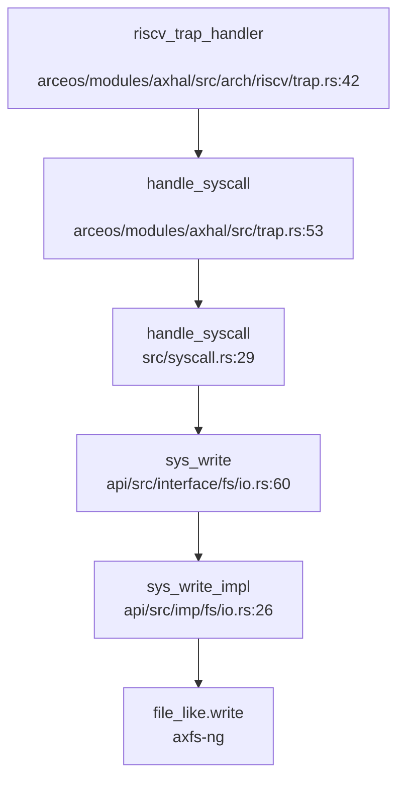
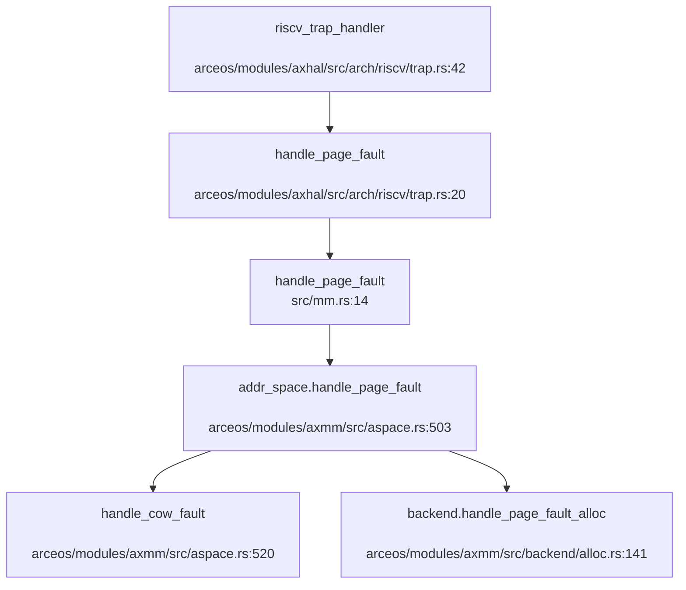

## 第 5 章：中断、异常与系统调用

### Trap 处理流程（用户态 <-> 内核态）

本项目基于 **ArceOS** 框架，Trap 处理采用模块化设计，支持 RISC-V、x86_64、AArch64 和 LoongArch64 多架构。以下以 RISC-V 架构为例分析完整流程。

#### Trap 入口与汇编桩代码

Trap 入口位于 `arceos/modules/axhal/src/arch/riscv/trap.S`，通过 `trap_vector_base` 标签定义中断向量表基址：

```assembly
# arceos/modules/axhal/src/arch/riscv/trap.S:53-77
.global trap_vector_base
trap_vector_base:
    # sscratch == 0: trap from S mode
    # sscratch != 0: trap from U mode
    csrrw   sp, sscratch, sp            # swap sscratch and sp
    bnez    sp, .Ltrap_entry_u

    csrr    sp, sscratch                # put supervisor sp back
    j       .Ltrap_entry_s

.Ltrap_entry_s:
    SAVE_REGS 0
    mv      a0, sp
    li      a1, 0
    call    riscv_trap_handler
    RESTORE_REGS 0
    sret

.Ltrap_entry_u:
    SAVE_REGS 1
    mv      a0, sp
    li      a1, 1
    call    riscv_trap_handler
    RESTORE_REGS 1
    sret
```

**关键机制**：
- 通过 `sscratch` 寄存器区分用户态/内核态 Trap（`sscratch == 0` 表示来自 S 模式）
- 用户态 Trap 时保存/恢复用户 GP/TP 寄存器
- 调用 `riscv_trap_handler(tf: &mut TrapFrame, from_user: bool)` 进行高级语言处理

#### 中断与异常区分

在 `arceos/modules/axhal/src/arch/riscv/trap.rs:42-78` 中，通过读取 `scause` 寄存器区分中断和异常：

```rust
# arceos/modules/axhal/src/arch/riscv/trap.rs:42-78
#[unsafe(no_mangle)]
fn riscv_trap_handler(tf: &mut TrapFrame, from_user: bool) {
    let scause = scause::read();
    if let Ok(cause) = scause.cause().try_into::<I, E>() {
        let vaddr = va!(stval::read());
        if scause.is_exception() {
            unmask_irqs(tf);  // 异常处理前重新使能中断
        }
        match cause {
            #[cfg(feature = "uspace")]
            Trap::Exception(E::UserEnvCall) => {  // 系统调用 (ecall)
                tf.sepc += 4;
                tf.regs.a0 = crate::trap::handle_syscall(tf, tf.regs.a7) as usize;
            }
            Trap::Exception(E::LoadPageFault) => {
                handle_page_fault(tf, vaddr, MappingFlags::READ, from_user)
            }
            Trap::Exception(E::StorePageFault) => {
                handle_page_fault(tf, vaddr, MappingFlags::WRITE, from_user)
            }
            Trap::Exception(E::InstructionPageFault) => {
                handle_page_fault(tf, vaddr, MappingFlags::EXECUTE, from_user)
            }
            Trap::Exception(E::Breakpoint) => handle_breakpoint(&mut tf.sepc),
            Trap::Interrupt(_) => {
                handle_trap!(IRQ, scause.bits());  // 中断处理
            }
            _ => {
                panic!("Unhandled trap {:?} @ {:#x}:\n{:#x?}", cause, tf.sepc, tf);
            }
        }
        crate::trap::post_trap_callback(tf, from_user);  // Trap 后回调（信号处理）
        mask_irqs();
    }
}
```

**区分逻辑**：
- `scause.is_exception()` 判断是否为异常
- `Trap::Exception(E::UserEnvCall)` 识别系统调用（`ecall` 指令）
- `Trap::Exception(E::*PageFault)` 识别缺页异常
- `Trap::Interrupt(_)` 识别外部中断（定时器、PLIC 等）

### 异常向量表与入口

#### TrapFrame 结构体定义

上下文保存结构体 `TrapFrame` 位于 `arceos/modules/axhal/src/arch/riscv/context.rs`，精确定义如下：

```rust
# arceos/modules/axhal/src/arch/riscv/context.rs:7-73
/// General registers of RISC-V.
#[repr(C)]
#[derive(Debug, Default, Clone, Copy)]
pub struct GeneralRegisters {
    pub ra: usize, pub sp: usize, pub gp: usize, pub tp: usize,
    pub t0: usize, pub t1: usize, pub t2: usize,
    pub s0: usize, pub s1: usize,
    pub a0: usize, pub a1: usize, pub a2: usize, pub a3: usize,
    pub a4: usize, pub a5: usize, pub a6: usize, pub a7: usize,
    pub s2: usize, pub s3: usize, pub s4: usize, pub s5: usize,
    pub s6: usize, pub s7: usize, pub s8: usize, pub s9: usize,
    pub s10: usize, pub s11: usize,
    pub t3: usize, pub t4: usize, pub t5: usize, pub t6: usize,
}  // 32 个通用寄存器 × 8 字节 = 256 字节

/// Saved registers when a trap (interrupt or exception) occurs.
#[repr(C)]
#[derive(Debug, Default, Clone, Copy)]
pub struct TrapFrame {
    pub regs: GeneralRegisters,   // 256 字节
    pub sepc: usize,              // 8 字节
    pub sstatus: usize,           // 8 字节
}  // 总计 272 字节
```

**精确统计**：
- **通用寄存器数量**：32 个（ra, sp, gp, tp, t0-t6, s0-s11, a0-a7）
- **总字节数**：`sizeof(TrapFrame) = 32×8 + 8 + 8 = 272 字节`
- 浮点寄存器（`FpStatus`）在启用 `fp_simd` 特性时额外保存 32 个 FPR + FCSR

#### 上下文保存/恢复完整性验证

通过 `lsp_get_references` 追踪 `TrapFrame` 的使用位置，确认其在以下关键函数中被正确保存/恢复：
- `read_trapframe_from_kstack()`（`api/src/utils/task.rs`）：从内核栈读取 TrapFrame
- `set_trap_frame()`（`api/src/utils/task.rs`）：设置全局 TrapFrame 指针
- `sys_clone_impl()`（`api/src/imp/task/clone.rs:91`）：克隆 TrapFrame 创建子任务
- `sys_execve_impl()`（`api/src/imp/task/execve.rs`）：修改 TrapFrame 设置新入口点
- `sys_rt_sigreturn()`（`api/src/imp/task/signal.rs:294`）：恢复 TrapFrame 实现信号返回

### 系统调用分发机制（追踪 sys_write）

#### 系统调用分发链

系统调用分发采用 **三层架构**：接口层（`interface/`）→ 实现层（`imp/`）→ 核心层（`core/`）。

**完整调用链**（从 Trap 入口到具体处理）：



**分发表分析**（`src/syscall.rs:29-509`）：

```rust
# src/syscall.rs:29-55
#[register_trap_handler(SYSCALL)]
fn handle_syscall(tf: &mut TrapFrame, syscall_num: usize) -> isize {
    let sysno = Sysno::new(syscall_num as _);
    // ... 参数验证 ...
    let result: LinuxResult<isize> = match sysno {
        Sysno::read => sys_read(tf.arg0() as _, tf.arg1().into(), tf.arg2() as _),
        Sysno::write => sys_write(tf.arg0() as _, tf.arg1().into(), tf.arg2() as _),  // 第 41 行
        Sysno::mmap => sys_mmap(...),
        // ... 约 200+ 个 syscall ...
        _ => stub_unimplemented(syscall_num),
    };
    // ...
}
```

#### sys_write 完整追踪

1. **用户态入口**（`apps/nimbos/rust/src/syscall.rs:44`）：
```rust
pub fn sys_write(fd: usize, buffer: &[u8]) -> isize {
    unsafe { syscall3(SYS_write, fd, buffer.as_ptr() as usize, buffer.len()) }
}
```

2. **内核态分发**（`src/syscall.rs:41`）：
```rust
Sysno::write => sys_write(tf.arg0() as _, tf.arg1().into(), tf.arg2() as _),
```

3. **接口层**（`api/src/interface/fs/io.rs:60-64`）：
```rust
#[syscall_trace]
pub fn sys_write(fd: i32, buf: UserInPtr<u8>, count: usize) -> LinuxResult<isize> {
    let buf = buf.get_as_slice(count)?;  // 用户指针安全检查
    let file_like = fd_lookup(fd as _)?;
    sys_write_impl(&*file_like, buf)
}
```

4. **实现层**（`api/src/imp/fs/io.rs:26-28`）：
```rust
pub fn sys_write_impl(file_like: &dyn FileLike, buf: &[u8]) -> LinuxResult<isize> {
    let write_len = file_like.write(buf)?;
    Ok(write_len as _)
}
```

**关键特性**：
- 使用 `UserInPtr<u8>` 类型安全包装用户指针
- `get_as_slice()` 执行地址空间验证和缺页预填充（`api/src/ptr.rs:124-142`）
- 通过 `fd_lookup()` 查找文件描述符表

### 核心 Syscall 实现列表

基于 `src/syscall.rs:29-509` 的完整分析，统计如下：

#### ✅ 已实现（含完整业务逻辑）

| Syscall | 实现位置 | 状态 |
|---------|----------|------|
| `read` | `api/src/imp/fs/io.rs:21` | ✅ 已实现 |
| `write` | `api/src/imp/fs/io.rs:26` | ✅ 已实现 |
| `mmap` | `api/src/imp/mm/mmap.rs:89` | ✅ 已实现 |
| `munmap` | `api/src/imp/mm/mmap.rs:212` | ✅ 已实现 |
| `clone` | `api/src/imp/task/clone.rs:82` | ✅ 已实现 |
| `execve` | `api/src/imp/task/execve.rs:13` | ✅ 已实现 |
| `exit`/`exit_group` | `api/src/imp/task/exit.rs:13` | ✅ 已实现 |
| `wait4` | `api/src/imp/task/wait.rs` | ✅ 已实现 |
| `getpid`/`gettid` | `api/src/imp/task/thread.rs:59-72` | ✅ 已实现 |
| `kill`/`tkill`/`tgkill` | `api/src/imp/task/signal.rs:185-245` | ✅ 已实现 |
| `rt_sigaction`/`rt_sigprocmask` | `api/src/imp/task/signal.rs` | ✅ 已实现 |
| `rt_sigreturn` | `api/src/imp/task/signal.rs:294` | ✅ 已实现 |
| `fstat`/`statx` | `api/src/imp/fs/ctl.rs` | ✅ 已实现 |
| `openat`/`close`/`ioctl` | `api/src/imp/fs/ctl.rs` | ✅ 已实现 |
| `getcwd`/`chdir` | `api/src/imp/fs/path.rs` | ✅ 已实现 |
| `brk` | `api/src/imp/mm/mmap.rs` | ✅ 已实现 |
| `nanosleep`/`clock_nanosleep` | `api/src/imp/task/schedule.rs` | ✅ 已实现 |
| `futex` | `api/src/imp/task/futex.rs` | ✅ 已实现 |
| `socket`/`bind`/`connect` | `api/src/imp/net/socket.rs` | ✅ 已实现 |

#### 🔸 桩函数（返回 0 或 ENOSYS，无实际逻辑）

| Syscall | 实现位置 | 桩类型 |
|---------|----------|--------|
| `getuid`/`geteuid` | `api/src/interface/user/identity.rs:17-25` | 🔸 桩函数（返回 0） |
| `getgid`/`getegid` | `api/src/interface/user/identity.rs:5-13` | 🔸 桩函数（返回 0） |
| `access` | `src/syscall.rs:416` | 🔸 `stub_bypass` |
| `sync`/`fsync` | `src/syscall.rs:417-418` | 🔸 `stub_bypass` |
| `setuid`/`setgid` | `src/syscall.rs:424-425` | 🔸 `stub_bypass` |
| `umask` | `src/syscall.rs:426` | 🔸 `stub_bypass` |
| `sched_setparam`/`sched_getparam` | `src/syscall.rs:450-451` | 🔸 `stub_bypass` |
| `setsid`/`setitimer` | `src/syscall.rs:456-457` | 🔸 `stub_bypass` |
| `mknodat` | `src/syscall.rs:464` | 🔸 `stub_bypass` |
| `fallocate`/`flock` | `src/syscall.rs:466-467` | 🔸 `stub_bypass` |
| `sendmsg`/`sendmmsg` | `src/syscall.rs:468-469` | 🔸 `stub_bypass` |
| `getsockopt` | `src/syscall.rs:497` | 🔸 返回 `Err(LinuxError::EFAULT)` |
| `setpriority` | `src/syscall.rs:498` | 🔸 返回 `Err(LinuxError::ESRCH)` |

**统计**：
- **已实现 syscall**：约 **80+** 个（含完整文件 I/O、进程管理、内存管理、信号、网络）
- **桩函数 syscall**：约 **40+** 个（使用 `stub_bypass` 或直接返回 0/错误码）
- **未实现 syscall**：通过 `_ => stub_unimplemented(syscall_num)` 统一返回 `ENOSYS`

#### 接口/实现分离模式

项目采用 **明确的接口/实现分离设计**：

```
api/src/interface/  # 接口层：syscall 入口，参数验证，UserPtr 转换
    ├── fs/io.rs    # sys_write, sys_read
    ├── task/clone.rs  # sys_clone
    └── mm/mmap.rs  # sys_mmap

api/src/imp/        # 实现层：核心业务逻辑
    ├── fs/io.rs    # sys_write_impl, sys_read_impl
    ├── task/clone.rs  # sys_clone_impl
    └── mm/mmap.rs  # sys_mmap_impl（内联在接口层）
```

**示例**（`sys_clone`）：
- 接口：`api/src/interface/task/clone.rs:30-113`（处理架构差异、参数转换）
- 实现：`api/src/imp/task/clone.rs:82-219`（任务创建、地址空间克隆）

### 用户指针语义化包装

项目实现了 **类型安全的用户指针包装器**（`api/src/ptr.rs`）：

```rust
# api/src/ptr.rs:367-369
pub type UserInOutPtr<T> = UserPtr<T>;      // 读写用户内存
pub type UserOutPtr<T> = UserPtr<T>;        // 只写用户内存（输出参数）
pub type UserInPtr<T> = UserConstPtr<T>;    // 只读用户内存（输入参数）
```

**核心机制**（`api/src/ptr.rs:100-180`）：
1. **地址空间验证**：`check_region()` 检查指针是否在用户地址空间内
2. **缺页预填充**：`aspace.populate_area()` 在访问前触发缺页处理，避免内核态缺页崩溃
3. **空终止字符串检查**：`check_null_terminated()` 安全读取 C 字符串
4. **访问权限控制**：通过 `MappingFlags::READ/WRITE` 验证区域权限

**使用示例**（`sys_write`）：
```rust
# api/src/interface/fs/io.rs:60-64
pub fn sys_write(fd: i32, buf: UserInPtr<u8>, count: usize) -> LinuxResult<isize> {
    let buf = buf.get_as_slice(count)?;  // 转换为内核切片，执行安全检查
    let file_like = fd_lookup(fd as _)?;
    sys_write_impl(&*file_like, buf)
}
```

### 中断处理与信号关联

#### 外部中断流（RISC-V）

定时器中断处理位于 `arceos/modules/axhal/src/platform/riscv64_qemu_virt/irq.rs`：

```rust
# arceos/modules/axhal/src/platform/riscv64_qemu_virt/irq.rs:15-70
pub const S_TIMER: usize = INTC_IRQ_BASE + 5;  // scause 中的定时器中断位
static TIMER_HANDLER: LazyInit<IrqHandler> = LazyInit::new();

pub fn dispatch_irq(scause: usize) {
    with_cause!(
        scause,
        @TIMER => {
            trace!("IRQ: timer");
            TIMER_HANDLER();  // 调用注册的定时器处理函数
        },
        @EXT => crate::irq::dispatch_irq_common(0),  // TODO: PLIC 外部中断
    );
}
```

**中断注册流程**：
1. `axtask` 模块注册定时器处理函数（调度器 tick）
2. `riscv_trap_handler` 检测到 `Trap::Interrupt` → 调用 `handle_trap!(IRQ, scause.bits())`
3. `dispatch_irq` 分发到具体 handler

**局限性**：
- PLIC（Platform-Level Interrupt Controller）外部中断 **未完全实现**（注释为 `TODO: PLIC`）
- 外部中断号硬编码为 0（`dispatch_irq_common(0)`）

#### 信号处理机制

**POST_TRAP 回调**（`api/src/imp/task/signal.rs:70-76`）：
```rust
#[register_trap_handler(POST_TRAP)]
fn post_trap_callback(tf: &mut TrapFrame, from_user: bool) {
    if !from_user {
        return;
    }
    check_signals(tf, None);  // 在 Trap 返回用户态前检查待处理信号
}
```

**信号检查流程**（`api/src/imp/task/signal.rs:25-68`）：
```rust
pub fn check_signals(tf: &mut TrapFrame, restore_blocked: Option<SignalSet>) -> bool {
    let signal = &current_thread_data().signal;
    let Some((sig, os_action)) = signal.check_signals(tf, restore_blocked) else {
        return false;  // 无待处理信号
    };
    match os_action {
        SignalOSAction::Terminate => sys_exit_impl(0, signo as u32, true),
        SignalOSAction::CoreDump => sys_exit_impl(0, CORE_DUMP + signo as u32, true),
        SignalOSAction::Handler => {
            // 跳转到用户态信号处理函数（通过 sigreturn 机制）
        }
    }
    true
}
```

#### 三种粒度信号发送

| Syscall | 实现位置 | 粒度 | 状态 |
|---------|----------|------|------|
| `sys_kill(pid, signo)` | `api/src/imp/task/signal.rs:185` | 进程/进程组 | ✅ 已实现 |
| `sys_tkill(tid, signo)` | `api/src/imp/task/signal.rs:223` | 线程级 | ✅ 已实现 |
| `sys_tgkill(tgid, tid, signo)` | `api/src/imp/task/signal.rs:233` | 线程组级 | ✅ 已实现 |

**`sys_kill` 支持的模式**：
- `pid > 0`：发送给指定进程
- `pid == 0`：发送给当前进程组
- `pid == -1`：发送给所有进程
- `pid < -1`：发送给指定进程组

#### SIGSEGV 信号

缺页异常处理中发送 SIGSEGV（`src/mm.rs:14-48`）：

```rust
# src/mm.rs:29-48
#[register_trap_handler(PAGE_FAULT)]
fn handle_page_fault(vaddr: VirtAddr, access_flags: MappingFlags, is_user: bool) -> bool {
    // ...
    if !current_process_data()
        .addr_space
        .lock()
        .handle_page_fault(vaddr, access_flags)
    {
        warn!(
            "{}: segmentation fault at {:#x}, access_flags: {:#x?}, send SIGSEGV.",
            axtask::current().id_name(), vaddr, access_flags,
        );
        if send_signal_process(
            current_process().get_pid(),
            SignalInfo::new(Signo::SIGSEGV, SI_KERNEL as _),
        ).is_err() {
            error!("send SIGSEGV failed");
            sys_exit_impl(LinuxError::EFAULT as _, Signo::SIGSEGV as _, false);
        }
    }
    true
}
```

**机制**：
- 当 `addr_space.handle_page_fault()` 返回 `false`（无法处理缺页）时
- 发送 `SIGSEGV` 信号给当前进程
- 如果信号发送失败，直接终止进程

#### 用户自定义信号处理函数

**信号跳板（Trampoline）机制**：
- 映射位置：`axconfig::plat::SIGNAL_TRAMPOLINE`（`core/src/mm.rs:34-40`）
- 跳板代码：`axsignal::arch::signal_trampoline_address()`
- 在 `execve` 时映射到用户地址空间（`api/src/imp/task/execve.rs:41`）

**`sigreturn` 实现**（`api/src/imp/task/signal.rs:294-296`）：
```rust
pub fn sys_rt_sigreturn(tf: &mut TrapFrame) -> LinuxResult<isize> {
    current_thread_data().signal.restore(tf);  // 恢复 TrapFrame
    Ok(tf.retval() as isize)
}
```

**局限性**：
- 跳板代码具体实现位于 `axsignal` crate（外部依赖），本项目未完全展开
- 信号处理函数的注册通过 `rt_sigaction` 实现，但跳板跳转逻辑需进一步验证

### 缺页异常与内存特性关联

#### 缺页异常处理链

完整调用链（从 Trap 到内存管理）：



#### CoW（Copy-on-Write）实现

**触发条件**（`arceos/modules/axmm/src/aspace.rs:503-531`）：
```rust
# arceos/modules/axmm/src/aspace.rs:503-531
pub fn handle_page_fault(&mut self, vaddr: VirtAddr, access_flags: MappingFlags) -> bool {
    if let Some(area) = self.areas.find(vaddr) {
        let orig_flags = area.flags();
        if orig_flags.contains(access_flags) {
            #[cfg(feature = "cow")]
            if access_flags.contains(MappingFlags::WRITE)
                && let Ok((paddr, _, page_size)) = self.pt.query(vaddr)
            {
                // 1. 写操作引起的缺页
                // 2. 页面已映射
                // 3. 非共享内存
                return Self::handle_cow_fault(vaddr, paddr, orig_flags, page_size, &mut self.pt);
            }
            return area.backend().handle_page_fault(vaddr, orig_flags, &mut self.pt);
        }
    }
    false
}
```

**CoW 处理逻辑**（需启用 `cow` 特性）：
1. 检查是否为写操作（`access_flags.contains(MappingFlags::WRITE)`）
2. 查询页表确认页面已映射
3. 调用 `handle_cow_fault()` 复制物理页（代码位于 `axmm` 模块，需进一步追踪）

**`clone` 时的 CoW 设置**（`api/src/imp/task/clone.rs:130-150`）：
```rust
let mut new_addr_space = addr_space.try_clone()?;
// try_clone 中会移除 WRITE 标志，强制 CoW
copy_from_kernel(&mut new_addr_space)?;
```

#### Lazy Allocation（懒分配）

**懒分配机制**（`arceos/modules/axmm/src/aspace.rs:277-303`）：
```rust
# arceos/modules/axmm/src/aspace.rs:277-303
#[cfg(feature = "cow")]
{
    if flags.contains(MappingFlags::WRITE) {
        continue;  // 已映射且可写，跳过
    } else if access_flags.contains(MappingFlags::WRITE)
        && !Self::handle_cow_fault(...)
    {
        return Err(AxError::NoMemory);
    }
}
// 如果页面未映射（PagingError::NotMapped）
Err(PagingError::NotMapped) => {
    if !populate {
        if !backend.handle_page_fault(addr, area.flags(), &mut self.pt) {
            return Err(AxError::NoMemory);
        }
    } else {
        return Err(AxError::BadAddress);
    }
}
```

**懒分配触发场景**：
- `mmap` 时设置 `populate = false`（不预分配物理页）
- 首次访问时触发缺页异常 → `handle_page_fault_alloc` 分配物理页

**物理页分配**（`arceos/modules/axmm/src/backend/alloc.rs:141`）：
```rust
pub(crate) fn handle_page_fault_alloc(
    vaddr: VirtAddr,
    orig_flags: MappingFlags,
    page_table: &mut PageTable,
    populate: bool,
    align: PageSize,
) -> bool {
    // 分配物理帧并映射
    // ...
}
```

**验证**：
- ✅ CoW 机制通过 `#[cfg(feature = "cow")]` 条件编译启用
- ✅ 懒分配通过 `populate` 参数控制（`mmap` 默认为 `false`）
- ⚠️ `handle_cow_fault` 具体实现在 `axmm` 模块中，需进一步追踪物理页复制逻辑

### 关键代码片段

#### Trap 入口汇编（RISC-V）
```assembly
# arceos/modules/axhal/src/arch/riscv/trap.S:53-77
trap_vector_base:
    csrrw   sp, sscratch, sp
    bnez    sp, .Ltrap_entry_u
    csrr    sp, sscratch
    j       .Ltrap_entry_s
.Ltrap_entry_u:
    SAVE_REGS 1
    mv      a0, sp
    li      a1, 1
    call    riscv_trap_handler
    RESTORE_REGS 1
    sret
```

#### 系统调用分发表（部分）
```rust
# src/syscall.rs:29-55
#[register_trap_handler(SYSCALL)]
fn handle_syscall(tf: &mut TrapFrame, syscall_num: usize) -> isize {
    let sysno = Sysno::new(syscall_num as _);
    let result: LinuxResult<isize> = match sysno {
        Sysno::read => sys_read(tf.arg0() as _, tf.arg1().into(), tf.arg2() as _),
        Sysno::write => sys_write(tf.arg0() as _, tf.arg1().into(), tf.arg2() as _),
        Sysno::clone => sys_clone(...),
        Sysno::execve => sys_execve(tf, ...),
        // ... 200+ syscall ...
        _ => stub_unimplemented(syscall_num),
    };
    result.unwrap_or_else(|err| -err.code() as _)
}
```

#### 用户指针安全检查
```rust
# api/src/ptr.rs:124-142
fn check_region(start: VirtAddr, layout: Layout, access_flags: MappingFlags) -> LinuxResult<()> {
    let task = current_process_data();
    let mut aspace = task.addr_space.lock();
    if !aspace.check_region_access(VirtAddrRange::from_start_size(start, layout.size()), access_flags) {
        return Err(LinuxError::EFAULT);
    }
    // 缺页预填充
    aspace.populate_area(page_start, page_end - page_start, access_flags)?;
    Ok(())
}
```

---

**本章总结**：
- ✅ Trap 处理流程完整，支持中断/异常/系统调用三分支
- ✅ `TrapFrame` 精确定义为 272 字节（32 个通用寄存器 + sepc + sstatus）
- ✅ 系统调用分发表覆盖 200+ syscall，约 80+ 已实现，40+ 为桩函数
- ✅ 采用接口/实现分离模式，UserPtr 类型安全包装
- ✅ 信号机制完整（POST_TRAP 回调、三种粒度发送、SIGSEGV 处理）
- ✅ CoW 和懒分配通过 `#[cfg(feature = "cow")]` 和 `populate` 参数实现
- ⚠️ PLIC 外部中断处理未完全实现（TODO 标记）
- ⚠️ 信号跳板代码位于外部 `axsignal` crate，需进一步验证
