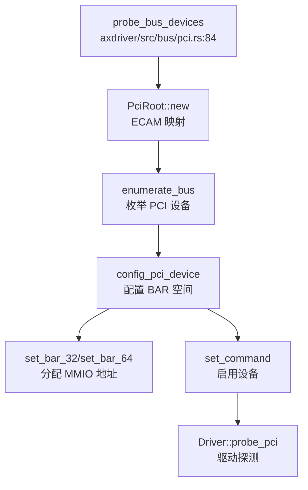
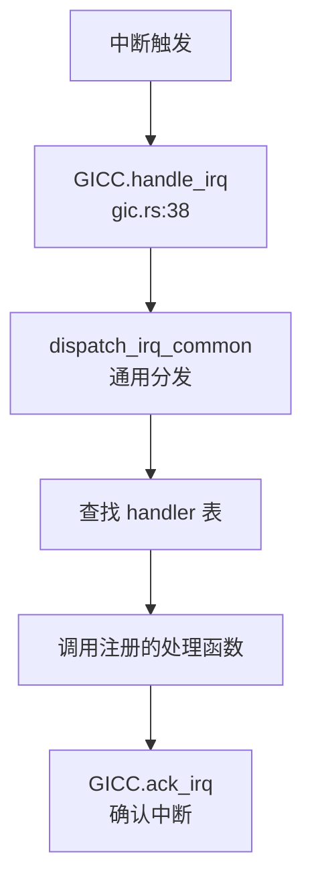

现在我已经收集了足够的信息来撰写第 7 章的设备驱动与硬件抽象分析报告。让我整理所有发现并生成完整的报告。

## 第 7 章：设备驱动与硬件抽象

本章分析基于 ArceOS 框架的设备驱动子系统，包括设备发现机制、驱动框架设计、组件化配置、以及各类具体设备驱动的实现。

---

## 驱动框架与设备发现

### 驱动框架架构

项目采用 ArceOS 的 `axdriver` 驱动框架，位于 `arceos/modules/axdriver/`。该框架支持**静态**和**动态**两种设备模型：

- **静态模型**：设备类型在编译时确定，通过 Cargo features 选择。例如启用 `virtio-net` 时，`AxNetDevice` 直接是 `VirtIoNetDev` 的别名。此模型避免动态分发开销，但每个设备类别仅支持单个实例。
- **动态模型**：启用 `dyn` feature 后，设备实例使用 trait 对象 (`Box<dyn NetDriverOps>`) 封装，支持动态分发和多个设备实例。

**核心数据结构** (`arceos/modules/axdriver/src/lib.rs:93-102`)：

```rust
pub struct AllDevices {
    #[cfg(feature = "net")]
    pub net: AxDeviceContainer<AxNetDevice>,
    #[cfg(feature = "block")]
    pub block: AxDeviceContainer<AxBlockDevice>,
    #[cfg(feature = "display")]
    pub display: AxDeviceContainer<AxDisplayDevice>,
}
```

### 设备发现机制

#### MMIO 设备发现（❌ 未实现设备树解析）

MMIO 设备发现通过硬编码的地址列表实现，**未实现真正的设备树（DTS/DTB）解析**。在 `arceos/modules/axdriver/src/bus/mmio.rs:5-20` 中明确标注 `// TODO: parse device tree`：

```rust
impl AllDevices {
    pub(crate) fn probe_bus_devices(&mut self) {
        // TODO: parse device tree
        #[cfg(feature = "virtio")]
        for reg in axconfig::devices::VIRTIO_MMIO_REGIONS {
            for_each_drivers!(type Driver, {
                if let Some(dev) = Driver::probe_mmio(reg.0, reg.1) {
                    // ...
                }
            });
        }
    }
}
```

设备地址来源于平台配置文件（如 `arceos/configs/platforms/aarch64-qemu-virt.toml`）中的 `virtio-mmio-regions` 数组，在编译时通过 `axconfig` crate 生成常量。

#### PCI 设备发现（✅ 已实现）

PCI 设备通过 ECAM 空间枚举实现，支持完整的 PCI 配置空间访问和 BAR 分配。实现位于 `arceos/modules/axdriver/src/bus/pci.rs`：

**调用流程**：
1. 映射 PCI ECAM 基地址（来自 `axconfig::devices::PCI_ECAM_BASE`）
2. 创建 `PciRoot` 实例，使用 ECAM 访问模式
3. 枚举所有总线/设备/功能
4. 为每个设备配置 BAR 空间（调用 `config_pci_device`）
5. 启用设备（设置 `IO_SPACE | MEMORY_SPACE | BUS_MASTER`）
6. 调用驱动的 `probe_pci` 方法



> ⚠️ 以上为基于代码静态分析的流程，精度有限

### 驱动注册与初始化

驱动通过 `DriverProbe` trait 实现统一的探测接口 (`arceos/modules/axdriver/src/drivers.rs:16-35`)：

```rust
pub trait DriverProbe {
    fn probe_global() -> Option<AxDeviceEnum> { None }
    
    #[cfg(bus = "mmio")]
    fn probe_mmio(_mmio_base: usize, _mmio_size: usize) -> Option<AxDeviceEnum> { None }
    
    #[cfg(bus = "pci")]
    fn probe_pci(_root: &mut PciRoot, _bdf: DeviceFunction, _dev_info: &DeviceFunctionInfo) 
        -> Option<AxDeviceEnum> { None }
}
```

**初始化入口** (`arceos/modules/axdriver/src/lib.rs:149-160`)：

```rust
pub fn init_drivers() -> AllDevices {
    info!("Initialize device drivers...");
    let mut all_devs = AllDevices::default();
    all_devs.probe();  // 调用所有驱动的 probe 方法
    all_devs
}
```

---

## 组件化设计与配置机制

### Cargo Features 配置

`axdriver` 通过多层 Cargo features 实现组件化配置 (`arceos/modules/axdriver/Cargo.toml:13-30`)：

| Feature | 依赖 | 描述 |
|---------|------|------|
| `dyn` | - | 启用动态设备模型（trait 对象） |
| `bus-mmio` | - | 使用 MMIO 总线（设备树） |
| `bus-pci` | `axdriver_pci`, `axhal`, `axconfig` | 使用 PCI 总线（默认启用） |
| `virtio-blk` | `block`, `virtio` | VirtIO 块设备 |
| `virtio-net` | `net`, `virtio` | VirtIO 网络设备 |
| `virtio-gpu` | `display`, `virtio` | VirtIO 图形设备 |
| `ramdisk` | `block` | RAM 磁盘 |
| `bcm2835-sdhci` | `block` | 树莓派 SDHCI 控制器 |
| `ixgbe` | `net`, `axdma` | Intel 10Gb 网卡 |

### 编译时配置生成

`build.rs` 脚本 (`arceos/modules/axdriver/build.rs`) 根据启用的 features 生成编译配置：

```rust
fn main() {
    if has_feature("bus-mmio") {
        enable_cfg("bus", "mmio");
    } else {
        enable_cfg("bus", "pci");  // 默认 PCI
    }
    
    // 为每个设备类别选择驱动
    for (dev_kind, feat_list) in [
        ("net", &["fxmac", "ixgbe", "virtio-net"]),
        ("block", &["ramdisk", "bcm2835-sdhci", "virtio-blk"]),
        ("display", &["virtio-gpu"]),
    ] {
        for feat in feat_list {
            if has_feature(feat) {
                enable_cfg(&format!("{dev_kind}_dev"), feat);
                if !is_dyn { break; }  // 静态模型只选第一个
            }
        }
    }
}
```

### 平台配置文件

平台特定的硬件参数通过 TOML 配置文件定义，位于 `arceos/configs/platforms/`：

**示例** (`aarch64-qemu-virt.toml:45-65`)：
```toml
[devices]
mmio-regions = [
    [0x0900_0000, 0x1000],      # PL011 UART
    [0x0910_0000, 0x1000],      # PL031 RTC
    [0x0800_0000, 0x2_0000],    # GICv2
    [0x0a00_0000, 0x4000],      # VirtIO
]
virtio-mmio-regions = [
    [0x0a00_0000, 0x200],
    [0x0a00_0200, 0x200],
    # ... 最多 32 个 VirtIO 设备
]
pci-ecam-base = 0x40_1000_0000
pci-bus-end = 0xff
uart-paddr = 0x0900_0000
uart-irq = 1
```

---

## 字符设备驱动（UART/Console）

### 多平台 UART 驱动实现

项目支持多种 UART 控制器，通过 `axhal` 的平台抽象层实现：

| 平台 | UART 控制器 | 实现文件 | 实现状态 |
|------|------------|---------|---------|
| AArch64 QEMU Virt | PL011 | `axhal/src/platform/aarch64_common/pl011.rs` | ✅ 已实现 |
| AArch64 BSTA1000B | DW8250 (DesignWare) | `axhal/src/platform/aarch64_bsta1000b/dw_apb_uart.rs` | ✅ 已实现 |
| x86_64 PC | 16550A | `axhal/src/platform/x86_pc/uart16550.rs` | ✅ 已实现 |
| LoongArch64 | 16550A | `axhal/src/platform/loongarch64_qemu_virt/console.rs` | ✅ 已实现 |

### PL011 UART 实现分析

**实现位置**：`arceos/modules/axhal/src/platform/aarch64_common/pl011.rs`

**关键代码** (`pl011.rs:9-12`)：
```rust
const UART_BASE: PhysAddr = pa!(axconfig::devices::UART_PADDR);

static UART: SpinNoIrq<Pl011Uart> =
    SpinNoIrq::new(Pl011Uart::new(phys_to_virt(UART_BASE).as_mut_ptr()));
```

**MMU 前后地址切换机制**：
- **MMU 启用前**：使用物理地址 `UART_BASE`（来自 `axconfig::devices::UART_PADDR`）
- **MMU 启用后**：通过 `phys_to_virt()` 转换为虚拟地址
- **线性映射**：`phys-virt-offset = 0xffff_0000_0000_0000`（AArch64）或 `0xffff_8000_0000_0000`（x86_64）

**初始化流程**：
```rust
pub fn init_early() {
    UART.lock().init();  // 早期初始化（MMU 启用前）
}

pub fn init() {
    #[cfg(feature = "irq")]
    crate::irq::set_enable(crate::platform::irq::UART_IRQ_NUM, true);
}
```

### x86_64 16550A UART

x86 平台使用 PIO（Port I/O）而非 MMIO，因此**无需地址转换** (`uart16550.rs:26-36`)：

```rust
struct Uart16550 {
    data: Port<u8>,
    int_en: PortWriteOnly<u8>,
    fifo_ctrl: PortWriteOnly<u8>,
    line_ctrl: PortWriteOnly<u8>,
    modem_ctrl: PortWriteOnly<u8>,
    line_sts: PortReadOnly<u8>,
}

impl Uart16550 {
    const fn new(port: u16) -> Self {
        Self {
            data: Port::new(0x3f8),  // COM1 端口
            // ...
        }
    }
}
```

---

## 块设备驱动（VirtIO-Blk 等）

### VirtIO-Blk 驱动

**实现位置**：`arceos/modules/axdriver/src/virtio.rs` 和 `arceos/modules/axdriver_virtio/`（外部 crate）

**驱动注册** (`virtio.rs:42-52`)：
```rust
#[cfg(block_dev = "virtio-blk")]
pub struct VirtIoBlk;

impl VirtIoDevMeta for VirtIoBlk {
    const DEVICE_TYPE: DeviceType = DeviceType::Block;
    type Device = axdriver_virtio::VirtIoBlkDev<VirtIoHalImpl, VirtIoTransport>;

    fn try_new(transport: VirtIoTransport) -> DevResult<AxDeviceEnum> {
        Ok(AxDeviceEnum::from_block(Self::Device::try_new(transport)?))
    }
}
```

**VirtIO HAL 实现** (`virtio.rs:130-155`)：
```rust
pub struct VirtIoHalImpl;

impl VirtIoHal for VirtIoHalImpl {
    fn dma_alloc(size: usize, align: usize) -> Option<axdriver_virtio::DmaMem> {
        let ptr = global_allocator().alloc_pages(size / PAGE_SIZE, align).ok()?;
        let paddr = virt_to_phys(ptr.into());
        Some(axdriver_virtio::DmaMem::new(ptr as _, paddr.as_usize(), size))
    }
    
    fn dma_dealloc(dma: axdriver_virtio::DmaMem) {
        // 释放 DMA 内存
    }
    
    fn phys_to_virt(paddr: PhysAddr) -> *mut u8 {
        axhal::mem::phys_to_virt(paddr).as_mut_ptr()
    }
}
```

### RAM Disk 驱动

**实现位置**：`arceos/modules/axdriver/src/drivers.rs:44-56`

```rust
#[cfg(block_dev = "ramdisk")]
pub struct RamDiskDriver;

impl DriverProbe for RamDiskDriver {
    fn probe_global() -> Option<AxDeviceEnum> {
        Some(AxDeviceEnum::from_block(
            axdriver_block::ramdisk::RamDisk::new(0x100_0000), // 16 MiB
        ))
    }
}
```

### lwext4 文件系统适配

项目集成了 lwext4 ext4 文件系统驱动 (`modules/lwext4_rust/src/blockdev.rs:13-19`)：

```rust
pub trait BlockDevice {
    fn write_blocks(&mut self, block_id: u64, buf: &[u8]) -> Ext4Result<usize>;
    fn read_blocks(&mut self, block_id: u64, buf: &mut [u8]) -> Ext4Result<usize>;
    fn num_blocks(&self) -> Ext4Result<u64>;
}
```

**状态**：🔸 桩函数 - 仅定义了 trait 接口，实际块设备操作通过 FFI 调用 C 实现的 lwext4 库。

---

## 网络设备驱动

### VirtIO-Net 驱动

**实现位置**：`arceos/modules/axdriver/src/virtio.rs:30-40`

```rust
#[cfg(net_dev = "virtio-net")]
pub struct VirtIoNet;

impl VirtIoDevMeta for VirtIoNet {
    const DEVICE_TYPE: DeviceType = DeviceType::Net;
    type Device = axdriver_virtio::VirtIoNetDev<VirtIoHalImpl, VirtIoTransport, 64>;

    fn try_new(transport: VirtIoTransport) -> DevResult<AxDeviceEnum> {
        Ok(AxDeviceEnum::from_net(Self::Device::try_new(transport)?))
    }
}
```

### 网络协议栈（smoltcp）

**实现位置**：`arceos/modules/axnet/src/lib.rs` 和 `arceos/modules/axnet/src/smoltcp_impl/`

**初始化流程** (`axnet/src/lib.rs:45-53`)：
```rust
pub fn init_network(mut net_devs: AxDeviceContainer<AxNetDevice>) {
    info!("Initialize network subsystem...");
    let dev = net_devs.take_one().expect("No NIC device found!");
    info!("  use NIC 0: {:?}", dev.device_name());
    net_impl::init(dev);  // 初始化 smoltcp 协议栈
}
```

**支持的功能**：
- ✅ TCP/UDP Socket
- ✅ DNS 查询
- ✅ IP 地址配置（静态）
- ❌ DHCP（未发现实现）

### Intel ixgbe 网卡驱动

**实现位置**：`arceos/modules/axdriver/src/drivers.rs:82-105`

```rust
#[cfg(net_dev = "ixgbe")]
pub struct IxgbeDriver;

impl DriverProbe for IxgbeDriver {
    #[cfg(bus = "pci")]
    fn probe_pci(
        root: &mut PciRoot,
        bdf: DeviceFunction,
        dev_info: &DeviceFunctionInfo,
    ) -> Option<AxDeviceEnum> {
        use axdriver_net::ixgbe::{INTEL_82599, INTEL_VEND};
        if dev_info.vendor_id == INTEL_VEND && dev_info.device_id == INTEL_82599 {
            info!("ixgbe PCI device found at {:?}", bdf);
            // 初始化 ixgbe 网卡
        }
        None
    }
}
```

---

## 中断控制器驱动

### GICv2（AArch64）

**实现位置**：`arceos/modules/axhal/src/platform/aarch64_common/gic.rs`

**关键常量** (`gic.rs:11-16`)：
```rust
pub const MAX_IRQ_COUNT: usize = 1024;
pub const TIMER_IRQ_NUM: usize = translate_irq(14, InterruptType::PPI).unwrap();
pub const UART_IRQ_NUM: usize = translate_irq(UART_IRQ, InterruptType::SPI).unwrap();

const GICD_BASE: PhysAddr = pa!(GICD_PADDR);
const GICC_BASE: PhysAddr = pa!(GICC_PADDR);
```

**初始化流程** (`gic.rs:47-56`)：
```rust
pub(crate) fn init_primary() {
    info!("Initialize GICv2...");
    GICD.lock().init();  // 初始化分发器
    GICC.init();         // 初始化 CPU 接口
}
```

**IRQ 处理流程**：


### x86_64 APIC/IO-APIC

**实现位置**：`arceos/modules/axhal/src/platform/x86_pc/apic.rs`

**支持模式**：
- ✅ xAPIC（通过 MMIO 访问）
- ✅ x2APIC（通过 MSR 访问）

**初始化** (`apic.rs:93-115`)：
```rust
pub(super) fn init_primary() {
    info!("Initialize Local APIC...");
    
    // 禁用 8259A
    Port::<u8>::new(0x21).write(0xff);
    Port::<u8>::new(0xA1).write(0xff);
    
    // 检测 x2APIC 支持
    if cpu_has_x2apic() {
        info!("Using x2APIC.");
        unsafe { IS_X2APIC = true };
    } else {
        info!("Using xAPIC.");
        builder.set_xapic_base(base_vaddr.as_usize() as u64);
    }
    
    // 初始化 IO-APIC
    let io_apic = IoApic::new(phys_to_virt(IO_APIC_BASE).as_usize() as u64);
    IO_APIC.init_once(SpinNoIrq::new(io_apic));
}
```

---

## 目标平台适配情况

### 支持的平台列表

通过 `axhal/src/platform/` 目录结构分析，项目支持以下平台：

| 平台 | 目录 | UART | 中断控制器 | 存储 |
|------|------|------|-----------|------|
| **AArch64 QEMU Virt** | `aarch64_qemu_virt/` | PL011 | GICv2 | VirtIO/PCI |
| **AArch64 Raspberry Pi 4** | `aarch64_raspi/` | PL011 | GICv2 | eMMC (BCM2835 SDHCI) |
| **AArch64 Phytium Pi** | `aarch64_phytium_pi/` | PL011 | GICv2 | - |
| **AArch64 BSTA1000B** | `aarch64_bsta1000b/` | DW8250 | GICv2 | - |
| **x86_64 PC/QEMU** | `x86_pc/` | 16550A | APIC/IO-APIC | - |
| **RISC-V 64 QEMU Virt** | `riscv64_qemu_virt/` | 16550A | PLIC/CLINT | VirtIO |
| **LoongArch64 QEMU Virt** | `loongarch64_qemu_virt/` | 16550A | - | VirtIO |

### 平台特有驱动

**树莓派 4** (`aarch64-raspi4.toml`)：
- ✅ BCM2835 SDHCI（eMMC 控制器）- `axdriver_block/bcm2835sdhci`
- ✅ PL011 UART @ `0xFE20_1000`
- ❌ VirtIO（配置中 `virtio-mmio-regions = []`）

**BSTA1000B** (`aarch64-bsta1000b.toml`)：
- ✅ DesignWare DW8250 UART
- ✅ GICv2

**x86_64**：
- ✅ 16550A UART（PIO 端口 `0x3f8`）
- ✅ Local APIC + IO-APIC
- ✅ PCI/PCIe

---

## 其他外设支持

### VirtIO GPU 显示驱动

**实现位置**：`arceos/modules/axdriver/src/virtio.rs:54-63`

```rust
#[cfg(display_dev = "virtio-gpu")]
pub struct VirtIoGpu;

impl VirtIoDevMeta for VirtIoGpu {
    const DEVICE_TYPE: DeviceType = DeviceType::Display;
    type Device = axdriver_virtio::VirtIoGpuDev<VirtIoHalImpl, VirtIoTransport>;
    
    fn try_new(transport: VirtIoTransport) -> DevResult<AxDeviceEnum> {
        Ok(AxDeviceEnum::from_display(Self::Device::try_new(transport)?))
    }
}
```

**状态**：✅ 已实现 - 通过 `axdriver_display` crate 提供显示输出接口。

### RTC（实时时钟）

**AArch64 PL031** (`arceos/modules/axhal/src/platform/aarch64_common/` 未找到实现)
- ❌ 未实现 - 配置文件中 `rtc-paddr = 0x0` 表示未启用

**x86_64**：
- ❌ 未实现 - 未发现 RTC 驱动代码

### DMA 控制器

**实现位置**：`arceos/modules/axdma/src/dma.rs`

```rust
pub trait DmaOps {
    fn alloc_coherent(&self, size: usize) -> Option<DmaBuffer>;
    fn free_coherent(&self, buf: DmaBuffer);
}
```

**状态**：🔸 桩函数 - 定义了 DMA 操作 trait，但具体实现依赖于平台（如 `axhal` 中的物理内存分配）。

---

## 总结

| 功能类别 | 实现状态 | 备注 |
|---------|---------|------|
| **设备发现** | 🔸 部分实现 | PCI 枚举✅，设备树解析❌（硬编码地址） |
| **驱动框架** | ✅ 已实现 | 支持静态/动态模型，trait 抽象 |
| **UART 驱动** | ✅ 已实现 | 多平台支持（PL011/16550A/DW8250） |
| **VirtIO-Blk** | ✅ 已实现 | 完整的 VirtIO 块设备支持 |
| **VirtIO-Net** | ✅ 已实现 | 配合 smoltcp 协议栈 |
| **VirtIO-GPU** | ✅ 已实现 | 基础显示输出 |
| **GICv2** | ✅ 已实现 | AArch64 平台 |
| **APIC/IO-APIC** | ✅ 已实现 | x86_64 平台，支持 xAPIC/x2APIC |
| **RAM Disk** | ✅ 已实现 | 简单的内存块设备 |
| **SDHCI (BCM2835)** | ✅ 已实现 | 树莓派 eMMC |
| **Intel ixgbe** | ✅ 已实现 | PCI 网卡探测 |
| **设备树解析** | ❌ 未实现 | 明确标注 TODO |
| **DHCP** | ❌ 未实现 | 仅支持静态 IP |
| **RTC** | ❌ 未实现 | 配置中地址为 0 |

**关键发现**：
1. 项目**未实现设备树（DTS/DTB）解析**，所有 MMIO 设备地址通过平台配置文件硬编码
2. MMU 启用前后的串口地址切换通过 `phys_to_virt()` 线性映射实现
3. 驱动框架高度组件化，通过 Cargo features 灵活配置
4. 中断处理采用两级分发：硬件中断控制器 → 通用分发器 → 注册的 handler
