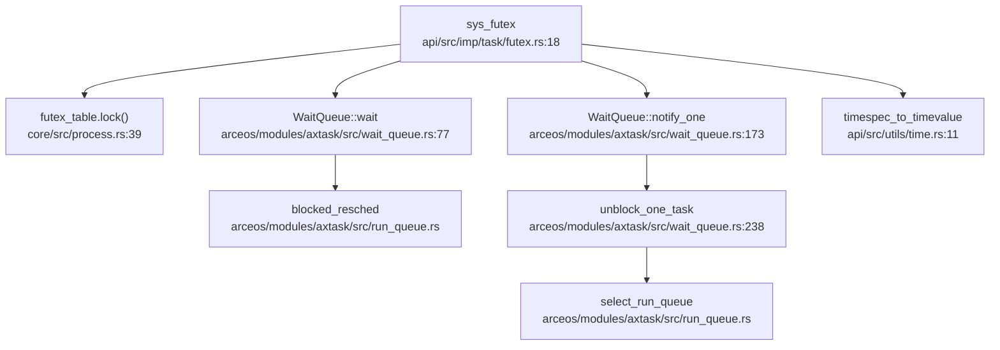

现在我已经收集了足够的信息。让我撰写完整的第 8 章报告。

## 第 8 章：同步互斥与进程间通信

本章分析操作系统的同步原语、锁机制实现以及进程间通信（IPC）子系统。我们将深入探讨原子操作、等待队列、Futex、管道、共享内存和信号机制的具体实现。

---

## 同步与互斥原语（锁与原子操作）

### RawMutex 实现分析

本系统实现了基于自旋 + 睡眠的混合互斥锁 `RawMutex`，位于 `arceos/modules/axsync/src/mutex.rs`。该实现遵循 `lock_api::RawMutex` trait，支持高效的锁竞争处理。

**核心数据结构**：

```rust
// arceos/modules/axsync/src/mutex.rs:7-16
pub struct RawMutex {
    wq: WaitQueue,
    owner_id: AtomicU64,
}
```

**原子操作实现**：

系统使用 Rust 标准库的 `core::sync::atomic` 模块实现原子操作，而非自定义汇编。关键原子指令包括：

- `compare_exchange_weak`：用于锁获取时的 CAS 操作
- `compare_exchange`：用于 `try_lock` 的强 CAS
- `swap`：用于锁释放
- `load`：用于锁状态检查

**lock() 实现逻辑**（`arceos/modules/axsync/src/mutex.rs:33-57`）：

```rust
fn lock(&self) {
    let current_id = current().id().as_u64();
    loop {
        match self.owner_id.compare_exchange_weak(
            0,
            current_id,
            Ordering::Acquire,
            Ordering::Relaxed,
        ) {
            Ok(_) => break,  // 成功获取锁
            Err(owner_id) => {
                assert_ne!(owner_id, current_id, "...");
                // 等待直到锁看起来已解锁
                self.wq.wait_until(|| !self.is_locked());
            }
        }
    }
}
```

**unlock() 实现**（`arceos/modules/axsync/src/mutex.rs:68-77`）：

```rust
unsafe fn unlock(&self) {
    let owner_id = self.owner_id.swap(0, Ordering::Release);
    assert_eq!(owner_id, current().id().as_u64(), "...");
    self.wq.notify_one(true);  // 唤醒一个等待者
}
```

**实现状态**：✅ **已实现** - 包含完整的锁获取/释放逻辑、原子 CAS 操作、等待队列集成。

### SpinNoIrq 自旋锁

系统还使用了 `kspin::SpinNoIrq` 自旋锁（禁用中断的自旋锁），主要用于底层数据结构保护：

- `arceos/modules/axtask/src/wait_queue.rs:33` - `WaitQueue` 内部使用 `SpinNoIrq<VecDeque<AxTaskRef>>`
- `arceos/modules/axalloc/src/lib.rs` - 内存分配器使用
- `arceos/modules/axhal/src/platform/*/` - 硬件抽象层设备驱动

**实现状态**：✅ **已实现** - 通过外部 crate `kspin` 提供。

---

## 等待队列实现机制

### WaitQueue 核心设计

等待队列 `WaitQueue` 位于 `arceos/modules/axtask/src/wait_queue.rs`，用于管理阻塞任务的挂起与唤醒。

**数据结构**（`Line 33-36`）：

```rust
pub struct WaitQueue {
    queue: SpinNoIrq<VecDeque<AxTaskRef>>,
}
```

**关键方法**：

| 方法 | 功能 | 实现位置 |
|------|------|----------|
| `wait()` | 阻塞当前任务并加入等待队列 | Line 77-81 |
| `wait_until(F)` | 条件等待，直到条件为真 | Line 84-103 |
| `wait_timeout()` | 带超时的等待 | Line 106-131 |
| `notify_one()` | 唤醒一个等待任务 | Line 173-184 |
| `notify_all()` | 唤醒所有等待任务 | Line 187-193 |
| `requeue()` | 将任务转移到另一个等待队列 | Line 211-224 |

**阻塞机制**（`Line 77-81`）：

```rust
pub fn wait(&self) {
    current_run_queue::<NoPreemptIrqSave>().blocked_resched(self.queue.lock());
    self.cancel_events(crate::current(), false);
}
```

任务通过 `blocked_resched()` 将自身从运行队列移除并加入等待队列，然后触发调度器选择新任务运行。

**唤醒机制**（`Line 173-184`）：

```rust
pub fn notify_one(&self, resched: bool) -> bool {
    let mut wq = self.queue.lock();
    if let Some(task) = wq.pop_front() {
        unblock_one_task(task, resched);
        true
    } else {
        false
    }
}
```

### Futex 调用链分析

Futex（Fast Userspace Mutex）是用户态同步原语的内核支持机制。以下是 `sys_futex` 的完整调用链：



**FUTEX_WAIT 流程**（`api/src/imp/task/futex.rs:34-48`）：

```rust
FUTEX_WAIT => {
    if *uaddr.get_as_ref()? != value {
        return Err(LinuxError::EAGAIN);
    }
    let wq = futex_table
        .lock()
        .entry(addr)
        .or_insert_with(new_futex)
        .clone();

    if !timeout.is_null() {
        wq.wait_timeout(timespec_to_timevalue(*timeout.get_as_ref()?), false);
    } else {
        wq.wait();
    }
    Ok(0)
}
```

**FUTEX_WAKE 流程**（`api/src/imp/task/futex.rs:50-63`）：

```rust
FUTEX_WAKE => {
    let wq = futex_table.lock().get(&addr).cloned();
    let mut count = 0;
    if let Some(wq) = wq {
        for _ in 0..value {
            if !wq.notify_one(false) {
                break;
            }
            count += 1;
        }
    }
    axtask::yield_now();
    Ok(count)
}
```

**实现状态**：✅ **已实现** - 支持 `FUTEX_WAIT`、`FUTEX_WAKE`、`FUTEX_REQUEUE`、`FUTEX_CMP_REQUEUE`、`FUTEX_WAIT_BITSET`、`FUTEX_WAKE_BITSET` 操作。但 `FUTEX_*_BITSET` 的 bitset 功能标记为 TODO，仅支持 `FUTEX_BITSET_MATCH_ANY`。

---

## 进程间通信（Pipe/MsgQueue/Sem）

### 管道（Pipe）实现

管道实现位于 `api/src/core/file/pipe.rs`，使用**环形缓冲区（Ring Buffer）**作为底层存储。

**环形缓冲区设计**（`Line 23-77`）：

```rust
pub const PIPE_MAX_SIZE: usize = 65536;
const RING_BUFFER_SIZE: usize = PIPE_MAX_SIZE;

pub struct PipeRingBuffer {
    arr: [u8; RING_BUFFER_SIZE],
    head: usize,
    tail: usize,
    status: RingBufferStatus,  // Full/Empty/Normal
}
```

**关键特性**：

1. **循环索引**：使用 `head` 和 `tail` 指针，通过模运算实现循环
2. **状态追踪**：`RingBufferStatus` 区分空/满状态（解决 head==tail 的歧义）
3. **非阻塞支持**：通过 `FileFlags::NON_BLOCK` 支持 O_NONBLOCK 标志

**写操作实现**（`Line 158-196`）：

```rust
fn write(&self, buf: &[u8]) -> LinuxResult<usize> {
    let mut write_size = 0usize;
    let is_non_block = self.is_non_block();
    loop {
        let mut ring_buffer = self.buffer.lock();
        let loop_write = ring_buffer.available_write();
        
        if is_non_block && loop_write < max_len {
            if max_len <= RING_BUFFER_SIZE {
                return Err(LinuxError::EAGAIN);
            }
            // ... 非阻塞写入逻辑
        }
        
        if loop_write == 0 {
            drop(ring_buffer);
            task_yield_interruptable()?;  // 阻塞等待
            continue;
        }
        // ... 写入数据
    }
}
```

**系统调用接口**（`api/src/imp/fs/pipe.rs`）：

- `sys_pipe()` - 创建管道（Line 38-42）
- `sys_pipe2()` - 带标志的管道创建（Line 30-36）
- `sys_pipe_impl()` - 内部实现（Line 10-28）

**实现状态**：✅ **已实现** - 完整的环形缓冲区实现，支持阻塞/非阻塞模式、读写端分离、引用计数管理。

### 共享内存（Shared Memory）

共享内存实现位于 `api/src/interface/mm/shm.rs` 和 `core/src/shared_memory.rs`。

**系统调用**：

| 系统调用 | 功能 | 实现状态 |
|---------|------|---------|
| `sys_shmget()` | 创建/获取共享内存段 | ✅ 已实现 |
| `sys_shmat()` | 附加共享内存到进程地址空间 | ✅ 已实现 |
| `sys_shmctl()` | 共享内存控制 | 🔸 部分实现（仅 IPC_RMID） |
| `sys_shmdt()` | 分离共享内存 | ✅ 已实现 |

**SharedMemoryManager 设计**（`core/src/shared_memory.rs:20-74`）：

```rust
pub struct SharedMemoryManager {
    pub mem_map: Mutex<BTreeMap<u32, Arc<SharedMemory>>>,
    next_key: AtomicU32,
}

pub struct SharedMemory {
    pub key: u32,
    pub addr: usize,      // 内核虚拟地址
    pub page_count: usize,
}
```

**内存映射实现**（`api/src/interface/mm/shm.rs:60-102`）：

```rust
pub fn sys_shmat(shm_id: c_int, shm_addr: c_ulong, shm_flag: c_int) -> LinuxResult<isize> {
    let shared_memory = SHARED_MEMORY_MANAGER.get(key).ok_or(LinuxError::EINVAL)?;
    let size = shared_memory.page_count * PAGE_SIZE_4K;
    let process_data = current_process_data();
    let mut addr_space = process_data.addr_space.lock();
    
    // 查找空闲地址区域
    let addr = if shm_addr == 0 {
        addr_space.find_free_area(...)
    } else {
        // ... 处理指定地址
    };
    
    // 映射物理页到用户空间
    let paddr = virt_to_phys(VirtAddr::from(shared_memory.addr));
    addr_space.map_linear(addr, paddr, size, permission, PageSize::SizeK)?;
    
    Ok(addr.as_usize() as _)
}
```

**实现状态**：✅ **已实现** - 支持创建、附加、分离、删除共享内存段。`sys_shmctl` 的 `IPC_STAT` 操作标记为 `ENOSYS` 未实现。

### 消息队列（Message Queue）

**搜索结果**：

```
src/syscall.rs:477: Sysno::msgget => stub_bypass(sysno),
```

在 `src/syscall.rs:477-479` 中，消息队列相关系统调用被标记为桩函数：

```rust
Sysno::msgget => stub_bypass(sysno),
Sysno::msgctl => stub_bypass(sysno),
Sysno::msgsnd => stub_bypass(sysno),
Sysno::msgrcv => Err(LinuxError::ENOMSG),
```

`stub_bypass` 函数定义（`src/syscall.rs:520-524`）：

```rust
fn stub_bypass(sysno: Sysno) -> Result<isize, LinuxError> {
    warn!("Unimplemented syscall: {:?}, bypassed", sysno);
    Ok(0)
}
```

**实现状态**：🔸 **桩函数** - `sys_msgget`、`sys_msgctl`、`sys_msgsnd` 仅返回 0 而无实际队列逻辑；`sys_msgrcv` 直接返回 `ENOMSG` 错误。**未发现**消息队列的数据结构（如 `MessageQueue`）或完整实现代码。

### 信号量（Semaphore）

**搜索结果**：

```
src/syscall.rs:485: Sysno::semget => stub_bypass(sysno),
src/syscall.rs:501: Sysno::semctl => Err(LinuxError::EFAULT),
```

信号量相关系统调用同样被标记为桩函数：

```rust
Sysno::semget => stub_bypass(sysno),
Sysno::semctl => Err(LinuxError::EFAULT),
```

**实现状态**：🔸 **桩函数** - `sys_semget` 仅返回 0 而无实际信号量数组逻辑；`sys_semctl` 返回 `EFAULT` 错误。**未发现** `sys_semop` 实现或 PV 操作相关代码。`core/src/ctypes.rs:31` 和 `api/src/imp/task/clone.rs:51` 中有关于信号量的注释，但无实际实现。

### 信号（Signal）作为 IPC

信号机制实现位于 `api/src/imp/task/signal.rs` 和 `vendor/axsignal/` 目录。

**信号发送系统调用**：

| 系统调用 | 功能 | 实现状态 |
|---------|------|---------|
| `sys_kill()` | 向进程/进程组发送信号 | ✅ 已实现 |
| `sys_tkill()` | 向特定线程发送信号 | ✅ 已实现 |
| `sys_tgkill()` | 向线程组发送信号 | ✅ 已实现 |
| `sys_rt_sigqueueinfo()` | 带 siginfo 的进程信号发送 | ✅ 已实现 |
| `sys_rt_tgsigqueueinfo()` | 带 siginfo 的线程信号发送 | ✅ 已实现 |

**信号发送实现**（`api/src/imp/task/signal.rs:153-177`）：

```rust
pub fn send_signal_thread(tid: Pid, sig: SignalInfo) -> LinuxResult<()> {
    let thread_data = get_thread_data(tid).ok_or(LinuxError::EPERM)?;
    thread_data.signal.send_signal(sig);
    Ok(())
}

pub fn send_signal_process(pid: Pid, sig: SignalInfo) -> LinuxResult<()> {
    let process_data = get_process_data(pid).ok_or(LinuxError::EPERM)?;
    process_data.signal.send_signal(sig);
    Ok(())
}
```

**信号处理时机**：

信号在 **Trap 返回用户态前** 通过 `POST_TRAP` 钩子处理（`api/src/imp/task/signal.rs:70-76`）：

```rust
#[register_trap_handler(POST_TRAP)]
fn post_trap_callback(tf: &mut TrapFrame, from_user: bool) {
    if !from_user {
        return;
    }
    check_signals(tf, None);
}
```

`check_signals` 函数（`api/src/imp/task/signal.rs:25-65`）检查待处理信号并执行相应动作：

```rust
pub fn check_signals(tf: &mut TrapFrame, restore_blocked: Option<SignalSet>) -> bool {
    let signal = &current_thread_data().signal;
    let Some((sig, os_action)) = signal.check_signals(tf, restore_blocked) else {
        return false;
    };

    match os_action {
        SignalOSAction::Terminate => sys_exit_impl(0, signo as u32, true),
        SignalOSAction::CoreDump => sys_exit_impl(0, CORE_DUMP + signo as u32, true),
        SignalOSAction::Stop => sys_exit_impl(0, signo as u32, true),
        SignalOSAction::Continue => { /* TODO */ },
        SignalOSAction::Handler => { /* 设置用户态信号处理帧 */ },
    }
    true
}
```

**信号处理帧设置**（`vendor/axsignal/src/api/thread.rs:52-102`）：

当信号动作为 `Handler` 时，系统会：
1. 分配信号帧（SignalFrame）在用户栈上
2. 设置 `TrapFrame` 的 IP 为用户信号处理函数地址
3. 设置参数寄存器（signo, siginfo, ucontext）
4. 设置返回地址为 restorer 函数

**实现状态**：✅ **已实现** - 完整的信号发送、接收、处理机制，支持线程级和进程级信号管理、信号掩码、信号处理函数注册、信号栈、sigreturn 恢复。

---

## 关键代码片段

### 1. RawMutex 锁获取（带自旋优化）

```rust
// arceos/modules/axsync/src/mutex.rs:33-57
fn lock(&self) {
    let current_id = current().id().as_u64();
    loop {
        // 使用 compare_exchange_weak 提高自旋效率
        match self.owner_id.compare_exchange_weak(
            0,
            current_id,
            Ordering::Acquire,
            Ordering::Relaxed,
        ) {
            Ok(_) => break,  // 成功获取锁
            Err(owner_id) => {
                assert_ne!(owner_id, current_id, 
                    "{} tried to acquire mutex it already owns.",
                    current().id_name());
                // 等待直到锁看起来已解锁
                self.wq.wait_until(|| !self.is_locked());
            }
        }
    }
}
```

### 2. Pipe 环形缓冲区读写

```rust
// api/src/core/file/pipe.rs:36-77
pub fn write_byte(&mut self, byte: u8) {
    self.status = RingBufferStatus::Normal;
    self.arr[self.tail] = byte;
    self.tail = (self.tail + 1) % RING_BUFFER_SIZE;
    if self.tail == self.head {
        self.status = RingBufferStatus::Full;
    }
}

pub fn read_byte(&mut self) -> u8 {
    self.status = RingBufferStatus::Normal;
    let c = self.arr[self.head];
    self.head = (self.head + 1) % RING_BUFFER_SIZE;
    if self.head == self.tail {
        self.status = RingBufferStatus::Empty;
    }
    c
}
```

### 3. Futex 等待/唤醒流程

```rust
// api/src/imp/task/futex.rs:34-63
match command {
    FUTEX_WAIT => {
        if *uaddr.get_as_ref()? != value {
            return Err(LinuxError::EAGAIN);
        }
        let wq = futex_table.lock().entry(addr)
            .or_insert_with(new_futex).clone();
        wq.wait();  // 阻塞等待
        Ok(0)
    }
    FUTEX_WAKE => {
        let wq = futex_table.lock().get(&addr).cloned();
        let mut count = 0;
        if let Some(wq) = wq {
            for _ in 0..value {
                if !wq.notify_one(false) { break; }
                count += 1;
            }
        }
        Ok(count)
    }
    // ...
}
```

### 4. 信号处理帧设置

```rust
// vendor/axsignal/src/api/thread.rs:70-102
SignalDisposition::Handler(handler) => {
    let aligned_sp = (sp - layout.size()) & !(layout.align() - 1);
    let frame_ptr = aligned_sp as *mut SignalFrame;
    let frame = unsafe { &mut *frame_ptr };

    *frame = SignalFrame {
        ucontext: UContext::new(tf, restore_blocked),
        siginfo: sig.clone(),
        tf: *tf,
    };

    tf.set_ip(handler as usize);
    tf.set_sp(aligned_sp);
    tf.set_arg0(signo as _);
    tf.set_arg1(&frame.siginfo as *const _ as _);
    tf.set_arg2(&frame.ucontext as *const _ as _);
    // ...
}
```

---

## 未实现/桩函数功能列表

以下功能在文档或系统调用表中存在，但**代码验证**显示为桩函数或未实现：

| 功能 | 系统调用 | 状态 | 代码位置 |
|------|---------|------|---------|
| **消息队列** | `sys_msgget` | 🔸 桩函数 | `src/syscall.rs:477` |
| **消息队列控制** | `sys_msgctl` | 🔸 桩函数 | `src/syscall.rs:478` |
| **消息发送** | `sys_msgsnd` | 🔸 桩函数 | `src/syscall.rs:479` |
| **消息接收** | `sys_msgrcv` | ❌ 未实现 | `src/syscall.rs:496` (返回 `ENOMSG`) |
| **信号量创建** | `sys_semget` | 🔸 桩函数 | `src/syscall.rs:485` |
| **信号量控制** | `sys_semctl` | ❌ 未实现 | `src/syscall.rs:501` (返回 `EFAULT`) |
| **信号量操作** | `sys_semop` | ❌ 未发现 | 全库搜索无结果 |
| **共享内存控制** | `sys_shmctl(IPC_STAT)` | 🔸 部分实现 | `api/src/interface/mm/shm.rs:120` (返回 `ENOSYS`) |
| **Futex bitset** | `FUTEX_WAIT_BITSET` / `FUTEX_WAKE_BITSET` | 🔸 部分实现 | `api/src/imp/task/futex.rs:95-128` (仅支持 `FUTEX_BITSET_MATCH_ANY`) |
| **核心转储** | `SignalOSAction::CoreDump` | 🔸 部分实现 | `api/src/imp/task/signal.rs:44` (仅退出，无 core dump 文件) |
| **信号停止** | `SignalOSAction::Stop` | 🔸 部分实现 | `api/src/imp/task/signal.rs:51` (仅退出，无实际停止) |
| **信号继续** | `SignalOSAction::Continue` | 🔸 部分实现 | `api/src/imp/task/signal.rs:55` (空实现) |

**重要说明**：

1. **消息队列和信号量**：虽然系统调用表中有定义，但实际实现仅为 `stub_bypass` 返回 0，**未发现**任何队列数据结构、PV 操作逻辑或相关内核模块。这些功能属于"文档提及但未见代码"。

2. **共享内存**：`sys_shmctl` 的 `IPC_STAT` 操作被注释掉并返回 `ENOSYS`，属于部分实现。

3. **Futex bitset**：代码中有 TODO 注释明确表示 bitset 功能尚未支持。

4. **信号处理**：`CoreDump`、`Stop`、`Continue` 动作虽然定义了枚举值，但实际行为简化为进程退出，未实现真正的 core dump 文件生成、进程停止/继续功能。

---

## 总结

本系统的同步互斥与 IPC 子系统呈现以下特点：

1. **同步原语**：✅ 完整实现 - `RawMutex` 使用原子 CAS + 等待队列的混合设计，`SpinNoIrq` 提供底层自旋锁支持。

2. **等待队列**：✅ 完整实现 - `WaitQueue` 支持条件等待、超时等待、任务转移等高级功能，是 Futex 和信号机制的基础。

3. **Futex**：✅ 完整实现 - 支持所有主要操作（WAIT/WAKE/REQUEUE/CMP_REQUEUE），bitset 功能部分实现。

4. **管道**：✅ 完整实现 - 基于环形缓冲区，支持阻塞/非阻塞模式、引用计数管理。

5. **共享内存**：✅ 完整实现 - 支持创建、映射、分离、删除，通过页表映射实现进程间共享。

6. **信号**：✅ 完整实现 - 支持线程级/进程级信号管理、信号处理函数、信号栈、sigreturn 恢复，在 `POST_TRAP` 钩子中处理。

7. **消息队列/信号量**：🔸 桩函数 - 仅有系统调用接口，无实际实现逻辑，属于"画饼"功能。
