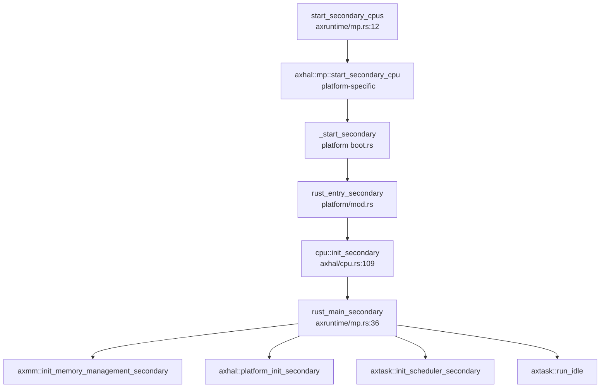
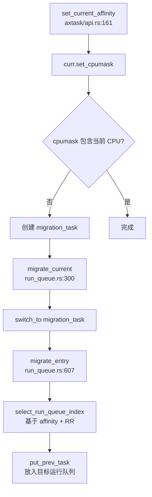

现在我已经收集了足够的信息来撰写第 9 章：多核支持与并行机制。让我整理分析结果并输出完整的 Markdown 报告。

## 第 9 章：多核支持与并行机制

本章分析仓库的多核（SMP）支持实现，包括 Secondary CPU 启动流程、核间通信机制、Per-CPU 变量设计、多核调度策略以及同步原语在多核环境下的行为。

---

### 多核架构设计（SMP/AMP）

**✅ 已实现 SMP（对称多处理）架构**

该操作系统基于 ArceOS 框架，实现了完整的 SMP 支持。多核配置通过编译时配置项控制：

**配置文件**：`arceos/configs/defconfig.toml`
```toml
# Number of CPUs
smp = 1                     # uint
```

**架构特征**：
- **SMP 模式**：所有 CPU 核心共享同一物理内存空间，运行同一份内核代码
- **多架构支持**：支持 x86_64、AArch64、RISC-V 64、LoongArch64 等多种架构的 SMP
- **编译时配置**：通过 `feature = "smp"` 条件编译启用多核支持
- **CPU 数量**：通过 `axconfig::SMP` 常量在编译时确定

**Cargo Feature 依赖链**（`arceos/api/axfeat/Cargo.toml`）：
```toml
smp = ["axhal/smp", "axruntime/smp", "axtask?/smp", "kspin/smp"]
```

---

### Secondary CPU 启动流程

**✅ 已实现** — 完整的 Secondary CPU 启动链

Secondary CPU 启动流程因架构而异，但遵循统一的模式：

#### 1. 启动入口（以 AArch64 为例）

**文件**：`arceos/modules/axhal/src/platform/aarch64_common/boot.rs:181`

```assembly
#[unsafe(naked)]
#[unsafe(no_mangle)]
#[unsafe(link_section = ".text.boot")]
unsafe extern "C" fn _start_secondary() -> ! {
    core::arch::naked_asm!("
        mrs     x19, mpidr_el1
        and     x19, x19, #0xffffff     // get current CPU id

        mov     sp, x0
        bl      {switch_to_el1}
        bl      {init_mmu}
        bl      {enable_fp}

        mov     x8, {phys_virt_offset}  // set SP to the high address
        add     sp, sp, x8

        mov     x0, x19                 // call rust_entry_secondary(cpu_id)
        ldr     x8, ={entry}
        blr     x8
        b      .",
        entry = sym crate::platform::rust_entry_secondary,
    )
}
```

#### 2. Rust 入口初始化

**文件**：`arceos/modules/axhal/src/platform/aarch64_qemu_virt/mod.rs:37`

```rust
#[cfg(feature = "smp")]
pub(crate) unsafe extern "C" fn rust_entry_secondary(cpu_id: usize) {
    crate::cpu::init_secondary(cpu_id);
    rust_main_secondary(cpu_id);
}
```

#### 3. Per-CPU 寄存器初始化

**文件**：`arceos/modules/axhal/src/cpu.rs:109`

```rust
pub(crate) fn init_secondary(cpu_id: usize) {
    percpu::init_percpu_reg(cpu_id);
    unsafe {
        CPU_ID.write_current_raw(cpu_id);
        IS_BSP.write_current_raw(false);  // 标记为 Secondary CPU
    }
    crate::arch::cpu_init();
}
```

#### 4. 运行时初始化链

**文件**：`arceos/modules/axruntime/src/mp.rs:36`

```rust
#[unsafe(no_mangle)]
pub extern "C" fn rust_main_secondary(cpu_id: usize) -> ! {
    ENTERED_CPUS.fetch_add(1, Ordering::Relaxed);
    info!("Secondary CPU {:x} started.", cpu_id);

    #[cfg(feature = "paging")]
    axmm::init_memory_management_secondary();

    axhal::platform_init_secondary();

    #[cfg(feature = "multitask")]
    axtask::init_scheduler_secondary();

    info!("Secondary CPU {:x} init OK.", cpu_id);
    super::INITED_CPUS.fetch_add(1, Ordering::Relaxed);

    // 等待所有 CPU 初始化完成
    while !super::is_init_ok() {
        core::hint::spin_loop();
    }

    #[cfg(feature = "irq")]
    axhal::arch::enable_irqs();

    #[cfg(feature = "multitask")]
    axtask::run_idle();  // 进入空闲任务循环
}
```

#### 5. 跨平台启动机制对比

| 架构 | 启动机制 | 实现文件 |
|------|---------|---------|
| **x86_64** | INIT-SIPI-SIPI 序列 | `arceos/modules/axhal/src/platform/x86_pc/mp.rs` |
| **AArch64** | PSCI `cpu_on` 调用 | `arceos/modules/axhal/src/platform/aarch64_qemu_virt/mp.rs` |
| **RISC-V 64** | SBI HSM 扩展 `hart_start` | `arceos/modules/axhal/src/platform/riscv64_qemu_virt/mp.rs` |
| **LoongArch64** | CSR Mail + IPI | `arceos/modules/axhal/src/platform/loongarch64_qemu_virt/mp.rs` |

**x86_64 启动示例**（`arceos/modules/axhal/src/platform/x86_pc/mp.rs:32`）：
```rust
pub fn start_secondary_cpu(apic_id: usize, stack_top: PhysAddr) {
    unsafe { setup_startup_page(stack_top) };

    let apic_id = super::apic::raw_apic_id(apic_id as u8);
    let lapic = super::apic::local_apic();

    // INIT-SIPI-SIPI Sequence
    unsafe { lapic.send_init_ipi(apic_id) };
    busy_wait(Duration::from_millis(10));
    unsafe { lapic.send_sipi(START_PAGE_IDX, apic_id) };
    busy_wait(Duration::from_micros(200));
    unsafe { lapic.send_sipi(START_PAGE_IDX, apic_id) };
}
```

#### 6. Secondary CPU 启动调用图



---

### 核间通信与 IPI 机制

**✅ 已实现** — 通过架构特定的 IPI 机制实现核间通信

#### 1. IPI 发送机制

不同架构采用不同的 IPI 实现：

**LoongArch64**（`arceos/modules/axhal/src/platform/loongarch64_qemu_virt/mp.rs:1`）：
```rust
use loongArch64::ipi::{csr_mail_send, send_ipi_single};

pub fn start_secondary_cpu(cpu_id: usize, stack_top: crate::mem::PhysAddr) {
    unsafe extern "C" {
        fn _start_secondary();
    }
    let stack_top_virt_addr = phys_to_virt(stack_top).as_usize();
    unsafe {
        SMP_BOOT_STACK_TOP = stack_top_virt_addr;
    }
    csr_mail_send(_start_secondary as usize as _, cpu_id, 0);
    send_ipi_single(cpu_id, ACTION_BOOT_CPU);  // 发送 IPI 触发启动
}
```

**x86_64**（`arceos/modules/axhal/src/platform/x86_pc/mp.rs:38`）：
```rust
// INIT-SIPI-SIPI Sequence
unsafe { lapic.send_init_ipi(apic_id) };
busy_wait(Duration::from_millis(10));
unsafe { lapic.send_sipi(START_PAGE_IDX, apic_id) };
busy_wait(Duration::from_micros(200));
unsafe { lapic.send_sipi(START_PAGE_IDX, apic_id) };
```

**AArch64**（`arceos/modules/axhal/src/platform/aarch64_qemu_virt/mp.rs:4`）：
```rust
pub fn start_secondary_cpu(cpu_id: usize, stack_top: PhysAddr) {
    unsafe extern "C" {
        fn _start_secondary();
    }
    let entry = virt_to_phys(va!(_start_secondary as usize));
    crate::platform::aarch64_common::psci::cpu_on(cpu_id, entry.as_usize(), stack_top.as_usize());
}
```

#### 2. IPI 处理机制

**🔸 桩函数/有限实现** — 当前代码中仅实现了启动时的 IPI 发送，未见通用的 IPI 处理框架（如 `ipi_handler`、`send_ipi` 用于调度器间通信）。

搜索结果显示：
- `send_ipi` 仅在 LoongArch64 启动代码中出现
- 未发现通用的 `ipi_handler` 或 IPI 中断处理程序
- 核间调度通过 **Per-CPU 运行队列 + 原子操作** 实现，而非显式 IPI

---

### Per-CPU 变量与数据结构

**✅ 已实现** — 基于 `percpu` crate 的 Per-CPU 变量机制

#### 1. Per-CPU 变量定义

使用 `#[percpu::def_percpu]` 宏定义 Per-CPU 变量：

**文件**：`arceos/modules/axhal/src/cpu.rs`

```rust
#[percpu::def_percpu]
static CPU_ID: usize = 0;

#[percpu::def_percpu]
static IS_BSP: bool = false;

#[percpu::def_percpu]
static CURRENT_TASK_PTR: usize = 0;
```

#### 2. Per-CPU 访问 API

```rust
/// 获取当前 CPU ID
#[inline]
pub fn this_cpu_id() -> usize {
    CPU_ID.read_current()
}

/// 判断是否为 BSP（Bootstrap Processor）
#[inline]
pub fn this_cpu_is_bsp() -> bool {
    IS_BSP.read_current()
}

/// 获取当前任务指针（支持抢占安全）
#[inline]
pub fn current_task_ptr<T>() -> *const T {
    #[cfg(target_arch = "x86_64")]
    unsafe {
        CURRENT_TASK_PTR.read_current_raw() as _
    }
    #[cfg(any(target_arch = "riscv32", target_arch = "riscv64", target_arch = "loongarch64"))]
    unsafe {
        let _guard = kernel_guard::IrqSave::new();
        CURRENT_TASK_PTR.read_current_raw() as _
    }
    #[cfg(target_arch = "aarch64")]
    {
        // ARM64 使用 SP_EL0 作为缓存
        use tock_registers::interfaces::Readable;
        aarch64_cpu::registers::SP_EL0.get() as _
    }
}
```

#### 3. Per-CPU 初始化

**文件**：`arceos/modules/axhal/src/cpu.rs:98`

```rust
pub(crate) fn init_primary(cpu_id: usize) {
    percpu::init();
    percpu::init_percpu_reg(cpu_id);
    unsafe {
        CPU_ID.write_current_raw(cpu_id);
        IS_BSP.write_current_raw(true);  // 标记为 BSP
    }
    crate::arch::cpu_init();
}
```

#### 4. axns 资源命名空间

项目还使用了 `axns` 模块进行资源管理（类似 Per-CPU 资源命名空间）：

**文件**：`api/src/utils/task.rs`
```rust
use percpu::def_percpu;

#[def_percpu]
// ... Per-CPU 任务相关变量
```

**文件**：`arceos/modules/axfs-ng/src/api/fs.rs`
```rust
axns::def_resource! {
    pub static FS_CONTEXT: axns::ResArc<axsync::Mutex<FsContext<axsync::RawMutex>>> = axns::ResArc::new();
}
```

---

### 多核调度策略

**✅ 已实现** — 基于 Per-CPU 运行队列 + CPU 亲和性 + 简单负载均衡

#### 1. Per-CPU 运行队列

**文件**：`arceos/modules/axtask/src/run_queue.rs`

每个 CPU 核心拥有独立的运行队列：
```rust
/// Per-CPU 运行队列数组
static RUN_QUEUES: [UnsafeCell<AxRunQueue>; SMP] = ...;

/// 当前 CPU 的运行队列
#[inline(always)]
pub(crate) fn current_run_queue<G: BaseGuard>() -> CurrentRunQueueRef<'static, G> {
    let irq_state = G::acquire();
    CurrentRunQueueRef {
        inner: unsafe { RUN_QUEUE.current_ref_mut_raw() },
        current_task: crate::current(),
        state: irq_state,
        _phantom: core::marker::PhantomData,
    }
}
```

#### 2. CPU 亲和性（Affinity）

**文件**：`arceos/modules/axtask/src/api.rs:161`

```rust
pub fn set_current_affinity(cpumask: AxCpuMask) -> bool {
    if cpumask.is_empty() {
        false
    } else {
        let curr = current().clone();
        curr.set_cpumask(cpumask);
        
        // 如果当前 CPU 不在亲和性掩码中，触发迁移
        #[cfg(feature = "smp")]
        if !cpumask.get(axhal::cpu::this_cpu_id()) {
            const MIGRATION_TASK_STACK_SIZE: usize = 4096;
            // 创建迁移任务
            let migration_task = TaskInner::new(
                move || crate::run_queue::migrate_entry(curr),
                "migration-task".into(),
                MIGRATION_TASK_STACK_SIZE,
            )
            .into_arc();

            // 执行迁移
            current_run_queue::<NoPreemptIrqSave>().migrate_current(migration_task);
        }
        true
    }
}
```

#### 3. 运行队列选择（负载均衡）

**文件**：`arceos/modules/axtask/src/run_queue.rs:95`

```rust
#[cfg(feature = "smp")]
fn select_run_queue_index(cpumask: AxCpuMask) -> usize {
    use core::sync::atomic::{AtomicUsize, Ordering};
    static RUN_QUEUE_INDEX: AtomicUsize = AtomicUsize::new(0);

    assert!(!cpumask.is_empty(), "No available CPU for task execution");

    // Round-robin 选择运行队列
    loop {
        let index = RUN_QUEUE_INDEX.fetch_add(1, Ordering::SeqCst) % axconfig::SMP;
        if cpumask.get(index) {
            return index;
        }
    }
}
```

**🔸 负载均衡限制**：当前实现仅使用简单的 Round-Robin 策略，**未实现**基于负载的动态平衡算法。代码注释明确指出：

```rust
/// TODO:
/// 1. Implement better load balancing across CPUs for more efficient task distribution.
/// 2. Use a more generic load balancing algorithm that can be customized or replaced.
```

#### 4. 任务迁移机制

**文件**：`arceos/modules/axtask/src/run_queue.rs:300`

```rust
#[cfg(feature = "smp")]
pub fn migrate_current(&mut self, migration_task: AxTaskRef) {
    let curr = &self.current_task;
    assert!(curr.is_running());

    // 标记当前任务为 Ready，但不放入当前运行队列
    curr.set_state(TaskState::Ready);

    // 切换到迁移任务
    self.inner.switch_to(crate::current(), migration_task);
}

/// 迁移任务入口
#[cfg(feature = "smp")]
pub(crate) fn migrate_entry(migrated_task: AxTaskRef) {
    select_run_queue::<kernel_guard::NoPreemptIrqSave>(&migrated_task)
        .inner
        .scheduler
        .lock()
        .put_prev_task(migrated_task, false)
}
```

#### 5. 多核调度调用图



---

### 自旋锁/RCU 在多核下的实现差异

#### 1. SpinLock 实现

**✅ 已实现** — 使用 `kspin` crate 提供自旋锁

**文件**：`arceos/modules/axsync/src/lib.rs`

```rust
pub use kspin as spin;

#[cfg(not(feature = "multitask"))]
pub use kspin::{SpinNoIrq as Mutex, SpinNoIrqGuard as MutexGuard};
```

**🔸 中断禁用行为**：`SpinNoIrq` 在锁定期间**禁用本地中断**，确保在多核环境下不会因中断导致死锁。

**使用示例**（`arceos/modules/axalloc/src/lib.rs:52`）：
```rust
use kspin::SpinNoIrq;

static balloc: SpinNoIrq<DefaultByteAllocator>;
static palloc: SpinNoIrq<BitmapPageAllocator<PAGE_SIZE>>;
```

#### 2. Sleeping Mutex（优先级继承 ❌ 未实现）

**文件**：`arceos/modules/axsync/src/mutex.rs`

实现了基于等待队列的 Sleeping Mutex，但**未实现优先级继承**：

```rust
pub struct RawMutex {
    wq: WaitQueue,
    owner_id: AtomicU64,
}

unsafe impl lock_api::RawMutex for RawMutex {
    fn lock(&self) {
        let current_id = current().id().as_u64();
        loop {
            match self.owner_id.compare_exchange_weak(
                0,
                current_id,
                Ordering::Acquire,
                Ordering::Relaxed,
            ) {
                Ok(_) => break,
                Err(owner_id) => {
                    assert_ne!(owner_id, current_id, "...");
                    self.wq.wait_until(|| !self.is_locked());  // 阻塞等待
                }
            }
        }
    }
}
```

**🔸 优先级继承**：**❌ 未实现** — 代码中未见优先级继承逻辑，仅使用简单的等待队列。

#### 3. RCU（Read-Copy-Update）

**❌ 未实现** — 代码库中未发现 RCU 机制的实现。

搜索 `rcu`、`ReadCopyUpdate`、`call_rcu` 等关键词均无结果。多核同步主要依赖：
- Per-CPU 变量（无锁访问）
- 自旋锁（`kspin::SpinNoIrq`）
- 原子操作（`AtomicUsize`、`AtomicU64`）

---

### 关键代码片段

#### 1. PID 分配的原子操作（跨章节引用）

**文件**：`process/src/process.rs:232`

```rust
static NEXT_PID: AtomicU32 = AtomicU32::new(1);

fn generate_next_pid() -> Pid {
    NEXT_PID.fetch_add(1, Ordering::Acquire)  // 多核安全的 PID 分配
}
```

#### 2. Futex 多核行为（跨章节引用）

**文件**：`api/src/imp/task/futex.rs`

Futex 在多核场景下使用 Per-Process 的等待表：

```rust
let futex_table = &current_process_data().futex_table;

let wq = futex_table
    .lock()
    .entry(addr)
    .or_insert_with(new_futex)
    .clone();

wq.wait();  // 多核安全的等待
```

**🔸 多核行为**：Futex 等待队列是 Per-Process 的，多核上的线程共享同一张表，通过 `Mutex` 保护并发访问。

#### 3. 多核安全的任务指针访问

**文件**：`arceos/modules/axhal/src/cpu.rs:27`

```rust
/// 在 ARM64 上使用 SP_EL0 作为 Per-CPU 任务指针缓存
#[cfg(target_arch = "aarch64")]
pub(crate) unsafe fn cache_current_task_ptr() {
    use tock_registers::interfaces::Writeable;
    aarch64_cpu::registers::SP_EL0.set(CURRENT_TASK_PTR.read_current_raw() as u64);
}
```

#### 4. 多核初始化同步

**文件**：`arceos/modules/axruntime/src/mp.rs:12`

```rust
static ENTERED_CPUS: AtomicUsize = AtomicUsize::new(1);

pub fn start_secondary_cpus(primary_cpu_id: usize) {
    let mut logic_cpu_id = 0;
    for i in 0..SMP {
        if i != primary_cpu_id && logic_cpu_id < SMP - 1 {
            let stack_top = virt_to_phys(VirtAddr::from(unsafe {
                SECONDARY_BOOT_STACK[logic_cpu_id].as_ptr_range().end as usize
            }));

            axhal::mp::start_secondary_cpu(i, stack_top);
            logic_cpu_id += 1;

            // 等待 Secondary CPU 进入
            while ENTERED_CPUS.load(Ordering::Acquire) <= logic_cpu_id {
                core::hint::spin_loop();
            }
        }
    }
}
```

---

### 本章小结

| 功能 | 实现状态 | 说明 |
|------|---------|------|
| **SMP 架构** | ✅ 已实现 | 支持 x86_64/AArch64/RISC-V/LoongArch64 |
| **Secondary CPU 启动** | ✅ 已实现 | 完整的启动链，架构特定的引导代码 |
| **IPI 机制** | 🔸 有限实现 | 仅用于启动，未见通用 IPI 处理框架 |
| **Per-CPU 变量** | ✅ 已实现 | 基于 `percpu` crate，支持抢占安全访问 |
| **CPU 亲和性** | ✅ 已实现 | 支持 `set_current_affinity` + 任务迁移 |
| **负载均衡** | 🔸 简单实现 | 仅 Round-Robin，未实现动态负载平衡 |
| **SpinLock** | ✅ 已实现 | `kspin::SpinNoIrq`，禁用本地中断 |
| **Mutex 优先级继承** | ❌ 未实现 | 仅简单等待队列 |
| **RCU** | ❌ 未实现 | 未发现 RCU 机制 |

**多核设计特点**：
1. **Per-CPU 运行队列**：避免全局锁竞争，每个 CPU 独立调度
2. **原子操作 + 自旋锁**：多核同步的基础原语
3. **任务迁移机制**：通过专用迁移任务实现跨核调度
4. **架构抽象**：统一的 SMP 接口，底层适配不同架构的启动机制

**局限性**：
- 负载均衡策略简单，未实现工作窃取（Work Stealing）
- 缺少通用 IPI 框架，核间通信能力有限
- 未实现 RCU，读多写少场景性能可能受限
