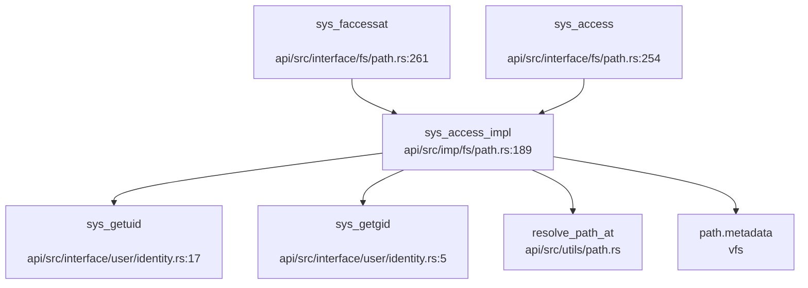
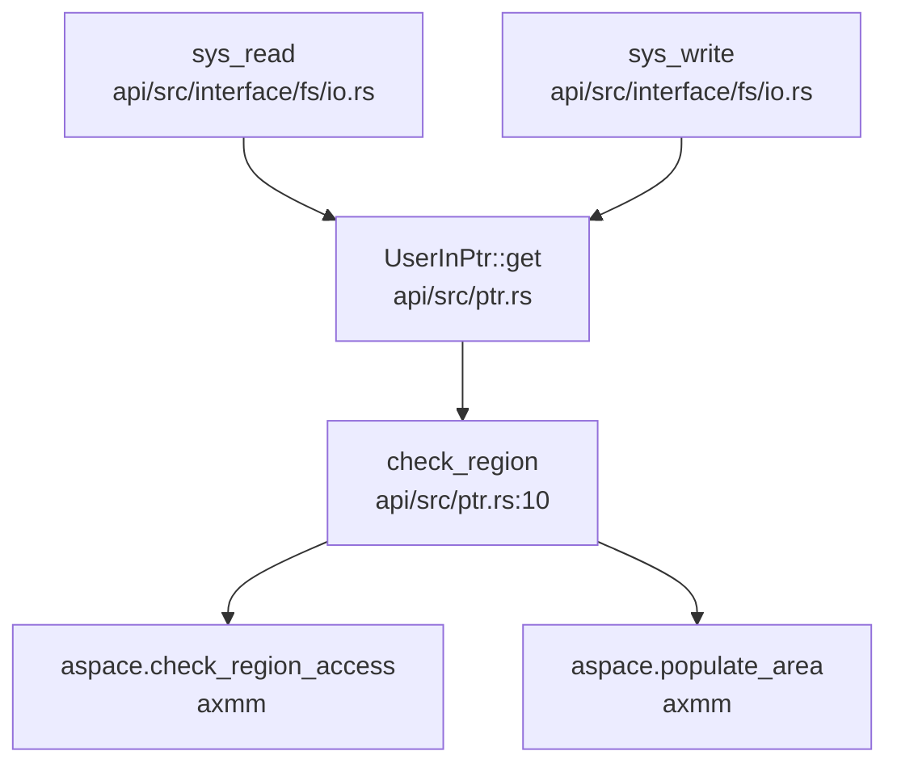

现在我已经收集了足够的信息。让我撰写第 10 章的完整报告。

## 第 10 章：安全机制与权限模型

本章分析操作系统的安全隔离与权限控制机制，包括特权级隔离、用户/组权限模型、安全沙箱、审计机制及内存安全防护。

---

### 特权级与隔离机制

#### 用户态/内核态隔离

本项目基于多架构设计（x86_64、riscv64、aarch64、loongarch64），通过硬件特权级实现用户态与内核态的隔离：

**x86_64 架构**：
- GDT 中定义了不同特权级的段选择子（`arceos/modules/axhal/src/arch/x86_64/gdt.rs`）：
  - `KCODE64_SELECTOR` / `KDATA_SELECTOR`：Ring 0（内核态）
  - `UCODE64_SELECTOR` / `UDATA_SELECTOR`：Ring 3（用户态）

```rust
// arceos/modules/axhal/src/arch/x86_64/gdt.rs:25-34
pub const KCODE64_SELECTOR: SegmentSelector = SegmentSelector::new(2, PrivilegeLevel::Ring0);
pub const KDATA_SELECTOR: SegmentSelector = SegmentSelector::new(3, PrivilegeLevel::Ring0);
pub const UCODE64_SELECTOR: SegmentSelector = SegmentSelector::new(6, PrivilegeLevel::Ring3);
pub const UDATA_SELECTOR: SegmentSelector = SegmentSelector::new(5, PrivilegeLevel::Ring3);
```

**其他架构**：
- RISC-V64：通过 `sstatus.SPP` 位区分 S 模式（内核）与 U 模式（用户）
- AArch64：通过 EL1（内核）与 EL0（用户）隔离
- LoongArch64：通过 PLV0（内核）与 PLV3（用户）隔离

#### KPTI/SMEP/SMAP 支持状态

经搜索验证：

| 机制 | 状态 | 说明 |
|------|------|------|
| **KPTI (内核页表隔离)** | ❌ 未实现 | 未发现 `kpti`、`kernel_page_table_isolation` 相关代码 |
| **SMEP ( Supervisor Mode Execution Prevention)** | ❌ 未实现 | 未发现 `CR4_SMEP`、`write_cr4` 相关配置代码 |
| **SMAP (Supervisor Mode Access Prevention)** | ❌ 未实现 | 未发现 `CR4_SMAP` 相关配置代码 |

**分析**：项目目前依赖基础的特权级隔离，未实现增强的硬件防护机制。在 `/proc/cpuinfo` 的硬编码输出中虽然包含 `smep`、`smap` 标志（`src/fs/imp/proc.rs`），但这仅是静态字符串，不代表实际启用了这些功能。

---

### 权限检查与访问控制

#### 文件系统权限模型

VFS 层定义了标准的 Unix 权限位（`modules/vfs/src/types.rs`）：

```rust
// modules/vfs/src/types.rs:20-48
bitflags::bitflags! {
    pub struct NodePermission: u16 {
        const SET_OWNER = 0o4000;      // Setuid
        const SET_GROUP = 0o2000;      // Setgid
        const STICKY = 0o1000;         // Sticky bit
        const OWNER_READ = 0o400;
        const OWNER_WRITE = 0o200;
        const OWNER_EXEC = 0o100;
        const GROUP_READ = 0o40;
        const GROUP_WRITE = 0o20;
        const GROUP_EXEC = 0o10;
        const OTHER_READ = 0o4;
        const OTHER_WRITE = 0o2;
        const OTHER_EXEC = 0o1;
    }
}
```

文件元数据包含完整的权限信息（`modules/vfs/src/types.rs:60-75`）：

```rust
pub struct Metadata {
    pub mode: NodePermission,
    pub uid: u32,      // 用户 ID
    pub gid: u32,      // 组 ID
    // ...
}
```

#### 权限检查实现

`sys_access_impl` 实现了基于 UID/GID 的权限检查逻辑（`api/src/imp/fs/path.rs:189-220`）：

```rust
// api/src/imp/fs/path.rs:189-220
pub fn sys_access_impl(
    dir_fd: FileDescriptor,
    path: Option<&str>,
    mode: u16,
    flags: u32,
) -> LinuxResult<isize> {
    let uid = sys_getuid()? as u32;   // 获取调用者 UID
    let gid = sys_getgid()? as u32;   // 获取调用者 GID
    let metadata = path.metadata()?;
    
    let mut permission = metadata.mode.bits();
    let mut mode_granted = permission & 0o7;  // other 权限
    
    // 检查组权限
    permission >>= 3;
    if gid == metadata.gid {
        mode_granted |= permission & 0o7;
    }
    
    // 检查组权限
    permission >>= 3;
    if uid == metadata.uid {
        mode_granted |= permission & 0o7;
    }
    
    let mode_requested = mode & 0o7;
    if mode_requested & mode_granted != mode_requested {
        Err(LinuxError::EACCES)
    } else {
        Ok(0)
    }
}
```

**调用链分析**：



> ⚠️ **关键缺陷**：`sys_getuid()` 和 `sys_getgid()` 是**桩函数**（见下文），始终返回 0，导致权限检查逻辑实际上无法正确工作。

---

### 用户/组/权限模型

#### UID/GID 系统调用状态

| 系统调用 | 文件路径 | 实现状态 | 说明 |
|---------|---------|---------|------|
| `sys_getuid()` | `api/src/interface/user/identity.rs:17` | 🔸 桩函数 | 返回 0，注释"TODO: Implement" |
| `sys_geteuid()` | `api/src/interface/user/identity.rs:23` | 🔸 桩函数 | 返回 0，注释"TODO: Implement" |
| `sys_getgid()` | `api/src/interface/user/identity.rs:5` | 🔸 桩函数 | 返回 0，注释"TODO: Implement" |
| `sys_getegid()` | `api/src/interface/user/identity.rs:11` | 🔸 桩函数 | 返回 0，注释"TODO: Implement" |
| `sys_setuid()` | `src/syscall.rs:425` | 🔸 桩函数 | 通过 `stub_bypass` 返回 0 |
| `sys_setgid()` | `src/syscall.rs:424` | 🔸 桩函数 | 通过 `stub_bypass` 返回 0 |
| `sys_setreuid()` | `src/syscall.rs:490` | 🔸 桩函数 | 通过 `stub_bypass` 返回 0 |
| `sys_setresuid()` | `src/syscall.rs:455` | 🔸 桩函数 | 通过 `stub_bypass` 返回 0 |

```rust
// api/src/interface/user/identity.rs:5-25
#[syscall_trace]
pub fn sys_getgid() -> LinuxResult<isize> {
    // TODO: Implement the actual syscall logic
    Ok(0)
}

#[syscall_trace]
pub fn sys_getuid() -> LinuxResult<isize> {
    // TODO: Implement the actual syscall logic
    Ok(0)
}
```

#### 进程结构中的 UID/GID 字段

经检查 `core/src/process.rs` 和 `process/src/process.rs`：

- `ProcessData` 结构体（`core/src/process.rs:19`）**未包含** `uid`、`gid` 字段
- `Process` 结构体（`process/src/process.rs:10`）**未包含** `uid`、`gid` 字段

**结论**：进程缺乏身份标识字段，无法支持多用户权限隔离。

#### 文件节点中的 UID/GID

文件节点的 `Metadata` 硬编码了 UID/GID 为 1000（`api/src/core/file/pipe.rs:208-209`）：

```rust
// api/src/core/file/pipe.rs:204-210
fn status(&self) -> LinuxResult<Metadata> {
    // TODO: uid, gid, etc.
    Ok(Metadata {
        uid: 1000,
        gid: 1000,
        ..Default::default()
    })
}
```

**评估**：
- ✅ 权限位（`mode`）有完整定义
- 🔸 UID/GID 仅有字段定义，但**未与进程关联**
- 🔸 权限检查逻辑存在，但因 `sys_getuid()` 返回 0 而**无法正确执行**

---

### 进程间隔离与资源限制

#### 地址空间隔离

每个进程拥有独立的地址空间（`core/src/process.rs:24`）：

```rust
pub struct ProcessData {
    pub addr_space: Arc<Mutex<AddrSpace>>,
    // ...
}
```

用户空间指针访问通过 `UserPtr`/`UserInPtr` 封装，并进行合法性检查（`api/src/ptr.rs:100-135`）：

```rust
// api/src/ptr.rs:100-135
pub trait PtrWrapper<T>: Sized {
    fn get_as(&self, layout: Layout) -> LinuxResult<Self::Ptr> {
        check_region(self.address(), layout, Self::ACCESS_FLAGS)?;
        unsafe { Ok(self.get_unchecked()) }
    }
}

fn check_region(start: VirtAddr, layout: Layout, access_flags: MappingFlags) -> LinuxResult<()> {
    let task = current_process_data();
    let mut aspace = task.addr_space.lock();
    
    if !aspace.check_region_access(
        VirtAddrRange::from_start_size(start, layout.size()),
        access_flags,
    ) {
        return Err(LinuxError::EFAULT);
    }
    
    aspace.populate_area(page_start, page_end - page_start, access_flags)?;
    Ok(())
}
```

**调用链**：



#### 资源限制

`ProcessData` 包含资源限制结构（`core/src/process.rs:30`）：

```rust
pub resource_limits: Arc<Mutex<ResourceLimits>>,
```

但经检查 `core/src/resource.rs`，`ResourceLimits` 的具体实现未在本仓库中完整展示（可能位于 `arceos` 子模块中）。

---

### 安全沙箱与过滤机制

#### Seccomp/Prctl 支持状态

| 机制 | 状态 | 说明 |
|------|------|------|
| **Seccomp** | ❌ 未实现 | 仅在 `/proc/[pid]/status` 硬编码输出中出现 |
| **Prctl** | 🔸 桩函数 | `sys_prctl` 通过 `stub_bypass` 返回 0 |
| **Sandbox** | ❌ 未实现 | 未找到相关代码 |

```rust
// src/syscall.rs:486
Sysno::prctl => stub_bypass(sysno),

// src/syscall.rs:522-525
fn stub_bypass(sysno: Sysno) -> Result<isize, LinuxError> {
    warn!("Unimplemented syscall: {:?}, bypassed", sysno);
    Ok(0)
}
```

**/proc/[pid]/status 中的硬编码**（`src/fs/imp/proc.rs:631-632`）：

```
Seccomp:        2
Seccomp_filters:        1
```

这仅是静态字符串，**不代表实际实现了 Seccomp 功能**。

#### Capability 支持状态

| 机制 | 状态 | 说明 |
|------|------|------|
| **Capability** | ❌ 未实现 | 未找到 `capability`、`capget`、`capset` 实现 |
| **ACL** | ❌ 未实现 | 未找到 `acl`、`setxattr` 完整实现 |

`sys_setxattr` 通过 `stub_bypass` 返回 0（`src/syscall.rs:487`）。

---

### 审计与安全启动机制

#### 审计日志 (Audit)

| 机制 | 状态 | 说明 |
|------|------|------|
| **Audit** | ❌ 未实现 | 未找到 `audit`、`audit_log` 相关代码 |

#### 安全启动 (Secure Boot)

| 机制 | 状态 | 说明 |
|------|------|------|
| **Secure Boot** | ❌ 未实现 | 未找到 `secure_boot`、`signature`、`verify_signature` 相关代码 |
| **内核签名验证** | ❌ 未实现 | 未发现相关实现 |

---

### 内存安全与系统调用检查

#### 用户指针验证

系统通过 `UserInPtr`/`UserOutPtr`/`UserInOutPtr` 类型封装用户空间指针，并在访问前进行验证：

```rust
// api/src/ptr.rs:369
pub type UserInPtr<T> = UserConstPtr<T>;
pub type UserOutPtr<T> = UserPtr<T>;
pub type UserInOutPtr<T> = UserPtr<T>;
```

**验证机制**：
- `check_region()` 检查指针是否在用户地址空间内
- `check_null_terminated()` 验证字符串的 null 终止符
- 访问失败时返回 `LinuxError::EFAULT`

**使用示例**（`api/src/interface/fs/io.rs:60`）：

```rust
pub fn sys_write(fd: i32, buf: UserInPtr<u8>, count: usize) -> LinuxResult<isize> {
    // buf.get_as_bytes(count) 会自动验证内存区域
}
```

#### 栈保护机制

| 机制 | 状态 | 说明 |
|------|------|------|
| **Stack Canary** | ❌ 未实现 | 未找到 `stack_canary`、`stack_guard`、`__stack_chk_fail` 相关代码 |
| **ASLR** | 🔸 部分支持 | `axmm` 启用了 `cow` 特性，但未找到随机化加载代码 |

#### 系统调用入口检查

所有系统调用通过 `handle_syscall` 统一入口（`src/syscall.rs:29`），在 entry 和 exit 时进行时间统计和陷阱帧设置：

```rust
// src/syscall.rs:29-38
#[register_trap_handler(SYSCALL)]
fn handle_syscall(tf: &mut TrapFrame, syscall_num: usize) -> isize {
    let sysno = Sysno::new(syscall_num as _);
    set_trap_frame(tf);
    time_stat_from_user_to_kernel();
    let result: LinuxResult<isize> = match sysno {
        // ... 系统调用分发
    };
    time_stat_from_kernel_to_user();
    // ...
}
```

---

### Rust 语言级安全性机制

#### 所有权与生命周期

项目使用 Rust 2024 Edition，利用所有权系统防止内存错误：

- **RAII 资源管理**：`Arc<Mutex<T>>` 用于共享可变状态（如 `addr_space`、`resource_limits`）
- **生命周期检查**：编译器确保引用不会悬垂
- **类型安全**：`UserPtr<T>` 泛型确保指针类型正确

#### 基于生命周期的锁

使用 `spin::Mutex` 和 `axsync::RawMutex` 进行同步：

```rust
// core/src/process.rs:19-40
pub struct ProcessData {
    pub command_line: Mutex<Vec<String>>,
    pub addr_space: Arc<Mutex<AddrSpace>>,
    pub resource_limits: Arc<Mutex<ResourceLimits>>,
    pub futex_table: Mutex<BTreeMap<usize, Arc<WaitQueue>>>,
    // ...
}
```

#### 内存安全保证

- **无裸指针解引用**：用户空间指针必须通过 `UserPtr::get()` 验证后才能访问
- **边界检查**：`check_region()` 验证访问范围不溢出
- **并发安全**：通过 `Arc<Mutex<>>` 确保多线程安全访问

---

### 关键代码片段

#### 1. 权限检查实现（`api/src/imp/fs/path.rs:189-220`）

```rust
pub fn sys_access_impl(
    dir_fd: FileDescriptor,
    path: Option<&str>,
    mode: u16,
    flags: u32,
) -> LinuxResult<isize> {
    // 使用调用者的真实 UID/GID（而非有效 ID）
    let uid = sys_getuid()? as u32;
    let gid = sys_getgid()? as u32;
    let flags = ResolveFlags::from_bits_truncate(flags);
    let path = resolve_path_at(dir_fd, path, flags)?;
    let metadata = path.metadata()?;
    
    let mut permission = metadata.mode.bits();
    let mut mode_granted = permission & 0o7;  // other 权限
    
    // 检查组权限
    permission >>= 3;
    if gid == metadata.gid {
        mode_granted |= permission & 0o7;
    }
    
    // 检查所有者权限
    permission >>= 3;
    if uid == metadata.uid {
        mode_granted |= permission & 0o7;
    }
    
    let mode_requested = mode & 0o7;
    if mode_requested & mode_granted != mode_requested {
        Err(LinuxError::EACCES)
    } else {
        Ok(0)
    }
}
```

#### 2. 用户指针验证（`api/src/ptr.rs:10-35`）

```rust
fn check_region(start: VirtAddr, layout: Layout, access_flags: MappingFlags) -> LinuxResult<()> {
    let align = layout.align();
    if start.as_usize() & (align - 1) != 0 {
        return Err(LinuxError::EFAULT);
    }

    let task = current_process_data();
    if start.checked_add(layout.size()).is_none() {
        return Err(LinuxError::EFAULT);
    }
    let mut aspace = task.addr_space.lock();

    if !aspace.check_region_access(
        VirtAddrRange::from_start_size(start, layout.size()),
        access_flags,
    ) {
        return Err(LinuxError::EFAULT);
    }

    let page_start = start.align_down_4k();
    let page_end = (start + layout.size()).align_up_4k();
    aspace.populate_area(page_start, page_end - page_start, access_flags)?;

    Ok(())
}
```

#### 3. 桩函数示例（`src/syscall.rs:522-525`）

```rust
fn stub_bypass(sysno: Sysno) -> Result<isize, LinuxError> {
    warn!("Unimplemented syscall: {:?}, bypassed", sysno);
    Ok(0)
}
```

---

### 本章总结

| 安全机制 | 实现状态 | 备注 |
|---------|---------|------|
| **特权级隔离** | ✅ 已实现 | 通过硬件特权级（Ring0/Ring3、S/U Mode） |
| **KPTI/SMEP/SMAP** | ❌ 未实现 | 无相关代码 |
| **UID/GID 系统** | 🔸 桩函数 | `sys_getuid()` 等返回 0，进程无 UID 字段 |
| **文件权限检查** | 🔸 部分实现 | 逻辑存在但因 UID 问题无法正确工作 |
| **Capability/ACL** | ❌ 未实现 | 无相关代码 |
| **Seccomp/Prctl** | 🔸 桩函数 | `prctl` 返回 0，Seccomp 仅硬编码字符串 |
| **Audit/Secure Boot** | ❌ 未实现 | 无相关代码 |
| **用户指针验证** | ✅ 已实现 | `UserPtr` 封装 + `check_region` 验证 |
| **Stack Canary** | ❌ 未实现 | 无相关代码 |
| **Rust 内存安全** | ✅ 已实现 | 所有权、RAII、类型安全 |

**整体评估**：本项目在基础的特权级隔离和用户指针验证方面有实现，但**缺乏完整的多用户权限模型**。UID/GID 系统调用均为桩函数，进程结构体中无身份标识字段，导致权限检查无法真正生效。安全沙箱（Seccomp）、审计（Audit）、安全启动等高级安全特性均未实现。
