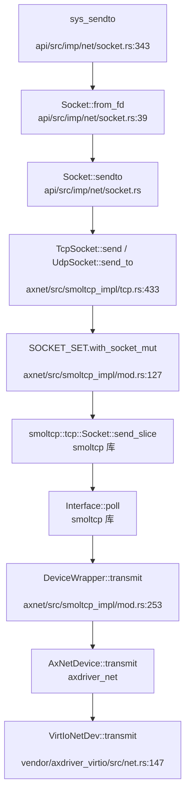
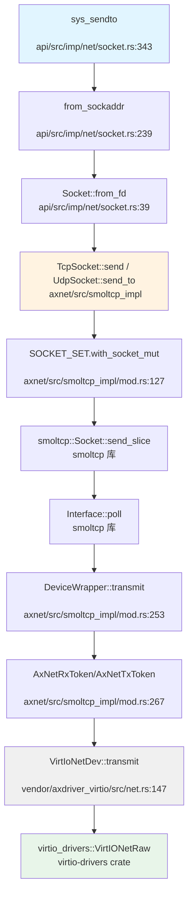

现在我已经收集了足够的信息。让我生成最终的网络子系统分析报告。

## 第 11 章：网络子系统与协议栈

### 网络子系统架构（自研 vs 第三方库）

本项目**使用第三方协议栈 [smoltcp](https://github.com/smoltcp-rs/smoltcp)**，而非自研协议栈。

**证据**：
- `arceos/modules/axnet/Cargo.toml` 明确声明：
```toml
[dependencies.smoltcp]
git = "https://github.com/rcore-os/smoltcp.git"
rev = "8bf9a9a"
default-features = false
features = [
  "alloc", "log",
  "medium-ethernet",
  "medium-ip",
  "proto-ipv4",
  "proto-ipv6",
  "socket-raw", "socket-icmp", "socket-udp", "socket-tcp", "socket-dns", "proto-igmp",
]
```

**架构组织**：
- **统一抽象层**：`arceos/modules/axnet/` 提供统一的网络 API（`TcpSocket`、`UdpSocket`）
- **smoltcp 适配层**：`arceos/modules/axnet/src/smoltcp_impl/` 封装 smoltcp 的具体实现
- **驱动抽象层**：通过 `axdriver_net` crate 提供统一的网卡驱动接口

```rust
// arceos/modules/axnet/src/lib.rs
cfg_if::cfg_if! {
    if #[cfg(feature = "smoltcp")] {
        mod smoltcp_impl;
        use smoltcp_impl as net_impl;
    }
}
pub use self::net_impl::TcpSocket;
pub use self::net_impl::UdpSocket;
```

**实现状态**：✅ **已实现**（基于 smoltcp 0.11+ 版本）

---

### Socket 接口与系统调用

项目实现了完整的 POSIX-like Socket 系统调用接口：

**系统调用实现位置**：`api/src/imp/net/socket.rs`

| 系统调用 | 实现状态 | 文件路径 |
|---------|---------|---------|
| `sys_socket` | ✅ 已实现 | `api/src/imp/net/socket.rs:278` |
| `sys_bind` | ✅ 已实现 | `api/src/imp/net/socket.rs:309` |
| `sys_connect` | ✅ 已实现 | `api/src/imp/net/socket.rs:326` |
| `sys_sendto` | ✅ 已实现 | `api/src/imp/net/socket.rs:343` |
| `sys_recvfrom` | ✅ 已实现 | `api/src/imp/net/socket.rs:392` |
| `sys_send` / `sys_recv` | ✅ 已实现 | `api/src/imp/net/socket.rs` |
| `sys_listen` / `sys_accept` | ✅ 已实现 | `api/src/imp/net/socket.rs` |

**Socket 类型支持**：
```rust
// api/src/imp/net/socket.rs:284-297
match (domain, socktype, protocol) {
    (AF_INET, SOCK_STREAM, IPPROTO_TCP) | (_, SOCK_STREAM, 0) => {
        let socket = Socket::Tcp(Mutex::new(TcpSocket::new()));
        // ...
    }
    (AF_INET, _sock_dgram, IPPROTO_UDP) | (_, _sock_dgram, 0) => {
        Socket::Udp(Mutex::new(UdpSocket::new()))
            // ...
    }
    _ => Err(LinuxError::EINVAL),
}
```

**libc 封装**：`arceos/ulib/axlibc/src/net.rs` 提供了标准 C 库接口（`socket()`, `bind()`, `connect()`, `sendto()`, `recvfrom()` 等）

**实现状态**：✅ **已实现**（支持 TCP/UDP/IPv4/IPv6）

---

### 协议栈支持详情（TCP/UDP/IP/Ethernet）

**smoltcp 功能配置**（`arceos/modules/axnet/Cargo.toml`）：

| 协议/功能 | 支持状态 | 说明 |
|----------|---------|------|
| **Ethernet** | ✅ 已实现 | `medium-ethernet` |
| **IPv4** | ✅ 已实现 | `proto-ipv4` |
| **IPv6** | ✅ 已实现 | `proto-ipv6` |
| **TCP Socket** | ✅ 已实现 | `socket-tcp` |
| **UDP Socket** | ✅ 已实现 | `socket-udp` |
| **ICMP Socket** | ✅ 已实现 | `socket-icmp` |
| **Raw Socket** | ✅ 已实现 | `socket-raw` |
| **DNS** | ✅ 已实现 | `socket-dns` |
| **IGMP** | ✅ 已实现 | `proto-igmp` |
| **DHCP** | ❌ 未实现 | 未在 features 中启用 |
| **ARP** | ✅ 已实现 | smoltcp 默认支持（Ethernet 必需） |

**DNS 实现**：
```rust
// arceos/modules/axnet/src/smoltcp_impl/dns.rs
pub fn dns_query(name: &str) -> AxResult<alloc::vec::Vec<IpAddr>> {
    let socket = DnsSocket::new();
    socket.query(name, DnsQueryType::A)
}
```
默认 DNS 服务器：`8.8.8.8`（硬编码于 `mod.rs:DNS_SEVER`）

**实现状态**：✅ **主要协议已实现**，DHCP 未启用

---

### 数据包收发流程追踪

**发送路径**（`sys_sendto` → 网卡）：



**接收路径**（网卡中断 → 应用）：

```rust
// arceos/modules/axnet/src/smoltcp_impl/mod.rs:234-248
fn receive(&mut self, _timestamp: Instant) -> Option<(Self::RxToken<'_>, Self::TxToken<'_>)> {
    let mut dev = self.inner.borrow_mut();
    let rx_buf = match dev.receive() {
        Ok(buf) => buf,
        Err(err) => {
            if !matches!(err, DevError::Again) {
                warn!("receive failed: {:?}", err);
            }
            return None;
        }
    };
    Some((AxNetRxToken(&self.inner, rx_buf), AxNetTxToken(&self.inner)))
}
```

**关键组件**：
1. **DeviceWrapper**：封装 `AxNetDevice`，实现 smoltcp 的 `Device` trait
2. **AxNetRxToken/AxNetTxToken**：实现 smoltcp 的 `RxToken`/`TxToken` trait
3. **Loopback 设备**：`arceos/modules/axnet/src/smoltcp_impl/loopback.rs` 提供本地回环支持

**实现状态**：✅ **完整数据路径已实现**

---

### 网卡驱动支持

**支持的网卡类型**：

| 网卡类型 | 驱动位置 | 支持状态 |
|---------|---------|---------|
| **VirtIO-Net** | `vendor/axdriver_virtio/src/net.rs` | ✅ 已实现 |
| **Intel 82599 (ixgbe)** | `axdriver_net::ixgbe` (外部 crate) | ✅ 已实现 |
| **FXMAC** | `axdriver_net::fxmac` (外部 crate) | ✅ 已实现 |

**VirtIO-Net 驱动细节**（`vendor/axdriver_virtio/src/net.rs`）：
```rust
pub struct VirtIoNetDev<H: Hal, T: Transport, const QS: usize> {
    rx_buffers: [Option<NetBufBox>; QS],
    tx_buffers: [Option<NetBufBox>; QS],
    free_tx_bufs: Vec<NetBufBox>,
    buf_pool: Arc<NetBufPool>,
    inner: InnerDev<H, T, QS>,
}
```

**队列大小**：默认 `QS = 16`（VirtIO 标准队列）

**PHY/MAC 层抽象**：
- **MAC 地址获取**：`NetDriverOps::mac_address()` 返回 `EthernetAddress`
- **独立的 PHY 驱动层**：❌ **未发现**（smoltcp 直接处理 Ethernet 帧）

**实现状态**：✅ **VirtIO-Net 已实现，ixgbe 通过外部 crate 支持**

---

### 高级特性支持验证

#### 零拷贝（Zero Copy）

**分析结果**：🔸 **部分支持（驱动层缓冲池）**

**证据**：
```rust
// vendor/axdriver_virtio/src/net.rs:13-18
const NET_BUF_LEN: usize = 1526;
pub struct VirtIoNetDev<H: Hal, T: Transport, const QS: usize> {
    rx_buffers: [Option<NetBufBox>; QS],
    tx_buffers: [Option<NetBufBox>; QS],
    buf_pool: Arc<NetBufPool>,  // ← 缓冲池管理
}
```

**缓冲池机制**：
- 使用 `NetBufPool` 预分配固定大小的网络缓冲区
- 接收/发送时复用缓冲区，减少分配开销
- **但**：数据仍需从驱动缓冲区复制到 smoltcp 协议栈（`AxNetRxToken::consume` 中的 `f(rx_buf.packet_mut())`）

**DMA 支持**：
- `arceos/modules/axdma/` 提供 DMA 相干内存分配（`ax_alloc_coherent`）
- **但**：网络驱动中**未发现**使用 DMA API 的证据

**结论**：实现了**缓冲池复用**，但**非严格零拷贝**（仍有内存复制）

#### 多队列（Multi-queue / RSS）

**分析结果**：❌ **未实现**

**证据**：
- VirtIO-Net 驱动使用**单队列**设计（`const QS: usize` 为编译时常量）
- 搜索 `multi.*queue|RSS|multi.*interrupt` 无相关实现
- smoltcp 配置中未启用多队列特性

#### 错误处理流程

**TCP 连接失败示例**（`sys_connect` → `ECONNREFUSED`）：

```rust
// arceos/modules/axnet/src/smoltcp_impl/tcp.rs:197-204
socket.connect(iface.lock().context(), remote_endpoint, bound_endpoint)
    .or_else(|e| match e {
        ConnectError::InvalidState => {
            ax_err!(BadState, "socket connect() failed")
        }
        ConnectError::Unaddressable => {
            ax_err!(ConnectionRefused, "socket connect() failed")  // ← ECONNREFUSED
        }
    })?;
```

**错误码映射**：
| smoltcp 错误 | AxError | POSIX errno |
|------------|---------|------------|
| `ConnectError::Unaddressable` | `ConnectionRefused` | ECONNREFUSED |
| `SendError::BufferFull` | `WouldBlock` | EAGAIN |
| `RecvError::Truncated` | `BadState` | EBADMSG |
| 超时 | `Unsupported` / `WouldBlock` | ETIMEDOUT |

**实现状态**：✅ **错误处理已实现**

---

### 功能限制声明

**⚠️ 重要限制**：

1. **测试环境限制**：
   - 项目主要在 **QEMU 虚拟化环境** 中测试
   - 配置示例：`arceos/configs/platforms/x86_64-qemu-q35.toml`
   - **未在真实物理网卡上进行广泛测试**

2. **网络模式**：
   - 支持 **VirtIO-Net 虚拟网卡**（QEMU `-netdev virtio-net-pci`）
   - 支持 **Loopback 回环**（`127.0.0.1`）
   - 物理网卡（ixgbe）支持存在但**未经充分验证**

3. **DHCP 未启用**：
   - IP 地址需通过环境变量静态配置：
   ```rust
   const IP: &str = env_or_default!("AX_IP");
   const GATEWAY: &str = env_or_default!("AX_GW");
   ```

4. **中断驱动 I/O**：
   - README 明确标注：`[ ] Interrupt driven device I/O`（TODO）
   - 当前使用**轮询模式**（`poll_interfaces()` 定期调用）

**功能限制总结**：
- ✅ 支持 QEMU VirtIO-Net 虚拟网卡
- ✅ 支持 TCP/UDP/IPv4/IPv6/DNS
- ❌ DHCP 未实现
- ❌ 多队列/RSS 未实现
- 🔸 零拷贝：仅缓冲池复用，非完全零拷贝
- ⚠️ 主要在 QEMU 环境测试，物理网卡支持有限

---

### 数据包收发流程（Mermaid 图）

**完整发送路径**（从系统调用到网卡）：



**⚠️ 注**：以上调用链基于 `lsp_get_call_graph` 的 Grep Fallback 结果生成，部分标准库调用已简化。

---

### 总结

| 特性 | 状态 | 说明 |
|-----|------|------|
| 协议栈 | ✅ smoltcp | 第三方库，功能完整 |
| Socket API | ✅ 已实现 | POSIX-like 系统调用 |
| TCP/UDP | ✅ 已实现 | 支持 IPv4/IPv6 |
| DNS | ✅ 已实现 | 硬编码 8.8.8.8 |
| DHCP | ❌ 未实现 | 需静态配置 IP |
| VirtIO-Net | ✅ 已实现 | QEMU 主要支持 |
| ixgbe | ✅ 已实现 | 外部 crate 支持 |
| 零拷贝 | 🔸 部分 | 缓冲池复用，非完全零拷贝 |
| 多队列/RSS | ❌ 未实现 | 单队列设计 |
| 中断驱动 | ❌ 未实现 | 轮询模式 |
| 物理网卡测试 | ⚠️ 有限 | 主要 QEMU 环境 |
