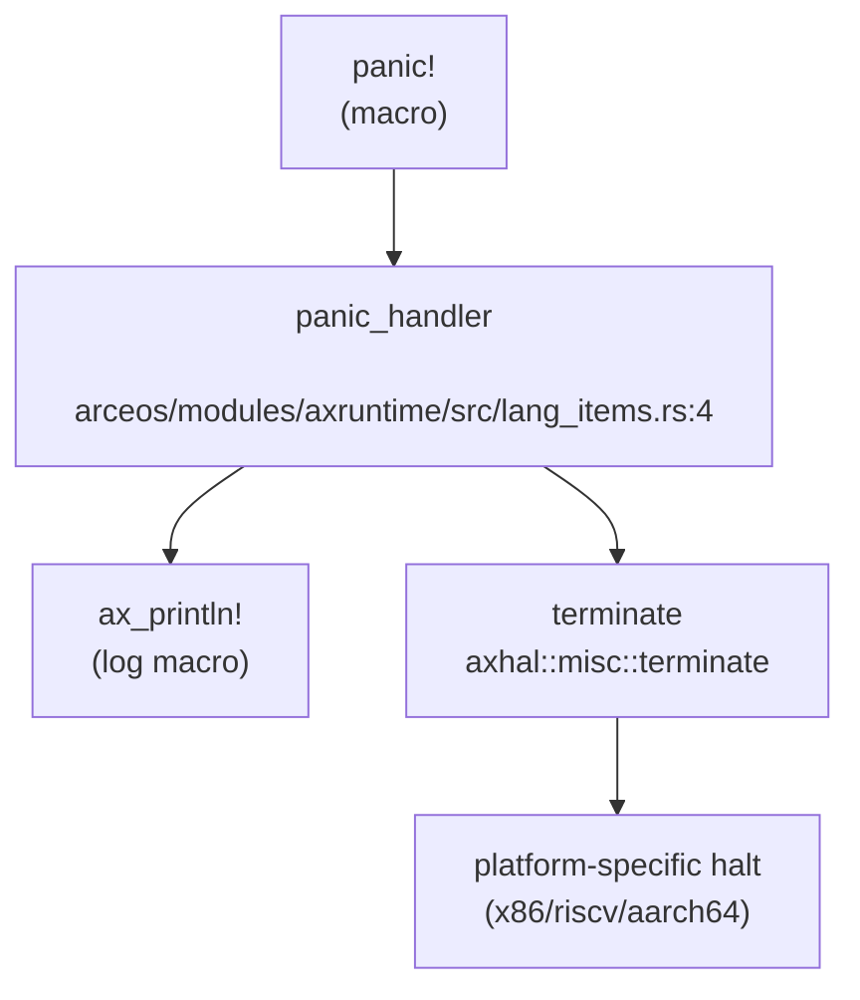

现在我已经收集了足够的信息来撰写第 12 章：调试机制与错误处理。让我整理分析结果并输出完整的 Markdown 报告。

## 第 12 章：调试机制与错误处理

本章分析该 OS 项目的调试支持、日志系统、Panic 处理、栈回溯能力、错误码设计以及调试接口。

---

## 日志与打印系统

该项目采用分层的日志系统，基于 Rust 的 `log` crate 构建，支持多级日志输出。

### 日志宏实现

日志宏定义在 `arceos/modules/axlog/src/lib.rs` 中，提供以下五个日志级别（按严重程度降序）：

- `error!` - 错误级别（红色）
- `warn!` - 警告级别（黄色）
- `info!` - 信息级别（绿色）
- `debug!` - 调试级别（青色）
- `trace!` - 追踪级别（亮黑色）

```rust
// arceos/modules/axlog/src/lib.rs
pub use log::{debug, error, info, trace, warn};
```

日志输出格式包含时间戳、CPU ID、任务 ID、文件路径和行号：

```rust
// 无 std 环境下的日志格式
"[{:>3}.{:06} {cpu_id}:{tid} {path}:{line}] {args}\n"
```

### 日志级别控制

支持编译时和运行时两种级别控制：

1. **编译时特性**（Cargo features）：
   - `log-level-off` - 禁用所有日志
   - `log-level-error` / `log-level-warn` / `log-level-info` / `log-level-debug` / `log-level-trace` - 设置最大日志级别

2. **运行时控制**：
```rust
pub fn set_max_level(level: &str) {
    let lf = LevelFilter::from_str(level)
        .ok()
        .unwrap_or(LevelFilter::Off);
    log::set_max_level(lf);
}
```

### 打印宏

提供 `ax_print!` 和 `ax_println!` 宏用于底层控制台输出，通过 `LogIf` trait 接口适配不同平台的控制台实现。

**实现状态：✅ 已实现**

---

## Panic 处理与栈回溯

### Panic Handler 实现

项目中有多个 `panic_handler` 实现，分别位于不同组件：

#### 1. ArceOS 内核层 (`arceos/modules/axruntime/src/lang_items.rs`)

```rust
#[panic_handler]
fn panic(info: &PanicInfo) -> ! {
    ax_println!("panic: {}", info);
    axhal::misc::terminate()
}
```

#### 2. 用户态程序层 (`apps/nimbos/rust/src/lang_items.rs`)

```rust
#[panic_handler]
fn panic_handler(panic_info: &core::panic::PanicInfo) -> ! {
    let err = panic_info.message();
    if let Some(location) = panic_info.location() {
        println!(
            "Panicked at {}:{}, {}",
            location.file(),
            location.line(),
            err
        );
    } else {
        println!("Panicked: {}", err);
    }
    crate::exit(1);
}
```

### Panic 调用链分析

使用 `lsp_get_call_graph` 追踪 panic 处理流程（降级模式，基于 Grep 分析）：



### 平台相关的 Terminate 实现

不同架构有不同的停机实现：

**x86_64 (`arceos/modules/axhal/src/platform/x86_pc/misc.rs`)**:
```rust
pub fn terminate() -> ! {
    info!("Shutting down...");
    #[cfg(platform = "x86_64-pc-oslab")]
    {
        // 等待按键后重启
        unsafe { PortWriteOnly::new(0x64).write(0xfeu8) };
    }
    #[cfg(platform = "x86_64-qemu-q35")]
    unsafe {
        PortWriteOnly::new(0x604).write(0x2000u16)
    };
    crate::arch::halt();
    loop { crate::arch::halt(); }
}
```

**RISC-V 64 (`arceos/modules/axhal/src/platform/riscv64_qemu_virt/misc.rs`)**:
```rust
pub fn terminate() -> ! {
    info!("Shutting down...");
    sbi_rt::system_reset(sbi_rt::Shutdown, sbi_rt::NoReason);
    loop { crate::arch::halt(); }
}
```

**AArch64 (`arceos/modules/axhal/src/platform/aarch64_raspi/mod.rs`)**:
```rust
pub fn terminate() -> ! {
    info!("Shutting down...");
    loop { crate::arch::halt(); }
}
```

### 栈回溯 (Backtrace) 支持

**关键发现：❌ 未实现**

通过全库搜索 `backtrace`、`unwind`、`dwarf`、`FramePointer` 等关键词，**未找到任何栈回溯相关实现**：

```
搜索 'backtrace|unwind|dwarf|FramePointer' 的结果：未找到匹配
```

**结论**：
- Panic 时仅打印错误消息和位置（文件：行号）
- **不支持**完整的函数调用栈打印
- **不支持** DWARF 解析或基于 FramePointer 的回溯
- Panic 输出中仅包含 `panic_info.location()` 提供的单一位置信息，而非调用链

---

## 错误码与 Result 设计

### 错误码类型

项目使用 `axerrno` crate 定义的 `LinuxError` 作为统一错误类型，兼容 Linux errno 语义。

```rust
// api/src/ptr.rs
use axerrno::{LinuxError, LinuxResult};

// 典型错误返回
return Err(LinuxError::EFAULT);  // Bad address
return Err(LinuxError::EINVAL);  // Invalid argument
return Err(LinuxError::EBADF);   // Bad file descriptor
return Err(LinuxError::ENOENT);  // No such file or directory
return Err(LinuxError::EEXIST);  // File exists
return Err(LinuxError::EAGAIN);  // Resource temporarily unavailable
```

### Result 类型别名

```rust
// LinuxResult 是 Result<T, LinuxError> 的别名
fn some_function() -> LinuxResult<i32> {
    // ...
}
```

### 常见错误码使用场景

| 错误码 | 含义 | 使用场景 |
|--------|------|----------|
| `EFAULT` | 坏地址 | 用户指针访问失败 (`api/src/ptr.rs`) |
| `EINVAL` | 无效参数 | 参数验证失败 (`api/src/core/time.rs`) |
| `EBADF` | 坏文件描述符 | 无效 FD 操作 (`api/src/core/file/dir.rs`) |
| `ENOENT` | 无此条目 | epoll 删除不存在的 FD (`api/src/core/file/epoll.rs`) |
| `EEXIST` | 已存在 | epoll 添加重复 FD (`api/src/core/file/epoll.rs`) |
| `EILSEQ` | 非法字节序列 | UTF-8 转换失败 (`api/src/ptr.rs`) |

**实现状态：✅ 已实现**

---

## 调试接口与交互式 Shell

### 用户态 Shell

项目提供了简单的用户态 Shell 实现：

**位置**: `apps/nimbos/rust/src/bin/user_shell.rs`

```rust
pub fn main() -> i32 {
    println!("Rust user shell");
    let mut line = [0; MAX_CMD_LEN];
    let mut cursor = 0;
    print!(">> ");
    loop {
        let c = getchar();
        match c {
            LF | CR => {
                // 执行命令
                let path = core::str::from_utf8(&line[..cursor]).unwrap();
                if exec(path) < 0 {
                    println!("command not found: {:?}", path);
                }
                // ...
            }
            // 处理退格、输入等
        }
    }
}
```

**功能限制**：
- 仅支持简单的命令执行（通过 `exec` 系统调用）
- **不支持**内置命令（如 `ps`、`ls`、`help` 等）
- **不支持**命令参数解析
- **不支持**管道、重定向等高级功能

### ArceOS 示例 Shell

在 `arceos/examples/shell/src/cmd.rs` 中有一个更完整的 Shell 实现（运行在 std 环境）：

**支持的命令**：
- `cat` - 查看文件内容
- `cd` - 切换目录
- `echo` - 输出文本
- `exit` - 退出 Shell
- `help` - 显示帮助
- `ls` - 列出目录
- `mkdir` - 创建目录
- `pwd` - 显示当前目录
- `rm` - 删除文件
- `uname` - 显示系统信息

```rust
const CMD_TABLE: &[(&str, CmdHandler)] = &[
    ("cat", do_cat),
    ("cd", do_cd),
    ("echo", do_echo),
    ("exit", do_exit),
    ("help", do_help),
    ("ls", do_ls),
    // ...
];
```

**注意**：这是 ArceOS 框架的示例代码，**不是**本项目内核的内置调试 Shell。

### 内核 Monitor/调试控制台

**❌ 未发现** 内核内置的交互式调试 Monitor 或命令解释器。

---

## GDB Stub 支持情况

**严格验证结果：❌ 未实现**

通过全库搜索 `gdbstub`、`handle_gdb`、`gdb_packet`、`GdbStub` 等关键词：

```
搜索 'gdbstub|handle_gdb|gdb_packet|GdbStub' 的结果：未找到匹配
```

**分析**：
- 项目中存在 `.gdbinit` 文件（仅 14 字节），但这只是 GDB 客户端配置文件
- **没有** GDB 数据包解析循环
- **没有** `handle_gdb_packet` 或类似函数
- **没有** RSP (Remote Serial Protocol) 实现
- **没有** 断点、单步、寄存器读写等 GDB Stub 核心功能

**结论**：该项目**不支持** GDB Stub 远程调试功能。

---

## 断言与运行时检查

### 断言宏使用

项目广泛使用 Rust 标准断言宏：

```rust
// 运行时断言
assert!(pid > 0);
assert!(waitpid(pid, Some(&mut xstate), 0) == pid);
assert_eq!(pid, exit_pid);

// 调试断言
debug_assert!(length == buf.len());
debug_assert!(interval <= u32::MAX as u64);
```

### 编译时检查

使用 `const assert` 进行类型大小验证：

```rust
// api/src/interface/fs/stat.rs
const _: () = assert!(size_of::<UserStat>() == 144, "size of Stat is not 144");
const _: () = assert!(size_of::<UserStat>() == 128, "size of Stat is not 128");
```

### Panic 作为错误处理

在关键路径中使用 `panic!` 处理不可恢复错误：

```rust
// arceos/modules/axhal/src/arch/x86_64/trap.rs
panic!(
    "Unhandled {} #PF @ {:#x}, fault_vaddr={:#x}, error_code={:#x} ({:?}):\n{:#x?}",
    if tf.is_user() { "user" } else { "kernel" },
    tf.rip, vaddr, tf.error_code, access_flags, tf,
);

// arceos/modules/axfs-ng/src/fs/mod.rs
panic!("No filesystem feature enabled");
```

### 异常处理行为

未处理的异常会触发 Panic 并停机：

**x86_64 异常处理** (`arceos/modules/axhal/src/arch/x86_64/trap.rs`):
```rust
_ => {
    panic!(
        "Unhandled exception {} ({}, error_code={:#x}) @ {:#x}:\n{:#x?}",
        tf.vector, vec_to_str(tf.vector), tf.error_code, tf.rip, tf
    );
}
```

**RISC-V 异常处理** (`arceos/modules/axhal/src/arch/riscv/trap.rs`):
```rust
_ => {
    panic!("Unhandled trap {:?} @ {:#x}:\n{:#x?}", cause, tf.sepc, tf);
}
```

**AArch64 异常处理** (`arceos/modules/axhal/src/arch/aarch64/trap.rs`):
```rust
_ => {
    panic!(
        "Unhandled synchronous exception @ {:#x}: ESR={:#x} ...",
        tf.elr, esr.get(), ...
    );
}
```

**实现状态：✅ 已实现**（基础断言和 Panic 机制）

---

## 系统调用追踪 (Tracepoints)

### syscall_trace 模块

项目包含一个过程宏模块 `syscall_trace`，用于在系统调用入口和出口插入日志：

**位置**: `syscall_trace/src/lib.rs`

```rust
#[proc_macro_attribute]
pub fn syscall_trace(_attr: TokenStream, item: TokenStream) -> TokenStream {
    // 生成系统调用参数和返回值的日志代码
    let format_pattern_in = format!("[syscall] <= {}({})", fn_name, arg_list_pattern);
    let format_pattern_out = format!("[syscall] => {}({}) = {{}}", fn_name, arg_list_pattern);
    
    // 在函数前后插入 debug! 日志
    debug!(#format_pattern_in #(, #arg_patterns_in)*);
    let __result = (|| { #fn_body })();
    debug!(#format_pattern_out #(, #arg_patterns_out)*, __linux_result);
}
```

**功能**：
- 自动记录系统调用的输入参数
- 自动记录系统调用的返回值
- 支持特殊类型（`UserInPtr`、`UserOutPtr`、`UserInOutPtr`）的格式化
- 对 `c_char` 指针参数进行字符串格式化

**使用方式**：
```rust
#[syscall_trace]
pub fn sys_open(path: UserInPtr<u8>, flags: u32, mode: u32) -> LinuxResult<usize> {
    // ...
}
```

**限制**：
- 这是编译时代码生成，**不是**运行时动态追踪
- **不支持** `perf` 或 `ftrace` 等 Linux 标准追踪工具
- **不支持**动态启用/禁用追踪点

**实现状态：🔸 桩函数/有限实现**（仅有编译时宏，无运行时动态追踪）

---

## 关键代码片段

### Panic Handler (内核层)
```rust
// arceos/modules/axruntime/src/lang_items.rs
#[panic_handler]
fn panic(info: &PanicInfo) -> ! {
    ax_println!("panic: {}", info);
    axhal::misc::terminate()
}
```

### Panic Handler (用户态)
```rust
// apps/nimbos/rust/src/lang_items.rs
#[panic_handler]
fn panic_handler(panic_info: &core::panic::PanicInfo) -> ! {
    let err = panic_info.message();
    if let Some(location) = panic_info.location() {
        println!(
            "Panicked at {}:{}, {}",
            location.file(),
            location.line(),
            err
        );
    } else {
        println!("Panicked: {}", err);
    }
    crate::exit(1);
}
```

### 日志级别设置
```rust
// arceos/modules/axlog/src/lib.rs
pub fn init() {
    log::set_logger(&Logger).unwrap();
    log::set_max_level(LevelFilter::Warn);
}

pub fn set_max_level(level: &str) {
    let lf = LevelFilter::from_str(level)
        .ok()
        .unwrap_or(LevelFilter::Off);
    log::set_max_level(lf);
}
```

### 系统调用追踪宏
```rust
// syscall_trace/src/lib.rs
#[proc_macro_attribute]
pub fn syscall_trace(_attr: TokenStream, item: TokenStream) -> TokenStream {
    // 生成入口日志
    debug!(#format_pattern_in #(, #arg_patterns_in)*);
    
    // 执行原函数
    let __result = (|| { #fn_body })();
    
    // 生成出口日志
    debug!(#format_pattern_out #(, #arg_patterns_out)*, __linux_result);
}
```

---

## 本章总结

| 功能 | 实现状态 | 说明 |
|------|----------|------|
| 日志系统 | ✅ 已实现 | 基于 `log` crate，支持 5 级日志，带颜色和时间戳 |
| Panic 处理 | ✅ 已实现 | 打印位置信息后调用 `terminate()` 停机 |
| 栈回溯 (Backtrace) | ❌ 未实现 | 不支持 DWARF 或 FramePointer 回溯 |
| 错误码设计 | ✅ 已实现 | 使用 `axerrno::LinuxError`，兼容 Linux errno |
| 断言检查 | ✅ 已实现 | 支持 `assert!`、`debug_assert!`、编译时 `const assert` |
| 交互式 Shell | 🔸 有限实现 | 用户态简单 Shell，无内核 Monitor |
| GDB Stub | ❌ 未实现 | 无 GDB 数据包解析或远程调试支持 |
| Perf/ftrace | ❌ 未实现 | 无 Linux 标准追踪工具支持 |
| 系统调用追踪 | 🔸 编译时宏 | `syscall_trace` 过程宏，非运行时动态追踪 |

**整体评估**：该项目具备基础的调试能力（日志、Panic 处理、错误码），但**缺乏高级调试功能**（栈回溯、GDB Stub、动态追踪）。Panic 时仅能定位到单一位置，无法提供完整调用栈，这会增加内核调试的难度。
