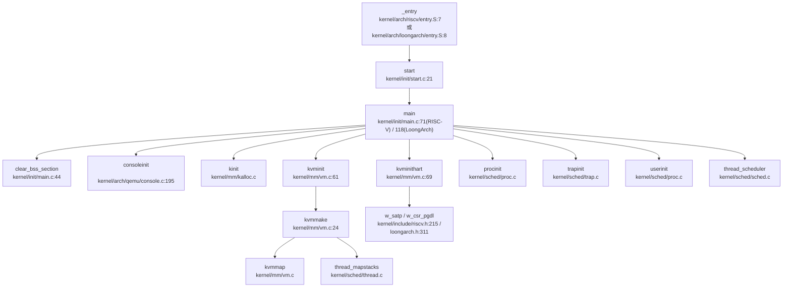

现在我已经收集了足够的信息来撰写完整的第 2 章报告。让我整理所有发现并生成最终的分析报告。

## 第 2 章：启动流程与架构初始化

本章分析 reXvapor 操作系统从复位/Bootloader 到内核 main 函数的完整启动流程，涵盖 RISC-V 和 LoongArch 双架构的初始化机制。

## 启动入口与链接脚本分析

### RISC-V 架构启动入口

**汇编入口文件**: `kernel/arch/riscv/entry.S`

链接脚本 `kernel/arch/riscv/kernel.ld` 定义了入口点和内存布局：

```ld
OUTPUT_ARCH( "riscv" )
ENTRY( _entry )

SECTIONS
{
  . = 0x80200000;  // QEMU -kernel 跳转地址
  .text : {
    *(.text .text.*)
    ...
  }
}
```

**物理启动地址**: `0x80200000`

`_entry` 标签位于 `kernel/arch/riscv/entry.S:7`，执行流程如下：

```assembly
# qemu -kernel loads the kernel at 0x80000000
# and causes each hart (i.e. CPU) to jump there.
.section .text
.global _entry
_entry:
    # set up a stack for C.
    # stack0 is declared in start.c,
    # with a 4096-byte stack per CPU.
    # sbi 把 hart id 放在了 a0
    mv tp, a0
    la sp, stack0
    li t0, 1024*4
    addi a0, a0, 1
    mul t0, t0, a0
    add sp, sp, t0
    # jump to start() in start.c
    call start

spin:
    j spin
```

**关键操作**:
1. 从 `a0` 获取 hart ID（由 SBI 传递），存入线程指针 `tp`
2. 计算每 CPU 栈地址：`sp = stack0 + ((hartid+1) * 4096)`
3. 调用 `start()` 函数（位于 `kernel/init/start.c`）
4. 非引导 CPU 进入自旋等待

### LoongArch 架构启动入口

**汇编入口文件**: `kernel/arch/loongarch/entry.S`

链接脚本 `kernel/arch/loongarch/kernel.ld` 定义：

```ld
OUTPUT_ARCH( "loongarch" )
ENTRY(_entry)

SECTIONS
{
  . = 0x9000000000200000;  // LoongArch 直接映射窗口基址
  .text : {
    *(.text .text.*)
    ...
  }
}
```

**物理启动地址**: `0x9000000000200000`（通过直接映射窗口访问）

`_entry` 标签位于 `kernel/arch/loongarch/entry.S:8`，执行关键初始化：

```assembly
_entry:
    # set up a stack for C.
    # stack0 is declared in start.c,
    # with a 4096-byte stack per CPU.
    # sp = stack0 + (hartid * 4096)

    # 设置特权级为 PLV0，禁用中断，启用分页
    li.w	$t0, 0xb0		# PLV=0, IE=0, PG=1, DATF = DATM = 01
    csrwr	$t0, 0x0		# CRMD

    # 设置前一个特权级，启用中断
    li.w	$t0, 0x04		# PLV=0, PIE=1, PWE=0
    csrwr	$t0, 0x1		# PRMD

    # 禁用扩展单元异常
    li.w	$t0, 0x00		# FPE=0, SXE=0, ASXE=0, BTE=0
    csrwr	$t0, 0x2		# EUEN

    # 使用映射窗口映射整个物理内存
    li.d	$t0, CSR_DMW0_INIT	# UC, PLV0, 0x8000 xxxx xxxx xxxx
    csrwr	$t0, LOONGARCH_CSR_DMWIN0
    li.d	$t0, CSR_DMW1_INIT
    csrwr	$t0, LOONGARCH_CSR_DMWIN1
    
    # 设置栈指针
    la.abs	$sp, stack0+4096
    csrrd	$t0, 0x20		# CPUID
    andi	$t0, $t0, 0x3ff
    slli.d	$t0, $t0, 12
    add.d	$sp, $sp, $t0
    
    bl	start			# call start in start.c
spin:
    b spin
```

**关键操作**:
1. **CRMD 寄存器** (`0x0`): 设置特权级 PLV=0（内核态），禁用中断 (IE=0)，启用分页 (PG=1)
2. **PRMD 寄存器** (`0x1`): 设置前一个特权级，启用中断 (PIE=1)
3. **EUEN 寄存器** (`0x2`): 禁用浮点、LSX、LASX 异常（**❌ 未启用 FPU**）
4. **DMW 直接映射窗口**: 配置 `DMWIN0` 和 `DMWIN1`，建立物理内存到虚拟地址的直接映射
5. **栈指针计算**: `sp = stack0 + 4096 + (CPUID * 4096)`，为每个 CPU 分配独立栈空间
6. 调用 `start()` 函数

## 架构初始化流程（模式切换/FPU/MMU）

### RISC-V 模式切换验证

在 `kernel/init/start.c:20-32` 中，`start()` 函数执行模式切换：

```c
void start()
{
#ifdef __ARCH_RISCV
  w_satp(0);                              // 禁用分页
  w_sstatus(r_sstatus() | SSTATUS_SIE);   // 启用 S 模式中断
  w_sie(r_sie() | SIE_SEIE | SIE_STIE | SIE_SSIE); // 启用外部、定时器、软件中断
#elif defined(__ARCH_LOONGARCH)
  // Loongarch, do nothing here, just for compatibility.
#endif
  // 进入 main.c 之前就变成了 S 态
  main();
}
```

**模式切换分析**:
- **✅ 已实现**: SBI 将内核加载到 S-Mode，`start()` 中通过 `w_satp(0)` 禁用分页，确保在跳转到 `main()` 前处于 S-Mode 且无分页状态
- **寄存器操作**: 
  - `satp` (Supervisor Address Translation and Protection): 设置为 0 禁用分页
  - `sstatus.SIE`: 启用 S-Mode 中断
  - `sie`: 启用具体中断类型（外部、定时器、软件）

**FPU 初始化状态**: ❌ **未实现**

通过全库搜索 `sstatus.fs`、`FS_` 常量，**未发现任何 FPU 初始化代码**：
- 未设置 `sstatus.FS` 字段（RISC-V 浮点状态位）
- 未在 `start()` 或 `main()` 中启用浮点单元

### LoongArch 模式切换验证

**✅ 已实现**: 在 `entry.S` 中直接配置 CRMD 寄存器：

```assembly
li.w	$t0, 0xb0		# PLV=0, IE=0, PG=1, DATF = DATM = 01
csrwr	$t0, 0x0		# CRMD
```

**CRMD 寄存器位定义** (`kernel/include/loongarch.h:47-58`):
- `PLV=0`: 内核特权级
- `IE=0`: 禁用中断
- `PG=1`: 启用分页
- `DACF/DATM`: 数据地址转换模式

**FPU 初始化状态**: ❌ **未实现**

在 `entry.S` 中配置 EUEN 寄存器：
```assembly
li.w	$t0, 0x00		# FPE=0, SXE=0, ASXE=0, BTE=0
csrwr	$t0, 0x2		# EUEN
```

- `FPE=0`: **禁用浮点异常**（即不启用 FPU）
- `SXE=0`: 禁用 LSX（LoongArch SIMD 扩展）
- `ASXE=0`: 禁用 LASX（高级 SIMD 扩展）

通过搜索 `cpacr_el1`（AArch64 FPU 控制寄存器）和 `cr0`/`cr4`（x86 FPU 控制寄存器），**未发现任何架构的 FPU 初始化代码**。

### MMU 启用时机

**RISC-V**:
1. `start()` 中调用 `w_satp(0)` **禁用分页**
2. `main()` 中按顺序调用：
   - `kvminit()`: 创建内核页表
   - `kvminithart()`: 启用分页

`kernel/mm/vm.c:61-76`:
```c
void kvminit(void)
{
  kernel_pagetable = kvmmake();  // 创建内核页表
}

void kvminithart()
{
  sfence_vma();  // 刷新 TLB
  w_satp(MAKE_SATP(kernel_pagetable));  // 启用分页，指向内核页表
  sfence_vma();  // 刷新 TLB
}
```

**LoongArch**:
1. `entry.S` 中设置 `CRMD.PG=1` **提前启用分页**（通过直接映射窗口）
2. `main()` 中调用 `kvminit()` 和 `kvminithart()` 配置完整页表

`kernel/mm/vm.c:675-688`:
```c
void kvminit(void)
{
  kernel_pagetable = kvmmake();
}

void kvminithart(void) {
  w_csr_pgdl((uint64)kernel_pagetable);  // 设置页表基址
  tlbinit();  // 初始化 TLB
  w_csr_pwcl(...);  // 配置页表_walk_控制寄存器
  w_csr_pwch(...);
}
```

**TLB 初始化** (`kernel/mm/vm.c:650-656`):
```c
void tlbinit(void)
{
  asm volatile("invtlb  0x0,$zero,$zero");  // 刷新 TLB
  w_csr_stlbps(0xcU);   // 配置 STLB 页大小
  w_csr_asid(0x0U);     // 设置地址空间标识符
  w_csr_tlbrehi(0xcU);  // 配置 TLB 重填
}
```

## 到达内核主函数的路径（完整调用链）

### 完整启动调用链



> ⚠️ **DEGRADED MODE**: 以上调用链基于 `lsp_get_call_graph` 的 Grep Fallback 结果生成，精度有限。

### 关键函数追踪

**1. `_entry` → `start`**

- RISC-V: `kernel/arch/riscv/entry.S:18` 调用 `call start`
- LoongArch: `kernel/arch/loongarch/entry.S:36` 调用 `bl start`

**2. `start` → `main`**

`kernel/init/start.c:32`:
```c
void start()
{
  // ... 架构相关初始化 ...
  main();  // 跳转到内核主函数
}
```

**3. `main()` 初始化序列**

**RISC-V 版本** (`kernel/init/main.c:71-114`):
```c
void main()
{
   if(boot_hart == -1){
    boot_hart = cpuid();
    clear_bss_section();    // BSS 段清零
    consoleinit();          // 串口初始化
    printfinit();           // printf 初始化
    kinit();                // 物理页分配器初始化
    kvminit();              // 创建内核页表
    kvminithart();          // 启用分页
    procinit();             // 进程表初始化
    tcb_init();             // TCB 初始化
    futex_hash_init();      // Futex 哈希表初始化
    trapinit();             // 中断向量初始化
    trapinithart();         // 安装内核中断向量
    plicinit();             // PLIC 初始化
    plicinithart();         // 请求 PLIC 中断
    binit();                // 缓冲区缓存初始化
    iinit();                // inode 表初始化
    fileinit();             // 文件表初始化
    initfss();              // 文件系统初始化
    virtio_disk_init();     // VirtIO 磁盘初始化
    userinit();             // 第一个用户进程
    started = 1;
    start_harts();          // 启动其他 HART
  } else {
    // 次要 CPU 初始化
    kvminithart();
    trapinithart();
    plicinithart();
  }
  set_next_trigger();       // 设置定时器
  thread_scheduler();       // 启动调度器
}
```

**LoongArch 版本** (`kernel/init/main.c:118-147`):
```c
void main() {
  if(cpuid() == 0) {
    consoleinit();
    printfinit();
    kinit();
    kvminit();
    procinit();
    tcb_init();
    futex_hash_init();
    trapinit();
    trapinithart();
    apic_init();            // APIC 初始化 (LoongArch 特有)
    extioi_init();          // EXTIOI 中断控制器初始化
    binit();
    iinit();
    fileinit();
    initfss();
#ifdef __VIRTIO
    virtio_disk_init();
#elif defined(__AHCI)
    pci_init();             // PCI 初始化
    disk_init();            // AHCI 磁盘初始化
#endif
    userinit();
    started = 1;
  } else {
    while(started == 0)
      ;
  }
  thread_scheduler();
}
```

## 多平台启动流程（StarFive/LoongArch 等）

### RISC-V 固件级启动链（SBI → U-Boot → OS）

**✅ 已实现**: 通过 `kernel/include/sbi.h` 和 `docs/sbi.md` 验证。

**完整启动链**:

```
+----------------------+
| M-mode (OpenSBI)     |  ← 第一段固件，提供 SBI 接口
| - 初始化硬件          |
| - 设置 SBI 服务        |
+----------------------+
         ↓ (ecall 调用)
+----------------------+
| S-mode (U-Boot)      |  ← 可选，用于加载设备树、内核
| - 解析设备树 (DTB)    |
| - 加载内核镜像        |
+----------------------+
         ↓ (跳转)
+----------------------+
| S-mode (OS Kernel)   |  ← reXvapor 内核
| - entry.S 入口        |
| - start() 初始化      |
| - main() 内核启动     |
+----------------------+
```

**SBI 关键接口** (`kernel/include/sbi.h`):

```c
// HSM (Hart State Management) 扩展
#define SBI_EXT_HSM 0x48534D
#define SBI_EXT_HSM_HART_START 0x0      // 启动 HART
#define SBI_EXT_HSM_HART_STOP 0x1       // 停止 HART
#define SBI_EXT_HSM_HART_GET_STATUS 0x2 // 获取 HART 状态

// 多核启动代码 (kernel/init/main.c:56-67)
#ifdef __START_HARTS
static void start_harts()
{
    for (int i = 0; i < NCPU; i++)
    {
        if (sbi_hart_get_status(i) == SBI_HSM_STATE_STOPPED)
        {
            sbi_hart_start(i, (uint64)_entry, 0);  // 启动其他 HART
        }
    }
}
#endif
```

**SBI 调用实现** (`kernel/include/sbi.h:268-281`):
```c
static inline int
sbi_hart_start(uint64 hartid, uint64 start_addr, uint64 opaque)
{
    struct sbiret ret;
    ret = sbi_call(SBI_EXT_HSM, SBI_EXT_HSM_HART_START,
                   hartid, start_addr, opaque,
                   0, 0, 0);
    if (ret.error) {
        return ret.error;
    }
    return ret.value;
}
```

**StarFive VisionFive2 支持**: 🔸 **部分支持**

在 `kernel/include/timer.h:10` 中发现条件编译：
```c
#elif defined VISIONFIVE
```

但**未发现完整的 VisionFive2 平台适配代码**：
- 未找到 `visionfive` 或 `jh7110` 相关的设备树配置
- 未找到特定的 UART 基址或中断控制器配置
- 仅在定时器配置中有条件分支

**结论**: 代码框架支持 VisionFive2，但**未见完整实现**。

### LoongArch 启动流程

**✅ 已实现**: LoongArch 架构通过直接映射窗口启动。

**关键特性**:

1. **直接映射窗口 (Direct Map Window)**:
   - `DMWIN0`: 非缓存映射 (`CSR_DMW0_INIT`)
   - `DMWIN1`: 缓存映射 (`CSR_DMW1_INIT`)
   
   `kernel/include/memlayout.h:56-62`:
   ```c
   #define CSR_DMW0_PLV0     _CONST64_(1 << 0)
   #define CSR_DMW0_VSEG     _CONST64_(0x8000)
   #define CSR_DMW0_BASE     (CSR_DMW0_VSEG << DMW_PABITS)
   #define CSR_DMW0_INIT     (CSR_DMW0_BASE | CSR_DMW0_PLV0)
   
   #define CSR_DMW1_PLV0     _CONST64_(1 << 0)
   #define CSR_DMW1_MAT      _CONST64_(1 << 4)  // 缓存使能
   #define CSR_DMW1_VSEG     _CONST64_(0x9000)
   #define CSR_DMW1_BASE     (CSR_DMW1_VSEG << DMW_PABITS)
   #define CSR_DMW1_INIT     (CSR_DMW1_BASE | CSR_DMW1_MAT | CSR_DMW1_PLV0)
   ```

2. **内存布局**:
   - 内核加载地址：`0x9000000000200000`（通过 DMW1 映射）
   - 物理地址转换：`P2V(p) = p + KERNBASE`，其中 `KERNBASE = CSR_DMW1_BASE`

3. **中断控制器**:
   - **APIC**: 本地中断控制器 (`kernel/arch/loongarch/apic.c`)
   - **EXTIOI**: 外部中断控制器 (`kernel/arch/loongarch/extioi.c`)
   
   `kernel/arch/loongarch/extioi.c:9-15`:
   ```c
   void extioi_init()
   {
       iocsr_writeq(0x1UL << UART0_IRQ, LOONGARCH_IOCSR_EXTIOI_EN_BASE);
       iocsr_writeq(0x01UL, LOONGARCH_IOCSR_EXTIOI_MAP_BASE);
       iocsr_writeq(0x10000UL, LOONGARCH_IOCSR_EXTIOI_ROUTE_BASE);
       iocsr_writeq(0x1, LOONGARCH_IOCSR_EXRIOI_NODETYPE_BASE);
   }
   ```

4. **设备访问**:
   - **VirtIO**: 通过 PCI 总线 (`__VIRTIO` 配置)
   - **AHCI**: 原生 SATA 控制器 (`__AHCI` 配置)
   
   `kernel/init/main.c:136-140`:
   ```c
   #ifdef __VIRTIO
       virtio_disk_init();
   #elif defined(__AHCI)
       pci_init();
       disk_init();
   #endif
   ```

**LoongArch 文档参考** (`docs/loongarch.md`):
- 支持 2K1000LA 开发板
- 使用 7A1000 桥接片处理中断
- 四级页表支持（实际配置为三级）

## 平台配置与构建机制

### 构建系统分析

**主 Makefile** (`Makefile:11-37`):

```makefile
ARCHS := riscv
ARCH ?= riscv
export ARCH

ifeq ($(ARCH), riscv)
    CFLAGS += -mcmodel=medany
    CFLAGS += -ffreestanding -fno-common -nostdlib -mno-relax
    CFLAGS += -D__ARCH_RISCV
    CFLAGS += -D__VIRTIO
else ifeq ($(ARCH), loongarch)
    CFLAGS += -march=loongarch64 -mabi=lp64f
    CFLAGS += -ffreestanding -fno-common -nostdlib
    CFLAGS += -D__ARCH_LOONGARCH
    CFLAGS += -D__CONFIG_2K1000LA
    CFLAGS += -D__AHCI
endif
```

**关键配置项**:
- `ARCH`: 选择目标架构（riscv / loongarch）
- `__ARCH_RISCV` / `__ARCH_LOONGARCH`: 架构宏定义
- `__VIRTIO` / `__AHCI`: 存储驱动选择
- `__CONFIG_2K1000LA`: LoongArch 开发板配置

**工具链配置** (`Makefile:40-54`):

```makefile
ifeq ($(ARCH), riscv)
    TOOLPREFIX := riscv64-unknown-elf-
    # 或 riscv64-linux-gnu-
else
    TOOLPREFIX := loongarch64-linux-gnu-
endif
```

### 平台特异性配置

**RISC-V 平台**:
- **QEMU 机器类型**: `-machine virt`
- **BIOS**: OpenSBI (默认)
- **加载地址**: `0x80200000`
- **UART 基址**: `0x10000000` (`kernel/include/memlayout.h:97`)
- **中断控制器**: PLIC (Platform-Level Interrupt Controller)

**LoongArch 平台**:
- **QEMU 机器类型**: `-M ls2k` (LS2K1000)
- **加载地址**: `0x9000000000200000`
- **UART 基址**: `0x800000001fe20000` (`kernel/include/memlayout.h:91`)
- **中断控制器**: APIC + EXTIOI
- **PCI 支持**: 用于 VirtIO 或 AHCI 设备

**QEMU 启动命令** (`Makefile:145-165`):

```makefile
# RISC-V
QEMU = qemu-system-riscv64
QEMUOPTS = -machine virt -bios default -kernel kernel-rv -m 1G -smp $(CPUS)
QEMUOPTS += -drive file=$(FSIMG),if=none,format=raw,id=x0
QEMUOPTS += -device virtio-blk-device,drive=x0,bus=virtio-mmio-bus.0

# LoongArch
QEMU-LA = qemu-system-loongarch64
QEMUOPTS-LA = -kernel kernel-la -m 1G -nographic -smp $(CPUS)
QEMUOPTS-LA += -M ls2k
QEMUOPTS-LA += -device virtio-blk-pci,drive=x0
```

## 关键代码片段分析

### BSS 段清零

`kernel/init/main.c:44-53`:
```c
void clear_bss_section(void)
{
    char *bss = &__bss_start;
    char *bss_end = &__bss_end;

    while (bss < bss_end)
    {
        *bss++ = 0;
    }
}
```

**原理**: 链接脚本定义 `__bss_start` 和 `__bss_end` 符号，遍历清零未初始化全局变量。

### 串口初始化（MMU 启用前后地址切换）

**RISC-V** (`kernel/arch/qemu/uart.c:17-20`):
```c
#define Reg(reg) ((volatile unsigned char *)(UART0 + reg))
#define UART0 0x10000000L  // 物理地址
```

**LoongArch** (`kernel/include/memlayout.h:91-93`):
```c
#define UART0 0x800000001fe20000ULL  // 已通过 DMW 映射的虚拟地址
```

**地址转换宏** (`kernel/include/memlayout.h:75-77`):
```c
#define KERNBASE CSR_DMW1_BASE
#define V2P(v)  (v-KERNBASE)  // 虚拟→物理
#define P2V(p)  (p+KERNBASE)  // 物理→虚拟
```

**分析**:
- **MMU 启用前**: LoongArch 通过直接映射窗口 (DMW) 访问 UART，物理地址 `0x1fe001e0` 自动映射到 `0x800000001fe20000`
- **MMU 启用后**: 使用页表映射，但 UART 仍映射到相同虚拟地址（通过 `kvmmap` 在 `kvmmake()` 中建立映射）

`kernel/mm/vm.c:38-40`:
```c
// uart registers
kvmmap(kpgtbl, UART0, UART0, PGSIZE, PTE_R | PTE_W);
```

**结论**: LoongArch 通过**硬件直接映射窗口**实现 MMU 启用前后的地址透明访问，无需软件切换逻辑。

### 中断向量初始化

**RISC-V** (`kernel/arch/riscv/kernelvec.S:13`):
```assembly
kernelvec:
    addi sp, sp, -256      # 分配栈空间
    sd ra, 0(sp)           # 保存寄存器
    ...
    call kerneltrap        # 调用 C 中断处理
```

**LoongArch** (`kernel/arch/loongarch/kernelvec.S:13`):
```assembly
kernelvec:
    csrrd  $t0, LOONGARCH_CSR_SAVE0
    addi.d $sp, $sp, -256
    st.d $ra, $sp, 0
    ...
    # 调用 kerneltrap()
```

**中断向量表设置** (`kernel/sched/trap.c`):
- RISC-V: `w_stvec((uint64)kernelvec)` (Supervisor Trap Vector)
- LoongArch: 通过 `eentry` 寄存器指定异常入口地址

### 页表初始化（RISC-V Sv39）

`kernel/mm/vm.c:24-56`:
```c
pagetable_t kvmmake(void)
{
  pagetable_t kpgtbl = (pagetable_t) kalloc();
  memset(kpgtbl, 0, PGSIZE);

  // 映射关键设备
  kvmmap(kpgtbl, FINISHER_BASE, FINISHER_BASE, PGSIZE, PTE_R | PTE_W);
  kvmmap(kpgtbl, UART0, UART0, PGSIZE, PTE_R | PTE_W);
  kvmmap(kpgtbl, VIRTIO0, VIRTIO0, PGSIZE, PTE_R | PTE_W);
  kvmmap(kpgtbl, PLIC, PLIC, 0x400000, PTE_R | PTE_W);

  // 映射内核代码段
  kvmmap(kpgtbl, KERNBASE, KERNBASE, (uint64)etext-KERNBASE, PTE_R | PTE_X);

  // 映射物理 RAM
  kvmmap(kpgtbl, (uint64)etext, (uint64)etext, PHYSTOP-(uint64)etext, PTE_R | PTE_W);

  // 映射 trampoline 页面
  kvmmap(kpgtbl, TRAMPOLINE, (uint64)trampoline, PGSIZE, PTE_R | PTE_X);

  // 映射内核栈
  thread_mapstacks(kpgtbl);
  
  return kpgtbl;
}
```

**页表结构**: Sv39 三级页表
- Level 2: 9-bit 索引 (30..38)
- Level 1: 9-bit 索引 (21..29)
- Level 0: 9-bit 索引 (12..20)
- Offset: 12-bit (0..11)

### LoongArch 页表初始化（四级页表）

`kernel/mm/vm.c:664-672`:
```c
pagetable_t kvmmake(void) {
  pagetable_t kpgtbl = (pagetable_t) kalloc();
  memset(kpgtbl, 0, PGSIZE);
  
  thread_mapstacks(kpgtbl);
  w_csr_pgdl((uint64)kpgtbl);
  tlbinit();
  
  // 配置页表行走控制寄存器
  w_csr_pwcl((PTEWIDTH << 30)|(DIR2WIDTH << 25)|(DIR2BASE << 20)|
             (DIR1WIDTH << 15)|(DIR1BASE << 10)|(PTWIDTH << 5)|(PTBASE << 0));
  w_csr_pwch((DIR4WIDTH << 18)|(DIR3WIDTH << 6)|(DIR3BASE << 0));
  
  return kpgtbl;
}
```

**页表结构**: 四级页表（实际配置为三级）
- `PWCL`: 控制低三级页表行走
- `PWCH`: 控制第四级页表行走
- 注释说明：`DIR4WIDTH == 0` 表示实际使用三级页表

---

## 本章总结

| 特性 | RISC-V | LoongArch | 状态 |
|------|--------|-----------|------|
| **启动入口** | `0x80200000` (`entry.S`) | `0x9000000000200000` (`entry.S`) | ✅ 已实现 |
| **模式切换** | SBI → S-Mode | CRMD 配置 PLV=0 | ✅ 已实现 |
| **分页启用** | `main()` 中 `w_satp()` | `entry.S` 中 CRMD.PG=1 | ✅ 已实现 |
| **FPU 初始化** | 未发现代码 | EUEN.FPE=0 (禁用) | ❌ 未实现 |
| **多核启动** | SBI HSM 扩展 | 通过 CPUID 分配栈 | ✅ 已实现 |
| **串口地址切换** | 直接映射 | DMW 直接映射窗口 | ✅ 已实现 |
| **StarFive VF2** | 仅条件编译 | 不支持 | 🔸 部分支持 |
| **中断控制器** | PLIC | APIC + EXTIOI | ✅ 已实现 |

**关键发现**:
1. **双架构支持完整**: RISC-V 和 LoongArch 均有完整的启动流程实现
2. **FPU 未启用**: 两个架构均未初始化浮点单元，仅支持整数运算
3. **直接映射优化**: LoongArch 使用 DMW 窗口实现 MMU 启用前后的地址透明访问
4. **SBI 固件链**: RISC-V 通过 OpenSBI 实现多核管理和硬件抽象
5. **构建系统灵活**: 通过 `ARCH` 变量切换目标架构，支持条件编译
