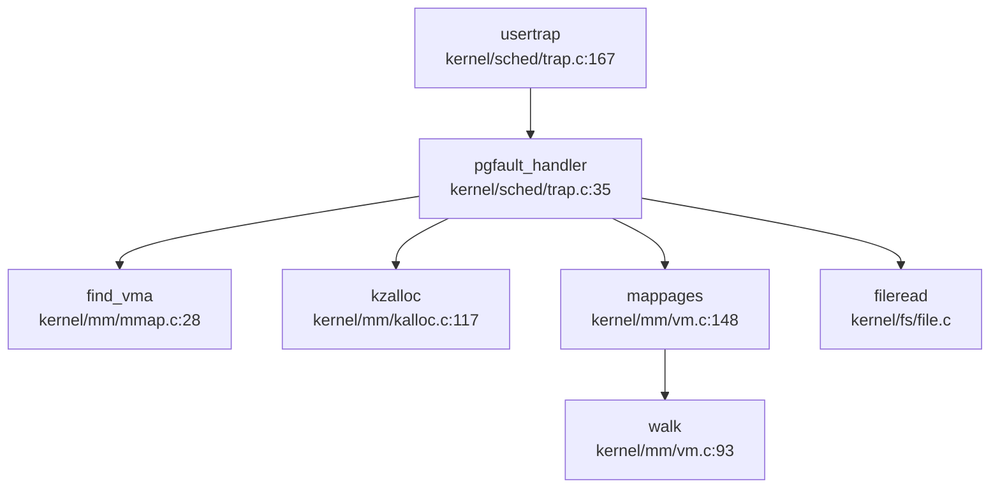

现在我已经收集了足够的信息来撰写内存管理章节。让我整理分析结果并生成完整的报告。

## 第 3 章：内存管理（物理/虚拟/分配器）

### 物理内存管理实现

本 OS 采用**空闲链表（Free List）**管理物理内存，而非位图或伙伴系统。

#### 物理页分配器接口

物理内存分配的核心数据结构定义于 `kernel/mm/kalloc.c`：

```c
struct run {
  struct run *next;
};

struct {
  struct spinlock lock;
  struct run *freelist;
} kmem;
```

**核心 API**（`kernel/include/kalloc.h`）：
- `void* kalloc(void)` — 分配一个 4096 字节物理页
- `void kfree(void *pa)` — 释放物理页
- `void* kzalloc(void)` — 分配并清零
- `void kinit(void)` — 初始化分配器

#### 分配算法

`kalloc()` 采用**头插法**从空闲链表取出页框：

```c
// kernel/mm/kalloc.c:97-110
void *kalloc(void) {
  struct run *r;
  acquire(&kmem.lock);
  r = kmem.freelist;
  if (r)
    kmem.freelist = r->next;
  release(&kmem.lock);
  if (r)
    memset((char *)r, 0, PGSIZE);
  return (void *)r;
}
```

`kfree()` 使用**头插法**回收页框，并填充 `0x1` 用于捕获悬空引用：

```c
// kernel/mm/kalloc.c:54-73
void kfree(void *pa) {
  struct run *r;
  // 边界检查
  if (((uint64)pa % PGSIZE) != 0 || (char *)pa < end || (uint64)pa >= PHYSTOP)
    panic("kfree");
  memset(pa, 1, PGSIZE);  // 填充 junk
  r = (struct run *)pa;
  acquire(&kmem.lock);
  r->next = kmem.freelist;
  kmem.freelist = r;
  release(&kmem.lock);
}
```

**初始化**：`kinit()` 调用 `freerange()` 将 `[end, PHYSTOP]` 范围内的物理页全部加入空闲链表。

**统计**：通过 `freemem_pages()` 和 `freemem_bytes()` 可查询剩余物理页数量（基于原子计数器 `g_freecnt`）。

---

### 虚拟内存与页表操作

#### 页表结构

页表类型定义于 `kernel/include/types.h:68`：

```c
typedef uint64 pte_t;
typedef uint64 *pagetable_t; // 512 PTEs
```

- **RISC-V**: 采用 Sv39 三级页表（9+9+9+12 位索引）
- **LoongArch**: 采用四级页表（支持 48 位物理地址）

#### 核心页表操作

**1. 页表遍历（walk）**

`walk()` 函数递归遍历页表层级，返回最后一级 PTE 地址：

```c
// kernel/mm/vm.c:93-118 (RISC-V)
pte_t *walk(pagetable_t pagetable, uint64 va, int alloc) {
  if(va >= MAXVA) panic("walk");
  for(int level = 2; level > 0; level--) {
    pte_t *pte = &pagetable[PX(level, va)];
    if(*pte & PTE_V) {
      pagetable = (pagetable_t)PTE2PA(*pte);
    } else {
      if(!alloc || (pagetable = (pde_t*)kalloc()) == 0)
        return 0;
      memset(pagetable, 0, PGSIZE);
      *pte = PA2PTE(pagetable) | PTE_V;
    }
  }
  return &pagetable[PX(0, va)];
}
```

**2. 页表映射（mappages）**

```c
// kernel/mm/vm.c:148-170
int mappages(pagetable_t pagetable, uint64 va, uint64 size, uint64 pa, int perm) {
  uint64 a = PGROUNDDOWN(va);
  uint64 last = PGROUNDDOWN(va + size - 1);
  for(;;) {
    if((pte = walk(pagetable, a, 1)) == 0) return -1;
    if(*pte & PTE_V) panic("mappages: remap");
    *pte = PA2PTE(pa) | perm | PTE_V;
    if(a == last) break;
    a += PGSIZE; pa += PGSIZE;
  }
  return 0;
}
```

**3. 解除映射（uvmunmap）**

```c
// kernel/mm/vm.c:177-197
void uvmunmap(pagetable_t pagetable, uint64 va, uint64 npages, int do_free) {
  for(uint64 a = va; a < va + npages*PGSIZE; a += PGSIZE) {
    pte_t *pte = walk(pagetable, a, 0);
    if(do_free) {
      uint64 pa = PTE2PA(*pte);
      kfree((void*)pa);
    }
    *pte = 0;
  }
}
```

---

### 地址空间布局（内核 vs 用户）

#### 内核地址空间

内核页表 `kernel_pagetable` 在 `kvmmake()` 中构建（`kernel/mm/vm.c:27-56`），映射包括：

| 虚拟地址范围 | 物理地址 | 权限 | 用途 |
|-------------|---------|------|------|
| `FINISHER_BASE` | `FINISHER_BASE` | RW | 关机寄存器 |
| `UART0` | `UART0` | RW | 串口 |
| `VIRTIO0` | `VIRTIO0` | RW | 磁盘 |
| `KERNBASE` | `KERNBASE` | RX | 内核代码 |
| `etext` | `etext` | RW | 内核数据 + 物理 RAM |
| `TRAMPOLINE` | `trampoline` | RX | 陷阱入口 |

**内核栈映射**：通过 `thread_mapstacks()` 为每个线程分配内核栈（位于 `KSTACK(t)`）。

#### 用户地址空间

用户页表通过 `uvmcreate()` 创建，初始为空。用户空间布局：

```
0x0000000000000000 ──────────────────┐
                                     │ 用户代码/数据
                                     │ (通过 uvmalloc 动态增长)
                                     │
                                     ├─ p->sz (进程堆顶)
                                     │
                                     │ 内存映射区 (mmap)
                                     │ (从 MMAP_MAX_ADDR_START 向下增长)
MMAP_END_ADDRESS ────────────────────┤
                                     │
KSTACK(NTHREADS+1) = BRKTOP ─────────┤  (brk 上限)
                                     │
KSTACK(t) ───────────────────────────┤  线程内核栈 (受内核页表保护)
                                     │
TRAMPOLINE ──────────────────────────┤  陷阱_trampoline
MAXVA ───────────────────────────────┘
```

**关键宏**（`kernel/include/memlayout.h`）：
- `MMAP_MAX_ADDR_START = THREAD_TRAPFRAME(MAX_THREAD)` — mmap 起始地址
- `MMAP_END_ADDRESS = MMAP_MAX_ADDR_START - 1GB` — mmap 下限
- `BRKTOP = KSTACK(NTHREADS + 1)` — brk 上限

**内核与用户空间隔离**：
- 内核页表：`PTE_U` 位清零，用户态不可访问
- 用户页表：设置 `PTE_U` 位，但内核可通过 `walkaddr()` 访问用户页

---

### 堆分配器解析

#### 用户堆管理（brk/sbrk）

**系统调用接口**（`kernel/sysproc.c:258-295`）：

```c
uint64 sys_sbrk(void) {
  int n;
  argint(0, &n);
  uint64 addr = myproc()->sz;
  if(growproc(n) < 0) return -1;
  return addr;
}

uint64 sys_brk(void) {
  uint64 addr;
  argaddr(0, &addr);
  if(addr >= MAXVA || addr >= BRKTOP) return -1;
  uint64 oldsz = myproc()->sz;
  if(addr == 0) return oldsz;
  if(addr > oldsz) {
    if (growproc(addr - oldsz) < 0) return -1;
    else return myproc()->sz;
  }
  return oldsz;  // ❌ 不支持收缩（返回旧值）
}
```

**`growproc()` 实现**（`kernel/sched/proc.c`）：
- 调用 `uvmalloc()` 或 `uvmdealloc()` 调整页表映射
- **立即分配物理页**：`uvmalloc()` 中调用 `kzalloc()` 分配物理页并映射

```c
// kernel/mm/vm.c:237-256
uint64 uvmalloc(pagetable_t pagetable, uint64 oldsz, uint64 newsz, int xperm) {
  for(uint64 a = oldsz; a < newsz; a += PGSIZE) {
    mem = kzalloc();  // 立即分配物理页
    if(mem == 0) { uvmdealloc(...); return 0; }
    memset(mem, 0, PGSIZE);
    if(mappages(pagetable, a, PGSIZE, (uint64)mem, PTE_R|PTE_U|xperm) != 0) {
      kfree(mem); return 0;
    }
  }
  return newsz;
}
```

**惰性分配状态**：❌ **未实现**。当前实现中，`brk/sbrk` 调整堆大小时**立即分配物理页**，而非仅调整边界。

---

#### 内存映射（mmap）

**VMA 管理结构**（`kernel/include/mmap.h:49-60`）：

```c
struct vma_struct {
    int valid;
    uint64 vm_start;
    uint64 vm_end;
    uint64 offset;
    int flags;
    int prot;
    int fd;
    struct file* file;
    vma_type_t type;  // VMA_FILE 或 VMA_ANONYMOUS
    struct list_head vma_list;
};
```

**进程级映射管理**（`kernel/include/mm.h:7-12`）：

```c
typedef struct mm_struct {
    uint64 max_vma;        // mmap 区上界（向下增长）
    list_head_t vma_list;  // VMA 链表
    spinlock_t lock;
    pagetable_t pagetable;
} mm_struct_t;
```

**`do_mmap()` 实现**（`kernel/mm/mmap.c:137-175`）：
- 从 `p->mm.max_vma` 向下分配 VMA 区间
- **不立即映射物理页**：仅创建 VMA 记录，实际映射在缺页异常中完成
- 支持 `MAP_ANONYMOUS` 和文件映射

```c
uint64 do_mmap(uint64 addr, uint64 length, uint64 prot, uint64 flags, ...) {
  vma = allocvma();
  vma->vm_end = PGROUNDDOWN(p->mm.max_vma);
  vma->vm_start = PGROUNDDOWN(p->mm.max_vma - length);
  p->mm.max_vma = vma->vm_start;
  list_add_tail(&vma->vma_list, &p->mm.vma_list);
  return vma->vm_start;  // 返回虚拟地址，不映射物理页
}
```

**`sys_mmap` 标志处理**：
- ✅ 处理 `MAP_ANONYMOUS`：设置 `vma->type = VMA_ANONYMOUS`
- ✅ 处理 `MAP_SHARED` / `MAP_PRIVATE`：存储在 `vma->flags`
- ❌ **未处理 `MAP_FIXED`**：忽略用户指定地址，始终从 `max_vma` 向下分配

**判定**：`sys_mmap` **✅ 已实现**，但功能有限（不支持 `MAP_FIXED`）。

---

### 用户指针安全验证

系统调用通过以下机制验证用户空间指针：

**1. `copyin` / `copyout` / `copyinstr`**（`kernel/mm/vm.c`）：
- `copyin()`: 用户 → 内核，调用 `walkaddr()` 验证 `PTE_U` 位
- `copyout()`: 内核 → 用户，同样验证
- `copyinstr()`: 复制字符串，检查 `\0` 终止符

```c
// kernel/mm/vm.c:133-145
uint64 walkaddr(pagetable_t pagetable, uint64 va) {
  pte_t *pte = walk(pagetable, va, 0);
  if(pte == 0) return 0;
  if((*pte & PTE_V) == 0) return 0;
  if((*pte & PTE_U) == 0) return 0;  // 非用户页拒绝
  return PTE2PA(*pte);
}
```

**2. `argfd` / `argaddr` / `argint`**（`kernel/syscall.c`）：
- 从 `trapframe` 提取参数
- 通过 `copyin()` 验证指针合法性

**3. 显式区域检查**：
- `sys_brk()` 检查 `addr >= MAXVA || addr >= BRKTOP`
- `mmap` 检查 `p->mm.max_vma < MMAP_END_ADDRESS`

**未发现** `UserInPtr` / `UserOutPtr` / `verify_area` 等封装结构，直接使用 `copyin/copyout`。

---

### 缺页异常处理流程

#### 缺页异常入口

缺页异常在 `usertrap()` 中识别（`kernel/sched/trap.c:189-202`）：

```c
if(which_dev == 3) {
  // read/write pagefault, maybe mmap cause
  pgfault_handler();
}
```

#### 完整调用链



**`pgfault_handler()` 实现**（`kernel/sched/trap.c:35-88`）：

```c
static void pgfault_handler() {
  uint64 va = PGROUNDDOWN(r_stval());  // RISC-V: stval, LoongArch: badv
  struct proc *p = myproc();
  acquire(&p->mm.lock);
  
  if(!(vma = find_vma(p, va))) {
    panic("usertrap: page fault");  // 非法访问
  }
  
  char* mem = kzalloc();  // 分配物理页
  mappages(p->mm.pagetable, va, PGSIZE, (uint64)mem, 
           PROT2PTE_FLAGS(vma->prot) | PTE_U | PTE_X);
  
  release(&p->mm.lock);
  
  if(vma->type != VMA_FILE) return;  // 匿名页直接返回
  
  // 文件映射：从文件读取内容
  struct file* fp = vma->file;
  int offset = va - vma->vm_start;
  fp->fops->read(fp, 1, va, offset, PGSIZE, &rcnt);
}
```

**调用方追踪**（`lsp_get_call_graph` 结果）：
- **Incoming**: `usertrap` → `pgfault_handler`
- **Outgoing**: `pgfault_handler` → `find_vma` → `kzalloc` → `mappages` → `walk`

---

### 高级内存特性清单

| 特性 | 状态 | 证据/说明 |
|------|------|-----------|
| **写时复制（CoW）** | ❌ 未实现 | 搜索 `cow\|copy_on_write` 无结果；`uvmcopy()` 直接复制物理页 |
| **懒分配（Lazy Allocation）** | 🔸 部分实现 | `mmap` 延迟映射（缺页时分配），但 `brk/sbrk` 立即分配 |
| **共享内存（shm）** | ❌ 未实现 | 搜索 `sys_shm\|shmget\|shmat` 无结果；`sysinfo.totalswap` 返回 0 |
| **反向映射表（rmap）** | ❌ 未实现 | 搜索 `rmap\|reverse_map\|page_to_vma` 无结果 |
| **交换区/页面置换（Swap）** | ❌ 未实现 | 搜索 `swap_out\|swap_in` 无业务逻辑；仅 `ext4_queue.h` 中有队列宏 |
| **大页支持（Huge Page）** | ❌ 未实现 | 搜索 `HugePage\|PTE_PS\|MapSize.*2M` 无结果 |
| **零拷贝（sendfile）** | ✅ 已实现 | `kernel/fs/sysfile.c:1628` 实现 `do_sendfile()`，内核缓冲中转 |
| **mmap 文件映射** | ✅ 已实现 | `do_mmap()` 支持 `VMA_FILE` 类型；缺页时调用 `fileread()` |
| **mmap MAP_FIXED** | ❌ 未实现 | `do_mmap()` 忽略 `addr` 参数，始终从 `max_vma` 向下分配 |
| **mmap MAP_ANON** | ✅ 已实现 | 检查 `flags & MAP_ANONYMOUS`，设置 `vma->type = VMA_ANONYMOUS` |

---

### 关键代码片段与调用链分析

#### 物理页分配调用链（`kalloc`）

**入向调用**（`lsp_get_call_graph` DEGRADED 模式，基于 Grep）：
- `kernel/mm/vm.c:30` — `kvmmake()` 分配内核页表
- `kernel/mm/vm.c:108` — `walk()` 分配页表页
- `kernel/mm/vm.c:264` — `uvmalloc()` 分配用户页
- `kernel/mm/mmap.c:9` — `allocvma()` 分配 VMA 结构
- `kernel/fs/sysfile.c:629` — 文件操作分配缓冲区

#### 页表递归释放（`freewalk`）

```c
// kernel/mm/vm.c:279-299
void freewalk(pagetable_t pagetable) {
  for(int i = 0; i < 512; i++) {
    pte_t pte = pagetable[i];
    if((pte & PTE_V) && (pte & (PTE_R|PTE_W|PTE_X)) == 0) {
      uint64 child = PTE2PA(pte);
      freewalk((pagetable_t)child);  // 递归释放子页表
      pagetable[i] = 0;
    } else if(pte & PTE_V) {
      panic("freewalk: leaf");  // 叶节点应先被 uvmunmap 移除
    }
  }
  kfree((void*)pagetable);  // 释放页表页本身
}
```

#### 零拷贝 sendfile 实现

```c
// kernel/fs/sysfile.c:1628-1690
int do_sendfile(struct file *out_f, struct file *in_f, off_t *offset, uint64 count) {
  void *kbuf = kalloc();  // 内核缓冲区
  nread = fileread(in_f, 0, (uint64)kbuf, count, in_f->fpos);
  nwritten = filewrite(out_f, 0, (uint64)kbuf, nread, out_f->fpos);
  kfree(kbuf);
  return nwritten;
}
```

**注意**：当前实现使用**单页内核缓冲**（`PGSIZE`），若 `count > PGSIZE` 则调用 `rw_sharp()` 循环读写，**非真正零拷贝**（仍经过内核缓冲）。

---

### 内存管理总结

| 子系统 | 实现状态 | 关键文件 |
|--------|---------|---------|
| 物理分配器 | ✅ 空闲链表 | `kernel/mm/kalloc.c` |
| 页表管理 | ✅ 三级/四级页表 | `kernel/mm/vm.c` |
| 用户堆（brk） | ✅ 立即分配 | `kernel/sysproc.c:sys_brk` |
| 内存映射（mmap） | ✅ 延迟分配 | `kernel/mm/mmap.c` |
| 缺页异常 | ✅ 按需分配 | `kernel/sched/trap.c:pgfault_handler` |
| 用户指针验证 | ✅ `copyin/copyout` | `kernel/mm/vm.c` |
| CoW | ❌ 未实现 | — |
| Swap | ❌ 未实现 | — |
| 大页 | ❌ 未实现 | — |
| 共享内存 | ❌ 未实现 | — |
