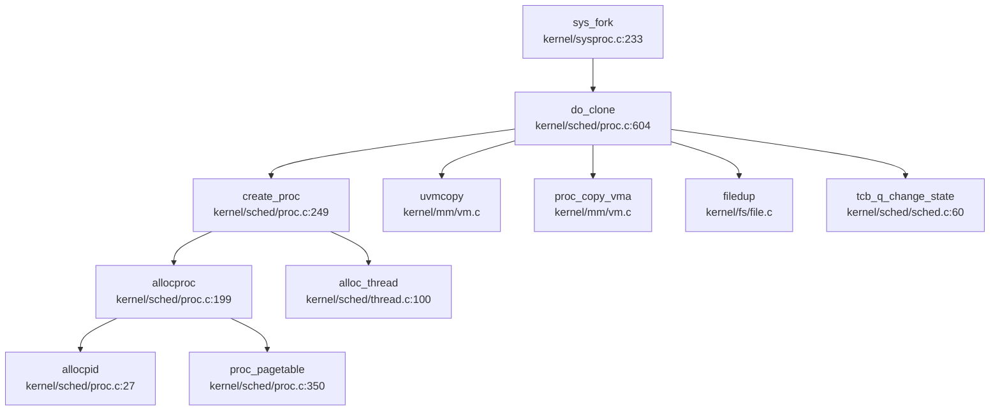
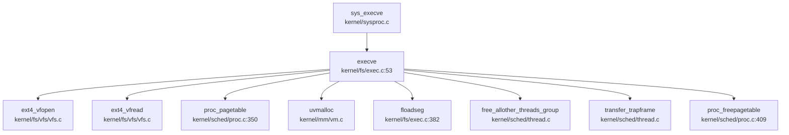
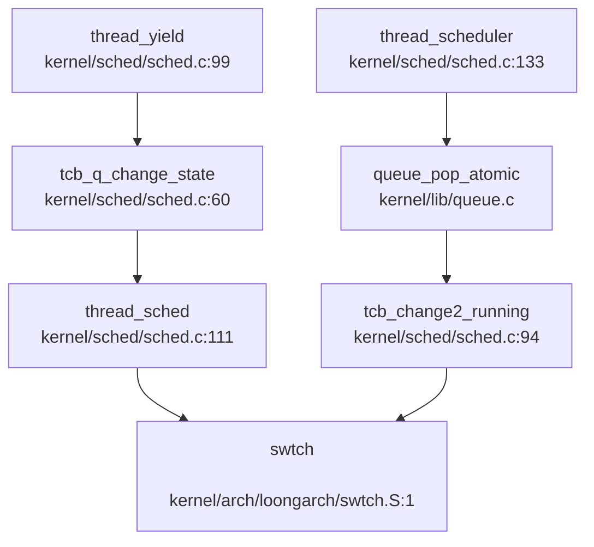
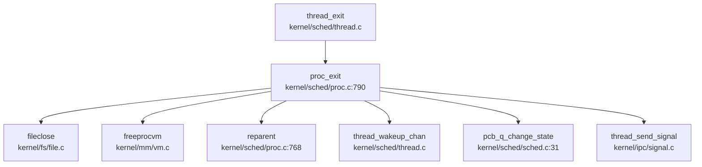

现在我已经收集了足够的信息。让我生成完整的第 4 章报告。

## 第 4 章：进程/线程与调度机制

### 任务模型与核心数据结构

本操作系统采用**进程 - 线程两级模型**，其中进程 (`struct proc`) 作为资源分配的基本单位，线程 (`struct tcb`) 作为调度的基本单位。

#### 进程控制块 (PCB) — `struct proc`

进程控制块定义于 `kernel/include/proc.h:35-86`，核心字段包括：

```c
struct proc {
  struct spinlock lock;              // 进程锁
  struct spinlock lth_exitlock;      // 线程退出锁
  enum procstate state;              // 进程状态 (UNUSED/USED/ZOMBIE)
  int killed;                        // 被杀死标志
  int xstate;                        // 退出状态
  int pid;                           // 进程 ID
  int pgid;                          // 进程组 ID
  
  uint64 kstack;                     // 内核栈虚拟地址
  uint64 sz;                         // 进程内存大小 (字节)
  
  int ofile_cnt;                     // 打开文件计数
  struct file *ofile[NOFILE];        // 打开文件表
  struct inode *cwd;                 // 当前工作目录
  struct cwdinfo cinfo;              // 当前目录信息
  
  char name[16];                     // 进程名
  _clock_t ktime;                    // 内核态时间
  _clock_t utime;                    // 用户态时间
  
  list_head_t state_list;            // 状态队列链表
  struct proc *parent;               // 父进程
  struct proc *first_child;          // 第一个子进程
  struct list_head sibling_list;     // 兄弟进程链表
  
  struct thread_group tg;            // 线程组
  pid_t ctid;                        // 克隆线程 ID
  
  struct semaphore tlock;            // 线程锁
  struct mm_struct mm;               // 内存管理结构
  struct ext4_dir dir;               // EXT4 目录信息
  struct rlimit rlim[RLIM_NLIMITS];  // 资源限制 (16 种)
};
```

**关键设计**：
- **进程状态简化**：仅定义 `UNUSED`、`USED`、`ZOMBIE` 三种状态 (`kernel/include/proc.h:32`)，真正的调度状态由线程管理
- **进程组支持**：`pgid` 字段在 `allocproc()` 中初始化为 `p->pid` (`kernel/sched/proc.c:210`)
- **资源限制**：支持 POSIX 定义的 16 种资源限制 (`kernel/include/rc.h:4-19`)

#### 线程控制块 (TCB) — `struct tcb`

线程控制块定义于 `kernel/include/thread.h:61-119`，核心字段包括：

```c
struct tcb {
    spinlock_t lock;                 // 线程锁
    char name[20];                   // 线程名
    thread_state_t state;            // 线程状态
    struct proc *p;                  // 所属进程
    tid_t tid;                       // 线程 ID (全局)
    int tidx;                        // 线程组内索引 (局部)
    int killed;                      // 被杀死标志
    struct list_head state_list;     // 状态队列链表
    
    uint64 kstack;                   // 内核栈
    uint64 ustack;                   // 用户栈
    struct trapframe *trapframe;     // Trap 帧
    struct context context;          // 上下文 (ra/sp/s0-s11)
    
    struct list_head threads;        // 线程组内链表
    struct thread_group *tg;         // 线程组指针
    
    struct queue *wait_chan_entry;   // 等待队列入口 (futex 用)
    struct list_head wait_list;      // 等待队列链表
    void *chan;                      // 睡眠通道
    uint64 timeout;                  // 超时时间 (ticks)
    
    int xstate;                      // 退出状态
    uint64 set_child_tid;            // CLONE_CHILD_SETTID
    uint64 clear_child_tid;          // CLONE_CHILD_CLEARTID
    
    struct sighand *sigs;            // 信号处理
    sigset_t blocked;                // 阻塞信号集
    struct sigpending sig_pending;   // 待处理信号队列
    int pending_cnt;                 // 待处理信号计数
    sig_t sig_processing;            // 正在处理的信号
};
```

**上下文结构** (`kernel/include/thread.h:28-45`)：
```c
struct context {
  uint64 ra;   // 返回地址
  uint64 sp;   // 栈指针
  uint64 s0-s11;  // 被调用者保存寄存器 (12 个)
};
```

#### 线程组 — `struct thread_group`

定义于 `kernel/include/thread.h:49-60`：
```c
struct thread_group {
    spinlock_t lock;           // 线程组锁
    tgid_t tgid;               // 线程组 ID (= PID)
    int thread_idx;            // 线程索引计数器
    atomic_t thread_cnt;       // 线程计数 (原子)
    struct list_head threads;  // 线程链表
    struct tcb *group_leader;  // 组长线程 (主线程)
};
```

---

### 调度算法与策略（代码证据）

#### 调度器实现

调度器位于 `kernel/sched/sched.c`，采用**基于队列的 FIFO 调度策略**。

**全局调度队列** (`kernel/sched/sched.c:9-14`)：
```c
queue_t unused_p_q, used_p_q, zombie_p_q;
queue_t *g_pcb_queues[PROC_STATEMAX] = {
    [UNUSED] &unused_p_q,
    [USED] &used_p_q,
    [ZOMBIE] &zombie_p_q
};

extern queue_t *g_tcb_queues[TCB_MAX_STATE];
```

**线程状态队列** (`kernel/sched/thread.c:16-35`)：
```c
queue_t unused_t_queue, used_t_queue, runnable_t_queue, sleeping_t_queue;

queue_t *g_tcb_queues[TCB_MAX_STATE] = {
    [TCB_UNUSED]   &unused_t_queue,
    [TCB_USED]     &used_t_queue,
    [TCB_RUNNABLE] &runnable_t_queue,
    [TCB_SLEEPING] &sleeping_t_queue
};
```

#### 调度器主循环

`thread_scheduler()` (`kernel/sched/sched.c:133-174`) 实现调度主循环：

```c
void thread_scheduler(void) {
    struct tcb *t;
    struct cpu *c = mycpu();
    c->thread = 0;
    
    for (;;) {
        intr_on();  // 允许中断
        t = (struct tcb *)queue_pop_atomic(g_tcb_queues[TCB_RUNNABLE], 1);
        if (t == NULL) continue;
        
        acquire(&t->lock);
        tcb_change2_running(t);  // 标记为 RUNNING
        c->thread = t;
        swtch(&c->context, &t->context);  // 上下文切换
        c->thread = 0;
        release(&t->lock);
    }
}
```

**调度策略分析**：
- **FIFO 调度**：使用 `queue_pop_atomic()` 从 `TCB_RUNNABLE` 队列头部取出线程，无优先级字段
- **无时间片**：代码中未发现时间片轮转 (RR) 或 CFS 相关实现
- **无优先级调度**：`struct tcb` 中无 `priority` 或 `stride` 字段

**状态转换函数** (`kernel/sched/sched.c:31-92`)：
- `pcb_q_change_state()`: 进程状态队列转换
- `tcb_q_change_state()`: 线程状态队列转换（特殊处理 `TCB_RUNNING`）
- `tcb_change2_running()`: 直接设置 `t->state = TCB_RUNNING`（不入队）

#### 主动让出 CPU

`thread_yield()` (`kernel/sched/sched.c:99-108`)：
```c
void thread_yield(void) {
    struct tcb *t = mythread();
    acquire(&t->lock);
    tcb_q_change_state(t, TCB_RUNNABLE);  // 变回 RUNNABLE
    thread_sched();                        // 触发调度
    release(&t->lock);
}
```

---

### 任务状态机

#### 进程状态机

定义于 `kernel/include/proc.h:32`：
```c
enum procstate { UNUSED, USED, ZOMBIE, PROC_STATEMAX };
```

**状态流转**：
1. **UNUSED → USED**: `allocproc()` 分配进程时 (`kernel/sched/proc.c:198-247`)
2. **USED → ZOMBIE**: `proc_exit()` 进程退出时 (`kernel/sched/proc.c:790-839`)
3. **ZOMBIE → UNUSED**: `wait_one()` 父进程回收后 `freeproc()` (`kernel/sched/proc.c:841-902`)

#### 线程状态机

定义于 `kernel/include/thread.h:17-22`：
```c
enum thread_state { 
    TCB_UNUSED,    // 空闲
    TCB_USED,      // 已分配但未运行
    TCB_RUNNABLE,  // 可运行（在就绪队列）
    TCB_RUNNING,   // 正在运行（不在队列）
    TCB_SLEEPING,  // 睡眠中
    TCB_MAX_STATE 
};
```

**状态流转图**：
```
UNUSED ←→ USED → RUNNABLE ↔ RUNNING → SLEEPING → RUNNABLE
                              ↓
                            ZOMBIE (进程退出时)
```

**关键转换点**：
- **USED → RUNNABLE**: `tcb_q_change_state(t, TCB_RUNNABLE)` 在 `fork()`/`do_clone()` 后调用
- **RUNNABLE → RUNNING**: `tcb_change2_running()` 在 `thread_scheduler()` 中调用
- **RUNNING → SLEEPING**: `thread_sleep()` 在等待事件时调用 (`kernel/ipc/futex.c:253-288`)
- **SLEEPING → RUNNABLE**: `thread_wakeup_chan()` 或 `futex_wake()` 唤醒

---

### 上下文切换实现（汇编分析）

#### LoongArch 架构 (`kernel/arch/loongarch/swtch.S:1-36`)

```assembly
.globl swtch
swtch:
    # 保存旧上下文到 old (a0)
    st.d $ra, $a0, 0
    st.d $sp, $a0, 8
    st.d $s0, $a0, 16
    st.d $s1, $a0, 24
    st.d $s2, $a0, 32
    st.d $s3, $a0, 40
    st.d $s4, $a0, 48
    st.d $s5, $a0, 56
    st.d $s6, $a0, 64
    st.d $s7, $a0, 72
    st.d $s8, $a0, 80
    st.d $fp, $a0, 88    # s9 用 fp 别名

    # 从 new (a1) 加载新上下文
    ld.d $ra, $a1, 0
    ld.d $sp, $a1, 8
    ld.d $s0, $a1, 16
    ld.d $s1, $a1, 24
    ld.d $s2, $a1, 32
    ld.d $s3, $a1, 40
    ld.d $s4, $a1, 48
    ld.d $s5, $a1, 56
    ld.d $s6, $a1, 64
    ld.d $s7, $a1, 72
    ld.d $s8, $a1, 80
    ld.d $fp, $a1, 88
    
    jirl $zero, $ra, 0   # 跳转到 ra
```

#### RISC-V 架构 (`kernel/arch/riscv/swtch.S:1-42`)

```assembly
.globl swtch
swtch:
    # 保存 12 个寄存器 (ra + sp + s0-s11)
    sd ra, 0(a0)
    sd sp, 8(a0)
    sd s0, 16(a0)
    sd s1, 24(a0)
    sd s2, 32(a0)
    sd s3, 40(a0)
    sd s4, 48(a0)
    sd s5, 56(a0)
    sd s6, 64(a0)
    sd s7, 72(a0)
    sd s8, 80(a0)
    sd s9, 88(a0)
    sd s10, 96(a0)
    sd s11, 104(a0)

    # 加载新上下文
    ld ra, 0(a1)
    ld sp, 8(a1)
    ld s0, 16(a1)
    ld s1, 24(a1)
    ld s2, 32(a1)
    ld s3, 40(a1)
    ld s4, 48(a1)
    ld s5, 56(a1)
    ld s6, 64(a1)
    ld s7, 72(a1)
    ld s8, 80(a1)
    ld s9, 88(a1)
    ld s10, 96(a1)
    ld s11, 104(a1)
    
    ret    # 返回到 ra
```

**保存的寄存器分析**：
- **调用者保存寄存器** (`t0-t6`, `a0-a7`): **不保存**（由编译器保证在调用前保存）
- **被调用者保存寄存器** (`s0-s11`): **全部保存**（12 个 × 8 字节 = 96 字节）
- **特殊寄存器**：`ra` (返回地址)、`sp` (栈指针)
- **总大小**：LoongArch 14 寄存器 (112 字节)，RISC-V 14 寄存器 (112 字节)

**注意**：`swtch()` 仅保存 callee-saved 寄存器，trapframe 中保存的 user registers（如 `a0-a7`, `t0-t6`）在用户态/内核态切换时由 `trap.c` 处理。

---

### 进程间通信与同步（Signal/Futex）

#### 信号机制 (Signal)

**实现状态**：✅ **已实现**

**核心文件**：
- `kernel/ipc/signal.c` (488 行) - 信号处理核心逻辑
- `kernel/ipc/syssig.c` (158 行) - 信号系统调用
- `kernel/include/signal.h` (358 行) - 信号数据结构定义

**支持的信号** (`kernel/include/signal.h:13-47`)：
- 标准信号：`SIGHUP(1)` 到 `SIGSYS(31)`
- 实时信号：`SIGRTMIN(32)` 起
- 最大信号数：`_NSIG = 64`

**关键数据结构**：
```c
struct sighand {
    spinlock_t siglock;
    atomic_t ref;
    struct sigaction actions[_NSIG];  // 每个信号的动作
};

struct sigpending {
    struct spinlock siglock;
    struct list_head list;      // 待处理信号队列
    sigset_t signal;            // 待处理信号集
};

struct sigqueue {
    struct list_head list;
    int flags;
    siginfo_t info;             // 信号详细信息
};
```

**系统调用** (`kernel/sysproc.c:323-387`)：
- `sys_kill()`: 发送信号到进程 (`proc_kill()`)
- `sys_tkill()`: 发送信号到线程 (`thread_kill()`)
- `sys_tgkill()`: 发送信号到线程组 (`thread_group_kill()`)

**信号处理流程** (`kernel/ipc/signal.c:107-180`)：
1. `signal_handle()`: 遍历待处理信号队列
2. `do_handle_signal()`: 调用 `setup_rt_frame()` 设置信号帧
3. `setup_rt_frame()`: 在用户栈上构建 `rt_sigframe`
4. 信号处理完成后通过 `sigret.S` 返回

**信号默认动作** (`kernel/ipc/signal.c:83-104`)：
- `SIGKILL`: 设置 `thread_setkilled(t)`
- `SIGCHLD`: 默认忽略（等待子进程退出）
- `SIGIOT`: 终止线程

#### Futex (快速用户态互斥锁)

**实现状态**：🔸 **部分实现**（仅支持 `FUTEX_WAIT` 和 `FUTEX_WAKE`）

**核心文件**：
- `kernel/ipc/futex.c` (334 行)
- `kernel/include/futex.h` (91 行)

**支持的操作** (`kernel/include/futex.h:10-20`)：
```c
#define FUTEX_WAIT     0   // ✅ 已实现
#define FUTEX_WAKE     1   // ✅ 已实现
#define FUTEX_FD       2   // ❌ 未实现
#define FUTEX_REQUEUE  3   // ❌ 未实现（代码注释掉）
#define FUTEX_CMP_REQUEUE 4 // ❌ 未实现
// ... 其他操作均未实现
```

**Futex 哈希表** (`kernel/ipc/futex.c:15-23`)：
```c
struct hash_table futex_hashtable = {
    .size = FUTEX_NUM,  // 32 个桶
};
```

**Futex 结构** (推断自 `futex.c`):
```c
struct futex {
    spinlock_t lock;
    queue_t waiting_queue;  // 等待队列
};

struct futex_hash_node {
    uint64 uaddr;           // 用户地址（键）
    struct futex *fp;       // futex 指针
    struct list_head futex_hash_list_node;
};
```

**核心实现**：

1. **`futex_wait()`** (`kernel/ipc/futex.c:253-288`):
```c
static int futex_wait(uint64 uaddr, uint32 val, const struct timespec *timeout) {
    // 1. 从用户空间读取 futex 值
    copyin(p->mm.pagetable, (char*)&uval, uaddr, sizeof(uval));
    if(uval != val) return 0;  // 值已变化，无需等待
    
    // 2. 获取或创建 futex
    fp = get_futex(uaddr, 0);
    
    // 3. 线程进入睡眠
    tcb_q_change_state(t, TCB_SLEEPING);
    queue_push_back(&fp->waiting_queue, t);
    t->wait_chan_entry = &fp->waiting_queue;
    
    // 4. 触发调度
    thread_sched();
    
    return 0;
}
```

2. **`futex_wake()`** (`kernel/ipc/futex.c:295-334`):
```c
int futex_wake(uint64 uaddr, int nr_wake) {
    fp = get_futex(uaddr, 1);  // assert=1, 不存在则返回
    int ret = 0;
    
    while (!queue_isempty_atomic(&fp->waiting_queue) && ret < nr_wake) {
        t = (struct tcb *)queue_pop_atomic(&fp->waiting_queue, 1);
        acquire(&t->lock);
        t->wait_chan_entry = NULL;
        tcb_q_change_state(t, TCB_RUNNABLE);
        release(&t->lock);
        ret++;
    }
    
    // 如果等待队列为空，释放 futex
    if (queue_isempty_atomic(&fp->waiting_queue)) {
        futex_free(uaddr);
    }
    return ret;
}
```

**系统调用** (`kernel/sysproc.c:614-645`):
```c
uint64 sys_futex(void) {
    int futex_op;
    uint64 uaddr, val, timeout_addr, val2, uaddr2, val3;
    // ... 参数解析
    return do_futex(uaddr, futex_op, val, timeout, val2, uaddr2, val3);
}
```

**未实现的操作** (`kernel/ipc/futex.c:213-227` 注释掉):
- `FUTEX_REQUEUE`
- `FUTEX_CMP_REQUEUE`
- `FUTEX_WAKE_OP`
- `FUTEX_LOCK_PI` / `FUTEX_UNLOCK_PI` / `FUTEX_TRYLOCK_PI`

---

### 关键流程追踪（Fork/Exec/Schedule/Exit）

#### 1. `fork()` 流程

**调用链**（Mermaid 图）：


**关键步骤** (`kernel/sched/proc.c:500-575`):

1. **创建子进程**：
```c
if((np = create_proc()) == 0) {
    return -1;
}
```

2. **复制地址空间**：
```c
if(uvmcopy(p->mm.pagetable, np->mm.pagetable, p->sz) < 0){
    freeproc(np);
    release(&np->lock);
    return -1;
}
np->sz = p->sz;
```

3. **复制 VMA**：
```c
acquire(&p->mm.lock);
acquire(&np->mm.lock);
proc_copy_vma(p, np);
release(&np->mm.lock);
release(&p->mm.lock);
```

4. **复制 Trapframe**：
```c
*(np->tg.group_leader->trapframe) = *(p->tg.group_leader->trapframe);
np->tg.group_leader->trapframe->a0 = 0;  // fork 返回 0
```

5. **复制文件表**：
```c
for(i = 0; i < NOFILE; i++)
    if(p->ofile[i]) {
        np->ofile[i] = filedup(p->ofile[i]);
        np->ofile_cnt++;
    }
```

6. **建立父子关系**：
```c
acquire(&wait_lock);
np->parent = p;
release(&wait_lock);

acquire(&p->lock);
append_child(p, np);
release(&p->lock);
```

7. **唤醒子进程**：
```c
acquire(&np->tg.group_leader->lock);
tcb_q_change_state(np->tg.group_leader, TCB_RUNNABLE);
release(&np->tg.group_leader->lock);
```

**验证结论**：
- ✅ **地址空间复制**：调用 `uvmcopy()` 复制页表项（写时复制 COW 未明确实现）
- ✅ **文件表复制**：调用 `filedup()` 增加引用计数
- ✅ **VMA 复制**：调用 `proc_copy_vma()`
- ✅ **Trapframe 复制**：直接内存拷贝并修改返回值

---

#### 2. `exec()` 流程

**调用链**：


**关键步骤** (`kernel/fs/exec.c:53-405`):

1. **打开 ELF 文件**：
```c
if((f = filealloc()) == 0) return -1;
get_absolute_path(path, myproc()->cinfo.path, abs_path);
if((r = ext4_vfopen(f, abs_path, O_RDONLY)) != EOK) return -1;
```

2. **读取 ELF 头**：
```c
ext4_vfread(f, 0, (uint64) &elf, 0, sizeof(elf), &rcnt);
if(elf.magic != ELF_MAGIC) goto bad;
```

3. **创建新页表**：
```c
if((pagetable = proc_pagetable(p)) == 0) goto bad;
```

4. **加载 Program Header**：
```c
for(i=0, off=elf.phoff; i<elf.phnum; i++, off+=sizeof(ph)){
    ext4_vfread(f, 0, (uint64)&ph, off, sizeof(ph), &rcnt);
    if(ph.type != ELF_PROG_LOAD) continue;
    
    // 分配并映射内存
    if((sz1 = uvmalloc(pagetable, sz, ph.vaddr + ph.memsz, flags2perm(ph.flags) | PTE_W)) == 0)
        goto bad;
    
    // 加载段内容
    floadseg(pagetable, f, PGROUNDDOWN(ph.vaddr), PGROUNDDOWN(ph.off), ph.filesz);
}
```

5. **动态链接器支持**：
```c
if (need_dynamic) {
    const char* interp_path = "/musl/lib/libc.so";
    // 加载动态链接器到 interp_base
    prog_entry = interp_base + interp_elf.entry;
}
```

6. **设置用户栈**：
```c
sz = PGROUNDUP(sz);
if((sz1 = uvmalloc(pagetable, sz, sz + 64 * PGSIZE, PTE_W)) == 0) goto bad;
uvmclear(pagetable, sz - 64 * PGSIZE);  // 保护页
sp = sz;
stackbase = sp - 63 * PGSIZE;
```

7. **压栈参数**：
```c
// 压入 argv 字符串
for(argc = 0; argv[argc]; argc++) {
    sp -= strlen(argv[argc]) + 1;
    copyout(pagetable, sp, argv[argc], strlen(argv[argc]) + 1);
    ustack[argc] = sp;
}

// 压入 AUX 向量
ADD_AUXV(AT_PAGESZ, PGSIZE);
ADD_AUXV(AT_PHDR, elf.phoff + progh_base);
ADD_AUXV(AT_ENTRY, elf.entry);
ADD_AUXV(AT_NULL, 0);
```

8. **清理旧线程**：
```c
free_allother_threads_group(t);  // 释放其他线程
transfer_trapframe(t, pagetable, 0);  // 转移 trapframe
```

9. **切换页表**：
```c
oldpagetable = p->mm.pagetable;
p->mm.pagetable = pagetable;
p->sz = sz;
t->trapframe->era = prog_entry;  // LoongArch
t->trapframe->sp = sp;
proc_freepagetable(oldpagetable, oldsz, 1);
```

**验证结论**：
- ✅ **ELF 解析**：检查 `ELF_MAGIC`，遍历 Program Header
- ✅ **地址空间重建**：创建新页表，映射 LOAD 段
- ✅ **动态链接**：支持 `/musl/lib/libc.so` 加载
- ✅ **栈重建**：64 页栈空间（1 页保护 + 63 页可用）
- ✅ **线程清理**：`free_allother_threads_group()` 释放旧线程

---

#### 3. `schedule()` 流程

**调用链**（已在调度器章节分析）：


**触发调度的场景**：
1. **主动让出**：`thread_yield()`（如时间片用完）
2. **阻塞**：`thread_sleep()`（等待事件）
3. **退出**：`thread_exit()` → `thread_sched()`
4. **中断返回**：`usertrapret()` 可能触发调度

**优先级验证**：
- ❌ **无优先级调度**：`struct tcb` 中无 `priority` 字段
- ❌ **无 Stride 调度**：未发现 `stride` 或 `pass` 相关代码
- ✅ **FIFO**：`queue_pop_atomic()` 从队列头部取出

---

#### 4. `exit()` 流程

**调用链**（DEGRADED MODE - 基于 Grep 分析）：


**关键步骤** (`kernel/sched/proc.c:790-839`):

1. **关闭文件**：
```c
for(int fd = 0; fd < NOFILE; fd++){
    if(p->ofile[fd]){
        struct file *f = p->ofile[fd];
        if(f->ref > 0) fileclose(f, 1);
        p->ofile[fd] = 0;
    }
}
```

2. **释放内存**：
```c
freeprocvm(p);  // 释放用户页表
memset(&p->cinfo, 0, sizeof(p->cinfo));
```

3. **子进程过继**：
```c
acquire(&wait_lock);
acquire(&p->lth_exitlock);
reparent(p);  // 子进程过继给 init
thread_wakeup_chan(p->parent);  // 唤醒父进程
```

4. **设置退出状态**：
```c
acquire(&p->lock);
p->xstate = status;
p->xstate <<= 8;  // 移位到高字节
pcb_q_change_state(p, ZOMBIE);
```

5. **发送 SIGCHLD**：
```c
siginfo_t info;
struct proc *pp = p->parent;
signal_info_init(SIGCHLD, &info, 1);
acquire(&pp->tg.group_leader->lock);
thread_send_signal(pp->tg.group_leader, &info);
release(&pp->tg.group_leader->lock);
```

6. **进入调度器**（永不返回）：
```c
thread_sched();
panic("zombie exit");
```

**父进程等待** (`kernel/sched/proc.c:841-902`):
```c
int wait_one(uint64 addr) {
    for(;;) {
        for(pp = proc; pp < &proc[NPROC]; pp++){
            if(pp->parent == p && pp->state == ZOMBIE){
                pid = pp->pid;
                copyout(p->mm.pagetable, addr, (char *)&pp->xstate, sizeof(pp->xstate));
                freeproc(pp);  // 回收 PCB
                return pid;
            }
        }
        thread_sleep(p, &wait_lock, NULL);  // 睡眠等待
    }
}
```

**验证结论**：
- ✅ **文件表清理**：遍历 `ofile[]` 调用 `fileclose()`
- ✅ **内存释放**：`freeprocvm()` 释放页表
- ✅ **子进程过继**：`reparent()` 转移给 init
- ✅ **父进程唤醒**：`thread_wakeup_chan(p->parent)`
- ✅ **SIGCHLD 通知**：`thread_send_signal()` 发送信号
- ✅ **ZOMBIE 状态**：进程保持 ZOMBIE 直到父进程 `wait()`

---

### 进程/线程管理模块扩展

#### 进程组与 Session

**进程组 ID (PGID)**：
- **定义**：`struct proc.pgid` (`kernel/include/proc.h:45`)
- **初始化**：`p->pgid = p->pid` (`kernel/sched/proc.c:210`)
- **系统调用**：
  - `sys_getpgid()` (`kernel/sysproc.c:553-568`): 返回 `p->pgid`
  - `sys_setpgid()` (`kernel/sysproc.c:581-607`): 设置 `p->pgid`

**Session 支持**：
- ❌ **未实现**：代码中未找到 `session_id`、`set_sid`、`getsid` 相关实现
- 仅支持进程组，不支持会话管理

**层次结构 ID 规则**：
```
PGID 规则:
  - 新进程：pgid = pid (成为进程组长)
  - setpgid(pid, 0): pgid = pid (成为新组长)
  - setpgid(pid, pgid): pgid = 指定值 (加入现有组)

SID 规则:
  - 未实现
```

#### POSIX 资源限制

**实现状态**：✅ **已实现**

**支持的资源类型** (`kernel/include/rc.h:4-19`)：
```c
#define RLIMIT_CPU        0   /* CPU 时间 (秒) */
#define RLIMIT_FSIZE      1   /* 最大文件大小 */
#define RLIMIT_DATA       2   /* 最大数据段大小 */
#define RLIMIT_STACK      3   /* 最大栈大小 */
#define RLIMIT_CORE       4   /* 最大 core 文件大小 */
#define RLIMIT_RSS        5   /* 最大常驻集大小 */
#define RLIMIT_NPROC      6   /* 最大进程数 */
#define RLIMIT_NOFILE     7   /* 最大打开文件数 */
#define RLIMIT_MEMLOCK    8   /* 最大锁定内存 */
#define RLIMIT_AS         9   /* 地址空间限制 */
#define RLIMIT_LOCKS      10  /* 最大文件锁数 */
#define RLIMIT_SIGPENDING 11  /* 最大待处理信号数 */
#define RLIMIT_MSGQUEUE   12  /* 最大 POSIX 消息队列字节数 */
#define RLIMIT_NICE       13  /* 最大 nice 优先级 */
#define RLIMIT_RTPRIO     14  /* 最大实时优先级 */
#define RLIMIT_RTTIME     15  /* RT 任务超时 (微秒) */
#define RLIM_NLIMITS      16  /* 总计 16 种 */
```

**数据结构** (`kernel/include/rc.h:24-35`):
```c
struct rlimit {
    __kernel_ulong_t rlim_cur;  // 软限制
    __kernel_ulong_t rlim_max;  // 硬限制
};

struct rlimit64 {
    __u64 rlim_cur;
    __u64 rlim_max;
};
```

**系统调用** (`kernel/sysproc.c:454-523`):
```c
static int do_prlimit(struct proc *p, uint32 resource, 
                      struct rlimit *new_rlim, struct rlimit *old_rlim) {
    if (resource >= RLIM_NLIMITS) return -EINVAL;
    
    struct rlimit *rlim = p->rlim + resource;
    if (old_rlim) *old_rlim = *rlim;
    if (new_rlim) *rlim = *new_rlim;
    
    return 0;
}

uint64 sys_prlimit64(void) {
    // 支持 64 位 rlimit 转换
    rlim64_to_rlim(&new_limit64, &new_limit);
    ret = do_prlimit(p, resource, &new_limit, &old_limit);
}
```

**实际应用**：
- **文件描述符限制** (`kernel/fs/file.c:222`):
```c
return p->ofile_cnt >= p->rlim[RLIMIT_NOFILE].rlim_cur || p->ofile_cnt >= NOFILE;
```

**验证结论**：
- ✅ **16 种资源类型**：完整支持 POSIX 定义
- ✅ **软/硬限制双机制**：`rlim_cur` 和 `rlim_max`
- ✅ **系统调用**：`sys_prlimit64()` 支持查询和设置
- ✅ **实际应用**：`RLIMIT_NOFILE` 用于文件描述符限制

---

### 高级特性验证总结

| 特性 | 状态 | 证据 |
|------|------|------|
| **信号机制 (Signal)** | ✅ 已实现 | `kernel/ipc/signal.c` (488 行), 支持 64 种信号，`sys_kill`/`sys_tkill`/`sys_tgkill` |
| **Futex** | 🔸 部分实现 | `kernel/ipc/futex.c` (334 行), 仅 `FUTEX_WAIT`/`FUTEX_WAKE`，其他操作注释掉 |
| **POSIX 资源限制** | ✅ 已实现 | `kernel/include/rc.h` 定义 16 种，`sys_prlimit64()` 实现，软/硬限制双机制 |
| **进程组 (PGID)** | ✅ 已实现 | `struct proc.pgid`, `sys_getpgid`/`sys_setpgid` |
| **会话 (Session)** | ❌ 未实现 | 未找到 `session_id`/`set_sid`/`getsid` 相关代码 |
| **优先级调度** | ❌ 未实现 | `struct tcb` 无 `priority` 字段，FIFO 队列调度 |
| **时间片轮转 (RR)** | ❌ 未实现 | 无时间片计数器或轮转逻辑 |
| **CFS 调度** | ❌ 未实现 | 无 `vruntime` 或红黑树实现 |
| **写时复制 (COW)** | 🔸 疑似实现 | `uvmcopy()` 调用但未验证 PTE 标志修改 |

---

### 进程与线程的区别

**代码中的区分**：

| 特性 | 进程 (`struct proc`) | 线程 (`struct tcb`) |
|------|---------------------|---------------------|
| **资源所有权** | 拥有地址空间 (`mm_struct`)、文件表 (`ofile[]`) | 共享进程资源 |
| **调度单位** | 不直接调度（状态仅 UNUSED/USED/ZOMBIE） | 实际调度单位（RUNNABLE/RUNNING/SLEEPING） |
| **标识符** | `pid` (进程 ID) | `tid` (线程 ID, 全局) + `tidx` (组内索引) |
| **上下文** | 无 `context` 字段 | 有 `context` (ra/sp/s0-s11) + `trapframe` |
| **内核栈** | `kstack` (但实际由线程使用) | `kstack` (从 `tcb_pool` 索引计算) |
| **信号处理** | 无 | 有 `sighand`、`blocked`、`sig_pending` |

**关键代码** (`kernel/sched/thread.c:126-145`):
```c
void create_thread(struct proc *p, struct tcb *t, char *name, thread_callback callback) {
    t = alloc_thread(callback);      // 分配线程
    proc_join_thread(p, t, name);    // 加入线程组
    tcb_q_change_state(t, TCB_RUNNABLE);
}

int proc_join_thread(struct proc *p, struct tcb *t, char *name) {
    t->tg = &(p->tg);
    t->tidx = tg->thread_idx++;      // 组内索引
    t->trapframe = uvm_thread_trapframe(p->mm.pagetable, t->tidx);  // 每线程 trapframe
}
```

**结论**：
- **TCB ≠ PCB**：代码明确区分 `struct proc` (PCB) 和 `struct tcb` (TCB)
- **线程是调度实体**：`thread_scheduler()` 调度的是 `struct tcb *`
- **进程是资源容器**：`struct proc` 管理内存、文件、VMA 等资源
- **每线程 Trapframe**：`uvm_thread_trapframe()` 为每个线程映射独立的 trapframe 页
