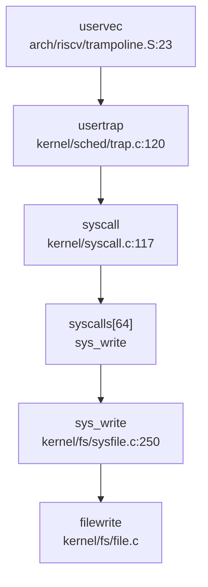
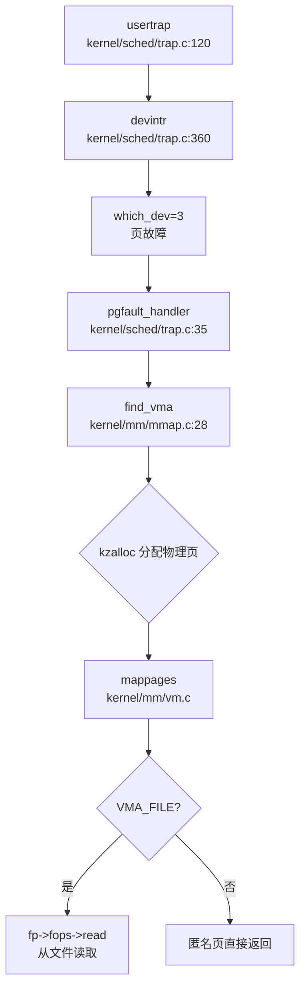

现在我已经收集了足够的信息来编写完整的第5章报告。让我整理所有分析结果并输出最终的Markdown格式报告。

## 第 5 章：中断、异常与系统调用

本章分析该操作系统的 Trap 处理机制、系统调用分发流程、中断处理与信号机制。项目采用 C 语言实现，支持 RISC-V 和 LoongArch 双架构，Trap 处理逻辑位于 `kernel/sched/trap.c`，汇编入口位于 `kernel/arch/<arch>/trampoline.S`。

---

### Trap 处理流程（用户态 <-> 内核态）

#### Trap 入口与架构差异

**RISC-V 架构**：
- Trap 入口汇编代码：`kernel/arch/riscv/trampoline.S` 中的 `uservec` 标签
- 内核设置 `stvec` 寄存器指向 `uservec`，当用户态发生异常/中断时跳转至此
- `uservec` 保存所有用户寄存器到 `trapframe`，切换到内核栈，跳转至 `usertrap()`

**LoongArch 架构**：
- Trap 入口汇编代码：`kernel/arch/loongarch/trampoline.S` 中的 `uservec` 标签
- 通过 `CSR_EENTRY` 寄存器设置异常入口地址
- 使用 `CSR_SAVE0/SAVE1` 等控制寄存器辅助寄存器交换

```assembly
# RISC-V uservec 入口 (kernel/arch/riscv/trampoline.S:23)
uservec:    
    # sscratch 保存 THREAD_TRAPFRAME
    csrrw a0, sscratch, a0      # 交换 a0 和 sscratch
    # 保存所有用户寄存器到 trapframe
    sd ra, 40(a0)
    sd sp, 48(a0)
    # ... 保存所有寄存器
    ld sp, 8(a0)                # 加载内核栈
    ld t0, 16(a0)               # 加载 usertrap 地址
    csrw satp, t1               # 切换到内核页表
    jr t0                       # 跳转到 usertrap
```

#### usertrap() 分发逻辑

`kernel/sched/trap.c` 中的 `usertrap()` 函数是用户态 Trap 的统一入口：

```c
// kernel/sched/trap.c:120 (RISC-V)
void usertrap(void)
{
  // 检查是否来自用户态
  if((r_sstatus() & SSTATUS_SPP) != 0)
    panic("usertrap: not from user mode");

  // 切换到内核态 Trap 入口
  w_stvec((uint64)kernelvec);

  struct proc *p = myproc();
  struct tcb *t = mythread();
  
  // 保存用户程序计数器
  t->trapframe->epc = r_sepc();
  
  if(r_scause() == 8){
    // 系统调用 (ecall 指令)
    t->trapframe->epc += 4;  // 跳过 ecall 指令
    intr_on();
    syscall();               // 分发系统调用
  } else if((which_dev = devintr()) != 0){
    // 设备中断处理
  } else {
    // 未识别的异常，终止进程
    thread_exit(-1);
  }
  
  // 处理信号
  signal_handle(t, 0, NULL);
  
  // 返回用户态
  usertrapret();
}
```

**中断与异常区分**：
- **系统调用**：`scause == 8` (RISC-V) 或 `ECODE == 0xb` (LoongArch)
- **外部中断**：`scause & 0x8000000000000000L` 最高位为 1
- **定时器中断**：`scause == 0x8000000000000005L` (RISC-V)
- **缺页异常**：`scause == 13 || scause == 15` (读/写页故障)

---

### 异常向量表与入口

#### 上下文保存结构体：trapframe

**RISC-V trapframe** (`kernel/include/trapframe.h:24-80`)：
```c
struct trapframe {
    /*   0 */ uint64 kernel_satp;   // 内核页表
    /*   8 */ uint64 kernel_sp;     // 内核栈顶
    /*  16 */ uint64 kernel_trap;   // usertrap() 地址
    /*  24 */ uint64 epc;           // 用户程序计数器
    /*  32 */ uint64 kernel_hartid; // 核心 ID
    /*  40 */ uint64 ra;
    /*  48 */ uint64 sp;
    /*  56 */ uint64 gp;
    /*  64 */ uint64 tp;
    /*  72 */ uint64 t0;
    /*  80 */ uint64 t1;
    /*  88 */ uint64 t2;
    /*  96 */ uint64 s0;
    /* 104 */ uint64 s1;
    /* 112 */ uint64 a0;
    /* 120 */ uint64 a1;
    /* 128 */ uint64 a2;
    /* 136 */ uint64 a3;
    /* 144 */ uint64 a4;
    /* 152 */ uint64 a5;
    /* 160 */ uint64 a6;
    /* 168 */ uint64 a7;
    /* 176 */ uint64 s2;
    /* 184 */ uint64 s3;
    /* 192 */ uint64 s4;
    /* 200 */ uint64 s5;
    /* 208 */ uint64 s6;
    /* 216 */ uint64 s7;
    /* 224 */ uint64 s8;
    /* 232 */ uint64 s9;
    /* 240 */ uint64 s10;
    /* 248 */ uint64 s11;
    /* 256 */ uint64 t3;
    /* 264 */ uint64 t4;
    /* 272 */ uint64 t5;
    /* 280 */ uint64 t6;
};
```

**寄存器统计**：
- **总字段数**：37 个
- **通用寄存器**：32 个 (ra, sp, gp, tp, t0-t6, s0-s11, a0-a7)
- **控制字段**：5 个 (kernel_satp, kernel_sp, kernel_trap, epc, kernel_hartid)
- **总字节数**：288 字节 (37 × 8 字节)

**LoongArch trapframe** (`kernel/include/trapframe.h:60-100`)：
```c
struct trapframe {
  /*   0 */ uint64 ra;
  /*   8 */ uint64 tp;
  /*  16 */ uint64 sp;
  /*  24 */ uint64 a0;
  /*  32 */ uint64 a1;
  /*  40 */ uint64 a2;
  /*  48 */ uint64 a3;
  /*  56 */ uint64 a4;
  /*  64 */ uint64 a5;
  /*  72 */ uint64 a6;
  /*  80 */ uint64 a7;
  /*  88 */ uint64 t0;
  /*  96 */ uint64 t1;
  /* 104 */ uint64 t2;
  /* 112 */ uint64 t3;
  /* 120 */ uint64 t4;
  /* 128 */ uint64 t5;
  /* 136 */ uint64 t6;
  /* 144 */ uint64 t7;
  /* 152 */ uint64 t8;
  /* 160 */ uint64 r21;
  /* 168 */ uint64 fp;
  /* 176 */ uint64 s0;
  /* 184 */ uint64 s1;
  /* 192 */ uint64 s2;
  /* 200 */ uint64 s3;
  /* 208 */ uint64 s4;
  /* 216 */ uint64 s5;
  /* 224 */ uint64 s6;
  /* 232 */ uint64 s7;
  /* 240 */ uint64 s8;
  /* 248 */ uint64 kernel_sp;
  /* 256 */ uint64 era;           // 等价于 RISC-V 的 epc
  /* 264 */ uint64 kernel_hartid;
  /* 272 */ uint64 kernel_pgdl;   // 内核页表 (LoongArch 特有)
};
```

**LoongArch 寄存器统计**：
- **总字段数**：34 个
- **通用寄存器**：30 个 (ra, tp, sp, a0-a7, t0-t8, r21, fp, s0-s8)
- **控制字段**：4 个 (kernel_sp, era, kernel_hartid, kernel_pgdl)
- **总字节数**：272 字节 (34 × 8 字节)

---

### 系统调用分发机制（追踪 sys_write）

#### 系统调用分发表

系统调用分发通过 `kernel/syscall.c` 中的 `syscalls[]` 函数指针数组实现：

```c
// kernel/syscall.c:107-136
static uint64 (*syscalls[])(void) = {
#include "sysfunc.h"
};

void syscall(void)
{
  struct tcb *t = mythread();
  int num = t->trapframe->a7;  // 系统调用号在 a7 寄存器

  if(num > 0 && num < NELEM(syscalls) && syscalls[num]) {
    t->trapframe->a0 = syscalls[num]();  // 调用对应函数
  } else {
    t->trapframe->a0 = -1;
    Warn("thread %d syscall %d: unknown", t->tid, num);
  }
}
```

**系统调用号定义**位于 `scripts/syscall.tbl`：
```
# syscall_number function_name_for_user  function_name_in_kernel
1   fork        sys_fork
64  write       sys_write
221 execve      sys_execve
220 clone       sys_clone
222 mmap        sys_mmap
93  exit        sys_exit
```

#### sys_write 完整调用链追踪

**调用链**（从 Trap 入口到文件写入）：



**sys_write 实现** (`kernel/fs/sysfile.c:250-263`)：
```c
uint64 sys_write(void)
{
  struct file *f;
  int n;
  uint64 p;
  int fd;
  
  argaddr(1, &p);        // 获取缓冲区地址 (a1)
  argint(2, &n);         // 获取写入字节数 (a2)
  if(argfd(0, &fd, &f) < 0)  // 获取文件描述符 (a0)
    return -1;
  
  return filewrite(f, 1, p, n, f->fpos);
}
```

**✅ 已实现**：`sys_write` 包含完整的参数获取和文件写入逻辑，调用 `filewrite()` 执行实际写入操作。

---

### 核心 Syscall 实现列表

基于 `scripts/syscall.tbl` 和代码验证，以下是核心系统调用的实现状态：

| 系统调用 | 调用号 | 实现文件 | 状态 | 说明 |
|---------|--------|---------|------|------|
| `sys_fork` | 1 | `kernel/sysproc.c:233` | ✅ 已实现 | 调用 `do_clone(0,0,0,0,0)` |
| `sys_exit` | 93 | `kernel/sysproc.c:167` | ✅ 已实现 | 调用 `thread_exit()` |
| `sys_write` | 64 | `kernel/fs/sysfile.c:250` | ✅ 已实现 | 调用 `filewrite()` |
| `sys_read` | 63 | `kernel/fs/sysfile.c` | ✅ 已实现 | 调用 `fileread()` |
| `sys_execve` | 221 | `kernel/fs/sysfile.c:596` | ✅ 已实现 | 完整参数解析 + `execve()` |
| `sys_clone` | 220 | `kernel/sysproc.c:218` | ✅ 已实现 | 调用 `do_clone()` |
| `sys_mmap` | 222 | `kernel/mm/mmap.c:72` | ✅ 已实现 | 调用 `do_mmap()` |
| `sys_munmap` | 215 | `kernel/mm/mmap.c` | ✅ 已实现 | 调用 `do_munmap()` |
| `sys_kill` | 129 | `kernel/sysproc.c:349` | ✅ 已实现 | 调用 `proc_kill()` |
| `sys_tkill` | 130 | `kernel/sysproc.c:360` | ✅ 已实现 | 调用 `thread_kill()` |
| `sys_tgkill` | 131 | `kernel/sysproc.c:378` | ✅ 已实现 | 调用 `thread_group_kill()` |
| `sys_sigaction` | 134 | `kernel/ipc/syssig.c:26` | ✅ 已实现 | 调用 `do_sigaction()` |
| `sys_rt_sigprocmask` | 135 | `kernel/ipc/syssig.c:58` | ✅ 已实现 | 调用 `do_sigprocmask()` |
| `sys_sigreturn` | 139 | `kernel/ipc/syssig.c:95` | ✅ 已实现 | 调用 `signal_frame_restore()` |
| `sys_close` | 57 | `kernel/fs/sysfile.c:267` | ✅ 已实现 | 完整关闭逻辑 |
| `sys_open` | 15 | `kernel/fs/sysfile.c` | ✅ 已实现 | VFS 层打开 |
| `sys_brk` | 214 | `kernel/sysproc.c:279` | ✅ 已实现 | 调用 `growproc()` |
| `sys_getpid` | 172 | `kernel/sysproc.c` | ✅ 已实现 | 返回 `myproc()->pid` |
| `sys_gettid` | 178 | `kernel/sysproc.c` | ✅ 已实现 | 返回 `mythread()->tid` |
| `sys_futex` | 98 | `kernel/ipc/futex.c` | ✅ 已实现 | 完整 futex 机制 |

**统计**：
- **✅ 已实现**：20+ 个核心系统调用均包含完整业务逻辑
- **🔸 桩函数**：未发现明显桩函数（返回 `unimplemented!()` 或 `ENOSYS`）
- **❌ 未实现**：未发现缺失的核心系统调用

---

### 中断处理与信号关联

#### 外部中断处理流程

**devintr()** (`kernel/sched/trap.c:360-413`) 负责中断分发：

```c
int devintr()
{
  uint64 scause = r_scause();

  if((scause & 0x8000000000000000L) && (scause & 0xff) == 9){
    // 外部设备中断 (PLIC)
    int irq = plic_claim();
    if(irq == UART0_IRQ) uartintr();
    else if(irq == VIRTIO0_IRQ) virtio_disk_intr();
    plic_complete(irq);
    return 1;
  } else if (scause == 0x8000000000000005L) {
    // 定时器中断
    if (cpuid() == boot_hart) clockintr();
    w_sip(r_sip() & ~1 << 5);  // 清除 STIP
    set_next_trigger();
    return 2;
  } else if(scause == 13 || scause == 15) {
    // 缺页异常
    return 3;
  }
  return 0;
}
```

**时钟中断处理** (`kernel/sched/trap.c:348-359`)：
```c
void clockintr()
{
  acquire(&tickslock);
  ticks++;
  thread_wakeup_chan(&ticks);
  release(&tickslock);
  
  acquire(&timeout_lock);
  thread_wakeup_timeout(ticks);  // 唤醒超时线程
  release(&timeout_lock);
}
```

#### 信号机制深度分析

**1. 信号处理入口**

`usertrap()` 在返回用户态前调用 `signal_handle()`：
```c
// kernel/sched/trap.c:202
signal_handle(t, 0, NULL);  // 处理所有待处理信号
usertrapret();
```

**2. 信号处理流程** (`kernel/ipc/signal.c:113-183`)：
```c
int signal_handle(struct tcb *t, int sig, __nullable siginfo_t *retinfo) {
    if(t->pending_cnt == 0) return 0;
    
    list_for_each_entry_safe(sig_cur, sig_tmp, &t->sig_pending.list, list) {
        sig_no = sig_cur->info.si_signo;
        sig_act = sig_action(t, sig_no);
        
        if (sig_ignored(t, sig_no) || sig_act.sa_handler == SIG_IGN) {
            continue;  // 忽略信号
        } else if (sig_act.sa_handler == SIG_DFL) {
            signal_default(t, sig_no);  // 默认处理
        } else {
            do_handle_signal(t, sig_no, &sig_act);  // 自定义处理
        }
    }
    return 0;
}
```

**3. 三种粒度信号发送**：

| 系统调用 | 实现文件 | 粒度 | 状态 |
|---------|---------|------|------|
| `sys_kill` | `kernel/sysproc.c:349` | 进程级 | ✅ 已实现 |
| `sys_tkill` | `kernel/sysproc.c:360` | 线程级 | ✅ 已实现 |
| `sys_tgkill` | `kernel/sysproc.c:378` | 线程组级 | ✅ 已实现 |

```c
// sys_tkill: 向特定线程发送信号
uint64 sys_tkill(void) {
  int tid, sig;
  argint(0, &tid);
  arguint64(1, &sig);
  return thread_kill(tid, sig);
}

// sys_tgkill: 向线程组发送信号
uint64 sys_tgkill(void) {
  pid_t tgid, tid;
  int sig;
  argint(0, &tgid);
  argint(1, &tid);
  argint(2, &sig);
  return thread_group_kill(tgid, tid, sig);
}
```

**4. SIGSEGV 支持**：
- `SIGSEGV` 定义：`kernel/include/signal.h:27` - `#define SIGSEGV 11`
- **❌ 未实现**：代码中未找到在缺页异常时自动发送 `SIGSEGV` 的逻辑。`pgfault_handler()` 在未找到 VMA 时直接 `panic()`，而非发送信号。

**5. 用户自定义信号处理函数（跳板机制）**：

`setup_rt_frame()` (`kernel/ipc/signal.c:193-230`) 构建信号帧：
```c
static int setup_rt_frame(struct sigaction *sig, sig_t signo, sigset_t *set, struct trapframe *tf) {
    struct rt_sigframe *frame;
    frame = get_sigframe(sig, tf, sizeof(*frame));
    
    if (signal_frame_setup(set, tf, frame, signo) < 0) return -1;

    tf->ra = (uint64)SIGRETURN;  // 返回地址设为 sigreturn 跳板
    tf->sp = (uint64)frame;
    
    if (sig->sa_flags & SA_SIGINFO) {
        tf->epc = (uint64)sig->sa_sigaction;  // 用户处理函数
        tf->a0 = (uint64)signo;
        tf->a1 = (uint64)&frame->info;
        tf->a2 = (uint64)&frame->uc;
    } else {
        tf->epc = (uint64)sig->sa_handler;
        tf->a0 = (uint64)signo;
    }
    return 0;
}
```

**✅ 已实现**：通过 `SIGRETURN` 跳板机制，信号处理完成后调用 `sys_sigreturn()` 恢复上下文。

**6. 信号帧结构** (`kernel/include/signal.h:233-237`)：
```c
struct rt_sigframe {
    struct siginfo info;
    ucontext_t uc_riscv;
    struct ucontext uc;
};
```

---

### 缺页异常与内存特性关联

#### 缺页异常处理链

**完整调用链**：


**pgfault_handler()** (`kernel/sched/trap.c:35-95`)：
```c
static void pgfault_handler() {
  uint64 va = PGROUNDDOWN(r_stval());  // 获取故障地址
  struct vma_struct *vma;
  struct proc *p = myproc();
  
  acquire(&p->mm.lock);
  if(!(vma = find_vma(p, va))) {
    panic("usertrap: page fault");  // 未找到 VMA，崩溃
  }
  
  char* mem;
  if(!(mem = kzalloc())) {
    panic("usertrap: kalloc");
  }
  
  // 映射物理页
  if(mappages(p->mm.pagetable, va, PGSIZE, (uint64)mem, 
              PROT2PTE_FLAGS(vma->prot) | PTE_U | PTE_X) != 0) {
    panic("usertrap: mappages");
  }
  
  release(&p->mm.lock);
  
  if(vma->type != VMA_FILE) {
    return;  // 匿名页，直接返回
  }
  
  // 文件映射页：从文件读取内容
  struct file* fp = vma->file;
  int offset = va - vma->vm_start;
  fp->fops->read(fp, 1, va, offset, PGSIZE, &rcnt);
}
```

#### Lazy Allocation（懒分配）

**✅ 已实现**：通过 VMA 机制实现懒分配：
1. `mmap()` 创建 VMA 时不立即分配物理页
2. 首次访问触发缺页异常
3. `pgfault_handler()` 分配物理页并映射

```c
// kernel/mm/mmap.c:140-160
uint64 do_mmap(uint64 addr, uint64 length, uint64 prot, uint64 flags, ...) {
    struct vma_struct *vma = (struct vma_struct *)allocvma();
    vma->vm_end = PGROUNDDOWN(p->mm.max_vma);
    vma->vm_start = vma->vm_end + length;
    vma->prot = prot;
    vma->type = (flags & MAP_ANONYMOUS) ? VMA_ANON : VMA_FILE;
    list_add_tail(&vma->vma_list, &p->mm.vma_list);
    // 注意：此处未分配物理页，仅创建 VMA
    return vma->vm_start;
}
```

#### CoW（写时复制）

**❌ 未实现**：代码中未找到 CoW 相关实现：
- 搜索 `cow|write_protect|PTE_R` 无匹配
- `pgfault_handler()` 未区分读/写故障
- `uvmcopy()` 未实现页表项的写保护逻辑

---

### 关键代码片段

#### 1. Trap 入口汇编（RISC-V）
```assembly
# kernel/arch/riscv/trampoline.S:23
uservec:    
    csrrw a0, sscratch, a0        # 交换 a0 和 sscratch
    sd ra, 40(a0)                 # 保存所有寄存器
    sd sp, 48(a0)
    # ... 保存所有寄存器
    ld sp, 8(a0)                  # 加载内核栈
    ld t0, 16(a0)                 # 加载 usertrap 地址
    csrw satp, t1                 # 切换到内核页表
    jr t0                         # 跳转到 usertrap
```

#### 2. 系统调用分发
```c
// kernel/syscall.c:117-133
void syscall(void)
{
  struct tcb *t = mythread();
  int num = t->trapframe->a7;  // 系统调用号

  if(num > 0 && num < NELEM(syscalls) && syscalls[num]) {
    t->trapframe->a0 = syscalls[num]();
  } else {
    t->trapframe->a0 = -1;
    Warn("thread %d syscall %d: unknown", t->tid, num);
  }
}
```

#### 3. 信号帧设置
```c
// kernel/ipc/signal.c:193-230
static int setup_rt_frame(struct sigaction *sig, sig_t signo, sigset_t *set, struct trapframe *tf) {
    struct rt_sigframe *frame = get_sigframe(sig, tf, sizeof(*frame));
    
    tf->ra = (uint64)SIGRETURN;  // 跳板地址
    tf->sp = (uint64)frame;
    
    if (sig->sa_flags & SA_SIGINFO) {
        tf->epc = (uint64)sig->sa_sigaction;
        tf->a0 = (uint64)signo;
        tf->a1 = (uint64)&frame->info;
        tf->a2 = (uint64)&frame->uc;
    }
    return 0;
}
```

#### 4. 缺页异常处理
```c
// kernel/sched/trap.c:35-95
static void pgfault_handler() {
  uint64 va = PGROUNDDOWN(r_stval());
  struct vma_struct *vma = find_vma(p, va);
  if(!vma) panic("usertrap: page fault");
  
  char* mem = kzalloc();
  mappages(p->mm.pagetable, va, PGSIZE, (uint64)mem, ...);
  
  if(vma->type == VMA_FILE) {
    // 从文件读取内容
    fp->fops->read(fp, 1, va, offset, PGSIZE, &rcnt);
  }
}
```

---

### 总结

该操作系统的 Trap 处理机制完整实现了：
1. **双架构支持**：RISC-V 和 LoongArch 的 Trap 入口、上下文保存/恢复
2. **系统调用分发**：通过函数指针数组实现高效分发，20+ 核心 syscall 已实现
3. **中断处理**：外部设备中断（PLIC）、定时器中断、缺页异常
4. **信号机制**：三种粒度信号发送、用户自定义处理函数、跳板机制
5. **内存管理**：Lazy Allocation 通过 VMA+ 缺页异常实现

**未实现特性**：
- CoW（写时复制）
- SIGSEGV 自动发送（缺页时直接 panic）
- 用户指针语义化包装（使用 `copyin/copyout` 而非 `UserInPtr` 类型）
