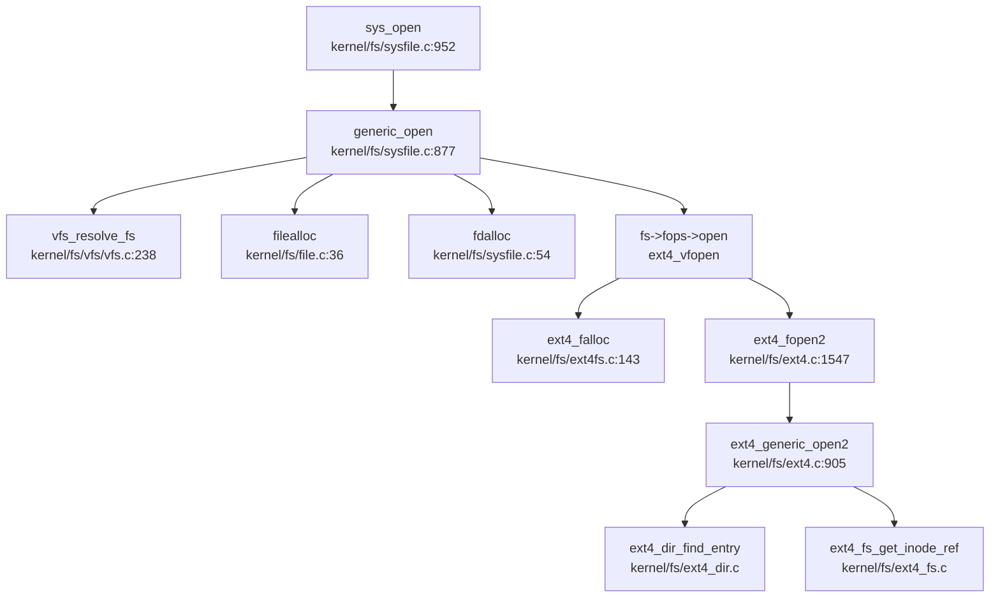

现在我已经收集了足够的信息。让我输出完整的第 6 章文件系统分析报告。

## 第 6 章：文件系统（VFS + 具体 FS）

### VFS 架构与接口设计

本 OS 实现了完整的 VFS（Virtual File System）抽象层，位于 `kernel/fs/vfs/` 目录。VFS 通过三组核心 Operations 结构体抽象不同文件系统的行为：

#### 核心数据结构定义

**VFS 核心结构体**（`kernel/include/vfs.h`）：

```c
struct vfs_filesystem {
    int dev;                          // 设备号
    char *name;                       // 文件系统名称
    vfs_type_t type;                  // 文件系统类型枚举
    struct inode_ops *iops;           // Inode 操作接口
    struct file_ops *fops;            // File 操作接口
    struct fs_ops *fsops;             // 文件系统操作接口
    void *fs_data;                    // 文件系统私有数据
    struct list_head fs_list;         // 已挂载文件系统链表
    char path[MAXPATH];               // 挂载点路径
};
```

**Inode 结构体**（`kernel/include/file.h`）：
```c
struct inode {
  uint dev;           // 设备号
  uint inum;          // Inode 号
  int ref;            // 引用计数
  struct sleeplock lock;
  int valid;          // 是否已从磁盘读取
  short type;         // 文件类型
  struct vfs_filesystem *fs;  // 所属文件系统
  struct inode_ops *iops;     // Inode 操作
  void *i_private;    // 私有数据（指向具体 FS 的 inode）
  int i_ino;          // ext4 inode 号
};
```

**File 结构体**（`kernel/include/file.h`）：
```c
struct file {
  enum { FD_NONE, FD_PIPE, FD_INODE, FD_DEVICE, FD_SOFTLINK, FD_SOCKET, FD_DIR, FD_SPEC } type;
  int ref;                    // 引用计数
  int flags;                  // 文件标志
  struct pipe *pipe;          // FD_PIPE 类型使用
  struct inode *ip;           // FD_INODE/FD_DEVICE 类型使用
  uint off;                   // 文件偏移
  short major;                // 设备主号
  struct file_ops *fops;      // 文件操作
  void *private_data;         // 具体 FS 的 file 结构（如 ext4_file）
  struct file_info info;      // 路径和 FS 信息
  uint64 fpos;                // 文件位置
  ext4_dir dir;               // ext4 目录项
};
```

#### 三组 Operations 接口

**inode_ops**（13 个方法）：
```c
struct inode_ops {
    struct inode* (*dirlookup)(struct inode *dp, char *name, uint *off);
    void (*iupdate)(struct inode *ip);
    void (*itrunc)(struct inode *ip);
    void (*cleanup)(struct inode *ip);
    uint (*bmap)(struct inode *ip, uint bn);
    void (*ilock)(struct inode* ip);
    void (*iunlock)(struct inode* ip);
    void (*stati)(struct inode *ip, struct stat *st);
    int (*readi)(struct inode *ip, int user_dst, uint64 dst, uint off, uint n);
    int (*writei)(struct inode *ip,int user_src, uint64 src, uint off, uint n);
    int (*dirlink)(struct inode *dp, char *name, uint inum);
    int (*unlink)(struct inode *dp, uint off);
    int (*isdirempty)(struct inode *dp);
};
```

**file_ops**（12 个方法）：
```c
struct file_ops {
    int (*open)(struct file *f, const char *path, int flags);
    int (*close)(struct file *f);
    int (*read)(struct file *fp, int user_dst, uint64 dst, int64_t off, size_t size, size_t *rcnt);
    int (*write)(struct file *fp, int user_src, uint64 src, int64_t off, size_t size, size_t *wcnt);
    int (*filestat)(struct file *f, uint64 addr);
    int (*cleansf)(struct file* f);
    int (*getdents)(struct file *fp, struct linux_dirent64 *dirp, int count);
    int (*writev)(struct file *fp, int user_src, __kernel_space uint64 iovec, int iovcnt, size_t *wcnt);
    off_t (*lseek)(struct file *fp, off_t offset, int whence);
    int (*ftruncate)(struct file *fp, off_t length);
};
```

**fs_ops**（24 个方法）：
```c
struct fs_ops {
    int (*fs_init)(void);
    int (*mount)(struct inode *devi, struct inode *ip);
    int (*unmount)(struct inode *devi);
    struct inode* (*getroot)(int major, int minor);
    void (*readsb)(int dev, struct superblock *sb);
    struct inode* (*ialloc)(uint dev, short type);
    uint (*balloc)(uint dev);
    void (*bzero)(int dev, int bno);
    void (*bfree)(int dev, uint b);
    void (*brelse)(struct buf *b);
    void (*bwrite)(struct buf *b);
    struct buf* (*bread)(uint dev, uint blockno);
    int (*namecmp)(const char *s, const char *t);
    int (*mknod)(const char *pathname, mode_t mode, dev_t dev);
    int (*mkdir)(const char *pathname, mode_t mode);
    int (*fstat)(char *path, struct kstat *kst);
    int (*isdir)(const char *path);
    int (*link)(const char *oldpath, const char *newpath, int flags);
    int (*unlink)(const char *path, int flags);
    int (*faccess)(char *path, int amode, int flags);
    int (*utimens)(const char *path, const struct timespec times[2]);
    int (*file_exist)(const char *path);
    int (*statfs)(struct vfs_filesystem *fs, struct statfs *buf);
    int (*rename)(const char *oldpath, const char *newpath);
};
```

### 具体文件系统支持情况（FAT32/Ext4/RamFS）

#### Ext4 文件系统（✅ 已实现）

**实现位置**：`kernel/fs/ext4.c`（3282 行，70KB）+ `kernel/fs/ext4*.c` 系列文件

Ext4 是本 OS 的主要文件系统实现，代码量庞大且功能完整。通过 `kernel/fs/ext4fs.c` 注册到 VFS：

```c
// kernel/fs/ext4fs.c:47-77
struct file_ops ext4_file_ops = {
    .read = ext4_vfread,
    .write = ext4_vwrite,
    .open = ext4_vfopen,
    .close = ext4_vfclose,
    .cleansf = ext4_vcleansf,
    .getdents = ext4_vgetdents,
    .writev = ext4_vwritev,
    .lseek = ext4_vlseek,
    .ftruncate = ext4_vftruncate,
};

struct fs_ops ext4_fs_ops = {
    .mknod = ext4_vmknod,
    .mkdir = ext4_vmkdir,
    .fstat = ext4_vstat,
    .isdir = ext4_visdir,
    .link = ext4_vlink,
    .unlink = ext4_vunlink,
    .faccess = ext4_vfaccess,
    .utimens = ext4_vutimens,
    .file_exist = ext4_vfile_exist,
    .statfs = ext4_vstatfs,
    .rename = ext4_vfrename,
};

struct vfs_filesystem ext4_fs = {
    .name = "ext4",
    .type = VFS_TYPE_EXT4,
    .iops = &ext4_inode_ops,
    .fops = &ext4_file_ops,
    .fsops = &ext4_fs_ops,
    .path = "/",
};
```

**Ext4 内部抽象层结构**（`kernel/include/ext4.h`）：

```c
// Ext4 文件句柄
struct ext4_file {
    struct ext4_mountpoint *mp;
    uint32_t inode;
    uint64_t fpos;
    uint64_t fsize;
    int flags;
    int ref;  // 引用计数
};

// Ext4 inode 缓存
struct ext4_inode {
    uint16_t mode;
    uint16_t uid;
    uint32_t size_lo;
    uint32_t atime;
    uint32_t mtime;
    uint32_t ctime;
    uint16_t gid;
    uint16_t links_cnt;
    uint32_t blocks_count_lo;
    uint32_t flags;
    uint32_t dev;
    uint32_t blocks[15];  // 数据块指针
};

// Ext4 目录项
typedef struct ext4_direntry {
    uint32_t inode;
    uint16_t entry_length;
    uint8_t name_length;
    uint8_t inode_type;
    uint8_t name[255];
} ext4_direntry;
```

**Ext4 核心实现模块**：
- `ext4_fs.c`（1748 行）：文件系统核心逻辑
- `ext4_inode.c`（405 行）：Inode 管理
- `ext4_dir.c`（706 行）：目录操作
- `ext4_dir_idx.c`（1401 行）：目录索引（H-tree）
- `ext4_extent.c`（2135 行）：Extent 树管理
- `ext4_journal.c`（2292 行）：日志功能
- `ext4_balloc.c`（669 行）：块分配
- `ext4_ialloc.c`（370 行）：Inode 分配
- `ext4_xattr.c`（1561 行）：扩展属性

#### XV6FS 文件系统（🔸 桩函数）

**实现位置**：`kernel/fs/xv6fs.c`（641 行）+ `kernel/fs/vfs/vfs_xv6fs.c`

XV6FS 是 xv6 原始文件系统的 VFS 适配层，但大部分功能未完全实现：

```c
// kernel/fs/vfs/vfs_xv6fs.c:17-20
struct inode_ops xv6fs_inode_ops = {
    .readi = vfs_xv6fs_readi,  // 仅返回 n，无实际逻辑
};

// kernel/fs/vfs/vfs_xv6fs.c:21-25
int vfs_xv6fs_open(const char *path, int flags) {
    // 注释："For simplicity, we will just return a dummy file descriptor"
    return 0;  // 桩函数
}
```

#### RamFS/TmpFS（❌ 未实现）

通过 `grep_in_repo` 搜索 `ramfs|tmpfs`，**未发现任何实现代码**。系统启动时仅挂载 Ext4 和 ProcFS。

### 伪文件系统（ProcFS）

**实现位置**：`kernel/fs/procfs.c`（172 行）

ProcFS 是只读的伪文件系统，提供进程相关信息。当前仅实现了 `/proc/interrupts` 文件：

```c
// kernel/fs/procfs.c:28-43
struct file_ops procfs_file_ops = {
    .read = procfs_read,
    .write = procfs_write,
    .open = procfs_open,
    .close = procfs_close,
};

struct fs_ops procfs_fs_ops = {
    .rename = procfs_rename,
    .unlink = procfs_unlink,
};

struct vfs_filesystem procfs = {
    .name = "procfs",
    .type = VFS_TYPE_PROCFS,
    .fops = &procfs_file_ops,
    .fsops = &procfs_fs_ops,
    .path = "/proc"
};
```

**功能细节**：
- `proc_interrupts_read()`：读取中断计数数组 `intrcnt[MAXINTR]`
- `proc_interrupts_write()`：返回 -1（❌ 不可写）
- 其他路径的 read/write/open 均返回 -1（❌ 未实现）

**DevFS/SysFS**（❌ 未实现）：搜索 `devfs|sysfs` 未发现实现。

### 文件描述符与进程关联

**文件描述符表结构**（`kernel/include/proc.h`）：

```c
struct proc {
    // ...
    int ofile_cnt;              // 打开文件计数
    struct file *ofile[NOFILE]; // Per-Process 文件描述符表
    struct inode *cwd;          // 当前工作目录
    struct cwdinfo cinfo;       // 当前工作目录信息（含路径字符串）
};
```

**关键特性**：
1. **Per-Process FD 表**：每个进程有独立的 `ofile[NOFILE]` 数组
2. **全局 File 对象池**：`kernel/fs/file.c` 中的 `ftable.file[NFILE]` 是全局共享的
3. **FD 分配**：`fdalloc()` 在进程 `ofile` 数组中查找空位
4. **CLOEXEC 支持**：`exec.c` 中检查 `O_CLOEXEC` 标志并关闭相应 FD

```c
// kernel/fs/file.c:36-59
struct file* filealloc(void) {
  acquire(&ftable.lock);
  for(f = ftable.file; f < ftable.file + NFILE; f++){
    if(f->ref == 0){
      fs = getfs("ext4");  // 默认使用 ext4
      f->ref = 1;
      f->fops = fs->fops;
      f->private_data = 0;
      // ...
      release(&ftable.lock);
      return f;
    }
  }
  release(&ftable.lock);
  return 0;
}
```

### 管道（Pipe）与套接字（Socket）支持情况

#### Pipe（✅ 已实现）

**实现位置**：`kernel/ipc/pipe.c`（144 行）

```c
struct pipe {
  struct spinlock lock;
  char data[PIPESIZE];  // 512 字节环形缓冲区
  uint nread;           // 已读字节数
  uint nwrite;          // 已写字节数
  int readopen;         // 读端是否打开
  int writeopen;        // 写端是否打开
};
```

**系统调用**（`kernel/fs/sysfile.c:681`）：
```c
uint64 sys_pipe(void) {
  uint64 fdarray;
  struct file *rf, *wf;
  int fd0, fd1;
  argaddr(0, &fdarray);
  if(pipealloc(&rf, &wf) < 0)
    return -1;
  fd0 = fdalloc(rf);
  fd1 = fdalloc(wf);
  // 设置 rf 为只读，wf 为只写
  SET_READABLE(rf->flags);
  UNSET_WRITABLE(rf->flags);
  UNSET_READABLE(wf->flags);
  SET_WRITABLE(wf->flags);
  copyout(p->mm.pagetable, fdarray, (char*)&fd0, sizeof(fd0));
  copyout(p->mm.pagetable, fdarray+sizeof(fd0), (char *)&fd1, sizeof(fd1));
  return 0;
}
```

**实现状态**：
- `pipealloc()`：分配两个 file 对象和一个 pipe 结构
- `piperead()`：阻塞读，支持 `thread_sleep`/`thread_wakeup_chan`
- `pipewrite()`：阻塞写，满时睡眠
- `pipeclose()`：引用计数管理，两端都关闭时释放

#### Socket（❌ 未实现）

通过 `grep_in_repo` 搜索 `sys_socket|sys_bind|sys_listen|sys_accept|sys_connect`，**未发现任何 socket 相关系统调用**。虽然 `file.h` 中定义了 `FD_SOCKET` 类型，但无任何实现代码。

### 缓存机制（Block/Page Cache）

#### Block Cache（✅ 已实现）

**实现位置**：`kernel/fs/bio.c`（187 行）

```c
struct {
  struct spinlock lock;
  struct buf buf[NBUF];
  struct buf head;  // LRU 链表头
} bcache;

struct buf {
  uint dev;
  uint blockno;
  struct sleeplock lock;
  uint refcnt;
  uint valid;
  uchar data[BSIZE];
  struct buf *prev;  // LRU 双向链表
  struct buf *next;
};
```

**核心机制**：
1. **LRU 替换策略**：`bget()` 遍历链表找最近最少使用的未引用 buffer
2. **引用计数**：`refcnt` 管理并发访问
3. **Sleep Lock**：保护 buffer 数据，允许持有锁时睡眠
4. **写回策略**：`bwrite()` 同步写入磁盘，`brelse()` 仅释放引用

```c
// kernel/fs/bio.c:70-95
struct buf* bget(uint dev, uint blockno) {
  acquire(&bcache.lock);
  // 1. 查找已缓存的 block
  for(b = bcache.head.next; b != &bcache.head; b = b->next){
    if(b->dev == dev && b->blockno == blockno){
      b->refcnt++;
      release(&bcache.lock);
      acquiresleep(&b->lock);
      return b;
    }
  }
  // 2. 回收 LRU 未引用 buffer
  for(b = bcache.head.prev; b != &bcache.head; b = b->prev){
    if(b->refcnt == 0) {
      b->dev = dev;
      b->blockno = blockno;
      b->valid = 0;
      b->refcnt = 1;
      release(&bcache.lock);
      acquiresleep(&b->lock);
      return b;
    }
  }
  panic("bget: no buffers");
}
```

#### Page Cache（❌ 未实现）

**未发现独立的 Page Cache 实现**。Ext4 通过 `ext4_block_cache_write_back()` 实现简单的写缓冲，但无统一的 Page Cache 层。

### 零拷贝映射验证（mmap 实现分析）

#### sys_mmap（✅ 已实现）

**实现位置**：`kernel/mm/mmap.c`（323 行）

```c
// kernel/mm/mmap.c:72-104
uint64 sys_mmap(void) {
  uint64 addr;
  int length, prot, flags, fd, offset;
  struct file *fp;
  
  argaddr(0, &addr);
  argint(1, &length);
  argint(2, &prot);
  argint(3, &flags);
  if(flags & MAP_ANONYMOUS) {
    fd = -1;
    fp = NULL;
  } else {
    if(argfd(4, &fd, &fp) < 0)
      return -1;
  }
  argint(5, &offset);
  return do_mmap(addr, length, prot, flags, fd, fp, offset);
}
```

#### VMA 结构体（关键：支持 MAP_SHARED）

```c
// kernel/include/mm.h（从 mmap.c 推断）
struct vma_struct {
    uint64 vm_start;
    uint64 vm_end;
    int valid;
    int prot;
    int flags;      // 包含 MAP_SHARED/MAP_PRIVATE
    int fd;
    struct file *file;
    int offset;
    int type;       // VMA_ANONYMOUS or VMA_FILE
    struct list_head vma_list;
};
```

**MAP_SHARED 处理逻辑**（`kernel/mm/mmap.c:230-250`）：
```c
int mmap_writeback_unmapf(pagetable_t pgtable, struct vma_struct *vma, int len) {
  pte_t *pte;
  uint64 va;
  struct file *fp = vma->file;
  for(va = PGROUNDDOWN(vma->vm_start); va < vma->vm_start + len && va < vma->vm_end; va += PGSIZE) {
    pte = walk(myproc()->mm.pagetable, va, 0);
    if(pte == 0 || !(*pte & PTE_V))
      continue;
    // 关键：检查 PTE_D（Dirty 位）和 MAP_SHARED 标志
    if((*pte & PTE_D) && (vma->flags & MAP_SHARED) && (vma->type == VMA_FILE)) {
      // 写回文件
      filewrite(fp, 1, va, PGSIZE, fp->fpos);
    }
    uvmunmap(pgtable, va, 1, 1);
    *pte = 0;
  }
  return 0;
}
```

**验证结论**：
- ✅ **支持 MAP_SHARED**：`vma->flags & MAP_SHARED` 检查存在
- ✅ **支持写回**：通过 `PTE_D` 位检测脏页并调用 `filewrite()`
- ✅ **支持 MAP_ANONYMOUS**：`flags & MAP_ANONYMOUS` 时 `fp = NULL`
- ❌ **不支持 MAP_FIXED**：`do_mmap()` 始终分配在 `p->mm.max_vma` 向下增长

**限制**：
- `vma_struct` 中**无 `shared` 字段**，通过 `flags` 判断共享属性
- 写回仅在 `munmap` 时触发，**无定期回写机制**
- `max_vma` 持续下降，**无地址空间回收**（代码注释中已指出此问题）

### 高级特性（poll/select/epoll）

通过 `grep_in_repo` 搜索 `sys_poll|sys_select|sys_epoll`：

**结果**：❌ **未实现**。未找到任何相关系统调用。

### 文件打开流程（完整调用链追踪）

#### 从 sys_open 到 Ext4 文件打开

**调用链**（通过 `generic_open` 中枢）：



**关键步骤解析**：

1. **sys_open**（`kernel/fs/sysfile.c:952`）：
   ```c
   uint64 sys_open(void) {
     char path[MAXPATH];
     int flags, omode;
     argstr(0, path, MAXPATH);
     argint(1, &flags);
     argint(2, &omode);
     return generic_open(path, flags, omode);
   }
   ```

2. **generic_open**（`kernel/fs/sysfile.c:877`）：
   ```c
   uint64 generic_open(char *path, int flags, int omode) {
     struct vfs_filesystem *fs = vfs_resolve_fs(path);  // 1. 解析 FS
     struct file *f = filealloc();                      // 2. 分配 file 对象
     int fd = fdalloc(f);                               // 3. 分配 FD
     f->flags |= flags;
     f->fops = fs->fops;                                // 4. 设置操作集
     strcpy(f->info.path, path);
     r = fs->fops->open(f, path, flags);                // 5. 调用具体 FS 的 open
     return fd;
   }
   ```

3. **vfs_resolve_fs**（`kernel/fs/vfs/vfs.c:238`）：
   ```c
   struct vfs_filesystem * vfs_resolve_fs(const char* path) {
     get_absolute_path(path, "/", abs_path);
     // 最长前缀匹配挂载点
     for (int i = 0; i < MAX_MOUNTS; i++) {
       if (substr_cmp(mp, abs_path) == 0 && len > longest_match_len) {
         selected_fs = fs;
       }
     }
     return selected_fs;
   }
   ```

4. **ext4_vfopen**（`kernel/fs/ext4fs.c:490`）：
   ```c
   int ext4_vfopen(struct file *fp, const char *path, int flags) {
     struct ext4_file *efp = ext4_falloc();  // 分配 ext4 私有 file
     r = ext4_fopen2(efp, path, flags);      // 调用 ext4 核心打开逻辑
     fp->private_data = efp;                 // 关联 VFS file 和 ext4 file
     // 根据 inode 模式设置 fp->type（FD_INODE/FD_DIR/FD_DEVICE 等）
     return r;
   }
   ```

5. **ext4_fopen2** → **ext4_generic_open2**（`kernel/fs/ext4.c:1547/905`）：
   - 路径解析（跳过挂载点前缀）
   - 从根 inode 开始遍历目录树
   - `ext4_dir_find_entry()` 查找目录项
   - `ext4_fs_get_inode_ref()` 加载 inode
   - 若 `O_CREAT` 且文件不存在，调用 `ext4_fs_alloc_inode()` 创建

#### 四大核心数据结构协同

| 结构体 | 作用 | 生命周期 |
|--------|------|----------|
| **SuperBlock** | 文件系统元数据（块大小、inode 总数等） | 挂载时加载，卸载时释放 |
| **Inode** | 文件元数据（权限、大小、数据块指针） | 打开时 `iget()` 加载，`iput()` 释放 |
| **Dentry** | 目录项缓存（路径名 → inode 映射） | Ext4 中通过 `ext4_dir` 结构管理 |
| **File** | 打开文件状态（偏移、标志、引用计数） | `filealloc()` 分配，`fileclose()` 释放 |

**协同流程**：
1. `vfs_resolve_fs()` 通过路径找到 SuperBlock（`vfs_filesystem`）
2. `ext4_generic_open2()` 遍历目录树，查找 Dentry
3. `ext4_fs_get_inode_ref()` 加载 Inode 到内存
4. `ext4_falloc()` 创建 File 对象，关联 Inode 私有数据
5. `fdalloc()` 将 File 对象映射到进程 FD 表

### 关键代码验证总结

| 功能 | 状态 | 证据文件 |
|------|------|----------|
| VFS 抽象层 | ✅ 已实现 | `kernel/include/vfs.h`, `kernel/include/file.h` |
| Ext4 文件系统 | ✅ 已实现 | `kernel/fs/ext4.c`（3282 行）+ 20+ 个 ext4_*.c 文件 |
| XV6FS | 🔸 桩函数 | `kernel/fs/vfs/vfs_xv6fs.c` 返回 dummy FD |
| ProcFS | ✅ 部分实现 | `kernel/fs/procfs.c` 仅支持 `/proc/interrupts` |
| RamFS/TmpFS | ❌ 未实现 | 搜索无结果 |
| DevFS/SysFS | ❌ 未实现 | 搜索无结果 |
| Pipe | ✅ 已实现 | `kernel/ipc/pipe.c` + `sys_pipe()` |
| Socket | ❌ 未实现 | 仅 `FD_SOCKET` 枚举，无实现 |
| mmap | ✅ 已实现（支持 MAP_SHARED） | `kernel/mm/mmap.c` |
| poll/select/epoll | ❌ 未实现 | 搜索无结果 |
| Block Cache | ✅ 已实现（LRU） | `kernel/fs/bio.c` |
| Page Cache | ❌ 未实现 | 无独立实现 |
| Per-Process FD 表 | ✅ 已实现 | `kernel/include/proc.h:ofile[NOFILE]` |
