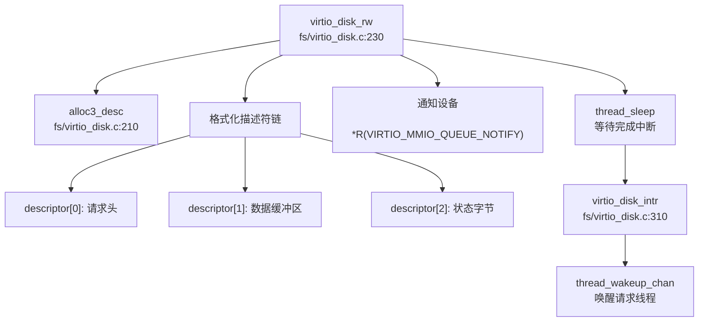

现在我已经收集了足够的信息。让我撰写完整的第 7 章报告。

## 第 7 章：设备驱动与硬件抽象

本章分析 Re-XVapor 操作系统的设备驱动架构，涵盖设备发现机制、驱动框架设计、组件化配置、以及各类具体设备驱动的实现细节。该项目基于 xv6-riscv 深度改造，支持 RISC-V 和 LoongArch 双架构，采用条件编译区分不同硬件平台的驱动实现。

---

## 驱动框架与设备发现

### 设备发现机制：硬编码地址 vs 动态扫描

Re-XVapor 采用**混合设备发现策略**：RISC-V 平台使用硬编码 MMIO 地址，LoongArch 平台通过 PCI 配置空间动态扫描。

#### RISC-V 平台：硬编码 MMIO 地址

RISC-V 架构下，设备地址在 `kernel/include/memlayout.h` 中硬编码定义：

```c
// kernel/include/memlayout.h:27-30
#define VIRTIO0 0x10001000L
#define VIRTIO0_IRQ 1

#define UART0 0x10000000L
#define UART0_IRQ 10
```

设备初始化在 `kernel/init/main.c` 中直接调用驱动初始化函数，**未实现 Device Tree (DTS) 解析**：

```c
// kernel/init/main.c:95-96 (RISC-V 路径)
virtio_disk_init(); // emulated hard disk
```

#### LoongArch 平台：PCI 配置空间扫描

LoongArch 架构实现了完整的 PCI 设备扫描机制。`kernel/arch/loongarch/pci.c` 中的 `pci_scan_buses()` 遍历所有总线、设备和功能号：

```c
// kernel/arch/loongarch/pci.c:410-420
static void pci_scan_buses()
{
    unsigned int bus;
    unsigned char device, function;
    for (bus = 0; bus < PCI_MAX_BUS; bus++) {
        for (device = 0; device < PCI_MAX_DEV; device++) {
            for (function = 0; function < PCI_MAX_FUN; function++) {
                pci_scan_device(bus, device, function);
            }
        }
    }
}
```

`pci_scan_device()` 读取配置空间的 Vendor ID 和 Device ID 识别设备：

```c
// kernel/arch/loongarch/pci.c:258-270
static void pci_scan_device(unsigned char bus, unsigned char device, unsigned char function)
{
    unsigned int val;
    pci_read_config(PCI_CONFIG0_BASE, bus, device, function, PCI_DEVICE_VENDER, &val);
    unsigned int vendor_id = val & 0xffff;
    unsigned int device_id = val >> 16;
    
    if (vendor_id == 0xffff) {  // 设备不存在
        return;
    }
    // ... 分配设备结构体并初始化
}
```

**✅ 已实现**：PCI 配置空间扫描机制完整实现，支持动态发现 AHCI 控制器和 VirtIO 设备。

---

## 组件化设计与配置机制

### 编译时配置：条件编译宏

项目通过 Makefile 中的条件编译宏区分不同架构和驱动实现，**未使用 Kconfig 或 Cargo.toml 风格的特性系统**。

#### 顶层 Makefile 配置

```makefile
# Makefile:22-35
ifeq ($(ARCH), riscv)
    CFLAGS += -D__ARCH_RISCV
    CFLAGS += -D__VIRTIO
else ifeq ($(ARCH), loongarch)
    CFLAGS += -D__ARCH_LOONGARCH
    CFLAGS += -D__CONFIG_2K1000LA
    CFLAGS += -D__AHCI
endif
```

#### 驱动选择逻辑

`kernel/init/main.c` 根据宏选择存储驱动：

```c
// kernel/init/main.c:140-145 (LoongArch 路径)
#ifdef __VIRTIO
    virtio_disk_init(); // emulated hard disk
#elif defined(__AHCI)
    pci_init();
    disk_init();
#endif
```

#### 文件系统层的条件编译

`kernel/fs/bio.c` 根据宏选择底层块设备操作：

```c
// kernel/fs/bio.c:118-145
#ifdef __VIRTIO
    virtio_disk_rw(b, B_READ);
#elif defined(__AHCI)
    // AHCI 驱动调用
    block_read(b->blockno * (BSIZE / 512), 1, (uint64)b->data, 0);
#endif
```

**🔸 部分实现**：组件化通过条件编译实现，但缺乏运行时动态加载机制。所有驱动在编译时静态链接。

---

## 字符设备驱动（UART/Console）

### RISC-V 平台：16550A UART 驱动

`kernel/arch/qemu/uart.c` 实现了标准的 16550A UART 驱动，支持中断驱动的缓冲输出。

#### MMU 前后地址切换

UART 基址在 `memlayout.h` 中定义，**MMU 启用前后使用相同的虚拟地址映射**：

```c
// kernel/include/memlayout.h:58-59 (RISC-V)
#define UART0 0x10000000L
#define UART0_IRQ 10
```

初始化函数 `uartinit()` 直接访问 MMIO 寄存器：

```c
// kernel/arch/qemu/uart.c:53-77
void uartinit(void)
{
    WriteReg(IER, 0x00);      // 禁用中断
    WriteReg(LCR, LCR_BAUD_LATCH);  // 设置波特率分频器
    WriteReg(0, 0x03);        // LSB = 3 (38.4K 波特率)
    WriteReg(1, 0x00);        // MSB = 0
    WriteReg(LCR, LCR_EIGHT_BITS);  // 8 数据位，无校验
    WriteReg(FCR, FCR_FIFO_ENABLE | FCR_FIFO_CLEAR);  // 启用 FIFO
    WriteReg(IER, IER_TX_ENABLE | IER_RX_ENABLE);  // 启用中断
    initlock(&uart_tx_lock, "uart");
}
```

#### 双模式输出

驱动提供两种输出模式：

1. **中断驱动模式** (`uartputc()`)：用于 write() 系统调用，支持缓冲和线程休眠
2. **轮询模式** (`uartputc_sync()`)：用于内核 printf()，自旋等待 THR 空

```c
// kernel/arch/qemu/uart.c:103-117
void uartputc_sync(int c)
{
    push_off();
    while((ReadReg(LSR) & LSR_TX_IDLE) == 0)  // 自旋等待
        ;
    WriteReg(THR, c);
    pop_off();
}
```

**✅ 已实现**：完整的 UART 驱动，支持中断和轮询双模式。

### LoongArch 平台：NS16550A 驱动

`kernel/arch/loongarch/ns16550a.c` 实现了类似的驱动，但使用不同的基址：

```c
// kernel/include/ns16550a.h:5-8
#ifndef __CONFIG_2K1000LA
#define UART_BASE_ADDR 0x1fe001e0
#else
#define UART_BASE_ADDR 0x800000001fe20000ULL  // 高地址映射
#endif
```

**关键观察**：`__CONFIG_2K1000LA` 宏控制不同的物理地址，**MMU 启用后通过直接映射窗口 (DMW) 转换为虚拟地址**。

---

## 块设备驱动（VirtIO-Blk 等）

### VirtIO-Blk 驱动（RISC-V 平台）

`kernel/fs/virtio_disk.c` 实现了 VirtIO 1.0 MMIO 接口规范。

#### 初始化流程

```c
// kernel/fs/virtio_disk.c:65-130
void virtio_disk_init(void)
{
    // 1. 验证设备 ID
    if(*R(VIRTIO_MMIO_MAGIC_VALUE) != 0x74726976 ||
       *R(VIRTIO_MMIO_VERSION) != 2 ||
       *R(VIRTIO_MMIO_DEVICE_ID) != 2)
        panic("could not find virtio disk");
    
    // 2. 特性协商
    uint64 features = *R(VIRTIO_MMIO_DEVICE_FEATURES);
    features &= ~(1 << VIRTIO_BLK_F_RO);  // 禁用只读
    *R(VIRTIO_MMIO_DRIVER_FEATURES) = features;
    
    // 3. 分配描述符队列
    disk.desc = kalloc();
    disk.avail = kalloc();
    disk.used = kalloc();
    
    // 4. 设置队列物理地址
    *R(VIRTIO_MMIO_QUEUE_DESC_LOW) = (uint64)disk.desc;
    *R(VIRTIO_MMIO_DRIVER_DESC_LOW) = (uint64)disk.avail;
    *R(VIRTIO_MMIO_DEVICE_DESC_LOW) = (uint64)disk.used;
    
    // 5. 标记驱动就绪
    status |= VIRTIO_CONFIG_S_DRIVER_OK;
    *R(VIRTIO_MMIO_STATUS) = status;
}
```

#### 读写操作调用链



**✅ 已实现**：完整的 VirtIO-Blk 驱动，支持 8 个描述符的环形缓冲区。

### AHCI 驱动（LoongArch 平台）

`kernel/arch/loongarch/ahci.c` 实现了 AHCI SATA 控制器驱动，支持 ATA 命令集。

#### PCI 设备发现与 BAR 映射

```c
// kernel/arch/loongarch/ahci.c:530-545
void disk_init(void) {
    pci_device_t *pci_dev = pci_get_device_by_bus(0, 8, 0);
    if (pci_dev == NULL) {
        printf("[ahci]: no AHCI controllers present!\n");
    }
    SATA_ABAR_BASE = CSR_DMW0_BASE | pci_dev->bar[0].base_addr;
    *(unsigned int *)(SATA_ABAR_BASE | HBA_GHC) |= HBA_GHC_IE;
    *(unsigned int *)(SATA_ABAR_BASE | HBA_GHC) |= HBA_GHC_AHCI_ENABLE;
    ahci_probe_port();
    port_rebase(2);
}
```

#### 命令提交流程

AHCI 使用命令列表 (Command List) 和 FIS (Frame Information Structure) 机制：

```c
// kernel/arch/loongarch/ahci.c:290-330
int ahci_read(unsigned long port_base, unsigned int startl, 
              unsigned int starth, unsigned int count, unsigned long buf)
{
    int slot = ahci_find_cmdslot(port_base);  // 寻找空闲槽位
    struct hba_command_header* cmdheader = 
        ahci_initialize_command_header(port_base, slot, count, 0);
    struct hba_command_table* cmdtbl = 
        ahci_initialize_command_table(cmdheader, count, buf, 1);
    struct fis_reg_host_to_device* cmdfis = 
        ahci_initialize_fis_host_to_device(cmdtbl, startl, starth, 
                                           ATA_CMD_READ_DMA_EXT, count);
    
    *(unsigned int *)(SATA_ABAR_BASE|(port_base + PORT_CI)) = 1 << slot;  // 发送命令
    
    // 轮询等待完成
    while ((*(unsigned int*)(SATA_ABAR_BASE | (port_base + PORT_CI)) & (1 << slot))) {
        if (*(unsigned int *)(SATA_ABAR_BASE | (port_base + PORT_IS)) & HBA_PxIS_TFES)
            return E_TASK_FILE_ERROR;
    }
    return AHCI_SUCCESS;
}
```

**✅ 已实现**：完整的 AHCI 驱动，支持 ATA/ATAPI 设备，但**中断处理未完全实现**（使用轮询等待）。

### 块设备抽象层

`kernel/fs/blockdev.c` 提供了 ext4 文件系统与底层块设备的接口：

```c
// kernel/fs/blockdev.c:52-66
static int blockdev_bread(struct ext4_blockdev *bdev, void *buf, 
                          uint64_t blk_id, uint32_t blk_cnt)
{
    uint64 bp = (uint64)buf;
    for(int i = 0; i < blk_cnt; i++) {
        struct buf *b = bread(ROOTDEV, blk_id + i);  // 调用缓冲区缓存
        memmove((void*)bp, b->data, BSIZE);
        bp += BSIZE;
        brelse(b);
    }
    return EOK;
}
```

**✅ 已实现**：统一的块设备接口，支持 ext4 文件系统调用。

---

## 网络设备驱动

### ❌ 未实现

搜索结果显示项目中**未发现网络设备驱动实现**：

```bash
# Makefile:153 注释掉的网络设备配置
# QEMUOPTS += -device virtio-net-device,netdev=net -netdev user,id=net
```

README 中提到的长期目标包括：
> ☐ 实现完整的 TCP/IP 网络协议栈（或集成 lwIP）

**❌ 未实现**：网络驱动和协议栈均未实现。

---

## 中断控制器驱动

### RISC-V 平台：PLIC 驱动

`kernel/arch/qemu/plic.c` 实现了 Platform-Level Interrupt Controller 驱动：

```c
// kernel/arch/qemu/plic.c:11-20
void plicinit(void)
{
    // 设置 UART 和 VirtIO 的中断优先级
    *(uint32*)(PLIC + UART0_IRQ*4) = 1;
    *(uint32*)(PLIC + VIRTIO0_IRQ*4) = 1;
}

void plicinithart(void)
{
    int hart = cpuid();
    // 启用 S 模式中断
    *(uint32*)PLIC_SENABLE(hart) = (1 << UART0_IRQ) | (1 << VIRTIO0_IRQ);
    *(uint32*)PLIC_SPRIORITY(hart) = 0;  // 优先级阈值
}
```

中断认领与完成：

```c
// kernel/arch/qemu/plic.c:30-43
int plic_claim(void)
{
    int hart = cpuid();
    int irq = *(uint32*)PLIC_SCLAIM(hart);
    return irq;
}

void plic_complete(int irq)
{
    int hart = cpuid();
    *(uint32*)PLIC_SCLAIM(hart) = irq;
}
```

**✅ 已实现**：完整的 PLIC 驱动，支持多 HART 中断路由。

### LoongArch 平台：EXTIOI 与 APIC 驱动

LoongArch 使用 EXTIOI（扩展中断输入输出接口）和 7A1000 APIC：

```c
// kernel/arch/loongarch/extioi.c:7-15
void extioi_init(void)
{
    iocsr_writeq(0x1UL << UART0_IRQ, LOONGARCH_IOCSR_EXTIOI_EN_BASE);  // 启用 UART 中断
    iocsr_writeq(0x01UL, LOONGARCH_IOCSR_EXTIOI_MAP_BASE);  // 映射配置
    iocsr_writeq(0x10000UL, LOONGARCH_IOCSR_EXTIOI_ROUTE_BASE);  // 路由配置
}

// kernel/arch/loongarch/apic.c:11-23
void apic_init(void)
{
    *(volatile uint64*)(LS7A_INT_MASK_REG) = ~(0x1UL << UART0_IRQ);  // 解除屏蔽
    *(volatile uint64*)(LS7A_INT_EDGE_REG) = (0x1UL << UART0_IRQ);  // 边沿触发
    *(volatile uint8*)(LS7A_INT_HTMSI_VEC_REG + UART0_IRQ) = UART0_IRQ;  // 向量映射
}
```

**✅ 已实现**：EXTIOI 和 APIC 驱动，但**仅支持 UART 中断**，AHCI 中断未启用。

---

## 目标平台适配情况

### 支持的平台列表

| 架构 | 开发板/平台 | 配置文件 | 特有驱动 |
|------|------------|---------|---------|
| RISC-V | QEMU virt 机器 | `Makefile: ARCH=riscv` | PLIC, VirtIO-MMIO |
| LoongArch | 2K1000LA / LS7A 芯片组 | `Makefile: ARCH=loongarch` | EXTIOI, APIC, AHCI, PCI |

### 平台适配机制

#### 1. 条件编译隔离

```c
// kernel/init/main.c:109-111
#ifdef __ARCH_LOONGARCH
#include "pci.h"
#include "ahci.h"
#endif
```

#### 2. 内存布局分离

```c
// kernel/include/memlayout.h:53-65
#ifdef __ARCH_LOONGARCH
#define UART0 0x800000001fe20000ULL
#define UART0_IRQ 2
#define KERNBASE CSR_DMW1_BASE  // 直接映射窗口
#else  // __ARCH_RISCV
#define UART0 0x10000000L
#define UART0_IRQ 10
#define KERNBASE 0x80200000L
#endif
```

#### 3. 启动代码分离

- RISC-V: `kernel/arch/riscv/entry.S`
- LoongArch: `kernel/arch/loongarch/entry.S`

**✅ 已实现**：双架构支持，通过条件编译和目录隔离实现平台适配。

---

## 其他外设支持

### VirtIO 设备

除 VirtIO-Blk 外，代码中预留了 VirtIO-Net 的定义但未实现驱动：

```c
// kernel/include/virtio.h:17
#define VIRTIO_MMIO_DEVICE_ID 0x008  // 1 is net, 2 is disk
```

### PCI 设备

LoongArch 平台支持 PCI 设备扫描和 BAR 地址分配：

```c
// kernel/arch/loongarch/pci.c:145-165
static void pci_device_init(pci_device_t *device, ...)
{
    // 初始化 6 个 BAR 寄存器
    for (bar = 0; bar < PCI_MAX_BAR; bar++) {
        pci_read_config(..., &val);
        pci_write_config(..., 0xffffffff);  // 探测大小
        pci_read_config(..., &len);
        pci_write_config(..., val);  // 恢复地址
        pci_device_bar_init(&pci_dev->bar[bar], val, len);
    }
}
```

**✅ 已实现**：PCI 配置空间访问和 BAR 分配。

### 缺失的外设驱动

| 设备类型 | 状态 | 说明 |
|---------|------|------|
| GPU/FrameBuffer | ❌ 未实现 | README 列为长期目标 |
| USB | ❌ 未实现 | 无相关代码 |
| SD/eMMC | ❌ 未实现 | 仅支持 AHCI/VirtIO |
| I2C/SPI | ❌ 未实现 | 无相关代码 |

---

## MMU 前后串口地址切换分析

### RISC-V 平台

RISC-V 使用恒定的 MMIO 映射，**MMU 启用前后地址不变**：

```c
// kernel/include/memlayout.h:58-59
#define UART0 0x10000000L  // 物理地址
// 该地址在 kvminit() 后直接映射到相同的虚拟地址
```

初始化顺序：
1. `consoleinit()` → `uartinit()` 在 `kvminit()` **之前**调用（物理地址）
2. MMU 启用后，该地址通过内核页表保持映射

### LoongArch 平台

LoongArch 使用直接映射窗口 (DMW) 实现地址转换：

```c
// kernel/include/memlayout.h:30-35 (LoongArch)
#define CSR_DMW1_VSEG _CONST64_(0x9000)
#define CSR_DMW1_BASE (CSR_DMW1_VSEG << DMW_PABITS)
#define KERNBASE CSR_DMW1_BASE
#define UART0 0x800000001fe20000ULL  // 已经是虚拟地址（高地址）
```

**关键机制**：
- `0x800000001fe20000` = `0x9000000000000000` (DMW1 基址) + `0x1fe20000` (物理偏移)
- MMU 启用前：CPU 使用物理地址 `0x1fe20000`（通过 `__CONFIG_2K1000LA` 宏区分）
- MMU 启用后：通过 DMW1 自动转换为虚拟地址

**✅ 已实现**：通过架构特定的地址映射机制处理 MMU 切换。

---

## 驱动框架总结

| 特性 | 实现状态 | 文件路径 |
|------|---------|---------|
| PCI 设备扫描 | ✅ 已实现 | `kernel/arch/loongarch/pci.c` |
| VirtIO-Blk 驱动 | ✅ 已实现 | `kernel/fs/virtio_disk.c` |
| AHCI 驱动 | ✅ 已实现 | `kernel/arch/loongarch/ahci.c` |
| UART 驱动 (RISC-V) | ✅ 已实现 | `kernel/arch/qemu/uart.c` |
| UART 驱动 (LoongArch) | ✅ 已实现 | `kernel/arch/loongarch/ns16550a.c` |
| PLIC 驱动 | ✅ 已实现 | `kernel/arch/qemu/plic.c` |
| EXTIOI/APIC 驱动 | ✅ 已实现 | `kernel/arch/loongarch/extioi.c`, `apic.c` |
| 网络驱动 | ❌ 未实现 | 无 |
| Device Tree 解析 | ❌ 未实现 | 硬编码地址 |
| 动态驱动加载 | ❌ 未实现 | 静态编译 |
| 组件化配置系统 | 🔸 部分实现 | Makefile 条件编译 |

**总体评价**：Re-XVapor 实现了基础的存储和串口驱动，支持双架构启动。但缺乏现代操作系统的动态驱动框架、Device Tree 支持和网络协议栈。驱动代码高度依赖条件编译，模块化程度有限。
