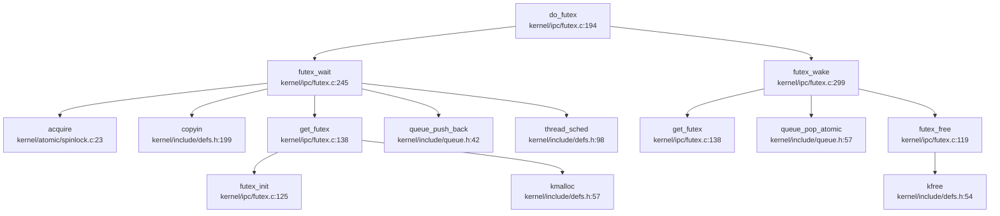

## 第 8 章：同步互斥与进程间通信

本章分析该操作系统中的同步原语（锁机制）、等待队列实现以及进程间通信（IPC）机制。通过代码验证，本项目实现了较为完整的同步与 IPC 子系统，包括自旋锁、睡眠锁、信号量、条件变量、Futex、管道和信号机制。

---

## 同步与互斥原语（锁与原子操作）

### 自旋锁（SpinLock）

**实现位置**：`kernel/atomic/spinlock.c`

自旋锁是该系统最基础的同步原语，采用原子操作实现忙等待。

**原子操作实现**：
- 使用 GCC 内置的 `__sync_lock_test_and_set()` 实现原子交换（对应 RISC-V 的 `amoswap.w.aq` 指令）
- 使用 `__sync_lock_release()` 释放锁（对应 `amoswap.w zero, zero, (s1)`）
- 使用 `__sync_synchronize()` 内存屏障确保内存操作顺序

**关键代码**（`kernel/atomic/spinlock.c:22-56`）：
```c
void acquire(struct spinlock *lk) {
  push_off(); // disable interrupts to avoid deadlock.
  if(holding(lk))
    panic("acquire");

  // 原子交换，类似 x86 的 CAS
  while(__sync_lock_test_and_set(&lk->locked, 1) != 0)
    ;

  __sync_synchronize(); // 内存屏障
  lk->cpu = mycpu();
}

void release(struct spinlock *lk) {
  if(!holding(lk))
    panic("release");
  lk->cpu = 0;
  __sync_synchronize(); // 内存屏障
  __sync_lock_release(&lk->locked);
  pop_off();
}
```

**状态**：✅ **已实现** - 包含完整的原子操作、中断禁用/恢复、死锁检测逻辑。

---

### 睡眠锁（SleepLock）

**实现位置**：`kernel/atomic/sleeplock.c`

睡眠锁是在自旋锁基础上构建的高级锁，当获取锁失败时会让出 CPU（调用 `thread_sleep`），而非忙等待。

**关键代码**（`kernel/atomic/sleeplock.c:22-50`）：
```c
void acquiresleep(struct sleeplock *lk) {
  acquire(&lk->lk); // 用 spinlock 保护
  while (lk->locked) {
    thread_sleep(lk, &lk->lk, NULL); // 睡眠等待
  }
  lk->locked = 1;
  lk->pid = myproc()->pid;
  release(&lk->lk);
}

void releasesleep(struct sleeplock *lk) {
  acquire(&lk->lk);
  lk->locked = 0;
  lk->pid = 0;
  thread_wakeup_chan(lk); // 唤醒等待者
  release(&lk->lk);
}
```

**状态**：✅ **已实现** - 完整实现睡眠/唤醒机制，与调度器集成。

---

### 信号量（Semaphore）

**实现位置**：`kernel/atomic/semaphore.c`

实现了经典的 PV 操作信号量，基于条件变量构建。

**关键代码**（`kernel/atomic/semaphore.c:8-40`）：
```c
void sema_init(sem *s, int value, char *name) {
    s->value = value;
    s->wakeup = 0;
    initlock(&s->sem_lock, name);
    cond_init(&s->sem_cond, name);
}

void sema_wait(sem *s) { // P 操作
    acquire(&s->sem_lock);
    s->value--;
    if (s->value < 0) {
        do {
            cond_wait(&s->sem_cond, &s->sem_lock);
        } while (s->wakeup == 0);
        s->wakeup--;
    }
    release(&s->sem_lock);
}

void sema_signal(sem *s) { // V 操作
    acquire(&s->sem_lock);
    s->value++;
    if (s->value <= 0) {
        s->wakeup++;
        cond_signal(&s->sem_cond);
    }
    release(&s->sem_lock);
}
```

**状态**：✅ **已实现** - 完整的 PV 操作，包含等待队列管理。

**注意**：文档 `docs/semaphore.md` 描述了信号量设计，但实际实现与文档略有差异（实现使用条件变量而非独立等待队列）。

---

### 条件变量（Condition Variable）

**实现位置**：`kernel/atomic/cond.c`

条件变量用于线程间同步，允许线程在条件不满足时挂起。

**关键代码**（`kernel/atomic/cond.c:14-70`）：
```c
void cond_init(struct cond *cond, char *name) {
    queue_init(&cond->waiting_queue, name, TCB_WAIT_QUEUE);
}

int cond_wait(struct cond *cond, struct spinlock *mutex) {
    struct tcb *t = mythread();
    acquire(&t->lock);
    tcb_q_change_state(t, TCB_SLEEPING);
    queue_push_back(&cond->waiting_queue, (void *)t);
    t->wait_chan_entry = &cond->waiting_queue;
    release(mutex); // 释放互斥锁
    thread_sched(); // 调度
    // ... 信号特殊处理 ...
    acquire(mutex); // 重新获取锁
    return 0;
}

void cond_signal(struct cond *cond) {
    struct tcb *t;
    if (!queue_isempty_atomic(&cond->waiting_queue)) {
        t = (struct tcb *)queue_pop_atomic(&cond->waiting_queue, 1);
        acquire(&t->lock);
        tcb_q_change_state(t, TCB_RUNNABLE);
        release(&t->lock);
    }
}
```

**状态**：✅ **已实现** - 包含等待队列管理、状态转换、广播功能（`cond_broadcast`）。

---

## 等待队列实现机制

### WaitQueue 数据结构

等待队列使用 `struct queue` 实现，定义在 `kernel/include/queue.h`。

**线程状态转换**：
- `TCB_RUNNABLE` ↔ `TCB_SLEEPING`
- 通过 `tcb_q_change_state()` 修改状态

**挂起机制**：
1. 线程获取锁失败时，调用 `cond_wait()` 或 `thread_sleep()`
2. 将自身 `tcb` 加入等待队列（`queue_push_back`）
3. 设置 `t->wait_chan_entry` 指向等待队列
4. 状态改为 `TCB_SLEEPING`
5. 调用 `thread_sched()` 触发调度

**唤醒机制**：
1. 持有锁的线程调用 `cond_signal()` 或 `thread_wakeup_chan()`
2. 从等待队列弹出 `tcb`（`queue_pop_atomic`）
3. 状态改为 `TCB_RUNNABLE`
4. 清除 `wait_chan_entry`

**关键代码引用**：
- `kernel/atomic/cond.c:19-47` - `cond_wait()` 实现
- `kernel/atomic/cond.c:49-68` - `cond_signal()` 实现
- `kernel/atomic/cond.c:69-87` - `cond_broadcast()` 实现

**状态**：✅ **已实现** - 完整的等待/唤醒机制，与调度器深度集成。

---

## 进程间通信（Pipe/MsgQueue/Sem）

### Futex（快速用户态互斥锁）

**实现位置**：`kernel/ipc/futex.c`、`kernel/include/futex.h`

Futex 是该系统核心的用户态同步机制，支持 `FUTEX_WAIT` 和 `FUTEX_WAKE` 操作。

**系统调用接口**（`kernel/sysproc.c:621-646`）：
```c
uint64 sys_futex(void) {
  int futex_op;
  uint32_t val, val2, val3;
  uint64 timeout_addr, uaddr, uaddr2;
  struct timespec timeout;

  argaddr(0, &uaddr);
  argint(1, &futex_op);
  arguint32(2, &val);
  // ... 参数解析 ...
  
  if(futex_need_timeout(futex_op) && timeout_addr) {
      if (copyin(myproc()->mm.pagetable, (char *)&timeout, timeout_addr, sizeof(struct timespec)) < 0) {
          return -1;
      }
  }
  return do_futex(uaddr, futex_op, val, timeout_addr ? &timeout : NULL, 
                  uaddr2, val2, val3);
}
```

**Futex 数据结构**（`kernel/include/futex.h:45-48`）：
```c
struct futex {
    struct spinlock lock;
    struct queue waiting_queue;
};
```

**Futex 哈希表**：
- 使用哈希表管理多个 futex（`futex_hashtable`，大小 `FUTEX_NUM=32`）
- 通过 `get_futex()` 查找或创建 futex 对象

**Futex Wait 流程**（`kernel/ipc/futex.c:245-288`）：
1. 从用户空间读取 futex 值（`copyin`）
2. 检查值是否等于期望值（不等则直接返回）
3. 获取或创建 futex 对象（`get_futex`）
4. 将当前线程加入等待队列
5. 设置超时（如果有）
6. 调用 `thread_sched()` 让出 CPU

**Futex Wake 流程**（`kernel/ipc/futex.c:299-334`）：
1. 查找 futex 对象
2. 从等待队列弹出最多 `nr_wake` 个线程
3. 将线程状态改为 `TCB_RUNNABLE`
4. 如果等待队列为空，释放 futex 对象

**完整调用链**（`do_futex` outgoing）：



**状态**：✅ **已实现** - 完整的 Futex 等待/唤醒机制，支持超时。

**限制**：
- 仅实现 `FUTEX_WAIT` 和 `FUTEX_WAKE` 基础操作
- `FUTEX_REQUEUE`、`FUTEX_LOCK_PI` 等高级操作被注释掉（`kernel/ipc/futex.c:203-232`）

---

### 管道（Pipe）

**实现位置**：`kernel/ipc/pipe.c`

管道是基于环形缓冲区的字节流 IPC 机制。

**数据结构**（`kernel/ipc/pipe.c:14-21`）：
```c
struct pipe {
  struct spinlock lock;
  char data[PIPESIZE];      // 512 字节环形缓冲区
  uint nread;               // 已读字节数
  uint nwrite;              // 已写字节数
  int readopen;             // 读端是否打开
  int writeopen;            // 写端是否打开
};
```

**管道分配**（`kernel/ipc/pipe.c:24-61`）：
```c
int pipealloc(struct file **f0, struct file **f1) {
  struct pipe *pi = (struct pipe*)kalloc();
  pi->readopen = 1;
  pi->writeopen = 1;
  initlock(&pi->lock, "pipe");
  (*f0)->type = FD_PIPE;
  SET_READABLE((*f0)->flags);
  (*f0)->pipe = pi;
  (*f1)->type = FD_PIPE;
  SET_WRITABLE((*f1)->flags);
  (*f1)->pipe = pi;
  return 0;
}
```

**写管道**（`kernel/ipc/pipe.c:90-117`）：
```c
int pipewrite(struct pipe *pi, int user_src, uint64 addr, int n) {
  int i = 0;
  acquire(&pi->lock);
  while(i < n){
    if(pi->readopen == 0 || proc_killed(pr)){
      release(&pi->lock);
      return -1;
    }
    if(pi->nwrite == pi->nread + PIPESIZE){ // 缓冲区满
      thread_wakeup_chan(&pi->nread);
      thread_sleep(&pi->nwrite, &pi->lock, NULL); // 阻塞
    } else {
      char ch;
      either_copyin(&ch, user_src, addr + i, 1);
      pi->data[pi->nwrite++ % PIPESIZE] = ch;
      i++;
    }
  }
  thread_wakeup_chan(&pi->nread);
  release(&pi->lock);
  return i;
}
```

**读管道**（`kernel/ipc/pipe.c:119-144`）：
```c
int piperead(struct pipe *pi, int user_dst, uint64 addr, int n) {
  acquire(&pi->lock);
  while(pi->nread == pi->nwrite && pi->writeopen){ // 缓冲区空
    thread_sleep(&pi->nread, &pi->lock, NULL);
  }
  for(i = 0; i < n; i++){
    if(pi->nread == pi->nwrite) break;
    ch = pi->data[pi->nread++ % PIPESIZE];
    either_copyout(user_dst, addr + i, &ch, 1);
  }
  thread_wakeup_chan(&pi->nwrite);
  release(&pi->lock);
  return i;
}
```

**系统调用**（`kernel/fs/sysfile.c:681-709`）：
```c
uint64 sys_pipe(void) {
  uint64 fdarray;
  struct file *rf, *wf;
  argaddr(0, &fdarray);
  if(pipealloc(&rf, &wf) < 0) return -1;
  // 分配两个文件描述符
  // ...
  copyout(p->mm.pagetable, fdarray, (char*)&fd0, sizeof(fd0));
  copyout(p->mm.pagetable, fdarray+sizeof(fd0), (char *)&fd1, sizeof(fd1));
  return 0;
}
```

**状态**：✅ **已实现** - 完整的环形缓冲区管道，支持阻塞读/写。

---

### 信号（Signal）作为 IPC

**实现位置**：`kernel/ipc/signal.c`、`kernel/ipc/syssig.c`

信号机制支持进程/线程间异步通信。

**信号发送**（`kernel/ipc/signal.c:381-428`）：
```c
int signal_send(siginfo_t *info, struct tcb *t) {
    sig_t sig = info->si_signo;
    if(!valid_signal(sig)) return -1;
    if (sig_existed(t, sig)) return -1;
    
    // 立即杀死
    if (sig == SIGKILL || sig == SIGSTOP || sig == SIGTERM) {
        t->killed = 1;
    }

    struct sigqueue *q = (struct sigqueue *)kalloc();
    q->info = *info;
    acquire(&t->sig_pending.siglock);
    list_add_tail(&q->list, &t->sig_pending.list);
    sig_add_set(t->sig_pending.signal, sig);
    release(&t->sig_pending.siglock);
    t->pending_cnt++;
    return 0;
}
```

**系统调用接口**：
- `sys_kill()` - 向进程发送信号（`kernel/sysproc.c:349-357`）
- `sys_tkill()` - 向线程发送信号（`kernel/sysproc.c:360-369`）
- `sys_tgkill()` - 向线程组发送信号（`kernel/sysproc.c:378-387`）

**信号处理时机**：
信号在 Trap 返回用户态前处理（`kernel/sched/trap.c:202` 和 `kernel/sched/trap.c:560`）：
```c
// usertrap 中
signal_handle(t, 0, NULL); // handle the signal, if any
usertrapret();
```

**信号处理流程**（`kernel/ipc/signal.c:113-180`）：
1. 检查 `t->pending_cnt` 是否有待处理信号
2. 从 `sig_pending.list` 取出信号
3. 检查信号是否被屏蔽（`t->blocked`）
4. 如果设置了自定义处理函数，调用 `do_handle_signal()`
5. 否则执行默认行为（`signal_default()`）

**状态**：✅ **已实现** - 完整的信号发送、排队、处理机制，支持 `sigaction`、`sigprocmask`。

---

### 消息队列（MessageQueue）

**搜索结果**：`grep_in_repo` 搜索 `sys_msgget|msgget|msgsnd|msgrcv` **未找到匹配**。

**状态**：❌ **未实现** - 代码库中不存在 System V 消息队列相关实现。

---

### 共享内存（SharedMem）

**搜索结果**：`grep_in_repo` 搜索 `sys_shmget|shmget|shmat|shmdt` **未找到匹配**。

**状态**：❌ **未实现** - 代码库中不存在 System V 共享内存相关实现。

**注意**：内存管理章节中的 `mmap()` 实现了内存映射，但不是 POSIX 共享内存 IPC。

---

### 信号量（System V Semaphore）

**搜索结果**：`grep_in_repo` 搜索 `sys_semget|semget|semop` **未找到匹配**。

**状态**：❌ **未实现** - 代码库中不存在 System V 信号量 IPC 接口。

**注意**：内核态信号量（`kernel/atomic/semaphore.c`）已实现，但仅用于内核同步，未暴露为用户态 IPC 系统调用。

---

## 关键代码片段

### 1. 自旋锁原子操作（`kernel/atomic/spinlock.c:36-45`）
```c
while(__sync_lock_test_and_set(&lk->locked, 1) != 0)
  ;

__sync_synchronize(); // 内存屏障
lk->cpu = mycpu();
```

### 2. Futex Wait 核心逻辑（`kernel/ipc/futex.c:245-288`）
```c
static int futex_wait(uint64 uaddr, uint32 val, const struct timespec *timeout) {
    uint32 uval = 0;
    if(copyin(p->mm.pagetable, (char*)&uval, uaddr, sizeof(uval)) < 0)
        return -1;
    if(uval != val) return 0; // 值已变化

    fp = get_futex(uaddr, 0);
    acquire(&t->lock);
    tcb_q_change_state(t, TCB_SLEEPING);
    queue_push_back(&fp->waiting_queue, t);
    t->wait_chan_entry = &fp->waiting_queue;
    if(timeout) t->timeout = get_timeout_ticks(timeout);
    thread_sched(); // 让出 CPU
    release(&t->lock);
    return 0;
}
```

### 3. 管道环形缓冲区（`kernel/ipc/pipe.c:105-112`）
```c
if(pi->nwrite == pi->nread + PIPESIZE){ // 满
  thread_wakeup_chan(&pi->nread);
  thread_sleep(&pi->nwrite, &pi->lock, NULL);
} else {
  char ch;
  either_copyin(&ch, user_src, addr + i, 1);
  pi->data[pi->nwrite++ % PIPESIZE] = ch; // 环形索引
  i++;
}
```

### 4. 信号处理时机（`kernel/sched/trap.c:202`）
```c
signal_handle(t, 0, NULL); // handle the signal, if any
usertrapret();
```

---

## 未实现/桩函数功能列表

| 功能 | 状态 | 说明 |
|------|------|------|
| **System V 消息队列** | ❌ 未实现 | 无 `msgget`、`msgsnd`、`msgrcv` 系统调用 |
| **System V 共享内存** | ❌ 未实现 | 无 `shmget`、`shmat`、`shmdt` 系统调用 |
| **System V 信号量 IPC** | ❌ 未实现 | 无 `semget`、`semop` 系统调用（内核信号量已实现但未暴露给用户态） |
| **Futex 高级操作** | 🔸 部分实现 | 仅实现 `FUTEX_WAIT`/`FUTEX_WAKE`，`FUTEX_REQUEUE`、`FUTEX_LOCK_PI` 等被注释掉（`kernel/ipc/futex.c:203-232`） |
| **条件变量 Futex 优化** | 🔸 待优化 | `kernel/atomic/cond.c:30` 注释 `// TODO : modify it to futex(ref to linux)` |

---

## 总结

该操作系统实现了较为完整的同步与 IPC 机制：

**已实现的核心功能**：
- ✅ 自旋锁（基于原子操作 `__sync_lock_test_and_set`）
- ✅ 睡眠锁（基于自旋锁 + 线程睡眠）
- ✅ 信号量（PV 操作，基于条件变量）
- ✅ 条件变量（等待队列 + 状态转换）
- ✅ Futex（`FUTEX_WAIT`/`FUTEX_WAKE`，哈希表管理）
- ✅ 管道（512 字节环形缓冲区，阻塞读/写）
- ✅ 信号（完整的 `sigaction`、`sigprocmask`、`kill` 机制）

**未实现的功能**：
- ❌ System V IPC（消息队列、共享内存、信号量）
- ❌ Futex 高级操作（PI、REQUEUE 等）

**设计特点**：
1. **原子操作**：使用 GCC `__sync_*` 内置函数，对应 RISC-V `amoswap` 指令
2. **等待队列**：统一使用 `struct queue`，支持线程状态转换
3. **信号处理**：在 Trap 返回用户态前统一处理（`usertrap` 中调用 `signal_handle`）
4. **Futex 优化**：用户态原子操作 + 内核态等待队列，减少系统调用开销
