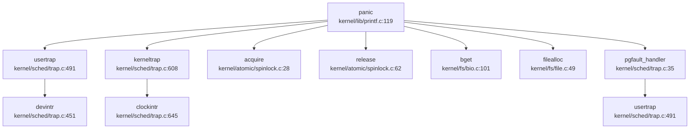

现在我已经收集了足够的信息来撰写第12章调试机制与错误处理的分析报告。让我整理所有发现并输出完整的Markdown报告。

## 第 12 章：调试机制与错误处理

本章分析该操作系统的调试支持、日志系统与错误处理机制。通过代码分析发现，该系统采用 C 语言开发，基于 xv6 架构，具备基础的日志打印、panic 处理和错误码设计，但**缺乏完整的栈回溯（Backtrace）支持和 GDB Stub 实现**。

---

## 日志与打印系统

### 打印宏实现

系统的日志打印功能主要由 `kernel/include/debug.h` 和 `kernel/lib/printf.c` 提供。

**日志级别设计**：

`kernel/include/debug.h` 定义了多级别日志宏，通过 ANSI 颜色码区分：

```c
// kernel/include/debug.h:52-78
#define Log(format, ...)                                  \
    printf("\33[1;34m[LOG][%s,%d,%s] " format "\33[0m\n", \
           __FILE__, __LINE__, __func__, ##__VA_ARGS__)

#define Warn(format, ...)                                  \
    printf("\33[1;31m[WARN][%s,%d,%s] " format "\33[0m\n", \
           __FILE__, __LINE__, __func__, ##__VA_ARGS__)

#define Info(fmt, ...) printf("[INFO] " fmt "", ##__VA_ARGS__);
```

**颜色宏定义**：
- `ANSI_FG_RED` / `ANSI_BG_RED`：红色前景/背景
- `ANSI_FG_GREEN` / `ANSI_BG_GREEN`：绿色
- `ANSI_FG_BLUE` / `ANSI_BG_BLUE`：蓝色
- `ANSI_FG_YELLOW`：黄色（用于 `STRACE`）
- `ANSI_FG_CYAN`：青色
- `ANSI_FG_MAGENTA`：洋红色

**专用调试宏**：
```c
// kernel/include/debug.h:86
#define STRACE(format, ...) \
    printf(ANSI_FMT(format, ANSI_FG_YELLOW), ##__VA_ARGS__)
```

### printf 实现

`kernel/lib/printf.c` 实现了核心 `printf()` 函数：

```c
// kernel/lib/printf.c:59-117
void printf(const char *fmt, ...)
{
  va_list ap;
  int i, c, locking;
  char *s;

  locking = pr.locking;
  if(locking)
    acquire(&pr.lock);

  if (fmt == 0)
    panic("null fmt");

  va_start(ap, fmt);
  for(i = 0; (c = fmt[i] & 0xff) != 0; i++){
    if(c != '%'){
      consputc(c);
      continue;
    }
    c = fmt[++i] & 0xff;
    if(c == 0)
      break;
    switch(c){
    case 'd':
      printint(va_arg(ap, int), 10, 1);
      break;
    case 'x':
      printint(va_arg(ap, int), 16, 1);
      break;
    case 'p':
      printptr(va_arg(ap, uint64));
      break;
    case 's':
      if((s = va_arg(ap, char*)) == 0)
        s = "(null)";
      for(; *s; s++)
        consputc(*s);
      break;
    case '%':
      consputc('%');
      break;
    default:
      consputc('%');
      consputc(c);
      break;
    }
  }
  va_end(ap);

  if(locking)
    release(&pr.lock);
}
```

**支持格式**：`%d`（十进制）、`%x`（十六进制）、`%p`（指针）、`%s`（字符串）、`%%`（百分号）

**线程安全**：通过 `pr.lock` 自旋锁避免并发 `printf` 交错输出。

### EXT4 子系统专用调试

EXT4 文件系统有独立的调试模块 `kernel/include/ext4_debug.h`，支持按模块分类的调试掩码：

```c
// kernel/include/ext4_debug.h:67-84
#define DEBUG_BALLOC (1ul << 0)
#define DEBUG_BCACHE (1ul << 1)
#define DEBUG_BITMAP (1ul << 2)
#define DEBUG_BLOCK_GROUP (1ul << 3)
#define DEBUG_BLOCKDEV (1ul << 4)
#define DEBUG_DIR_IDX (1ul << 5)
#define DEBUG_DIR (1ul << 6)
#define DEBUG_EXTENT (1ul << 7)
#define DEBUG_FS (1ul << 8)
#define DEBUG_HASH (1ul << 9)
#define DEBUG_IALLOC (1ul << 10)
#define DEBUG_INODE (1ul << 11)
#define DEBUG_SUPER (1ul << 12)
#define DEBUG_XATTR (1ul << 13)
#define DEBUG_JBD (1ul << 16)
```

**调试输出函数**：
```c
// kernel/include/ext4_debug.h:147-159
#if CONFIG_DEBUG_PRINTF
#define ext4_dbg(m, ...)                                                       \
	do {                                                                   \
		if ((m) & ext4_dmask_get()) {                                  \
			if (!((m) & DEBUG_NOPREFIX)) {                         \
				printf("%s", ext4_dmask_id2str(m));            \
				printf("l: %d   ", __LINE__);                  \
			}                                                      \
			printf(__VA_ARGS__);                                   \
		}                                                              \
	} while (0)
#else
#define ext4_dbg(m, ...) do { } while (0)
#endif
```

**实现位置**：`kernel/fs/ext4_debug.c` 实现了 `ext4_dmask_set()`、`ext4_dmask_clr()`、`ext4_dmask_get()` 用于动态控制调试输出。

---

## Panic 处理与栈回溯

### Panic 实现

`panic()` 函数定义于 `kernel/lib/printf.c`：

```c
// kernel/lib/printf.c:119-134
void panic(char *s)
{
  pr.locking = 0;
  printf("panic: ");
  printf(s);
  printf("\n");
  panicked = 1; // freeze uart output from other CPUs
#ifdef __ARCH_RISCV
  sbi_shutdown(0);
#else
  // loongarch
  // qemu_raw_poweroff();
#endif
  for(;;)
    ;
}
```

**Panic 处理流程**：
1. 禁用 `printf` 锁（`pr.locking = 0`），允许其他 CPU 继续输出
2. 打印 panic 消息
3. 设置全局标志 `panicked = 1`
4. **RISC-V 架构**：调用 `sbi_shutdown(0)` 关机
5. **LoongArch 架构**：当前未实现关机（代码被注释）
6. 进入无限循环 `for(;;);` 停机

### Panic 触发点分析

通过 `grep` 搜索发现系统中有 **171 处** `panic()` 调用，主要分布在：

| 模块 | 文件 | Panic 数量 | 典型场景 |
|------|------|-----------|----------|
| 自旋锁 | `kernel/atomic/spinlock.c` | 5 | `acquire()`、`release()`、`holding()` 失败 |
| 条件变量 | `kernel/atomic/cond.c` | 5 | 线程已退出、无条件等待队列 |
| 缓冲区 | `kernel/fs/bio.c` | 3 | `bget` 无可用 buffer、`bwrite`、`brelse` |
| 文件 | `kernel/fs/file.c` | 4 | `filealloc` 无可用、`filedup`、`fileclose` |
| 执行 | `kernel/fs/exec.c` | 3 | `loadseg` 地址未对齐 |
| 系统调用 | `kernel/syscall.c` | 1 | `argraw` 参数错误 |
| 进程 | `kernel/sysproc.c` | 1 | `proc get error` |
| 陷阱处理 | `kernel/sched/trap.c` | 多处 | 页故障、内核陷阱 |

### Panic 调用链分析

使用 `lsp_get_call_graph` 追踪 `panic` 的调用者（incoming direction）：



**关键调用路径**：
1. **用户陷阱**：`usertrap()` → `panic()`（页故障、未识别陷阱）
2. **内核陷阱**：`kerneltrap()` → `panic()`（非特权级 0、中断已启用、未知陷阱）
3. **页故障处理**：`pgfault_handler()` → `panic()`（VMA 未找到、内存分配失败）
4. **同步原语**：`acquire()` / `release()` → `panic()`（死锁检测）

### 栈回溯（Backtrace）支持情况

**❌ 未实现完整栈回溯**

通过代码搜索发现：

```c
// kernel/include/debug.h:4
// void backtrace();
```

该行被**注释掉**，表明系统**未实现** `backtrace()` 函数。

**搜索验证**：
```bash
grep "backtrace|unwind|stack_trace" → 仅找到 1 个匹配（注释行）
```

**当前 Panic 输出**：
- 仅打印 panic 消息字符串
- **无寄存器 dump**（如 `sepc`、`scause`、`stval` 等）
- **无调用栈打印**
- **无 DWARF 解析或 FramePointer 回溯**

**对比：页故障时的调试输出**（`kernel/sched/trap.c:47-52`）：
```c
printf("thread %d usertrap: page fault at %p\n", t->tid, va);
// printf("sepc=%p stval=%p\n", r_sepc(), r_stval());
// printf("scause=%p\n", r_scause());
// printf("sstatus=%p\n", r_sstatus());
// printf("satp=%p\n", r_satp());
panic("usertrap: page fault");
```

大部分寄存器打印代码被注释掉，仅输出线程 ID 和故障地址。

**结论**：
- **❌ 不支持 DWARF 解析**
- **❌ 不支持基于 FramePointer 的栈回溯**
- **🔸 仅有简单 PC 打印（部分代码被注释）**
- 调试信息严重不足，难以定位复杂 bug

---

## 错误码与 Result 设计

### 错误码定义

系统采用类 Unix 错误码设计，定义于 `kernel/include/errno.h`：

```c
// kernel/include/errno.h:4-90
#define EPERM 1      /* Operation not permitted */
#define ENOENT 2     /* No such file or directory */
#define EIO 5        /* I/O error */
#define ENOMEM 12    /* Out of memory */
#define EACCES 13    /* Permission denied */
#define EFAULT 14    /* Bad address */
#define EINVAL 22    /* Invalid argument */
#define ENOSPC 28    /* No space left on device */
#define ENOTSUP 95   /* Not supported */
```

**完整错误码列表**（部分）：

| 错误码 | 值 | 含义 |
|--------|-----|------|
| `EPERM` | 1 | 操作不允许 |
| `ENOENT` | 2 | 文件或目录不存在 |
| `ESRCH` | 3 | 无此进程 |
| `EINTR` | 4 | 系统调用被中断 |
| `EIO` | 5 | I/O 错误 |
| `ENOMEM` | 12 | 内存不足 |
| `EACCES` | 13 | 权限拒绝 |
| `EFAULT` | 14 | 地址错误 |
| `EINVAL` | 22 | 参数无效 |
| `ENOTSUP` | 95 | 不支持 |

### EXT4 错误码

EXT4 子系统有独立的错误码定义 `kernel/include/ext4_errno.h`：

```c
// kernel/include/ext4_errno.h（通过 ext4_debug.h 引用）
#define EOK 0
#define ENOENT 2
#define EIO 5
#define ENOMEM 12
// ...
```

### 错误处理模式

系统采用 **C 语言风格错误返回**（返回负值表示错误）：

```c
// kernel/fs/procfs.c:118-121
static int proc_interrupts_write(struct file *fp, int user_src, uint64 src, int64_t off, size_t size, size_t *wcnt) {
    // cannot write
    return -1;
}
```

**典型错误处理**：
```c
// kernel/sched/trap.c:58-62
if(!(vma = find_vma(p, va))) {
  printf("thread %d usertrap: page fault at %p\n", t->tid, va);
  panic("usertrap: page fault");
}
```

**无 Result/Option 类型**：
- 系统是纯 C 实现，**无 Rust 风格的 `Result<T, E>` 或 `Option<T>` 类型**
- 错误通过返回值（负数）或全局 `errno` 传递
- 关键错误直接调用 `panic()` 终止系统

---

## 调试接口与交互式 Shell

### 交互式 Shell 支持

**❌ 无内核级交互式 Shell/Monitor**

通过代码搜索：
```bash
grep "monitor|shell|debug_console" → 仅找到用户空间 busybox 相关引用
```

**用户空间 Shell**：
```c
// user/init/init.c:32-33
char *glibc_shell_argv[] = {"/glibc/busybox", "sh", NULL };
char *musl_shell_argv[] = {"/musl/busybox", "sh", NULL };
```

系统启动后通过 `execve()` 运行 busybox 的 `sh`，但**内核本身不提供 Monitor 或调试 Shell**。

### 控制台特殊命令

`kernel/arch/qemu/console.c` 实现了有限的控制台交互功能：

```c
// kernel/arch/qemu/console.c:137-163
void consoleintr(int c)
{
  acquire(&cons.lock);

  switch(c){
  case C('P'):  // Print process list.
    procdump();
    break;
  case C('U'):  // Kill line.
    while(cons.e != cons.w &&
          cons.buf[(cons.e-1) % INPUT_BUF_SIZE] != '\n'){
      cons.e--;
      consputc(BACKSPACE);
    }
    break;
  case C('H'): // Backspace
  case '\x7f': // Delete key
    if(cons.e != cons.w){
      cons.e--;
      consputc(BACKSPACE);
    }
    break;
  // ...
  }
}
```

**支持的控制字符**：
- `Ctrl-P`：打印进程列表（调用 `procdump()`）
- `Ctrl-U`：删除整行
- `Ctrl-H` / `Delete`：退格
- `Ctrl-D`：EOF（文件结束）

**缺失的命令**：
- ❌ `ps`（进程状态）— 仅有 `procdump()` 打印原始信息
- ❌ `ls`（文件列表）
- ❌ `help`（帮助信息）
- ❌ `mem`（内存状态）
- ❌ `regs`（寄存器 dump）

### Procfs 调试接口

系统实现了简单的 procfs（`kernel/fs/procfs.c`），提供 `/proc/interrupts` 文件：

```c
// kernel/fs/procfs.c:100-134
static int proc_interrupts_read(struct file *fp, int user_dst, uint64 dst, int64_t off, size_t size, size_t *rcnt) {
    // ...
    for(int i = 0; i < MAXINTR; i++) {
        if(intrcnt[i] != 0) {
            size_t r = sprintf(p, "%d:      %d\n", i, intrcnt[i]);
            len += r;
            p += r;
        }
    }
    // ...
}
```

**功能**：读取中断计数统计

**限制**：
- 仅支持 `/proc/interrupts` 单一文件
- ❌ 无 `/proc/[pid]/` 目录（进程详细信息）
- ❌ 无 `/proc/meminfo`（内存信息）
- ❌ 无 `/proc/cpuinfo`（CPU 信息）

---

## GDB Stub 支持情况

### GDB Stub 代码搜索

**❌ 未实现 GDB Stub**

通过严格代码搜索：
```bash
grep "handle_gdb_packet|gdbstub|gdb_enter|gdb_handle" → 0 个匹配
```

**配置文件存在但无实现**：
- `.gdbinit-la`（LoongArch GDB 初始化脚本）
- `.gdbinit.tmpl-loongarch`
- `.gdbinit.tmpl-riscv`

这些文件仅用于**外部 GDB 调试**（通过 QEMU 的 GDB Server），**非内核内置 GDB Stub**。

### 验证标准

根据技术分析要求，完整的 GDB Stub 应包含：
1. ✅ 数据包解析循环（`handle_gdb_packet()`）
2. ✅ 寄存器读写接口
3. ✅ 内存读写接口
4. ✅ 断点/单步支持
5. ✅ 继续/停止控制

**本系统状态**：
- ❌ 无数据包解析
- ❌ 无寄存器读写（外部 GDB 通过 QEMU 实现）
- ❌ 无断点支持
- ❌ 无单步执行

**结论**：系统**依赖 QEMU 的 GDB Server** 进行调试，**无内置 GDB Stub**。

---

## 断言与运行时检查

### ASSERT 宏

`kernel/include/debug.h` 定义了 `ASSERT()` 宏：

```c
// kernel/include/debug.h:52-60
#define ASSERT(cond)                                                                     \
    do {                                                                                 \
        if (!(cond)) {                                                                   \
            printf("\33[1;31m[ASSERT][%s,%d,%s] \"" #cond "\" failed \t \33[0m", \
                   __FILE__, __LINE__, __func__);                                        \
            panic("assert failed");                                                      \
        }                                                                                \
    } while (0)
```

**特性**：
- 打印断言失败位置（文件、行号、函数名）
- 打印失败的条件表达式
- 调用 `panic("assert failed")` 终止系统

**使用示例**：
```c
// kernel/atomic/cond.c:61
ASSERT(t->wait_chan_entry != NULL);

// kernel/atomic/cond.c:82
ASSERT(t->wait_chan_entry != NULL);
```

### EXT4 断言

EXT4 子系统有独立的 `ext4_assert()` 宏：

```c
// kernel/include/ext4_debug.h:162-173
#if CONFIG_DEBUG_ASSERT
#define ext4_assert(_v)                                                        \
	do {                                                                   \
		if (!(_v)) {                                                   \
			printf("assertion failed:\nfile: %s\nline: %d\n",      \
			       __FILE__, __LINE__);                            \
			       while (1)				       \
				       ;				       \
		}                                                              \
	} while (0)
#else
#define ext4_assert(_v) assert(_v)
#endif
```

**使用示例**：
```c
// kernel/fs/ext4.c:94
ext4_assert(bd && dev_name);

// kernel/fs/ext4_bcache.c:70
ext4_assert(bc && cnt && itemsize);
```

### TODO 宏

系统定义了 `TODO()` 宏作为占位符：

```c
// kernel/include/debug.h:91
#define TODO() 0
```

**注意**：该宏返回 `0`，**不会触发错误或警告**，仅作为代码标记。

### 运行时检查

**边界检查**：
```c
// kernel/sched/trap.c:523-528
if((r_csr_prmd() & PRMD_PPLV) == 0) {
  printf("\nprocess %d, thread %d\n", myproc()->pid, mythread()->tid);
  panic("usertrap: not from user mode");
}
```

**空指针检查**：
```c
// kernel/lib/printf.c:70
if (fmt == 0)
  panic("null fmt");
```

**锁状态检查**：
```c
// kernel/atomic/spinlock.c:97
if(lk == 0)
  panic("holding NULL");
```

---

## 关键代码片段

### Panic 处理完整流程

```c
// kernel/lib/printf.c:119-134
void panic(char *s)
{
  pr.locking = 0;
  printf("panic: ");
  printf(s);
  printf("\n");
  panicked = 1; // freeze uart output from other CPUs
#ifdef __ARCH_RISCV
  sbi_shutdown(0);
#else
  // loongarch
  // qemu_raw_poweroff();
#endif
  for(;;)
    ;
}
```

### 页故障处理（含调试输出）

```c
// kernel/sched/trap.c:35-92
static void pgfault_handler() {
  uint64 va = r_csr_badv();  // LoongArch
  struct vma_struct *vma;
  struct proc *p = myproc();
  struct tcb *t = mythread();

  acquire(&p->mm.lock);
  if(!(vma = find_vma(p, va))) {
    printf("thread %d usertrap: page fault at %p\n", t->tid, va);
    // 寄存器打印被注释：
    // printf("sepc=%p stval=%p\n", r_sepc(), r_stval());
    // printf("scause=%p\n", r_scause());
    panic("usertrap: page fault");
  }
  char* mem;
  if(!(mem = kzalloc())) {
    panic("usertrap: kalloc");
  }
  if(mappages(p->mm.pagetable, va, PGSIZE, (uint64)mem, 
              PROT2PTE_FLAGS(vma->prot) | PTE_U) != 0) {
    panic("usertrap: mappages");
  }
  release(&p->mm.lock);
  // ... 文件 VMA 处理
}
```

### 内核陷阱处理

```c
// kernel/sched/trap.c:608-643
void kerneltrap()
{
  int which_dev = 0;

  uint64 era = r_csr_era();
  uint64 prmd = r_csr_prmd();
  if((prmd & PRMD_PPLV) != 0)
    panic("kerneltrap: not from privilege0");
  if(intr_get() != 0)
    panic("kerneltrap: interrupts enabled");

  if((which_dev = devintr()) == 0){
    printf("estat %p\n", r_csr_estat());
    printf("era=%p eentry=%p\n", r_csr_era(), r_csr_eentry());
    panic("kerneltrap");
  }

  if(which_dev == 2 && mythread() != 0 && mythread()->state == TCB_RUNNING) {
    myproc()->ktime++;  
    thread_yield();
  }

  if(which_dev == 3) {
    printf("thread %d kerneltrap: page fault at %p\n", mythread()->tid, r_csr_badv());
    printf("t->kstack=%p\n", mythread()->kstack);
    panic("kerneltrap: page fault");
  }

  w_csr_era(era);
  w_csr_prmd(prmd);
}
```

### 断言宏实现

```c
// kernel/include/debug.h:52-60
#define ASSERT(cond)                                                                     \
    do {                                                                                 \
        if (!(cond)) {                                                                   \
            printf("\33[1;31m[ASSERT][%s,%d,%s] \"" #cond "\" failed \t \33[0m", \
                   __FILE__, __LINE__, __func__);                                        \
            panic("assert failed");                                                      \
        }                                                                                \
    } while (0)
```

---

## 本章总结

| 功能 | 实现状态 | 说明 |
|------|---------|------|
| **日志系统** | ✅ 已实现 | 支持 `Log`、`Warn`、`Info`、`STRACE` 等多级别日志，带 ANSI 颜色 |
| **Panic 处理** | ✅ 已实现 | 打印消息后停机，RISC-V 调用 `sbi_shutdown()` |
| **栈回溯 (Backtrace)** | ❌ 未实现 | `backtrace()` 函数被注释，无 DWARF 或 FramePointer 支持 |
| **寄存器 Dump** | 🔸 部分实现 | 代码存在但大部分被注释，仅输出少量信息 |
| **交互式 Shell** | ❌ 未实现 | 仅支持 `Ctrl-P` 打印进程列表，无 Monitor 命令 |
| **GDB Stub** | ❌ 未实现 | 无 `handle_gdb_packet` 等数据包解析代码 |
| **Procfs** | 🔸 部分实现 | 仅支持 `/proc/interrupts`，无进程详细信息 |
| **错误码设计** | ✅ 已实现 | 类 Unix 错误码（`errno.h`），EXT4 有独立错误码 |
| **断言检查** | ✅ 已实现 | `ASSERT()` 和 `ext4_assert()` 宏 |
| **Perf/Ftrace** | ❌ 未实现 | 无 tracepoint 插入，无性能分析工具 |

**主要缺陷**：
1. **无栈回溯支持**：Panic 时无法打印调用栈，调试复杂 bug 困难
2. **调试信息不足**：寄存器 dump 代码被注释，难以定位硬件级错误
3. **无交互式调试**：缺少内核 Monitor，无法动态检查系统状态
4. **无 GDB Stub**：完全依赖 QEMU 外部调试，无法在真实硬件上调试

**改进建议**：
1. 实现基于 FramePointer 的 `backtrace()` 函数
2. 恢复 Panic 时的寄存器打印代码
3. 添加简单的内核 Monitor（支持 `regs`、`mem`、`stack` 命令）
4. 考虑集成轻量级 GDB Stub（如 `libgdbstub`）
