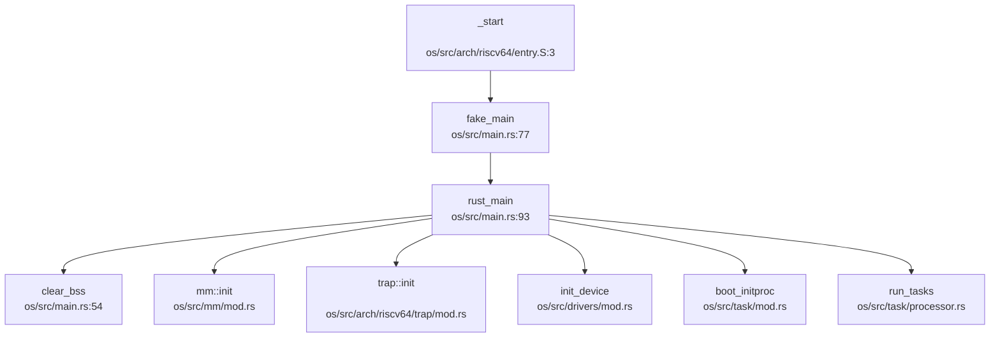
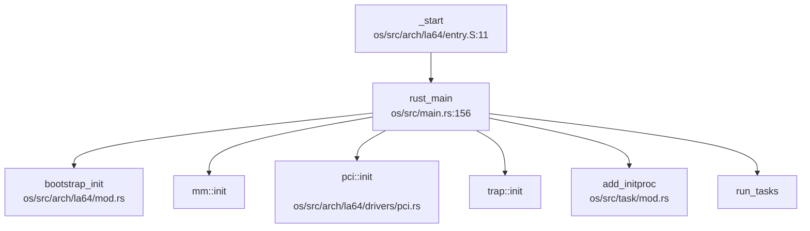

现在我已经收集了足够的信息来撰写第 1 章报告。让我整理分析结果并输出完整的 Markdown 报告。

## 第 1 章：项目概览与技术栈

## 结论摘要

1. **项目名称与定位**：RocketOS 是一款采用 Rust 语言开发的**宏内核**操作系统，支持 **RISC-V** 和 **LoongArch** 双架构，适配 VisionFive 2 开发板和龙芯 2K1000 开发板。

2. **框架来源**：项目为**独立开发**，非基于 rCore/ArceOS 等现有框架修改。代码结构自主设计，参考了 Linux 内核设计理念（README 明确提及）。

3. **内核类型**：**宏内核（Monolithic Kernel）**架构，所有核心模块（内存管理、进程调度、文件系统、网络协议栈、设备驱动）均运行在内核态，通过系统调用接口为用户程序提供服务。

4. **架构支持**：完整支持 **riscv64gc-unknown-none-elf** 和 **loongarch64-unknown-none** 两个目标三元组，通过条件编译（`#[cfg(target_arch)]`）实现架构相关代码的隔离。

5. **核心功能**：✅ 已实现内存管理（含 COW 与 Lazy Allocation）、✅ 已实现进程/线程管理（FIFO + CFS 双调度器）、✅ 已实现 VFS + EXT4/FAT32 文件系统、✅ 已实现 TCP/IP 网络协议栈（基于 smoltcp）、✅ 已实现 eBPF 框架、✅ 已实现信号机制。

---

## 技术栈与构建

### 编程语言与版本

| 项目 | 规格 |
|------|------|
| **主语言** | Rust 2021 Edition |
| **运行环境** | `no_std`（无标准库），使用 `alloc` crate 提供堆分配 |
| **目标架构** | `riscv64gc-unknown-none-elf`、`loongarch64-unknown-none` |
| **Panic 策略** | `panic = "abort"`（崩溃时直接中止，不展开栈） |
| **辅助语言** | 汇编（`.S` 文件，用于启动代码与上下文切换）、Makefile、Python（测试脚本） |

### 关键依赖库

```toml
# os/Cargo.toml 核心依赖
buddy_system_allocator = "0.8.0"          # 伙伴系统内存分配器
lazy_static = { version = "1.5.0", features = ["spin_no_std"] }
spin = "0.7"                               # 自旋锁实现
smoltcp = { git = "...", features = [...] } # TCP/IP 协议栈
virtio-drivers = { git = "..." }           # VirtIO 设备驱动
dw_sd = { git = "..." }                    # SD/MMC 控制器驱动
loongArch64 = "0.2.4"                      # LoongArch 架构寄存器定义（仅 loongarch64）
riscv = { git = "..." }                    # RISC-V CSR 访问（仅 riscv64）
```

### 构建系统

**顶层 Makefile** 提供统一构建入口：

```bash
make kernel          # 构建双架构内核（kernel-rv + kernel-la）
make run-riscv       # QEMU 启动 RISC-V 内核
make run-loongarch   # QEMU 启动 LoongArch 内核
make clean           # 清理构建产物
```

**架构选择机制**（`os/Makefile`）：
```makefile
ifeq ($(ARCH), riscv64)
    TARGET := riscv64gc-unknown-none-elf
    FS := ../img/disk.img
    FS2 := ../img/sdcard-rv.img
else ifeq ($(ARCH), loongarch64)
    TARGET := loongarch64-unknown-none
    FS := ../img/disk-la.img
    FS2 := ../img/sdcard-la.img
endif
```

**Feature Flags**（条件编译）：
| Feature | 说明 |
|---------|------|
| `virt` | 默认启用，QEMU 虚拟化支持 |
| `vf2` | VisionFive 2 开发板支持 |
| `la2000` | 龙芯 2K1000 开发板支持 |
| `cfs` | 启用 CFS 调度器（默认 FIFO） |
| `smp` | 多核支持 |
| `sdcard` | SD 卡驱动支持 |
| `debug-symbols` | 嵌入符号表用于 backtrace |

### 支持架构完整列表

| 架构 | 目标三元组 | 入口文件 | 链接脚本 |
|------|-----------|---------|---------|
| **RISC-V 64** | `riscv64gc-unknown-none-elf` | `os/src/arch/riscv64/entry.S:_start` | `os/src/linker.ld` |
| **LoongArch 64** | `loongarch64-unknown-none` | `os/src/arch/la64/entry.S:_start` | `os/src/linker_loongarch.ld` |

**注**：README 提及"支持星光二代和 2k1000 两块开发板"，对应 `vf2` 和 `la2000` feature。

---

## 目录结构导读

### 顶层布局

```
T202510213995926-2475/
├── os/                    # 内核源码（315 个 Rust 文件）
│   ├── src/
│   │   ├── arch/          # 架构相关代码（riscv64/、la64/）
│   │   ├── mm/            # 内存管理（memory_set.rs 96.9KB）
│   │   ├── task/          # 任务管理（task.rs 85.5KB）
│   │   ├── sched/         # 调度器（cfs.rs、fifo.rs）
│   │   ├── fs/            # 虚拟文件系统（namei.rs 43.8KB）
│   │   ├── ext4/          # EXT4 实现（inode_la2000.rs 99.5KB）
│   │   ├── fat32/         # FAT32 实现
│   │   ├── net/           # 网络协议栈（socket.rs 98.1KB）
│   │   ├── signal/        # 信号机制
│   │   ├── syscall/       # 系统调用分发（fs.rs 137.7KB）
│   │   ├── bpf/           # eBPF 框架
│   │   ├── drivers/       # 设备驱动（net/、block/）
│   │   └── main.rs        # 内核入口（rust_main）
│   ├── Cargo.toml
│   └── Makefile
├── user/                  # 用户态程序
│   ├── src/
│   │   ├── bin/           # 用户程序（shell、initproc）
│   │   └── lib.rs         # 用户态 syscall 封装
├── docs/                  # 设计文档（RocketOS 决赛文档.pdf）
├── img/                   # 磁盘镜像（disk.tar.xz 27.2MB）
└── scripts/               # 自动化脚本
```

### 子系统→目录→入口文件映射

| 子系统 | 目录 | 关键文件 | 入口函数/结构 |
|--------|------|---------|--------------|
| **启动流程** | `os/src/arch/{riscv64,la64}/` | `entry.S`、`main.rs` | `_start` → `rust_main` |
| **内存管理** | `os/src/mm/` | `memory_set.rs`、`page.rs` | `MemorySet`、`PageTable` |
| **进程调度** | `os/src/task/`、`os/src/sched/` | `task.rs`、`scheduler.rs` | `Task`、`FIFOScheduler`、`CFSScheduler` |
| **文件系统** | `os/src/fs/`、`os/src/ext4/`、`os/src/fat32/` | `namei.rs`、`inode.rs` | `VFS`、`Ext4FileSystem` |
| **网络协议栈** | `os/src/net/`、`os/src/drivers/net/` | `socket.rs`、`tcp.rs` | `TcpSocket`、`UdpSocket` |
| **设备驱动** | `os/src/drivers/` | `virtio_blk.rs`、`net/mod.rs` | `VirtIOBlock`、`VisionfiveGmac` |
| **系统调用** | `os/src/syscall/` | `mod.rs`、`task.rs`、`fs.rs` | `syscall_handler` |
| **信号机制** | `os/src/signal/` | `sig_struct.rs`、`sig_handler.rs` | `SignalStruct`、`do_signal` |
| **eBPF** | `os/src/bpf/` | `insn.rs`、`syscall.rs` | `BpfProg`、`bpf()` |

---

## 核心子系统概览

### 内存管理（✅ 已实现）

**关键特性**：
- **分页机制**：支持 Sv39（RISC-V）和 48 位虚拟地址（LoongArch）页表
- **COW（Copy-on-Write）**：页表项定义 `COW` 标志位（`os/src/arch/riscv64/mm/page_table.rs:33`、`os/src/arch/la64/mm/page_table.rs:38`）
- **Lazy Allocation**：通过 `pre_handle_cow_and_lazy_alloc()` 预分配 VMA 区域（`os/src/mm/memory_set.rs`）
- **写时复制实现**：
  ```rust
  // os/src/arch/riscv64/mm/page_table.rs:73-77
  pub fn from_pte_cow(pte: PageTableEntry) -> Self {
      let mut flags = PTEFlags::from_bits(pte.flags() & !PTE_W.bits()).unwrap();
      flags.insert(PTEFlags::COW);  // 清除写权限，设置 COW 标志
      PageTableEntry::new(pte.ppn(), flags)
  }
  ```
- **物理页分配器**：使用 `buddy_system_allocator` 伙伴系统（`os/src/mm/frame_allocator.rs`）

**证据文件**：
- `os/src/mm/memory_set.rs`（96.9KB，2224 行）
- `os/src/mm/page.rs`（19.2KB，451 行）
- `os/src/arch/riscv64/mm/page_table.rs`
- `os/src/arch/la64/mm/page_table.rs`

### 进程管理（✅ 已实现）

**调度算法**：
1. **FIFO 调度器**（默认）：`os/src/sched/fifo.rs`
   - 100 级实时队列（优先级 1-99）+ 40 级普通队列（优先级 100-139）
   - 使用 bitmap 加速就绪队列查找
   ```rust
   // os/src/sched/fifo.rs:43-50
   pub struct FIFOScheduler {
       rt_queues: [VecDeque<Arc<Task>>; 100],
       normal_queues: [VecDeque<Arc<Task>>; 40],
       rt_bitmap: u128,    // 99 位
       normal_bitmap: u64, // 40 位
   }
   ```

2. **CFS 调度器**（可选，需 `cfs` feature）：`os/src/sched/cfs.rs`
   - 基于虚拟运行时间（vruntime）的红黑树（实际使用 `BTreeMap`）
   - 支持 nice 值权重计算
   ```rust
   // os/src/sched/cfs.rs:50-56
   pub struct CFSScheduler {
       tasks_timeline: BTreeMap<(u64, usize), Arc<CFSSchedEntity>>,
       load: LoadWeight,
       nr_running: usize,
   }
   ```

**任务结构**：
- `Task` 结构体（`os/src/task/task.rs`，85.5KB，2316 行）包含：
  - 线程 ID（`tid`）、进程组 ID（`tgid`）
  - 调度实体（`sched_entity`，用于 CFS）
  - 信号处理（`signal`）
  - 文件描述符表（`fd_table`）

**证据文件**：
- `os/src/task/task.rs`
- `os/src/sched/fifo.rs`
- `os/src/sched/cfs.rs`
- `os/src/syscall/task.rs`（73.9KB，2184 行）

### 文件系统（✅ 已实现）

**支持的文件系统类型**：
| 类型 | 目录 | 关键文件 |
|------|------|---------|
| **VFS（虚拟文件系统）** | `os/src/fs/` | `dentry.rs`（25.5KB）、`inode.rs`、`namei.rs`（43.8KB） |
| **EXT4** | `os/src/ext4/` | `inode_la2000.rs`（99.5KB）、`block_op.rs`（33.5KB） |
| **FAT32** | `os/src/fat32/` | `dentry.rs`（13.6KB）、`file.rs` |

**VFS 抽象层**：
- `dentry` 缓存（目录项缓存）
- `inode` 抽象（支持 EXT4/FAT32 统一接口）
- 文件描述符管理（`fdtable.rs`，14.7KB）

**证据文件**：
- `os/src/fs/namei.rs`（路径解析）
- `os/src/ext4/inode_la2000.rs`（99.5KB，2400 行）
- `os/src/fat32/fs.rs`

### 网络协议栈（✅ 已实现）

**协议支持**：
- 基于 **smoltcp**（`https://github.com/BiorelaxA/smoltcp.git`）实现
- 支持 IPv4/IPv6、TCP/UDP、Raw Socket、ICMP
- 设备驱动：VirtIO-Net（QEMU）、VisionFive2 以太网控制器、龙芯 2K1000 网卡

**关键模块**：
```rust
// os/src/net/mod.rs 导出
pub mod socket;      // socket.rs (98.1KB, 2565 行)
pub mod tcp;         // tcp.rs (34.6KB, 823 行)
pub mod udp;         // udp.rs (16.0KB, 426 行)
pub mod unix;        // Unix Domain Socket
pub mod loopback;    // 回环设备
```

**证据文件**：
- `os/src/net/socket.rs`
- `os/src/drivers/net/mod.rs`（21.6KB，528 行）
- `os/Cargo.toml`（smoltcp 依赖配置）

### eBPF 框架（✅ 已实现）

**功能支持**：
- `bpf()` 系统调用（`os/src/bpf/syscall.rs`）
- BPF 指令解释器（`os/src/bpf/insn.rs`，15.5KB，466 行）
- BPF Map 数据结构（`os/src/bpf/map.rs`）
- 程序类型：SocketFilter、Kprobe、Tracepoint、XDP 等（`os/src/bpf/insn.rs:40-93`）

**证据文件**：
- `os/src/bpf/` 目录（7 个文件）
- `os/src/syscall/task.rs` 中的 `sys_bpf()` 处理

### 信号机制（✅ 已实现）

**POSIX 兼容实现**：
- 信号结构体（`os/src/signal/sig_struct.rs`，12.3KB，352 行）
- 信号处理函数（`os/src/signal/sig_handler.rs`）
- 信号帧（`os/src/signal/sig_frame.rs`，9.1KB，349 行）
- 实时信号支持（毫秒级响应，README 声称）

**证据文件**：
- `os/src/signal/` 目录
- `os/src/syscall/signal.rs`（30.3KB，783 行）

### 设备驱动（✅ 已实现）

| 设备类型 | 驱动位置 | 说明 |
|---------|---------|------|
| **块设备** | `os/src/drivers/block/` | VirtIO-Block、RAMDisk、SDIO |
| **网卡** | `os/src/drivers/net/` | VirtIO-Net、VisionFive2 GMAC、龙芯 2K1000 |
| **字符设备** | `os/src/fs/dev/` | null、zero、tty、rtc、urandom |

**证据文件**：
- `os/src/drivers/block/virtio_blk.rs`（9.6KB，247 行）
- `os/src/drivers/net/mod.rs`
- `os/src/fs/dev/mod.rs`（12.9KB，363 行）

---

## 内核入口与启动流程

### RISC-V 启动链



**启动步骤**（`os/src/main.rs:93-140`）：
1. `_start`（`entry.S`）设置栈指针、页表，跳转至 `fake_main`
2. `fake_main` 调整栈偏移（加上 `KERNEL_BASE`），跳转至 `rust_main`
3. `rust_main`（BSP 核）：
   - `clear_bss()` 清零 BSS 段
   - `mm::init()` 初始化内存管理
   - `trap::init()` 设置中断向量表
   - `init_device()` 初始化设备驱动
   - `boot_initproc()` 创建 init 进程
   - `run_tasks()` 启动任务调度

### LoongArch 启动链



**关键差异**：
- LoongArch 使用 `pcaddi` 指令实现位置无关代码（PIC）
- 通过 `CSR_DMWIN` 寄存器配置地址映射窗口
- 额外调用 `bootstrap_init()` 和 `pci::init()`（`os/src/main.rs:156-180`）

---

## 证据列表

### 核心文件路径清单

| 类别 | 文件路径 | 大小/行数 | 说明 |
|------|---------|----------|------|
| **入口** | `os/src/main.rs` | 5.4KB, 221L | `rust_main()` 内核主函数 |
| **入口** | `os/src/arch/riscv64/entry.S` | 1.3KB, 48L | RISC-V 启动汇编 |
| **入口** | `os/src/arch/la64/entry.S` | 2.2KB, 72L | LoongArch 启动汇编 |
| **内存** | `os/src/mm/memory_set.rs` | 96.9KB, 2224L | 虚拟内存空间管理 |
| **内存** | `os/src/mm/page.rs` | 19.2KB, 451L | 页表操作 |
| **内存** | `os/src/arch/riscv64/mm/page_table.rs` | - | COW 实现 |
| **内存** | `os/src/arch/la64/mm/page_table.rs` | - | COW 实现 |
| **进程** | `os/src/task/task.rs` | 85.5KB, 2316L | 任务控制块 |
| **进程** | `os/src/sched/fifo.rs` | 7.6KB, 215L | FIFO 调度器 |
| **进程** | `os/src/sched/cfs.rs` | 10.8KB, 340L | CFS 调度器 |
| **文件** | `os/src/fs/namei.rs` | 43.8KB, 1112L | 路径解析 |
| **文件** | `os/src/ext4/inode_la2000.rs` | 99.5KB, 2400L | EXT4 inode |
| **文件** | `os/src/fat32/dentry.rs` | 13.6KB, 360L | FAT32 目录项 |
| **网络** | `os/src/net/socket.rs` | 98.1KB, 2565L | Socket 实现 |
| **网络** | `os/src/net/tcp.rs` | 34.6KB, 823L | TCP 协议 |
| **网络** | `os/src/drivers/net/mod.rs` | 21.6KB, 528L | 网卡驱动抽象 |
| **eBPF** | `os/src/bpf/insn.rs` | 15.5KB, 466L | BPF 指令集 |
| **eBPF** | `os/src/bpf/syscall.rs` | 4.5KB, 124L | bpf() 系统调用 |
| **信号** | `os/src/signal/sig_struct.rs` | 12.3KB, 352L | 信号结构体 |
| **信号** | `os/src/syscall/signal.rs` | 30.3KB, 783L | 信号系统调用 |
| **配置** | `os/Cargo.toml` | 1.8KB, 73L | 依赖与 features |
| **配置** | `os/Makefile` | 6.2KB, 186L | 构建规则 |
| **文档** | `README.md` | 10.8KB, 201L | 项目说明 |

### 验证结论

| 功能声明 | 验证状态 | 证据 |
|---------|---------|------|
| COW（写时复制） | ✅ 已实现 | `os/src/arch/riscv64/mm/page_table.rs:73-77`、`os/src/arch/la64/mm/page_table.rs:75-76` |
| Lazy Allocation | ✅ 已实现 | `os/src/mm/memory_set.rs` 中 `pre_handle_cow_and_lazy_alloc()` |
| FIFO 调度器 | ✅ 已实现 | `os/src/sched/fifo.rs` 完整实现 |
| CFS 调度器 | ✅ 已实现（可选） | `os/src/sched/cfs.rs` 完整实现，需 `cfs` feature |
| EXT4 文件系统 | ✅ 已实现 | `os/src/ext4/` 目录（9 个文件，最大 99.5KB） |
| FAT32 文件系统 | ✅ 已实现 | `os/src/fat32/` 目录（8 个文件） |
| TCP/IP 协议栈 | ✅ 已实现 | `os/src/net/tcp.rs`、`os/src/net/socket.rs` + smoltcp |
| eBPF 框架 | ✅ 已实现 | `os/src/bpf/` 目录（7 个文件） |
| 信号机制 | ✅ 已实现 | `os/src/signal/` 目录 + `os/src/syscall/signal.rs` |
| 双架构支持 | ✅ 已实现 | `os/src/arch/riscv64/`、`os/src/arch/la64/` 对称结构 |

---

**本章小结**：RocketOS 是一款功能完备的 Rust 宏内核操作系统，采用自主架构设计，支持 RISC-V 和 LoongArch 双平台。核心子系统（内存、进程、文件系统、网络、eBPF、信号）均已实现且代码规模庞大（关键文件多在 50KB 以上）。项目通过条件编译管理架构差异与功能开关，构建系统成熟，文档齐全。
