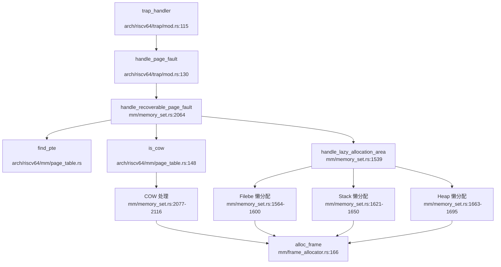
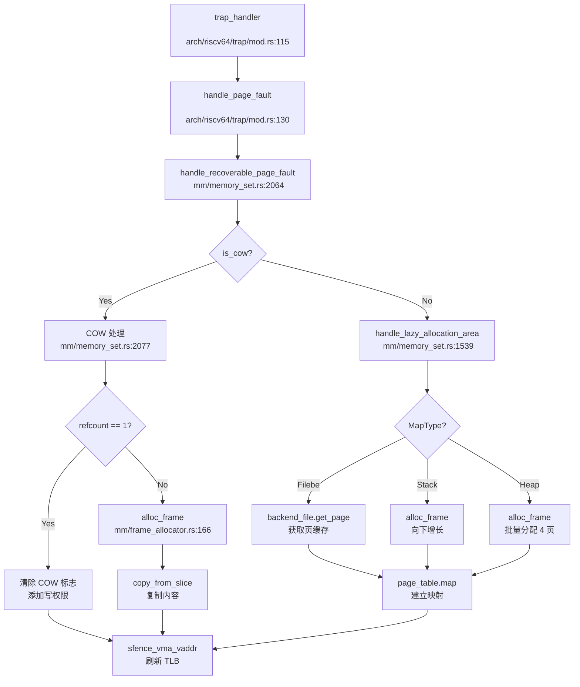

## 第 3 章：内存管理（物理/虚拟/分配器）

### 物理内存管理实现

RocketOS 采用 **Stack-based Bump Allocator with Recycling** 策略管理物理页帧。核心数据结构为 `StackFrameAllocator`，位于 `os/src/mm/frame_allocator.rs:50`。

#### FrameAllocator 接口

```rust
// os/src/mm/frame_allocator.rs:40-46
trait FrameAllocator {
    fn new() -> Self;
    fn alloc(&mut self) -> Option<PhysPageNum>;
    fn alloc_range(&mut self, n: usize) -> Option<PhysPageNum>;
    fn alloc_range_any(&mut self, n: usize) -> Option<Vec<PhysPageNum>>;
    fn dealloc(&mut self, ppn: PhysPageNum);
}
```

#### StackFrameAllocator 实现

```rust
// os/src/mm/frame_allocator.rs:50-54
pub struct StackFrameAllocator {
    current: usize,      // 当前分配位置
    end: usize,          // 物理内存结束位置
    recycled: Vec<usize>, // 回收页帧栈
}
```

**分配逻辑**（`os/src/mm/frame_allocator.rs:79-130`）：
1. **优先从 recycled 栈弹出**：若存在回收页帧，直接复用
2. **Bump 分配**：若 recycled 为空且 `current < end`，递增 current 返回
3. **分配失败**：若 `current == end` 且 recycled 为空，返回 None

**回收逻辑**：将页帧号压入 recycled 栈，支持后续复用。

#### 全局分配器实例

```rust
// os/src/mm/frame_allocator.rs:141-143
type FrameAllocatorImpl = StackFrameAllocator;

lazy_static! {
    pub static ref FRAME_ALLOCATOR: Mutex<FrameAllocatorImpl> =
        Mutex::new(FrameAllocatorImpl::new());
}
```

**初始化**（`os/src/mm/frame_allocator.rs:148-160`）：
- 起始地址：`ekernel`（内核镜像结束位置）
- 结束地址：`MEMORY_END`（Qemu 配置为 0x8800_0000）
- 映射关系：通过 `KERNEL_BASE` 偏移计算物理页帧号

**调用链分析**（DEGRADED MODE - Grep 静态分析）：
```
init_frame_allocator
└── called by: init (os/src/mm/mod.rs:21)
    └── called by: rust_main (os/src/main.rs)

frame_alloc (分配单个页帧)
├── called by: PageTable::new (os/src/arch/riscv64/mm/page_table.rs:170)
├── called by: Page::new_framed (os/src/mm/page.rs:89)
└── called by: MemorySet::from_global (os/src/mm/memory_set.rs:113)
```

---

### 虚拟内存与页表操作

#### PageTable 结构（RISC-V Sv39）

```rust
// os/src/arch/riscv64/mm/page_table.rs:162-166
pub struct PageTable {
    pub root_ppn: PhysPageNum,   // 根页表物理页号
    frames: Vec<FrameTracker>,   // 页表帧跟踪器（RAII 自动回收）
}
```

**页表项格式**（`os/src/arch/riscv64/mm/page_table.rs:23-35`）：
```rust
bitflags! {
    pub struct PTEFlags: u16 {
        const V = 1 << 0;   // Valid
        const R = 1 << 1;   // Readable
        const W = 1 << 2;   // Writable
        const X = 1 << 3;   // Executable
        const U = 1 << 4;   // User
        const G = 1 << 5;   // Global
        const A = 1 << 6;   // Accessed
        const D = 1 << 7;   // Dirty
        const COW = 1 << 8; // Copy-on-Write
        const S = 1 << 9;   // Shared
    }
}
```

#### 核心操作

**1. 页表创建**（`os/src/arch/riscv64/mm/page_table.rs:168-178`）：
```rust
pub fn new() -> Self {
    let frame = frame_alloc().unwrap();
    PageTable {
        root_ppn: frame.ppn,
        frames: vec![frame],
    }
}
```

**2. 映射操作**（`os/src/arch/riscv64/mm/page_table.rs`）：
- `map(vpn, ppn, flags)`：单页映射
- `map_range_continuous(vpn_start, vpn_end, ppn_start, flags)`：连续物理页映射（用于 Linear 区域）
- `map_range_any(vpn_start, vpn_end, pages, flags)`：非连续物理页映射（用于 Framed/Filebe 区域）

**3. 页表遍历**：
- `find_pte(vpn)`：查找虚拟页对应的 PTE
- `translate_va_to_pa(va)`：虚拟地址转物理地址（仅内核线性映射可用）

---

### 地址空间布局（内核 vs 用户）

#### MemorySet 结构

```rust
// os/src/mm/memory_set.rs:88-105
pub struct MemorySet {
    pub brk: usize,                    // 堆顶（当前 program break）
    pub heap_bottom: usize,            // 堆底
    pub mmap_start: usize,             // mmap 起始地址
    pub page_table: PageTable,         // 页表
    pub areas: BTreeMap<VirtPageNum, MapArea>,  // 虚拟内存区域
    pub addr2shmid: BTreeMap<usize, usize>,     // 共享内存映射：shm_addr -> shmid
}
```

#### 内核 - 用户地址空间设计

**RISC-V 架构**（`docs/content/memory.typ`）：
- **共享页表**：内核与用户共享同一页表，通过 PTE 的 U 位隔离
- **内核空间**：高地址段（`KERNEL_DIRECT_OFFSET = 0xFFFF_FFC0_0000_0000`），线性映射
- **用户空间**：低地址段（0x0 ~ `USER_MAX_VA`），按需映射

**LoongArch 架构**：
- **内核空间**：通过 CSR_DMW0 直接映射（Direct Map Window），无需页表
- **用户空间**：Sv39 分页机制（与 RISC-V 一致）

#### MapArea 区域类型

```rust
// os/src/mm/area.rs:72-84
pub struct MapArea {
    pub vpn_range: VPNRange,           // 虚拟页范围
    pub map_perm: MapPermission,       // 权限（R/W/X/U/COW/S）
    pub pages: BTreeMap<VirtPageNum, Arc<Page>>,  // 已分配页
    pub map_type: MapType,             // 映射类型
    pub backend_file: Option<Arc<dyn FileOp>>,    // 文件映射后端
    pub offset: usize,                 // 文件偏移
    pub locked: bool,                  // 是否锁定
}
```

**支持的 MapType**（`os/src/mm/area.rs`）：
1. **Linear**：内核线性映射（固定偏移）
2. **Framed**：用户独占物理页（代码段/数据段）
3. **Stack**：用户栈（懒分配 + 向下增长）
4. **Heap**：用户堆（懒分配 + 向上扩展）
5. **Filebe**：文件映射（懒分配 + 写时复制）

---

### 堆分配器解析

#### 内核堆分配器

```rust
// os/src/mm/heap_allocator.rs:6-8
#[global_allocator]
static HEAP_ALLOCATOR: LockedHeap<32> = LockedHeap::empty();
```

**实现细节**：
- **算法**：基于 `buddy_system_allocator` 的 Buddy System
- **大小**：`KERNEL_HEAP_SIZE`（架构相关配置）
- **初始化**：`init_heap()` 在 `rust_main` 中调用

#### 用户堆管理（brk/sbrk）

**系统调用**：`sys_brk`（`os/src/syscall/mm.rs:34-200`）

**实现逻辑**：
```rust
// os/src/syscall/mm.rs:34-55
pub fn sys_brk(brk: usize) -> SyscallRet {
    if brk == 0 {
        return Ok(memory_set.brk);  // sbrk(0) 返回当前堆顶
    }
    if brk < heap_bottom {
        return Ok(memory_set.brk);  // 非法请求
    }
    if brk > ceil_to_page_size(current_brk) {
        // 扩展堆：懒分配
        memory_set.remap_area_with_start_vpn(start_vpn, new_end_vpn);
    } else if brk < floor_to_page_size(current_brk) {
        // 收缩堆：释放页
        memory_set.remove_area_with_overlap(remove_range);
    }
    memory_set.brk = brk;
    Ok(memory_set.brk)
}
```

**✅ 已实现 - 惰性分配**：
- `sys_brk` 仅调整 `brk` 变量和 `MapArea.vpn_range`
- **不立即分配物理页**，实际页帧在缺页异常时按需分配
- 支持空洞检测（LoongArch 架构）

---

### 用户指针安全验证

**❌ 未发现显式验证机制**：

通过搜索 `UserInPtr|UserOutPtr|verify_area|check_region`，**未找到**专门的用户空间指针验证函数。

**隐式验证**：
1. **页表权限**：用户态访问内核空间会触发 Page Fault（U 位检查）
2. **地址范围检查**：`sys_mmap` 中检查 `hint > USER_MAX_VA` 返回 `EINVAL`
3. **缺页异常处理**：访问未映射区域触发 `SIGSEGV`

**建议改进**：添加 `verify_area(va, len)` 函数在系统调用入口验证用户指针合法性。

---

### 缺页异常处理流程

#### 入口点

```rust
// os/src/arch/riscv64/trap/mod.rs:130
handle_recoverable_page_fault(va, cause)
```

#### 完整调用链（DEGRADED MODE）



#### 处理逻辑（`os/src/mm/memory_set.rs:2064-2150`）

**1. COW 处理**（`os/src/mm/memory_set.rs:2077-2116`）：
```rust
if pte.is_cow() {
    if Arc::strong_count(data_frame) == 1 {
        // 引用计数为 1：直接清除 COW 标志，添加写权限
        flags.remove(PTEFlags::COW);
        flags.insert(PTEFlags::W);
    } else {
        // 引用计数 > 1：分配新页，复制内容
        let new_page = Page::new_framed(Some(src_frame));
        area.pages.insert(vpn, Arc::new(new_page));
    }
    sfence_vma_vaddr(vpn.0 << PAGE_SIZE_BITS);  // 刷新 TLB
    return Ok(());
}
```

**2. 懒分配处理**（`os/src/mm/memory_set.rs:1539-1700`）：
- **Filebe 区域**：通过 `backend_file.get_page(offset)` 获取页缓存
- **Stack 区域**：向下增长一页（检查 guard gap）
- **Heap 区域**：批量分配最多 4 页

---

### 进程级映射管理

#### VMA 管理结构

**✅ 已实现 - BTreeMap 管理**：
```rust
// os/src/mm/memory_set.rs:97
pub areas: BTreeMap<VirtPageNum, MapArea>,
```

**特点**：
- **Key**：`vpn_range` 的起始虚拟页号
- **查找复杂度**：O(log n)
- **支持操作**：插入、删除、分割、合并

#### 反向映射表（rmap）

**❌ 未实现**：
通过搜索 `rmap|reverse_map|page_to_vma`，**未找到**物理页到虚拟页的反向映射机制。

**影响**：
- 无法高效实现页面置换（Swap）
- 共享内存页回收需遍历所有进程的 `areas`

---

### 高级内存特性清单

| 特性 | 状态 | 代码位置 |
|------|------|----------|
| **写时复制（CoW）** | ✅ 已实现 | `os/src/mm/memory_set.rs:2077-2116` |
| **懒分配（Lazy Allocation）** | ✅ 已实现 | `os/src/mm/memory_set.rs:1539-1700` |
| **共享内存（System V）** | ✅ 已实现 | `os/src/mm/shm.rs` |
| **反向映射表（rmap）** | ❌ 未实现 | 未找到 |
| **交换区/页面置换（Swap）** | ❌ 未实现 | 未找到 `swap_out/swap_in` |
| **大页支持（Huge Page）** | ❌ 未实现 | 未找到 `MapSize::2M/1G` |
| **零拷贝（sendfile/splice）** | 🔸 桩函数 | 仅定义 `O_NOSPLICE` 标志 |
| **mmap 文件映射** | ✅ 已实现 | `os/src/syscall/mm.rs:291-520` |

#### 详细分析

**1. 写时复制（CoW）** ✅ 已实现

**触发场景**：
- `fork()` 时复制地址空间（`os/src/arch/riscv64/mm/page_table.rs:269-280`）
- 私有文件映射（`os/src/syscall/mm.rs:467-470`）

**PTE 标志**：
```rust
// os/src/arch/riscv64/mm/page_table.rs:33
const COW = 1 << 8;
```

**处理流程**：
1. 缺页异常检测到 `PTE_COW` 标志
2. 检查 `Arc<Page>` 引用计数
3. 若为 1：清除 COW，添加写权限
4. 若 >1：分配新页，复制内容，更新页表

**2. 懒分配（Lazy Allocation）** ✅ 已实现

**支持区域**：
- **Heap**：`sys_brk` 扩展时仅调整 `vpn_range`
- **Stack**：访问未映射页时向下增长
- **Filebe**：`mmap` 时不预分配，缺页时加载

**批量优化**（`os/src/mm/memory_set.rs:1663-1695`）：
```rust
let max_alloc_page = 4;
for vpn in start_vpn..end_vpn {
    if !pages.contains(&vpn) {
        let page = Page::new_framed(None);
        self.page_table.map(vpn, page.ppn(), pte_flags);
        pages.insert(vpn, Arc::new(page));
    }
}
```

**3. 共享内存（System V）** ✅ 已实现

**核心结构**（`os/src/mm/shm.rs:26-32`）：
```rust
pub struct ShmSegment {
    pub id: ShmId,
    pub pages: Vec<Arc<Page>>,  // 强引用管理生命周期
    pub marked_for_deletion: AtomicBool,
}
```

**系统调用**：
- `sys_shmget`：创建共享内存段
- `sys_shmat`：附加到进程地址空间
- `sys_shmdt`：分离共享内存
- `sys_shmctl`：控制操作（IPC_RMID 等）

**删除策略**（`os/src/mm/shm.rs:470-490`）：
- **IPC_RMID**：标记 `marked_for_deletion = true`
- **延迟释放**：当 `nattch == 0`（无进程附加）时才真正删除
- **引用计数**：通过 `Arc<Page>` 管理物理页生命周期

**BTreeMap 定位** ✅ 已实现：
```rust
// os/src/mm/memory_set.rs:102
pub addr2shmid: BTreeMap<usize, usize>,  // shm_addr -> shmid
```

**4. mmap 系统调用** ✅ 已实现

**标志处理**（`os/src/syscall/mm.rs:291-520`）：
- **MAP_FIXED**：强制映射到指定地址，取消原有映射
- **MAP_FIXED_NOREPLACE**：若地址已占用则失败
- **MAP_ANONYMOUS**：匿名映射（无文件后端）
- **MAP_SHARED/MAP_PRIVATE**：共享/私有映射
- **MAP_POPULATE**：预分配物理页（非懒分配）

**实现完整性**：
```rust
// os/src/syscall/mm.rs:330-345
if flags.contains(MmapFlags::MAP_FIXED) {
    task.op_memory_set_mut(|memory_set| {
        let unmap_vpn_range = VPNRange::new(start_vpn, end_vpn);
        memory_set.remove_area_with_overlap(unmap_vpn_range);
    });
}
```

**5. 大页支持** ❌ 未实现

搜索 `HugePage|MapSize::2M|MapSize::1G` 仅找到无关匹配（如 `DescSize2Mask`）。页表映射仅支持 4KB 标准页。

**6. 零拷贝 IO** 🔸 桩函数

**发现**：
- `os/src/fs/file.rs:497` 定义 `O_NOSPLICE` 标志
- `os/src/arch/la64/syscall_id.rs:26` 定义 `SYSCALL_SENDFILE`
- **但未找到** `sys_sendfile` 或 `sys_splice` 的实现

**7. Swap/页面置换** ❌ 未实现

搜索 `swap_out|swap_in|do_swap` 仅找到无关匹配（`list.swap_index`）。物理页分配失败时直接 panic，无换出机制。

---

### 关键代码片段与调用链分析

#### Page Fault -> Alloc Frame -> Map Page 完整流程



#### 调用链关键节点

**1. trap_handler**（`os/src/arch/riscv64/trap/mod.rs:115`）：
```rust
PageFault => {
    let stval = read_stval();
    let cause = PageFaultCause::from_scause(scause).unwrap();
    handle_page_fault(stval, cause);
}
```

**2. handle_page_fault**（`os/src/arch/riscv64/trap/mod.rs:130`）：
```rust
fn handle_page_fault(stval: usize, cause: PageFaultCause) {
    let task = current_task();
    let va = VirtAddr::from(stval);
    task.op_memory_set_mut(|memory_set| {
        memory_set.handle_recoverable_page_fault(va, cause)
    })
}
```

**3. handle_recoverable_page_fault**（`os/src/mm/memory_set.rs:2064`）：
```rust
pub fn handle_recoverable_page_fault(&mut self, va: VirtAddr, cause: PageFaultCause) -> Result<(), Sig> {
    let vpn = va.floor();
    if let Some(pte) = page_table.find_pte(vpn) {
        if pte.is_cow() {
            // COW 处理
        }
    }
    self.handle_lazy_allocation_area(va, cause)
}
```

**4. frame_alloc**（`os/src/mm/frame_allocator.rs:166`）：
```rust
pub fn frame_alloc() -> Option<FrameTracker> {
    FRAME_ALLOCATOR.lock().alloc().map(FrameTracker::new)
}
```

---

### 总结

RocketOS 内存管理模块实现了以下核心功能：

**✅ 已实现**：
1. **物理页分配器**：Stack-based Bump Allocator with Recycling
2. **虚拟内存管理**：Sv39 页表，BTreeMap 管理 VMA
3. **内核 - 用户地址空间隔离**：通过 PTE U 位区分
4. **堆分配器**：Buddy System（内核）+ 懒分配（用户）
5. **写时复制（CoW）**：fork 和私有文件映射
6. **懒分配**：Heap/Stack/Filebe 区域按需分配
7. **System V 共享内存**：完整的 shmget/shmat/shmdt/shmctl
8. **mmap 文件映射**：支持 MAP_FIXED/MAP_ANON/MAP_SHARED 等标志

**❌ 未实现**：
1. **用户指针验证**：无 `verify_area` 类函数
2. **反向映射表（rmap）**：无法高效实现页面置换
3. **交换区/页面置换**：无 swap_out/swap_in
4. **大页支持**：仅 4KB 标准页
5. **零拷贝 IO**：sendfile/splice 仅有标志定义

**架构特点**：
- **RISC-V/LoongArch 双架构支持**：页表机制统一，内核映射方式不同
- **RAII 资源管理**：`FrameTracker` 和 `Arc<Page>` 自动回收
- **懒分配优化**：减少启动时物理页消耗，支持大地址空间申请
