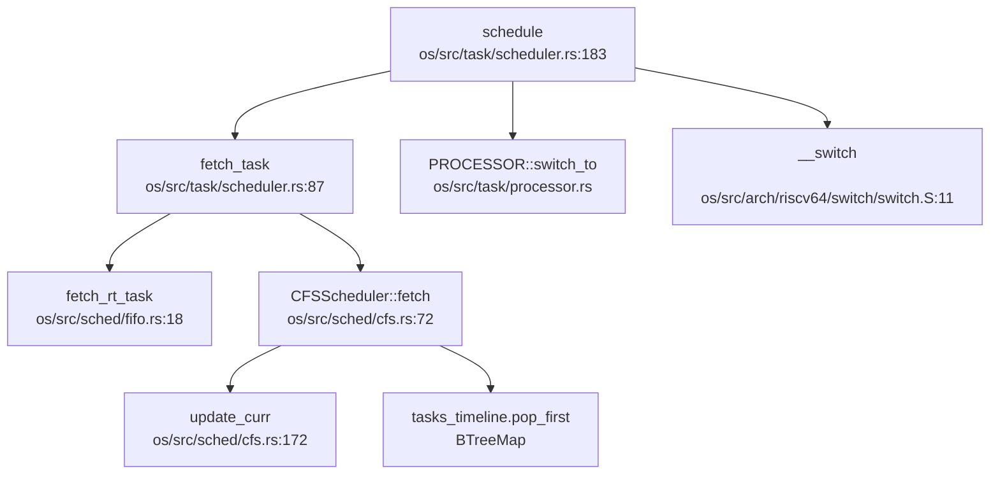
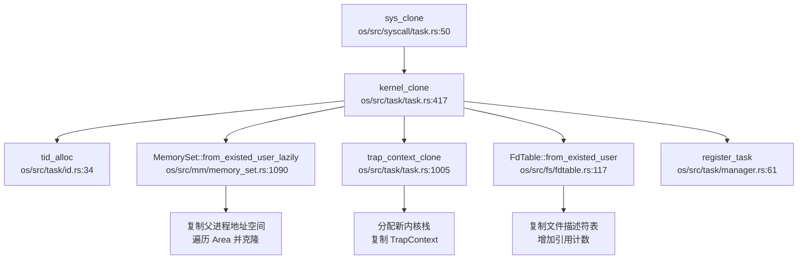
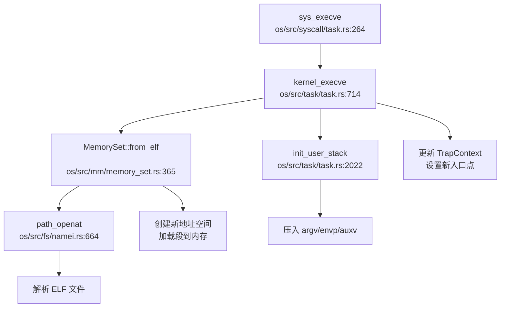

现在我已经收集了足够的信息。让我生成完整的第 4 章报告。

## 第 4 章：进程/线程与调度机制

本章深入分析 RocketOS 的任务模型、调度算法、上下文切换机制以及进程间通信实现。通过代码级别的追踪，揭示从系统调用到内核调度的完整执行链路。

---

## 任务模型与核心数据结构

### Task 结构体分析

RocketOS 采用统一的任务模型，`Task` 结构体位于 `os/src/task/task.rs:87`，同时管理进程和线程。关键字段如下：

```rust
#[repr(C)]
pub struct Task {
    // 不变量（必须保持在前两个 field）
    kstack: KernelStack,        // 内核栈
    cpu_id: usize,              // 绑定的 CPU id
    
    // 基本标识
    tid: RwLock<TidHandle>,     // 线程 ID
    tgid: AtomicUsize,          // 线程组 ID（进程 ID）
    pgid: AtomicUsize,          // 进程组 ID
    status: Mutex<TaskStatus>,  // 任务状态
    sched_prio: AtomicU32,      // 调度优先级
    
    // 进程关系
    parent: Arc<Mutex<Option<Weak<Task>>>>,         // 父任务
    children: Arc<Mutex<BTreeMap<Tid, Arc<Task>>>>, // 子任务
    thread_group: Arc<Mutex<ThreadGroup>>,          // 线程组
    
    // 内存管理
    memory_set: RwLock<Arc<RwLock<MemorySet>>>,     // 地址空间
    
    // 文件系统
    fd_table: Mutex<Arc<FdTable>>,
    root: Arc<Mutex<Arc<Path>>>,
    pwd: Arc<Mutex<Arc<Path>>>,
    
    // 信号处理
    sig_pending: Mutex<SigPending>,
    sig_handler: Arc<Mutex<SigHandler>>,
    
    // 资源限制（POSIX rlimit，16 种资源类型）
    rlimit: Arc<RwLock<[RLimit; 16]>>,
    
    // 权限设置（UID/GID）
    uid: AtomicU32, euid: AtomicU32, suid: AtomicU32, fsuid: AtomicU32,
    gid: AtomicU32, egid: AtomicU32, sgid: AtomicU32, fsgid: AtomicU32,
    
    // CFS 调度实体（条件编译）
    #[cfg(feature = "cfs")]
    sched_entity: Arc<CFSSchedEntity>,
    
    // 内部结构（低频修改字段）
    task_inner: RwLock<TaskInner>,
}
```

### TaskInner 结构体

`TaskInner` 位于 `os/src/task/task.rs:153`，包含修改频率较低的字段：

```rust
pub struct TaskInner {
    priority: u32,        // 优先级：[1-99]实时，[100-139]普通，0 空闲
    policy: u32,          // 调度策略
    tid_address: TidAddress,
    sig_stack: SigStack,  // 信号栈
    cpu_mask: CpuMask,    // CPU 亲和性掩码
}
```

### 进程与线程的区分

RocketOS **不区分 PCB 和 TCB**，统一使用 `Task` 结构体。通过以下字段区分：

- **进程**：`tgid == tid`（线程组 ID 等于自身 ID）
- **线程**：`tgid != tid`（共享同一线程组）

验证代码位于 `os/src/task/task.rs:933`：

```rust
pub fn is_process(&self) -> bool {
    self.tgid() == self.tid()
}
```

### 层次化 ID 管理

**✅ 已实现** - 进程组（PGID）和会话（Session）机制：

- **PID/TID 分配**：`os/src/task/id.rs` 使用 `IdAllocator` 实现，支持回收重用
- **PGID 规则**：进程组 ID = 组长进程的 PID（`sys_setpgid` 中当 `pgid=0` 时设置）
- **会话机制**：代码中存在 `session_id` 字段（`os/src/bpf/iter.rs:173`），但 **会话管理功能未见完整实现**，`sys_setsid` 仅返回 `tgid`

```rust
// os/src/task/manager.rs:169
pub fn new_group(task: &Arc<Task>) {
    let pgid = group_leader.pgid();  // PGID = 组长 PID
    // ... 创建进程组
}
```

---

## 调度算法与策略（代码证据）

RocketOS 实现了 **双模式调度器**，通过编译特性 `cfs` 切换。

### 1. FIFO 调度器（默认）

**文件**：`os/src/sched/fifo.rs`

**✅ 已实现** - 多级优先级队列 + 位图加速：

```rust
pub struct FIFOScheduler {
    rt_queues: [VecDeque<Arc<Task>>; 100],     // 实时队列（优先级 1-99）
    normal_queues: [VecDeque<Arc<Task>>; 40],  // 普通队列（优先级 100-139）
    rt_bitmap: u128,       // 99 位实时队列位图
    normal_bitmap: u64,    // 40 位普通队列位图
    task_index: BTreeMap<Tid, (QueueType, usize)>,
}
```

**调度策略**：
- **实时任务**：位图从高到低扫描，优先级越高（索引越大）越先执行
- **普通任务**：位图从低到高扫描，nice 值越小（索引越小）越先执行
- **时间片**：固定时间片，无动态调整

### 2. CFS 调度器（可选）

**文件**：`os/src/sched/cfs.rs`

**✅ 已实现** - 完全公平调度器（需启用 `cfs` 特性）：

```rust
pub struct CFSScheduler {
    tasks_timeline: BTreeMap<(u64, usize), Arc<CFSSchedEntity>>, // (vruntime, tid)
    load: LoadWeight,      // 总权重
    nr_running: usize,     // 运行任务数
}

pub struct CFSSchedEntity {
    tid: usize,
    load: LoadWeight,      // 权重
    vruntime: u64,         // 虚拟运行时间
    exec_start: TimeSpec,  // 开始执行时间
    slice: u64,            // 时间片
}
```

**核心算法**：
- **vruntime 计算**：`vruntime += delta_exec * (NICE_0_LOAD / weight)`
- **选择策略**：`pop_first()` 取出 vruntime 最小的任务
- **时间片计算**：`sched_slice = (SYSCTL_SCHED_LATENCY * weight) / total_weight`

### 调度器调用链分析

通过 `lsp_get_call_graph` 分析 `schedule()` 函数：



**优先级验证**：
- FIFO：`fetch()` 通过位图确保高优先级先出队
- CFS：`pop_first()` 确保 vruntime 最小（权重高者 vruntime 增长慢）优先

---

## 任务状态机

**✅ 已实现** - 六状态状态机：

```rust
// os/src/task/task.rs:2202
pub enum TaskStatus {
    Ready,          // 就绪态
    Running,        // 运行态
    UnInterruptable,// 不可中断阻塞（用于 waitpid）
    Interruptable,  // 可中断阻塞
    Zombie,         // 僵尸态
    Stopped,        // 停止态
}
```

### 状态流转图

```
                    ┌─────────────┐
                    │    Ready    │
                    └──────┬──────┘
                           │ schedule()
                           ▼
                    ┌─────────────┐
          ┌────────│   Running   │────────┐
          │        └──────┬──────┘        │
          │               │               │
    yield/timeout    interrupt/signal   exit()
          │               │               │
          ▼               ▼               ▼
    ┌──────────┐   ┌──────────────┐  ┌──────────┐
    │  Ready   │   │Interruptable │  │ Zombie   │
    └──────────┘   │UnInterruptable│  └──────────┘
                   └──────┬───────┘
                          │ wakeup()
                          ▼
                    ┌─────────────┐
                    │    Ready    │
                    └─────────────┘
```

**状态转换函数**（`os/src/task/task.rs:1490-1505`）：
- `set_ready()` / `set_running()` / `set_interruptable()` / `set_uninterruptable()` / `set_zombie()` / `set_stopped()`

---

## 上下文切换实现（汇编分析）

### 汇编实现

**文件**：`os/src/arch/riscv64/switch/switch.S`

```assembly
.section .text
.globl __switch
__switch:
    # a0 -> next_task_kernel_stack
    addi sp, sp, -16*8           # 分配 16*8 字节栈空间
    
    # 保存 callee-saved 寄存器
    sd ra, 0(sp)                 # 返回地址
    sd tp, 8(sp)                 # 线程指针（指向 TCB）
    .set n, 0
    .rept 12
        SAVE_CALLEE %n           # 保存 s0-s11
        .set n, n+1
    .endr
    
    # 保存页表基址
    csrr t0, satp
    sd t0, 14*8(sp)
    
    # 更新当前任务内核栈指针到 TCB
    sd sp, 0(tp)
    
    # 恢复下一个任务的寄存器
    ld ra, 0(a0)
    ld tp, 8(a0)                 # tp 指向下一个任务 TCB
    .set n, 0
    .rept 12
        LOAD_CALLEE %n           # 恢复 s0-s11
        .set n, n+1
    .endr
    
    # 切换页表
    ld t0, 14*8(a0)
    csrw satp, t0
    sfence.vma                   # 刷新 TLB
    
    # 恢复栈指针
    addi a0, a0, 16*8
    mv sp, a0
    ret
```

### 保存的寄存器列表

| 寄存器 | 用途 | 偏移 |
|--------|------|------|
| ra     | 返回地址 | 0 |
| tp     | 线程指针（TCB 基址） | 8 |
| s0-s11 | 被调用者保存寄存器 | 16-104 |
| satp   | 页表基址寄存器 | 112 |

**TaskContext 结构**（`os/src/task/context.rs:12`）：
```rust
#[repr(C)]
pub struct TaskContext {
    ra: usize,
    tp: usize,
    s: [usize; 12],
    satp: usize,
}
```

### 切换流程

1. **保存当前上下文**：将 callee-saved 寄存器 + satp 压入当前内核栈
2. **更新 TCB**：将当前 sp 写入 TCB（通过 tp 寄存器）
3. **恢复下一任务**：从下一任务内核栈加载寄存器
4. **切换地址空间**：更新 satp 并刷新 TLB
5. **返回执行**：`ret` 跳转到下一任务的 ra

---

## 进程间通信与同步（Signal/Futex）

### 信号机制（Signal）

**✅ 已实现** - 完整的 POSIX 信号框架：

**核心文件**：
- `os/src/signal/mod.rs` - 信号处理主逻辑
- `os/src/signal/sig_struct.rs` - 信号结构定义
- `os/src/signal/sig_frame.rs` - 用户栈信号帧构造
- `os/src/syscall/signal.rs` - 信号系统调用

**支持的信号操作**：
```rust
// os/src/arch/la64/syscall_id.rs
SYSCALL_KILL, SYSCALL_TKILL, SYSCALL_SIGACTION,
SYSCALL_SIGPROCMASK, SYSCALL_SIGTIMEDWAIT, SYSCALL_SIGRETURN
```

**信号处理流程**（`os/src/signal/mod.rs:47`）：
1. 检查待处理信号 `pending.fetch_signal()`
2. 判断是否需要内核处理
3. 选择信号栈（SignalStack 或普通栈）
4. 构造 `SigContext` / `UContext` 压入用户栈
5. 修改 trap 上下文，跳转到信号处理函数

**信号帧结构**：
```
用户栈顶 → SigContext → [UContext] → [SigInfo] → 原用户数据
```

### Futex 机制

**✅ 已实现** - 快速用户态互斥锁：

**文件**：`os/src/futex/futex.rs`

**支持的操作**（`os/src/futex/flags.rs`）：
```rust
FUTEX_WAIT, FUTEX_WAKE, FUTEX_REQUEUE,
FUTEX_CMP_REQUEUE, FUTEX_WAIT_BITSET, FUTEX_WAKE_BITSET
```

**核心数据结构**：
```rust
pub struct FutexQ {
    key: FutexKey,      // futex 唯一标识
    task: Weak<Task>,   // 等待任务
    bitset: u32,        // 位集过滤
}

pub struct FutexKey {
    ptr: u64,      // inode 或 mm 指针
    aligned: u64,  // 页对齐地址
    offset: u32,   // 页内偏移
}
```

**实现特点**：
- 支持 **私有 futex**（Private）和 **共享 futex**（Shared）
- 使用哈希表管理等待队列：`FUTEXQUEUES`
- 系统调用 `sys_futex` 位于 `os/src/syscall/task.rs:965`

---

## 关键流程追踪（Fork/Exec/Schedule/Exit）

### 1. fork() 流程

**入口**：`sys_clone` → `kernel_clone`

**调用链**（通过 `lsp_get_call_graph` 追踪）：



**关键验证**：
- ✅ **地址空间复制**：`MemorySet::from_existed_user_lazily` 遍历父进程所有 `Area` 并克隆
- ✅ **文件表复制**：`FdTable::from_existed_user` 深拷贝文件描述符，增加 `Arc` 引用计数
- ✅ **TrapContext 复制**：`trap_context_clone` 分配新内核栈并复制 trap 上下文

**代码证据**（`os/src/task/task.rs:543`）：
```rust
if flags.contains(CloneFlags::CLONE_VM) {
    memory_set = RwLock::new(self.memory_set.read().clone());
} else {
    memory_set = RwLock::new(Arc::new(RwLock::new(
        MemorySet::from_existed_user_lazily(&self.memory_set.read().read())
    )));
}
```

### 2. exec() 流程

**入口**：`sys_execve` → `kernel_execve`

**调用链**：



**关键步骤**：
1. **ELF 解析**：`MemorySet::from_elf` 解析 ELF 头部和程序段
2. **地址空间重建**：创建新的 `MemorySet`，映射代码段、数据段、堆栈
3. **用户栈初始化**：`init_user_stack` 压入 `argc`、`argv`、`envp`、`auxv`
4. **上下文更新**：设置新的 `sepc`（入口点）和 `sp`（用户栈顶）

**代码证据**（`os/src/task/task.rs:723`）：
```rust
let (mut memory_set, _satp, ustack_top, entry_point, aux_vec, tls_ptr) =
    MemorySet::from_elf(elf_data, &mut args_vec);
```

### 3. schedule() 流程

**入口**：`schedule` → `fetch_task` → `__switch`

**调用链**（已在调度器章节展示）：

**触发调度的场景**：
- 时间片耗尽（定时器中断）
- 任务主动 `yield`
- 任务阻塞（`wait`/`mutex`）
- 任务退出

**关键代码**（`os/src/task/scheduler.rs:183`）：
```rust
pub fn schedule() {
    if let Some(next_task) = fetch_task() {
        PROCESSOR[hart_id].write().switch_to(next_task);
        unsafe { switch::__switch(next_task_kernel_stack); }
    }
}
```

### 4. exit() 流程

**入口**：`sys_exit` / `kernel_exit`

**资源回收流程**：
1. **状态切换**：`set_zombie()`
2. **通知父进程**：发送 `SIGCHLD` 信号
3. **清理线程组**：`close_thread()` 关闭所有线程
4. **回收资源**：
   - 文件描述符：`fd_table` 引用计数减 1
   - 内存：`memory_set` 释放
   - 进程组：`remove_group()`
5. **父进程 waitpid**：读取 `exit_code` 后彻底释放

**代码证据**（`os/src/task/task.rs:1826`）：
```rust
pub fn kernel_exit(exit_code: i32) {
    let task = current_task();
    task.set_exit_code(exit_code);
    task.set_zombie();
    // 通知父进程
    if let Some(parent) = task.parent.lock().as_ref().unwrap().upgrade() {
        parent.receive_siginfo(SigInfo::new(SIGCHLD.raw(), ...));
    }
    remove_task(task.tid());
}
```

---

## 进程/线程管理模块扩展

### 模块结构

```
os/src/task/
├── task.rs          # Task 结构体定义 + 核心方法（2316 行）
├── scheduler.rs     # 调度器接口（589 行）
├── manager.rs       # 任务管理器 + 进程组管理器（850 行）
├── context.rs       # TaskContext 定义
├── id.rs            # PID/TID 分配器
├── processor.rs     # 每 CPU 处理器状态
├── kstack.rs        # 内核栈管理
├── signal.rs        # 任务信号相关
├── timer.rs         # POSIX 定时器
├── rusage.rs        # 资源使用统计
└── wait.rs          # 等待队列
```

### 进程组管理器

**✅ 已实现** - `ProcessGroupManager`（`os/src/task/manager.rs:157`）：

```rust
pub struct ProcessGroupManager(Mutex<BTreeMap<usize, Vec<Weak<Task>>>>);

impl ProcessGroupManager {
    pub fn new_group(&self, group_leader: &Arc<Task>) {
        let pgid = group_leader.pgid();
        // 创建新进程组
    }
    
    pub fn add_group(&self, pgid: usize, process: &Arc<Task>) {
        // 添加到现有组或创建新组
    }
}
```

### 系统调用支持

| 系统调用 | 状态 | 文件位置 |
|----------|------|----------|
| `sys_fork` | ✅ 通过 `sys_clone` 实现 | `os/src/syscall/task.rs:50` |
| `sys_execve` | ✅ 已实现 | `os/src/syscall/task.rs:264` |
| `sys_exit` | ✅ 已实现 | `os/src/syscall/task.rs:533` |
| `sys_waitpid` | ✅ 已实现 | `os/src/syscall/task.rs:566` |
| `sys_clone3` | ✅ 已实现 | `os/src/syscall/task.rs:1671` |
| `sys_setpgid` | ✅ 已实现 | `os/src/syscall/task.rs:400` |
| `sys_getpgid` | ✅ 已实现 | `os/src/syscall/task.rs:486` |
| `sys_setsid` | 🔸 桩函数（仅返回 tgid） | `os/src/syscall/task.rs:98` |

### POSIX 资源限制

**✅ 已实现** - 16 种资源类型：

**文件**：`os/src/task/task.rs:1031` / `os/src/fs/uapi.rs:174`

```rust
pub struct RLimit {
    rlim_cur: usize,  // 软限制
    rlim_max: usize,  // 硬限制
}

// 支持 16 种资源（POSIX 标准）
rlimit: Arc<RwLock<[RLimit; 16]>>
```

**系统调用**：
- `sys_getrlimit` / `sys_setrlimit`（`os/src/syscall/mm.rs`）
- `sys_prlimit64`（`os/src/syscall/mm.rs`）

**实现细节**：
- 软限制可动态调整，但不能超过硬限制
- 硬限制只能由特权进程提升
- 支持资源类型：`RLIMIT_STACK`、`RLIMIT_NOFILE` 等

---

## 高级特性验证总结

| 特性 | 状态 | 证据 |
|------|------|------|
| **信号机制** | ✅ 已实现 | `os/src/signal/` 完整实现，支持 `kill`/`sigaction`/`sigreturn` |
| **Futex** | ✅ 已实现 | `os/src/futex/futex.rs` 支持 `WAIT`/`WAKE`/`REQUEUE` |
| **POSIX rlimit** | ✅ 已实现 | 16 种资源类型，软/硬限制双机制 |
| **进程组** | ✅ 已实现 | `ProcessGroupManager` 管理 PGID |
| **会话** | 🔸 桩函数 | `sys_setsid` 仅返回 tgid，未见完整会话管理 |
| **CFS 调度** | ✅ 已实现（可选） | `os/src/sched/cfs.rs` 需启用 `cfs` 特性 |
| **线程组** | ✅ 已实现 | `ThreadGroup` 结构体管理同组线程 |

---

## 总结

RocketOS 实现了完整的进程/线程管理框架：

1. **统一任务模型**：`Task` 结构体同时管理进程和线程，通过 `tgid` 区分
2. **双模式调度**：FIFO（默认）+ CFS（可选），支持 140 级优先级
3. **完整状态机**：6 状态流转，支持阻塞/唤醒/僵尸回收
4. **高效上下文切换**：汇编实现，仅保存 callee-saved 寄存器
5. **IPC 机制**：信号 + Futex 完整实现
6. **POSIX 兼容**：支持 rlimit、进程组、定时器

**关键设计亮点**：
- 使用 `tp` 寄存器指向 TCB，简化上下文切换
- 位图加速的优先级队列（FIFO）
- vruntime 为基础的公平调度（CFS）
- 懒加载地址空间复制（`from_existed_user_lazily`）
