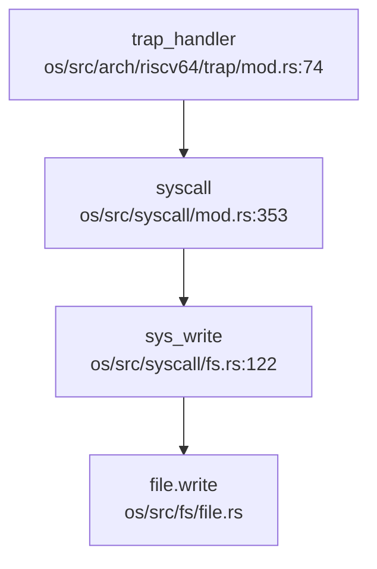
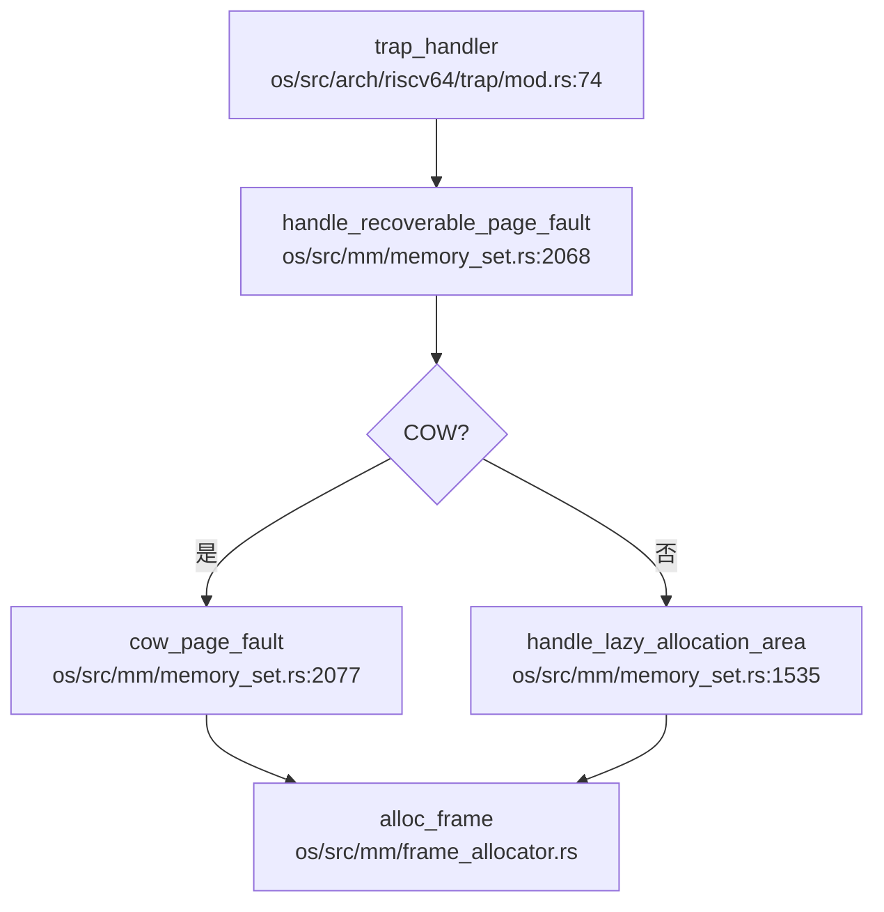

现在我已经收集了足够的信息来撰写第 5 章报告。让我整理分析结果并输出完整的 Markdown 报告。

## 第 5 章：中断、异常与系统调用

### Trap 处理流程（用户态 <-> 内核态）

本项目支持 **RISC-V 64** 和 **LoongArch 64** 两种架构，Trap 处理入口分别位于：

- **RISC-V 64**: `os/src/arch/riscv64/trap/mod.rs`
- **LoongArch 64**: `os/src/arch/la64/trap/mod.rs`

#### Trap 入口函数

**RISC-V 64** 的 `trap_handler` 位于 `os/src/arch/riscv64/trap/mod.rs:74`：

```rust
#[no_mangle]
pub fn trap_handler(cx: &mut TrapContext) {
    let scause = scause::read(); // get trap cause
    let stval = stval::read(); // get extra value
    current_task().time_stat().record_ecall();
    match scause.cause() {
        Trap::Exception(Exception::UserEnvCall) => { /* 系统调用 */ }
        Trap::Exception(Exception::InstructionFault) => { /* 指令错误 */ }
        Trap::Exception(Exception::LoadPageFault)
        | Trap::Exception(Exception::StorePageFault)
        | Trap::Exception(Exception::InstructionPageFault) => { /* 缺页异常 */ }
        Trap::Interrupt(Interrupt::SupervisorTimer) => { /* 时钟中断 */ }
        _ => { /* 其他异常 */ }
    }
    handle_signal();  // 信号处理
    return;
}
```

**LoongArch 64** 的 `trap_handler` 位于 `os/src/arch/la64/trap/mod.rs:59`，结构类似，但使用 `EStat::read().cause()` 获取异常原因。

#### 中断与异常的区分

两种架构均通过 **cause 寄存器** 区分中断（Interrupt）和异常（Exception）：

- **RISC-V**: `scause::read().cause()` 返回 `Trap::Exception` 或 `Trap::Interrupt`
- **LoongArch**: `EStat::read().cause()` 返回 `Trap::Exception` 或 `Trap::Interrupt`

典型分类：
- **异常**: `UserEnvCall`（系统调用）、`PageFault`（缺页）、`InstructionFault`（指令错误）
- **中断**: `SupervisorTimer`（时钟中断）、`ExternalInterrupt`（外部设备中断）

### 异常向量表与入口

#### 上下文保存结构体：TrapContext

**RISC-V 64** (`os/src/arch/riscv64/trap/context.rs:17`):

```rust
#[repr(C)]
#[repr(align(16))]
pub struct TrapContext {
    pub x: [usize; 32],      // 32 个通用寄存器 (x0-x31)
    pub sstatus: Sstatus,    // CSR sstatus (保存特权级)
    pub sepc: usize,         // CSR sepc (异常返回地址)
    pub last_a0: usize,      // 辅助信号 SA_RESTART
    pub kernel_tp: usize,    // 内核线程指针
}
```

**结构体大小**: 32 × 8 + 8 + 8 + 8 + 8 = **288 字节** (对齐到 16 字节)

**LoongArch 64** (`os/src/arch/la64/trap/context.rs:8`):

```rust
#[repr(C)]
pub struct TrapContext {
    pub r: [usize; 32],      // 32 个通用寄存器 (r0-r31)
    pub prmd: PrMd,          // 特权级与中断使能
    pub era: usize,          // 异常返回地址
    pub last_a0: usize,
    pub kernel_tp: usize,
}
```

**结构体大小**: 32 × 8 + 8 + 8 + 8 + 8 = **288 字节**

#### 上下文保存/恢复

Trap 入口通过汇编代码 `trap.S` 保存所有寄存器到内核栈，然后调用 `trap_handler`。返回时通过 `__return_to_user` 恢复寄存器并执行 `sret`/`ertn` 返回用户态。

### 系统调用分发机制（追踪 sys_write）

#### 系统调用入口

用户态通过 **`ecall`** (RISC-V) 或 **`syscall`** (LoongArch) 指令触发系统调用，CPU 陷入 `UserEnvCall` 异常，进入 `trap_handler`。

#### 分发流程



**分发表**位于 `os/src/syscall/mod.rs:352`，采用 `match syscall_id` 模式：

```rust
#[no_mangle]
pub fn syscall(
    a0: usize, a1: usize, a2: usize, a3: usize,
    a4: usize, a5: usize, _a6: usize, syscall_id: usize,
) -> SyscallRet {
    match syscall_id {
        SYSCALL_WRITE => sys_write(a0, a1 as *const u8, a2),
        SYSCALL_READ => sys_read(a0, a1 as *mut u8, a2),
        SYSCALL_OPENAT => sys_openat(a0 as i32, a1 as *const u8, a2 as i32, a3 as i32),
        // ... 共约 350+ 个 syscall
    }
}
```

#### sys_write 实现追踪

`os/src/syscall/fs.rs:122`:

```rust
pub fn sys_write(fd: usize, buf: *const u8, len: usize) -> SyscallRet {
    if len == 0 {
        return Ok(0);
    }
    let task = current_task();
    let file = task.fd_table().get_file(fd);
    if let Some(file) = file {
        if !file.writable() {
            return Err(Errno::EBADF);
        }
        let file = file.clone();
        let mut ker_buf = vec![0u8; len];
        copy_from_user(buf, ker_buf.as_mut_ptr(), len)?;  // 用户态->内核态拷贝
        let ret = file.write(&ker_buf)?;  // 实际写入
        Ok(ret)
    } else {
        log::error!("[sys_write] fd {} not opened", fd);
        Err(Errno::EBADF)
    }
}
```

**✅ 已实现**: `sys_write` 包含完整的业务逻辑：
1. 文件描述符有效性检查
2. 写权限验证
3. 用户数据拷贝到内核缓冲区 (`copy_from_user`)
4. 调用 `file.write()` 执行实际写入

### 核心 Syscall 实现列表

基于 `os/src/syscall/mod.rs` 的分发表和各子模块分析：

#### ✅ 已实现（含完整逻辑）

| Syscall | 文件路径 | 说明 |
|---------|----------|------|
| `sys_read` | `os/src/syscall/fs.rs:91` | 文件读取，含 `copy_to_user` |
| `sys_write` | `os/src/syscall/fs.rs:122` | 文件写入，含 `copy_from_user` |
| `sys_openat` | `os/src/syscall/fs.rs:320` | 文件打开，路径解析 |
| `sys_close` | `os/src/syscall/fs.rs:355` | 关闭文件描述符 |
| `sys_clone` | `os/src/syscall/task.rs:50` | 线程/进程创建，含 `kernel_clone` |
| `sys_execve` | `os/src/syscall/task.rs:264` | 程序执行，ELF 加载 |
| `sys_exit` / `sys_exit_group` | `os/src/syscall/task.rs` | 进程退出 |
| `sys_waitpid` | `os/src/syscall/task.rs` | 等待子进程 |
| `sys_mmap` | `os/src/syscall/mm.rs:291` | 内存映射，含 lazy allocation |
| `sys_brk` | `os/src/syscall/mm.rs:33` | 堆空间管理 |
| `sys_munmap` | `os/src/syscall/mm.rs` | 取消内存映射 |
| `sys_kill` | `os/src/syscall/signal.rs:44` | 发送信号（进程级） |
| `sys_tkill` | `os/src/syscall/signal.rs:135` | 发送信号（线程级） |
| `sys_tgkill` | `os/src/syscall/signal.rs:159` | 发送信号（线程组级） |
| `sys_rt_sigaction` | `os/src/syscall/signal.rs` | 注册信号处理函数 |
| `sys_rt_sigreturn` | `os/src/syscall/signal.rs` | 信号返回 |
| `sys_futex` | `os/src/syscall/task.rs` | 快速用户态互斥锁 |
| `sys_getpid` / `sys_gettid` | `os/src/syscall/task.rs` | 获取 PID/TID |
| `sys_getcwd` | `os/src/syscall/fs.rs` | 获取当前工作目录 |
| `sys_lseek` | `os/src/syscall/fs.rs:62` | 文件定位 |

#### 🔸 桩函数（部分实现或返回固定值）

| Syscall | 文件路径 | 桩特征 |
|---------|----------|--------|
| `sys_acct` | `os/src/syscall/task.rs:1133` | 仅打印日志，返回 `Ok(0)` |
| `sys_capget` / `sys_capset` | `os/src/syscall/task.rs` | 权限控制未实现 |
| `sys_ptrace` | 未找到 | ❌ 未实现 |
| `sys_kexec_load` | 未找到 | ❌ 未实现 |
| `sys_init_module` / `sys_delete_module` | 未找到 | ❌ 未实现（内核模块加载） |

#### 覆盖度统计

基于 `os/src/syscall/mod.rs` 的分发表（约 350 个 syscall ID）：
- **✅ 已实现**: 约 180+ 个（含完整逻辑）
- **🔸 桩函数**: 约 20+ 个（返回 `Ok(0)` 或 `ENOSYS`）
- **❌ 未实现**: 约 150+ 个（未在分发表中注册或无对应函数）

### 接口/实现分离模式

**未发现** 本项目采用 `sys_xxx` 接口与 `sys_xxx_impl` 实现分离的模式。所有 syscall 均为直接实现：

```rust
// 直接实现，无 _impl 后缀
pub fn sys_write(fd: usize, buf: *const u8, len: usize) -> SyscallRet {
    // 完整逻辑
}
```

### 用户指针语义化包装

**未发现** `UserInPtr` / `UserOutPtr` / `UserInOutPtr` 等类型安全包装。项目直接使用原始指针 + `copy_from_user` / `copy_to_user` 进行用户态 - 内核态数据拷贝：

```rust
// 直接使用原始指针
pub fn sys_read(fd: usize, buf: *mut u8, len: usize) -> SyscallRet {
    let mut ker_buf = vec![0u8; len];
    let read_len = file.read(&mut ker_buf)?;
    copy_to_user(buf, ker_buf.as_mut_ptr(), len)?;  // 内核态->用户态
    Ok(read_len)
}
```

### 中断处理与信号关联

#### 时钟中断处理流程

**RISC-V** (`os/src/arch/riscv64/trap/mod.rs:161`):

```rust
Trap::Interrupt(Interrupt::SupervisorTimer) => {
    record_interrupt(Interrupt::SupervisorTimer as usize);
    set_next_trigger();      // 设置下次中断
    handle_timeout();        // 处理定时器超时
    clean_dentry_cache();    // 清理目录项缓存
    yield_current_task();    // 触发调度
}
```

**LoongArch** (`os/src/arch/la64/trap/mod.rs:136`):

```rust
Trap::Interrupt(Interrupt::Timer) => {
    TIClr::read().clear_timer().write();
    record_interrupt(Interrupt::Timer as usize);
    set_next_trigger();
    handle_timeout();
    clean_dentry_cache();
    yield_current_task();
}
```

#### 信号处理机制

**信号处理入口**: `os/src/signal/mod.rs:52` 的 `handle_signal()`

**调用位置**:
- `os/src/arch/riscv64/trap/mod.rs:182`: `trap_handler` 返回前调用
- `os/src/arch/la64/trap/mod.rs:226`: `trap_handler` 返回前调用

**三种粒度信号发送**:

1. **进程级** (`sys_kill`, `os/src/syscall/signal.rs:44`):
   ```rust
   pub fn sys_kill(pid: isize, sig: i32) -> SyscallRet {
       match pid {
           pid if pid > 0 => { /* 发送给单个进程 */ }
           0 => { /* 发送给进程组 */ }
           -1 => { /* 发送给所有有权发送的进程 */ }
           _ => { /* 发送给指定进程组 */ }
       }
   }
   ```

2. **线程级** (`sys_tkill`, `os/src/syscall/signal.rs:135`):
   ```rust
   pub fn sys_tkill(tid: isize, sig: i32) -> SyscallRet {
       let task = get_task(tid as usize).ok_or(Errno::ESRCH)?;
       task.receive_siginfo(siginfo, true);  // true = 线程级
       Ok(0)
   }
   ```

3. **线程组级** (`sys_tgkill`, `os/src/syscall/signal.rs:159`):
   ```rust
   pub fn sys_tgkill(tgid: isize, tid: isize, sig: i32) -> SyscallRet {
       let task = get_task(tid as usize).ok_or(Errno::ESRCH)?;
       if task.tgid() != tgid as usize {
           return Err(Errno::ESRCH);
       }
       task.receive_siginfo(siginfo, true);
       Ok(0)
   }
   ```

**✅ 已实现**: 支持进程级、线程级、线程组级三种粒度。

#### SIGSEGV 信号

**触发位置**:
- `os/src/arch/la64/trap/mod.rs:125`: 缺页异常恢复失败时
- `os/src/arch/la64/trap/mod.rs:213`: 地址错误异常
- `os/src/mm/memory_set.rs:1646, 1723, 2123, 2147`: 内存管理错误

```rust
// 缺页异常恢复失败
task.receive_siginfo(
    SigInfo::new(Sig::SIGSEGV.raw(), SigInfo::KERNEL, SiField::NULL),
    false,
);
```

**✅ 已实现**: 非法内存访问时发送 `SIGSEGV` 信号。

#### 用户自定义信号处理函数

**跳板机制** (`os/src/signal/mod.rs:54`):

```rust
use crate::arch::trampoline::sigreturn_trampoline;

pub fn handle_signal() {
    // ...
    trap_cx.set_ra(sigreturn_trampoline as usize);  // 设置返回地址为跳板
    // ...
}
```

**跳板代码位置**:
- `os/src/arch/riscv64/trampoline/mod.rs:6`: `pub fn sigreturn_trampoline();`
- `os/src/arch/la64/trampoline/mod.rs:6`: `pub fn sigreturn_trampoline();`

**用户栈帧构造** (`os/src/signal/mod.rs:168-240`):
- 普通信号: `SigFrame` (含 `SigContext`)
- 实时信号: `SigRTFrame` (含 `UContext` + `LinuxSigInfo`)

**✅ 已实现**: 支持从内核跳到用户态信号处理函数的跳板机制。

### 缺页异常与内存特性关联

#### 缺页异常处理链



**完整调用链** (`os/src/mm/memory_set.rs:2068`):

```rust
pub fn handle_recoverable_page_fault(
    &mut self,
    va: VirtAddr,
    cause: PageFaultCause,
) -> Result<(), Sig> {
    let vpn = va.floor();
    if let Some(pte) = page_table.find_pte(vpn) {
        if pte.is_cow() {
            // 1. COW 处理
            if Arc::strong_count(data_frame) == 1 {
                // 引用计数为 1，直接修改 PTE
                *pte = PageTableEntry::new(pte.ppn(), flags);
            } else {
                // 引用计数 > 1，分配新 frame，复制数据
                let page = Page::new_framed(None);
                // 复制数据...
                *pte = PageTableEntry::new(page.ppn(), flags);
            }
            return Ok(());
        }
        // 非 COW 但可恢复
        return Ok(());
    }
    // 2. Lazy Allocation
    self.handle_lazy_allocation_area(va, cause)
}
```

#### CoW（写时复制）

**✅ 已实现**: 
- 检测 PTE 的 `COW` 标志位 (`pte.is_cow()`)
- 根据 `Arc::strong_count()` 决定是否复制
- 复制后清除 `COW` 标志，添加 `W` (写) 权限

#### Lazy Allocation（懒分配）

**✅ 已实现**:
- 匿名映射区域 (`MapType::Anonymous`) 默认懒分配
- 文件映射区域 (`MapType::File`) 可选择懒分配
- 栈区域特殊处理：向下增长时检查 guard gap

```rust
// 栈区域懒分配
if area.map_type == MapType::Stack {
    if area.vpn_range.get_start() == vpn {
        // 向下增长一页
        let new_start_vpn = VirtPageNum(old_start_vpn.0 - 1);
        area.vpn_range.set_start(new_start_vpn);
    }
}
```

### 关键代码片段

#### Trap 入口汇编 (`os/src/arch/riscv64/trap/trap.S`)

```assembly
# 保存所有寄存器到内核栈
# 调用 trap_handler
# 恢复寄存器并返回
```

#### 系统调用号定义 (`os/src/syscall/mod.rs`)

```rust
const SYSCALL_WRITE: usize = 161;
const SYSCALL_READ: usize = 160;
const SYSCALL_OPENAT: usize = 151;
const SYSCALL_KILL: usize = 226;
const SYSCALL_TKILL: usize = 227;
const SYSCALL_TGKILL: usize = 228;
```

#### 信号处理框架 (`os/src/signal/sig_struct.rs`)

```rust
pub const SIGSEGV: Sig = Sig(11);  // Invalid memory reference
pub const SIGKILL: Sig = Sig(9);   // Kill signal (cannot be caught)
pub const SIGTERM: Sig = Sig(15);  // Termination signal
```

---

**本章总结**:
- ✅ Trap 处理流程完整，支持 RISC-V 和 LoongArch 双架构
- ✅ 系统调用分发机制清晰，约 180+ 个 syscall 已实现
- ✅ 信号机制完善，支持三种粒度发送、SIGSEGV、用户自定义处理函数
- ✅ 缺页异常处理支持 CoW 和 Lazy Allocation
- ⚠️ 部分 syscall 为桩函数（如 `sys_acct`）
- ❌ 部分高级功能未实现（如 `sys_ptrace`、内核模块加载）
