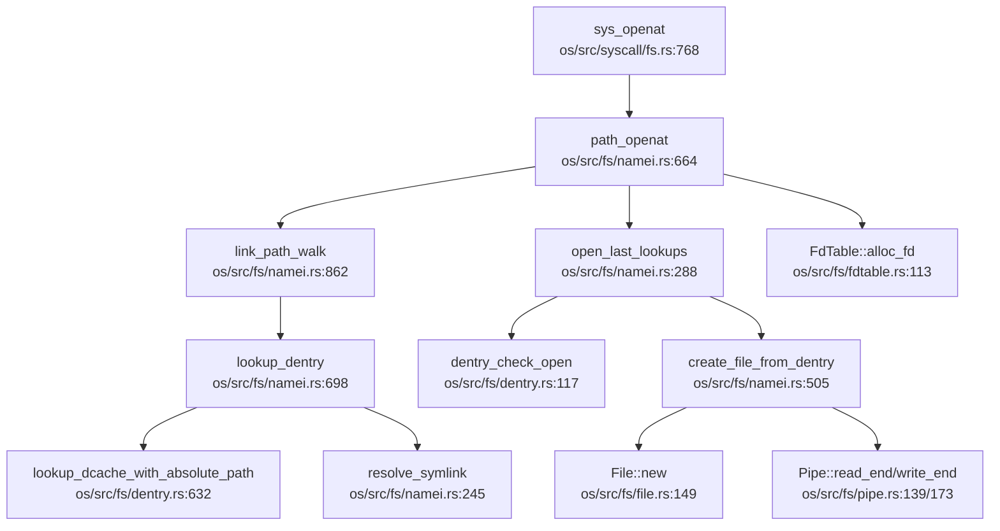

现在我已经收集了足够的信息。让我撰写完整的文件系统章节报告。

## 第 6 章：文件系统（VFS + 具体 FS）

### VFS 架构与接口设计

本 OS 实现了完整的 VFS（Virtual File System）抽象层，核心数据结构包括 `InodeOp`、`FileOp`、`Dentry` 和 `Path`，采用 Rust trait 进行抽象。

#### 核心 Trait 定义

**`InodeOp` trait**（`os/src/fs/inode.rs:17`）：
```rust
pub trait InodeOp: Any + Send + Sync {
    fn as_any(&self) -> &dyn Any { unimplemented!(); }
    fn read<'a>(&'a self, _offset: usize, _buf: &'a mut [u8]) -> usize { unimplemented!(); }
    fn get_page<'a>(&'a self, _page_index: usize) -> Option<Arc<Page>> { unimplemented!(); }
    fn write<'a>(&'a self, _page_offset: usize, _buf: &'a [u8]) -> usize { unimplemented!(); }
    fn lookup<'a>(&'a self, _name: &str, _parent_dentry: Arc<Dentry>) -> Arc<Dentry> { unimplemented!(); }
    fn create<'a>(&'a self, _negative_dentry: Arc<Dentry>, _mode: u16) { unimplemented!(); }
    fn mkdir<'a>(&'a self, _dentry: Arc<Dentry>, _mode: u16) { unimplemented!(); }
    fn mknod<'a>(&'a self, _dentry: Arc<Dentry>, _mode: u16, _dev: DevT) { unimplemented!(); }
    fn getattr(&self) -> Kstat { unimplemented!(); }
    // ... 共约 40 个方法
}
```

**`FileOp` trait**（`os/src/fs/file.rs:34`）：
```rust
pub trait FileOp: Any + Send + Sync {
    fn read<'a>(&'a self, _buf: &'a mut [u8]) -> SyscallRet { unimplemented!(); }
    fn write<'a>(&'a self, _buf: &'a [u8]) -> SyscallRet { unimplemented!(); }
    fn seek(&self, _offset: isize, _whence: Whence) -> SyscallRet { unimplemented!(); }
    fn get_inode(&self) -> Arc<dyn InodeOp> { unimplemented!(); }
    fn get_flags(&self) -> OpenFlags { unimplemented!(); }
    fn r_ready(&self) -> bool { unimplemented!(); }
    fn w_ready(&self) -> bool { unimplemented!(); }
    // ... 共约 25 个方法
}
```

**`Dentry` 结构**（`os/src/fs/dentry.rs:223`）：
```rust
pub struct Dentry {
    pub absolute_path: String,
    pub flags: RwLock<DentryFlags>,
    pub inner: Mutex<DentryInner>,
}

pub struct DentryInner {
    pub inode: Option<Arc<dyn InodeOp>>,
    pub parent: Option<Arc<Dentry>>,
    #[cfg(feature = "virt")]
    pub children: HashMap<String, Weak<Dentry>>,
}
```

Dentry 缓存（`DENTRY_CACHE`）使用 `HashMap<String, Arc<Dentry>>` 实现，支持负目录项（negative dentry）用于缓存不存在的路径。

### 具体文件系统支持情况（FAT32/Ext4/RamFS）

#### Ext4 文件系统（✅ 已实现）

Ext4 是本项目的主要文件系统实现，位于 `os/src/ext4/` 目录，包含完整的磁盘结构解析和 inode 管理。

**核心文件**：
- `os/src/ext4/fs.rs`（229L, 9.1KB）：`Ext4FileSystem` 结构，管理超级块和块组
- `os/src/ext4/inode.rs`（2329L, 97.0KB）：`Ext4Inode` 实现，包含完整的 inode 操作
- `os/src/ext4/super_block.rs`（273L, 12.4KB）：超级块解析
- `os/src/ext4/block_group.rs`（296L, 11.4KB）：块组描述符管理
- `os/src/ext4/block_op.rs`（826L, 33.5KB）：块操作（读写、extent 树管理）

**Ext4FileSystem 结构**（`os/src/ext4/fs.rs:13`）：
```rust
pub struct Ext4FileSystem {
    pub super_block: Arc<Ext4SuperBlock>,
    pub block_groups: Vec<Arc<GroupDesc>>,
    pub block_device: Arc<dyn BlockDevice>,
}
```

**Ext4Inode 实现 InodeOp**（`os/src/ext4/mod.rs`）：
- `read()` / `write()`：支持页缓存和 extent 树查找
- `lookup()`：目录项查找
- `create()` / `mkdir()` / `mknod()`：文件创建
- `get_page()`：页缓存支持，通过 `AddressSpace` 管理

**页缓存机制**（`os/src/fs/page_cache.rs`）：
```rust
pub struct AddressSpace {
    pub i_pages: BTreeMap<usize, Arc<Page>>, // 文件对应的页缓存
}
```

#### FAT32 文件系统（✅ 已实现）

FAT32 实现位于 `os/src/fat32/` 目录，支持基本的文件操作。

**核心文件**：
- `os/src/fat32/fs.rs`（157L, 5.6KB）：`FatFileSystem` 结构
- `os/src/fat32/inode.rs`（182L, 5.5KB）：`FatInode` 实现 `InodeOp`
- `os/src/fat32/file.rs`（208L, 8.1KB）：FAT 文件操作
- `os/src/fat32/dentry.rs`（360L, 13.6KB）：FAT 目录项解析

**FAT32 抽象层**：
```rust
// os/src/fat32/inode.rs:120
impl InodeOp for FatInode {
    fn mknod(&'a self, _dentry: Arc<Dentry>, _mode: u16, _dev: DevT) {
        // FAT32 不支持设备文件
        unimplemented!();
    }
    // ... 其他方法
}
```

#### RamFS/TmpFS（✅ 已实现）

TmpFS 实现位于 `os/src/fs/tmp/mod.rs`（40L, 1.2KB），通过 `init_tmpfs()` 初始化。

**初始化流程**（`os/src/fs/mount.rs:214`）：
```rust
pub fn init_tmpfs(root_path: Arc<Path>) {
    // 创建 /tmp 目录
    let tmp_path = "/tmp";
    // ... 创建目录并插入 dentry cache
}
```

TmpFS 使用内存 inode，不支持持久化存储。

### 伪文件系统

#### ProcFS（✅ 已实现）

ProcFS 实现位于 `os/src/fs/proc/` 目录，提供进程和系统信息接口。

**核心文件**：
- `os/src/fs/proc/mod.rs`（939L, 33.0KB）：ProcFS 初始化和管理
- `os/src/fs/proc/pid.rs`（282L, 8.2KB）：`/proc/<pid>` 目录
- `os/src/fs/proc/meminfo.rs`（243L, 7.4KB）：`/proc/meminfo`
- `os/src/fs/proc/cpuinfo.rs`（388L, 11.9KB）：`/proc/cpuinfo`
- `os/src/fs/proc/fd.rs`（234L, 7.0KB）：`/proc/<pid>/fd`

**初始化流程**（`os/src/fs/proc/mod.rs:44`）：
```rust
pub fn init_procfs(root_path: Arc<Path>) {
    // 创建 /proc 目录
    let proc_path = "/proc";
    // 创建 /proc/meminfo, /proc/cpuinfo, /proc/pid_max 等文件
    // 重命名 /config.gz 到 /proc/config.gz
}
```

**支持的文件**：
- `/proc/meminfo`：内存信息
- `/proc/cpuinfo`：CPU 信息
- `/proc/<pid>/status`：进程状态
- `/proc/<pid>/fd`：文件描述符
- `/proc/<pid>/maps`：内存映射
- `/proc/mounts`：挂载信息
- `/proc/sys/kernel/pid_max`：PID 最大值

#### DevFS（✅ 已实现）

DevFS 实现位于 `os/src/fs/dev/` 目录，提供设备文件接口。

**核心文件**：
- `os/src/fs/dev/mod.rs`（363L, 12.9KB）：DevFS 初始化
- `os/src/fs/dev/tty.rs`（429L, 13.2KB）：TTY 设备
- `os/src/fs/dev/null.rs`（190L, 5.4KB）：`/dev/null`
- `os/src/fs/dev/zero.rs`（190L, 5.5KB）：`/dev/zero`
- `os/src/fs/dev/rtc.rs`（281L, 9.3KB）：RTC 设备
- `os/src/fs/dev/loop_device.rs`（399L, 11.3KB）：Loop 设备

**初始化流程**（`os/src/fs/dev/mod.rs:27`）：
```rust
pub fn init_devfs(root_path: Arc<Path>) {
    // 创建 /dev 目录
    // 创建 /dev/tty, /dev/ttyS0, /dev/rtc, /dev/null, /dev/zero, /dev/urandom
    // 创建 /dev/loop-control, /dev/loop0
    // 初始化 TTY 全局单例
}
```

**支持的设备文件**：
- `/dev/tty`：终端设备（字符设备）
- `/dev/null`：空设备
- `/dev/zero`：零填充设备
- `/dev/rtc`：实时时钟
- `/dev/urandom`：随机数生成器
- `/dev/loop-control`：Loop 设备控制
- `/dev/loop0`：Loop 块设备

**SysFS**（❌ 未实现）：搜索 `sysfs` 关键词未发现实现。

### 文件描述符与进程关联

**`FdTable` 结构**（`os/src/fs/fdtable.rs:43`）：
```rust
pub struct FdTable {
    pub table: RwLock<Vec<Option<FdEntry>>>,
    rlimit: RwLock<RLimit>,
}

pub struct FdEntry {
    file: Arc<dyn FileOp>,
    fd_flags: FdFlags,
}
```

**关键特性**：
- **Per-Process**：每个进程拥有独立的 `FdTable`（`os/src/task/task.rs` 中 `fd_table: Arc<FdTable>`）
- **最大文件描述符数**：`MAX_FDS = 1025`
- **初始文件描述符**：0=stdin, 1=stdout, 2=stderr（均指向 TTY）
- **FD_CLOEXEC 支持**：`execve` 时自动关闭设置了 `FD_CLOEXEC` 的文件描述符

**文件描述符分配**（`os/src/fs/fdtable.rs:113`）：
```rust
pub fn alloc_fd(&self, file: Arc<dyn FileOp>, fd_flags: FdFlags) -> SyscallRet {
    // 查找第一个空闲的 fd
    for fd in 0..table_len {
        if table[fd].is_none() {
            table[fd] = Some(FdEntry::new(file, fd_flags));
            return Ok(fd);
        }
    }
    // 扩展 table
}
```

### 管道 (Pipe) 与套接字 (Socket) 支持情况

#### Pipe（✅ 已实现）

**系统调用**：`sys_pipe2`（`os/src/syscall/fs.rs:1132`）

**实现文件**：`os/src/fs/pipe.rs`（782L, 27.2KB）

**核心结构**：
```rust
pub struct Pipe {
    readable: bool,
    writable: bool,
    inode: Arc<PipeInode>,
    flags: AtomicI32,
    is_named_pipe: bool,
}

pub struct PipeRingBuffer {
    arr: Vec<u8>,
    head: usize,
    tail: usize,
    status: RingBufferStatus,
    write_end: Option<Weak<dyn FileOp>>,
    read_end: Option<Weak<dyn FileOp>>,
    waiter: Vec<Tid>,
    size: usize,
}
```

**默认缓冲区大小**：`RING_DEFAULT_BUFFER_SIZE = 65536`（64KB）

**功能特性**：
- ✅ 匿名管道（`pipe2()`）
- ✅ 命名管道（FIFO）
- ✅ 阻塞/非阻塞模式（`O_NONBLOCK`）
- ✅ 等待队列（读写阻塞时加入 waiter）
- ✅ 信号处理（写关闭的管道时发送 `SIGPIPE`）
- ✅ `FIONREAD` ioctl：获取管道中可读字节数
- ✅ 动态调整管道大小（`F_SETPIPE_SZ` / `F_GETPIPE_SZ`）

**不支持的特性**：
- ❌ `splice()`：未实现（`O_NOSPLICE` 标志存在但未处理）

#### Socket（✅ 已实现）

**实现文件**：`os/src/net/socket.rs`（2565L, 98.1KB）

**系统调用**（`os/src/syscall/net.rs`）：
- `sys_socket` / `sys_bind` / `sys_connect` / `sys_listen` / `sys_accept`
- `sys_sendto` / `sys_recvfrom`
- `sys_getsockopt` / `sys_setsockopt`
- `sys_shutdown`

**支持的域**：
- ✅ `AF_UNIX` / `AF_LOCAL`：Unix 域套接字（`os/src/net/unix.rs`）
- ✅ `AF_INET`：IPv4 TCP/UDP（`os/src/net/tcp.rs` / `os/src/net/udp.rs`）
- ✅ `AF_NETLINK`：Netlink 套接字（内核与用户空间通信）
- ✅ `AF_PACKET`：原始数据包套接字

**Socket 对**（`os/src/net/socketpair.rs`）：
- ✅ `sys_socketpair`：创建相连的套接字对

**监听表**（`os/src/net/listentable.rs`）：
```rust
pub struct ListenTable {
    // 管理监听中的套接字
}
```

### 缓存机制（Block/Page Cache）

#### 页缓存（Page Cache）

**`AddressSpace` 结构**（`os/src/fs/page_cache.rs:12`）：
```rust
pub struct AddressSpace {
    pub i_pages: BTreeMap<usize, Arc<Page>>, // 文件对应的页缓存
}
```

**页缓存管理**：
- `get_page_cache()`：查找页缓存
- `new_page_cache()`：创建新页缓存（从块设备读取）
- `remove_page_cache()`：删除页缓存
- `clear()`：清空页缓存

**Page 结构**（`os/src/mm/page.rs`）：
```rust
pub struct Page {
    // 页数据
    // 支持文件映射（File-backed）和内联数据（Inline）
}
```

**Drop 行为**：Page 在 drop 时自动写回磁盘（通过 `BlockDevice`）。

#### 块缓存（Block Cache）

**实现文件**：`os/src/drivers/block/block_cache.rs`（175L, 5.6KB）

**`BlockCache` 结构**：
```rust
pub struct BlockCache {
    // 缓存块设备数据
}
```

**全局管理器**：`BLOCK_CACHE_MANAGER`

**功能**：
- 缓存块设备读取的数据
- 支持写回（write-back）策略
- 与 Ext4 的 `block_op.rs` 集成

### 零拷贝映射验证（mmap 实现分析）

#### sys_mmap 实现（✅ 已实现）

**系统调用**：`sys_mmap`（`os/src/syscall/mm.rs:291`）

**`MapArea` 结构**（`os/src/mm/area.rs:52`）：
```rust
pub struct MapArea {
    pub vpn_range: VPNRange,
    pub map_perm: MapPermission,
    pub pages: BTreeMap<VirtPageNum, Arc<Page>>,
    pub map_type: MapType,
    pub backend_file: Option<Arc<dyn FileOp>>,
    pub offset: usize,
    pub locked: bool,
}

pub enum MapType {
    Linear,
    Framed,
    Stack,
    Heap,
    Filebe,      // 文件映射
    FilebeRO,    // 只读文件映射
}
```

**`MapPermission`**（`os/src/mm/area.rs:17`）：
```rust
bitflags! {
    pub struct MapPermission: u16 {
        const R = 1 << 1;
        const W = 1 << 2;
        const X = 1 << 3;
        const U = 1 << 4;
        const G = 1 << 5;
        const A = 1 << 6;
        const D = 1 << 7;
        const COW = 1 << 8;  // 写时复制
        const S = 1 << 9;    // 共享映射
    }
}
```

**映射类型支持**：
- ✅ `MAP_SHARED`：共享映射（`map_perm |= MapPermission::S`）
- ✅ `MAP_PRIVATE`：私有映射（写时复制，`map_perm.insert(MapPermission::COW)`）
- ✅ `MAP_ANONYMOUS`：匿名映射
- ✅ `MAP_FIXED`：强制映射到指定地址
- ✅ `MAP_FIXED_NOREPLACE`：指定地址失败则返回错误
- ✅ `MAP_POPULATE`：预先填充页表
- ✅ `MAP_GROWSDOWN`：栈增长方向
- ❌ `MAP_DENYWRITE`：仅打印警告，未实现
- ❌ `MAP_LOCKED`：仅设置 `locked = true`，未实现真正的内存锁定

**零拷贝验证**：
- ✅ **共享文件映射**：直接使用页缓存（`MapType::Filebe`），多个进程共享同一 `Arc<Page>`
- ✅ **私有文件映射**：写时复制（COW），通过 `MapPermission::COW` 标志实现
- ✅ **懒分配**：非 `MAP_POPULATE` 时，使用 `insert_map_area_lazily()` 延迟分配物理页

**关键代码**（`os/src/syscall/mm.rs:419`）：
```rust
if flags.contains(MmapFlags::MAP_ANONYMOUS) {
    if map_perm.contains(MapPermission::S) {
        // 共享映射，直接分配物理页
        memory_set.insert_framed_area(vpn_range, map_perm, locked);
    } else {
        // 匿名私有映射懒分配
        memory_set.insert_map_area_lazily(mmap_area);
    }
} else {
    // 文件映射
    if map_perm.contains(MapPermission::W) && !map_perm.contains(MapPermission::S) {
        map_perm.remove(MapPermission::W);
        map_perm.insert(MapPermission::COW);  // 写时复制
    }
    // 懒分配或预填充
}
```

**`VmArea` 中的 `shared` 字段**：本项目使用 `MapPermission::S` 标志表示共享映射，而非单独的 `shared` 字段。

### 高级 I/O 特性

#### poll/select/epoll

**`sys_select`**（❌ 未实现）：
```rust
// os/src/syscall/fs.rs:1419
// pub fn sys_select(
//     已注释掉，未实现
```

**`sys_poll`**（❌ 未实现）：搜索 `sys_poll` 无结果。

**`sys_epoll`**（❌ 未实现）：搜索 `sys_epoll` 无结果。

**当前状态**：
- 文件就绪检查通过 `FileOp::r_ready()` / `w_ready()` 实现
- Pipe 实现了 `r_ready()` / `w_ready()`（检查缓冲区状态）
- Socket 实现了 `r_ready()` / `w_ready()`（检查接收/发送缓冲区）
- 但缺少统一的 `poll`/`select`/`epoll` 系统调用

### 文件打开流程

#### 完整调用链



#### 四大核心数据结构协同

1. **超级块（SuperBlock）**：
   - `Ext4SuperBlock`（`os/src/ext4/super_block.rs`）：存储文件系统元数据（块大小、inode 数量等）
   - 在 `Ext4FileSystem::open()` 中从磁盘加载

2. **Inode**：
   - `Ext4Inode`（`os/src/ext4/inode.rs`）：文件元数据（权限、大小、extent 树）
   - 通过 `InodeOp` trait 提供统一接口
   - 在 `lookup()` 中从磁盘加载到内存

3. **Dentry**：
   - `Dentry`（`os/src/fs/dentry.rs`）：目录项缓存，连接路径名和 inode
   - 包含 `children: HashMap<String, Weak<Dentry>>` 维护目录树
   - 支持负目录项（negative dentry）缓存不存在的路径

4. **File**：
   - `File`（`os/src/fs/file.rs`）：打开的文件实例
   - 包含 `offset`（文件偏移）、`flags`（打开标志）、`inode`（指向 inode）
   - 通过 `FileOp` trait 提供读写接口

#### 流程详解

1. **路径解析**（`link_path_walk`）：
   - 逐段解析路径（如 `/home/user/file.txt` → `["home", "user", "file.txt"]`）
   - 对每一段调用 `lookup_dentry()` 查找 dentry
   - 遇到符号链接时调用 `resolve_symlink()` 递归解析

2. **Dentry 查找**（`lookup_dentry`）：
   - 先查 `DENTRY_CACHE`（`lookup_dcache_with_absolute_path()`）
   - 未命中则调用 `InodeOp::lookup()` 从磁盘加载
   - 创建新 dentry 并插入缓存

3. **权限检查**（`dentry_check_open`）：
   - 检查 `O_CREAT` / `O_DIRECTORY` / `O_TRUNC` 等标志
   - 检查用户权限（`dentry_check_access()`）
   - 处理 `O_TRUNC` 截断文件

4. **创建 File 对象**（`create_file_from_dentry`）：
   - 根据 inode 类型创建不同的 File：
     - 普通文件：`File::new()`
     - 管道：`Pipe::read_end()` / `Pipe::write_end()`
     - 设备文件：`TtyFile` / `NullFile` 等
   - 创建 `Path` 对象（包含 `mnt` 和 `dentry`）

5. **分配文件描述符**（`FdTable::alloc_fd`）：
   - 查找第一个空闲的 fd
   - 创建 `FdEntry { file, fd_flags }`
   - 返回 fd 给用户空间

### 关键代码验证

#### VFS Trait 实现验证

| 文件系统 | InodeOp 实现 | FileOp 实现 | 文件路径 |
|---------|-------------|-------------|----------|
| Ext4 | ✅ `Ext4Inode` | ✅ `File`（通用） | `os/src/ext4/mod.rs` |
| FAT32 | ✅ `FatInode` | ✅ `File`（通用） | `os/src/fat32/inode.rs` |
| Pipe | ✅ `PipeInode` | ✅ `Pipe` | `os/src/fs/pipe.rs` |
| DevFS | ✅ `TtyInode` / `NullInode` 等 | ✅ `TtyFile` / `NullFile` 等 | `os/src/fs/dev/*.rs` |
| ProcFS | ✅ `MemInfoFile` / `CpuInfoFile` 等 | ✅ 通过 `FileOp` | `os/src/fs/proc/*.rs` |

#### 功能实现状态总结

| 功能 | 状态 | 说明 |
|------|------|------|
| VFS 抽象层 | ✅ 已实现 | `InodeOp` / `FileOp` / `Dentry` |
| Ext4 文件系统 | ✅ 已实现 | 完整支持读写、extent 树、页缓存 |
| FAT32 文件系统 | ✅ 已实现 | 基本文件操作 |
| TmpFS/RamFS | ✅ 已实现 | 内存文件系统 |
| ProcFS | ✅ 已实现 | `/proc/meminfo`, `/proc/cpuinfo`, `/proc/<pid>/*` |
| DevFS | ✅ 已实现 | `/dev/tty`, `/dev/null`, `/dev/zero`, `/dev/rtc` |
| SysFS | ❌ 未实现 | 未发现代码 |
| Pipe（匿名/命名） | ✅ 已实现 | 64KB 缓冲区，阻塞/非阻塞 |
| Socket（Unix/INET） | ✅ 已实现 | TCP/UDP/Netlink/Packet |
| mmap（共享/私有） | ✅ 已实现 | 支持 COW、懒分配、`MAP_POPULATE` |
| poll/select/epoll | ❌ 未实现 | `sys_select` 已注释，`sys_poll`/`sys_epoll` 未找到 |
| splice | ❌ 未实现 | `O_NOSPLICE` 标志存在但未处理 |

#### 文件描述符表

- **位置**：`os/src/fs/fdtable.rs`
- **结构**：`FdTable { table: RwLock<Vec<Option<FdEntry>>> }`
- **作用域**：Per-Process（每个进程独立）
- **最大数量**：1025
- **FD_CLOEXEC**：✅ 支持（`execve` 时自动关闭）
