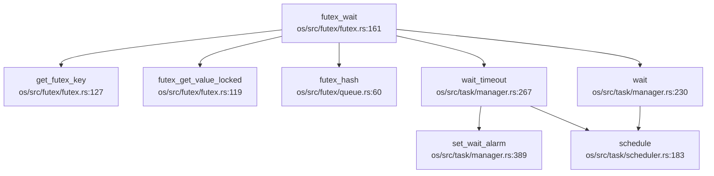
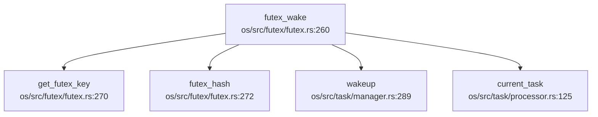

现在我已经收集了足够的信息。让我撰写完整的第 8 章报告。

## 第 8 章：同步互斥与进程间通信

本章分析 RocketOS 中的同步原语（锁机制）、等待队列实现以及进程间通信（IPC）机制。通过代码验证，本章将明确区分**已实现功能**、**桩函数**和**未实现功能**。

---

## 同步与互斥原语（锁与原子操作）

### SpinMutex 实现

RocketOS 实现了基于原子操作的自旋锁 `SpinMutex`，位于 `os/src/mutex/spin_mutex.rs`。

**核心结构体定义**：

```rust
// os/src/mutex/spin_mutex.rs:12-19
pub struct SpinMutex<T: ?Sized, S: MutexSupport> {
    lock: AtomicBool,
    _marker: PhantomData<S>,
    data: UnsafeCell<T>,
}
```

**原子操作机制**：
- 使用 Rust 标准库的 `core::sync::atomic::AtomicBool` 实现锁状态
- 通过 `compare_exchange` 原子指令实现 CAS（Compare-And-Swap）操作
- 未使用自定义汇编指令（如 x86 的 `lock xchg` 或 ARM 的 `ldxr/stxr`）

**锁获取流程**（`lock()` 方法）：

```rust
// os/src/mutex/spin_mutex.rs:90-110
pub fn lock(&self) -> impl DerefMut<Target = T> + '_ {
    let support_guard = S::before_lock();
    loop {
        self.wait_unlock();
        if self
            .lock
            .compare_exchange(false, true, Ordering::Acquire, Ordering::Relaxed)
            .is_ok()
        {
            break;
        }
    }
    MutexGuard {
        mutex: self,
        support_guard,
    }
}
```

**状态分类**：`✅ 已实现`

### 架构相关的 MutexSupport Trait

RocketOS 为不同架构实现了 `MutexSupport` trait，用于在锁操作前后执行架构特定的操作（如中断控制）：

**LoongArch64 实现**（`os/src/mutex/la64.rs`）：
- `Spin`：基础自旋锁，无中断控制
- `SpinNoIrq`：使用 `IeGuard` 在锁获取时禁用中断，释放时恢复

**RISC-V 64 实现**（`os/src/mutex/riscv.rs`）：
- `Spin`：基础自旋锁
- `SpinNoIrq`：使用 `SieGuard` 控制 SIE（Supervisor Interrupt Enable）位

```rust
// os/src/mutex/la64.rs:30-43
pub struct IeGuard(bool);

impl IeGuard {
    pub fn new() -> Self {
        Self({
            let mut crmd = CrMd::read();
            let ie_before = crmd.is_interrupt_enabled();
            crmd.set_ie(false);
            crmd.write();
            ie_before
        })
    }
}
```

**状态分类**：`✅ 已实现`

### MutexGuard RAII 机制

使用 RAII（Resource Acquisition Is Initialization）模式，通过 `MutexGuard` 的 `Drop` trait 自动释放锁：

```rust
// os/src/mutex/spin_mutex.rs:165-175
impl<'a, T: ?Sized, S: MutexSupport> Drop for MutexGuard<'a, T, S> {
    fn drop(&mut self) {
        self.mutex.lock.store(false, Ordering::Release);
        S::after_unlock(&mut self.support_guard);
    }
}
```

**状态分类**：`✅ 已实现`

---

## 等待队列实现机制

### WaitQueue 结构体

位于 `os/src/task/wait.rs`，实现了简单的 FIFO 阻塞队列：

```rust
// os/src/task/wait.rs:6-20
pub struct WaitQueue {
    queue: VecDeque<Arc<Task>>,
}

impl WaitQueue {
    pub fn add(&mut self, task: Arc<Task>) {
        self.queue.push_back(task);
    }
    
    pub fn fetch(&mut self) -> Option<Arc<Task>> {
        self.queue.pop_front()
    }
}
```

**功能分析**：
- 使用 `VecDeque` 存储等待的任务
- 提供 `add()`、`remove()`、`fetch()` 基本操作
- **缺失**：未实现 `sleep()` 方法，任务阻塞通过 `task::manager::wait()` 实现

**状态分类**：`✅ 已实现`（基础功能）

### Futex 等待队列（FutexQueues）

Futex 机制使用哈希桶管理等待队列，位于 `os/src/futex/queue.rs`：

```rust
// os/src/futex/queue.rs:32-42
pub struct FutexQueues {
    pub buckets: Box<[Mutex<VecDeque<FutexQ>>]>,
}

const FUTEX_HASH_SIZE: usize = 256;
```

**FutexQ 结构**（`os/src/futex/futex.rs:32-42`）：
```rust
pub struct FutexQ {
    key: FutexKey,
    task: Arc<Task>,
    bitset: u32,
}
```

**哈希函数**：使用 Jenkins Hash（`jhash2`）计算桶索引：
```rust
// os/src/futex/queue.rs:58-65
pub fn futex_hash(futex_key: &FutexKey) -> usize {
    let key = &[futex_key.ptr as u32, futex_key.aligned as u32, futex_key.offset];
    let hash = jhash2(key, key[2]);
    hash as usize & (FUTEX_HASH_SIZE - 1)
}
```

**状态分类**：`✅ 已实现`

---

## 进程间通信（Pipe/MsgQueue/Sem）

### 管道（Pipe）实现

**实现位置**：`os/src/fs/pipe.rs`

**核心结构**：
- `PipeInode`：管道 inode，包含 `PipeRingBuffer`
- `Pipe`：文件操作封装，实现 `FileOp` trait
- `PipeRingBuffer`：环形缓冲区实现

**环形缓冲区实现**（`PipeRingBuffer`）：

```rust
// os/src/fs/pipe.rs:511-522
pub struct PipeRingBuffer {
    arr: Vec<u8>,
    pub head: usize,
    pub tail: usize,
    pub(crate) status: RingBufferStatus,
    pub(crate) write_end: Option<Weak<dyn FileOp>>,
    pub(crate) read_end: Option<Weak<dyn FileOp>>,
    pub(crate) waiter: Vec<Tid>,
    size: usize,
}
```

**读写操作**：
- `buffer_read()`：从环形缓冲区读取数据，支持跨边界读取
- `buffer_write()`：向环形缓冲区写入数据，支持跨边界写入
- 默认缓冲区大小：`RING_DEFAULT_BUFFER_SIZE = 65536` 字节

**阻塞机制**：
- 读空管道：任务加入 `waiter` 队列，调用 `wait()` 阻塞
- 写满管道：任务加入 `waiter` 队列，调用 `wait()` 阻塞
- 唤醒：通过 `wakeup(tid)` 唤醒等待者

**状态分类**：`✅ 已实现`

### Futex 机制

**实现位置**：`os/src/futex/futex.rs`、`os/src/futex/mod.rs`

**支持的操作**（`do_futex` 函数）：
- `FUTEX_WAIT`：等待 futex 值变化
- `FUTEX_WAIT_BITSET`：带位掩码的等待
- `FUTEX_WAKE`：唤醒等待者
- `FUTEX_WAKE_BITSET`：带位掩码的唤醒
- `FUTEX_REQUEUE`：重新排队
- `FUTEX_CMP_REQUEUE`：条件重新排队
- `FUTEX_WAKE_OP`：`❌ 未实现`（panic）

**futex_wait 调用链**（通过 `lsp_get_call_graph` 分析）：



**futex_wake 调用链**（DEGRADED MODE - Grep 分析）：



**入向调用**（谁调用 futex_wake）：
- `os/src/futex/mod.rs:75`、`os/src/futex/mod.rs:87`：`do_futex` 系统调用分发
- `os/src/futex/robust_list.rs:115`：健壮锁列表处理

**状态分类**：`✅ 已实现`（FUTEX_WAKE_OP 除外）

### 共享内存（Shared Memory）

**实现位置**：`os/src/mm/shm.rs`、`os/src/syscall/mm.rs`

**核心结构**：
- `ShmManager`：全局共享内存管理器
- `ShmSegment`：共享内存段
- `ShmId`：共享内存标识符（包含 `IpcPerm` 权限信息）

**系统调用实现**：
- `sys_shmget()`：创建/获取共享内存段（`os/src/syscall/mm.rs:1080-1125`）
- `sys_shmat()`：附加共享内存到进程地址空间（`os/src/syscall/mm.rs:1127-1140`）
- `sys_shmdt()`：分离共享内存（`os/src/syscall/mm.rs:1142-1148`）
- `sys_shmctl()`：共享内存控制（`os/src/syscall/mm.rs:1150-1160`）

**权限检查**：
```rust
// os/src/mm/shm.rs:333-365
pub fn check_shm_perm(ipc_perm: &IpcPerm, required_perm: u16) -> SyscallRet {
    let task = current_task();
    let euid = task.euid();
    let egid = task.egid();
    // 检查用户/组/其他权限
}
```

**状态分类**：`✅ 已实现`

### 消息队列（Message Queue）

**搜索结果**：
- `grep "sys_msgget|msgget|MessageQueue"`：**未找到匹配**
- 仅在 `os/src/task/rusage.rs:17-18` 中发现 `msgsnd`/`msgrcv` 字段（用于资源统计，无实际实现）

**系统调用号定义**（`os/src/syscall/mod.rs`）：
- 未定义 `SYSCALL_MSGGET`、`SYSCALL_MSGSND`、`SYSCALL_MSGRCV` 等

**状态分类**：`❌ 未实现`

### 信号量（Semaphore）

**搜索结果**：
- `os/src/syscall/mod.rs:278-281`：定义了系统调用号
  ```rust
  const SYSCALL_SEMGET: usize = 190;
  const SYSCALL_SEMCTL: usize = 191;
  const SYSCALL_SEMTIMEDOP: usize = 192;
  const SYSCALL_SEMOP: usize = 193;
  ```
- **但**：在 `os/src/syscall/` 目录下**未找到**对应的 `sys_semget()`、`sys_semop()` 等实现函数
- `os/src/fs/eventfd.rs:29-79`：实现了 `EFD_SEMAPHORE` 标志，但这是 eventfd 的语义，非 System V 信号量

**状态分类**：`❌ 未实现`（仅定义了 syscall 号，无实现）

### 信号（Signal）作为 IPC

**实现位置**：`os/src/signal/`、`os/src/syscall/signal.rs`

**系统调用**：
- `sys_kill(pid, sig)`：向进程/线程组发送信号（`os/src/syscall/signal.rs:44-120`）

**实现细节**：
```rust
// os/src/syscall/signal.rs:44-75
pub fn sys_kill(pid: isize, sig: i32) -> SyscallRet {
    let sig = Sig::from(sig);
    match pid {
        pid if pid > 0 => {
            // 向单个进程/线程发送
            if let Some(task) = get_task(pid as usize) {
                task.receive_siginfo(siginfo, false);
            }
        }
        0 => {
            // 向进程组发送
            // ...
        }
        -1 => {
            // 向所有进程发送
            // ...
        }
    }
}
```

**状态分类**：`✅ 已实现`

### 信号处理时机

**处理位置**：`os/src/signal/mod.rs::handle_signal()`

**调用时机**：在 `trap_handler` 返回用户态之前调用：

```rust
// os/src/arch/la64/trap/mod.rs:254-256
pub fn trap_handler(cx: &mut TrapContext) {
    // ... 处理异常/中断 ...
    handle_signal();  // 在返回用户态前处理待处理信号
    // ...
}
```

**信号处理流程**（`handle_signal`）：
1. 检查待处理信号（`fetch_signal()`）
2. 检查信号处理方式（`SIG_DFL`/`SIG_IGN`/用户自定义）
3. 决定信号处理栈（普通栈/信号栈）
4. 向用户栈推送 `SigContext`/`SigInfo`/`UContext`
5. 修改 `trap_cx` 的 `sepc`、`sp`、`ra`、`a0` 跳转到用户信号处理函数

**状态分类**：`✅ 已实现`

### SocketPair

**实现位置**：`os/src/net/socketpair.rs`

**核心结构**：
- `BufferEnd`：SocketPair 的一端，包含读/写缓冲区
- 使用两个 `PipeRingBuffer` 实现全双工通信

**状态分类**：`✅ 已实现`

---

## 关键代码片段

### Futex Wait 完整流程

```rust
// os/src/futex/futex.rs:160-255
pub fn futex_wait(
    uaddr: usize,
    flags: i32,
    expected_val: u32,
    wait_time: Option<TimeSpec>,
    bitset: u32,
) -> SyscallRet {
    // 1. 获取 futex key
    let key = get_futex_key(uaddr, flags)?;
    
    // 2. 验证当前值是否匹配
    let real_futex_val = futex_get_value_locked(uaddr as *const u32)?;
    if expected_val != real_futex_val as u32 {
        return Err(Errno::EAGAIN);
    }
    
    // 3. 加入等待队列
    {
        let mut hash_bucket = FUTEXQUEUES.buckets[futex_hash(&key)].lock();
        let cur_futexq = FutexQ::new(key, current_task().clone(), bitset);
        hash_bucket.push_back(cur_futexq);
    }
    
    // 4. 阻塞等待（支持超时）
    loop {
        if let Some(mut wait_time) = wait_time {
            let ret = wait_timeout(wait_time, clock_id);
            if ret == -1 {  // 被信号唤醒
                return Err(Errno::EINTR);
            } else if ret == -2 {  // 超时
                return Err(Errno::ETIMEDOUT);
            }
            return Ok(0);
        }
        // 无计时等待
        if wait() == -1 {
            return Err(Errno::EINTR);
        } else {
            return Ok(0);
        }
    }
}
```

### Pipe 环形缓冲区读写

```rust
// os/src/fs/pipe.rs:552-590
pub fn buffer_read(&mut self, buf: &mut [u8]) -> usize {
    let begin = self.head;
    let end = if self.tail <= self.head { self.size } else { self.tail };
    let read_bytes = buf.len().min(end - begin);
    unsafe {
        copy_nonoverlapping(self.arr.as_ptr().add(begin), buf.as_mut_ptr(), read_bytes);
    };
    self.head = if begin + read_bytes == self.size { 0 } else { begin + read_bytes };
    read_bytes
}

pub fn buffer_write(&mut self, buf: &[u8]) -> usize {
    let begin = self.tail;
    let end = if self.tail < self.head { self.head } else { self.size };
    let write_bytes = buf.len().min(end - begin);
    unsafe {
        copy_nonoverlapping(buf.as_ptr(), self.arr.as_mut_ptr().add(begin), write_bytes);
    };
    self.tail = if begin + write_bytes == self.size { 0 } else { begin + write_bytes };
    write_bytes
}
```

---

## 未实现/桩函数功能列表

| 功能 | 状态 | 说明 |
|------|------|------|
| **消息队列（Message Queue）** | `❌ 未实现` | 仅 `rusage.rs` 中有统计字段，无 `sys_msgget`/`sys_msgsnd`/`sys_msgrcv` 实现 |
| **System V 信号量（Semaphore）** | `❌ 未实现` | 定义了 syscall 号（190-193），但无对应实现函数 |
| **FUTEX_WAKE_OP** | `❌ 未实现` | `do_futex()` 中直接 `panic!` |
| **优先级继承 Futex** | `❌ 未实现` | `do_futex()` 注释中标注 TODO |
| **WaitQueue::sleep()** | `🔸 桩函数` | `WaitQueue` 结构体无 `sleep()` 方法，通过 `task::manager::wait()` 间接实现 |

---

## 总结

RocketOS 在同步互斥与 IPC 方面的实现情况：

**已完整实现**：
- ✅ SpinMutex（基于 `AtomicBool` CAS）
- ✅ 架构相关的中断控制锁（`SpinNoIrq`）
- ✅ Futex 机制（支持 WAIT/WAKE/REQUEUE/CMP_REQUEUE）
- ✅ 管道（Pipe）与环形缓冲区
- ✅ 共享内存（System V shmget/shmat/shmdt/shmctl）
- ✅ 信号（Signal）作为 IPC
- ✅ SocketPair 全双工通信

**未实现**：
- ❌ 消息队列（Message Queue）
- ❌ System V 信号量（Semaphore）
- ❌ Futex 高级操作（WAKE_OP、优先级继承）

**设计特点**：
1. 使用 Rust 标准库原子操作，未引入架构相关汇编
2. Futex 使用 256 桶哈希表管理等待队列
3. Pipe/SocketPair 共享 `PipeRingBuffer` 实现
4. 信号处理在 Trap 返回用户态前统一处理（`handle_signal()`）
