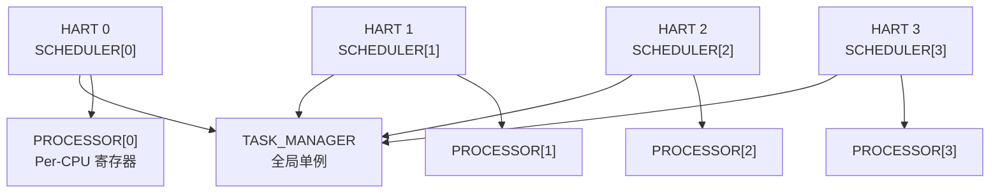
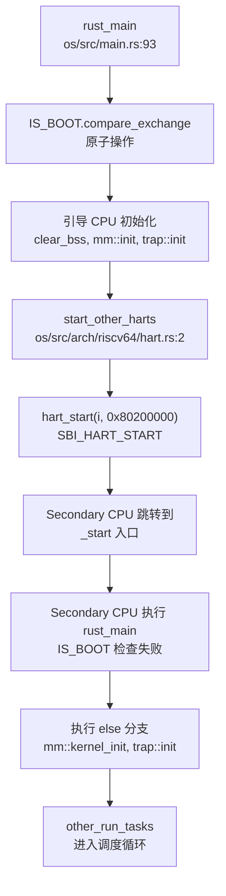

现在我已经收集了足够的信息。让我撰写完整的第 9 章报告。

## 第 9 章：多核支持与并行机制

### 多核架构设计（SMP/AMP）

**✅ 已实现 SMP（对称多处理）架构**

RocketOS 实现了完整的 SMP（Symmetric Multi-Processing）架构，支持最多 4 个硬件线程（HART）。系统采用共享内存模型，所有 CPU 核心共享同一物理地址空间和内核数据结构。

**核心配置**：
- RISC-V 架构：`os/src/arch/riscv64/config.rs:40` - `pub const MAX_HARTS: usize = 4;`
- LoongArch 架构：`os/src/arch/la64/config.rs:91` - `pub const MAX_HARTS: usize = 4;`

**SMP 设计特征**：
1. **共享内核地址空间**：所有 HART 运行在同一内核镜像中（RISC-V: `0x80200000`，LoongArch: 直接映射）
2. **Per-CPU 调度器**：每个 HART 拥有独立的调度器实例（`SCHEDULER[hart_id]`）
3. **全局任务管理器**：`TASK_MANAGER` 为全局单例，所有 HART 共享任务注册表
4. **原子操作同步**：广泛使用 `core::sync::atomic` 保证多核安全



### Secondary CPU 启动流程

**✅ 已实现 Secondary CPU 启动机制**

系统通过 SBI（RISC-V）或 IPI（LoongArch）启动 Secondary CPU，采用"引导 CPU 唤醒其他 CPU"的模式。

**启动流程**（以 RISC-V 为例）：



**关键代码路径**：

1. **引导 CPU 入口**（`os/src/main.rs:93-152`）：
```rust
pub fn rust_main(hart_id: usize, dtb_address: usize) -> ! {
    if IS_BOOT.compare_exchange(true, false, Ordering::SeqCst, Ordering::SeqCst).is_ok() {
        // 引导 CPU 执行完整初始化
        clear_bss();
        mm::init();
        trap::init();
        #[cfg(feature = "smp")]
        start_other_harts(hart_id);  // 唤醒其他 CPU
        run_tasks(hart_id);
    } else {
        // Secondary CPU 执行简化初始化
        mm::kernel_init();
        trap::init();
        other_run_tasks(hart_id);  // 直接进入调度
    }
}
```

2. **Secondary CPU 启动**（`os/src/arch/riscv64/hart.rs:2-12`）：
```rust
#[cfg(feature = "smp")]
pub fn start_other_harts(hart_id: usize) {
    use crate::arch::{config::MAX_HARTS, sbi::hart_start};
    const KERNEL_START_ADDR: usize = 0x80200000;
    for i in 0..MAX_HARTS {
        if i == hart_id {
            continue;
        }
        println!("Starting hart {}", i);
        hart_start(i, KERNEL_START_ADDR);  // SBI 调用启动目标 HART
    }
}
```

3. **SBI 调用实现**（`os/src/arch/riscv64/sbi.rs:57-59`）：
```rust
pub fn hart_start(hart_id: usize, start_addr: usize) -> usize {
    sbi_call(SBI_HART_START, hart_id, start_addr, 0)
}
```

**LoongArch 实现差异**：
- 使用 IPI（核间中断）而非 SBI
- `os/src/arch/la64/hart.rs:6-15`：通过 `loongArch64::ipi::csr_mail_send` 和 `send_ipi_single` 唤醒

> ⚠️ **注意**：`lsp_get_call_graph` 返回 `[⚠️ DEGRADED MODE]`，以上分析基于 Grep 静态分析结果。

### 核间通信与 IPI 机制

**🔸 部分实现（仅 Secondary CPU 启动使用）**

系统实现了基础的 IPI 机制用于 CPU 启动，但**未发现通用的 IPI 发送/处理框架**。

**已实现功能**：

1. **RISC-V SBI IPI**（`os/src/arch/riscv64/sbi.rs:14-15`）：
```rust
const SBI_CLEAR_IPI: (usize, usize) = (3, 0);
const SBI_SEND_IPI: (usize, usize) = (4, 0);
```
- 定义了 SBI IPI 接口，但**未在代码中找到实际调用**（除启动外的 IPI 通信）

2. **LoongArch IPI**（`os/src/arch/la64/hart.rs:13-14`）：
```rust
loongArch64::ipi::csr_mail_send(0x90000000, i, 0);
loongArch64::ipi::send_ipi_single(i, 1);
```
- 仅在 `start_other_harts` 中使用

**❌ 未实现功能**：
- **通用 IPI 发送接口**：搜索 `send_ipi`、`ipi_handler` 仅找到启动相关代码
- **IPI 中断处理程序**：未发现注册的 IPI 中断向量
- **核间 TLB 刷新**：未实现 `SBI_REMOTE_SFENCE_VMA` 的多核同步调用
- **调度器间 IPI 通知**：任务迁移或负载均衡时未使用 IPI 通知目标 CPU

**结论**：IPI 机制仅用于启动阶段的"一次性"唤醒，运行时的核间通信（如调度器通知、TLB 同步）**❌ 未实现**。

### Per-CPU 变量与数据结构

**✅ 已实现 Per-CPU 数据结构（基于数组索引）**

RocketOS 采用"数组 + hart_id 索引"的方式实现 Per-CPU 变量，而非传统的 `axns` 命名空间或 `PerCpu<T>` 包装器。

**Per-CPU 数据结构**：

1. **调度器数组**（`os/src/task/scheduler.rs:56-59`）：
```rust
lazy_static! {
    static ref SCHEDULER: Vec<SyncUnsafeCell<Scheduler>> = (0..MAX_HARTS)
        .map(|_| SyncUnsafeCell::new(Scheduler::new()))
        .collect();
}
// 访问方式：SCHEDULER[hart_id].get()
```

2. **处理器状态数组**（`os/src/task/processor.rs:47-49`）：
```rust
lazy_static! {
    pub static ref PROCESSOR: Vec<RwLock<Processor>> =
        (0..MAX_HARTS).map(|_| RwLock::new(Processor::new())).collect();
}
```

3. **实时调度器数组**（`os/src/sched/fifo.rs:8-9`）：
```rust
static ref RT_SCHEDULER: Vec<SyncUnsafeCell<FIFOScheduler>> = (0..MAX_HARTS)
    .map(|_| SyncUnsafeCell::new(FIFOScheduler::new()))
    .collect();
```

4. **空闲任务调度器**（`os/src/sched/idle.rs:7-8`）：
```rust
static ref IDLESCHEDULER: Vec<IDLEScheduler> = (0..MAX_HARTS)
    .map(|hart_id| IDLEScheduler::new(hart_id))
    .collect();
```

**hart_id 获取机制**（`os/src/task/processor.rs:130-134`）：
```rust
pub fn current_hart_id() -> usize {
    // 通过 tp 寄存器计算 hart_id
    let hart_id_ptr = (current_tp() + core::mem::size_of::<usize>()) as *const usize;
    unsafe { hart_id_ptr.read() }
}
```

**❌ 未实现功能**：
- **`axns` Per-CPU 命名空间**：搜索 `axns`、`PerCpu<T>` 仅找到 BPF 相关的 `PerCpuHash` 类型定义
- **Per-CPU 内存分配器**：未实现独立的 Per-CPU 内存区域
- **CPU 本地缓存**：未使用 `#[per_cpu]` 属性或类似机制

**设计评价**：
- ✅ 优点：实现简单，访问速度快（数组索引）
- ⚠️ 缺点：缺乏类型安全，依赖 `hart_id` 正确性，未防止跨 CPU 访问

### 多核调度策略

**✅ 已实现 Per-CPU 调度 + CPU 亲和性**

RocketOS 采用"Per-CPU 就绪队列 + CPU 亲和性掩码"的多核调度策略，**但未实现负载均衡**。

**调度器架构**：

1. **Per-CPU 调度器**：每个 HART 拥有独立的 `SCHEDULER[hart_id]` 实例
   - 实时任务：`RT_SCHEDULER[hart_id]`（FIFO 调度）
   - 普通任务：`SCHEDULER[hart_id]`（CFS 或 FIFO，取决于 `cfs` 特性）
   - 空闲任务：`IDLESCHEDULER[hart_id]`

2. **任务 CPU 绑定**（`os/src/task/task.rs:160`）：
```rust
pub struct TaskInner {
    cpu_mask: CpuMask,  // CPU 亲和性掩码
}
```

3. **CPU 掩码定义**（`os/src/task/task.rs:2269-2276`）：
```rust
bitflags! {
    pub struct CpuMask: usize {
        const CPU0 = 0b0001;
        const CPU1 = 0b0010;
        const CPU2 = 0b0100;
        const CPU3 = 0b1000;
        const ALL = 0b1111;
    }
}
```

**CPU 亲和性系统调用**（`os/src/syscall/sched.rs:32-98`）：
- `sys_sched_setaffinity(pid, cpusetsize, mask)`：设置任务 CPU 掩码
- `sys_sched_getaffinity(pid, cpusetsize, mask)`：获取任务 CPU 掩码

**任务创建时的 CPU 选择**（`os/src/task/task.rs:492-493`）：
```rust
// cpu_id = select_cpu();  // 已注释
cpu_id = self.cpu_id;  // 继承父进程的 CPU
```

**❌ 未实现功能**：
- **负载均衡**：搜索 `load_balance`、`migrate` 未找到实现
- **任务迁移**：任务创建后固定在其 CPU 上运行，无动态迁移机制
- **工作窃取**：空闲 CPU 不会从繁忙 CPU 窃取任务
- **调度器间同步**：Per-CPU 调度器之间无协调机制

**`select_cpu` 实现**（`os/src/task/scheduler.rs:164-167`）：
```rust
pub fn select_cpu() -> usize {
    let next = NEXT_CPU.fetch_add(1, Ordering::Relaxed) % MAX_HARTS;
    next
}
```
- 简单的轮询分配，**无负载感知**

### 关键代码片段

#### 1. SpinLock 实现（支持中断禁用变体）

**`os/src/mutex/spin_mutex.rs:13-52`**：
```rust
pub struct SpinMutex<T: ?Sized, S: MutexSupport> {
    lock: AtomicBool,
    _marker: PhantomData<S>,
    data: UnsafeCell<T>,
}

impl<'a, T, S: MutexSupport> SpinMutex<T, S> {
    pub fn lock(&self) -> impl DerefMut<Target = T> + '_ {
        let support_guard = S::before_lock();
        loop {
            self.wait_unlock();
            if self.lock.compare_exchange(false, true, Ordering::Acquire, Ordering::Relaxed).is_ok() {
                break;
            }
        }
        MutexGuard { mutex: self, support_guard }
    }
}
```

**中断禁用策略**（`os/src/mutex/riscv.rs:47-59`）：
```rust
pub struct SpinNoIrq;

impl MutexSupport for SpinNoIrq {
    type GuardData = SieGuard;
    fn before_lock() -> Self::GuardData {
        SieGuard::new()  // 清除 sstatus.sie
    }
    fn after_unlock(_: &mut Self::GuardData) {}
}
```

**✅ SpinNoIrq 在锁定时禁用中断**，防止死锁和优先级反转。

#### 2. 全局任务管理器（多核安全）

**`os/src/task/manager.rs:28-62`**：
```rust
lazy_static! {
    static ref TASK_MANAGER: TaskManager = TaskManager::new();
}

pub fn register_task(task: &Arc<Task>) {
    TASK_MANAGER.add(task);
}

pub fn get_task(tid: Tid) -> Option<Arc<Task>> {
    TASK_MANAGER.get(tid)
}
```

**双级注册机制**：
1. **全局注册**：`TASK_MANAGER` 保存所有任务的 `Weak<Task>` 引用
2. **Per-CPU 调度**：任务同时加入 `SCHEDULER[cpu_id]` 的就绪队列

#### 3. Futex 多核行为

**`os/src/futex/futex.rs:150-260`**：
```rust
pub fn futex_wait(uaddr: usize, flags: i32, val: u32, wait_time: Option<TimeSpec>) -> SyscallRet {
    let key = get_futex_key(uaddr, flags)?;
    // 将当前任务加入全局等待队列
    FUTEXQUEUES.buckets[futex_hash(&key)].lock().push_back(FutexQ::new(key, task, bitset));
    // 挂起任务（可能跨 CPU 唤醒）
    if let Some(wait_time) = wait_time {
        wait_timeout(wait_time, clock_id)?;
    } else {
        wait()?;
    }
}
```

**多核安全设计**：
- **全局哈希桶**：`FUTEXQUEUES` 为全局单例，所有 CPU 共享
- **桶级锁**：每个哈希桶独立加锁，减少竞争
- **跨 CPU 唤醒**：`futex_wake` 可唤醒任意 CPU 上等待的任务

#### 4. 原子操作与内存序

**TID 分配器**（`os/src/task/id.rs:10-34`）：
```rust
lazy_static! {
    static ref TID_ALLOCATOR: Mutex<IdAllocator> = Mutex::new(IdAllocator::new());
}

pub fn tid_alloc() -> TidHandle {
    TidHandle(TID_ALLOCATOR.lock().alloc())  // 使用 Mutex 保证多核安全
}
```

**CPU 选择原子操作**（`os/src/task/scheduler.rs:53`）：
```rust
static NEXT_CPU: AtomicUsize = AtomicUsize::new(0);

pub fn select_cpu() -> usize {
    let next = NEXT_CPU.fetch_add(1, Ordering::Relaxed) % MAX_HARTS;
    next
}
```

**内存序保证**：
- `Ordering::SeqCst`：用于 `IS_BOOT` 标志（最严格的全局顺序）
- `Ordering::Acquire/Release`：用于 SpinLock 同步
- `Ordering::Relaxed`：用于性能敏感的计数器（如 `NEXT_CPU`）

---

### 本章总结

| 功能 | 实现状态 | 说明 |
|------|---------|------|
| SMP 架构 | ✅ 已实现 | 支持 4 HART，共享内存模型 |
| Secondary CPU 启动 | ✅ 已实现 | SBI（RISC-V）/ IPI（LoongArch） |
| 通用 IPI 通信 | ❌ 未实现 | 仅启动阶段使用 |
| Per-CPU 变量 | ✅ 已实现 | 数组 + hart_id 索引 |
| CPU 亲和性 | ✅ 已实现 | `CpuMask` + 系统调用 |
| 负载均衡 | ❌ 未实现 | 任务固定 CPU，无迁移 |
| SpinLock 禁中断 | ✅ 已实现 | `SpinNoIrq` 变体 |
| 多核安全 Futex | ✅ 已实现 | 全局哈希桶 + 桶级锁 |

**设计评价**：
- ✅ SMP 基础架构完整，Secondary CPU 启动流程清晰
- ✅ Per-CPU 调度器减少锁竞争，设计合理
- ⚠️ 缺乏运行时 IPI 通信，限制了多核协作能力
- ❌ 无负载均衡机制，可能导致 CPU 利用率不均衡
- ✅ 同步原语（SpinLock、Futex）考虑了多核安全性
