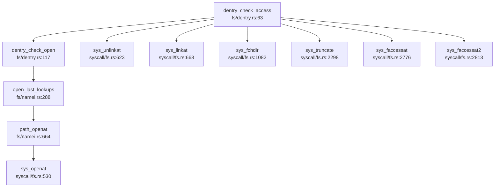

现在我已经收集了足够的信息来撰写第 10 章安全机制与权限模型的分析报告。让我整理所有发现并输出完整的 Markdown 报告。

## 第 10 章：安全机制与权限模型

本章分析 RocketOS 的安全隔离与权限控制机制，包括用户/组模型、Capability 能力系统、系统调用安全检查、内存安全机制等。

---

### 特权级与隔离机制

#### 硬件特权级支持

RocketOS 支持 **RISC-V 64** 和 **LoongArch 64** 两种架构，均实现了用户态/内核态隔离：

**RISC-V 64 架构** (`os/src/arch/riscv64/trap/mod.rs`):
- 通过 `sstatus.SPP` 位记录陷入前的特权级
- 用户态系统调用通过 `ecall` 指令陷入内核
- 页表隔离：用户进程拥有独立的地址空间 (`MemorySet`)

**LoongArch 64 架构** (`os/src/arch/la64/trap/mod.rs`):
- 通过 `EStat` 寄存器的 `PLV` 字段区分特权级
- 系统调用通过 `syscall` 指令陷入
- 支持多页表基址寄存器 (`PGDL`/`PGDH`) 分离用户/内核页表

#### 页表隔离 (KPTI-like)

```rust
// os/src/mm/memory_set.rs:1544
const STACK_GUARD_GAP_PAGES: usize = 256; // 栈保护页的间距
```

**发现**：
- ✅ **已实现** 用户/内核地址空间隔离：每个 `Task` 拥有独立的 `MemorySet` (`os/src/task/task.rs:108`)
- ✅ **已实现** 栈保护间隙：用户栈与内核栈之间有 256 页的保护间隙，防止栈溢出攻击
- ❌ **未发现** 显式的 KPTI (Kernel Page Table Isolation) 实现
- ❌ **未发现** SMEP/SMAP 相关配置代码（搜索 `smap|smep|KPTI` 无结果）

---

### 权限检查与访问控制

#### 文件系统权限检查

RocketOS 实现了基于 **UID/GID + 权限位** 的文件访问控制：

```rust
// os/src/fs/dentry.rs:63-115
pub fn dentry_check_access(
    dentry: &Dentry,
    mode: i32,  // R_OK, W_OK, X_OK 的组合
    use_effective: bool,
) -> Result<usize, Errno> {
    let task = current_task();
    let (uid, gid) = if use_effective {
        (task.fsuid(), task.fsgid())  // 使用文件系统 UID/GID
    } else {
        (task.uid(), task.gid())
    };
    
    // root 用户特殊处理
    if uid == 0 {
        if mode & X_OK != 0 {
            let i_mode = dentry.get_inode().get_mode();
            if i_mode & 0o111 == 0 {
                return Err(Errno::EACCES);  // root 也必须有执行位
            }
        }
        return Ok(0);  // root 总是有读写权限
    }
    
    // 权限位检查 (user/group/other)
    let perm = if uid == inode.get_uid() {
        user_perm
    } else if gid == inode.get_gid() {
        group_perm
    } else {
        other_perm
    };
    
    if mode & R_OK != 0 && perm & 0o4 == 0
        || mode & W_OK != 0 && perm & 0o2 == 0
        || mode & X_OK != 0 && perm & 0o1 == 0
    {
        return Err(Errno::EACCES);
    }
    Ok(0)
}
```

**调用链分析** (`lsp_get_call_graph` on `dentry_check_access`):



**关键发现**：
- ✅ **已实现** 完整的 `rwx` 权限位检查（用户/组/其他三级）
- ✅ **已实现** `fsuid`/`fsgid` 文件系统 UID/GID 分离（用于 NFS 等场景）
- ✅ **已实现** root 用户绕过读写检查，但**不能绕过执行位检查**
- ✅ **已实现** 目录搜索权限检查 (`can_search()` in `os/src/fs/dentry.rs:405`)

---

### 用户/组/权限模型

#### Task 结构中的权限字段

```rust
// os/src/task/task.rs:125-137
pub struct Task {
    // ... 其他字段
    // 权限设置
    uid: AtomicU32,               // 用户 ID
    euid: AtomicU32,              // 有效用户 ID
    suid: AtomicU32,              // 保存用户 ID
    fsuid: AtomicU32,             // 文件系统用户 ID
    gid: AtomicU32,               // 组 ID
    egid: AtomicU32,              // 有效组 ID
    sgid: AtomicU32,              // 保存组 ID
    fsgid: AtomicU32,             // 文件系统组 ID
    sup_groups: RwLock<Vec<u32>>, // 附加组列表
    effective: AtomicU32,         // 当前生效的能力
    permitted: AtomicU32,         // 当前允许的能力
    inheritable: AtomicU32,       // 当前继承的能力
    bset: AtomicU32,              // 限制进程未来可获得的能力
}
```

#### UID/GID 系统调用实现

**`sys_setuid` / `sys_setgid`** (`os/src/syscall/task.rs:1150-1202`):

```rust
pub fn sys_setuid(uid: u32) -> SyscallRet {
    let task = current_task();
    if task.euid() == 0 {
        // root 用户可以设置所有 UID
        task.set_uid(uid);
        task.set_euid(uid);
        task.set_suid(uid);
        task.set_fsuid(uid);
    } else {
        // 非 root 用户只能设置为 uid/suid 之一
        if uid != task.uid() && uid != task.suid() {
            return Err(Errno::EPERM);
        }
        task.set_euid(uid);
        task.set_fsuid(uid);
    }
    Ok(0)
}
```

**`sys_getuid` / `sys_geteuid` / `sys_getgid` / `sys_getegid`** (`os/src/syscall/task.rs:1515-1527`):

```rust
pub fn sys_getuid() -> SyscallRet {
    Ok(current_task().uid() as usize)
}

pub fn sys_geteuid() -> SyscallRet {
    Ok(current_task().euid() as usize)
}
```

**权限检查强制执行验证**：

| 系统调用 | 权限检查逻辑 | 状态 |
|---------|------------|------|
| `sys_setuid` | 检查 `euid == 0` 或 `uid == uid/suid` | ✅ **已实现** |
| `sys_setgid` | 检查 `euid == 0` 或 `gid == gid/sgid` | ✅ **已实现** |
| `sys_getuid` | 无权限检查（总是返回） | ✅ **已实现** |
| `sys_setgroups` | 检查 `euid == 0`（仅 root 可设置） | ✅ **已实现** (`os/src/syscall/task.rs:1537`) |
| `open/write` | 通过 `dentry_check_access` 检查 | ✅ **已实现** |

**关键验证**：
- ✅ **已实现** UID/GID 字段在 `open` 系统调用中通过 `dentry_check_access` 强制执行
- ✅ **已实现** `can_search()` 在路径查找时检查目录执行权限 (`os/src/fs/namei.rs:932`)

---

### 进程间隔离与资源限制

#### Capability 能力系统

RocketOS 实现了 **Linux 风格的 Capability 机制**，支持 32 种能力：

```rust
// os/src/task/task.rs:2280-2316
bitflags! {
    pub struct CapFlags: u32 {
        const CAP_CHOWN = 1 << 0;
        const CAP_DAC_OVERRIDE = 1 << 1;
        const CAP_DAC_READ_SEARCH = 1 << 2;
        const CAP_FOWNER = 1 << 3;
        const CAP_FSETID = 1 << 4;
        const CAP_KILL = 1 << 5;
        const CAP_SETGID = 1 << 6;
        const CAP_SETUID = 1 << 7;
        const CAP_SETPCAP = 1 << 8;
        const CAP_SYS_MODULE = 1 << 16;
        const CAP_SYS_ADMIN = 1 << 21;
        const CAP_SYS_PTRACE = 1 << 19;
        const CAP_ALL = !0;
        // ... 共 31 种能力
    }
}
```

**`sys_capget` / `sys_capset` 实现** (`os/src/syscall/task.rs:1784-1930`):

```rust
pub fn sys_capset(user_cap_header: usize, user_cap_data: usize) -> SyscallRet {
    // 获取用户传入的 capability 数据
    let mut data = user_cap_data::default();
    copy_from_user(user_cap_data as *const user_cap_data, &mut data, 1)?;
    
    // 检查：effective 不能超出 permitted
    if data.effective & !data.permitted != 0 {
        return Err(Errno::EPERM);
    }
    
    // 检查：新 permitted 不能超出旧 permitted
    let old_permitted = task.permitted();
    if data.permitted & !old_permitted != 0 {
        return Err(Errno::EPERM);
    }
    
    // 检查：新 inheritable 不能超出 bset
    let bset = task.bset();
    if data.inheritable & !bset != 0 {
        return Err(Errno::EPERM);
    }
    
    // 检查：如果没有 CAP_SETPCAP，只能减少 pP 或 pI
    if task.effective() & CapFlags::CAP_SETPCAP.bits() == 0 {
        if data.inheritable & !old_permitted != 0 {
            return Err(Errno::EPERM);
        }
    }
    
    task.set_effective(data.effective);
    task.set_permitted(data.permitted);
    task.set_inheritable(data.inheritable);
    Ok(0)
}
```

**权限检查链**：
- ✅ **已实现** `capget` 获取指定 PID 的 capability
- ✅ **已实现** `capset` 设置 capability（需满足子集约束）
- ✅ **已实现** `CAP_SETPCAP` 权限检查（修改能力集需要此能力）
- ✅ **已实现** `bset` (Bounding Set) 限制进程未来可获得的能力

#### 资源限制 (RLimit)

```rust
// os/src/task/task.rs:123
rlimit: Arc<RwLock<[RLimit; 16]>>,  // 16 种资源限制
```

**发现**：
- ✅ **已实现** `RLimit` 结构存储（`os/src/fs/uapi.rs`）
- 🔸 **桩函数** 未找到 `sys_setrlimit`/`sys_getrlimit` 的完整实现（搜索结果为空）

---

### 安全沙箱与过滤机制

#### `sys_prctl` 实现分析

```rust
// os/src/syscall/task.rs:1996-2180
pub fn sys_prctl(op: i32, arg1: usize, arg2: usize, arg3: usize, arg4: usize) -> SyscallRet {
    match op {
        PR_SET_SECCOMP => {
            // 为调用线程设置安全计算 (seccomp) 模式
            match arg1 {
                1 => { /* Strict 模式 */ }
                2 => {
                    // Filter 模式
                    let mut filter = vec![0u8; 1];
                    copy_from_user(arg2 as *const u8, filter.as_mut_ptr(), 1)?;
                    // 检查权限
                    let task = current_task();
                    if (task.effective() & CapFlags::CAP_SYS_ADMIN.bits() == 0) {
                        return Err(Errno::EACCES);
                    }
                }
                _ => return Err(Errno::EINVAL),
            }
            return Err(Errno::ENOSYS);  // 目前不支持
        }
        PR_SET_NO_NEW_PRIVS => {
            return Err(Errno::ENOSYS);  // 目前不支持
        }
        PR_CAPBSET_DROP => {
            // 从能力集中删除指定能力
            if task.effective() & CapFlags::CAP_SETPCAP.bits() == 0 {
                return Err(Errno::EPERM);
            }
            let bset = task.bset();
            task.set_bset(bset & !(1 << arg1));
            Ok(0)  // ✅ 这是唯一真正实现的 prctl 功能
        }
        _ => {
            return Err(Errno::ENOSYS);
        }
    }
}
```

**Seccomp/Prctl 功能状态**：

| 功能 | 实现状态 | 说明 |
|-----|---------|------|
| `PR_SET_SECCOMP` | 🔸 **桩函数** | 解析参数但返回 `ENOSYS` |
| `PR_SET_NO_NEW_PRIVS` | 🔸 **桩函数** | 返回 `ENOSYS` |
| `PR_CAPBSET_DROP` | ✅ **已实现** | 可从 bounding set 删除能力 |
| `PR_SET_NAME` | 🔸 **桩函数** | 读取进程名但返回 `ENOSYS` |
| `PR_SET_DUMPABLE` | 🔸 **桩函数** | 返回 `ENOSYS` |

**结论**：
- ❌ **未实现** 完整的 Seccomp BPF 过滤器（仅解析参数无实际过滤逻辑）
- ✅ **已实现** `PR_CAPBSET_DROP` 能力删除功能

---

### 审计与安全启动机制

**搜索结果**：
- `grep "audit|secure_boot|signature"` → 仅找到 `CAP_AUDIT_WRITE`/`CAP_AUDIT_CONTROL` 能力定义
- 未发现审计日志子系统
- 未发现安全启动 (Secure Boot) 或内核签名验证代码

**状态**：
- ❌ **未实现** 审计日志 (Audit Log) 子系统
- ❌ **未实现** 安全启动 (Secure Boot) 机制
- ❌ **未实现** 内核模块签名验证

---

### 内存安全与系统调用检查

#### 用户指针验证

RocketOS 实现了严格的 `copy_from_user` / `copy_to_user` 机制：

```rust
// os/src/arch/riscv64/mm/mod.rs:36-76
pub fn copy_to_user<T: Copy>(to: *mut T, from: *const T, n: usize) -> SyscallRet {
    if to.is_null() || from.is_null() || to as usize > USER_MAX_VA {
        return Err(Errno::EFAULT);
    }
    
    // 检查地址范围是否在用户空间
    let start_vpn = VirtAddr::from(to as usize).floor();
    let end_vpn = VirtAddr::from(to as usize + n * core::mem::size_of::<T>()).ceil();
    let vpn_range = VPNRange::new(start_vpn, end_vpn);
    
    // 检查页表映射是否可写，并预处理 COW/懒分配
    current_task().op_memory_set_mut(|memory_set| {
        memory_set.check_writable_vpn_range(vpn_range)?;
        memory_set.pre_handle_cow_and_lazy_alloc(vpn_range)
    })?;
    
    // 逐页复制
    // ...
    Ok(n)
}
```

**关键安全特性**：
- ✅ **已实现** 用户地址范围检查 (`to as usize > USER_MAX_VA`)
- ✅ **已实现** 页表权限验证 (`check_writable_vpn_range`)
- ✅ **已实现** COW 和懒分配预处理 (`pre_handle_cow_and_lazy_alloc`)
- ✅ **已实现** 逐页复制防止跨页攻击

**LoongArch 64 实现** (`os/src/arch/la64/mm/mod.rs:25-120`):
- 同样实现了地址范围检查和页表验证
- 通过 `translate_va_to_pa` 转换为物理地址后复制

#### 栈溢出保护

```rust
// os/src/mm/memory_set.rs:1544
const STACK_GUARD_GAP_PAGES: usize = 256;

// 栈懒分配时的保护检查
if old_start_vpn.0 - prev_end.0 < STACK_GUARD_GAP_PAGES {
    log::debug!("[handle_lazy_allocation_area] stack cannot grow: guard gap too small");
    return Err(Sig::SIGSEGV);
}
```

**发现**：
- ✅ **已实现** 256 页栈保护间隙
- ❌ **未发现** 栈 Canary/Stack Guard 机制（搜索 `canary|stack_guard` 仅找到间隙常量）

---

### Rust 语言级安全性机制

#### 所有权与生命周期

RocketOS 使用 **Rust** 编写，天然具备以下安全特性：

1. **RAII 资源管理**：
   - `Arc<Task>` 自动引用计数管理任务生命周期
   - `Mutex<T>` / `RwLock<T>` 确保并发安全

2. **基于生命周期的锁**：
   ```rust
   // os/src/task/task.rs:93
   tid: RwLock<TidHandle>,           // 线程 ID
   status: Mutex<TaskStatus>,        // 任务状态
   fd_table: Mutex<Arc<FdTable>>,    // 文件描述符表
   ```

3. **原子操作**：
   ```rust
   uid: AtomicU32,    // 用户 ID（无锁原子操作）
   euid: AtomicU32,   // 有效用户 ID
   exit_code: AtomicI32,
   ```

4. **类型安全**：
   - `Sig` 枚举防止非法信号值
   - `Errno` 枚举防止非法错误码
   - `CapFlags` bitflags 防止非法能力值

#### 并发安全

```rust
// os/src/task/task.rs:90-110
pub struct Task {
    kstack: KernelStack,              // 内核栈（不共享）
    cpu_id: usize,                    // 绑定的 CPU ID（不变）
    tid: RwLock<TidHandle>,           // 读多写少用 RwLock
    status: Mutex<TaskStatus>,        // 状态互斥访问
    children: Arc<Mutex<BTreeMap<Tid, Arc<Task>>>>,  // 子任务树
    thread_group: Arc<Mutex<ThreadGroup>>,  // 线程组
}
```

**发现**：
- ✅ **已实现** 细粒度锁策略（`RwLock` vs `Mutex` 根据访问模式选择）
- ✅ **已实现** `Arc` + `Mutex` 组合确保跨线程安全
- ✅ **已实现** 原子类型用于高频访问字段（`AtomicU32` for UID）

---

### 关键代码片段

#### 1. 文件权限检查核心逻辑

```rust
// os/src/fs/dentry.rs:63-115
pub fn dentry_check_access(
    dentry: &Dentry,
    mode: i32,
    use_effective: bool,
) -> Result<usize, Errno> {
    let (uid, gid) = if use_effective {
        (task.fsuid(), task.fsgid())
    } else {
        (task.uid(), task.gid())
    };
    
    // root 不能绕过执行位检查
    if uid == 0 && mode & X_OK != 0 {
        if dentry.get_inode().get_mode() & 0o111 == 0 {
            return Err(Errno::EACCES);
        }
        return Ok(0);
    }
    
    // 三级权限检查
    let perm = if uid == inode.get_uid() {
        user_perm
    } else if gid == inode.get_gid() {
        group_perm
    } else {
        other_perm
    };
    
    if mode & R_OK != 0 && perm & 0o4 == 0
        || mode & W_OK != 0 && perm & 0o2 == 0
        || mode & X_OK != 0 && perm & 0o1 == 0
    {
        return Err(Errno::EACCES);
    }
    Ok(0)
}
```

#### 2. Capability 设置验证

```rust
// os/src/syscall/task.rs:1844-1930
pub fn sys_capset(user_cap_header: usize, user_cap_data: usize) -> SyscallRet {
    // 1. effective ⊆ permitted
    if data.effective & !data.permitted != 0 {
        return Err(Errno::EPERM);
    }
    // 2. new_permitted ⊆ old_permitted
    if data.permitted & !old_permitted != 0 {
        return Err(Errno::EPERM);
    }
    // 3. new_inheritable ⊆ bset
    if data.inheritable & !bset != 0 {
        return Err(Errno::EPERM);
    }
    // 4. 无 CAP_SETPCAP 时只能减少能力
    if task.effective() & CapFlags::CAP_SETPCAP.bits() == 0 {
        if data.inheritable & !old_permitted != 0 {
            return Err(Errno::EPERM);
        }
    }
    task.set_effective(data.effective);
    task.set_permitted(data.permitted);
    task.set_inheritable(data.inheritable);
    Ok(0)
}
```

#### 3. 用户空间内存访问保护

```rust
// os/src/arch/riscv64/mm/mod.rs:36-76
pub fn copy_to_user<T: Copy>(to: *mut T, from: *const T, n: usize) -> SyscallRet {
    // 1. 空指针检查
    if to.is_null() || from.is_null || to as usize > USER_MAX_VA {
        return Err(Errno::EFAULT);
    }
    // 2. 地址范围页表验证
    let vpn_range = VPNRange::new(start_vpn, end_vpn);
    current_task().op_memory_set_mut(|memory_set| {
        memory_set.check_writable_vpn_range(vpn_range)?;
        memory_set.pre_handle_cow_and_lazy_alloc(vpn_range)
    })?;
    // 3. 逐页复制（防止跨页攻击）
    while copied < total_bytes {
        let va = VirtAddr::from(to as usize + copied);
        let pa = memory_set.translate_va_to_pa(va)?;
        let bytes_to_copy = (total_bytes - copied).min(PAGE_SIZE - page_offset);
        unsafe {
            core::ptr::copy_nonoverlapping(from_bytes[copied..].as_ptr(), pa as *mut u8, bytes_to_copy);
        }
        copied += bytes_to_copy;
    }
    Ok(n)
}
```

---

### 本章总结

| 安全机制 | 实现状态 | 关键文件 |
|---------|---------|---------|
| 用户/内核态隔离 | ✅ **已实现** | `arch/riscv64/trap/`, `arch/la64/trap/` |
| UID/GID 权限模型 | ✅ **已实现** | `task/task.rs`, `syscall/task.rs` |
| 文件系统权限检查 | ✅ **已实现** | `fs/dentry.rs`, `fs/namei.rs` |
| Capability 能力系统 | ✅ **已实现** | `syscall/task.rs:capget/capset` |
| Seccomp 沙箱 | 🔸 **桩函数** | `syscall/task.rs:sys_prctl` |
| 审计日志 | ❌ **未实现** | - |
| 安全启动 | ❌ **未实现** | - |
| 用户指针验证 | ✅ **已实现** | `arch/*/mm/mod.rs` |
| 栈保护间隙 | ✅ **已实现** (256 页) | `mm/memory_set.rs` |
| Rust 内存安全 | ✅ **已实现** | 全项目 |

**整体评价**：RocketOS 实现了较为完整的 **Linux 风格权限模型**（UID/GID + Capability），文件系统权限检查逻辑严谨，用户内存访问保护机制完善。但 **安全沙箱（Seccomp）** 和 **审计机制** 尚未实现，属于基础安全功能完备、高级安全特性待开发的状态。
