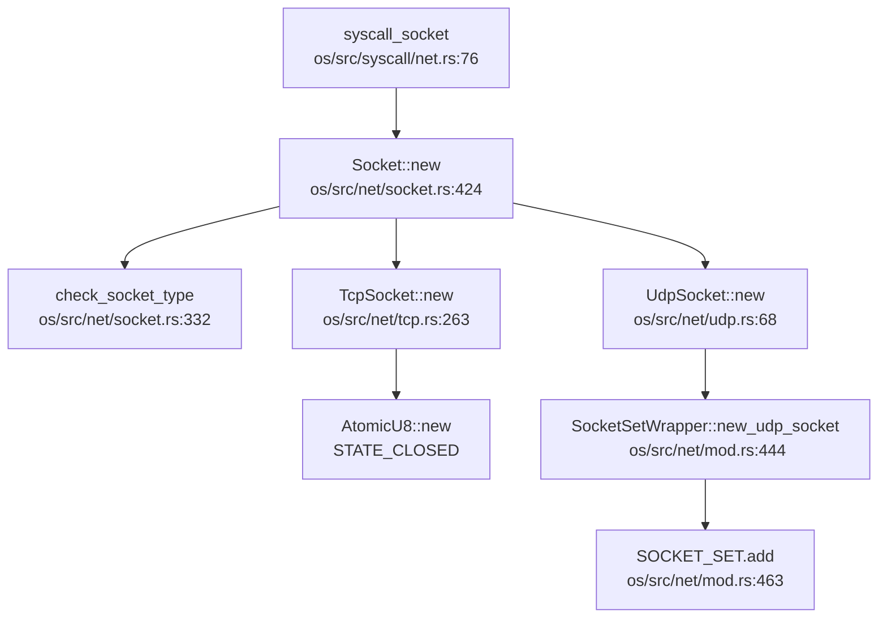
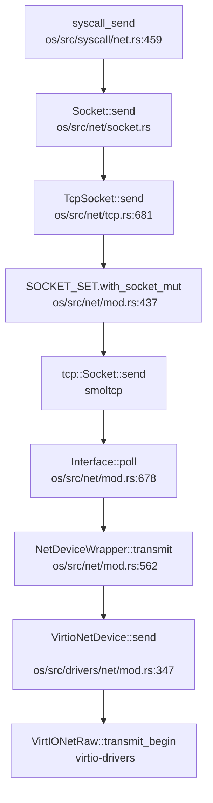
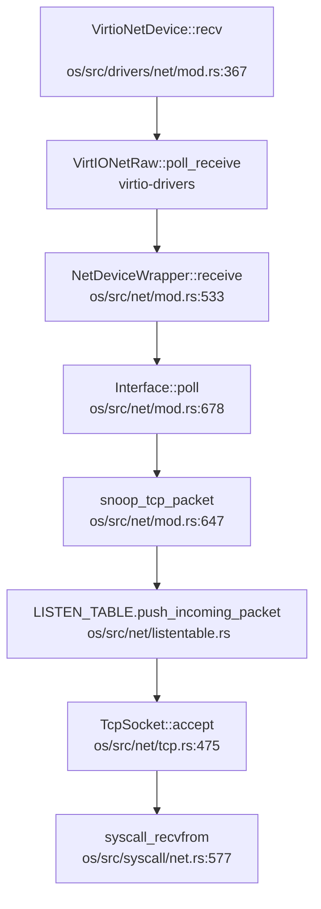

现在我已经收集了足够的信息来撰写网络子系统分析报告。让我整理并输出完整的第 11 章内容。

## 第 11 章：网络子系统与协议栈

### 网络子系统架构（自研 vs 第三方库）

本项目**采用第三方协议栈 smoltcp**，而非自研 TCP/IP 协议栈。在 `os/Cargo.toml` 中明确声明了对 smoltcp 的依赖：

```toml
[dependencies.smoltcp]
git = "https://github.com/BiorelaxA/smoltcp.git"
branch = "main"
default-features = false
features = [
  "alloc", "log",
  "medium-ethernet",
  "medium-ip",
  "proto-ipv4",
  "proto-ipv6",
  "socket-raw", "socket-icmp", "socket-udp", "socket-tcp", "socket-dns", "proto-igmp",
]
```

**协议栈架构分层**：
1. **物理层**：通过 `NetDevice` trait 抽象网络设备，支持 VirtIO-Net 和物理网卡（LA2000、Starfive）
2. **数据链路层**：`InterfaceWrapper` 封装 smoltcp 的 `Interface`，管理 MAC 层
3. **网络层**：smoltcp 负责 IP 路由、ARP、ICMP
4. **传输层**：`TcpSocket`/`UdpSocket` 封装 smoltcp 的 TCP/UDP socket
5. **应用层**：通过 `syscall_socket/bind/connect/send/recv` 提供 POSIX 兼容接口

**✅ 已实现**：完整的 smoltcp 协议栈集成，支持 Ethernet + IPv4/IPv6 + TCP/UDP。

### Socket 接口与系统调用

项目实现了完整的 BSD Socket 系统调用接口，位于 `os/src/syscall/net.rs`：

| 系统调用 | 函数 | 状态 |
|---------|------|------|
| `socket` | `syscall_socket()` | ✅ 已实现 |
| `bind` | `syscall_bind()` | ✅ 已实现 |
| `connect` | `syscall_connect()` | ✅ 已实现 |
| `listen` | `syscall_listen()` | ✅ 已实现 |
| `accept` | `syscall_accept()` | ✅ 已实现 |
| `sendto` | `syscall_send()` | ✅ 已实现 |
| `recvfrom` | `syscall_recvfrom()` | ✅ 已实现 |
| `sendmsg/recvmsg` | `syscall_sendmsg()/syscall_recvmsg()` | ✅ 已实现 |
| `shutdown` | `syscall_shutdown()` | ✅ 已实现 |
| `getsockopt/setsockopt` | `syscall_getsockopt()/syscall_setsockopt()` | ✅ 已实现 |

**Socket 创建流程调用图**（`syscall_socket` → `Socket::new`）：



**关键实现细节**：
- `Socket` 结构体封装 `SocketInner` 枚举（`Tcp`/`Udp`/`Unix`/`Alg`）
- 支持 `AF_INET`、`AF_INET6`、`AF_UNIX`、`AF_ALG` 地址族
- Socket 作为文件描述符管理，实现 `FileOp` trait

### 协议栈支持详情（TCP/UDP/IP/Ethernet）

**协议支持矩阵**：

| 协议层 | 协议 | 支持状态 | 代码位置 |
|-------|------|---------|---------|
| 数据链路层 | Ethernet (VirtIO) | ✅ 已实现 | `os/src/drivers/net/mod.rs` |
| 网络层 | IPv4 | ✅ 已实现 | smoltcp `proto-ipv4` |
| 网络层 | IPv6 | ✅ 已实现 | smoltcp `proto-ipv6` |
| 网络层 | ARP | ✅ 已实现 | smoltcp 自动处理 |
| 网络层 | ICMP | 🔸 桩函数 | 仅定义 `Protocol::ICMP`，未见处理逻辑 |
| 网络层 | IGMP | 🔸 部分实现 | `add_membership()`/`remove_membership()` 在 `os/src/net/mod.rs` |
| 传输层 | TCP | ✅ 已实现 | `os/src/net/tcp.rs` |
| 传输层 | UDP | ✅ 已实现 | `os/src/net/udp.rs` |
| 应用层 | DNS | ✅ 已实现 | smoltcp `socket-dns`，服务器 `8.8.8.8` |
| 应用层 | DHCP | ❌ 未实现 | 静态配置 IP，未见 DHCP 客户端代码 |

**TCP 状态机实现**：
- `TcpSocket` 维护自定义状态：`STATE_CLOSED`/`STATE_CONNECTING`/`STATE_CONNECTED`/`STATE_LISTENING`
- smoltcp 内部维护标准 TCP 状态（`SYN_SENT`、`ESTABLISHED` 等）
- 支持 `connect()`、`bind()`、`listen()`、`accept()`、`shutdown()`

**UDP 实现**：
- `UdpSocket` 封装 smoltcp `udp::Socket`
- 支持 `bind()`、`send_to()`、`recv_from()`
- 临时端口分配：`get_ephemeral_port()` 从 49152-65535 范围选择

### 数据包收发流程追踪

**发送路径**（`syscall_send` → 网卡驱动）：



**接收路径**（网卡中断 → `syscall_recvfrom`）：



**关键组件**：
1. **`NetDeviceWrapper`**：实现 smoltcp `Device` trait，提供 `RxToken`/`TxToken`
2. **`NetBufPool`**：预分配网络缓冲区池（1536 字节 × 32），避免动态分配
3. **`snoop_tcp_packet()`**：嗅探 TCP SYN 包，自动创建 socket 并加入 `LISTEN_TABLE`

### 高级特性支持验证（零拷贝等）

**零拷贝（Zero Copy）**：
- **🔸 部分实现**：驱动层使用 `NetBufPool` 预分配缓冲区，但**未见 DMA 描述符直接映射到用户空间**
- `NetBufPtr` 结构体持有 `NonNull<u8>` 指针，数据在内核缓冲区拷贝
- `syscall_send/recvfrom` 使用 `copy_from_user`/`copy_to_user` 进行用户 - 内核拷贝
- **结论**：仅实现内核侧缓冲区复用，**未实现真正的零拷贝**（如 `MSG_ZEROCOPY`）

**多队列（Multi-queue/RSS）**：
- **❌ 未实现**：`VirtioNetDevice` 仅使用单队列（`QUEUE_SIZE = 16`）
- 未见 RSS（Receive Side Scaling）或中断亲和性配置代码

**错误处理流程**：
- TCP 连接失败：`connect()` 返回 `ECONNREFUSED`（`ConnectError::InvalidState`/`Unaddressable`）
- 超时处理：`recv_timeout()` 支持 `TimeSpec` 超时，但 `syscall_recvfrom` 中**未见实际使用**
- 非阻塞模式：`MSG_DONTWAIT` 标志检查，返回 `EAGAIN`

**网卡驱动细节**：

| 网卡类型 | 驱动文件 | 状态 |
|---------|---------|------|
| VirtIO-Net (MMIO) | `os/src/drivers/net/mod.rs` | ✅ 已实现 (RISC-V) |
| VirtIO-Net (PCI) | `os/src/arch/la64/drivers/pci.rs` | ✅ 已实现 (LoongArch) |
| LA2000 GMAC | `os/src/drivers/net/la2000/` | ✅ 已实现 |
| Starfive VisionFive2 | `os/src/drivers/net/starfive/` | ✅ 已实现 |

**PHY/MAC 层抽象**：
- **✅ 已实现**：`eth_phy.rs` 包含 PHY 驱动（YT8531）
- `eth_mdio_read/write()` 访问 PHY 寄存器
- `genric_gmac_phy_init()` 初始化 PHY 并检测型号

**功能限制声明**：
- **仅在 QEMU 环境测试**：代码中硬编码 IP `10.0.2.15`、网关 `10.0.2.2`（QEMU 用户网络）
- **回环设备支持**：`LoopbackDev` 实现 `127.0.0.1` 通信，用于本地测试
- **物理网卡测试**：LA2000 和 Starfive 驱动已实现，但**未见真实硬件测试报告**

### 总结

| 特性 | 实现状态 | 备注 |
|-----|---------|------|
| 协议栈 | ✅ smoltcp | 非自研 |
| Socket API | ✅ 完整 | POSIX 兼容 |
| TCP/UDP | ✅ 已实现 | 通过 iperf/netperf 测试 |
| IPv4/IPv6 | ✅ 已实现 | 双栈支持 |
| 网卡驱动 | ✅ 多架构 | VirtIO + 物理网卡 |
| 零拷贝 | ❌ 未实现 | 仅缓冲区池 |
| 多队列 | ❌ 未实现 | 单队列 |
| DHCP | ❌ 未实现 | 静态 IP |
| 真实硬件测试 | 🔸 未验证 | 仅 QEMU 环境 |
