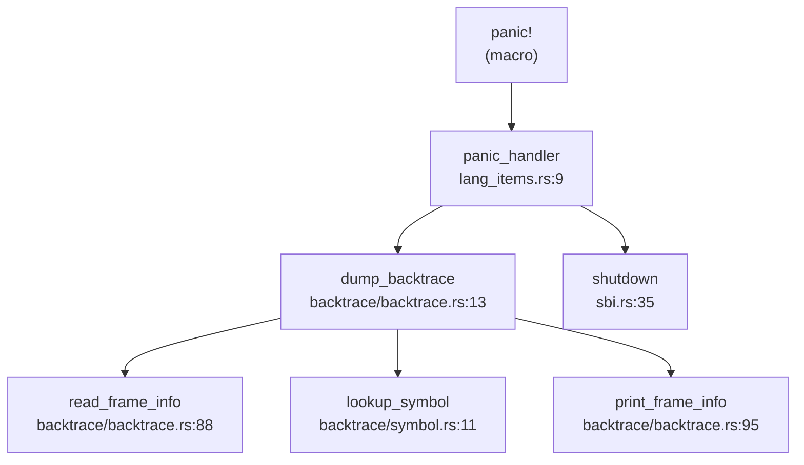

现在我已经收集了足够的信息来撰写第 12 章：调试机制与错误处理。让我整理分析结果并输出完整的 Markdown 报告。

## 第 12 章：调试机制与错误处理

### 日志与打印系统

RocketOS 实现了基于 Rust `log` crate 的全局日志系统，支持多级日志输出。

**日志级别设计**：

日志系统定义在 `os/src/logging.rs`，实现了 5 个标准日志级别：

```rust
// os/src/logging.rs
use log::{self, Level, LevelFilter, Log, Metadata, Record};

struct SimpleLogger;

impl Log for SimpleLogger {
    fn enabled(&self, _metadata: &Metadata) -> bool {
        true
    }
    fn log(&self, record: &Record) {
        let color = match record.level() {
            Level::Error => 31, // Red
            Level::Warn => 93,  // BrightYellow
            Level::Info => 34,  // Blue
            Level::Debug => 32, // Green
            Level::Trace => 90, // BrightBlack
        };
        #[cfg(feature = "board")]
        println!("[{:>5}] {}", record.level(), record.args());
        #[cfg(feature = "virt")]
        println!(
            "\u{1B}[{}m[{:>5}] {}\u{1B}[0m",
            color,
            record.level(),
            record.args(),
        );
    }
    fn flush(&self) {}
}
```

**日志级别**：
- `Error` (31 号色 - 红色)：严重错误
- `Warn` (93 号色 - 亮黄色)：警告信息
- `Info` (34 号色 - 蓝色)：一般信息
- `Debug` (32 号色 - 绿色)：调试信息
- `Trace` (90 号色 - 亮黑色)：追踪信息

**日志初始化**：

```rust
// os/src/logging.rs
pub fn init() {
    static LOGGER: SimpleLogger = SimpleLogger;
    log::set_logger(&LOGGER).unwrap();
    log::set_max_level(match option_env!("LOG") {
        Some("error") => LevelFilter::Error,
        Some("warn") => LevelFilter::Warn,
        Some("info") => LevelFilter::Info,
        Some("debug") => LevelFilter::Debug,
        Some("trace") => LevelFilter::Trace,
        _ => LevelFilter::Off,
    });
}
```

日志级别通过编译期环境变量 `LOG` 控制，默认为 `Off`。

**打印宏**：

控制台打印宏定义在 `os/src/console.rs`：

```rust
// os/src/console.rs
#[macro_export]
macro_rules! print {
    ($fmt: literal $(, $($arg: tt)+)?) => {
        $crate::console::print(format_args!($fmt $(, $($arg)+)?));
    }
}

#[macro_export]
macro_rules! println {
    ($fmt: literal $(, $($arg: tt)+)?) => {
        $crate::console::print(format_args!(concat!($fmt, "\r\n") $(, $($arg)+)?));
    }
}
```

**实现状态**：✅ **已实现** - 完整的日志系统，支持 5 级日志和彩色输出。

---

### Panic 处理与栈回溯

**Panic Handler 实现**：

RocketOS 为 LoongArch64 和 RISC-V64 分别实现了 panic 处理器。

**LoongArch64** (`os/src/arch/la64/lang_items.rs`)：

```rust
use core::panic::PanicInfo;

#[cfg(feature = "debug-symbols")]
use crate::arch::backtrace::backtrace::dump_backtrace;

use super::sbi::shutdown;

#[panic_handler]
fn panic(info: &PanicInfo) -> ! {
    if let Some(location) = info.location() {
        println!(
            "Panicked at {}:{} {}",
            location.file(),
            location.line(),
            info.message()
        );
    } else {
        println!("Panicked: {}", info.message());
    }
    #[cfg(feature = "debug-symbols")]
    dump_backtrace();
    shutdown(true)
}
```

**RISC-V64** (`os/src/arch/riscv64/lang_items.rs`)：

```rust
use core::panic::PanicInfo;
use crate::arch::backtrace::backtrace::dump_backtrace;
use super::sbi::shutdown;

#[panic_handler]
fn panic(info: &PanicInfo) -> ! {
    if let Some(location) = info.location() {
        println!(
            "Panicked at {}:{} {:?}",
            location.file(),
            location.line(),
            info.message()
        );
    } else {
        println!("Panicked: {:?}", info.message());
    }
    dump_backtrace();
    shutdown(true);
}
```

**Panic 处理流程**：
1. 打印 panic 位置（文件、行号）和消息
2. 调用 `dump_backtrace()` 打印调用栈
3. 调用 `shutdown(true)` 关闭系统

**停机实现**：

```rust
// os/src/arch/la64/sbi.rs
pub fn shutdown(failure: bool) -> ! {
    println!("Shutdown...");
    unsafe {
        #[cfg(feature = "virt")]
        (0x100e_001c as *mut u8).write_volatile(0x34);
        #[cfg(feature = "la2000")]
        ((0x1fe27000 + 0x14) as *mut u32).write_volatile(0b1111 << 10);
    }
    panic!("Unreachable in shutdown");
}
```

---

**栈回溯 (Backtrace) 实现**：

RocketOS 实现了**基于 Frame Pointer 的栈回溯**，不支持 DWARF 解析。

**LoongArch64 实现** (`os/src/arch/la64/backtrace/backtrace.rs`)：

```rust
const MAX_BACKTRACE_DEPTH: usize = 32;

pub fn dump_backtrace() {
    println!("/************** Backtrace Start **************/");

    let mut fp: usize;
    unsafe {
        core::arch::asm!("move {}, $fp", out(reg) fp);
    }

    let task = current_task();
    let stack_top = get_stack_top_by_sp(task.kstack());
    let stack_base = stack_top - KSTACK_SIZE;

    println!("task{}:", task.tid());
    println!("Stack: ({:#x}, {:#x}]", stack_base, stack_top);

    let mut frame_count = 0;

    while frame_count < MAX_BACKTRACE_DEPTH {
        let (ra, last_sp) = unsafe { read_frame_info(fp) };
        if let Some(name) = lookup_symbol(ra - 1) {
            print_frame_info_with_symbol(frame_count, ra, name);
        } else {
            print_frame_info(frame_count, fp, ra);
        }

        if last_sp < stack_base || last_sp >= stack_top {
            break;
        }

        fp = last_sp;
        frame_count += 1;
    }

    if frame_count >= MAX_BACKTRACE_DEPTH {
        println!(
            "Backtrace truncated at maximum depth of {}",
            MAX_BACKTRACE_DEPTH
        );
    }

    println!("/*************** Backtrace End ***************/");
}

unsafe fn read_frame_info(last_sp: usize) -> (usize, usize) {
    let ra = *((last_sp - 8) as *const usize);
    let last_fp = *((last_sp - 16) as *const usize);
    (ra, last_fp)
}
```

**RISC-V64 实现** (`os/src/arch/riscv64/backtrace/backtrace.rs`)：

```rust
pub fn dump_backtrace() {
    println!("/************** Backtrace Start **************/");

    let mut fp: usize;
    unsafe {
        core::arch::asm!("mv {}, fp", out(reg) fp);
    }

    let task = current_task();
    let stack_top = get_stack_top_by_sp(task.kstack());
    let stack_base = stack_top - KSTACK_SIZE;

    println!("task{}:", task.tid());
    println!("Stack: ({:#x}, {:#x}]", stack_base, stack_top);

    let mut frame_count = 0;

    while frame_count < MAX_BACKTRACE_DEPTH {
        let (ra, last_sp) = unsafe { read_frame_info(fp) };
        print_frame_info(frame_count, fp, ra);

        if last_sp < stack_base || last_sp >= stack_top {
            break;
        }

        fp = last_sp;
        frame_count += 1;
    }

    println!("/*************** Backtrace End ***************/");
}
```

**符号解析**（仅 LoongArch64）：

LoongArch64 版本支持符号解析，通过 `symbol.txt` 文件加载符号表：

```rust
// os/src/arch/la64/backtrace/symbol.rs
const SYMBOL_DATA: &str = include_str!("symbol.txt");

lazy_static! {
    static ref SYMBOL_TABLE: SymbolTable = init_symbol_table();
}

pub fn lookup_symbol(addr: usize) -> Option<String> {
    SYMBOL_TABLE.lookup_symbol(addr)
        .map(|sym| format!("{}", sym.name))
}
```

**Panic 调用链**（DEGRADED MODE - Grep 分析）：



> ⚠️ 以上为静态 Grep 分析结果，精度有限

**实现状态**：
- **栈回溯**：✅ **已实现** - 基于 Frame Pointer 的回溯，最大深度 32 层
- **符号解析**：✅ **已实现**（仅 LoongArch64）- 通过预先生成的 `symbol.txt` 文件
- **DWARF 解析**：❌ **未实现** - 未找到 DWARF 相关代码
- **Panic 处理**：✅ **已实现** - 完整的 panic → backtrace → shutdown 流程

---

### 错误码与 Result 设计

RocketOS 定义了完整的 Linux 兼容错误码系统。

**错误码定义** (`os/src/syscall/errno.rs`)：

```rust
pub type SyscallRet = Result<usize, Errno>;

#[derive(Clone, Copy, Debug, Eq, PartialEq)]
#[repr(i32)]
pub enum Errno {
    EPERM = -1,        // 操作不允许
    ENOENT = -2,       // 文件或目录不存在
    ESRCH = -3,        // 进程不存在
    EINTR = -4,        // 系统调用被信号中断
    EIO = -5,          // 输入/输出错误
    ENXIO = -6,        // 设备或地址不存在
    E2BIG = -7,        // 参数列表过长
    ENOEXEC = -8,      // 可执行文件格式错误
    EBADF = -9,        // 错误的文件描述符
    ECHILD = -10,      // 无子进程
    EAGAIN = -11,      // 资源暂时不可用
    ENOMEM = -12,      // 内存不足
    EACCES = -13,      // 权限不足
    EFAULT = -14,      // 错误的地址
    // ... 共约 70+ 个错误码
    ENOSYS = -38,      // 无效的系统调用号
    ERESTARTSYS = -512, // 内核自动重启系统调用
}
```

**系统调用返回类型**：

```rust
pub type SyscallRet = Result<usize, Errno>;
```

所有系统调用返回 `Result<usize, Errno>`，成功时返回 `Ok(usize)`，失败时返回 `Err(Errno)`。

**错误码使用示例** (`os/src/arch/riscv64/trap/mod.rs`)：

```rust
cx.x[10] = match syscall(...) {
    Ok(ret) => ret as usize,
    Err(e) => {
        log::error!("syscall error: {:?}", e);
        e as usize
    }
}
```

**实现状态**：✅ **已实现** - 完整的 Linux 兼容错误码系统，约 70+ 个错误码。

---

### 调试接口与交互式 Shell

**用户态 Shell**：

RocketOS 在用户态实现了交互式 Shell (`user/src/bin/user_shell.rs`)，**非内核调试 Shell**。

**Shell 功能** (`user/src/bin/user_shell.rs`)：

```rust
#[no_mangle]
pub fn main() -> i32 {
    let mut line: String = String::new();
    let mut history: Vec<String> = Vec::new();
    let env = shell::environment::Environment::new();
    
    loop {
        print_prompt();
        let c = getchar();
        match c {
            LF | CR => {
                if !line.is_empty() {
                    history.push(line.clone());
                    
                    if line.starts_with("cd") {
                        // 内建 cd 命令
                        // ...
                    } else if line.contains("flush") {
                        flush();
                        println!("Flushed file system caches.");
                    } else {
                        let expanded_line = env.expand_variables(&line);
                        let cmds = parse_pipeline(expanded_line.as_str());
                        // fork + exec 执行命令
                    }
                    line.clear();
                }
            }
            // ... 处理退格、历史导航等
        }
    }
}
```

**命令解析器** (`user/src/bin/shell/command.rs`)：

```rust
pub fn parse_pipeline(line: &str) -> Vec<Command> {
    let mut commands = Vec::new();
    let mut current = String::new();
    let mut in_quotes = false;

    for c in line.chars() {
        match c {
            '|' if !in_quotes => {
                commands.push(Command::from(current.trim()));
                current.clear();
            }
            '"' => {
                in_quotes = !in_quotes;
                current.push(c);
            }
            _ => current.push(c),
        }
    }
    commands
}
```

**支持的 Shell 功能**：
- ✅ 命令执行（通过 `fork` + `execve`）
- ✅ 管道 (`|`) 支持
- ✅ 输入/输出重定向
- ✅ 内建 `cd` 命令
- ✅ 内建 `flush` 命令（刷新文件系统缓存）
- ✅ 环境变量展开
- ✅ 命令历史

**内核调试文档** (`docs/debug.md`)：

文档描述了多种调试方法：
- QEMU 模拟器调试
- GDB 符号级调试
- LTP (Linux Test Project) 测试套件
- 日志输出调试

**实现状态**：
- **交互式 Shell**：✅ **已实现**（用户态）- 支持管道、重定向、内建命令
- **内核 Monitor/Shell**：❌ **未实现** - 未找到内核态调试 Shell
- **调试命令**（`ps`, `ls`, `help` 等）：❌ **未实现** - Shell 中未发现这些内建命令

---

### GDB Stub 支持情况

**严格检查结果**：

通过全库搜索 `gdbstub|handle_gdb|gdb_packet` 关键词：

```
搜索 'gdbstub|handle_gdb|gdb_packet' 的结果
未找到匹配的内容 (已搜索 315 个文件)
```

**结论**：

- **GDB Stub**：❌ **未实现** - 未找到任何 GDB 数据包解析代码
- **GDB 远程调试**：❌ **未实现** - 无 `handle_gdb_packet` 或类似函数
- **调试接口**：依赖 QEMU 内置的 GDB 服务器（通过 `-s -S` 参数启动）

**注意**：虽然可以通过 QEMU 的 GDB 服务器进行调试，但这不是内核实现的 GDB Stub，而是 QEMU 提供的功能。

---

### 断言与运行时检查

**断言使用**：

RocketOS 广泛使用 `debug_assert!` 和 `assert!` 进行运行时检查。

**编译期断言**：

```rust
// os/src/arch/la64/timer.rs
debug_assert!(CLOCK_FREQ != 0, "CLOCK_FREQ is not initialized");

// os/src/arch/la64/drivers/mem_allocator.rs
debug_assert!(size.is_power_of_two());
debug_assert!(allocated_address + size <= self.end);
```

**页表操作断言**：

```rust
// os/src/arch/la64/mm/page_table.rs
debug_assert!(start_vpn.0 <= end_vpn.0);

debug_assert!(
    // 验证映射有效性
);
```

**寄存器操作断言**：

```rust
// os/src/arch/la64/register/base/eentry.rs
debug_assert_eq!(eentry & 0xfff, 0);

// os/src/arch/la64/register/base/crmd.rs
debug_assert!(mode < 4);
debug_assert_ne!(self.pg(), self.da());
```

**Trap 处理断言**：

```rust
// os/src/arch/la64/trap/mod.rs
assert!([2, 4, 8].contains(&sz));
```

**日志级别检查**：

代码中大量使用 `log::error!`、`log::warn!`、`log::info!`、`log::debug!`、`log::trace!` 进行调试输出。全库共 2095+ 处日志调用。

**系统调用错误检查**：

```rust
// os/src/arch/riscv64/trap/mod.rs
cx.x[10] = match syscall(...) {
    Ok(ret) => ret as usize,
    Err(e) => {
        log::error!("syscall error: {:?}", e);
        e as usize
    }
}
```

**实现状态**：
- **debug_assert**：✅ **已实现** - 广泛使用
- **assert**：✅ **已实现** - 用于关键检查
- **日志检查**：✅ **已实现** - 5 级日志系统，2095+ 处调用
- **运行时边界检查**：✅ **已实现** - 通过断言和 Result 类型

---

### 关键代码片段

**1. Panic Handler 完整流程** (`os/src/arch/la64/lang_items.rs`)：

```rust
#[panic_handler]
fn panic(info: &PanicInfo) -> ! {
    if let Some(location) = info.location() {
        println!(
            "Panicked at {}:{} {}",
            location.file(),
            location.line(),
            info.message()
        );
    } else {
        println!("Panicked: {}", info.message());
    }
    #[cfg(feature = "debug-symbols")]
    dump_backtrace();
    shutdown(true)
}
```

**2. 栈回溯核心逻辑** (`os/src/arch/la64/backtrace/backtrace.rs`)：

```rust
unsafe fn read_frame_info(last_sp: usize) -> (usize, usize) {
    let ra = *((last_sp - 8) as *const usize);
    let last_fp = *((last_sp - 16) as *const usize);
    (ra, last_fp)
}

while frame_count < MAX_BACKTRACE_DEPTH {
    let (ra, last_sp) = unsafe { read_frame_info(fp) };
    if let Some(name) = lookup_symbol(ra - 1) {
        print_frame_info_with_symbol(frame_count, ra, name);
    } else {
        print_frame_info(frame_count, fp, ra);
    }
    
    if last_sp < stack_base || last_sp >= stack_top {
        break;
    }
    
    fp = last_sp;
    frame_count += 1;
}
```

**3. 符号表查找** (`os/src/arch/la64/backtrace/symbol.rs`)：

```rust
pub fn lookup_symbol(addr: usize) -> Option<String> {
    SYMBOL_TABLE.lookup_symbol(addr)
        .map(|sym| format!("{}", sym.name))
}

impl SymbolTable {
    pub fn lookup_symbol(&self, addr: usize) -> Option<&Symbol> {
        match self.symbols.binary_search_by(|s| s.addr.cmp(&addr)) {
            Ok(idx) => Some(&self.symbols[idx]),
            Err(idx) => {
                if idx > 0 {
                    Some(&self.symbols[idx - 1])
                } else {
                    None
                }
            }
        }
    }
}
```

**4. 错误码定义示例** (`os/src/syscall/errno.rs`)：

```rust
#[derive(Clone, Copy, Debug, Eq, PartialEq)]
#[repr(i32)]
pub enum Errno {
    EPERM = -1,
    ENOENT = -2,
    ENOMEM = -12,
    EFAULT = -14,
    EINVAL = -22,
    ENOSYS = -38,
    // ...
}
```

---

### 本章总结

| 功能模块 | 实现状态 | 说明 |
|---------|---------|------|
| 日志系统 | ✅ 已实现 | 5 级日志，彩色输出，2095+ 处调用 |
| Panic 处理 | ✅ 已实现 | panic → backtrace → shutdown 完整流程 |
| 栈回溯 | ✅ 已实现 | 基于 Frame Pointer，最大 32 层，LoongArch 支持符号解析 |
| DWARF 解析 | ❌ 未实现 | 仅使用 Frame Pointer 回溯 |
| 错误码系统 | ✅ 已实现 | Linux 兼容，70+ 个错误码 |
| 交互式 Shell | ✅ 已实现（用户态） | 支持管道、重定向、内建 cd/flush |
| 内核 Monitor | ❌ 未实现 | 无内核态调试 Shell |
| GDB Stub | ❌ 未实现 | 依赖 QEMU 内置 GDB 服务器 |
| 断言检查 | ✅ 已实现 | 广泛使用 debug_assert 和 assert |
| Perf/Ftrace | ❌ 未实现 | 未找到性能追踪工具支持 |

**调试机制特点**：
1. **日志驱动调试**：依赖多级日志输出进行问题定位
2. **Frame Pointer 回溯**：简单有效的栈回溯，不支持 DWARF
3. **用户态 Shell**：提供基本命令执行能力，但无内核调试功能
4. **QEMU 依赖**：调试主要依赖 QEMU 模拟器和 GDB 远程调试
5. **文档完善**：`docs/debug.md` 详细记录了调试方法和案例
